# 第1天

**网络、线缆、OSI 以及 TCP 模型**

**Networks, Cables, OSI, and TCP Models**

## 第一天的任务

- 阅读今天的课程内容
- 阅读 ICND1 cram 指南


今天你将学到以下内容：

- 各种网络设备及网络图表
- OSI 和 TCP 模型
- 各种线缆和传输介质
- 连接到一台路由器


此模块覆盖了 ICND1 大纲要求的以下内容：

- 了解各种不同网络设备，如路由器、交换机、网桥及集线器等的用途和功能
- 选出需要的部件来满足指定规格网络的需求
- 区分常见的不同应用，以及它们对网络的影响
- 描述 OSI 和 TCP 模型中众多协议的目的及其运作过程
- 预测网络上两台主机之间数据流的走向
- 找出合适的传输媒介、线缆、接口以及连接器以将思科网络设备连接到局域网上的其它网络设备和主机

## 网络设备

作为一名网络工程师，你将用到很多网络线缆及其它传输媒介。你需要知道哪些线缆能够与 WAN、LAN 上的设备和接口，以及管理端口工作起来。如果你之前曾学过 CompTIA Network+, 那么这些知识将会是对其的复习。

### 常见的网络设备

**网络交换机**

就在几年前，网络仍是相当小型的。这就意味着你只需简单地将所有设备查到一台或几台集线器上就够了。集线器的作用是在需要对信号放大时对其放大，然后传至所有其它插上集线器的设备。问题在于，一条只希望传给某台特定主机的消息，被传给了成百上千台网络上的主机。

网络交换机是更为智能版的集线器。交换机使用内容可寻址存储器(Content Addressable Memory, CAM), 因此可以记住设备所插入的端口。思科公司生产的交换机被设计可用于从小型机构到有数千台设备的大型企业网络。

交换机的基本功能是利用设备的 MAC 地址（第二层）和 IP 地址（第三层）来运行，它们也能完成更为复杂的一些工作，比如包括基于 permit/deny、协议及端口号（第四层），还有综合各层及其它方面的策略和规则的处理列表（porcessing lists）。

早期版本的交换机又被叫做网桥。网桥查看数据帧的源端口和 MAC 地址，以建立一个表并做出转发决定。在网桥上，有相应软件来访问这个表，在交换机上，则是由硬件（专用集成电路， Application Specific Integreated Chips, ASIC）去访问 CAM 表。因此交换机可以看成是一台多端口网桥。

采行交换机可以将你的网络划分成更小的、更可管理的部分（就是网段，segments）。进而允许单位内部的不同部门，比如人力资源、财务、法务等等，得以同时在各自的网段上工作，这是十分有用的，因为同一部门的设备大部分时间都是用于各自之间的通信。


*图 1.1 -- 思科 2960 交换机*

每台设备都连接到交换机的一个接口上，这样的接口被称为“端口(port)”。常见的接口速度为 100Mbps 或 1000Mbps(又叫做 1Gbps)。通常有用于连接到另一交换机的光纤端口。每台交换机又有各自的管理端口，用于连接计算机，完成初始配置并获得通过网络进行维护的访问能力。

图 1.2 展示的是一台思科 2960 交换机的近景。2960 系列有多个型号，以满足从小型到中型企业的需求。

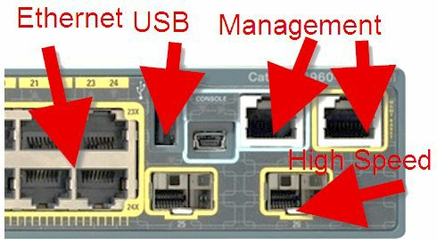

*图 1.2 -- 交换机接口类型*

通过交换机，你还可以更好地使用 IP 电话，因为交换机端口能够通过端口为其供电（使用 PoE 接口）。基本的网络交换机用于：

- 连接诸如打印机和 PC 这样的网络设备
- 赋予网络服务器和路由器网络访问
- 使用 VLAN 对网络进行划分

VLAN 就是虚拟局域网。

**路由器**

作为一名思科工程师，你将耗费大量时间来对路由器进行安装、配置以及故障排除。为此，CCNA 大纲超过半数的内容都是用于学习路由器配置的。

路由器（如图 1.3 所示）是用于建立网络的设备。与负责同一网络上的设备相互通信的交换机不同，路由器实现不同网络上的设备之间的通信。老旧型号的路由器上只有端口，这些端口都是物理内建与其中，固定在主板上的。这样的路由器仍然时不时的可以见到，但现代网络需要路由器具备 IP 电话、交换及安全以及能够连接到不同类型电讯公司的功能。因此，路由器是模块化的了，这就是说你有路由器机架和一些空着的插槽，能够连接大量的路由或交换模块。


*图 1.3 -- 一台模块化路由器，右边有一个空着的插槽*

**怎样在图表中表示网络**

所有网络工程师都需要一种通用的方法来进行沟通，尽管在不同企业和电讯公司会用到不同的方法。如果我必须要就我的网络拓扑向你征询设计或安全方面的建议，比起我随手画出的来，如有某种一致认可的格式，肯定会来得更好。CCDA（Cisco Certified Design Associate, 思科认证的设计助理） 考试中有更多关于网络拓扑方面的知识。

下面是一些在你作为网络工程师将会遇到的那些网络设备的符号。


*路由器，routers*


*交换机，switch*

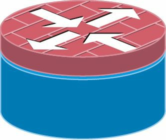

*有防火墙的路由器*

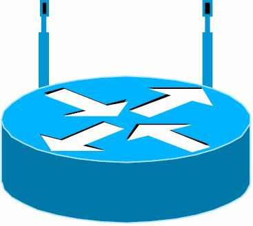

*无线路由器*


*多层交换机*


*云--电讯端设备*


*终端设备 -- 一台 PC/串行线/以太网连接*


*IP 电话*


*防火墙*

### 局域网和广域网拓扑

拓扑是指设备以何种方式进行安排，以实现通信。会因设备使用的通信协议、造价、地理分布及诸如考虑主要线路的失效所需的冗余需求等其它因素，而确定拓扑。

你也会注意到，物理拓扑和逻辑拓扑通常会有不同。物理拓扑是你所看到的网络的样子，逻辑拓扑是网络自身的样子。下面是最为常见的拓扑类型。

**点对点（point-to-point）**

此种拓扑主要用在广域网中。一条点对点链路即是简单的一台设备到另一设备的连接。你可以在两台设备之间再增加一条连接，但如果设备本身失效的话，你仍将失去连通性。

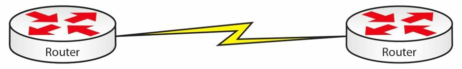

*图 1.4 -- 点对点拓扑*

**总线拓扑**

伴随初代以太网的建立，诞生了此种拓扑，所有设备都必须连接到一条粗同轴线（a thick cable），这条粗同轴线被称为主干(the backbone)。如主干失效，则网络就会失效。如一条连接设备主干的同轴线失效，则只有该设备将失去连接。


*图 1.5 -- 总线拓扑*

**星形拓扑**

这或许是你将遇到的最为常见的拓扑。每台网络设备都被连接到一台中心集线器或交换机。如果其中一台设备的线缆失效，则只有该设备会失去连接。


*图 1.6 -- 星形拓扑*

**环形拓扑**

令牌环网络（token ring networks）和光纤分布式数据接口网络（Fiber Distributed Data Interface, FDDI）网络使用此种拓扑，而两种网络在多年前就已被弃用了。


*图 1.7 -- 令牌环拓扑*

FDDI 网络中会用到双环连接的环形拓扑，以提供在一个环失效时的冗余。


*图 1.8 -- 双环拓扑*

**网状拓扑**

在不容许出现故障时间（downtime）时，就要考虑使用此种拓扑。完全的网状网络中每台设备都有一条到其它设备的连接。这种方案一般用在广域连接上。

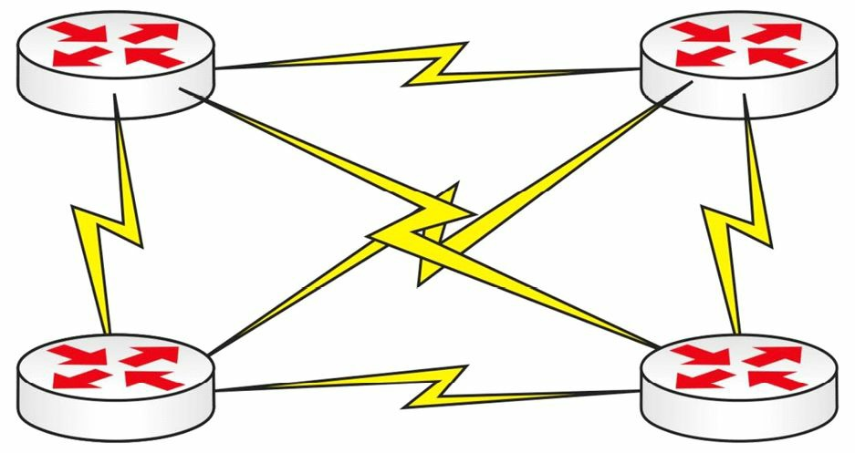

*图 1.9 -- 完全的网状拓*

通常这样的方案是非常费钱的。为此，会考虑采用部分网状拓扑。此时，一台设备到其它设备之间将会有一跳（hops）或几跳，它们之间会有一台以上的路由器。


*图 1.10 -- 部分网状拓扑*

**辐射状拓扑（Hub-and-Spoke）**

因为设备造价、广域网连接和带宽租用成本两原因，商业公司通常采用这种拓扑。一台性能强大的路由器通常会安放到位于公司综合的中心（hub）。而分支（spokes）代表公司的各分支机构，只需不那么强大的路由器。这种拓扑显然有着一些问题；但仍是广泛使用的拓扑。在帧中继（Frame Relay）内部分，我们会相信讨论这种拓扑，因为由它所引出的路由问题，占了 CCNA 考试大纲很很大篇章。

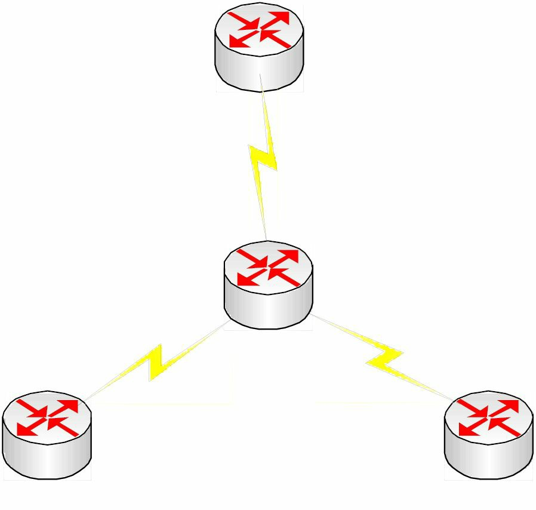

*图 1.11 -- 辐射状拓扑（Hub-and-Spoke Topology）*

**物理和逻辑拓扑的关系**

在你能看到网络设备时，你看到的就是物理拓扑。这会产生误导，比如明明看起来网络是以星形样式布线的，实际上确是以环形逻辑方式运行。环形网络就是一个极好的例子。尽管流量沿在流转，所有设备却是插入的一台集线器。在令牌环集线器中实际上有个环，只是你不能从外面看到，就如同下图 1.12 所示。

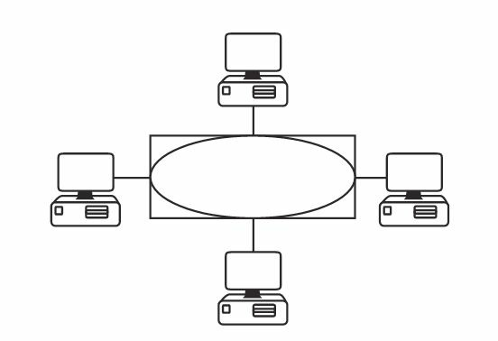

*图 1.12 -- 环是在集线器内部*

考试中你可能会要求从物理上和逻辑上去区分不同的网络。记住物理拓扑是你看到的网络，而逻辑拓扑是网络本身所见到的网络。表 1.1 对其进行了总结。

*表 1.1 -- 物理和逻辑拓扑*

<table style="width: 100%">
<tr>
<th>拓扑</th><th>物理</th><th>逻辑</th>
</tr>
<tr>
<td>总线</td><td>总线</td><td>总线</td>
</tr>
<tr>
<td>星形</td><td>星形</td><td>总线</td>
</tr>
<tr>
<td>令牌环</td><td>星形</td><td>环形</td>
</tr>
<tr>
<td>点对点</td><td>总线</td><td>总线</td>
</tr>
<tr>
<td>FDDI</td><td>环形</td><td>环形</td>
</tr>
</table>

## OSI 和 TCP 模型

开放标准互连（Open Standards Interconnection, OSI）是有国际标准化组织创建的。伴随技术喷发，网络设备和网络软件行业兴起了几家巨头，包括思科、微软、Novell、IBM、惠普、苹果以及其它几家公司。每家都有自己的线缆和端口类型，允许各自的商业性协议。此时，如你从一家买路由器、另一家买交换机，又从别家买服务器，就会出现兼容性问题。

有一些处理这些问题的通容办法，比如在网络上部署网关来转换不同的协议，这会导致性能上的瓶颈（比如网络慢速部分）并会令到故障排除十分困难和费时。最终，厂商们不得不达成一个在各自产品上都能工作的通用标准，一套叫做 TCP/IP 的免费协议包。最后，那些未能采行 TCP/IP 的厂商失去市场份额，走向破产。

ISO 创建出 OSI 模型，以助力于各厂商就通用标准达成一致，实现厂商之间的兼容。此模型包括了将总多网络功能分解为一套逻辑分层，或通俗地称为层的东西。各层只需完成其特定的一些功能，比如说你的公司专注于防火墙，那么这些防火墙将自然地与其它厂商的设备一起工作。

此模型的优势在于每件设备设计用来出色完成一个角色，而非不充分地完成多个角色。客户可以根据其解决方案选出最好的设备，而不用死栓在一家厂商那里。同时故障排除也变得更为容易，因为确定的出错可被追踪到具体的某层。

OSI 模型将所有网络功能划分为七个不同的层。该层次化模型从第七层一路去往第一层。那些离用户更近、更为复杂的功能，在顶部，一直到处于底层的网络线缆规格，如同表 1.2 所示。

*表 1.2 OSI 模型*
<table>
<tr>
<th>层 #</th><th>层名</th>
</tr>
<tr><td>7</td><td>应用层，Application</td></tr>
<tr><td>6</td><td>表示层, Presentation</td></tr>
<tr><td>5</td><td>会话层, Session</td></tr>
<tr><td>4</td><td>传输层, Transport</td></tr>
<tr><td>3</td><td>网络层, Network</td></tr>
<tr><td>2</td><td>数据链路层, Data Link</td></tr>
<tr><td>1</td><td>物理层, Physical</td></tr>
</table>

"**A**ll **P**eople **S**eem **T**o **N**eed **D**ata **P**rocessing"

在数据为通过物理网络介质传输而自顶层传至底层时，数据被放入不同的逻辑数据套盒子。尽管我们常把这些数据盒子称作“包（packets）”, 实际上根据其处于 OSI 不同的层而有不同的名称（如图 1.13 所示）。从 OSI 模型往下的数据处理，叫做封装（见图 1.13）。而往上的处理中从盒子里取出数据的过程，叫做解封装。

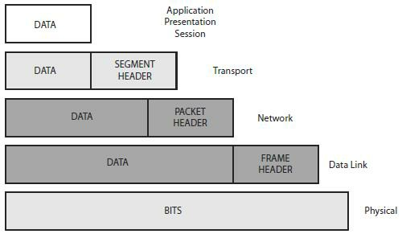

*图 1.13 -- 封装*

CCNA 考试要求你理解 OSI 模型，以及各层有哪些应用和协议。同时也要求你能够运用 OSI 层次化方法到故障排除中。

**第七层 -- 应用层**

这是到你我这些终端用户最近的层。应用层并非操作系统，但它通常提供了诸如 e-mail(SMTP 以及 POP3)、web 浏览（使用 HTTP）、以及文件传输服务（使用 FTP）。应用层决定了资源的可用性。

**表示层**

表示层将数据提供给应用层。多媒体技术工作在这一层，你可以想到 MP4、JPEG、GIF 等等。而加密、解密以及数据压缩都发生在这一层。

**会话层**

会话层的角色是建立、管理及中断设备之间的会话。这些动作发生在逻辑链路上，而真正干的事情是将两个软件应用程序连接起来。SQL、RPC 以及 NFS 都工作于会话层。

**传输层**

传输层的角色是将来自更高层的数据分拆成被称为数据段（segments）的更小片。虚电路（virtual circuits）在这里建立，在设备之间能够通信之间有赖于虚电路的建立。

在数据得以跨网络传输前，传输层需要确认多少数据能发往远端设备。这取决于端到端链路的速率和可靠性。如你有一条高速链路，而终端用户只有一条低速链路，数据仍然需要以较小数据块进行发送。

以下是三种控制数据流的方法：
- 流控 flow control
- 窗口机制 windowing
- 通告机制 acknowledgements

**流控**

如发往接收系统的信息多于它所能处理的量时，它将请求发送系统暂停一段时间。这一般发生在一段使用宽带而另一端使用拨号上网的时候。这个用于通知其它设备停止的包叫做源抑制消息（a source quench message）。

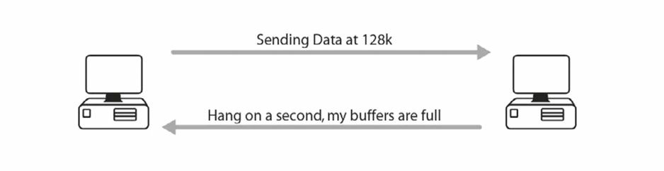

*图 1.14 -- 流控*

**窗口机制**

窗口机制下，每个系统就能在收到应答（acknowledgement）前发送多少数据达成一致。"窗口"随着数据的传输时开时合，以维持一个持续的数据流。

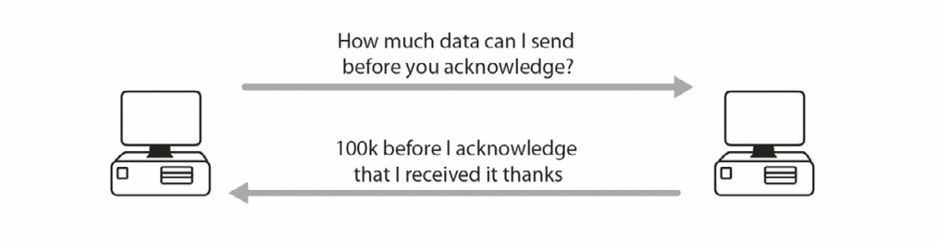

*图 1.15 -- 窗口机制*

**通告机制**

在收到一定数量的数据段后，接收端需要就这些数据段的安全抵达和顺序正确，通告发送端。

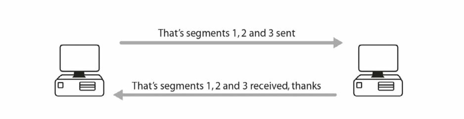

*图 1.16 -- 通告机制*

这些都是在一个叫做三次握手（a three-way handshake）的过程中达成一致（见图 1.17）。你要发出一个包来建立会话。第一个包叫做同步(synchronise, SYN)包。远端设备以同步应答（a synchronise acknowledgement, SYN-ACK）包予以回应。第三步的应答包（acknowledgement, ACK）的发出标志着会话的建立。这都是通过 TCP 业务完成的。

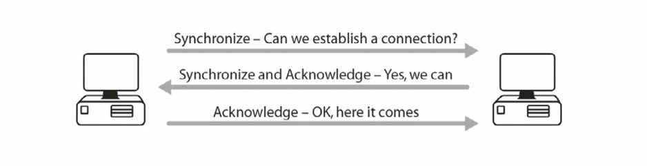

*图 1.17 -- 三次握手*

传输层包含了好几个协议，其中最熟知的是传输控制协议（Tranmission Control Protocol, TCP）和用户数据报协议（User Datagram Protocol, UDP）, 它们都是 TCP/IP 协议包的组成部分。这个协议包因为是互联网所使用的标准而相当出名。**TCP 是面向连接的协议**。它使用了三次握手、窗口机制以及其它技巧来保证数据安全地到达其目的地。有许多协议都使用了 TCP， 比如 Telnet、HTTPS 以及 FTP（尽管 FTP 位于应用层，它确实使用了 TCP）。

**UDP 是一个无连接协议（a connectionless protocol）**。它在对数据包进行编号后就发往目的地了。它绝不会管这些数据包是否安全抵达，也绝不会在发送数据包前建立一条连接。在数据不是那么重要，应用开发者觉得信息总是可以在未能到达目的地时重新发送时，往往采用 UDP。

那么为什么要用到 UDP 呢？ TCP 协议本身会消耗许多网络的带宽，甚至在数据还没发送时，为建立其连接，也要往复发送很多流量。这都会耗去一些宝贵的时间和网络资源。UDP 数据包比起 TCP 包要小很多，在无需真正可靠连接时，它是是否有用的。使用到 UDP 的协议有 TFTP 等。

**第三层 -- 网络层**

网络层接手来自传输层的数据段，将其拆分为叫做数据包的更小单位。许多网络工程师不管在 OSI 的哪层，都把数据叫做包，这也是可以的。但是，请记住，技术上说只有在网络层，才可以叫包。

**网络层必须确定从一个网络到另一网络的最优路径**；为此，路由器工作在该层。路由器在此采用逻辑寻址，而 TCP/IP 的寻址方式是 IP 寻址，稍后会讲到。

**数据链路层**

数据链路层将数据包拆分成帧这种更小的单位。二层交换机工作在这层，使用硬件地址，或是 MAC 地址，它们之所以能够更快地交换流量，是因为无需查看 IP 地址和路由表。广域网协议工作在第二层，包括 HDLC、ISDN 以及 PPP。以太网也是第二层的。

为了向其上下两层提供接口，数据链路层又分了两个子层，分别是逻辑链路控制子层（the Logical Link Control, LLC）, 以及介质访问控制子层（ the Media Access Control, MAC）。逻辑链路控制子层与网络层交互，介质访问控制子层与物理层交互。

**物理层**

在这层上，帧被转换为位，以将其放到线路上。这些位是由电脉冲构成，读作“开”“关”位，或是二进制的 1 和 0。集线器工作于此层，在这里你会找到线缆规格，比如 RJ45。

### OSI 故障排除

在对你的网络进行故障排除时，采用层次化方法是十分有效的。至此，你唯一要明确的是从哪个方向上运用 OSI 协议栈，是自顶向下呢，还是自底往上，抑或采用分而治之、各个击破方法，这又涉及到聚焦网络的那些部分。

我建议在初期采用自底向上的方法，对于通常处在较低的层上的问题，比如因为线缆松掉或破损、或者配置了不正确的 IP 地址时，你无需浪费时间在检查应用上。在你有更多经验后，在处理某些故障现象时采用各个击破方法会更为快速。在从底层往上处理问题时，你大概会做下面这些事情：

第一层 -- 所有线缆都恰当地插入到端口了吗? 还是有的松掉了？ 网线头已经弯掉或是磨损了吗？如果网线有问题，设备上的指示灯会呈黄色，而非正常的绿色。是有人没有往接口上配置正确的速率吗？以太网端口速率有被设置正确吗？接口有开放给网络管理员以使用吗？

第二层 -- 接口有采用正确的协议，比如 Ethernet/PPP/HDLC, 以便能够与另一端保持一致吗？

第三层 -- 接口有使用正确的 IP 地址以及子网掩码？

第四层 -- 有使用正确的路由协议吗？从路由器通告的网络是正确的吗？

在完成本书的实验过程中，你会见识到如何采行这些步骤。专家们会认为一些第四层问题是在第三层，而第二层问题实际上是在第一层，如此等等。我个人偏好于聚焦于使用层次化故障排除这一方法本身，而不是就问题所在的层去探讨。

### TCP/IP、DoD 模型

TCP/IP 模型是另一个框架，作为 OSI 模型的替代。它是由 高级防务研究项目署（the Defense Advanced Research Projects Agency，DARPA）创建的四层或五层模型。它就是为人熟知的国防部模型。自顶向下的四层分别是：
```console
4 - 应用, Application [Telnet/FTP/DNS/RIP]
3 - 传输/主机到主机，Transport/Host-to-Host [UDP/TCP/ICMP]
2 - 互联网/网际网络, Internet or Internetwork [IPSec/IP]
1 - 链路/网络接口，Link/Network Interface [Frame Relay/Ethernet/ATM]
```

TCP/IP 模型已由四层更新为五层，所以你会在考试中被问到有关五层 TCP 模型（a five-layered TCP model）的问题。较高的层离用户较近，而较低的层描述了其它系统交互时所采用的技术或协议。五层 TCP 模型如下所示：

```console
5 - 应用, Application [Telnet/FTP/DNS/RIP]
4 - 传输/主机到主机，Transport/Host-to-Host [UDP/TCP/ICMP]
3 - 网络层，Network [IPSec/IP]
2 - 数据链路层，Data Link [Ethernet/Frame Relay/PPP]
1 - 链路/网络接口/物理，Link/Network Interface/Physical [Bits on the wire]
```

五层的 TCP 模型具有更细的粒度，能更精确地表示数据放在线路之前所发生的事情。比如在第二层处，进行了数据封装以及寻址（如数据链路寻址）。考试中思科偏向选择五层模型。

数据会如同上述的 OSI 模型那样在自应用层往物理层的途中进行封装，如表 1.3 所示：

*表 1.3 五层的 TCP 模型*

<table>
<tr>
<th>应用，Application</th>
<td>仍未封装的数据，</td>
<td></td>
</tr>
<tr>
<th>传输，Transport</th>
<td>将 TCP 头部添加到数据上，TCP header added to the data</td>
<td><b>段</b>，Segment</td>
</tr>
<tr>
<th>网络，Network</th>
<td>IP 头部被添加上去（包括 IP 地址）, IP header added(including IP address)</td>
<td><b>包</b>，Packet</td>
</tr>
<tr>
<th>数据链路，Data Link</th>
<td>添加数据链路头部（数据链路地址）, Data Link header added(Data Link address)</td>
<td><b>帧</b>，Frame</td>
</tr>
<tr>
<th>物理，Physical</th>
<td>转变成电信号, Turned into electrical signals</td>
<td>线路上的<b>位</b>，Bits on the wire</td>
</tr>
</table>

你可能会被问及 TCP/IP 模型与 OSI 模型的对应关系。如表 1.4 所示：

*表 1.4 -- TCP/IP 模型到 OSI 模型的对应关系*

<table>
<tr>
<th>层号，Layer #</th>
<th>OSI 模型</th>
<th>TCP 模型</th>
</tr>
<tr>
<td>7</td>
<td>应用, Application</td>
<td rowspan="3">应用, Application</td>
</tr>
<tr>
<td>6</td>
<td>表示, Presentation</td>
</tr>
<tr>
<td>5</td>
<td>会话, Session</td>
</tr>
<tr>
<td>4</td>
<td>传输, Transport</td>
<td>主机到主机, Host to Host</td>
</tr>
<tr>
<td>3</td>
<td>网络, Network</td>
<td>网际网络, Internetwork</td>
</tr>
<tr>
<td>2</td>
<td>数据链路, Data Link</td>
<td rowspan="2">网络接口, Network Interface</td>
</tr>
<tr>
<td>1</td>
<td>物理, Physical</td>
</tr>
</table>

思科选择了新的 TCP 模型而不再是 OSI 模型作为网络框架，但仍要求你理解 OSI 模型，所以在大纲中保留了 OSI 模型。

*表 1.5 新旧 TCP 模型对比*

<table>
<tr>
<th>旧 TCP 模型, Old TCP Model</th>
<th>层, Layer</th>
<th>新 TCP 模型, New TCP Model</th>
</tr>
<tr>
<td>应用, Application</td>
<td>5</td>
<td>应用, Application</td>
</tr>
<tr>
<td>传输, Transport</td>
<td>4</td>
<td>传输, Transport</td>
</tr>
<tr>
<td>互联网, Internet</td>
<td>3</td>
<td>网络, Network</td>
</tr>
<tr>
<td rowspan="2">链路/网络接口, Link/Network Interface</td>
<td>2</td>
<td>数据链路, Data Link</td>
</tr>
<tr>
<td>1</td>
<td>物理, Phycial</td>
</tr>
</table>

## TCP/IP

TCP/IP 是一套完整的，可以实现通过网络通信的协议和服务套件。诸如 IPX/SPX 这样的 TCP/IP 早期竞争者也是完整的，却由于它们的应用量极少且缺乏后续演进，而消亡了。

TCP/IP 是由互联网工程任务组（the Internet Engineering Task Force, IETF）所维护的一套可自由获取和免费使用的标准，用于端端设备连通性的建立（it is used for end-to-end device connectivity）。通过请求评议（Request fo Comments, RFCs）的提交方式，它得以开发和改进。请求评议是众多工程师提交的，用于将一些新点子传送给其他成员审核的一系列文档。2663 号请求评议（RFC 2663）就是一个关于网络地转换（Network Address Translation, NAT）的实例。IETF 采纳了这些请求评议作为互联网的标准。你可以在这里了解更多的 IETF 和 RFCs 的知识：

[www.ietf.org/rfc.html](http://www.ietf.org/rfc.html)

TCP/IP 提供了很多业务，那些不包含在 CCNA 大纲中的在本书不会涉及。也会忽略那些其它部分如 DNS 和 DHCP 中的内容。以下部分是 TCP/IP 中的基础部分。因为 CCNA 并是一个基础的网络考试，所以它要求你已经对 CompTIA 的 Network+ 考试内容有很好的掌握。

### 传输控制协议，Transmission Control Protocol, TCP

TCP 运行于 OSI 模型的传输层。提供了一种用于网络设备间**可靠数据传输的面向连接**服务。TCP 提供流控、队列（sequencing）、窗口机制以及错误侦测。它将一个 32 位的头部附加到应用层数据，接着就封装到 IP 头部。RFC 793 描述了 TCP。常见的 TCP 端口如下所示：

- FTP 数据  --  20
- FTP 控制  --  21
- SSH       --  22
- Telnet    --  23
- SMTP      --  25
- DNS       --  53(也使用 UDP)
- HTTP      --  80
- POP3      --  110
- NNTP      --  119
- NTP       --  123
- TLS/SSL   --  443

### 互联网协议，Internet Protocol, IP

IP 协议工作于 OSI 模型的网络层。它是**无连接**的，负责将数据进行跨网络传输。IP 寻址是互联网协议的一项功能。IP 检查每个数据包的网络层地址，以此确定该数据包到达目的地的最优路径。RFC 791 对 IP 进行了讨论。

### 用户数据报协议，User Datagram Protocol, UDP

UDP 也是工作于 OSI 模型的网络层。它不像 TCP 那样事先建立起连接，在网络设备之间传输信息。UDP 是**无连接的**，只是尽力投送，不保证数据抵达目的地。UDP 像是发出一封没有退回地址的信件。你只知道数据发送出去了，而永远不知道是否送到。

比起 TCP，UDP 消耗更少的带宽，适合用于相比可靠性和有保证来说，低延迟更为重要的应用。TCP 和 UDP 都是由 IP 承载的。RFC 768 对 UDP 进行了叙述。常见的 UDP 端口号有以下这些：

- DNS   --  53
- TFTP  --  69
- SNMP  --  161/162


### 文件传输协议，File Transfer Protocol, FTP

文件传输协议工作于应用层，负责透过一条远程链路**可靠地**传数据。因为它是可靠的，所以使了 TCP 来传输数据。

你可以使用`debug ip ftp`命令来对 FTP 流量进行调试。

FTP 使用了 `20` 和 `21` 号端口。通常，自客户端发起的到 FTP 服务器的第一次连接是在 `21`号端口上。随后的数据连接可以是从 FTP 服务器的 `20`号端口上离开，或者从客户端的随机端口到 FTP 服务器的 `20` 端口的连接建立。关于主动（active）和被动（passive）FTP 的内容，CCNA 考试不要求。

### 简单的文件传输协议， Trivial File Transfer Protocol, TFTP

如需不那么可靠的数据传输时，TFTP 提供了一种好的替代。TFTP 使用 UDP 端口 69, 提供了一种**无连接的**数据传输方法。TFTP 可能会因为需要指定文件的位置而难于使用。

你需要有一个客户端（这里的路由器）以及 TFTP 服务器，这可以是一台路由器或者 PC，或者是网络上的服务器（最好是在同一子网上），来使用 TFTP。在服务器上要有 TFTP 软件，这样文件才能拉出来并转发给客户端。

> **真实世界**：将启动配置（startup configuration）以及 IOS 备份到网络上的一台服务器上，是一个非常好的主意。

TFTP 在思科路由器上用到很多，用来备份配置以及升级路由器。下面的命令执行这些功能：

```console
Router#copy tftp flash:
```

会提示你输入新的 flash 文件所在的其它主机的 IP 地址：

```console
Address or name of remote host []? 10.10.10.1
```

然后你必须输入其它路由器上的 flash 镜像的文件名：

```console
Source filename []? / c2500-js-1.121-17.bin
Destination filename [c2500-js-1.121-17.bin]?
```

如你有一个旧版本的 IOS， 你会收到是否要在拷贝前擦除路由器 flash 的提示，之后文件将被传输。当路由器再次启动是，你的新 flash 镜像就可使用了。

其它可选命令有在保存备份时用到的 `copy flash tftp` 或者在备份当前配置文件时用的 `copy running-config tftp`。

你可以使用`debug tftp` 命令来调试 TFTP 流量。

### 简单邮件传输协议，Simple Mail Transfer Protocol, SMTP

SMTP 定义了邮件怎样从客户端发往邮件服务器。使用 TCP 来确保一条可靠的连接。SMTP 邮件以三种不同方式从 SMTP 服务器上拉出，多数网络都将 SMTP 作为一种邮件投递服务。POP3 是另一种流行的方式。POP3 是一个将邮件从服务器传至客户端的协议。SMTP 使用 TCP 端口 25。

### 超文本传输协议，Hyper Text Transfer Protocol, HTTP

HTTP 使用 TCP （80 端口）来将文本、图形以及其它多媒体文件从网页服务器发往客户端。此协议让你可以查看网页，位于 OSI 模型的应用层。HTTPS 是 HTTP 的安全版本，使用了安全的套接字层技术（Secure Socket Layer, SSL），或者传输层安全技术（Transport Layer Security, TLS）来在发送前加密数据。

你可以用`debug ip http`命令对 HTTP 流量进行调试。

### 远程登陆 Telnet

Telnet 使用 TCP （端口 23）来允许建立一条到某台网络设备的远程连接。在后续实验中你将对其了解更多。因为 Telnet 是不安全的，所以现今很多管理员都使用 SSH, SSH 使用 TCP 端口 22, 作为一个确保安全连接的替代。 Telnet 是唯一一个能够对 OSI 模型全部七层进行检查的工具，如你能够 Telnet 到某个地址，那么所有七层都是正确工作的。如你不能 Telnet 到另一设备，则并不能说明存在网络问题。那有可是存在一台防火墙，或是有访问控制列表（an access control list）特意阻止了连接，或是设备的 Telnet 没有打开。

需要事先设置好 VTY 线路的认证方式，方能远程连接到这台交换机或路由器上。如你不能连接上某台设备，你可以输入 `Ctrl+Shift+6` 然后输入`Ｘ`来退出。要退出一个活动的 Telnet 会话，你可以输入 `exit` 或者 `disconnect`。

用`debug telnet`命令来调试 Telnet。

### 互联网控制消息协议，Internet Control Message Protocol, ICMP

ICMP 是一个在某网络上用 IP 数据包（或数据报）来报告问题或故障的协议。ICMP 是那些任何要在其网络上采用 IP 技术的企业所需要的。在一个 IP 数据包发生问题时，此数据包将被销毁，同时生成一条 ICMP 消息并发送给发出该数据包的主机。

如同 RFC 792 所定义的那样，ICMP 在 IP 数据包内部投递消息。ICMP 最流行的使用是发出一个 `ping` 数据包来测试远端主机的连通性。在一台网络设备上运行`ping`命令时，便生成一个请求回应的数据包（a echo request packet）, 发往目的设备。目的设备收到该请求回应后，生成一条回应应答。

因为这些 ping 包有一个生存时间的字段（a Time to Live, TTL）, 它们提供了一个很好的网络延迟数据。下面的 ping 输出来自一台桌面 PC：

```console
C:\ping cisco.com

Pinging cisco.com [198.133.219.25] with 32 bytes of data:

Reply from 198.133.219.25: bytes=32 time=460ms  TTL=237
Reply from 198.133.219.25: bytes=32 time=160ms  TTL=237
Reply from 198.133.219.25: bytes=32 time=160ms  TTL=237
Reply from 198.133.219.25: bytes=32 time=160ms  TTL=237

Ping staticstics for 192.133.219.25:
    Packets: Sent = 4,  Received = 4, Lost = 0 (0% loss),
Approximate round trip times in milli-seconds:
Minimum = 160ms,    Maximun = 460ms, Average = 240ms
```

在上述输出中，ping 数据包是 32 字节长，时间字段报告响应耗时的毫秒数，TTL 是存活时间字段（数据包在多少毫秒后过期）。

思科路由器的 ping 命令有着复杂的参数，提供了更细的粒度，你可以指定指定 ping 发出的源地址，发出多少次 ping，ping 数据包的大小，以及其它参数。此特性在测试中是很有用的，在后面的实验部分用到很多次，如下面的输出所示：

```console
Router#ping <- press Enter here
Protocol [ip]:
Target IP address: 172.16.1.5
Repeat count [5]:
Datagram size [100]: 1200
Timeout in Seconds [2]:
Extended commands [n]: yes
Source address: <- you can specify a source address or interface here
Type of service [0]:
Set DF bit in IP header? [no]: yes
Data pattern [0xABCD]:
Loose, Strict, Record, Timestamp, Verbose [none]:
Type escape sequence to abort.
Sending 5, 1000-byte, ICMP Echos to 131.108.2.27, timeout is 2 seconds:
U   U   U   U   U
Success rate is 0% percent, round-trip min/avg/max = 4/6/12 ms
```

下面是其它几个表示回应 ping 数据包的符号所表示的意义：

- `!` --  每个回应有一个感叹号
- `.` --  一次超时一个句点
- `U` --  目的主机不可达
- `N` --  网络不可达消息
- `P` --  协议不可达消息
- `Q` --  源抑制消息
- `M` --  无法分片
- `?` --  未知数据包类型

通过 `Ctrl+Shift+6` 并输入`X`来终止一个 `ping` 会话。

RFC 1700 中定义了 ICMP 数据包。CCNA 大纲不包括所有代码和名称的内容。

在故障排除时，许多初级网络工程师会误用 ping 工具。ping 失败可以说明网络有问题，也可能是由于 ICMP 流量在网络上被阻止了。应为 ping 常会成为一种网络攻击的方法，ICMP 通常会被阻止。

### 追踪路由，Traceroute

Traceroute 可以用来测试网络的连通性，是一个广泛使用的工具，它又被用来做测量和管理。Traceroute 通过发出一些带有小的 TTL 字段 UDP 数据包，然后等待 ICMP 超时回应，以此来跟随目的 IP 的数据包。在 Traceroute 数据包的进行过程中，记录就会一跳接一跳地显示出来。每跳会测试 `3` 次。一个星号（`*`）表明该跳超出了时间限制。

思科路由器的命令是`traceroute`, Windows 计算机是`tracert`。如下所示：

```console
C:\Documents and Settings\pc>tracert hello.com
Tracing route to hello.com [63.146.123.17]
over a maximum of 30 hops:
1 81 ms 70 ms 80 ms imsnet-cl10-hg2-berks.ba.net [213.140.212.45]
2 70 ms 80 ms 70 ms 192.168.254.61
3 70 ms 70 ms 80 ms 172.16.93.29
4 60 ms 81 ms 70 ms 213.120.62.177
5 70 ms 70 ms 80 ms core1-pos4-2.berks.ukore.ba.net [65.6.197.133]
6 70 ms 80 ms 80 ms core1-pos13-0.ealng.core.ba.net [65.6.196.245]
7 70 ms 70 ms 80 ms transit2-pos3-0.eang.ore.ba.net [194.72.17.82]
8 70 ms 80 ms 70 ms t2c2-p8-0.uk-eal.eu.ba.net [165.49.168.33]
9 151 ms 150 ms 150 ms t2c2-p5-0.us-ash.ba.net [165.49.164.22]
10 151 ms 150 ms 150 ms dcp-brdr-01.inet.qwest.net [205.171.1.37]
11 140 ms 140 ms 150 ms 205.171.251.25
12 150 ms 160 ms 150 ms dca-core-02.inet.qwest.net [205.171.8.221]
13 190 ms 191 ms 190 ms atl-core-02.inet.qwest.net [205.171.8.153]
14 191 ms 180 ms 200 ms atl-core-01.inet.net [205.171.21.149]
15 220 ms 230 ms 231 ms iah-core-03.inet.net [205.171.8.145]
16 210 ms 211 ms 210 ms iah-core-02.inet.net [205.171.31.41]
17 261 ms 250 ms 261 ms bur-core-01.inet.net [205.171.205.25]
18 230 ms 231 ms 230 ms bur-core-02.inet.net [205.171.13.2]
19 211 ms 220 ms 220 ms buc-cntr-01.inet.net [205.171.13.158]
20 220 ms 221 ms 220 ms msfc-24.buc.qwest.net [66.77.125.66]
21 221 ms 230 ms 220 ms www.hello.com [63.146.123.17]
Trace complete.
```

Traceroute 的输出字段有如下定义：

- `...`   --  超时
- `U`     --  端口不可达消息
- `H`     --  主机不可达消息
- `P`     --  协议不可达消息
- `N`     --  网络不可达消息
- `?`     --  未知包类型
- `Q`     --  收到源抑制（source quench received）

在你想要对网络连通性进行故障排除时，Traceroute 是一个非常有用的命令。尽管有超出 CCNA 大纲，下面还是对此有更多的说明。

Traceroute 以逐步增加 UDP 数据包的 TTL 字段数值方式工作（仅在思科和 Linux 是这样的；微软 Windows 的 tracert 命令使用 ICMP 请求回应数据报，而不是 UDP 数据报来探测）， 这些 UDP 数据包将某台主机作为其目的地，并记录下收到的二者之间的那些路由器的回应。

每个数据包都有一个 TTL 值，当数据包到达一台路由器时，其 TTL 减 1。第一个数据包的 TTL 值为 1, 当该数据包到第一台路由器时，TTL 降为 0, 此时该路由器将发出一条错误消息（TTL 超时）。此时发出第二个数据包，TTL 设置为 2。当该数据包到达第二台路由器时，就会发出第一台路由器那的错误消息。这个过程持续下去，直到到达目的主机。

除了最后一跳外，所有的跳数都将返回一条“TTL 超时”的消息，最后一跳发回的消息将是“目的不可达/端口不可达”，表明它不能处理收到的流量（UDP Traceroute 数据包会将地址设置为一个不存在的端口号，终端主机一般不会去理会）。

### 地址解析协议，Address Resolution Protocol, ARP

有两种寻址方式来鉴别网络主机 -- **IP （或三层） 地址**以及**本地（或数据链路层）地址**。数据链路层地址又叫做 MAC 地址。RFC 826 中定义的地址解析，是指 IOS 从 网络层（或 IP）地址得到数据链路层地址的过程。

ARP 将一个已知的 IP 地址解析为 MAC 地址。当主机需要在其网络上传输数据时，它需要知道另一主机的 MAC 地址。主机会检查它的 ARP 缓存，如果没有需要的 MAC 地址，你就发出一条 ARP 广播消息来找到该主机，如图 1.18 所示。


*图 1.18 -- 一台主机为找到另一主机 MAC 地址而发出的广播*

你可以用`debug arp`命令来调试 ARP。

为在网络上通信，一条 ARP 条目是需要的。你会看到，在没有需要的 ARP 条目时，就会产生一条广播。理解到路由器和交换机上的 ARP 表在一段时间后（默认 4 小时）就会刷新，是重要的，这是为了节约资源以及防止过时条目的留存。

在下面的路由器中，只有一条它自己的快以太网接口 ARP 条目，知道它邻居对其进行了 ping 操作后，因此，头 5 个 ping 数据包（ICMP）将会失败，就像下面的句点后有 4 个感叹号：

```console
Router#show arp
Protocol    Address     Age (min)   Hardware Addr   Type    Interface
Internet    192.168.1.1 -           0002.4A4C.6801  ARPA    FastEthernet0/0
-
Router#ping 192.168.1.2
Type escape sequence to abort.
Hardware Addr Type Interface
Sending 5, 100-byte ICMP Echos to 192.168.1.2, timeout is 2 seconds:
.!!!!   ← first packet fails due to ARP request
Success rate is 80 percent(4/5),round-trip min/avg/max = 31/31/31 ms
Router#show arp
Protocol    Address     Age (min)   Hardware Addr   Type    Interface
Internet    192.168.1.1             0002.4A4C.6801  ARPA    FastEthernet0/0
Internet    192.168.1.2 0           0001.97BC.1601  ARPA    FastEthernet0/0
Router#
```

### 代理 ARP

代理 ARP（见图 1.19）是在 RFC 1027 中定义的。代理 ARP 令到位于一个以太网络上的主机，在无需知道路由的情况下，能够与其它子网或网络的主机进行通信。

如有一条ARP广播到达某台路由器，路由器不会转发该ARP广播（在默认下）。路由器不转发广播，但如果它知道怎样去找到该主机（比如它们有一条到该主机的路由）的话，它们将会把自己的 MAC 地址发给广播主机。这个过程就叫做代理 ARP，此技术令到像是直接到达远端主那样发送数据。路由器将MAC替换后，将数据包转发给恰当的下一跳。

`ip proxy-arp`命令在思科路由器上是默认开启的。


*图 1.19 -- 路由器采用代理 ARP 技术以允许主机能够连接*

对上述知识点进行拓展，考试要求理解数据包来回过程中寻址的改变。在数据包在网络上来回穿越的时候，两台终端设备都需要有某种方法来进行通信，其间的那些设备也要能交换数据包的下一跳地址才行。代理 ARP 当然给出了解决办法。数据包的 IP 地址始终保持不变，但为了让数据包能够传到下一跳，帧的 MAC 地址在设备之间发生了改变。

在下面的图 1.20 中，数据帧将离开 HOST A， 它的 IP 地址是 192.168.1.1, 目的 IP 地址是 172.16.1.2, 源 MAC 地址为 AAAA:AAAA:AAAA, 目的 MAC 地址是 AAAA:AAAA:BBBB。路由器 R1 将保留 IP 地址，而将源地址修改为 AAAA:AAAA:CCCC。而在数据包离开路由器 R2 前往 HOST B 之前，IP 地址仍然不会改变，源地址将是 AAAA:AAAA:DDDD, 同时目的地址为 AAAA:AAAA:EEEE。

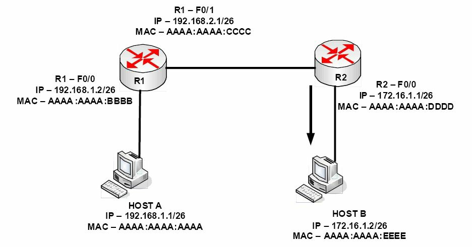

*图 1.20 -- 数据包在设备间往复时，MAC 地址的改变*

### 反向地址解析协议，Reverse Address Resolution Protocol, RARP

RARP 将一个已知的 MAC 地址映射到一个 IP 地址。像是无盘工作站（又叫做瘦客户机）那样的主机，在它们启动时知道自己的 MAC 地址。它们就会使用 RARP 来网络上的服务器那里发现自己的 IP 地址。

### 无故 ARP， Gratuitous Address Resolution Protocol, GARP

GARP 是一类特殊的 ARP 数据包。普通主机通常会在链路建立起来时或网络接口开启时发出一个 GARP 请求。这里的“无故（Gratuitous）”是指一种无需 ARP 的 RFC 通过 ，但仍可在某些场合使用的请求/回应。一次无故 ARP 请求就是一个将其 源 MAC 地址、源 IP 以及目的 IP 地址都设置为发出该数据包的机器的 IP 地址的 ARP 数据包。目的 MAC 地址为广播地址 FFFF:FFFF:FFFF。通常，不会回应数据包产生。

而一个 GARP 回应是一个没有请求的回应（如你看到一个 GARP 回应， 那就意味着网络上的另一计算机和你的计算机用了相同的 IP 地址）。当 FHRP 协议（比如 HSRP）中出现状态改变时，会用到 GARP，为达到更新第二层 CAM 表的目的。IPv6 章节也会讨论到 GARP。

### 简单网络管理协议，Simple Network Management Protocol, SNMP

SNMP 为众多网络管理业务所使用。一套 SNMP 管理系统中，网络设备将名为陷阱（traps）的消息发送给管理工作站。这会想网络管理员报告任何的网络故障（比如接口故障），或是服务器上 CPU 使用等情况。

使用`debug snmp`命令对 SNMP 流量进行调试。SNMP 使用 UDP 端口 161 及 162。

### 安全版超文本传输协议，Hyper Text Transfer Protocol Secure, HTTPS

TLS，以及旧版的 SSL，被用到加固互联网上的通信，是通过采用各种加密方法实的。在电子邮件以及 VoIP，以及访问那些以 http:// 开头的站点时，你会发现这些加密方法。带有 TLS/SSL 的 HTTP（HTTPS）使用 443 端口。

**IP 配置命令，IP Configuration Command**

这不是一件属于思科的工具，但它你的故障排除工具包中的一部分。命令`ipconfig`是在Windows命令提示符下运行的命令，你可以用到数个命令开关，但可能用得最多的就是 `ipconfig /all` 命令，如下面的屏幕截图那样。


*图 1.21 -- ipconfig /all 命令的输出*

## 线缆和介质，Cables and Media

作为网络工程师的你，布线及线缆相关的事情将成为日常工作的一部分。你需要知道哪些线应该插入哪些设备，诸多工业限制，以及怎样将设备配置起来使用这些线缆。

### 局域网的线缆，LAN Cables

**以太网线**

因为局域网上有着为数众多的线缆和连接头，同时又存在因设备迁移及测试带来的线缆频繁插拔，大多数线缆有关的网络问题都是发生在局域网上，而不会是广域网。

以太网线用于将工作站连接至交换机，交换机之间以及交换机与路由器的连接。其规格和速率在近年来有多次修订和提升，这就是说你可以很快用到将今天的标准速率甩得老远的速率，到你的桌面的高速链路也会很快到来。目前的标准以太网线仍然使用 8 条、4 对缠绕的电线，以消除电干扰（electromagnetic interference, EMI），也就是串扰（crosstalk）这种会蔓延到相邻线路上的信号。

ANSI/TIA/EIA-568-A 标准中对以太网线的类别进行了定义，有 3 类、5 类、5e 类以及 6 类共 4 个类别。每个类别都有其相应标准、规格以及在限定距离范围内能够达到的数据吞吐速率。3 类以太网线布线可以最高 10Mbps 速率传输数据。5 类布线主要用于快速以太网络，100BASE-TX 以及 1000BASE-T 都是 5 类网线。5e 类布线使用了增强的 100-MHz (100-Mhz-enhanced) 双绞线来组建千兆以太网（GigabitEthernet）, 就是 1000Base-T。最后的 6 类布线，每对电线以 250MHz 运作，以提供出改进了的 1000Base-T 的性能。（“1000”表示数据传输速度有多少 Mbps，“Base”代表基带传输--baseband，而“T”则是指双绞线 -- twisted pair）。表 1.6 给出了你所熟悉的一些常见的以太网标准。

*表 1.6 常见以太网标准*

<table>
<tr>
<th>速率</th>
<th>名称</th>
<th>IEEE 名称</th>
<th>IEEE 标准</th>
<th>线缆类型/长度</th>
</tr>
<tr>
<td>10Mbps</td>
<td>以太网，Ethernet</td>
<td>10BASE-T</td>
<td>802.3</td>
<td>铜线/100米</td>
</tr>
<tr>
<td>100Mbps</td>
<td>快速以太网，FastEthernet</td>
<td>100BASE-T</td>
<td>802.3u</td>
<td>铜线/100米, Copper/100m</td>
</tr>
<tr>
<td>1000Mbps</td>
<td>千兆以太网，GigabitEthernet</td>
<td>1000BASE-LX</td>
<td>802.3z</td>
<td>光纤/5000米，Fibre/5000m</td>
</tr>
<tr>
<td>1000Mbps</td>
<td>千兆以太网</td>
<td>1000BASE-T</td>
<td>802.3ab</td>
<td>铜线/100米, Copper/100m</td>
</tr>
<tr>
<td>10Gbps</td>
<td>万兆以太网，TenGigabitEthernet</td>
<td>10GBASE-T</td>
<td>802.3an</td>
<td>铜线/100米, Copper/100m</td>
</tr>
</table>

思科喜欢将线缆规格有关的问题偷偷摸摸地放到考试中去，**所以务必要记住这个表格**。

**双工, Duplex**

在以太网投入使用的早期阶段，同一时间数据只能在一个方向上传输。这是因为那个时候所使用线缆的限制造成的。发送设备在线缆上发送数据前必须等待直到线缆可用，否则将会发生冲突（collision）。因为后来有了不同组别的电线负责发送和接收信号，这就不成问题了。

半双工（half duplex）是指数据只能在一个方向上传输，全双工则是数据能够在两个方向上同时传输（见图 1.22）。这是通过使用以太网线内部的外加电线实现的。现在的所有设备都以全双工方式运行，除非是设置为半双工。

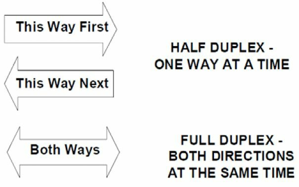

*图 1.22 -- 双工拓扑，Duplex Topology*

考试中仍然要求你能理解并排除全双工方面的故障；本书后面的第一层和第二层故障排除部分将详细介绍。使用`show interface X`命令就可以轻易地检查接口的双工设置。

```console
Switch#show interface FastEthernet0/1
FastEthernet0/1 is down, line protocol is down (disabled)
    Hardware is Lance, address is 0030.a388.8401 (bia 0030.a388.8401)
BW 100000 Kbit, DLY 1000 usec,
        reliability 255/255, txload 1/255, rxload 1/255
    Encapsulation ARPA, Loopback not set
    Keepalive set (10 sec)
    Half-duplex, 100Mb/s
```

如果此接口与某台全双工设备连接起来，你将立即看到有错误发生，同时链路流量将极为慢速。你可以在一台真实交换机上执行`show interfaces status`命令，但考试中这条命令可能不会工作，因为像 Packet Tracer 这样的路由器模拟软件仅能运行有限的一些命令。在下面的输出中，你会发现接口 FastEthernet 1/0/2 存在一些问题。

```console
Switch#show interfaces status
Port    Name    Status      Vlan    Duplex  Speed   Type
Fa1/0/1         notconnect  1       auto    auto    10/100BaseTX
Fa1/0/2         notconnect  1       half    10      10/100BaseTX
Fa1/0/3         notconnect  1       auto    auto    10/100BaseTX
Fa1/0/4         notconnect  1       auto    auto    10/100BaseTX
Fa1/0/5         notconnect  1       auto    auto    10/100BaseTX
```

当然要修复这个问题也是十分容易的，像下面这样：

```console
Switch(config)#int f1/0/2
Switch(config-if)#duplex ?
    auto Enable AUTO duplex configuration
    full Force full duplex operation
    half Force half-duplex operation
Switch(config-if)#duplex full
```

请务必要在真实思科设备上, 或 GNS3 中，或最新版的 Packet Tracer 中去试试这些命令，来记住它们！

**速率，speed**

你可将路由器或交换机的速率保留成自动协商（auto-negotiate）, 或者硬性设置为 10Mbps、100Mbps 或者 1000Mbps。

像下面这样就可以手动设置速率：

```console
Router#config t
Router(config)#interface GigabitEthernet 0/0
Router(config-if)#speed ?
    10      Force 10 Mbps operation
    100     Force 100 Mbps operation
    1000    Force 1000 Mbps operation
    auto    Enable AUTO speed configuration
```

下面的命令是要查看以太网接口的设置：

```console
Router#show interface FastEthernet0
FastEthernet0 is up, line protocol is up
    Hardware is DEC21140AD, address is 00e0.1e3e.c179 (bia 00e0.1e3e.c179)
    Internet address is 1.17.30.4/16
    MTU 1500 bytes, BW 10000 Kbit, DLY 1000 usec, rely 255/255, load 1/255
    Encapsulation ARPA, Loopback not set, keepalive set (10 sec)
    Half-duplex, 10Mb/s, 100BaseTX/FX
```

EIA/TIA 的以太网线规格要求网线的末端务必是 RJ45 公头（见图 1.23; 图 1.24 展示了其母头），你可以将网插入路由器/交换机/PC的端口上。


*图 1.23 -- RJ45 公头*


*图 1.24 -- RJ45 母头*

**直通线**

以太网线有 8 根，每根都与水晶头上一个针脚连接起来。而每条线与这些针教位置的接法，确定做出来的网线的用途。如果网线两端的接法完全相同，则做出来的网线就叫直通线。这种线用于将**终端设备连接交换机**，或者**连接交换机和路由器**。将网线的两端放在一起对比一看，就知道它们是否是一样的接法。如图 1.25 和 1.26 所示。

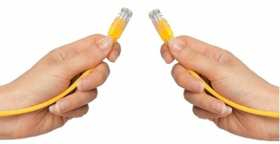

*图 1.25 -- 对比网线两端*


*图 1.26 -- 网线两端是一样的*

**交叉线，crossover cables**

通过将网线的两对电线的位置交换一下，就可以用来在无需交换机、集线器的情况下，连接两台 PC 或是两台交换机(较新的网卡的 Auto-MDIX 功能能够自动侦测连接是否需要交叉连接，选择 MDI 或是 MDIX 配置来与链路的另一端恰当匹配)。一端的针脚 1 需要连接到另一端的针脚 3，针脚 2 要连接到针脚 6（见图 1.27）。


*图 1.27 -- 针脚 1 到 针脚 3，针脚 2 到针脚 6*

**翻转线/控制台线, Rollover/Console Cables**

所有的思科路由器和交换机都有用于初始设置以及灾难恢复和访问的几个物理端口。这些端口叫做控制台端口，作为思科工程师，你肯定会用到这些端口。你需要一种叫做**翻转线或者控制台线**的特殊类型线缆来连接这个端口（见图 1.28）。有时又称其为扁线（a flat cable）, 因为它与一般圆形的网线不同，它是扁的。


*图 1.28 -- 一条典型的翻转线*

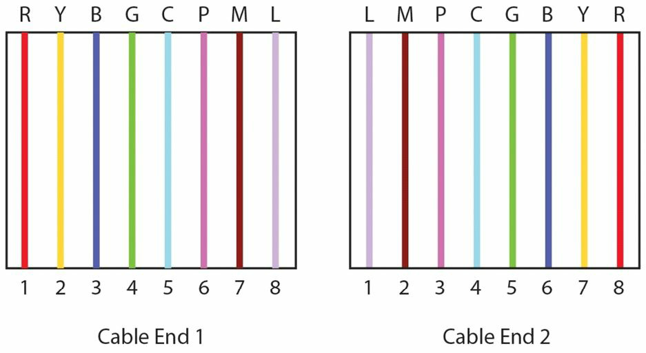

*图 1.29 -- 所有针脚都交换了位置*

翻转线通常一端有一个 RJ45 接头，另一端是一个 9 针 D 形连接器，设计用于连接 PC 或笔记本电脑的 COM 端口。问题是现今的设备通常有不再有 COM 端口了，因为 COM 端口用得很少很少。不过你可以从电子商店或网上买到 DB9-to-USB 转换器（如图 1.30）。它们带有驱动程序，允许你通过如 PuTTY 或 HyperTerminal 等终端程序，连接到 PC 的**逻辑** COM 端口( a logical COM port)。

思科已经开始在他们的设备上放 mini-USB 端口，作为  RJ45 端口的补充，可以通过 USB A 型（Type A）至 5 针 B 型（5-pin Type B）插头线, 获得对控制台的访问。如同时插入两种控制台线，那么 mini-USB 优先。图 1.31 及 1.32 是不同的连接类型。

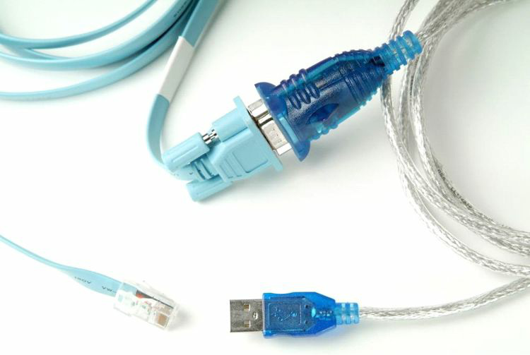

*图 1.30 -- 一条 COM 到 USB 的转换线*


*图 1.31 -- 将串行线连接到笔记本电脑的串行端口*


*图 1.32 -- 将串行线连接到路由器或交换机的控制台端口*

### 广域网线缆，WAN Cables

依路由器接口及连接类型的不同，广域网连接所使用到的 **串行通讯线(serial cables)** 在形状、大小以及规格上有好几种。比如 ISDN 就会使用到与帧中继（Frame Relay）或 ADSL 所不同的一些线缆。

尤其是在家庭网络的实践下，你会用到的一种常见的 叫做 DB60（见图 1.33）的 WAN 线缆。此种线缆有一个数据终端设备（a data terminal equipment, DTE）端, 这端是要插入到客户设备上，另一端是数据通信设备端，它决定来自 ISP 处的连接速率。图 1.34 是一个 WIC-1T 插卡上的 DB60 串行接口。

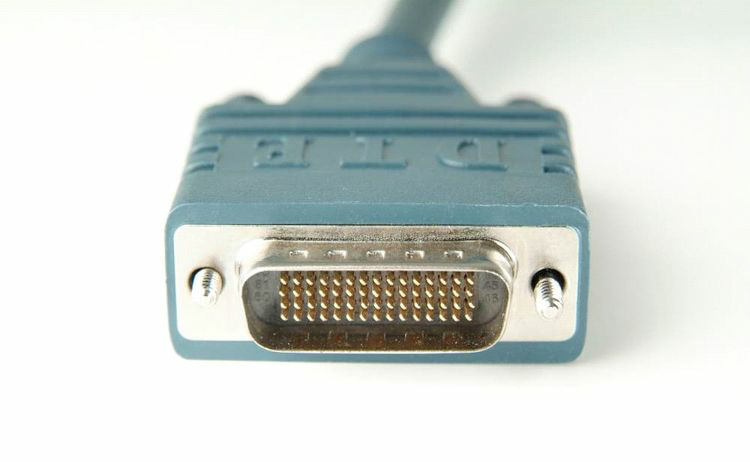

*图 1.33 -- 一条 DB60 线缆*


*图 1.34 -- 一块 WIC-1T 插卡上的 DB60 串行接口*

还有一种思科经常推介的、用于广域网接口卡（WAN Interface Cards, WICs）的，叫做小巧串行线（smart serial cable）的类型。如图 1.35 所示。

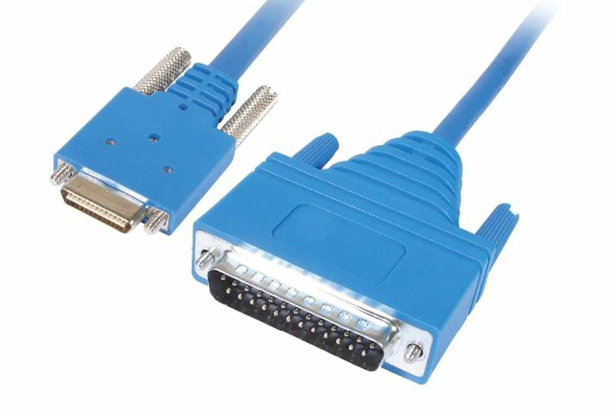

*图 1.35 -- 小巧串行线，Smart Serial Cable*

在使用这种类型线缆时，你当然需要恰当的接口卡，此种接口卡如图 1.36 所示。

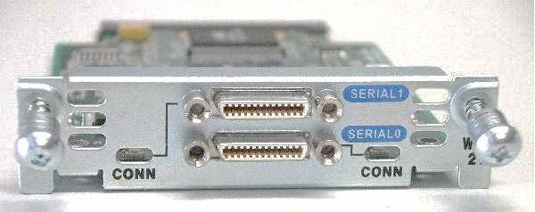

*图 1.36 -- 使用小巧串行线的 WIC-2T 卡*

该 WIC 卡使用路由器的一个插槽，能提供两条连接，而 标准的 WIC-1T 卡仅有一条连接。**每条连接都可以使用不同的封装类型，比如一条使用 PPP，另一条使用帧中继**。

关于 DCE 和 DTE 线缆的最重要之处在于，**你需要在 DCE 端指定时钟(a clock rate)** 。通常情况下，你的 ISP 会干这件事，因为他们持有 DCE 端，但在家中或是用真实机架（live rack）做实验时，是你持有 DCE 端，在一台路由器上你是客户，另一台路由器上你又是 ISP 了。需要输入的命令是`clock rate 64000`(或者任何可用的速率，单位是 bits per second)。`clock rate ?`命令可以调出那些速率选项。

在输入以下命令前，你务必先要搞清楚它们。首先，要确认哪台路由器接上了 DCE 线，你需要命令`show controllers`之后接上接口编号。在真实考试的故障排除中（现实工作中也一样），这是一个有用的命令。命令`show ip interface brief`让你掌握路由器上有哪些接口。

实际上，你可以简化思科 IOS 命令的输入，就像下面的输出那样。但考试中简化输入的命令可能不会运行，因为考试使用的是路由器模拟器（而不是真实的路由器）。

```console
Router#sh ip int brie
Interface       IP-Address  OK? Method  Status                  Protocol
FastEthernet0/0 unassigned  YES unset   administratively down   down
FastEthernet0/1 unassigned  YES unset   administratively down   down
Serial0/1/0     unassigned  YES unset   administratively down   down
Vlan1           unassigned  YES unset   administratively down   down
Router#show controllers s0/1/0
Interface Serial0/1/0
Hardware is PowerQUICC MPC860
DCE V.35, no clock
Router(config-if)#clock rate ?
Speed (bits per second)
    1200
    2400
    4800
    9600
    19200
    38400
    56000
    64000
...
[Truncated Output]
```

## 连接到一台路由器， Connecting to a Router

这是你头一次连接到一台路由器或交换机，看起来有些艰巨吧。前面的内容已经讲到了控制台连接了，所以在连上串行线后，你的 PC 或笔电就需要一个终端模拟程序了。有了这些，你就可以查看路由器的输出并敲入那些配置命令了。

超级终端（HyperTerminal）作为默认程序已经用了很多年了，在完成灾难备份时，你可能仍需要这个程序；但是你可以选择 PuTTY 这个广泛使用的程序。从 [www.putty.org](http://www.putty.org/) 可以下载到它。老式的 PC 上的 COM 端口连接总是会用到标为 COM1 或 COM2 的逻辑端口。PuTTY 中有一个有关逻辑端口的设置，我们实际上叫这个是一条串行连接（a serial connection）。如图 1.37 所示。


*图 1.37 -- PuTTY 使用 COM 端口得到串行访问*

如你使用的是 USB 到翻转线（USB-to-rollover）转换器，那么你会收到一张包含其驱动程序的安装光盘，在安装好驱动程序后，你将得到一个可以使用的 COM 端口。如你使用的是 Windows 系统，在设备管理器中你会发现这个端口。如图 1.38 所示。


*图 1.38 -- 驱动程序将 COM4 作为控制台连接的端口*

在使用超级终端时，你还要选择一些连接参数，比如波特率等。你需要做如下选择，如图 1.39 所示。

- 每秒位数，Bits per second: 9600
- 数据位数，Data bits：默认值 8
- 校验，Parity: 无/None
- 停止位，Stop bits: 默认值 1
- 流控, Flow control: 必须是 无/None


*图 1.39 -- 超级终端连接参数设置*

在开启路由器时，如你已经选择了正确的 COM 端口，并将翻转线插入到路由器的控制台端口，你将看到路由器的启动文字（见图 1.40）。如你不能看到任何文本，那么敲几下回车键并在此检查一下你的设置。

如路由器没有在它的 NVRAM 中找到启动配置文件（a startup configuration file）时, 或者路由器的配置寄存器（the configuration register）被设置为  0x2142 而忽略启动配置文件时，路由器会询问你是否要进入**初始设置模式(Initial Configuration mode)**。请输入 “n” 或 “no”， 输入 “yes” 会进入配置模式（setup mode）, 你是不会想要进入到这个模式的。

```
Would you like to enter the initial configuration dialog?
[yes/no]:
% Please answer ‘yes’ or ‘no’.
Would you like to enter the initial configuration dialog?
[yes/no]: no
Press RETURN to get started!
Router>
```

在另一个型号的路由器上，你会看到下面的输出：

```
Technical Support: www.cisco.com/techsupport
Copyright (c) 1986-2007 by Cisco Systems, Inc.
Compiled Wed 18-Jul-07 04:52 by pt_team
        --- System Configuration Dialog ---
Continue with configuration dialog? [yes/no]: no
Press RETURN to get started!
Router>
```

### 路由器的各种模式，Routers Modes

为通过 CCNA 考试，你需要理解在完成各种操作时，需要进入的不同路由器模式提示符。而不管你要执行何种功能，首先你要是在正确的模式下（有不同的提示符来区分）。新手在配置路由器的过程中遇到找不到正确命令来使用的问题时，他们犯的最大错误往往就在这里。请一定要确定你在正确的模式下！

**用户模式，User Mode**

在路由器启动后，第一个展现在你面前的叫用户模式（User Mode）或者用户执行模式（User Exec Mode）。用户模式下只有很小的一套命令可供使用，但在查找基本的路由器元素上是有用的。路由器默认名称是“Router”, 后面你会看到该名称可以修改。

`Router>`

**特权模式，Privileged Mode**

在用户模式下输入 `enable` 命令，就带你进入了下一模式，叫做特权模式或特权执行模式（Priviledged Exec mode）。输入 `disable` 命令退回到用户模式。而要退出整个会话，输入 `logout` 或者 `exit`。

```console
Router>enable
Router#
Router#disable
Router>
```

在查看路由器的整个配置、路由器的运行统计数据，以致路由器插入了哪些模块时，特权模式是有用的。在此提示符下，你会输入 `show` 命令，和用于调试的 `debug` 命令。

**全局配置模式，Global Configuration Mode**

为了真正配置路由器，你需要进入全局配置模式。在特权运行模式下，输入 `configure terminal` 命令， 或其简短版本 `config t` 来进入此模式。此外，仅输入 `config` 时，路由器会询问你要进入何种模式。terminal 是模式的（默认选项会被中括号括起来）。如你按下了回车键，就会接受中括号里的命令。

```console
Router#config
Configuring from terminal, memory, or network[terminal]? ← press Enter
Enter configuration commands, one per line. End with CNTL/Z.
Router(config)#
```

**接口配置模式，Interface Configuration Mode**

接口模式下，可以输入路由器接口，如快速以太网、串行接口等，的命令。在一台全新的路由器上，默认所有接口都是关闭的，没有任何配置。

```console
Router>enable
Router#config t
Enter configuration commands, one per line. End with CNTL/Z.
Router(config)#interface Serial0
Router(config-if)#
```

> show ip interface brief 命令可以查看到路由器有哪些接口。你的串行接口可能不是 Serial0。

**线路配置模式，Line Configuration Mode**

线路配置模式用来对控制台、Telnet 或者辅助端口（auxiliary ports）进行改变。你可以控制哪些人可以通过这些端口访问到路由器，以及在这些端口上部署口令或者**“访问控制列表（access control lists）”这种安全特性**。

```console
Router#config t
Enter configuration commands, one per line. End with CNTL/Z.
Router(config)#line console 0
Router(config-line)#
```

你还可以在此模式下设置波特率、执行级别（exec levels）等参数。

**路由器配置模式，Router Configuration Mode**

为了给路由器配置一种路由协议，以便它能够建立起网络图（build a picture of the network）, 你需要用到路由器配置模式。

```console
Router#config t
Enter configuration commands, one per line. End with CNTL/Z.
Router(config)#router rip
Router(config-router)#
```

**虚拟局域网配置模式，VLAN Configuration Mode**

此种模式实际上是属于交换机的，但既然我们在此讨论不同模式，所以也有必要提一下。本书的交换机实验中，你会用到很多这种模式。

```console
Switch#conf t
Enter configuration commands, one per line.
Switch(config)#vlan 10
Switch(config-vlan)#
```

在具备以太网交换机卡的路由器上，会使用虚拟局域网数据库配置模式（VLAN Database Configuration mode，该模式在交换机上已被废除），其与 VLAN 配置模式是相似的。

```console
Router#vlan database
Router(vlan)#vlan 10
VLAN 10 added:
    Name: VLAN0010
Router(vlan)#exit
APPLY completed.
Exiting....
Router#
```

### 配置一台路由器，Configuring a Router

路由器是没有菜单的，你也不能用鼠标在不同模式之间切换，这些都是经由命令行界面(command line interface, CLI)完成的。有些上下文敏感（context-sensitive）的帮助信息以 [?] 关键字形式给出。在路由器提示符处输入问号，所有可用的命令都将显示出来。

```console
Router#?
Exec commands:
access-enable           Create a temporary Access-List entry
access-profile          Apply user-profile to interface
access-template         Create a temporary Access-List entry
alps                    ALPS exec commands
archive                 manage archive files
bfe                     For manual emergency modes setting
cd                      Change current directory
clear                   Reset functions
clock                   Manage the system clock
cns                     CNS subsystem
configure               Enter configuration mode
connect                 Open a terminal connection
copy                    Copy from one file to another
debug                   Debugging functions (see also ‘undebug’)
delete                  Delete a file
dir                     List files on a directory
disable                 Turn off privileged commands
disconnect connection   Disconnect an existing network
enable                  Turn on privileged commands
erase                   Erase a file
exit                    Exit from the EXEC mode
help                    Description of the interactive help system
-- More –
```

如果有多于屏幕能显示的信息，你将看到 `--More--` 栏。按空格键来查看下一页。按 `Ctrl+Z`或者`Q`回到提示符。

此外，如你已经开始输入一个命令，却忘记了该命令的剩下部分，输入`?`系统就会给出一个可用的命令清单。`?`在 CCNA 考试中是可用的，但如你用了问号，说明你就没有认真完成本书的那些实验:)

```console
Router#cl?
clear clock
```

按 `Tab` 键有命令补全功能。

```console
Router#copy ru
← press the Tab key here
Router#copy running-config
```

路由器有好几个可供选择的模式。这是为了避免对不打算修改的路由器配置部分造成不必要改变而设置的。看一下提示符就知道你当前所处哪个模式。比如你打算对某个快速以太网接口做一些改变，你需要在接口配置模式下来完成。

首先，进入全局配置模式：

```console
Router#config t
Router(config)#
```

接着，告诉路由器你要配置哪个接口：

```console
Router(config)#interface FastEthernet0
Router(config-if)#exit
Router(config)#
```

如你不确定采用何种方式输入接口编号，就使用 [?] 关键字。无需担心你所看到的所有选项。大多数人都只会用到快速以太网、串行接口及环回接口（Loopback interfaces）。

```console
Router(config)#interface ?
Async               Async interface
BRI                 ISDN Basic Rate Interface
BVI                 Bridge-Group Virtual Interface
CTunnel             CTunnel interface
Dialer              Dialer interface
FastEthernet        IEEE 802.3u
Group-Async         Async Group interface
Lex                 Lex interface
Loopback            Loopback interface
Multilink           Multilink-group interface
Null                Null interface
Serial              Serial interface
Tunnel              Tunnel interface
Vif                 PGM Multicast Host interface
Virtual-Template    Virtual Template interface
Virtual-TokenRing   Virtual TokenRing interface
range               interface range command

Router(config)#interface FastEthernet?
<0-0> FastEthernet interface number
Router(config)#interface FastEthernet0
```

最终，路由器进入到了接口配置模式。

`Router(config-if)#`

在这里，你可以为接口配置上 IP 地址，设置其带宽，部署一条访问控制清单，以及完成很多其它事项。你的路由器或交换机可能会与我（作者）的有不同的接口编号，所以请使用 `?` 或 `show ip interface brief` 命令去查看你的选项。

输入 `exit` 命令从某个配置模式中退出。这会将你带回到其第二高的级别(the next-highest level)。而要从任何的配置模式中退出，按下 `Ctrl+Z` 或输入 `end` 命令就可以了。

```console
Router(config-if)#exit
Router(config)#
```

或是 `Ctrl+Z` 的办法。

```console
Router(config-if)#^z
Router#
```

**环回接口，Loopback Interfaces**

CCNA 大纲通常不会涉及环回接口的知识点，但不管在工作中，还是在操作实验中，都是有用的。环回接口是你配置得来的虚拟或逻辑接口（a virtual or logical interface）, 而不是物理存在的（所以你不会在路由器的面板上见到环回接口）。你可以往这类接口上执行 ping 操作，而无需在实验用有设备连接到路由器的快速以太网接口上。

使用环回接口的一大好处在于随路由器的运行，它们总是保持开启的，因为它们是逻辑的，意味着它们绝不会宕下去（go down）。而又由于它们是虚拟的，所以你不可以将网线插到它们上面。

```console
Router#config t
Router#(config)#interface Loopback0
Router#(config-if)#ip address 192.168.20.1 255.255.255.0
Router#(config-if)#^z ← press Ctrl+Z
Router#
Router#show ip interface brief
Interface   IP-Address      OK?     Method  Status  Protocol
Loopback0   192.168.20.1    YES     manual  up      up
```

此命令的输出将显示出你的路由器的所有可用接口的信息。

> 真实世界：可以在接口配置模式下输入 shutdown 命令来关掉一个环回接口。

务必要给环回接口一个有效的 IP 地址。可以**用于那些路由协议** 或者**测试路由器是否允许某些流量通过**。本课程中会大量使用到环回接口。

**编辑命令，Editting Commands**

与其将已输入的整行命令全部删除，你可以对其进行编辑。下面这些键盘输入可以将光标移至该行命令的任意位置。


| **键盘输入，Keystroke** | **用途，Meaning** |
| -- | -- |
| `Ctrl+A` | 将光标移至命令行开头 |
| `Ctrl+E` | 将光标移至命令行末尾 |
| `Ctrl+B` | 将光标移往后移动一个字符 |
| `Ctrl+F` | 将光标移往前移动一个字符 |
| `Esc+B` | 将光标往前移动一个词 |
| `Esc+F` | 将光标往后移动一个词 |
| `Ctrl+P` 或向上箭头 | 翻出上一条命令 |
| `Ctrl+N` 或向下箭头 | 翻出下一条命令 |
| `Ctrl+U` | 删除这条命令 |
| `Ctrl+W` | 删除一个词 |
| `Tab` | 补全命令 |
| `show history` | 默认情况下，显示前 10 条命令 |
| 退格按键，`Backspace` | 删除一个字符 |

**考试中出一道有关这些编辑命令的题目是很常见的。**

**配置一个路由器接口，Configuring a Router Interface**

基于其以下两个因素，路由器接口可以分为几种。

- 所采用的技术（比如，以太网）
- 接口之带宽

在现代企业网络中使用到的常见路由器及交换机接口带宽有：

- `100Mbps`（通常叫做快速以太网，`FastEthernet`）
- `1Gbps` (通常叫做千兆以太网，`GigabitEthernet`)
- `10Gbps` (通常叫做万兆以太网，`TenGigabitEthernet`)

为定位到（address）一个指定的路由器接口并进入到接口配置模式以设置其特定参数，你必须知道接口命名法。在不同路由器生产商之间，其接口命名法会有不同，但接口命名法通常由两部分组成：

- 接口类型（`Ethernet`, `FastEthernet` 等）
- 接口插槽/模块以及端口号

比如，常见的接口命名法有以下这些：

- `Ethernet1/0` (第 `1` 号插槽，第 `0` 号端口)
- `FastEthernet0/3` ( 第 `0` 号插槽，第 `3` 号端口)
- `GigabitEthernet0/1/1` (第 `0` 号模块， 第 `1` 号插槽， 第 `1` 好端口)

> **注意**: 第 `0` 号插槽通常表示那些内建的端口，而其它插槽则表示那些可以随时添加上去的拓展插槽。插槽和端口的编号通常是从 `0` 开始的。

在进行配置时，**为令到路由器具有基本的那些功能，你务必要配置以下参数**：

- 速率，Speed
- 双工，Duplex
- IP 地址，IP address

你可以将这三个参数作为一台路由器的典型配置，因为它们常用在现代企业网络中。要查看所有可用的接口及其当前状态，你可以执行以下命令。

```console
Router#show ip interface brief
Interface       IP-Address  OK? Method  Status                  Protocol
FastEthernet0/0 unassigned  YES unset   administratively down   down
FastEthernet0/1 unassigned  YES unset   administratively down   down
```

从以上输出可以看出，该路由器在插槽 `0` 上有两个快速以太网接口（`FastEthernet`, `100Mbps`），都没有配置过（也就是，没有 IP 地址）且是管理性关闭的（也就是，状态为：`adminitrively down`）。

在开始配置接口参数前，你必须要在思科设备上使用命令 `configure terminal` 进入路由器的配置模式, 在使用命令 `interface <interface name>` 进入到接口配置模式。接口配置过程的第一步是开启该接口。比如，使用 `no shutdown` 命令可以开启接口 `FastEthernet0/0` :

```console
Router#configure terminal
Enter configuration commands, one per line. End with CNTL/Z.
Router(config)#interface FastEthernet0/0
Router(config-if)#no shutdown
Router(config-if)#no shutdown
Router(config-if)#
*Mar 1 00:32:05.199: %LINK-3-UPDOWN: Interface FastEthernet0/0, changed state to up
*Mar 1 00:32:06.199: %LINEPROTO-5-UPDOWN: Line protocol on Interface FastEthernet0/0, changed state to up
```

接着的配置步骤涉及到配置速率以及双工设置，前面我们已经看到了。

**给接口配置一个 IP 地址，Configuring an IP Address on an Interface**

> 为让路由器与其它设备实现通信，它需要在连接的接口上有一个 IP 地址。配置一个 IP 地址是相当直接的，你还是要记住，在此之前需要进入接口配置模式。

先不要担心到哪里去找到 IP 地址，我们后面会解决这个问题。

```console
Router>enable   ← takes you from User mode to Privileged mode
Router#config t ← from Privileged mode to Configuration mode
Router(config)#interface Serial0    ← and then into Interface Configuration mode
Router(config-if)#ip address 192.168.1.1 255.255.255.0
Router(config-if)#no shutdown   ← the interface is opened for traffic
Router(config-if)#exit    ← you could also hold down the Ctrl+Z keys together to exit
Router(config)#exit
Router#
```

如下面的输出那样，可以为该接口加入一些描述信息。

```console
RouterA(config)#interface Serial0
RouterA(config-if)#description To_Headquarters
RouterA(config-if)#^Z   ← press Ctrl+Z to exit
```

在完成路由器的接口配置后，于思科路由器上，你可以使用以下命令，通过检查完整的接配置参数来验证其设置：

```console
RouterA#show interface Serial0
Serial0 is up, line protocol is up
Hardware is HD64570
Description: To_Headquarters
Internet address is 12.0.0.2/24
MTU 1500 bytes, BW 1544 Kbit, DLY 20000 usec,
reliability 255/255, txload 1/255, rxload 1/255
Encapsulation HDLC, loopback not set
Keepalive set (10 sec)
Last input 00:00:02, output 00:00:03, output hang never
[Output restricted...]
```

**`show` 命令，Show commands**

通过在特权模式（`priviledged mode`）下使用 `show x` 命令, 你可以十分简单地茶看到路由器的绝大部分设置项，其中的 `x` 是下一条命令，`x`的选择有以下这些：

```console
Router#show ?
access-expression   List access expression
access-lists        List access lists
accounting          Accounting data for active sessions
adjacency           Adjacent nodes
aliases             Display alias commands
alps                Alps information
apollo              Apollo network information
appletalk           AppleTalk information
arap                Show AppleTalk Remote Access statistics
arp                 ARP table
async               Information on terminal lines used as router interfaces
backup              Backup status
bridge              Bridge Forwarding/Filtering Database [verbose]
bsc                 BSC interface information
bstun               BSTUN interface information
buffers             Buffer pool statistics
cca                 CCA information
cdapi               CDAPI informationcdp CDP information
cef                 Cisco Express Forwarding
class-map           Show QoS Class Map
clns                CLNS network information
--More--
```

下面列出了一些常用的 `show` 命令及其意义，连同两个实例。

| Show 命令 | 结果 |
| -- | -- |
| `show running-configuration` | 显示 DRAM 中的配置 |
| `show startup-configuration` | 显示 NVRAM 中的配置 |
| `show flash` | 显示闪存中的 IOS |
| `show ip interface brief` | 显示所有接口的简要信息 |
| `show interface Serial0` | 显示串行接口的统计信息 |
| `show history` | 显示输入的前 10 条命令 |

```console
Router#show ip interface brief
Interface   Address     OK? Method  Status                  Protocol
Ethernet0   10.0.0.1    YES manual  up                      up
Ethernet1   unassigned  YES unset   administratively down   down
Loopback0   172.16.1.1  YES manual  up                      up
Serial0     192.168.1.1 YES manual  down                    down
Serial1     unassigned  YES unset   administratively down   down
```

其中的 `method` 标签表明地址指定的方式。可以是 `unset`，`manual`, `NVRAM`, `IPCP` 或者 `DHCP`。

路由器能够检索（`recall`）出先前于路由器提示符处输入的一些命令 -- 默认 `10` 条，方法是使用向上箭头。使用这个特性能够让你无再次输入长命令行，从而节省大量时间和精力。`show history` 命令显示前 `10` 条命令的缓冲区。

```console
Router#show history
show ip interface brief
show history
show version
show flash:
conf t
show access-lists
show process cpu
show buffers
show logging
show memory
```

通过命令 `terminal history size` 命令来增大历史命令缓冲区（the history buffer）:

```console
Router#terminal history ?
size Set history buffer size
<cr>
Router#terminal history size ?
<0-256> Size of history buffer
Router#terminal history size 20
```

**验证基础路由器配置及网络连通性，Verifying Basic Router Configuration and Network Connectivity**

下面的内容解释了一些最为有用的验证基础路由器配置的命令。

**版本查看，Show Version**

`show version` 命令提供了那些可以说是验证大多数路由器操作的起点的有用信息。包括：

- 路由器的种类（`show inventory` 是另一个列出路由器硬件信息的有用命令）
- IOS 的版本
- 内存容量
- 内存使用情况
- CPU 类型
- 闪存容量
- 其它硬件参数
- 上次重启原因

这里有一个 `show version` 命令的缩短了的输出。请自己动手输入这个命令。

```console
Router#show version
Cisco 1841 (revision 5.0) with 114688K/16384K bytes of memory.
Processor board ID FTX0947Z18E
M860 processor: part number 0, mask 49
2 FastEthernet/IEEE 802.3 interface(s)
2 Low-speed Serial(sync/async) network interface(s)
191K bytes of NVRAM.
63488K bytes of ATA CompactFlash (Read/Write)

Configuration register is 0x2102
```

**Show Running-config**

`show running-config` 命令提供了路由器的完整配置，用于验证设备已被配置了恰当特性。因为其输出太过宽泛，这里就不给出来了。

**Show IP Interface Brief**

在前一部分提到的 `show ip interface brief` 命令，列出了路由器的接口以及它们的状态，包括以下项目：

- 接口的名称及编号
- IP 地址
- 链路状态
- 协议状态

```console
Router#show ip interface brief
Interface       IP-Address  OK? Method  Status              Protocol
FastEthernet0/0 unassigned  YES unset   administratively down   down
FastEthernet0/1 unassigned  YES unset   administratively down   down
Serial0/0/0     unassigned  YES unset   administratively down   down
Serial0/1/0     unassigned  YES unset   administratively down   down
Vlan1           unassigned  YES unset   administratively down   down
Router#
```

**Show IP Route**

`show ip route` 命令提供了有关设备路由能力的更深层次信息。它列出路由器所能到达的所有网络及到达这些网络的路径的信息，包括这些项目：

- 网络
- 路由协议
- 下一跳
- 外出接口

```console
R1#show ip route
Codes:  C - connected, S - static, R - RIP, M - mobile, B - BGP
        D - EIGRP, EX - EIGRP external, O - OSPF, IA - OSPF inter
        area, N1 - OSPF NSSA external type 1, N2 - OSPF NSSA external
        type 2, E1 - OSPF external type 1, E2 - OSPF external type 2,
        i - IS-IS, L1 - IS-IS level-1, L2 - IS-IS level-2, ia - IS-IS
        inter area, * - candidate default, U - per-user static route,
        o – ODR, P - periodic downloaded static route
Gateway of last resort is not set
R       80.1.1.0/24 [120/1] via 10.1.1.2, 00:00:04, Ethernet0/0.1
D       80.0.0.0/8 [90/281600] via 10.1.1.2, 00:02:02, Ethernet0/0.1
O E2    80.1.0.0/16 [110/20] via 10.1.1.2, 00:00:14, Ethernet0/0.1
```

除了上面的这些 `show` 命令外，还有一些用于验证路由器连通性的命令，比如 `ping` 和 `traceroute` 命令。

**Ping 命令**

`ping` 命令提供了一种到特定目标的基本连特性测试。这种方式用以测试路由器能否到达一个网络。Ping 使用 ICMP, 通过往一台机器发送 echo 请求方式来验证这台机器是否在运行。如果那台机器是在运行，它就会发出一个 ICMP 的 echo 回应消息给源机器，以确认它的可用性。一个 `ping` 的样例如下所示。

```console
Router#ping 10.10.10.2
Type escape sequence to abort.
Sending 5, 100-byte ICMP Echos to 10.10.10.2, timeout is 2 seconds:
.!!!!
Success rate is 80 percent (4/5), round-trip min/avg/max = 20/40/76 ms
```

标准的 `ping` 命令发出 `5` 个到目标的 ICMP 数据包。而 `ping` 输出中，点（`.`）表示失败，叹号（`!`）表示成功收到数据包。`ping` 命令的输出还给出了到目标网络的往返时间（the round-trip time）, 有最小时间、平均时间以及最大时间。

如你需要调整 `ping` 相关的参数，你可在思科路由器上执行扩展的 `ping` 命令。通过在控制台处输入 `ping` 并按下回车键来执行。路由器就会通过一个交互式菜单进行提示，你就可以指定包含以下的这些参数了。

- ICMP 数据包的个数
- 包的大小
- 超时量
- 源接口
- 服务类型


```console
Router#ping
Protocol [ip]:
Target IP address: 10.10.10.2
Repeat count [5]:
Datagram size [100]:
Timeout in seconds [2]:
Extended commands [n]: y
Source address or interface: FastEthernet0/0
Type of service [0]:
Set DF bit in IP header? [no]:
Validate reply data? [no]:
Data pattern [0xABCD]:
Loose, Strict, Record, Timestamp, Verbose[none]:
Sweep range of sizes [n]:
Type escape sequence to abort.
Sending 5, 100-byte ICMP Echos to 10.10.10.2, timeout is 2 seconds:
Packet sent with a source address of 10.10.10.1
!!!!!
Success rate is 100 percent (5/5), round-trip min/avg/max = 20/36/72 ms
```

**Traceroute 命令**

`traceroute` 命令是另一个用于查看数据包在到达其目的地前所经过的跳数。下面的输出表示数据包在到达其目标前必须经过一跳。

```console
R2#traceroute 192.168.1.1
Type escape sequence to abort.
Tracing the route to 192.168.1.1
    1 10.10.10.1 60 msec *  64 msec
```

跟 `ping` 一样，思科路由器也允许你执行扩展的 `traceroute` 命令，搭配一些相关参数，而这些参数大多与 `ping` 相关的参数一样。

```console
Router#traceroute
Protocol [ip]:
Target IP address: 192.168.1.1
Source address: 10.10.10.2
Numeric display [n]:
Timeout in seconds [3]:
Probe count [3]:
Minimum Time to Live [1]:
Maximum Time to Live [30]:
Port Number [33434]:
Loose, Strict, Record, Timestamp, Verbose[none]:
Type escape sequence to abort.
Tracing the route to 192.168.1.1
    1 10.10.10.1 76 msec *  56 msec
```

## 第一天的问题

### OSI/TCP 模型的问题 OSI/TCP Model Questions

1. Name each layer of the OSI model, from Layer 7 down to Layer 1.
2. The role of the Session Layer is to `_______`, `_______`, and `_______` sessions or dialogues between devices.
3. What are the three methods used to control data flow at Layer 4?
4. The Transport Layer includes several protocols, and the most widely known are `_______` and `_______`.
5. Why is UDP used at all if TCP/IP offers guaranteed delivery?
6. What is data referred to at each OSI layer?
7. In order to interface with the upper and lower levels, the Data Link Layer is further subdivided into which two Sublayers?
8. What are the five TCP/IP layers from the top down?
9. How does the TCP/IP model map to the OSI model?
10. Layer 2 addresses are also referred to as `_______` addresses.
11. Using a switch will allow you to divide your network into smaller, more manageable sections known as `_______` `_______`.

### 线缆的问题 Cable Questions

1. The current standard Ethernet cable still uses eight wires twisted into pairs to prevent `_______` `_______` and `_______`.
2. `_______` is when a signal from one Ethernet wire spills over into a neighbouring cable.
3. Which command would set the FastEthernet router interface speed to 10Mbps?
4. On a crossover cable, the wire on pin 1 on one end needs to connect to pin `_______` on the other end and pin 2 needs to connect to pin `_______`.
5. Which cable would you use to connect a router Ethernet interface to a PC?
6. You can see a summary of which interfaces you have on your router with the show `_______` `_______` `_______` command.
7. Line Configuration mode lets you configure which ports?
8. A Loopback interface is a `_______` or `_______` interface that you configure.
9. The keyboard shortcut Ctrl+A does what?
10. The `_______` keyboard shortcut moves the cursor back one word.
11. By default, the `_______` `_______` command shows the last 10 commands entered.

## 第一天的答案

### OSI/TCP 模型答案
1. Application, Presentation, Session, Transport, Network, Data Link, and Physical.
2. Set up, manage, and terminate.
3. Flow control, windowing, and acknowledgements.
4. TCP and UDP.
5. TCP uses a lot of bandwidth on the network and there is a lot of traffic sent back and forth to set up the connection, even before the data is sent. This all takes up valuable time and network resources. UDP packets are a lot smaller than TCP packets and they are very useful if a really reliable connection is not that necessary. Protocols that use UDP include DNS and TFTP.
6. Bits (Layer 1), Frames (Layer 2), Packets (Layer 3), Segments (Layer 4) and Data (Layers 5-7).
7. LLC and MAC.
8. Application, Transport, Network, Data Link, and Network.

9.


10. MAC.
11. Collision domains.

### 线缆答案 Cable Answers

1. Electromagnetic interference (EMI) and crosstalk.
2. Crosstalk.
3. The `speed 10` command.
4. 3 and 6.
5. A crossover cable.
6. `ip interface brief` .
7. The console, Telnet, and auxiliary ports.
8. Virtual or logical.
9. Moves the cursor to the beginning of the command line.
10. Esc+B.
11. `show history` .


## 第一天的实验 Day 1 Lab

### IOS 命令导航实验 IOS Command Navigation Lab

**拓扑，Topology**


**实验目的，Purpose**

学习如何通过控制台接口连接到一台路由器，以及尝试一些命令。

**步骤，Walkthrough**

1. 使用一条控制台线缆，和 PuTTY 程序（可免费在线获取，请搜索“PuTTY”）, 连接到一台路由器的控制台端口。
2. 在 `Router>` 提示符处，输入下面的这些命令，探寻不同的路由器模式和命令。如你遇到询问进入配置模式，输入 `no` 并按下回车键。

```
Cisco IOS Software, 1841 Software (C1841-ADVIPSERVICESK9-M), Version 12.4(15)T1, RELEASE
SOFTWARE (fc2)
Technical Support: www.cisco.com/techsupport
Copyright (c) 1986-2007 by Cisco Systems, Inc.
Compiled Wed 18-Jul-07 04:52 by pt_team
        --- System Configuration Dialog ---
Continue with configuration dialog? [yes/no]:no
Press RETURN to get started!
Router>enable
Router#show version
Cisco 1841 (revision 5.0) with 114688K/16384K bytes of memory.
Processor board ID FTX0947Z18E
M860 processor: part number 0, mask 49
2 FastEthernet/IEEE 802.3 interface(s)
2 Low-speed Serial(sync/async) network interface(s)
191K bytes of NVRAM.
63488K bytes of ATA CompactFlash (Read/Write)
Configuration register is 0x2102
Router#show ip interface brief
Interface       IP-Address  OK? Method  Status              Protocol
FastEthernet0/0 unassigned  YES unset   administratively down   down
FastEthernet0/1 unassigned  YES unset   administratively down   down
Serial0/0/0     unassigned  YES unset   administratively down   down
Serial0/1/0     unassigned  YES unset   administratively down   down
Vlan1           unassigned  YES unset   administratively down   down
Router#
Router#conf t
Enter configuration commands, one per line. End with CNTL/Z.
Router(config)#interface Serial0/1/0  ← put your serial # here
Router(config-if)#ip address 192.168.1.1 255.255.255.0
Router(config-if)#interface Loopback0
Router(config-if)#ip address 10.1.1.1 255.0.0.0
Router(config-if)#^Z ← press Ctrl+Z keys together
Router#
Router#show ip interface brief
Interface       IP-Address  OK? Method  Status              Protocol
FastEthernet0/0 unassigned  YES unset   administratively down   down
FastEthernet0/1 unassigned  YES unset   administratively down   down
Serial0/0/0     unassigned  YES unset   administratively down   down
Serial0/1/0     192.168.1.1 YES manual  administratively down   down
Loopback0       10.1.1.1    YES manual  up                      up
Vlan1           unassigned  YES unset   administratively down   down
Router#show history
Router(config)#hostname My_Router
My_Router(config)#line vty 0 ?
    <1-15>  Last Line number
    <cr>
My_Router(config)#line vty 0 15 ← enter 0 ? to find out how many lines you have
My_Router(config-line)#
My_Router(config-line)#exit
My_Router(config)#router rip
My_Router(config-router)#network 10.0.0.0
My_Router(config-router)#
```

