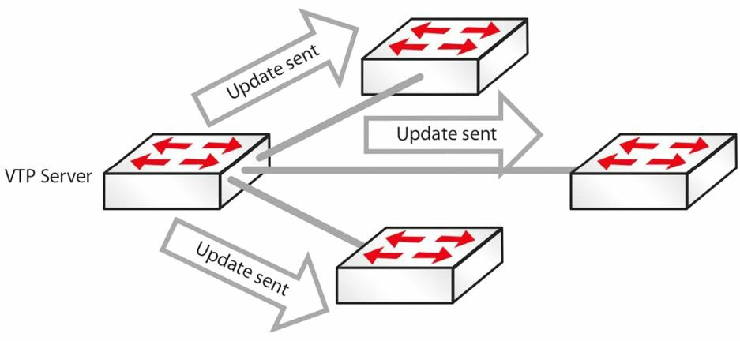
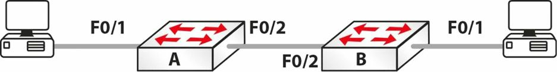

# 第3天

**中继、DTP 及 VLAN 间路由**

**Trunking, DTP, and Inter-VLAN Routing**


## 第三天的任务

- 阅读今天的课文
- 回顾昨天的课程
- 完成今天的实验
- 阅读 ICND1 记诵指南


在最小规模的那些办公室里，你才会遇到仅使用一台交换机的情况，但是网络基础设施通常是由多台交换机构成的。多台交换机带来了其配置上的挑战，要求你对中继及其有关的问题有深入理解。思科将多台交换机的安装和故障排除，视为一个 CCNA 级别的基础主题。


今天你将学到。

- 中继工作方式，trunking
- 动态中继协议（Dynamic Trunking Protocol, DTP）
- VLAN 间路由

本单元覆盖 ICND1 考试大纲的以下要求。

- 在思科交换机上配置并验证中继
- DTP
- 自动协商
+ VLAN 间路由的配置和验证（单臂路由，router-on-a-stick）
    - 子接口，subinterfaces
    - 上行路由，upstream routing
    - 封装，encapsulation
- 配置交换机虚拟接口，configure SVI(Switch Virtual Interface) Interfaces


## 配置并验中继链路

中继是一个可以承载多种流量类型，每种流量类型都用一个独特的 VLAN ID 做了标记，的交换机端口。在数据经由中继端口，或者说中继链路得以交换时，就被那个外出交换机中继端口（the egress switch trunk port）打上了标签（或者叫进行了着色）, 这样做了过后，接收交换机就能够分辨出数据是属于哪个特定的 VLAN 了。在接收交换机的进入端口（the receiving switch ingress port）上, 标签会被移除，然后数据就被转发给相应的目的设备。

在思科 IOS Catalyst 交换机上部署 VLAN 中继的头一项配置任务，就是把需要的接口配置为一个二层交换端口。这是通过执行 `switchport` 接口配置命令完成的。

> **注意：** 该命令只在兼容三层或多层交换机上需要。在诸如 Catalyst 2960 系列这样的二层交换机上并不适用。那些支持命令 `ip routing` 的交换机才被认为是兼容三层的交换机。

接着就是要中继链路所要使用的封装协议。这是通过执行 `switchport trunk encapsulation [option]` 命令完成的。此命令可用的选项有下面这些。

```console
Switch(config)#interface FastEthernet1/1
Switch (config-if)#switchport trunk encapsulation ?
dot1q - Interface uses only 802.1q trunking encapsulation when trunking
isl - Interface uses only ISL trunking encapsulation when trunking
negotiate - Device will negotiate trunking encapsulation with peer on interface
```

关键字 `[dot1q]` 强制该交换机端口使用 IEEE `802.1Q` 封装方式。关键字 `[isl]` 强制该交换机端口使用思科 ISL 封装方式。
而 `[negotiate]` 关键字则指明说在动态交换机间链路协议（Dynamic Inter-Switch Link Protocol, DISL）及动态中继协议（Dynamic Trunking Protocol, DTP）无法就封装格式达成一致时，ISL 作为备选格式。DISL 简化了两台互联的快速以太网设备间 ISL 中继链路的建立。在 DISL 协议下，只需链路的一端需要配置为中继端口，因此而将 VLAN 中继配置过程大大简化。


DTP 是一个***思科专有的***点对点协议（point-to-protocol）, 它在两台交换机间协商建立起某种常见中继模式。DTP 会在稍后专门讲到。下面的输出演示了如何将某交换机端口配置为在建立起一条中继链路是采用 IEEE `802.1Q` 封装方式。

```console
Switch (config)#interface FastEthernet1/1
Switch (config-if)#switchport
Switch (config-if)#switchport trunk encapsulation dot1q
```

此配置可通过命令 `show interfaces [name] switchport` 进行验证，如下列输出所示。

```console
Switch#show interfaces FastEthernet1/1 switchport
Name: Fa0/2
Switchport: Enabled
Administrative Mode: dynamic desirable
Operational Mode: trunk
Administrative Trunking Encapsulation: dot1q
Operational Trunking Encapsulation: dot1q
Negotiation of Trunking: On
Access Mode VLAN: 1 (default)
Trunking Native Mode VLAN: 1 (default)
...
[Truncated Output]
```

中继端口配置的第三步，就是部署配置，以确保该端口已被指定为中继端口。可以通过两种方式完成。

- 手动（静态）地完成中继配置
- 使用动态中继协议（Dynamic Trunking Protocol, DTP）


### 手动（静态）中继配置

手动配置一个中继，是通过在所需要的交换机上，执行接口配置命令 `switchport mode trunk` 完成的。此命令将该端口强制变成永久（静态）中继模式。下面的配置输出演示了如何将一个端口静态地配为中继端口。

```console
VTP-Server(config)#interface FastEthernet0/1
VTP-Server(config-if)#switchport
VTP-Server(config-if)#switchport trunk encapsulation dot1q
VTP-Server(config-if)#switchport mode trunk
VTP-Server(config-if)#exit
VTP-Server(config)#
```

如你使用的是一台低端交换机，就大可以忽略 `switchport` 命令，上面的输出是来自一台 Catalyst 6000 系列交换机。此配置可通过 `show interfaces [name] switchport` 命令予以验，如下面的输出所示。

```console
VTP-Server#show interfaces FastEthernet0/1 switchport
Name: Fa0/1
Switchport: Enabled
Administrative Mode: trunk
Operational Mode: trunk
Administrative Trunking Encapsulation: dot1q
Operational Trunking Encapsulation: dot1q
Negotiation of Trunking: On
Access Mode VLAN: 1 (default)
Trunking Native Mode VLAN: 1 (default)
...
[Truncated Output]
```

尽管中继链路的静态配置强制交换机建立一条中继，动态 ISL 和动态中继协议（DTP）数据包仍能从该接口发出。这样做了后，一条静态配置的中继链路就可以与相邻的使用了 DTP 的交换机，建立起中继关系，接着的小节将会讲到。经由 `show interfaces [name] switchport` 命令的输出，便可验证这点。如下面的输出所示。

```console
VTP-Server#show interfaces FastEthernet0/1 switchport
Name: Fa0/1
Switchport: Enabled
Administrative Mode: trunk
Operational Mode: trunkAdministrative Trunking Encapsulation: dot1q
Operational Trunking Encapsulation: dot1q
Negotiation of Trunking: On
Access Mode VLAN: 1 (default)
Trunking Native Mode VLAN: 1 (default)
...
[Truncated Output]
```

在上面的输出中，粗体文字表明尽管中继链路是静态配置的，端口仍然在发出 DTP 和 DISL 数据包。在一些场合，此特性被看成是不受欢迎的。因此，通过执行接口配置命令 `switchport nonegotiate`，在静态配置作为中继链路的端口上关闭 DISL 及 DTP 数据包发送，被认为是一种良好实践，具体操作如以下的输出。

```console
VTP-Server(config)#interface FastEthernet0/1
VTP-Server(config-if)#switchport
VTP-Server(config-if)#switchport trunk encapsulation dot1q
VTP-Server(config-if)#switchport mode trunk
VTP-Server(config-if)#switchport nonegotiate
VTP-Server(config-if)#exit
VTP-Server(config)#
```

再一次，`show interfaces [name] switchport` 命令可被用作验证配置，像下面这样。

```console
VTP-Server#show interfaces FastEthernet0/1 switchport
Name: Fa0/1
Switchport: Enabled
Administrative Mode: trunk
Operational Mode: trunk
Administrative Trunking Encapsulation: dot1q
Operational Trunking Encapsulation: dot1q
Negotiation of Trunking: Off
Access Mode VLAN: 1 (default)
Trunking Native Mode VLAN: 1 (default)
...
[Truncated Output]
```

### 动态中继协议，Dynamic Trunking Protocol, DTP

DTP 是一个在两台交换机之间协商出一种常见中继模式的，思科专有的点对点协议（a Cisco proprietary point-to-protocol）。这种动态协商不止于何种中继模式，还包括中继的封装方式。根据其平台的不同，两种交换机端口所能使用的 DTP 模式如下。

- 动态我要模式，dynamic desirable
- 动态自动模式，dynamic auto

在两台相交换机上使用 DTP 时，如交换机端口默认为动态我要状态，端口就会积极尝试变为中继端口。而如果交换机端口默认为动态自动状态，端口仅会在相邻交换机被设置为动态我要模式时，才反转为中继端口。

图 3.1 演示所有 DTP 模式组合，在两台思科 Ｃatalyst 交换机间，这些组合有的能建立起中继链路，也有的不能建立（在这里的组合都能建立中继链路；请查看图 3.2 之后的说明）。


*图 3.1 -- DTP 模式组合*

图 3.2 示出了将会在两台相邻交换机间成功建立中继链路的有效组合 -- 一端是 DTP 另一端静态配置为中继端口。


*图 3.2 -- DTP 模式组合，第二部分*


> **注意：** 如果两台交换机都设置为动态自动模式，它们是无法建立起中继链路的，知道这一点很重要。这因为，不同于动态我要模式，动态自动模式是一种消极模式，它等待另一端发起中继建立。因此，在两个消极端口连接时，既不会发起中继建立，同时中继链路也绝不会形成。与此类，一个静态配置的交换机端口同时配置了 `switchport nonegotiate` 命令的话，它绝不会与相邻的使用 DTP 的交换机形成中继，因为这会阻止 DISL 及 DTP 数据包从那个端口发出。

在交换的局域网中应用 DTP 时，`show dtp [interface <name>]` 命令就可用来显示交换机的全局 DTP 信息以及特定接口的 DTP 信息。下面的输出给出了 `show dtp` 命令打印出的信息。

```console
VTP-Server#show dtp
Global DTP information
        Sending DTP Hello packets every 30 seconds
        Dynamic Trunk timeout is 300 seconds
        4 interfaces using DTP
```

从上面的输出可以看出，交换机每 30 秒就发出一个 DTP 数据包。而 DTP 超时被设置为 300 秒（5 分钟），当前有 4 个接口正使用着 DTP。命令 `show dtp intferface [name]` 会打印出特定接口的 DTP 信息，这些信息中包括了接口的类型（中继或接入）、端口当前的 DTP 配置情况、中继的封装方式，以及 DTP 数据包统计信息，如下面的输出所示。

```console
VTP-Server#show dtp interface FastEthernet0/1
DTP information for FastEthernet0/1:
    TOS/TAS/TNS:                                TRUNK/ON/TRUNK
    TOT/TAT/TNT:                                802.1Q/802.1Q/802.1Q
    Neighbor address 1:                         000000000000
    Neighbor address 2:                         000000000000
    Hello timer expiration (sec/state):         7/RUNNING
    Access timer expiration (sec/state):        never/STOPPED
    Negotiation timer expiration (sec/state):   never/STOPPED
    Multidrop timer expiration (sec/state):     never/STOPPED
    FSM state:                                  S6:TRUNK
    # times multi & trunk                       0
    Enabled:                                    yes
    In STP:                                     no
    Statistics
    ----------
    0 packets received (0 good)
    0 packets dropped
        0 nonegotiate, 0 bad version, 0 domain mismatches, 0 bad TLVs, 0 other
    764 packets output (764 good)
        764 native, 0 software encap isl, 0 isl hardware native
    0 output errors
    0 trunk timeouts
    2 link ups, last link up on Mon Mar 01 1993, 00:00:22
    1 link downs, last link down on Mon Mar 01 1993, 00:00:20
```

### IEEE `802.1Q` 原生 VLAN

昨天的课程中，你学到了 `802.1Q`， 或是 VLAN 标记法，在除了原生 VLAN 的帧外的所有帧中，插入一个标签。IEEE 定义了原生 VLAN, 以提供给不能明白 VLAN 标签的，原有的 `802.3` 端口以连通性。

默认情况下，`802.1Q` 中继将 `VLAN 1` 作为原生 VLAN。执行命令 `show interfaces [name] switchport` 或命令 `show interfaces trunk`，就可查看到默认原生 VLAN 是哪一个，如下面的输出所示。

```console
VTP-Server#show interfaces FastEthernet0/1 switchport
Name: Fa0/1
Switchport: EnabledAdministrative Mode: trunk
Operational Mode: trunk
Administrative Trunking Encapsulation: dot1q
Operational Trunking Encapsulation: dot1q
Negotiation of Trunking: On
Access Mode VLAN: 1 (default)
Trunking Native Mode VLAN: 1 (default)
Voice VLAN: none
...
[Truncated Output]
```

交换机使用 VLAN 1 来承载一些特定的协议流量，比如思科发现协议（Cisco Discovery Protocol, CDP）、VLAN 中继协议（VLAN Trunking Protocol, VTP）、端口聚合协议（Port Aggregation Protocol, PAgP）, 以及动态中继协议（Dynamic Trunking Protocol, DTP） 等的协议信息。CDP 和 PAgP 将在今天的课程后面部分详细讨论。尽管默认原生 VLAN 总是 VLAN 1, 它是可以手动修改为任何不在**保留 VLANs** 中的任何有效 VLAN 编号的。

但是，**中继链路两端上的原生 VLAN 必须一致**，记住这点是很重要。如出现了原生 VLAN 不匹配，生成树协议（Spanning Tree Protocol, STP）就把该端口置为端口 VLAN ID (port VLAN ID, PVID) 不一致状态，且不会转发该链路。此外，CDPv2 也会在交换机间传送原生 VLAN 信息，而在出现原生 VLAN 不匹配后，将会在交换机控制台上打印错误消息。通过对所需的 `802.1Q` 中继链路，执行接口配置命令 `switchport trunk native vlan [number]` 可以修改其默认原生 VLAN。如下面的输出所示。

```console
VTP-Server(config)#interface FastEthernet0/1
VTP-Server(config-if)#switchport trunk native vlan ?
<1-4094>    VLAN ID of the native VLAN when this port is in trunking mode
```


### VLAN 间路由，Inter-VLAN Routing

默认情况下，尽管 VLANs 能够跨越整个的二层交换网络，一个 VLAN 中的主机却是不能直接和其它 VLAN 中的主机直接通信的。为实现这个目的，必须对不同 VLANs 间的流量进行路由。这就叫做 VLAN 间路由。交换局域网（switched LANs） 中的 VLAN 间路由有三种实现方式，下面有分别列出，这三种方式及其各自的优势和劣势，接下来的部分会详细介绍。

- 采用物理的路由器接口的 VLAN 间路由, Inter-VLAN routing using physical router interfaces
- 采用路由器子接口的 VLAN 间路由, Inter-VLAN routing using router subinterfaces
- 采用交换机虚拟接口的 VLAN 间路由, Inter-VLAN routing using switched virtual interfaces


**采用物理的路由器接口的 VLAN 间路由**

为实现 VLAN 间路由通信的第一种方式，需要用到带有多个接口的路由器，来作为每个单独配置 VLAN 的网关。此时路由器就能够使用这些物理的 LAN 接口，将接收自一个 VLAN 的数据包，路由到其它 VLAN 上。此种方式如图 3.3 所示。


*图 3.3 -- 采用多个物理路由器接口的 VLAN 间路由*

图 3.3 演示了用到两个不同 VLANs 的单一 LAN，这两个 VLANs 都有分配给各自的 IP 子网。尽管图中画出的网络主机都是连接在同一物理交换机上，但因为它们处于不同的 VLANs 中， VLAN 10 中的主机与 VLAN 20 中的主机之间的数据包必须要经过路由才行，而在同样 VLAN 中的数据包只需要简单的交换即可。

这种方案的最主要优势在于，它是简单的，且易于部署。而最主要的劣势在于，它不具有可扩展性。比如说，，当交换机上配置了有 5 个、10 个，甚至 20 个额外的 VLANs 时，路由器上就要有相应数量的物理接口才行。在大多数情况下，这在技术上是不可行的。

在采用多物理路由器接口时，各需要的 VLAN 中到路由器的交换机链路，被配置为接入链路。然后路由器上的物理接口都配置上相应的 IP 地址，而 VLAN 上的网络主机，要么以静态方式配置上相应 VLAN 的 IP 地址，将该路由器物理接口作为默认网关，要么通过 DHCP 完成配置。图 3.3 中交换机的配置，在下面的输出中有演示。

```console
VTP-Server-1(config)#vlan 10
VTP-Server-1(config-vlan)#name Example-VLAN-10
VTP-Server-1(config-vlan)#exit
VTP-Server-1(config)#vlan 20
VTP-Server-1(config-vlan)#name Example-VLAN-20
VTP-Server-1(config-vlan)#exit
VTP-Server-1(config)#interface range FastEthernet0/1 – 2, 23
VTP-Server-1(config-if-range)#switchport
VTP-Server-1(config-if-range)#switchport access vlan 10
VTP-Server-1(config-if-range)#switchport mode access
VTP-Server-1(config-if-range)#exit
VTP-Server-1(config)#interface range FastEthernet0/3 – 4, 24
VTP-Server-1(config-if-range)#switchport
VTP-Server-1(config-if-range)#switchport access vlan 20
VTP-Server-1(config-if-range)#switchport mode access
VTP-Server-1(config-if-range)#exit
```

2960 交换机上无需 `switchport` 命令，因为其接口已经运行于二层模式。

下面的输出又演示了图 3.3 中的路由器的配置。

```console
R1(config)#interface FastEthernet0/0
R1(config-if)#ip add 10.10.10.1 255.255.255.0
R1(config-if)#exit
R1(config)#interface FastEthernet0/1
R1(config-if)#ip add 10.20.20.1 255.255.255.0
R1(config-if)#exit
```

**使用路由器子接口的 VLAN 间路由**

采用路由器子接口实现 VLAN 间路由的方法，解决了使用多路由器物理接口方法所可能存在的伸缩性问题。有了路由器子接口，就只需要路由器有一个物理接口就行，接下来的子接口是经由在那个物理接口上的配置获得。图 3.4 演示了这种方法。


*图 3.4 -- 采用路由器子接口的 VLAN 间路由*

图 3.4 描绘了图 3.3 中同样的 LAN。但在图 3.4 中，仅使用了一个物理路由器接口。而为了实现一种 VLAN 间路由解决方案，使用 `interface [name].[subinterface number]` 全局配置命令，在该主要路由器接口上配置出了子接口。而通过命令 `encapsulation [isl|dot1q] [vlan]` 子接口配置命令，又将各子接口与某个特定 VLAN 关联了起来。最后一步就是给子接口配置上需要的 IP 地址。

在交换机上，那条连接路由器的单一链路，必须要配置为中继链路，这是因为**路由器不支持 DTP**。假如中继配置成 `802.1Q` 中继，那么在原生 VLAN 不是默认原生 VLAN 时，此中继的原生 VLAN 一定要定义。而该**原生 VLAN 也要在相应的路由器子接口上予以配置，配置命令为 `encapsulation dot1q [vlan] native` 子接口配置命令**。下面的输出演示了使用单一物理接口的 VLAN 间路由配置（又称作 “单臂路由，router-on-a-stick”）。图 3.4 中绘出的两个 VLANs 在下面的输出中也有显示，同时还有一个额外的 VLAN 用于管理用；该管理 VLAN 将被配置为原生 VLAN。

```console
VTP-Server-1(config)#vlan 10
VTP-Server-1(config-vlan)#name Example-VLAN-10
VTP-Server-1(config-vlan)#exit
VTP-Server-1(config)#vlan 20
VTP-Server-1(config-vlan)#name Example-VLAN-20
VTP-Server-1(config-vlan)#exit
VTP-Server-1(config)#vlan 30
VTP-Server-1(config-vlan)#name Management-VLAN
VTP-Server-1(config-vlan)#exit
VTP-Server-1(config)#interface range FastEthernet0/1 – 2
VTP-Server-1(config-if-range)#switchport
VTP-Server-1(config-if-range)#switchport access vlan 10
VTP-Server-1(config-if-range)#switchport mode access
VTP-Server-1(config-if-range)#exit
VTP-Server-1(config)#interface range FastEthernet0/3 – 4
VTP-Server-1(config-if-range)#switchport
VTP-Server-1(config-if-range)#switchport access vlan 20
VTP-Server-1(config-if-range)#switchport mode access
VTP-Server-1(config-if-range)#exit
VTP-Server-1(config)#interface FastEthernet0/24
VTP-Server-1(config-if)#switchport
VTP-Server-1(config-if)#switchport trunk encapsulation dot1q
VTP-Server-1(config-if)#switchport mode trunk
VTP-Server-1(config-if)#switchport trunk native vlan 30
VTP-Server-1(config-if)#exit
VTP-Server-1(config)#interface vlan 30
VTP-Server-1(config-if)#description ‘This is the Management Subnet’
VTP-Server-1(config-if)#ip address 10.30.30.2 255.255.255.0
VTP-Server-1(config-if)#no shutdown
VTP-Server-1(config-if)#exit
VTP-Server-1(config)#ip default-gateway 10.30.30.1
```

图 3.4 中的路由器之配置如下面的输出所示。


```console
R1(config)#interface FastEthernet0/0
R1(config-if)#no ip address
R1(config-if)#no shut <- 这一步相当重要，否则子接口也会处于 down down 状态
R1(config-if)#exit
R1(config)#interface FastEthernet0/0.10
R1(config-subitf)#description ‘Subinterface For VLAN 10’
R1(config-subif)#encapsulation dot1Q 10
R1(config-subif)#ip add 10.10.10.1 255.255.255.0
R1(config-subif)#exit
R1(config)#interface FastEthernet0/0.20
R1(config-subitf)#description ‘Subinterface For VLAN 20’
R1(config-subif)#encapsulation dot1Q 20
R1(config-subif)#ip add 10.20.20.1 255.255.255.0
R1(config-subif)#exit
R1(config)#interface FastEthernet0/0.30
R1(config-subitf)#description ‘Subinterface For Management’
R1(config-subif)#encapsulation dot1Q 30 native
R1(config-subif)#ip add 10.30.30.1 255.255.255.0
R1(config-subif)#exit
```

此方案的主要优在于，路由器上仅需一个物理接口。主要的劣势在于，该物理端口的带宽，是为所配置的多个子接口所公用的。因此，如果存在很多 VLAN 间流量时，路由器就很快会成为网络的性能瓶颈。

**采用交换机虚拟接口的 VLAN 间路由**

**多层交换机支持在物理接口上配置 IP 地址**。但要先用**接口配置命令 `no switchport`** 对这些接口进行配置，以允许管理员在其上配置 IP 地址。除开使用物理接口外，多层交换机还支持交换机虚拟接口（Switch Virtual Interfaces, SVIs
）技术。

SVIs 是一系列代表了 VLAN 的逻辑接口。尽管某个交换机虚拟接口代表了一个 VLAN，它也不是在某个 VLAN 在交换机上配置出来时，就自动配置出来的；它必须要管理员通过执行 **`interface vlan [number]` 全局配置命令**，手动加以配置。而那些诸如 IP 分址等的三层配置参数，也要与在物理接口上一样，在交换机虚拟接口予以配置。

以下输出演示了在单一交换机上实现 VLAN 间路由，做出的交换机虚拟接口配置。此输出引用了本小节前面的配置输出所用到的 VLANs。

```console
VTP-Server-1(config)#vlan 10
VTP-Server-1(config-vlan)#name Example-VLAN-10
VTP-Server-1(config-vlan)#exit
VTP-Server-1(config)#vlan 20
VTP-Server-1(config-vlan)#name Example-VLAN-20
VTP-Server-1(config-vlan)#exit
VTP-Server-1(config)#interface range FastEthernet0/1 – 2
VTP-Server-1(config-if-range)#switchport
VTP-Server-1(config-if-range)#switchport mode access
VTP-Server-1(config-if-range)#switchport access vlan 10
VTP-Server-1(config-if-range)#exit
VTP-Server-1(config)#interface range FastEthernet0/3 – 4
VTP-Server-1(config-if-range)#switchport
VTP-Server-1(config-if-range)#switchport mode access
VTP-Server-1(config-if-range)#switchport access vlan 20
VTP-Server-1(config-if-range)#exit
VTP-Server-1(config)#interface vlan 10
VTP-Server-1(config-if)#description “SVI for VLAN 10”
VTP-Server-1(config-if)#ip address 10.10.10.1 255.255.255.0
VTP-Server-1(config-if)#no shutdown
VTP-Server-1(config-if)#exit
VTP-Server-1(config)#interface vlan 20
VTP-Server-1(config-if)#description ‘SVI for VLAN 10’
VTP-Server-1(config-if)#ip address 10.20.20.1 255.255.255.0
VTP-Server-1(config-if)#no shutdown
VTP-Server-1(config-if)#exit
```

**在用到多层交换机时，交换机虚拟端口是推荐的配置方法，和实现 VLAN 间路由的首选方案**。

你可通过使用 `show interface vlan x` 命令，来验证某个交换机虚拟接口是配置恰当的（IP 分址等）。下面的输出与 `show interface x` 命令等同。

```console
Switch#show interfaces vlan 100
Vlan100 is up, line protocol is down
    Hardware is EtherSVI, address is c200.06c8.0000 (bia c200.06c8.0000)
    Internet address is 10.10.10.1/24
    MTU 1500 bytes, BW 100000 Kbit/sec, DLY 100 usec,
        reliability 255/255, txload 1/255, rxload 1/255
    Encapsulation ARPA, loopback not set
    ARP type: ARPA, ARP Timeout 04:00:00
```

如你希望使用一台 2960 交换机来路由 IP 数据包，那么就需要对配置进行修改，然后进行重启。这是因为 2960 和更新型号的一些交换机进行了性能调优，实现一种明确的交换机资源分配方式。该资源管理方式叫做交换机数据库管理（Switch Database Managent, SDM）模板。你可以在以下几种 SDM 模板中进行选择。

- 默认（default） -- 各项功能的平衡
- IPv4/IPv4 双协议支持（dual IPv4/IPv6） -- 用于双栈环境(dual-stack environments)
- Lanbase-routing -- 支持各种单播路由（Unicast routes）
- 服务质量（Quality of Service, QoS） -- 提供对各种服务质量特性的支持

下面是在我的 3750 交换机上的输出。这些输出与 2960 上的选项不完全一致，但你明白了这个意思。同时，请记住，**交换机型号及 IOS 对 SDM 配置选项有影响，因此，你要查看你的型号的配置手册**。

```console
Switch(config)#sdm prefer ?
    access                  Access bias
    default                 Default bias
    dual-ipv4-and-ipv6      Support both IPv4 and IPv6
    ipe                     IPe bias
    lanbase-routing         Unicast bias
    vlan                    VLAN bias
```

在你期望在 2960 交换机上配置 VLAN 间路由时，就需要开启 Lanbase-routing SDM 选项。同时在此变更生效前，需要重启交换机。下面是 `show sdm prefer` 命令的输出，该输出告诉你当前的 SDM 配置以及资源分配情况。

```console
Switch#show sdm prefer
The current template is “desktop default” template.
The selected template optimizes the resources in
the switch to support this level of features for
8 routed interfaces and 1024 VLANs.
    number of unicast mac addresses:                6K
    number of IPv4 IGMP groups + multicast routes:  1K
    number of IPv4 unicast routes:                  8K
        number of directly-connected IPv4 hosts:    6K
        number of indirect IPv4 routes:             2K
    number of IPv4 policy based routing aces:       0
    number of IPv4/MAC qos aces:                    0.5K
    number of IPv4/MAC security aces:               1K
Switch#
```

## 虚拟局域网中继协议，VTP

虚拟局域网中继协议（VLAN Trunking Protocol, VTP）是一个思科专有的二层消息协议（a Cisco proprietary Layer 2 messaging protocol）， 用于管理同一个 VTP 域中交换机上 VLANs 增加、删除及重命名。VTP 允许 VLAN 信息在交换网络（the switched network）上宣告/扩散（propagate），这将减轻交换网络中的管理开销, 同时使得众多的交换机能够交换（exchange）并维护一致的 VLAN 信息。此概念在图 3.5 中进行了演示。



*图 3.5 -- VTP 更新*

采用 VTP 能够得到以下好处。

- VLANs 信息的精确监控和汇报
- 整个网络上 VLANs 的一致性
- 易于添加和移除 VLANs


### 配置 VTP, configuring VTP

要让交换机进行 VLAN 信息交换，这些交换机就务必要配置在同一个 VTP 域中，如下面的输出这样。

```console
Switch(config)#vtp mode server  ←this is on by default
Switch(config)#vtp domain in60days
Changing VTP domain name from NULL to in60days
Switch#show vtp status
VTP Version :                       2
Configuration Revision :            0
Maximum VLANs Supported Locally :   255
Number of Existing VLANs :          5
VTP Operating Mode :                Server
VTP Domain Name :                   in60days
```

如要安全的传输 VTP 更新数据，可以为其加上一个口令，但要求 VTP 域中的每台交换机的口令都要匹配。

```console
Switch(config)#vtp password Cisco321
Setting device VLAN database password to Cisco321
```

### VTP 模式， VTP Modes

VTP 以下列三种模式允许。

- 服务器模式（默认模式）， server(default)
- 客户端模式, client
- 透明模式, transparent

上面的输出中，你可以看到配置中有个服务器模式。

**服务器模式， Server Mode**

在服务器模式时，该交换机被授权去**建立、修改及删除整个 VTP 域上的 VLAN 信息**。你对服务器所做的任何修改，都会扩散到整个域中。而 **VLAN 配置是保存在位于闪存中的 VLAN 数据库文件 “vlan.dat” 中的**。

**客户端模式，Client Mode**

处于客户端模式下的交换机，将会接收 VTP 信息，并根据收到的通告信息做出配置上的改变，而不能增加、移除或是改变它们的 VLAN 信息了。客户端交换机也会在它们的中继端口上，发出接收到的 VTP 数据包。记住，你是不能将客户端交换机的某个端口，添加到 VTP 服务器上不存在的 VLAN 中去的。**VLAN 配置也是保存在位于闪存中的 VLAN 数据库文件 “vlan.dat” 中的**。

**透明模式，Transparent Mode**

透明模式下的交换机，将在它们的中继端口上转发接收到的 VTP 信息，却不会应用通告的更新。一台 VTP 透明模式交换机（a VTP Transparent-mode switch） 是可以创建、修改并移除 VLANs 的， 但其 VLAN 配置变动不会通告给其它交换机。**VTP 透明模式仍然需要域信息配置项**。当处于 VTP 服务器与客户端之间的某台交换机，需要有不同的 VLAN 数据库时，它就需要是一台 VTP 透明交换机。**而要配置上扩展的 VLAN 编号范围（the extended VLAN range）时，也要用到透明模式**。


### VTP 修剪， VTP Pruning

时常会出现这样的情形，比如说，在网络的一边有 VLANs 20 到 50, 另一边有 VLANs 60 到 80。而一边的那些交换机上的 VLAN 信息却又无需传送到另一边的那些交换机上。为此，交换机能够将它们的 VLAN 信息进行修剪，因此而减少广播流量，如图 3.6 所示。


*图 3.6 -- 运行中的 VTP 修剪*

下面这行配置将 VTP 修剪功能加入到你的交换机。

`Switch(config)#vtp prunning`

而当你将一台处于其它两台交换机之间的交换机设置为透明模式时，该配置就没有任何意义了，透明模式交换机上的 VTP 修剪不会运行。

### 配置修订号，Configuration Revision Number

配置修订号（the configuration revision number）是一个 32 位整数，用以表明一个 VTP 数据包的修订级别（在上面的 `show vtp status` 输出中可以看到）。此信息用于判断收到的信息是否与当前版本要新。你每次此处于 VTP 服务器模式的交换机上做出 VLAN 变动时，配置修订号就会加 1, 同时变动会通告给 VTP 客户端（处于 VTP 透明模式的交换机，其修订号会是 0, 且不会随 VLAN 数据库的变动而增大）。**修改 VTP 域名称，然后又改回早前的名称，可以实现交换机配置修订号重置**。

> **重要提示：** 当以匹配的 VTP 域名，同时有着较高修订号的一台交换机被配置为 VTP 服务器，或者 VTP 客户端而接入到网络中时，它的数据库将会被通告给其它交换机，进而潜在地将它们各自现有的 VTP 数据库进行替换。这有可能会将整个局域网拖垮，所以在将一台新交换机连入到局域网时，一定要小心谨慎（总是要检查检查当前的 VTP 状态）。


## VLAN 故障排除基础， Basic VLAN Troubleshooting

VLANs 是一种相当直观的交换机特性，它很少需要进行故障排除。你所发现的问题，大部分都是人为配置错误。在第 15 天的课程中，我们会详细讲到二层故障排除。而一些常见的涉及 VLAN 的问题有这些。

1. <u>VLAN 间路由无效，Inter-VLAN routing not working</u>:  检查交换机之间的链路、路由器都是正确设置的，以及相关的 VLANs 允许通过且未被修剪（参照 “VTP 修剪” 部分）。`show interface trunk` 命令将提供所需信息。还要检查路由器子接口有配置了正确的封方式和 VLAN，同时子接口的 IP 地址是那些主机的默认网关。
2. <u>无法创建 VLANs， VLANs cannot be created</u>: 检查交换机的 VTP 模式是否被设置成了 “client”。在 VTP 模式为 “client” 时，是不能创建 VLANs 的。另一个重要原因是交换机所允许的 VLANs 编号。`show vtp status` 命令将提供所需的信息（参看下的“中继和 VTP 故障排除”部分）。
3. <u>同一 VLAN 中的主机之间不能通信，Hosts within the same VLAN cannot reach each other</u>: 重要的是某 VLAN 中的主机都要有一个属于同一子网的 IP 地址。如子网不同，它们之间就无法通信。另一个需要考虑的原因是这些主机是否都是连接到同一台交换机上。如它们不是连接到同一交换机，就要确保交换机之间的中继链路工作正常，还要确保该 VLAN 未在允许清单中被排除/被修剪[ensure that the trunk links(s) between the switches is/are working correctly and that the VLAN is not excluded/not pruned from the allowed list]。`show interface trunk` 命令将给出有关该中继链路的所需信息。


## 中继和 VTP 故障排除，Troubleshooting Trunking and VTP

下面是一些问题实例机器可能的解决方法。

+ 中继宕掉？
    - 接口务必要是 up/up
    - 中继链路两端的封装方式要匹配

```console
SwitchA#show interface fa1/1 switchport
Name: Fa1/1
Switchport: Enabled
Administrative Mode: trunk
Operational Mode: trunk
Administrative Trunking Encapsulation: dot1q
Operational Trunking Encapsulation: dot1q
Negotiation of Trunking: Disabled
Access Mode VLAN: 0 ((Inactive))
```

+ VLAN 信息未有传输
    - 该 VLAN 在中继链路上阻塞了吗
`Switch#show interface trunk`

+ VTP 信息无法到达 VTP 客户端
    - VTP 域名称密码正确吗？

`show vtp status / show vtp password`

+ 在增加一台新的交换机后，所有 VTP 信息都变动了
    - 总是客户端模式加入新的交换机（但请查看上面的有关“配置修订号（the configuration revision number）”的提示）
    - 服务器模式将通告新信息

+ VTP 修剪无效
    - 中间是否有一台透明交换机？
    - 该 VLAN 允许通过该中继链路？

## VLAN 间路由故障排除， Troubleshooting Inter-VLAN Routing

VLAN 间路由故障可以多种形式出现，尤其是考虑在该过程中涉及多种设备（交换机、路由器等）。通过下面给出的适当故障排除方法论，你就能够将问题孤立在某台特定设备上，接着再其对应到一个错误配置的具体特性。

从连通性立足点上看，下面这些情事都应该检查一下。

- 检查一下终端主机连接了正确的交换机端口
- 检查一下正确的交换机端口连接了正确的路由器端口（如使用了一台路由器做 VLAN 间路由）
+ 检查一下在此过程中所涉及到的每个端口承载的是正确的 VLANs
    - 连接终端站的那些端口，通常是被分配到一个特定 VLAN 的接入端口
    - 而将交换机连接至路由器的那些端口，则通常是中继端口

在确认设备之间的连通性无误后，逻辑上下一步就是检查二层配置了，**以所配置的中继端口上的封装方式开始**, 这通常是作为首选的 `802.1Q` 封装方式。接着就要确保中继链路两端都是配置了同样的封装方式。

可用于查看封类型的一些命令有以下这些。

- `show interface trunk`
- `show interface <number> switchport`

这里有个输出示例。

```console
Cat-3550-1#show interfaces trunk
Port        Mode        Encapsulation       Status      Native vlan
Fa0/1       on          802.1q              trunking    1
Fa0/2       on          802.1q              trunking    1
Port        Vlans allowed on trunk
Fa0/1       1,10,20,30,40,50
Fa0/2       1-99,201-4094
```

命令 `show interface trunk` 提供的另一重要细节是中继状态。从中继状态可以看出中继是否形成，同时在链路两端都要检查中继状态。如果接口未处于“中继”模式，那么接口的运行模式（on, auto, 等）是最重要的检查项，以弄清接口能否允许与链路另一端形成中继态（a trunking state）。

中继端口上另外一个需要检查的重要元素便是原生 VLAN。原生 VLAN 错误配置可能带来功能缺失，抑或安全问题。中继链路的两端的原生 VLAN 需要匹配。

假如在完成二层检查任务后，VLAN 间路由问题仍然存在，你就可以继续进行三层配置检查了。依据用于实现 VLAN 间路由的三层设备，可能会在下列设备上进行配置及配置检查。

- 多层交换机，multilayer switch
- 路由器 -- 物理接口， router -- physical interfaces
- 路由器 -- 子接口，router -- subinterfaces


三层设备上应该检查一下其各接口（或者交换机虚拟接口，SVI）都有分配的正确的子网，同时如有必要，你还应检查一下路由协议。通常情况下，各个 VLAN 都有分配不同的子网，所以你应确保你未曾错误配置了接口。而为检查此项，你可以对特定物理接口、子接口或是 SVI，使用 `show interface` 命令。


## 第三天的问题

1. Name four advantages of using VLANs.
2. Hosts in the same VLAN can be in different subnets. True or false?
3. An access link is part of more than one VLAN. True or false?
4. Name the two trunk link encapsulation types.
5. Which commands will configure and name a VLAN?
6. A trunk link on a switch can be in which five possible modes?
7. Which command would put your interface into VLAN 5?
8. Which command will change the native VLAN?
9. VTP Client mode allows you to configure VLANs. True or false?
10. Name three benefits of using VTP.
11. Which command configures VTP pruning on your switch?


## 第三天问题的答案

1. Containing Broadcasts within a smaller group of devices will make the network faster; saves resources on devices because they process less Broadcasts; added security by keeping devices in a certain group (or function) in a separate Broadcast domain; and flexibility in expanding a network across a geographical location of any size.
2. True, but not recommended.
3. False.
4. `802.1Q` and ISL.
5. The `vlan x` and `name y` commands.
6. On, off, auto, desirable, and nonegotiate.
7. The `switchport access vlan 5` command.
8. The `switchport trunk native vlan x` command.
9. False.
10. Accurate monitoring and reporting of VLANs; VLAN consistency across the network; and ease of adding and removing VLANs.
11. The `vtp pruning` command.


## 第三天的实验

### VLAN 和中继实验

**拓扑图，Topology**



**实验目的，Purpose**

学习如何配置 VLANs 以及中继链路。

**实验步骤，Walkthrough**

1. 你需要在每台 PC 上添加 IP 地址。可自由选择，只要求它们在同一子网上。
2. 在交换机 A 上设置主机名（hostname）, 创建 VLAN 2, 并将连接 PC 的那个接口放到 VLAN 2 中。如你愿意，你也可以赋予 VLAN 2 一个名称。

```console
Switch>en
Switch#conf t
Enter configuration commands, one per line. End with CNTL/Z.
Switch(config)#hostname SwitchA
SwitchA(config)#vlan 2
SwitchA(config-vlan)#name 60days
SwitchA(config-vlan)#interface FastEthernet0/1
SwitchA(config-if)#switchport mode access
SwitchA(config-if)#switchport access vlan 2
SwitchA(config-if)#^Z
SwitchA#show vlan brief
VLAN    Name                Status      Ports
----    ---------   -------------------------------
1       default             active      Fa0/2, Fa0/3, Fa0/4, Fa0/5,
                                        Fa0/6, Fa0/7, Fa0/8, Fa0/9,
                                        Fa0/10, Fa0/11, Fa0/12, Fa0/13,
                                        Fa0/14, Fa0/15, Fa0/16, Fa0/17,
                                        Fa0/18, Fa0/19, Fa0/20, Fa0/21,
                                        Fa0/22, Fa0/23, Fa0/24
2       60days              active      Fa0/1
1002    fddi-default        active
1003    token-ring-default  active
1004    fddinet-default     active
1005    trnet-default       active
SwitchA#
```

3. 将中继链路设置为中继模式。

```console
SwitchA#conf t
Enter configuration commands, one per line. End with CNTL/Z.
SwitchA(config)#int FastEthernet0/2
SwitchA(config-if)#switchport mode trunk
SwitchA#show interface trunk
Port    Mode        Encapsulation   Status      Native vlan
Fa0/2   on          802.1q          trunking    1
Port    Vlans allowed on trunk
Fa0/2   1-1005
```

4. 如你愿意，设置在该中继链路上仅允许 VLAN 2。

```console
SwitchA(config)#int FastEthernet0/2
SwitchA(config-if)#switchport trunk allowed vlan 2
SwitchA(config-if)#^Z
SwitchA#
%SYS-5-CONFIG_I: Configured from console by console
SwitchA#show int trunk
Port    Mode    Encapsulation   Status      Native vlan
Fa0/2   on      802.1q          trunking    1
Port    Vlans allowed on trunk
Fa0/2   2
```

5. 此时，如你自其中一台 PC ping 往另一台，将会失败。这是因为一边是在 VLAN 1 中，另一边在 VLAN 2 中。

```console
PC>ping 192.168.1.1
Pinging 192.168.1.1 with 32 bytes of data:
Request timed out.
Ping statistics for 192.168.1.1:
    Packets: Sent = 2, Received = 0, Lost = 2 (100% loss)
```

6. 此时在交换机 B 上配置同样的那些命令。创建 VLAN、将交换机 PC 端口放入 VLAN 2，并将该接口设置为接入模式，还要将中继链路设置为 “中继”。
7. 现在你就可以从一台 PC 实现跨越中继链路 ping 通另一 PC 了。

```console
PC>ping 192.168.1.1
Pinging 192.168.1.1 with 32 bytes of data:
Reply from 192.168.1.1: bytes=32 time=188ms TTL=128
Reply from 192.168.1.1: bytes=32 time=78ms TTL=128
Reply from 192.168.1.1: bytes=32 time=94ms TTL=128
Reply from 192.168.1.1: bytes=32 time=79ms TTL=128
Ping statistics for 192.168.1.1:
    Packets: Sent = 4, Received = 4, Lost = 0 (0% loss),
Approximate round trip times in milli-seconds:
    Minimum = 78ms, Maximum = 188ms, Average = 109ms
```


### VTP 实验

在一个又两台交换机组成的拓扑中，实验今天所提到的那些 VTP 配置命令。

- 将其中一台交换机配置为 VTP 服务器
- 将另一台交换机配置为 VTP 客户端
- 在两台交换机上配置同样的 VTP 域及口令（the same VTP domain and password）
- 在服务器交换机上创建一系列的 VLANs，然后观察它们是如何彼此之间是如何通告的
- 在两台交换机上都配置 VTP 修剪（VTP pruning）
- 在两台交换机上检查（展示） VTP 配置
- 在两台交换机上配置不同的 VTP 域及口令，并重复上述过程；观察结果的不同

