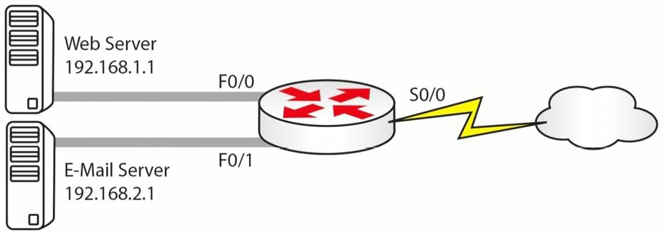

#第6天

**网络地址转换**

**Network Address Translation**

##第六天的任务

- 阅读今天的课文
- 回顾昨天的课文内容
- 完成今天的实验
- 阅读 ICND1 记诵指南
- 在网站[subnetting.org](http://www.subnetting.org) 上花15分钟

网络地址转换是另一个生僻内容(another strange subject)，思科把网络地址转换拆分到ICND1和ICND2两个大纲中了。

今天你会学到下面这些知识。

- NAT基础
- 对NAT的配置和验证
- NAT故障排除

今天的课程涵盖了ICND1大纲的以下要求。

+ 弄清NAT的基本操作
	- NAT的目的
	- NAT地址池
	- 静态NAT
	- 一对一的NAT
	- NAT过载，Overloading
	- 源地址NAT
	- 单向NAT
- 按需求配置并验证NAT

##NAT基础，NAT Basics

想象一下如果网络不是以IP地址运行，而是按颜色来运作。蓝色和黄色有无限的供应，其它颜色却是短缺的。网络分开成使用蓝色和黄色的许多用户，因为这两种颜色可以随意使用。而蓝色用户需要频繁地前往外部网络，那么就需要去买点绿色凭据，在蓝色用户需要与外部网络上的主机通信时，路由器可以用其将蓝色用户的凭据进行替换。路由器此时会像下面这样做。


*图6.1 -- 内部凭据被替换成了外部凭据*

| 内部凭据 | 外部凭据 |
| -- | -- |
| 蓝色1号 | 绿色1号 |
| 蓝色2号 | 绿色2号 |
| 蓝色3号 | 绿色3号 |

在各台蓝色设备完成与外部的连接后，对应的绿色凭据会释放给其它蓝色设备使用。这么做的好处在于**外部设备无法看到内部凭据编号**，且**有助于留下互联网上十分有限的可用凭据**。

我们看到，NAT不仅保护了网络IP地址，同时也是节约地址的另一种方法。**NAT是在路由器或者防火墙上实现的**，那么，代替上面的颜色，你会看到下面这样的情况。


*图6.2 -- 内部地址被替换成外部地址*

| 内部地址 | 外部地址 |
| -- | -- |
| `192.168.1.1` | `200.100.1.5` |
| `192.168.1.3` | `200.100.1.7` |

根据特定的需求，**在路由器上配置NAT有三种方式**。CCNA考试要求你掌握所有三种方式。

为了配置NAT，要先告诉路由器，有哪些内部和外部接口。这是因为事实上可以将众多内部地址替换成某个NAT地址池中的地址（a pool of NAT addresses），或者最起码替换成单一的NAT地址, 并在路由器上的两个以太网接口之间完成NAT。

正如前面说的，对于考试和现实需求来说，通常都会将私有互联网地址转换成互联网上的可路由的地址（routable addresses on the Internet）。这在家庭宽带路由器上就能见到，其通常会给笔记本电脑一个`192.168.1`范围的IP，而在连接到ISP的接口上有着一个可路由的地址。

NAT令到私有网络上的主机可以访问互联网上的资源，或是可以访问到其它公共网络。NAT是一个IETF标准，其让局域网的内部流量使用一个IP地址集合，这些地址通常就是RFC 1918中所定义的私有地址空间，对于外部流量，又使用另一个地址集合，这些地址通常是公开注册的IP地址空间。

NAT为进入和发出的流量去改装数据包的头部，并对每个会话进行跟踪。理解NAT的关键，同时也是NAT故障排除的关键，就是对NAT的有关术语有扎实理解。你应熟悉下面这些NAT名词。

- NAT内部接口
- 内部本地地址
- 内部全球地址
- NAT外部接口
- 外部本地地址
- 外部全球地址

上面NAT术语中的**内部接口，是指由该组织所控制的管理域的边界接口（the border interface of the administrative domain controlled by the organization）。而并不非得要是内部网络上的主机所使用的默认网关**。

而**内部本地地址则是某台内部网络上的主机的IP地址**。在**多数情况下，内部本地地址都是一个`RFC 1918`地址**（也就是不可路由地址，比如`192.168.x.x`或`172.16.x.x`等等）。该地址被转换成外部全局地址，那么**外部全局地址通常就是来自一个公开分配的或是经注册的地址池了**。要记住的是，尽管如此，**内部本地地址也可以是一个公网地址**。

**内部全局地址，则是内部主机在其呈现在外部世界时的地址**。一旦内部IP地址被转换过后，对公网或是其它任何外部网络及主机来说，它就成为了一个内部全局地址了。

与内部接口对应，**外部接口是指不受该组织所控制的管理域的边界**。换句话说，外部接口是连接外部网络的，连接的网络可以是互联网或其它任何的外部网络，比如友商网络等。任何处于外部接口外侧的主机，都不属于本地组织的管理之下。

**外部本地地址是某台外部主机呈现给内部主机的IP地址**。最后，**外部全局地址又是一个合法的、可在互联网上使用的公网地址**。外部本地地址和外部全局地址都是分配自一个全球可路由网络地址空间。

为搞清楚这些概念，图6.3表示了两台主机之间的一个会话中各种地址的使用。中间的网关上开启了NAT。


*图6.3 -- 理解NAT的各种内部外部地址*

NAT内部和外部的分址，是一个经典的考试问题，所以还需在回头看几次这里的内容。

##配置并验证NAT，Configuring and Verifying NAT
 
在思科IOS上对网络地址转换的配置和验证是一个简单的事情。在配置NAT时，要执行下面这些操作。

- 使用接口配置命令`ip nat inside`将一个或多个的接口指定为内部接口。

- 使用接口配置命令`ip nat outside`将某个接口指定为外部接口。

- 配置一条访问控制清单（access control list, ACL）, 其将匹配所有需要转换的流量。此访问控制清单可以是标准、扩展的命名ACL或编号ACL（a standard or an extended named or numbered ACL）。

- 作为可选项，使用全局配置命令`ip nat pool <name> <start-ip> <end-ip> [netmaske <mask> | prefix-length <length>]`, 配置一个全球地址池(a pool of global addresses)。这会定义出一个内部本地地址将会转换成的内部全球地址池。

- 使用全局配置命令`ip nat inside source list <ACL> [interface | pool] <name> [overload]`，全局性地配置上NAT。

> Farai 指出 -- “请看看命令`ip nat inside source static`, 可以在[www.howtonetwork.net/public/698.cfm](http://www.howtonetwork.net/public/698.cfm)免费查阅。”

下面的输出给出了一种思科IOS软件下配置NAT（动态NAT）的方式。可以看出，该配置使用了可用的`description`和`remark`两种特性，来帮助管理员更容易地对网络进行管理和故障排除。

```
R1(config)#interface FastEthernet0/0
R1(config-if)#description ‘Connected To The Internal LAN’
R1(config-if)#ip address 10.5.5.1 255.255.255.248
R1(config-if)#ip nat inside
R1(config-if)#exit
R1(config)#interface Serial0/0
R1(config-if)#description ‘Connected To The ISP’
R1(config-if)#ip address 150.1.1.1 255.255.255.248
R1(config-if)#ip nat outside
R1(config-if)#exit
R1(config)#access-list 100 remark ‘Translate Internal Addresses Only’
R1(config)#access-list 100 permit ip 10.5.5.0 0.0.0.7 any
R1(config)#ip nat pool INSIDE-POOL 150.1.1.3 150.1.1.6 prefix-length 24
R1(config)#ip nat inside source list 100 pool INSIDE-POOL
R1(config)#exit
```

按照这个配置，命令`show ip nat translations`就可以用来对路由器上具体进行的转换进行查看，如下面的输出所示。

```
R1#show ip nat translations
Pro		Inside global	Inside local	Outside local	Outside global
icmp	150.1.1.4:4		10.5.5.1:4		200.1.1.1:4		200.1.1.1:4
icmp	150.1.1.3:1		10.5.5.2:1		200.1.1.1:1		200.1.1.1:1
tcp		150.1.1.5:159	10.5.5.3:159	200.1.1.1:23	200.1.1.1:23
```

在路由器上配置NAT时，通常有以下三个选择。

- 对一个内部地址，用一个外部地址进行替换（静态NAT，static NAT）
- 对多个内部地址，用两个以上的外部地址进行替换（动态NAT，dynamic NAT）
- 将多个内部地址，用多个外部端口进行转换（这就是**端口地址转换**，或者叫**单向NAT**, Port Address Translation or one-way NAT）

###静态NAT

**Static NAT**

在网络内部一些有一台web服务器时，就要将某个特定内部地址，替换成另一个外部地址了。如此时仍然进行动态分址，就没有办法到达该特定目的地址，因为它总是变动的。

>Farai指出，“对那些需要经由互联网可达的所有服务器，比如e-mail或FTP服务器，都要使用静态NAT（如下面的图6.4所示）”



**图6.4 -- 在用的静态NAT**

| 内部地址 | 外部NAT地址 |
| -- | -- |
| `192.168.1.1` | `200.1.1.1` |
| `192.168.2.1` | `200.1.1.2` |

对上面的网络，配置应像下面这样。

```
Router(config)#interface f0/0
Router(config-if)#ip address 192.168.1.1 255.255.255.0
Router(config-if)#ip nat inside
Router(config)#interface f0/1
Router(config-if)#ip address 192.168.2.1 255.255.255.0
Router(config-if)#ip nat inside
Router(config)#interface s0/0
Router(config-if)#ip nat outside
Router(config-if)#exit
Router(config)#ip nat inside source static 192.168.1.1 200.1.1.1
Router(config)#ip nat inside source static 192.168.2.1 200.1.1.2
```
命令`ip nat inside`和`ip nat outside`，告诉路由器哪些是内侧NAT接口，哪些是外侧的NAT接口。而命令`ip nat inside source`命令，就定义了那些静态转换，想要多少条就可以有多少条的该命令，那么就算你掏钱买的那些公网IP地址有多少个，就写上多少条吧。在思科公司，笔者曾解决有关此类问题的大量主要的配置错误，就是找不到`ip nat inside`及`ip nat outside`语句！考试中可能会碰到那些要求找出配置错误的问题。

强烈建议将上述命令敲入到某台路由器中去。本书中有很多的NAT实验，但是在阅读理论章节的同时，你敲入得越多，那么这些信息就能越好地进入你的大脑。

###动态NAT或NAT地址池

通常会用到一组可路由地址，或是一个可路由地址池。一对一的NAT映射，有其局限性，首当其冲的就是成本高，其次路由器上有着多行的配置。动态NAT允许为内部主机配置一或多个的公网地址组。

路由器会维护一个内部地址到外部地址对应的清单，而最后该表格中的转换会超时(Your router will keep a list of the internal addresses to external addresses, and eventually the translation in the table will time out)。可以修改此超时值，但请找Cisco 技术支持工程师（a Cisco TAC engineer）的建议去修改。


*图6.5 -- 到一个NAT公网可路由地址池的内部似有地址*

当路由器上的内部主机发出到外部的连接时，如执行命令`show ip nat translations`, 就会看到下面的包含类似信息的图表。

| 内侧地址 | 外侧NAT地址 |
| -- | -- |
| `192.168.1.3` | `200.1.1.11` |
| `192.168.1.2` | `200.1.1.14` |

在上面的图6.5中，让内部地址使用的是一个从`200.1.1.1`到`200.1.1.16`的地址池。下面是要实现该目的的配置文件。这里就不再给出路由器接口地址了。

```
Router(config)#interface f0/0
Router(config-if)#ip nat inside
Router(config)#interface s0/1
Router(config-if)#ip nat outside
Router(config)#ip nat pool poolname 200.1.1.1 200.1.1.16 netmask 255.255.255.0
Router(config)#ip nat inside source list 1 pool poolname
Router(config)#access-list 1 permit 192.168.1.0 0.0.0.255
```

该ACL用于告诉路由器哪些地址要转换，哪些地址不要转换。而该子网掩码实际上是反转的，叫做反掩码，在第九天会涉及。所有NAT地址池都需要一个名字，而在本例中，它简单地叫做“poolname”。源列表引用自那个ACL（the source list refers to the ACL）, **经译者在GNS3上测试,动态NAT仍然是一对一的地址转换**。

###NAT Overload/端口地址转换/单向NAT

**NAT Overload/Port Address Translation/One-Way NAT**

IP地址处于紧缺之中，在有着成千上万的地址需要路由时，将花一大笔钱（**静态NAT、动态NAT都无法解决此问题**）。在此情况下，可以使用**NAT overload方案**（如图6.6）, 该方案又被思科叫做**端口地址转换（Port Address Translation, PAT）**或**单向NAT**。PAT巧妙地允许将某端口号加到某个IP地址，作为与另一个使用该IP地址的转换区分开来的方式。每个IP地址有多达65000个可以的端口号。

尽管**这是超出CCNA考试范围的，但了解PAT如何处理端口号，会是有用的**。在每个思科文档中，都将每个公网IP地址的可用端口号分为`3`个范围，分别是`0-511`、`512-1023`和`1024-65535`。PAT给每个UDP和TCP会话都分配一个独特的端口号。它会尝试给原始请求分配同样的端口值，但如果原始的源端口号已被使用，它就会开始从某个特别端口范围的开头进行扫描，找出第一个可用的端口号，分配给那个会话。


*图6.6 -- NAT Overload*

此时，命令`show ip nat translations`给出的表格，将会显示下面这样的IP地址及端口号。

| 内侧地址 | 外侧NAT地址（带有端口号） |
| -- | -- |
| `192.168.1.1` | `200.1.1.1:30922` |
| `192.168.2.1` | `200.1.1.2:30975` |

而要配置PAT，需要进行如同动态NAT的那些同样配置，还要在地址池后面加上关键字“overload”。

```
Router(config)#interface f0/0
Router(config-if)#ip nat inside
Router(config)#interface s0/1
Router(config-if)#ip nat outside
Router(config)#ip nat pool poolname 200.1.1.1 200.1.1.1 netmask 255.255.255.0
Router(config)#ip nat inside source list 1 pool poolname overload
Router(config)#access-list 1 permit 192.168.1.0 0.0.0.255
```

这该很容易记住吧！

>Farai指出 -- “以多于一个IP方式使用PAT，就是对地址空间的浪费，因为路由器会使用第一个IP地址，并为每个随后的连接仅增大端口号。这就是为何通常将PAT配置为该接口上的超载(overload)。”

##NAT故障排除

**Troubleshooting NAT**

NAT故障中十次有九次，都是由于路由器管理员忘记了把`ip nat outside`或`ip nat inside`命令加到路由器接口上。事实上，几乎总是存在这个问题！接下来最频繁的错误包括不正确的ACL，以及某个拼写错误的地址池名称（地址池是区分大小写的）。

使用命令`debug ip nat [detailed]`，可以在路由器上对NAT转换进行调试，又可以使用命令`sh ip nat translations`，来查看NAT地址池。

##第六天问题

1. NAT converts the `_______` headers for incoming and outgoing traffic and keeps track of each session.
2. The `_______` address is the IP address of an outside, or external, host as it appears to inside hosts.
3. How do you designate inside and outside NAT interfaces?
4. Which show command displays a list of your NAT table?
5. When would you want to use static NAT?
6. Write the configuration command for NAT `192.168.1.1` to `200.1.1.1`.
7. Which command do you add to a NAT pool to enable PAT?
8. NAT most often fails to work because the `_______` command is missing.
9. Which `debug` command shows live NAT translations occurring?

##第六天问题的答案

1. Packet.
2. Outside local.
3. With the `ip nat inside` and `ip nat outside` commands.
4. The `show ip nat translations` command.
5. When you have a web server (for example) on the inside of your network.
6. `ip nat inside source static 192.168.1.1 200.1.1.1`.
7. The `overload` command.
8. The `ip nat inside` or `ip nat outside` command.
9. The `debug ip nat [detailed]` command.

##第六天的实验

###静态NAT实验

**Static NAT Lab**

**拓扑图**


**静态NAT实验拓扑图**

**实验目的**

学习如何配置静态NAT。

**实验步骤**

1. 将IP地址`192.168.1.1 255.255.255.0`加入到路由器`A`，并修改`hostname`为`Router A`。把IP地址`192.168.1.2 255.255.255.0`加入到路由器`B`。在正确的一侧加上时钟速度(`clock rate`)，然后分别自`A`往`B`和自`B`往`A`进行`ping`测试。如需提示，请回顾先前的那些实验。

2. 在路由器`A`上需要加入一个IP地址，以模拟LAN上的一台主机。**通过一个环回接口，可以实现这个目的**。

```
RouterA#conf t
Enter configuration commands, one per line. End with CNTL/Z.
RouterA(config)#interface Loopback0
RouterA(config-if)#ip add 10.1.1.1 255.0.0.0
RouterA(config-if)#
```

3. 为进行测试，需要告诉`Router B`将发往任何网络的任何流量，都发往`Router A`。通过一条静态路由完成这个。

```
RouterB#conf t
Enter configuration commands, one per line. End with CNTL/Z.
RouterB(config)#ip route 0.0.0.0 0.0.0.0 Serial0/1/0
RouterB(config)#
```

4. 要测试该条静态路由是否工作，通过从`Router A`上的环回接口对`Router B`进行`ping`操作。

```
RouterA#ping
Protocol [ip]:
Target IP address: 192.168.1.2
Repeat count [5]:
Datagram size [100]:
Timeout in seconds [2]:
Extended commands [n]: y
Source address or interface: 10.1.1.1
Type of service [0]:
Set DF bit in IP header? [no]:
Validate reply data? [no]:
Data pattern [0xABCD]:
Loose, Strict, Record, Timestamp, Verbose[none]:
Sweep range of sizes [n]:
Type escape sequence to abort.
Sending 5, 100-byte ICMP Echos to 192.168.1.2, timeout is 2 seconds:
Packet sent with a source address of 10.1.1.1
!!!!!
Success rate is 100 percent (5/5), round-trip min/avg/max = 31/31/32 ms
RouterA#
```

5. 在`Router A`上配置一个静态NAT条目。使用NAT，将地址`10.1.1.1`, 在其离开该路由器时，转换成`172.16.1.1`。同样需要告诉路由器哪个是NAT的内部接口，哪个是外部接口。

```
RouterA#conf t
Enter configuration commands, one per line. End with CNTL/Z.
RouterA(config)#int Loopback0
RouterA(config-if)#ip nat inside
RouterA(config-if)#int Serial0/1/0
RouterA(config-if)#ip nat outside
RouterA(config-if)#
RouterA(config-if)#ip nat inside source static 10.1.1.1 172.16.1.1
RouterA(config)#
```

6. 打开NAT调试，如此就可以看到转换的进行。此时再执行另一个扩展`ping`操作（自`L0`接口的），并查看NAT表。因为IOS的不同，你的输出可能与我的不一样。

```
RouterA#debug ip nat
IP NAT debugging is on
RouterA#
RouterA#ping
Protocol [ip]:
Target IP address: 192.168.1.2
Repeat count [5]:
Datagram size [100]:
Timeout in seconds [2]:
Extended commands [n]: y
Source address or interface: 10.1.1.1
Type of service [0]:
Set DF bit in IP header? [no]:
Validate reply data? [no]:Data pattern [0xABCD]:
Loose, Strict, Record, Timestamp, Verbose[none]:
Sweep range of sizes [n]:
Type escape sequence to abort.
Sending 5, 100-byte ICMP Echos to 192.168.1.2, timeout is 2 seconds:
Packet sent with a source address of 10.1.1.1
NAT: s=10.1.1.1->172.16.1.1, d=192.168.1.2 [11]
!
NAT*: s=192.168.1.2, d=172.16.1.1->10.1.1.1 [11]
NAT: s=10.1.1.1->172.16.1.1, d=192.168.1.2 [12]
!
NAT*: s=192.168.1.2, d=172.16.1.1->10.1.1.1 [12]
NAT: s=10.1.1.1->172.16.1.1, d=192.168.1.2 [13]
!
NAT*: s=192.168.1.2, d=172.16.1.1->10.1.1.1 [13]
NAT: s=10.1.1.1->172.16.1.1, d=192.168.1.2 [14]
!
NAT*: s=192.168.1.2, d=172.16.1.1->10.1.1.1 [14]
NAT: s=10.1.1.1->172.16.1.1, d=192.168.1.2 [15]
!
Success rate is 100 percent (5/5), round-trip min/avg/max = 31/46/110 ms
RouterA#
NAT*: s=192.168.1.2, d=172.16.1.1->10.1.1.1 [15]
RouterA#show ip nat translations
Pro		Inside global	Inside local	Outside local	Outside global
icmp 	172.16.1.1:10 	10.1.1.1:10 	192.168.1.2:10 	192.168.1.2:10
icmp 	172.16.1.1:6 	10.1.1.1:6 		192.168.1.2:6 	192.168.1.2:6
icmp 	172.16.1.1:7 	10.1.1.1:7 		192.168.1.2:7 	192.168.1.2:7
icmp 	172.16.1.1:8 	10.1.1.1:8 		192.168.1.2:8 	192.168.1.2:8
icmp 	172.16.1.1:9 	10.1.1.1:9 		192.168.1.2:9 	192.168.1.2:9
---		172.16.1.1		10.1.1.1 			--- 			---
RouterA#
```

7. 记住，路由器随后很快就会清除该NAT转换，为其它IP地址使用这个/这些NAT地址而对其进行清理。

```
NAT: expiring 172.16.1.1 (10.1.1.1) icmp 6 (6)
NAT: expiring 172.16.1.1 (10.1.1.1) icmp 7 (7)
```

>译者注: 通过本实验，要注意三个问题：一是**可路由地址可以是外部接口同一网段的地址，也可以不是**；二是**NAT超时问题，该参数可以设置**；三是**环回接口的使用, 常用来模拟LAN中的计算机**。

###NAT地址池/动态NAT实验

**NAT Pool Lab**

**拓扑图**


**NAT地址池/动态NAT实验拓扑图**

**实验目的**

学习如何配置一个NAT地址池（动态NAT）。

**实验步骤**

1. 将IP地址`192.168.1.1 255.255.255.0`加入到路由器`A`，并修改`hostname`为`Router A`。把IP地址`192.168.1.2 255.255.255.0`加入到路由器`B`。在正确的一侧加上时钟速度(`clock rate`)，然后分别自`A`往`B`和自`B`往`A`进行`ping`测试。如需提示，请回顾先前的那些实验。

2. 需要给`RouterA`添加两个IP地址来模拟LAN上的主机。通过两个环回接口，可以达到这个目的。这两个IP地址将位处不同子网，但都以`10`地址开头。

```
RouterA#conf t
Enter configuration commands, one per line. End with CNTL/Z.
RouterA(config)#interface Loopback0
RouterA(config-if)#ip add 10.1.1.1 255.255.255.0
RouterA(config-if)#int l1 ← short for Loopback1
RouterA(config-if)#ip address 10.2.2.2 255.255.255.0
RouterA(config-if)#
```

3. 为了进行测试，需要告诉`RouterB`将到任何网络的任何流量，都发往`RouterA`。用一条静态路由完成这点。

```
RouterB#conf t
Enter configuration commands, one per line. End with CNTL/Z.
RouterB(config)#ip route 0.0.0.0 0.0.0.0 Serial0/1/0
RouterB(config)#
```

4. 在`RouterA`上，从环回接口向`RouterB`发出`ping`操作，以此来测试该静态路由是否工作。

```
RouterA#ping
Protocol [ip]:
Target IP address: 192.168.1.2
Repeat count [5]:
Datagram size [100]:
Timeout in seconds [2]:
Extended commands [n]: y
Source address or interface: 10.1.1.1
Type of service [0]:
Set DF bit in IP header? [no]:
Validate reply data? [no]:
Data pattern [0xABCD]:
Loose, Strict, Record, Timestamp, Verbose[none]:
Sweep range of sizes [n]:
Type escape sequence to abort.
Sending 5, 100-byte ICMP Echos to 192.168.1.2, timeout is 2 seconds:
Packet sent with a source address of 10.1.1.1
!!!!!
Success rate is 100 percent (5/5), round-trip min/avg/max = 31/31/32 ms
RouterA#
```

5. 在`RouterA`上配置一个NAT地址池。在本实验中，使用地址池`172.16.1.1`到`172.16.1.10`。任何以`10`开头的地址，都将成为一个NAT。记住你**必须**指定NAT的内部和外部接口，否则NAT就不会工作。

```
RouterA#conf t
Enter configuration commands, one per line. End with CNTL/Z.
RouterA(config)#int l0
RouterA(config-if)#ip nat inside
RouterA(config)#int l1
RouterA(config-if)#ip nat inside
RouterA(config-if)#int Serial0/1/0
RouterA(config-if)#ip nat outside
RouterA(config-if)#exit
RouterA(config)#ip nat pool 60days 172.16.1.1 172.16.1.10 netmask 255.255.255.0
RouterA(config)#ip nat inside source list 1 pool 60days
RouterA(config)#access-list 1 permit 10.1.1.0 0.0.0.255
RouterA(config)#access-list 1 permit 10.2.1.0 0.0.0.255
RouterA(config)#
```

**命令`ip nat pool`创建出地址池。需要给地址池一个自己选择的名称。而命令`netmask`告诉路由器应用到地址池上的网络掩码**。

**命令`source list`告诉路由器查看的ACL。该条ACL告诉路由器哪些网络将与NAT地址池进行匹配和转换**。

6. 打开NAT调试，如此才可以看到转换的发生。接着执行扩展`ping`（自`L0`和`L1`发出的），并查看NAT表。因为IOS平台的不同，你的输出可能和下面的不一样。将会看到NAT地址池中的两个地址正在用到。

```
RouterA#debug ip nat
RouterA#ping
Protocol [ip]:
Target IP address: 192.168.1.2
Repeat count [5]:Datagram size [100]:
Timeout in seconds [2]:
Extended commands [n]: y
Source address or interface: 10.1.1.1
Type of service [0]:
Set DF bit in IP header? [no]:
Validate reply data? [no]:
Data pattern [0xABCD]:
Loose, Strict, Record, Timestamp, Verbose[none]:
Sweep range of sizes [n]:
Type escape sequence to abort.
Sending 5, 100-byte ICMP Echos to 192.168.1.2, timeout is 2 seconds:
Packet sent with a source address of 10.1.1.1
NAT: s=10.1.1.1->172.16.1.1, d=192.168.1.2 [26]
!
NAT*: s=192.168.1.2, d=172.16.1.1->10.1.1.1 [16]
NAT: s=10.1.1.1->172.16.1.1, d=192.168.1.2 [27]
!
NAT*: s=192.168.1.2, d=172.16.1.1->10.1.1.1 [17]
NAT: s=10.1.1.1->172.16.1.1, d=192.168.1.2 [28]
!
NAT*: s=192.168.1.2, d=172.16.1.1->10.1.1.1 [18]
NAT: s=10.1.1.1->172.16.1.1, d=192.168.1.2 [29]
!
NAT*: s=192.168.1.2, d=172.16.1.1->10.1.1.1 [19]
NAT: s=10.1.1.1->172.16.1.1, d=192.168.1.2 [30]
!
Success rate is 100 percent (5/5), round-trip min/avg/max = 17/28/32 ms
RouterA#
NAT*: s=192.168.1.2, d=172.16.1.1->10.1.1.1 [20]
RouterA#ping
Protocol [ip]:
Target IP address: 192.168.1.2
Repeat count [5]:
Datagram size [100]:
Timeout in seconds [2]:
Extended commands [n]: y
Source address or interface: 10.2.2.2
Type of service [0]:
Set DF bit in IP header? [no]:Validate reply data? [no]:
Data pattern [0xABCD]:
Loose, Strict, Record, Timestamp, Verbose[none]:
Sweep range of sizes [n]:
Type escape sequence to abort.
Sending 5, 100-byte ICMP Echos to 192.168.1.2, timeout is 2 seconds:
Packet sent with a source address of 10.2.2.2
NAT: s=10.2.2.2->172.16.1.2, d=192.168.1.2 [31]
!
NAT*: s=192.168.1.2, d=172.16.1.2->10.2.2.2 [21]
NAT: s=10.2.2.2->172.16.1.2, d=192.168.1.2 [32]
!
NAT*: s=192.168.1.2, d=172.16.1.2->10.2.2.2 [22]
NAT: s=10.2.2.2->172.16.1.2, d=192.168.1.2 [33]
!
NAT*: s=192.168.1.2, d=172.16.1.2->10.2.2.2 [23]
NAT: s=10.2.2.2->172.16.1.2, d=192.168.1.2 [34]
!
NAT*: s=192.168.1.2, d=172.16.1.2->10.2.2.2 [24]
NAT: s=10.2.2.2->172.16.1.2, d=192.168.1.2 [35]
!
Success rate is 100 percent (5/5), round-trip min/avg/max = 31/31/32 ms
RouterA#
NAT*: s=192.168.1.2, d=172.16.1.2->10.2.2.2 [25]
RouterA#show ip nat trans
Pro		Inside global	Inside local	Outside local	Outside global
icmp	172.16.1.1:16 	10.1.1.1:16 	192.168.1.2:16 	192.168.1.2:16
icmp	172.16.1.1:17 	10.1.1.1:17 	192.168.1.2:17 	192.168.1.2:17
icmp	172.16.1.1:18 	10.1.1.1:18 	192.168.1.2:18 	192.168.1.2:18
icmp	172.16.1.1:19 	10.1.1.1:19 	192.168.1.2:19 	192.168.1.2:19
icmp	172.16.1.1:20 	10.1.1.1:20 	192.168.1.2:20 	192.168.1.2:20
icmp	172.16.1.2:21 	10.2.2.2:21 	192.168.1.2:21 	192.168.1.2:21
icmp	172.16.1.2:22 	10.2.2.2:22 	192.168.1.2:22 	192.168.1.2:22
icmp	172.16.1.2:23 	10.2.2.2:23 	192.168.1.2:23 	192.168.1.2:23
icmp 	172.16.1.2:24 	10.2.2.2:24 	192.168.1.2:24 	192.168.1.2:24
icmp 	172.16.1.2:25 	10.2.2.2:25 	192.168.1.2:25 	192.168.1.2:25
RouterA#
```

###NAT Overload实验

**NAT Overload Lab**

重复先前的实验。这次，在引用地址池时，将`overload`命令加到该配置行的后面。这会指示路由器使用PAT。去掉`Loopback1`。**请注意，正如Farai指出的那样，在真实世界中，地址池通常只会有一个地址，否则在外部接口上会超载**（Please note that as Farai says, in the real world, your pool will usually have only one address or you will overload your outside interface）。

`RouterA(config)#ip nat inside source list 1 pool 60days overload`

我已经为方便而使用思科Packet Tracer，完成了上面的实验，所以你通常会碰到与我的输出所不一致的输出。下面是一个PAT实验的示例输出。从中可以看出，路由器给每个转换都加上了一个端口号。不幸的是，在NAT地址池实验中，会看到相似的编号，这是一个PAT的混淆之处。

```
RouterA#show ip nat tran
Inside global	Inside local		Outside local		Outside global
10.0.0.1:8759 	172.16.1.129:8759 	192.168.1.2:8759 	192.168.1.2:8759
```
