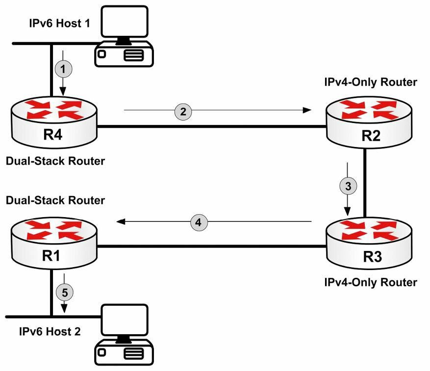

#第8天

**IPv4与IPv6共存的网络环境**

**Integrating IPv4 and IPv6 Network Environments**

##第8天任务

- 阅读下面的理论课文
- 阅读ICND1记诵手册

如同在前一课程模块中所学到的那样，通过从IPv4迁移到IPv6，就能收到数不清的好处。回顾一下，这些优势包括：

- 简化了的IPv6数据包头部

- 更大的地址空间

- IPv6寻址层次，IPv6 addressing hierarchy

- IPv6的扩展能力，IPv6 extensibility

- IPv6消除了广播，IPv6 Broadcast elimination

- 无状态的自动配置，Stateless autoconfiguration

- 集成了移动性，Integrated mobility

- 集成了安全增强，Integrated enhanced security

此课程模块对应了一下CCNA大纲要求：

- 掌握IPv6与IPv4共同运作，比如双栈部署时，所需的技术要求（Describe the technological requirements for running IPv6 in conjunction with IPv4, such as dual-stack implementation）。

在有关IPv6的第7天课程中，专门着重于一个纯IPv6环境，并掌握了IPv6运作原理，还学习了如何配置不同路由协议，来支持IPv6的路由，且在思科IOS软件中进行了验证。尽管对IPv6本身的扎实掌握是重要的，但现实情形在于IPv4仍是当前所使用的占主导地位的互联网协议。因此，在考虑完全迁移到纯IPv6环境时，对如何将两种不同协议栈共同运作，是必要的。

尽管迁移到IPv6环境将提供到前面提到的那些优势，当下的情况在于并非所有可寻址的设备，都支持IPv6, 那么为了那些运行不同协议栈的网络设备，使用上同一网络设施，就要求在同一网络中IPv6与IPv4共存。IPv4与IPv6的集成与共存策略，可被分为以下三个大的类别：

- 双栈部署，Dual-stack implementation

- 隧道技术，Tunnelling

- 协议转换，Protocol translation

在网际网络设备和主机同时用到两种协议栈（也就是IPv4和IPv6）时，就要求采用双栈部署策略。双栈部署令到主机能够同时使用IPv4或IPv6与其它主机建立端到端的IP会话（Dual-stack implementation is required when internetwork devices and hosts use both protocol stacks(i.e., IPv4 and IPv6). Dual-stack implementation allows the hosts to use either IPv4 or IPv6 to establish end-to-end IP sessions with other hosts）。

> **注意**：双栈部署并不是说那些仅支持IPv4或仅支持IPv6的主机，具备与其它主机通信的能力。要实现此特性，就需要其它的协议与机制。双栈仅指主机（或设施）能够同时支持IPv4协议栈**及**IPv6协议栈。

在双栈部署无法应用的情形中，就有可能将IPv6数据要精油IPv4网络进行隧道处理（in situations where Dual-stack implementation can not be used, it is posssible to tunnel the IPv6 packets over IPv4 networks），使用一些隧道来将IPv6数据包封装在IPv4数据包中，以令到这些IPv6数据包进行跨越尚无或是还没有原生支持IPv6的网络部分。这样做允许一些IPv6"岛"（IPv6 "islands"）通过现行的IPv4设施之间相互通信。

> **注意**：在运用隧道技术时，为将IPv6数据包经由IPv4设施进行隧道化传输，节点或互联网络的设备必须支持双栈（with tunnelling, nodes or internetwork devices must support dual-stack in order to tunnel IPv6 packets over the IPv4 infrastructure）。

最后，在某些情况下，有可能出现某些仅IPv4的环境，需要与仅IPv6的环境进行通信，以及反过来的情况。那么在此种情形下，双栈技术或隧道技术部署都不能用到，因此就必须启用IPv4与IPv6之间的协议转换。尽管此中方案也是支持的，但对于集成Ipv4与IPv6网络时，其是最不可选的（while supported, this is the least desirable method of integrating IPv4 and IPv6 networks）。不过因为此方案仍被支持，那么掌握如何实现此种方案，仍是重要的。

这个课程模块的剩余部分，将详细地介绍集成IPv4与IPv6网络的**双栈部署**与**隧道技术**。包括特定于思科IOS软件的一些配置示例。

##IPv4与IPv6的双栈部署

在双栈部署方案下，尽管某些主机有着采用IPv4和IPv6两种协议栈的能力，但在确定何时采用IPv6而不是IPv4协议栈时，这些主机仍需一些帮助。幸运的是，有两种方法可以实现，这两种方法如下：

- 第一种方法需要用户手动配置。如用户知道目的IPv6主机的IPv6地址，就可以用此IPv6地址，自其双栈主机手动建立一此IPv6会话。尽管此方式可以良好运作，但要记住多台主机的IPv4及IPv6地址，会十分繁琐。

- 那么第二种方式就需要使用某种命名服务，比如DNS。使用此种方法，就要同时使用IPv4和IPv6地址，来配置完全合格的域名（Full Qualified Domain Names, FQDNs），比如[www.howtonetwork.com](http://www.howtonetwork.com)。FQDN是由一个IPv4协议栈的`A`记录（an `A` record for the IPv4 protocol stack）, 以及一个IPv6协议栈的`AAAA`记录表示的，这样的FQDN就令到DNS服务器既可使用IPv4, 又可使用IPv6进行查询了。

###在思科IOS路由器中部署双栈支持 
 
尽管对那些不同厂商的具备双栈部署支持的不同类型主机的不同配置方式的讨论，是超出CCNA考试要求范围的。但作为一名未来的网络工程师，掌握如何在思科IOS软件下部署各种双栈方案，是强制性的（imperative to understand how to implement dual-stack solutions in Cisco IOS software）。在思科IOS路由器中，双栈运作的启用，通过简单地在路由器接口上配置好IPv4及IPv6即可。

通过在接口配置命令`ip address [address] [mask]`后添加`[secondary]`关键字，就可以为接口指定多个的IPv4地址。对于IPv6来说，是不需要`[secondary]`关键字的，因为使用第`7`天课程中所介绍的接口配置命令`ipv6 address`，就可以为每个接口配置多个前缀。下面的配置示例，演示了如何在单一的路由器接口上配置多个IPv4地址和IPv6地址及前缀：

```
R3(config)#ipv6 unicast-routing
R3(config)#interface FastEthernet0/0
R3(config-if)#ip address 10.0.0.3 255.255.255.0
R3(config-if)#ip address 10.0.1.3 255.255.255.0 secondary
R3(config-if)#ip address 10.0.2.3 255.255.255.0 secondary
R3(config-if)#ipv6 address 3fff:1234:abcd:1::3/64
R3(config-if)#ipv6 address 3fff:1234:abcd:2::3/64
R3(config-if)#ipv6 address 3fff:1234:abcd:3::3/64
R3(config-if)#ipv6 enable
R3(config-if)#exit
```

> **注意**：尽管在思科IOS软件中IPv4路由默认是开启的，但IPv6路由却是默认关闭的，所以必须显式地开启。

依据这些IPv4与IPv6地址的配置，就可以通过简单地对查看路由器配置，来验证这些配置，如下面的输出所示：

```
R3#show running-config interface FastEthernet0/0
Building configuration...
Current configuration : 395 bytes
!
interface FastEthernet0/0
ip address 10.0.1.3 255.255.255.0 secondary
ip address 10.0.2.3 255.255.255.0 secondary
ip address 10.0.0.3 255.255.255.0
ipv6 address 3FFF:1234:ABCD:1::3/64
ipv6 address 3FFF:1234:ABCD:2::3/64
ipv6 address 3FFF:1234:ABCD:3::3/64
ipv6 enable
end
```

而要查看具体的IPv4及IPv6接口参数，只需使用思科IOS软件的`show ip interface [name]`或`show ipv6 interface [name]`命令即可。下面是`Fastethernet0/0`接口上`show ip interface`的输出：

```
R3#show ip interface FastEthernet0/0 | section address
    Internet address is 10.0.0.3/24
    Broadcast address is 255.255.255.255
    Helper address is not set
    Secondary address 10.0.1.3/24
    Secondary address 10.0.2.3/24
    Network address translation is disabled
```

下面的输出则演示了上一示例中用到的同样的`Fastethernet0/0`接口的`show ipv6 interface`命令，所打印出的信息：

```
R3#show ipv6 interface FastEthernet0/0 | section address
    IPv6 is enabled, link-local address is FE80::213:19FF:FE86:A20
    Global unicast address(es):
        3FFF:1234:ABCD:1::3, subnet is 3FFF:1234:ABCD:1::/64
        3FFF:1234:ABCD:2::3, subnet is 3FFF:1234:ABCD:2::/64
        3FFF:1234:ABCD:3::3, subnet is 3FFF:1234:ABCD:3::/64
    Joined group address(es):
        FF02::1
        FF02::2
        FF02::5
        FF02::6
        FF02::9
        FF02::1:FF00:3
    Hosts use stateless autoconfig for addresses.
```

###思科IOS软件中配置静态IPv4及IPv6主机地址

思科IOS软件通过使用全局配置命令`ip host [name] [v4-address]`及`ipv6 host [name] [v6-address]`, 而提供了对相应的静态IPv4与IPv6主机地址配置的支持。下面的示例演示了在思科IOS软件中，如何配置静态IPv4及IPv6的主机名字与地址：

```
R1(config)#ip host TEST-HOST 10.0.0.3
R1(config)#ipv6 host TEST-HOST 3FFF:1234:ABCD:1::3
```

该静态IPv4与IPv6主机配置可使用`show hosts`命令进行验证，下面打印出了改命令的输出：

```
R1#show hosts
...
[Truncated Output]
...
Host        Port  Flags      Age Type   Address(es)
TEST-HOST   None  (perm, OK)  0  IP     10.0.0.3
TEST-HOST   None  (perm, OK)  0  IPv6   3FFF:1234:ABCD:1::3
```

在同一主机同时配置一个IPv4及IPv6地址时，思科IOS软件将使用IPv6地址。如有使用DNS，那么在主机同时配置了IPv6及IPv4 DNS服务器时，该双栈主机将先搜寻`AAAA`（IPv6）记录，并（在查询不到时）回滚到`A`记录（IPv4）（If DNS is used, the dual-stack host will first search `AAAA`(IPv6) records and then fall back to the `A` records(IPv4) when configured with both IPv6 and IPv4 DNS servers）。可想下面这样通过执行一次简单的到先前配置的静态主机`TEST-HOST`的`ping`操作，对此默认行为进行验证：

```
R1#ping test-host repeat 10
Type escape sequence to abort.
Sending 10, 100-byte ICMP Echos to 3FFF:1234:ABCD:1::3, timeout is 2 seconds:
!!!!!!!!!!
Success rate is 100 percent (10/10), round-trip min/avg/max = 0/1/4 ms
```

###在思科IOS软件中配置IPv4及IPv6的DNS服务器

思科IOS软件中IPv4与IPv6 DNS服务器的配置，都依然是使用全局配置命令`ip name-server [address]`。不过这条命令现在已修改为允许将一个IPv4或IPv6地址，指定为DNS服务器的IP地址。下面的示例演示了如何将路由器配置为同时使用一台IPv4及IPv6 DNS服务器：

```
R1(config)#ip name-server ?
    A.B.C.D Domain server IP address (maximum of 6)
    X:X:X:X::X Domain server IP address (maximum of 6)
R1(config)#ip name-server 3FFF:1234:ABCD:1::2
R1(config)#ip name-server 192.168.1.2
```

> **注意**：正如先前提到的，当在同一路由器上同时配置了IPv4及IPv6 DNS服务器时，路由器将首先查找`AAAA`记录（也就是IPv6）。在如果未找到`AAAA`记录，主机就会查找一条`A`记录，以与该主机名进行通信。

##经由IPv4网络对IPv6数据报进行隧道传输

**Tunnelling IPv6 Datagrams across IPv4 Networks**

通道技术，也就是集成IPv4与IPv6网络的第二种方法，是将IPv6数据包进行封装并通过IPv4网络发送的。为了对本小节中即将说到的几种不同隧道机制进行支持，思科IOS的边缘路由器（Cisco IOS edge routers）必须具有双栈部署（译者注：要配置IPv4和IPv6地址, 并开启IPv6路由），以令到IPv6数据包能够以IPv4数据包方式进行封装，且在终端路由器（the terminating router）处被解封装。需要注意的是，中途的那些路由器（intermediate routers）是无需运行IPv6的。也就是说，这些路由器只需简单的仅IPv4路由器。下图8.1演示了一个典型的隧道技术部署：


*图 8.1 -- 经由IPv4网络进行IPv6数据包的隧道传输*

参考图8.1, 假设那台IPv6 `Host 1`正在将数据报发送给IPv6 `Host 2`, 那么在这些数据包通过该网络时，会顺序发生下面这些事件：

1. IPv6 `Host 1`将那些以IPv6 `Host 2`为目的的IPv6数据包，发送到其默认网关，也就是路由器`R4`。这些数据包是原生的、在数据包头部包含了IPv6源地址及目的地址的IPv6数据包。

2. `R4`是一台双栈路由器。其LAN接口已开启了IPv6, 同时其WAN接口已开启了IPv4。R4有着一个配置在其WAN接口和`R1`的WAN接口，`R1`也是一台双栈路由器, 之间的隧道。在收到IPv6数据包后，`R4`就将它们以IPv4数据包格式进行封装，并转发给`R2`。这些数据包的目的地址被设置为`R1`, 同时该路由器（`R4`）将IPv4头的值设置为41, 以表明IPv6数据包是以IPv4数据包形式封装的。

3. `R2`收到这些IPv4数据包，并简单地运用IPv4头部中的目的地址，将它们路由或转发到其最终目的地。

4. `R3`从`R2`处收到这些IPv4数据包，并简单地运用IPv4头部中的目的地址，将它们路由或转发到其最终目的地。

5. 最终路由器`R1`，也是该隧道的出口，接收到这些原生的IPv4数据包并将其解封装，从而仅剩下IPv6数据包。于是该路由器就该这些IPv6数据包转发给`Host 2`。

封装与解封装过程，对这两台主机以及隧道两端（the tunnel endpoints）之间的中间那些路由器来说，是透明的。在以IPv4数据包进行IPv6数据包的隧道传输上，有着多种方式（参见后面）。因为超出了CCNA考试要求，这里不会涉及任何具体配置。

下面列出了一些其它的隧道方式。思科可能会期望你知道有着这些方式，但不会出有关这些方式如何运作的题目。

- 静态的（手动配置的）IPv6隧道传输，Static(manually configured) IPv6 tunnelling

- 6to4 隧道技术，6to4 tunnelling

- 自动的兼容IPv4隧道技术，Automatic IPv4-compatible tunnelling

- ISATAP 隧道技术，ISATAP tunnelling

- 通用路由封装隧道技术，Generic Routing Encapsulation tunnelling


##第8天问题

1. Name three IPv4 to IPv6 transition mechanism classes.
2. `_______` implementation is required when internetwork devices and hosts use both protocol stacks (i.e., IPv4 and IPv6) at the same time.
3. With dual-stack implementation, name two methods that help hosts decide when to use the IPv6 protocol stack instead of the IPv4 protocol stack.
4. While IPv4 routing is enabled by default in Cisco IOS software, IPv6 routing is disabled by default and must be explicitly enabled. True or false?
5. Name a command that will provide IPv6 interface parameters.
6. The static IPv4 and IPv6 host configuration can be validated using the `_______` command.
7. Which command is used to configure an IPv6 DNS server?
8. `_______` entails encapsulating the IPv6 packets or datagrams and sending them over IPv4 networks.

##第8天答案

1. Dual-stack implementation, tunnelling, and protocol translation.
2. Dual-stack.
3. Manual configuration and naming service.
4. True.
5. The `show ipv6 interface` command.
6. `show hosts`.
7. The `ip name-server` command.
8. Tunnelling.

##第8天实验

###IPv4 - IPv6 基础集成实验

在两台直连的思科路由器上，对本课程模块中讲到的一些IPv6概念与命令进行测试：

- 在设备上开启IPv6单播路由，并在直连接口上同时配置IPv4及IPv6地址

- 使用命令`show interface`及`show ipv6 interface`, 对该配置进行验证

- 为远端接口地址配置IPv4及IPv6主机，configure IPv4 and IPv6 hosts for remote interface addresses

- 在设备上验证这些主机配置（`show`命令）

- 在设备之间通过这些主机名字，进行`ping`操作

- 在两台路由器上配置IPv4及IPv6的DNS服务器

###IPv4 - IPv6 隧道技术实验

在家庭网络环境下，重现“通过IPv4进行IPv6的隧道传输”小节的场景（包括所有的机制）。要依循该小节中所呈现的事件顺序。可访问[www.in60days.com](http://www.in60days.com/)，看看作者是如何完成这个实验的。
