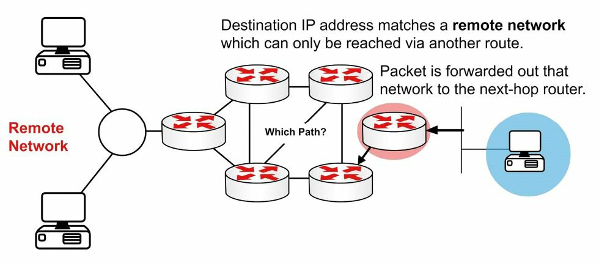
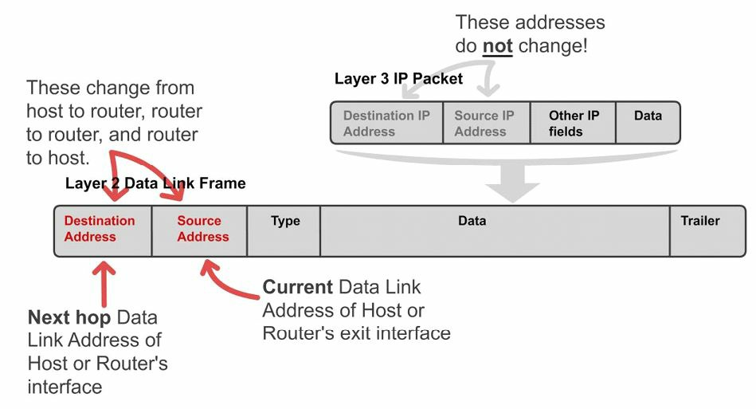
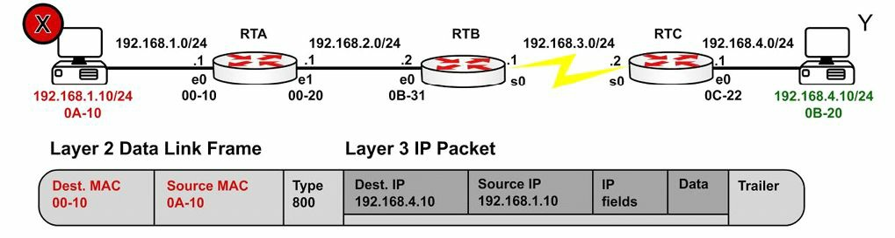
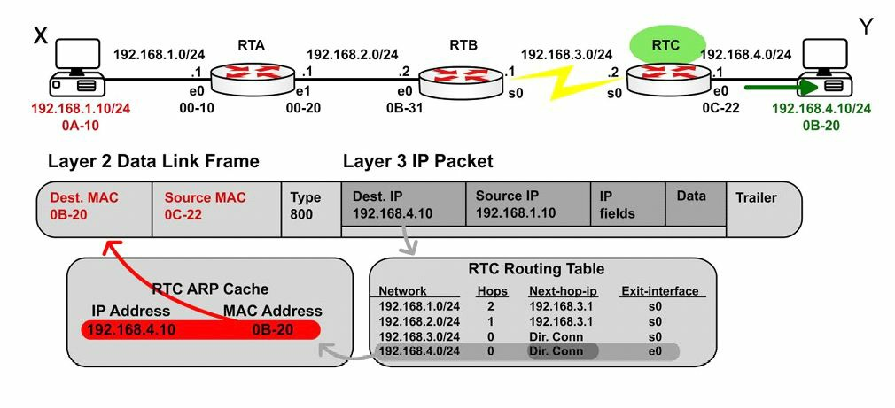
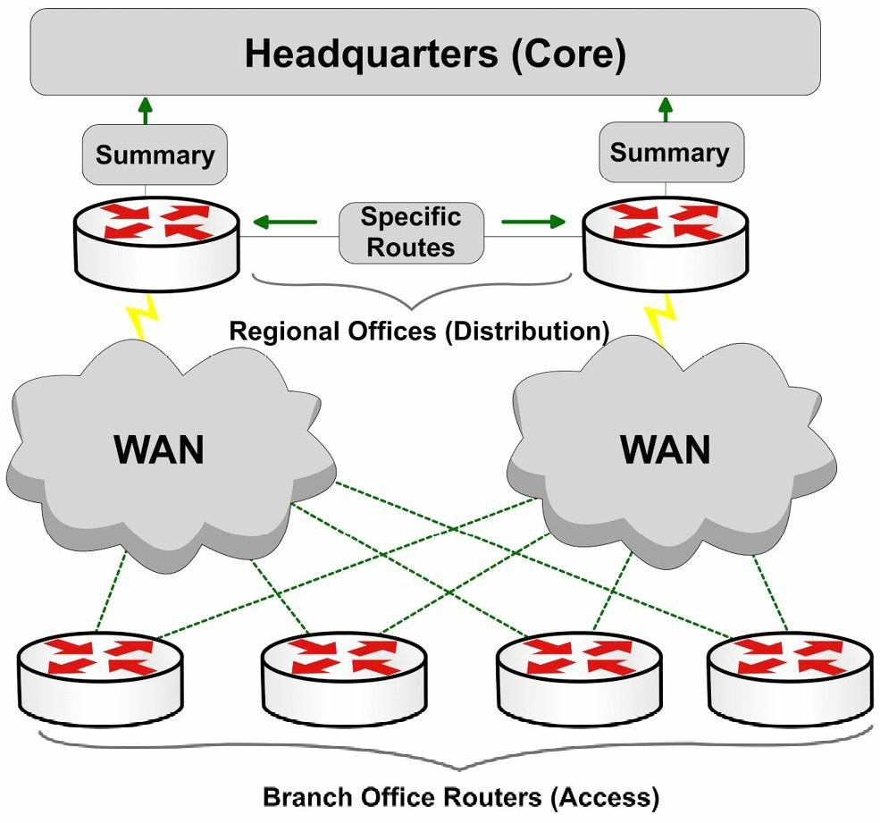
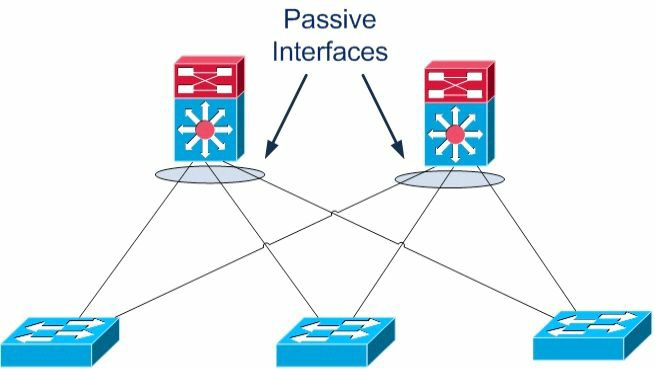
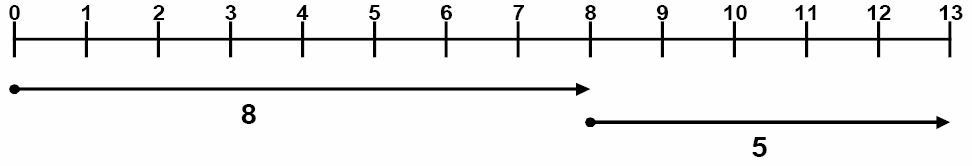

#第10天

**路由的一些概念**

**Routing Concepts**

##第10天的任务

- 阅读今天的课文
- 回顾昨天的课文
- 完成今天的实验
- 阅读ICND1记诵指南
- 在网站[subnetting.org](http://subnetting.org/)上花15分钟

ICND1考试要求你对**基本路由**（basic routing）及**数据包流经某个网络的过程**(packet flow accross a network)，有所掌握。我们也会**对各种路由协议背后的技术有所了解**(take a look at the technology behind routing protocols)。

今天将会学到以下知识。

- 路由基础知识, basic routing
- 各种有类和无类协议，classful and classless protocols
- 路由协议的分类，routing protocol classes

本模块对应了CCNA大纲要求的以下方面。

+ 描述基本路由的一些概念
	- CEF
	- 包转发，packet forwarding
	- 寻获路由器的过程，router lookup process
+ 区分不同路由和路由协议的方式
	- 链路状态对距离矢量，Link State vs. Distance Vector
	- 下一跳，next hop
	- IP路由表，IP routing table
	- 被动接口(它们的工作方式)，passive interfaces（how they work）

##路由基础
=======
##路由基础知识

**Basic Routing**

路由协议的角色，一是**动态地学习其它网络**，二是**与其它设备交换路由信息**，三就是**连接上内部和/或外部网络**。

务必要清楚，路由协议**不会**跨越网络发送数据包。它们是用来确定路由的最佳路径（their role is to determaine the best path for routing）。受路由的那些协议（routed protocols）才真正发出数据，而一个最常见的受路由协议实例，就是IP。

不同路由协议采用不同方式来确定到某个网络或网络节点的最优路径。一些类型的路由协议，在静态环境或者说几乎没有变化的环境中运行最好，但却在这些环境发生变化后，需要很长时间进行收敛（converge）。另一些协议，则能够对网络中发生的变化迅速反应而能快速地进行收敛。

当网络中所有路由器有着同样的视图（view）并对那些最优路由达成一致时，就实现了网络收敛（network convergence）。在要很长时间才能实现收敛时，将会发生远端网络之间间歇性的丢包及连通性丢失。除了这些问题之外，慢速的收敛还会导致网络路由循环（network routing loops）及完全的网络中断（outright network outages）。**所用到的路由协议算法确定了收敛情况**。

因为这些路由协议有着不同特征，而在其各自的伸缩性（scalability）和性能上有所不同。一些路由协议适合于小型网络，而其它协议则既可用于小型、中型网络，又可在大型网络中使用。

###包转发

**Packet Forwarding**

包转发涉及两个过程。

- 确定最优路径, determining the best path
- 发出数据包（交换），sending the packet(switching)

当路由器接收到一个发往其直接连接网络的数据包时，该路由器就检查其路由表并将该数据包转发到那个网络，如图10.1所示。


*图10.1 -- 直连网络*

如数据包的目的地是一个远端网络，就会检查路由表，如果有一条路由或默认路由，那么就转发数据包到下一跳路由器，如下图10.2所示。



*图10.2 -- 远端网络*

如数据包以一个不在路由表中的网络为目的地，且又不存在默认路由，那么该数据包就不丢弃，如下图10.3所示。


*图10.3 -- 没有路由*

**交换过程（the switching process）**允许路由器通过一个接口接收数据包，并从另一接口发出。同时路由器也会以外出链路的适当数据链路帧方式，对数据包进行封装。

可能会要求你对自一个网络接收，并以另一个网络为目的地的数据包所发生的事情进行解释。首先，路由器通过移除二层帧的头部和尾部，实现三层数据包的解封装; 接着，路由器查看该IP数据包的目的IP地址，以找出路由表中的最佳路径; 最后，路由器将该三层数据包封装为一个新的二层帧，并将该帧从离开接口转发出去，那么**封装方式就可能从以太网变为HDLC**。此过程在下图10.4中进行了演示。


*图10.4 -- 某数据包的三层地址*

记住在一个较早的模块中曾提到，当数据包往其最终目的漫游时，源和目的IP地址绝不会变化。而MAC地址则会改变，以允许在那些中间设备之间进行传输。这在下图10.5中有演示。



*图10.5 -- 二层地址改变*

图10.6展示了一个从主机`X`离开，前往主机`Y`的数据包。注意其下一跳MAC地址属于路由器`A`（采用了代理ARP）；但其IP地址则是属于主机`Y`。在帧到达路由器`B`时，以太网头部和尾部将换成WAN协议的头部和尾部，这里可以假定为HDLC的头部和尾部。



*图10.6 -- 离开主机X的数据包*

图10.7展示了离开路由器`A`前往路由器`B`的同样数据包。这里有着一次路由查找，接着数据包就被从接口`E1` **交换出去**(there is a route lookup and then the packet is switched out of interface `E1`)。类型`800`(`Type 800`）表明该数据包是一个IPv4数据包。


*图10.7 -- 离开路由器A的数据包*

图10.8展示了该帧最终到达路由器`C`并被转发给主机`Y`。



*图10.8 -- 离开路由器`C`的数据包*

###互联网协议路由基础知识
 
**Internet Protocol Routing Fundamentals**

正是某种路由协议，才令到路由器实现如何达到其它网络的动态学习。路由协议还令到路由器实现与其它路由器或主机，就学习到的网络信息进行交换。这些路由协议可用于连接内部园区网络（connecting interior/internal campus networks），也用于连接不同企业或路由域（connecting different enterprises or **routing domains**）。因此，不光要掌握这些路由协议的复杂之处，还要牢固掌握何时在何种情况下要用这种路由协议，而不用另一种的原因。

###平坦及层次化路由算法

**Flat and Hierarchical Routing Algorithms**

路由协议算法要么以平坦路由系统运作，要么就以层次化路由系统运作（routing protocol algorithms operate using either a flat routing system or a hierarchical routing system）。层次化路由系统在路由器纳入到被称作域、区域或自治系统的逻辑分组中时，采用的是层次化方法（a hierarchical routing system uses a layered approach wherein routers are placed in logical groupings referred to as domains, areas, or autonomous systems）。这样做允许网络中的不同路由器完成各自特定任务，从而优化在这些层上完成的功能。层次化系统中的一些路由器可与其它域或区域的路由器通信，而其他路由器只能与同一域或区域中的路由器进行通信。这样做可以减少该域中路由器必须处理信息的数量，从而实现网络内的快速收敛。

平坦路由系统没有层次。在此类系统中，路由器一般都要连接到网络中的其它所有路由器，且每台路由器基本上都有着同样的功能。在甚小型网络中，此类算法可以工作得很好；但是，这些算法不是可伸缩的。此外，伴随网络增长，故障排除就变得更为棘手，因为比如原本只需努力解决确切的几个区域的问题，现在却不得不面对整个网络的问题。

由层次化路由系统所带来的主要优势，就是这类系统的可伸缩性。层次化路由系统还令到对网络改变十分容易，这和包含了核心、分布和接入层的传统层次化网络设计带来的优势十分相似。此外，层次化算法可用于在网络的一些区域减少路由更新流量，并减小路由表大小，同时仍然保证完整的网络连通性。
 
###IP分址和地址汇总
 
**IP Addressing and Address Summarisation**

一个IP地址是分作两部分的。第一部分指明了网络地址，而第二部分指明的是主机地址。在设计某个网络时，就会用到某种IP分址方案，来将网络中的主机及设备进行唯一区分。该IP分址方案应是层次化的，且应建立在传统的逻辑层次化模型上。这样做就能实现该分址方案于网络中提供出一些指定点位，在这些点位完成有效的路由汇总。

汇总（summarisation）减少路由器所必须处理信息的数量，以此就可以实现网络的快速收敛。汇总还通过隐藏掉网络中某些区域的详细拓扑信息，从而令到因网络发生改变而受影响区域的大小受限。此概念在下图10.9中进行了演示。



*图10.9 -- 采用思科设计模型的路由汇总*

通过图10.9可以看出，那些分支局（接入层）到地区局路由器（分布层）都是双线路接入（the branch offices(Access Layer) are dual-homed to the regional office routers(Distribution Layer)）。这些层都是采用思科设计模型（Cisco design models）定义出来的。采用某种层次化分址方案，就令到分布层路由器将仅一条的那些分支局子网的汇总路由，通告给核心层。这样做保护了核心层免受任何位处分布层和接入层之间路由器路由抖动的影响，因为除非某条汇总路由所继承自的那些更为具体前缀都从路由表中移除，该条汇总路由是不会抖动的（this protects the Core Layer from the effects of any route flapping between the Distribution and Access Layer routers, because a summary route will not flap until every last one of the more specific prefixes from which it is derived is removed from the routing table）。这又带来了该区域稳定性的提升。此外，核心层路由表大小得以极大地减小。

###管理距离

**Administrative Distance**

管理距离用于决定一个路由信息來源对另一个的可靠性（administrative distance is used to determine the reliability of one source of routing information from another）。一些路由信息来源被认为相较其它源更为可靠；那么，当自两种或更多不同路由协议得出两种或更多到同一目的的路径时，管理距离就可用于决定到某个目的网络或网络节点的最优或首选路径。

在思科IOS软件中，**所有路由信息来源都分配了一个默认管理距离值**。该默认值是一个`0`到`255`之间的整数，其中值`0`分配给最可靠的路由信息来源，值`255`分配给最不可靠的来源。任何分配了管理距离值`255`的路由，都被认为是不受信任的，且不会被放入到路由表中。

**管理距离是一个仅影响本地路由器的本地有意义值**。该值不会在路由域中传播（this value is not propagated throughout the routing domain）。因此，对一台路由器上某个或某些路由来源默认管理距离的修改，仅影响那台路由器对路由信息来源的选用。表10.1展示了思科IOS软件中所用到的默认管理值（考试要求掌握这些值）。

**表10.1 -- 路由器管理距离**

**Router Administrative Distances(ADs)**

<table>
<tr><th>路由来源</th><th>管理距离（AD）</th></tr>
<tr><td>连接的接口，Connected Interfaces</td><td>`0`</td></tr>
<tr><td>静态路由，Static Routes</td><td>`1`</td></tr>
<tr><td>增强内部网关路由协议汇总路由，Enhanced Interior Gateway Routing Protocol(EIGRP) Summary Routes</td><td>`5`</td></tr>
<tr><td>外部边界网关协议路由，External Border Gateway Protocol(eBGP) Routes</td><td>`20`</td></tr>
<tr><td>内部的增强内部网关路由协议路由，Internal Enhanced Interior Gateway Routing Protocol(EIGRP) Routes</td><td>`90`</td></tr>
<tr><td>开放最短路径优先的内部和外部路由，Open Shortest Path First(OSPF) Internal and External Routes</td><td>`110`</td></tr>
<tr><td>中间系统到中间系统的内部和外部路由，Intermediate System-to-Intermediate System(IS-IS) Internal and External Routes</td><td>`115`</td></tr>
<tr><td>路由信息协议路由，Routing Information Protocol(RIP) Routes</td><td>`120`</td></tr>
<tr><td>外部网关协议路由，Exterior Gateway Protocol(EGP) Routes</td><td>`140`</td></tr>
<tr><td>按需路由的路由，On-Demand Routing(ODR) Routes</td><td>`160`</td></tr>
<tr><td>外部的增强内部网关路由协议路由，External Enhanced Interior Gateway Routing Protocol(EIGRP) Routes</td><td>`170`</td></tr>
<tr><td>内部的边界网关协议路由，Internal Border Gateway Protocol(iBGP) Routes</td><td>`200`</td></tr>
<tr><td>不可达或未知路由，Unreachable or Unknown Routes</td><td>`255`</td></tr>
</table>

默认路由来源管理距离会显示在`show ip protocols`命令的输出中。下面的输出演示了这点。

```
R1#show ip protocols
Routing Protocol is “isis”
	Invalid after 0 seconds, hold down 0, flushed after 0
	Outgoing update filter list for all interfaces is not set
	Incoming update filter list for all interfaces is not set
	Redistributing: isis
	Address Summarization:
		None
	Maximum path: 4
	Routing for Networks:
		Serial0/0
	Routing Information Sources:
		Gateway		Distance	Last Update
		10.0.0.2	     115		00:06:53
Distance: (default is 115 )
```

###路由度量值

**Routing Metrics**

各种路由协议算法都会用到度量值，度量值是一个关联到特定路由的数值（routing protocol algorithms use metrics, which are numerical values that are associated with specific values）。使用这些数值来从路由协议学习到的路径中，从最优先到最不优先的顺序，进行优先选用（these values are used to prioritise or prefer routes learned by the routing protocol, from the most preferred to the least preferred）。本质上具有较低路由度量值的路由，就是该路由协议的较高优先顺序的路由。具有最低度量值的路由，通常就是到目的网络代价最小，或者说最优的路由。该条路由将被放入到路由表，并被用于将数据包转发到目的网络。

不同路由算法用到不同变量来计算路由度量值。一些路由算法仅用到一个变量，而其它先进路由算法会用到多于一个变量来决定某条特定路由的度量值。多数情况下，由一种路由协议计算出的度量值，是不兼容于那些由另一种路由协议所使用的度量值的。不同路由协议的度量值都会基于下面变量的一种或几种。

- 带宽，bandwidth
- 开销，cost
- 延迟，delay
- 负载, Load
- 路径长度，path length
- 可靠性, reliability

**带宽**

带宽一词，指的是在给定时间内，从一点往另一点可以传输数据的数量。一些路由算法会用到带宽来决定何种链路类型较其它类型更为首选。比如，某种路由协议会首选`GigabitEthernet`而不是`FastEthernet`, 因为前者比起后者有着提升了的容量。

在思科IOS软件中，接口配置命令**`bandwidth`可用于修改某个接口的默认带宽值，从而有效地操纵某种路由协议选择一个接口而不是另一个**。比如，在用接口配置命令`bandwidth 1000000`将`FastEthernet`接口进行配置后，那么`FastEthernet`和`GigabitEthernet`二者在路由协议看起来就具有了相同的传输容量，而会分配到同样的度量值。其中一条链路仍然是`FastEthernet`链路，而另一条是`GigabitEthernet`的事实，与路由协议不相关。

从一名网络管理员的角度看，重要的是理解**`bandwidth`命令不会影响接口的物理容量**（因此该命令又是被成为是一个道具命令(a cosmetic command)）。也就是说，在`FastEthernet`接口上配置了更高的带宽，并不意味着其就具备了支持`GigabitEthernet`速率的能力。**开放路径优先（OSPF）和增强内部网关路由协议（EIGRP）都在度量值计算中用到了带宽变量**。

###成本

**Cost**

在涉及路由算法时，成本指的是通信成本（the cost, as it pertains to routing algorithms, refers to communication cost）。比如，某公司选择按传输的数据、或按使用时间付费的私有链路，而不是公共链路，就会造成成本的使用。**中间系统到中间系统（IS-IS）路由协议支持一个可选的，度量链路使用成本的费用度量值**（an optional expense metric）。依据不同协议，配置成本会有所不同。

**延迟**

**Delay**

延迟的类型有多种，所有的延迟又影响不同类型的流量。一般意义上的延迟，是指将一个数据包通过互联网络，从其源处移到目的处所需要的时间长度。在思科IOS软件中，接口延迟值以微秒（`us`）计算的。

通过接口配置命令`delay`来配置接口的延迟值。在配置接口延迟值时，重要的是记住**这样做并不会影响到流量**（又是一个道具命令）。比如，配置了一个`5000`的延迟值，并不意味着从该接口发出的流量将有一个额外的`5000us`延迟。下表10.2展示了思科IOS软件中常见接口的默认延迟值。

<table>
<tr><th>接口类型</th><th>延迟（`us`）</th></tr>
<tr><td>`10Mbps Ethernet`</td><td>`1000`</td></tr>
<tr><td>`FastEthernet`</td><td>`100`</td></tr>
<tr><td>`GigabitEthernet`</td><td>`10`</td></tr>
<tr><td>`T1`串行线路</td><td>`20000`</td></tr>
</table>

**EIGRP将接口延迟数值用作其度量值计算的部分**。手动修改接口延迟值会造成EIGRP度量值的重新计算。

**负载**

**Load**

负载对不同的人来说有不同的意思。例如，在一般计算术语中，负载是指某项计算资源，譬如CPU，当前的使用量。而在此处，负载是指某个特定路由器接口使用的比例（load, as it applies in this context, refers to the degree of use for a particular router interface）。接口上的负载是一个`255`的分数。比如，一个`255/255`的负载就表明该接口已完全饱和，而一个`128/255`的负载则表明该接口是`50%`饱和的。默认情况下，负载是按`5`分钟平均值计算的（真实世界中常使用**接口配置命令`load-interval 30`**将其修改为一个最小的`30s`）。**接口负载值可用于EIGRP中的度量值计算**。

**路径长度**

**Path Length**

路径长度度量值是自本地路由器到目的网络所经过路径的总长度。不同路由算法在表示该值时有着不同的形式。比如路由信息协议（Routing Information Protocol, RIP）对在本地路由器和目的网络之间的**路由器**进行计数（跳数，hops）， 并使用该跳数作为度量值，而边界网关协议（Border Gateway Protocol, BGP）则对在本地路由器和目的网络之间**所经过的自治系统**进行计数，并使用该自治系统数来选择最优路径。

**可靠性**

**Reliability**

和负载一样，可靠性一词，也是依据其所在上下文的不同，有着不同的意义。在这里，除非另有说明，总是可以假定可靠性是指网络链路或接口的可靠性、可信任性。在思科IOS软件中，某条链路或某个接口的可靠性表示为一个`255`的分数。比如，一个`255/255`的可靠性值表明接口是`100%`可靠的。与接口负载类似，某接口的默认可靠性是以过去`5`分钟平均值进行计算的。
 
###前缀匹配
 
**Prefix Matching**

思科路由器在决定使用位于路由表中的何条路由，来将流量转发到某个目的网络或节点时，采用的是最长前缀匹配规则（the longest prefix match rule）。在决定采用何条路由表条目来将流量路由至计划的目的网络或节点时，更长，或者说更具体的条目优先于像汇总地址那样的，不那么具体的条目。

最长前缀或最具体路由将用于路由流量到目的网络或节点，此时就会**忽视该最具体路由来源的管理距离**，如有多条经由同样路由协议学习到的重叠前缀，也甚至会忽视分配给该最长前缀的路由协议度量值。表10.3演示了某台将数据包发往地址`1.1.1.1`的路由器上路由选择的顺序。该顺序是基于最长前缀匹配查找的（this order is based on the longest prefix match lookup）。

**表10.3 -- 匹配最长前缀**

<table>
<tr><th>路由表条目</th><th>用到的顺序</th></tr>
<tr><td>`1.1.1.1/32`</td><td>第一</td><tr>
<tr><td>`1.1.1.0/24`</td><td>第二</td><tr>
<tr><td>`1.1.0.0/16`</td><td>第三</td><tr>
<tr><td>`1.0.0.0/8`</td><td>第四</td><tr>
<tr><td>`0.0.0.0/0`</td><td>第五</td><tr>
</table>

> **注意：** 尽管在表10.3中默认路由是位列路由选择顺序最后的，但要记住一条默认路由并非总是出现在路由表中的。如路由表中没有默认路由，同时也没有到地址`1.1.1.1`的路由条目，那么路由器就会简单地丢弃到那个目的地的数据包。大多数情况下，路由器会发给源主机一条ICMP消息，告知其目的主机不可达。而一条默认路由就是用于将目的网络未在路由表中显式列出的数据包，导向默认路由。

###IP路由表的建立

**Building the IP Routing Table**

如没有生成一张包含远端网络路由条目的路由表，或称之为路由信息库，路由器就不能将数据包转发到这些远端网络（without a populated routing table, or Routing Information Base(RIB), that contains entries for remote networks, routers will not be able to forward packets to those remote networks）。路由表可能包含了一些特定网络的条目或简单的一条默认路由。转发进程（the forwarding process）使用路由表中的信息将流量转发到目的网络或主机。路由表本身不会去实际转发流量。

思科路由器使用管理距离、路由协议度量值及前缀长度，来决定哪些路由要实际放入到路由表中，这就允许路由器建立其路由表。通过下面的一般步骤，建立起路由表。

1. 如路由表中当前不存在该路由条目，就将该条目加入到路由表。
2. 如某路由条目比起一条既有路由更为具体，就将其加入到路由表。应注意原较不具体的条目在路由表中仍有留存。
3. 如某路由条目与一条既有条目一样，但其是从一个更为首选的路由源处收到的，就用该新条目替换旧条目。
4. 如该路由条目与一条既有条目一样，又是从同一协议收到的，就做以下处理。
	- 如其比既有路由有着更高的度量值，就丢弃新路由；或
	- 如新路由的度量值更低，就替换既有路由；或
	- 新旧路由的度量值一样时，将两条路由用作负载均衡

默认情况下建立路由信息库，当路由器在决定哪些路由要放入路由表时，总会选用有着最低管理距离值的路由协议。比如，某台路由器收到经由**外部的EIGRP**、OSPF及内部BGP给出的`10.0.0.0/8`前缀时，OSPF的路由将被放入到路由表中。而在那条路由被移除，或是不再收到时，外部EIGRP路由将被放入路由表中。最后如果OSPF和外部EIGRP路由都不再出现时，内部BGP路由就被用到。

一旦路由已放入到路由表，默认情况下比起那些较不具体的路由，最为具体或有着最长匹配前缀的路由总是优先选用的。这在下面的实例中进行了演示，该实例展示了包含有`80.0.0.0/8`、`80.1.0.0/16`及`80.1.1.0/24`前缀路由条目的一个路由表。这三条路由前缀分别通过EIGRP、OSPF及RIP路由协议接收到。

```
R1#show ip route
Codes:	C - connected, S - static, R - RIP, M - mobile, B - BGP
		D - EIGRP, EX - EIGRP external, O - OSPF, IA - OSPF inter area
		N1 - OSPF NSSA external type 1, N2 - OSPF NSSA external type 2
		E1 - OSPF external type 1, E2 - OSPF external type 2
		i - IS-IS, L1 - IS-IS level-1, L2 - IS-IS level-2, ia - IS-IS inter area
		* - candidate default, U - per-user static route, o - ODR
		P - periodic downloaded static route
Gateway of last resort is not set
R		 80.1.1.0/24 [120/1] via 10.1.1.2, 00:00:04, Ethernet0/0.1
D		 80.0.0.0/8 [90/281600] via 10.1.1.2, 00:02:02, Ethernet0/0.1
O E2	 80.1.0.0/16 [110/20] via 10.1.1.2, 00:00:14, Ethernet0/0.1
```

从上面的输出看出，第一条路由是`80.1.1.0/24`。该路由是经由RIP学习到的，因此有着默认的管理距离值120。第二条路由是`80.0.0.0/8`。该路由是经由**内部的EIGRP**学习到的，因此有着默认管理距离值90。第三条路由是`80.1.0.0/16`。该路由是通过OSPF学习到的，且是一条有着管理距离110的**外部的OSPF**路由。

> **注意：** 因为这些路由协议度量值各不相同，在有着来自不同协议的路由安装到路由表时，这些**度量值是在决定要使用的最佳路由时的非要素**。下面的部分将说明思科IOS软件是如何来建立路由表的。

基于该路由表的内容，如路由器收到一个目的为`80.1.1.1`的数据包，就会使用那条RIP路由，因为这是最为具体的条目，尽管EIGRP和OSPF都有着更好的管理距离值而是更为优先的路由来源。`show ip route 80.1.1.1`命令可用于检验这点。

```
R1#show ip route 80.1.1.1
Routing entry for 80.1.1.0/24
	Known via “rip”, distance 120, metric 1
	Redistributing via rip
	Last update from 10.1.1.2 on Ethernet0/0.1, 00:00:15 ago
	Routing Descriptor Blocks:
	* 10.1.1.2, from 10.1.1.2, 00:00:15 ago, via Ethernet0/0.1
		Route metric is 1, traffic share count is 1
```
 
##有类和无类协议

**Classful and Classless Protocols**

有类协议无法使用VLSM（也就是RIPv1和IGRP，它们都已不在CCNA大纲中了）。这是因为它们不会去识别除了默认网络掩码外的其它任何东西。

```
Router#debug ip rip
RIP protocol debugging is on
01:26:59: RIP: sending v1 update to 255.255.255.255 via Loopback0
192.168.1.1
```

有类协议用到VLSM（也就是RIPv2和EIGRP）。

```
Router#debug ip rip
RIP protocol debugging is on
01:29:15: RIP: received v2 update from 172.16.1.2 on Serial0
01:29:15:192.168.2.0/24 via 0.0.0.0
```

##被动接口

**Passive Interfaces**

路由协议设计和配置的一个重要考虑，就是要限制不必要的对等传送（an important routing protocol design and configuration consideration is to limit unnecessary peerings）, 如下图10.10所示。这是通过使用被动接口实现的, 被动接口可以阻止路由器在指定接口上形成路由邻接关系（routing adjacencies）。基于特定路由协议，此功能的使用会有所不同，但其做法通常有以下两类。

- 路由器不在被动接口上发出路由更新
- 路由器不在该接口上发送`Hello`数据包，这样做就不会形成邻居关系

被动接口通常能接收到路由更新或`Hello`数据包，但不被允许发出任何种类的路由协议信息出去。



*图10.10 -- 限制不必要的对等数据交换*

被动接口的一个用例实例就是用于防止路由协议数据自分布层对等传送（peerings）到接入层，就如同上面的图10.10所示。当留有三层跨越这些性质不同的接入层交换机的对等传输时（也就是在跨越交换机区块的不同交换机上有着多台主机），就只会增加内存负载、路由协议更新开销及更多的复杂性。同样，如发生了某条链路故障，流量会经由一台邻居接入交换机传输，而到达另一个VLAN成员处（by having Layer 3 switches across the different Access Layer switches(i.e., having multiple hosts on different switches across switch blocks) you are basically adding memory load, routing protocol update overhead, and more complexity. Also, if there is a link failure, the traffic may transit through a neighbouring Access Layer switch to get to another VLAN member）。

也就是说，你想要消除不必要的路由对等邻接（unnecessary routing peering adjacencies）,那么就要将那些面向二层交换机的端口，配置为被动接口，以此来抑制路由更新通告（suppress routing updates advertisements）。如某台分布层交换机在这些接口之一上，一条都没有接收到来自一台潜在对等设备的路由更新，其就不必去处理这些更新，也就不会通过那个设备形成邻居邻接关系。达成此配置的命令通常就是路由进程配置模式（the Routing Process Configuration mode）中的`passive-interface [interface number]`命令。要获得更多有关思科设计模型（the Cisco design model）的信息，请阅读一份CCDA手册。

##路由协议分类

**Routing Protocol Classes**

路由协议有两大分类 -- **距离矢量**和**链路状态**(Distance Vector and Link State)。距离矢量路由协议在决定通过网络的最优路径（一条或多条）时，传统上使用一个一维矢量（a one-dimensional vector），而链路状态路由协议在决定通过网络的最优路径（一条或多条）时，使用最短路径优先（the Shortest Path First, SPF）。在深入探究路由协议的这两种类别的具体细节之前，我们先看看不同矢量，以及难以搞懂的SPF算法。

###理解矢量

**Understanding Vectors**

一个一维矢量就是一个有方向的量。它就是一个在特定方向或路线上的量（数字）。下图10.11演示了矢量这个概念。



*图10.11 -- 理解矢量*

在图10.11中，第一条线路从`0`开始，到`9`结束，同时第二条线路从`8`开始，在`13`处结束。那么第一条线路的矢量就是`8`, 第二条的矢量就是`5`。运用基础数学，就知道`8+5=13`。矢量的开始点和结束点是无关的。而是与矢量长度及其经过的距离有关。

> **注意：** 矢量亦可朝相反的方向通过（也就是以负数表示的矢量）。

###最短路径优先算法

**The Shortest Path First Algorithms**

最短路径优先算法通过路由器创建出到某个区域或网络骨干中的所有主机的最短路径树，该路由器处于树的根部，并由该路由器完成树的生成计算。为让SPF算法以正确的方式工作，区域中的所有路由器都要有同样的数据库信息。在OSPF中，数据库信息同步是通过数据库交换过程实现的（the SPF algorithm creates a shortest-path tree to all hosts in an area or in the network backbone with the router that is performint the calculation at the root of that tree. In order for the SPF algorithm to work in the correct manner, all routers in the area should have the same database information. In OSPF, this is performed via the database exchange process）。

###距离矢量路由协议

**Distance Vector Routing Protocols**

距离矢量是一种**用距离或跳数计数作为主要度量值**，来决定最佳转发路径的路由协议。距离矢量路由协议又是主要建立在Bellman-Ford算法基础上。距离矢量路由协议发送其邻居路由器的完整路由表，以保持这些路由器有关网络状态的最新信息（Distance Vector routing protocols periodically send their neighbour routers copies of their entire routing tables to keep them up to date on the state of the network）。**在某个小型网络中这也许可以接受，而当网络增大时，通过网络发送的流量数量就会增长**。所有距离矢量路由协议都有着以下的特征。

- 计数到无限大，counting to infinity
- 水平分割, split horizon
- 反向投毒，poison reverse
- 保持计数器，hold-down timers

对计数到无穷的运用，如某个目的网络远于路由协议所允许的最大跳数，该网络就认为其是不可达的。该网络的路由条目因此就不会安装到IP路由表中。

水平分割特征指明路由信息再不能从其接收到的接口再发送出去。这样做就可以阻止路由信息再通告给学习到它的源路由器。尽管此特征是一种了不起的防止环回机制，但也有显著的不利之处，特别是在辐射状网络中。

反向投毒（或路由投毒）是水平分割的拓展。在与水平分割配合使用时，反向投毒可令到自某个接口上收到的网络，再从同样接口通告出去。但反向投毒造成路由器将某网络以“不可达”度量值，通告回发出该网络的路由器，那么收到这些条目的路由器就不会将这些条目再加入到其路由表中了。

保持计数器用于阻止那些先前通告的网络由于宕掉而被放回到路由表中（hold-down timers are used to prevent networks that were previously advertised as down from being placed back into the routing table）。在路由器收到一个某网络宕掉的更新时，就启动它的保持计数器。该计数器告诉路由器在接受任何那个网络的状态变化之前，等待一段指定的时间。

在保持期间，路由器压制住该网络并阻止通告出无效信息（during the hold-down period, the router suppresses the network and prevents advertising false information）。就算路由器收到来自网络可达的其它路由器（它们可能没有收到网络宕掉的触发更新）的信息，也不会将数据包路由到该不可达网络。此机制设计用于阻止黑洞流量（the router also does not route to the unreachable network, even if it receives information from another router(that may not have recieved the triggered update)that the network is reachable. This mechanism is designed to prevent black-holing traffic）。

两个最常见的距离矢量协议，就是**RIP**和**IGRP**。**EIGRP是一个高级距离矢量协议**，距离矢量和链路状态两方面的特性在EIGRP中都有用到（也就是说，它是一个**混合协议(hybrid protocol)**）。

###链路状态路由协议

**Link State Routing Protocols**

链路状态路由协议属于层次化的路由协议，采用区域的概念（the concept of areas），在网络中对路由器进行分组。这样做令到链路状态协议比起距离矢量协议能够更好地伸缩并以一种效率更高的方式运行。运行链路状态路由协议的路由器，创建出一个包含了网络全部拓扑的数据库。这样做令到同一区域中的路由器，都有着网络的同样视图（the same view of the network）。

由于网络中的路由器都有着网络的同样视图，用于在网络间转发数据包的路径就是最优的，且路由环回的可能性得以消除。因此，诸如水平分割和路由投毒这样的技巧对链路状态协议就不适用了，因为它们是用于距离矢量路由协议的。

链路状态路由协议通过发送链路状态通告（Link State Advertisement），或者说链路状态数据包（Link State Packets）给位于同一区域内其它路由器的方式运作。这些数据包包含了有关链路所连接的接口、链路度量值及链路其它变量的信息。随着路由器对这些信息的积累，它们就运行SPF算法并计算出到各台路由器及目的网络的最短（最佳）路径。使用接收到的链路状态信息，路由器建立其链路状态数据库（the Link State Database, LSDB）。在相邻两台路由器的LSDBs同步了时，就说它们形成了邻接关系。

与发送给其邻居的是它们的完整路由表的距离矢量路由协议不同，链路状态路由协议在探测到网络拓扑发生改变时，发送的是增量更新，这点令到链路状态路由协议在较大型的网络中效率更高。使用增量更新也令到链路状态路由协议对网络变化的响应更为迅速，因此比起距离矢量路由协议有着更短的收敛时间。表10.4列出了不同的内部网关协议及其所属类别。

**表10.4 -- IGP类别**

<table>
<tr><th>协议名称</th><th>有类/无类</th><th>协议类别</th></tr>
<tr><td>RIP(版本1)</td><td>有类</td><td>距离矢量</td></tr>
<tr><td>IGRP</td><td>有类</td><td>距离矢量</td></tr>
<tr><td>RIP（版本2）</td><td>无类</td><td>距离矢量</td></tr>
<tr><td>EIGRP</td><td>无类</td><td>高级距离矢量</td></tr>
<tr><td>IS-IS</td><td>无类</td><td>链路状态</td></tr>
<tr><td>OSPF</td><td>无类</td><td>链路状态</td></tr>
</table>

##路由协议的各种目标

**The Objectives of Routing Protocols**

这些路由算法尽管生来就有所不同，但都有着同样的基本目标。虽然一些算法好于其它一些，但所有路由协议都有其优势和不足。这些路由算法的设计，都有着下面这些目标和目的。

- 最优路由, optimal routing
- 稳定性, stability
- 易于使用, easy of use
- 灵活性, flexibility
- 快速收敛, rapid of convergence

###最优路由

**Optimal Routing**

所有路由协议的主要目标之一，就是选择通过网络从源子网或主机到目的子网或主机的最优路径。最优路由依据就是这些路由协议所使用的度量值。一种协议所认为的最优路由，并不一定也是从另一协议角度看的最优路由。比如，RIP可能认为一条仅有两跳长的路径是到某个目的网络的最优路径，尽管这些链路都是`64Kbps`，而诸如OSPF和EIGRP那样的先进协议则会到相同目的的最优路径是经过了`4`台路由器却有着`10Gbps`速率的链路。

###稳定性

**Stability**

网络的稳定与否，是这些路由算法的另一个主要目标。路由算法应足够稳定，以容许无法遇见的网络事件（to accommodate unforeseen network events）, 比如硬件故障甚至错误实现等。尽管这是一个所有路由算法的典型特征，但由于它们对这些事件应对的方式和所用时间，令到一些算法相对其它算法做得更好，因此在现今网络中用到更多。

###易于使用

**Ease of Use**

路由算法被设计得尽可能简单。除了要提供对复杂互联网络部署的支持能力，路由协议还应考虑运行其算法所需的计算资源问题。一些路由算法比起其它算法需要更多的硬件和软件资源（比如CPU和内存）来运行；但它们却能够提供比其它替代的简单算法更多的功能。

###灵活性

**Flexibility**

除了提供路由功能外，路由算法还应富于特性，从而令到这些算法支持在不同网络中遇到的不同需求。但需注意此能力是以诸如下面即将说到的收敛等其它特性为代价的。

###快速收敛

**Rapid Convergence**

快速收敛又是所有路由算法的另一主要目标。如早前指出的那样，当网络中的所有路由器都有着同样视图且对最优路由达成一致时，就出现了收敛。在需要长时间才能收敛时，远端网络之间就会出现间歇性的包丢失及失去连通性。除了这些问题外，慢速收敛还会导致路由环回和完全的网络中断。

###路由故障避开机制

**Routing Problems Avoidance Mechanisms**

距离矢量路由协议因其过于简单的“依据传言的路由”方法，而容易造成大问题（it is a known fact that Distance Vector routing protocols are prone to major problems as a result of their simplistic "routing by rumor" approach）。距离矢量和链路中台协议采用不同方法来防止路由故障。有下面这些最为重要的机制。

- **无效计数器**，invalidation timers: 在很长时间内都没有收到一些路由的更新时，这些计数器被用于将这些路由标记为不可达。
- **跳数限制**, hop count limit: 当一些路由的跳数，比预先定义的跳数限制还多时，此参数就将这些路由标记为不可达。RIP的跳数限制是15, 而大型网络通常不会使用RIP。不可达路由不会作为最佳路由安装到路由表中。跳数限制防止网络中的环回更新，就想IP头部的TTL字段一样。
- **触发的更新**, triggered updates：此特性允许有重要更新时对更新计数器进行旁路、忽视。比如，在有一个重要的路由更新必须要在网络中宣传是，就可以忽略RIP的`30`秒计数器。
- **保持计数器**, hold-down timers: 如某条特定路由的度量值持续变差，那条路由的更新就会在一个延迟时期内不被接受了。
- **异步的更新**, asynchronous updates：异步更新代表另一种防止网络上的路由器，在同一时间其全部路由信息被冲掉的安全机制。在前面提到，OSPF每30分钟执行一次异步更新。异步更新机制为每台设备生成一个小的延时，因此这些设备不会准确地在同一时间信息全被冲掉。这样做可以改进带宽的使用以及处理能力。
- **路由投毒**, route poisoning: 此特性防止路由器通过已为无效的路由发送数据。距离矢量协议使用这个特性表明某条路由不再可达。路由投毒是通过将该路由的度量值设置为最大值完成的。
- **水平分割**, split horizon：水平分割防止路由更新再从收到的接口上发送出去，因为在那个区域中的路由器应该已经知道了那条特定路由了。
- **反向投毒**, poison reverse: 该机制是因被投毒路由而造成的水平分割的一个例外。

##基于拓扑（CEF）的交换

**Topology-Based(CEF) Switching**

将某数据包预期的目的地址与IP路由表进行匹配，需要使用一些路由器的CPU运算周期。企业路由器可能有着数十万的路由条目，并能对同样数量的数据包与这些条目进行匹配。在尝试以尽可能高的效率来完成这个过程中，思科构建出了各种不同的交换方法（various switching methods）。第一种叫做进程交换（process switching）, 而它用到路由查找及已分级的最佳匹配方法（uses the route lookup and best match already outlined）。此方式又在快速交换（fast switching）之上进行了改进。路由器生成的最近转发数据包IP地址清单，连同IP地址匹配下的数据链路层地址会被复制下来。作为对快速转发的改进，思科快速转发（Cisco Express Forwarding, CEF）技术得以构建。当下思科路由器的所有型号，默认运行的都是CEF。

##思科快速转发

**Cisco Express Forwarding(CEF)**

CEF运行于数据面（the data plane）, 是一种拓扑驱动的专有交换机制（a topology-driven proprietary switching mechanism）, 创建出捆绑到路由表（也就是控制面，the control plane）的转发表。开发CEF是为消除因基于数据流交换中用到的，进程交换的首个数据包查找方法出现的性能问题（CEF was developed to eliminate the performance penalty experencied due to the first-packet process-switched lookup method used by flow-based switching）。CEF通过允许为基于硬件的三层路由引擎用到的路由缓存，在接收到某个传输流的任何数据包之前，将所有三层交换所需的必要信息，包含到硬件当中。照惯例保存在路由缓存中的信息，现在是保存在CEF交换的两个数据结构中。这两个数据结构提供了高效率包转发的优化查找，它们分别成为FIB（Forwarding Information Base, 转发信息库）和邻居表。

> **注意：** 重要的是记住就算有了CEF，在路由表发生变化时，CEF转发表同样会更新。在新的CEF条目创建过程中，数据包会在一个较慢的交换路径中，使用比如进程交换的方式，进行交换。所有当前的思科路由器型号及当前的IOS都使用CEF。

###转发信息库

**Forwarding Information Base(FIB)**

CEF使用一个FIB来做出基于IP目的地址前缀的交换决定（CEF uses a FIB to make IP destination prefix-based switching decisions）。FIB在概念上与路由表或信息库是相似的。FIB维护着包含在IP路由表中的转发信息的一个镜像。也就是说，FIB包含了来自路由表中的所有IP前缀。

当网络中的路由或拓扑发生改变是，IP路由表就会被更新，同时这些变化在FIB中也会反映出来。FIB维护着建立在IP路由表中信息上的下一跳地址信息。因为在FIB条目和路由表条目之间有着一一对应关系，FIB就包含了所有已知路由，并消除了在诸如快速交换方式和最优交换（optimum switching）方式中于交换路径（switching paths）有关的路由缓存维护需求。

此外，因为FIB查找表中包含了所有存在于路由表中的已知路由，FIB就消除了路由缓存维护，以及快速交换和进程交换的转发场景。这样做令到CEF比典型的demand-caching方案要更为高效地交换流量。

###邻接表

**The Adjacency Table**

创建邻接关系表来包含所有直连的下一跳。邻接节点就是只有一跳的节点（也就是直接连接的）。在发现邻接关系后，就生成了该邻接关系表。一旦某个邻居成为邻接关系，将用于到达那个邻居的一个叫作MAC字串或MAC重写（a MAC string or a MAC rewrite）的数据链路层头部，就被创建出来并存入到邻接表中。在以太网段上，头部信息依次包含了目的MAC地址、源MAC地址以及以太网类型（EtherType）。

而一旦某条路由得到解析，就会指向到一个邻接的下一跳。如在邻接表中找到了某个邻接，那么一个指向该适当邻接的指针就在FIB条目中进行缓存（as soon as a route is resolved, it points to an adjacent next hop. If an adjacency is found in the adjacency table, a pointer to the appropriate adjacency is cached in the FIB element）。而如果存在到某个同样目的网络的多条路径，则指向每条邻接的所有指针就会被加入到load-sharing结构体中，这样做可以实现负载均衡。当多条前缀加入到FIB时，那些需要例外处理的前缀，会以特别邻接关系进行缓存。

###加速的及分布式CEF

**Accelerated and Distributed CEF**

默认下，所有基于CEF技术的思科Catalyst交换机都使用**一个中心化三层交换引擎**(a central Layer 3 switching engine)，在那里一个单一处理器对交换机中所有端口上接收到的流量，做出全部的三层交换决定。尽管思科Catalyst交换机中用到的三层交换引擎提供了高性能，但在某些网络中，使用单一的三层交换引擎来完成所有三层交换，仍然不能提供足够的性能。为解决这个问题，思科`Catalyst 6500`系列交换机允许通过使用特别的转发硬件对CEF进行优化（to address this issue, Cisco Catalyst 6500 series switches allow for CEF optimisation through the use of specialised forwarding hardware）。CEF优化有两种实现方式，加速的CEF或分布式CEF。

加速的CEF允许让FIB的一个部分分布到`Catalyst 6500`交换机中的具备此功能的线路卡模块上去（Accelerated CEF allows a portion of the FIB to be distributed to capable line card modules in the Catalyst 6500 switch）。这样做令到转发决定在本地线路卡上使用本地存储的缩小的CEF表做出。假如有FIB条目在缓存中没有找到，就会向三层交换引擎发出需要更多FIB信息的请求。

分布式CEF指的是使用分布在安装于机架上的多块线路卡上的多个CEF表。在应用dCEF时，三层交换引擎（MSFC）维护着路由表并生成FIB，FIB将被所有线路卡动态完整下载，令到多个三层数据面（multiple Layer 3 data plane）同时运行。

总体上说，dCEF和aCEF都是用到多个三层交换引擎的技术，这样就实现了多个三层交换操作同时并行运作，从而提升整体系统性能。CEF技术提供以下好处。

- 性能改善，improved performance -- 比起快速交换路由缓存技术，CEF是较少CPU-密集的（CEF is less CPU-intensive than fast-switching route caching）。那么就有更多的CPU处理能力用在譬如QoS和加密等的三层业务上。
- 伸缩性, scalability -- 当dCEF模式开启时，CEF在诸如Catalyst 6500系列交换机等的高端平台的所有线路卡上，提供了全部的交换能力。
- 迅速恢复的能力, resilience -- CEF提供了大型动态网络中无例可循水平的数据交换一致性和稳定性。在动态网络中，快速交换缓存条目由于路由变化而频繁地过期和作废。这些变动能够引起流量经由使用路由表的进程交换而不是使用路由缓存的快速交换（CEF offers **an unprecedented level of switching consistency and stability** in large dynamic networks. In dynamic networks, fast-switching cache entries are frequently invalidated due to routing changes. These changes can cause traffic to be process-switched using the routing table rather than fast-switched using the route cache）。

###CEF的配置

**Configuring Cisco Express Forwarding**

开启CEF只需简单的一条命令，那就是全局配置命令`ip cef [distributed]`。关键字`[distributed]`仅适用于像是`Catalyst 6500`系列、支持`dCEF`的高端交换机。下面的输出展示了如何在一台诸如`Catalyst 3750`系列交换机的低端平台上配置CEF。

```
VTP-Server-1(config)#ip cef
VTP-Server-1(config)#exit
```

下面的输出演示了在`Catalyst 6500`系列交换机上如何开启`dCEF`。

```
VTP-Server-1(config)#ip cef distributed
VTP-Server-1(config)#exit
```

> **注意：** 并没有用于配置或开启aCEF的显式命令。

##路由问题的故障排除

**Troubleshooting Routing Issues**

当在网络设备上配置路由时，必须按照设计小心仔细地配置**静态或动态路由**(static or dynamic routing)。如存有故障而无法通过网络发送/接收流量，这时多半有着某种配置问题。在初次设置某台路由器时，总会有一些类型的配置问题要你去排除。而如果某台路由器已经运行了一段时间，而突然完全没有了流量（没有通信），就要做一下情况分析，看看路由协议有没有如预期那样发挥功能。

有时某些路由会间歇性地从路由表中消失又出现、消失又出现，以致造成到特定目的网络的间歇性通或不通。这可能是由于某个确切网络区域存在某些通信故障，而沿着该路径上的路由器在那个区域每次变得可用时都会宣告新的路由信息造成的。该过程就叫作“路由抖动(route flapping)”， 而使用一种叫作“路由惩罚（route dampening）”的特性，可对这些特定抖动路由进行屏蔽（be blocked）, 以令到整个网络不受路由抖动的影响。

> **注意：** 在使用静态路由时，路由表一直不会变化，所以对发生在不同网络区域内的故障，也得不到任何信息。

在处理路由故障时，标准方法就是依据路由表来检查沿路径的每条路由（when troubleshooting routing issues the standard approach is to follow the routing table for every route along the path）。可能会要执行一下`traceroute`，来准确找出数据包去了哪里，并看看路径上的那些路由器。采用这种方法，就可以准确知道可能是哪台设备引起的该故障，同时可以开始调查某些特定路由器上的路由表了。

在进行这样一个排错过程时，一个常犯的错误就是仅在一个方向上调查该故障（比如只从源到目的方向）。正确的做法是应在去和回两个方向进行排错，因为可能会偶然遇到数据包在一个方向被阻止而从目的到源没有返回流量的情形。为保证一个最优的传输流，沿路径处于两点之间的设备上的路由表中应在两个方向上都有正确指向。

通常情况下都会用到第三方提供的连接，所以在想要对某个确切区域进行排错时，就要与服务提供商进行沟通，以共同解决问题。这就包括了分享路由表信息。

动态路由协议的采行，令到排错过程更为容易，因为可以检查由路由器发出和接收到的路由更新。而对路由更新的检查，可以通过抓包或内部的设备机制完成，同时将帮助我们看到路由表是在何时、如何生成的。有着一张拓扑图及其它列出了每个前缀在网络中所处位置的文档，将更好地帮助你对路由更新的理解，进而缩短排错的过程。在这样的一个排错过程中，一般的主张就是依网络的设计，决定某个特定数据包将会采取的路径，并调查一下到底这个数据包在该路径的何处，偏离了该路径。

要对网络设备进行监控，有着不同工具。而这些工具都用到同样的网络管理协议，那就是简单网络管理协议（Simple Network Management Protocol, SNMP）, 该协议设计从某台管理工作站对网络设备发起不同参数的查询（ICND2涵盖了SNMP）。除了检查标准的“健康度”参数（比如CPU、内存、磁盘空间等等）外，SNMP还会查询路由器的下面这些参数。

- 接口上数据包计数
- 使用到的带宽及通过量
- 设备接口上的CRC及其他类型的错误
- 路由表信息

其它可以用到工具就是标准的用于验证端到端连通性的`ping`和`traceroute`了。它们亦能展示一些可能有助于确定出网络中发生故障的点位的相关输出。

下面是在对几乎所有路由故障进行排错时所涉及的步骤。

- 检查路由是否开启
- 检查路由表是否有效
- 检查当前的路径选择

###检查路由是否开启

**Verifying that Routing is Enabled**

路由排错的第一步，就是检查路由协议是否开启及正确配置。这既可以通过检查当前运行配置（也就是`show run`命令），又可以使用结合了每种特定路由协议的`show`命令。这些路由协议的选项有下面这些。

```
Router#show ip ospf ?
	<1-65535> 				Process ID number
	border-routers 			Border and boundary router information
	database 				Database summary
	flood-list				Link state flood list
	interface 				Interface information
	max-metric 				Max-metric origination information
	mpls 					MPLS related information
	neighbor 				Neighbor list
	request-list 			Link state request list
	retransmission-list 	Link state retransmission list
	rib 					Routing information base (RIB)
	sham-links 				Sham link information
	statistics 				Various OSPF Statistics
	summary-address 		Summary-address redistribution information
	timers 					OSPF timers information
	traffic					Traffic related statistics
	virtual-links 			Virtual link information
	|						Output modifiers
	<cr>

Router#show ip eigrp ?
	<1-65535> 	Autonomous System
	accounting 	IP-EIGRP accounting
	interfaces 	IP-EIGRP interfaces
	neighbors 	IP-EIGRP neighbors
	topology 	IP-EIGRP topology table
	traffic		IP-EIGRP traffic statistics
	vrf			Select a VPN routing/forwarding instance

Router#show ip bgp ?
	A.B.C.D 			Network in the BGP routing table to display
	A.B.C.D/nn 			IP prefix <network>/<length>, e.g., 35.0.0.0/8
	all 				All address families
	cidr-only 			Display only routes with non-natural netmasks
	community 			Display routes matching the communities
	community-list 		Display routes matching the community-list
	dampening 			Display detailed information about dampening
	extcommunity-list 	Display routes matching the extcommunity-list
	filter-list			Display routes conforming to the filter-listinconsistent-as Display only routes with inconsistent origin ASs
	injected-paths 		Display all injected paths
	ipv4 				Address family
	ipv6 				Address family
	labels 				Display labels for IPv4 NLRI specific information
	neighbors 			Detailed information on TCP and BGP neighbor connections
	nsap 				Address family
	oer-paths 			Display all oer controlled paths
	paths 				Path information
	peer-group 			Display information on peer-groups
	pending-prefixes 	Display prefixes pending deletion
	prefix-list 		Display routes matching the prefix-list
	quote-regexp 		Display routes matching the AS path “regular expression”
	regexp 				Display routes matching the AS path regular expression
	replication 		Display replication status of update-group(s)
	rib-failure 		Display bgp routes that failed to install in the routing table (RIB)
	route-map 			Display routes matching the route-map
	summary 			Summary of BGP neighbor status
	template 			Display peer-policy/peer-session templates
	update-group 		Display information on update-groups
	vpnv4 				Address family
	| 					Output modifiers
	<cr>
```

###检查路由表是否正确

**Verifying That the Routing Table Is Valid**

在成功确定已开启路由进程后，下一步就要对各协议的路由表进行分析，看看那里列出的信息是否正确。一些需要着重注意的地方有下面这些。

- 验明经由正确的协议学习到正确的前缀
- 验明学到的前缀条数
- 验明这些路由的度量值及下一跳信息

依据路由协议的不同，还要对从设备向外通告的那些前缀的正确性进行检查。

###检查路径选择的正确性

在检查了有关前缀在路由表中确有出现后，就应对这些前缀的属性值（译者注：其路由跳数及各条路由的度量值、下一跳等信息）及路径选择方式进行仔细分析。这些分析包括下面这些。

- 检查通告了该前缀的所有路由协议（还要包括静态路由）
- 对AD进行比较和修改，以令到优先选择某种指定的路由协议，而不是默认正确的
- 检查并调整这些协议的度量值

通过对网络中某台路由器的恰当配置，并在配置过程中对每一步都做好文档，以及对网络中两点自荐路径的持续监测，就能够对网络中流量是如何准确地流经那些设备，有扎实掌握。

##第10天问题

1. What is a routing protocol?
2. `_____` is used to determine the reliability of one source of routing information from
another.
3. If a router learns a route from both EIGRP (internal) and OSPF, which one would it prefer?
4. What is the RIP AD?
5. What is the eBGP AD?
6. Name at least four routing metrics.
7. Once routes have been placed into the routing table, by default the most specific or
longest match prefix will always be preferred over less specific routes. True or false?
8. `_______` operates at the data plane and is a topology-driven proprietary switching
mechanism that creates a forwarding table that is tied to the routing table (i.e., the
control plane).
9. CEF uses a `_______` to make IP destination prefix-based switching decisions.
10. Link State routing protocols are those that use distance or hop count as its primary
metric for determining the best forwarding path. True or false?

##第10天问题答案

1. A protocol that allows a router to learn dynamically how to reach other networks.
2. Administrative distance.
3. EIGRP.
4. 120.
5. 20.
6. Bandwidth, cost, delay, load, reliability, and hop count.
7. True.
8. CEF.
9. FIB.
10. False.

##第10天的实验

###路由概念实验

采用两台直连的路由器，并测试本模块中提到的那些基本命令。RIP已不在CCNA考试中了，但其对于一个简单的实验来说，是十分简单易用的。

- 给直连接口分配一个IPv4地址（10.10.10.1/24及10.10.10.2/24）
- 用`ping`测试直连的连通性
- 在两台路由器上都配置一个环回接口，并从两个不同范围为其分配上地址（11.11.11.1/32及12.12.12.2/32）
- 配置标准RIP并通告所有本地网络

```
R1:
router rip
version 2
no auto
network 10.10.10.0
network 11.11.11.0

R2:
router rip
version 2
no auto
network 10.10.10.0
network 12.12.12.0
```

- 自R1向R2的环回接口进行`ping`操作，以测试连通性
- 执行一条`show ip route`命令，来检查经由RIP收到了那些路由
- 执行一条`show ip protocols`命令，来检查有配置了RIP且RIP在设备上是允许着的

