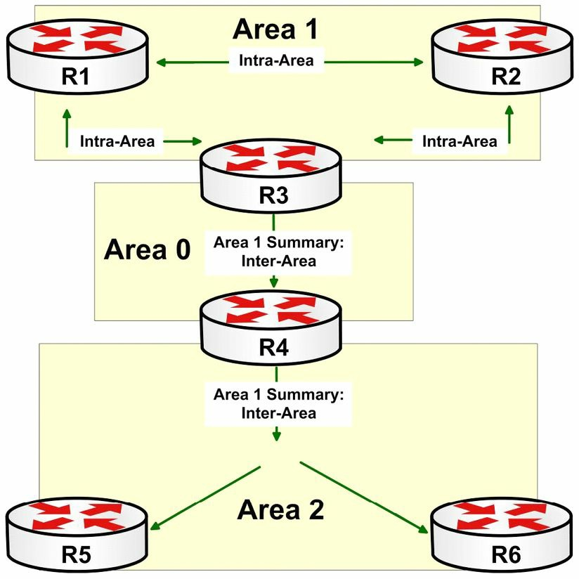

#第12天

**OSPF基础知识**

**OSPF Basics**

##今天的任务

- 阅读今天的理论课文
- 复习昨天的理论课文

先前版本的CCNA考试只要求对OSPF有基本了解。**现今版本要求对`OSPFv2`、`v3`及多区域OSPF都要有更为深入的掌握**。OSPF考点在ICND1和ICND2中都有，ICND2中增加了难度。

今天将会学到下面这些内容。

- 链路状态基础，Link State fundamentals
- OSPF组网类型，OSPF network types
- OSPF的配置，Configuring OSPF

本模块对应了以下CCNA大纲要求：

+ OSPF（单区域）的配置和验证
	- 单区域的好处, benefit of single area
	- OSPFv2的配置, configure OSPFv2
	- 路由器ID，router ID
	- 被动接口，passive interface

##开放最短路径优先

**Open Shortest Path First**

开放最短路径优先，是**一个开放标准的链路状态路由协议**（an open-standard Link State routing protocol）。所有链路状态路由协议都是对链路状态进行通告。当链路状态路由器开始在某条网络链路上运作时，逻辑网络的相关信息就被添加到路由器的**本地**链路状态数据库(Link State Database, LSDB)中。该本地路由器此时在其运作链路上，发出`Hello`数据包，以确定出是否有其它链路状态路由器也在其各自接口上运行着链路状态路由协议。**OSPF直接运行在IP协议上，使用IP下编号为`89`号的协议**。

## OSPF概述及基础知识

**OSPF Overview and Fundamentals**

人们为OSPF撰写了多个请求评议（Requests for Comments, RFCs)。在本小节，将通过一些OSPF有关的最常见的几个RFCs，来了解一下OSPF的历史。OSPF工作组成立于`1987`年，自成立以后，该工作组发布了为数众多的RFCs。下面列出了OSPF有关的一些最常见的RFCs。

- `RFC 1131` -- OSPF规格，OSPF Specification
- `RFC 1584` -- OSPF的多播扩展, Multicast Extensions to OSPF
- `RFC 1587` -- OSPF的NSSA选项，the OSPF NSSA Option
- `RFC 1850` -- OSPF版本`2`的管理信息库，OSPF Version 2 Management Informaiton Base
- `RFC 2328` -- OSPF版本`2`
- `RFC 2740` -- OSPF版本`3`

`RFC 1131`对OSPF的第一次迭代（the first iteration of OSPF）进行了说明, 而应用在明确该协议是否工作的早期测试中。

`RFC 1584`为OSPF提供了对IP多播流量的支持扩展。这通常被称为多播OSPF（Multicast OSPF, MOSPF）。但该标准不常用到，而最重要的是思科不支持该标准。

`RFC 1587` 对一种OSPF的次末梢区域（Not-So-Stubby Area, NSSA）的运作方式进行了说明。NSSA允许通过一台自治系统边界路由器（an Autonomous System Boundary Router, ASBR）, 采用一条NSSA的外部LSA, 实现外部路由知识的注入（the injection of external routing knowledge）。在本模块的稍后会对不同的NSSAs进行说明。

`RFC 1850`实现了使用简单网络管理协议（Simple Network Management Protocol, SNMP）对OSPF的网络管理。在网络管理系统中，SNMP用于监测接入网络设备中需要留心的一些情况。本标准的应用超出了CCNA考试要求范围，不会在本书中进行说明。

`RFC 2328`详细陈述了OSPF版本`2`的最新更新，而OSPF版本`2`正是现今在用的默认版本。OSPF版本`2`最初是在`RFC 1247`中进行说明的，该RFC解决了OSPF版本`1`初次发布中发现的一系列问题，并对该协议进行了修正，实现了未来修改不致产生出向后兼容问题。正因为如此，OSPF版本`2`与版本`1`是不兼容的。

最后，`RFC 2740`说明了为支持IPv6而对OSPF做出的修改（也就是版本`3`）。应假定本模块中所有对OSPF一词的使用，都是指的OSPF版本`2`。

###链路状态基础

**Link State Fundamentals**

当对某条特定链路(也就是接口）开启链路状态路由协议时，与那个网络有关的信息就被加入到本地LSDB中。该本地路由器此时就往其运作的各链路上发送`Hello`数据包，以确定有否其它**链路状态路由器**也在接口上运行着。**`Hello`数据包用于邻居发现，并在邻居路由器之间维护邻接关系**。本模块稍后部分会详细说明这些消息。

在找到一台邻居路由器后， 假定两台路由器在同一子网且位于同一区域，同时诸如认证方法及计时器等其它参数都是一致的（identical），那么本地路由器就尝试建立一个邻接关系（adjacency）。此邻接关系令到两台路由器将**摘要的LSDB信息**通告给对方。这种信息交换，交换的并非真实的详细数据库信息，而是数据的摘要。

各台路由器参照其本地LSDB，对收到的摘要信息做出评估，以确保其有着最新信息。如邻接关系的一侧认识到它需要一个更新，路由器就从邻接路由器请求新信息。而来自邻居路由器的更新就包含了LSDB中的具体数据。此交换过程持续到两台路由器都拥有同样的LSDB。OSPF用到不同类型的报文，以交换数据库信息，从而确保所有路由器都有着网络的统一视图。这些不同的数据包类型将在本模块稍后进行详细说明。

跟着数据库交换，SPF算法就运行起来，创建出到某个区域或网络主干中所有主机的最短路径树, SPF算法将执行运算的路由器，作为该树的根（Following the database exchange, the SPF algorithm runs and creates a shotest path tree to all hosts in an area or in the network backbone, with the router that is performing the calculation at the root of that tree）。在第10天中，对SPF算法进行了简要介绍。

###OSPF基础

**OSPF Fundamentals**

与EIGRP能够支持多个网络层协议不同，OSPF只能支持IP，也就是IPv4和IPv6。和EIGRP相同的是，OSPF支持VLSM、认证及在诸如以太网这样的多路访问（Multi-Access networks）网络上，于发送和接收更新时，利用IP多播技术（IP Multicast）。

OSPF是一种层次化的路由协议，将网络以逻辑方式，分为称作区域的众多子域。这种逻辑分段方法，用于限制链路状态通告在OSPF域中扩散的范围（OSPF is a hierarchical routing protocol that logically divides the network into subdomains referred to as areas. This logical segmentation is used to limit the scope of Link State Advertisements(LSAs) flooding throughout the OSPF domain）。LSAs是由运行OSPF的路由器发出的特殊类型数据包。在区域内和区域间用到不同类型的LSAs。通过限制一些类型的LSAs在区域间传播，OSPF的层次化实现有效地减少了OSPF网络中路由协议流量的数量。

> **注意：** OSPF的这些LSAs会在第39天详细说明。

在多区域OSPF网络中，必须指定一个区域作为**骨干区域**, 或者叫`Area 0`。**OSPF骨干**就是此OSPF网络的**逻辑中心**。**其它非骨干区域都必须物理连接到骨干**。但因为在非骨干区域和骨干区域之间有着一条物理连接，并非总是可能或可行的，所以OSPF标准允许使用到骨干的虚拟连接。这些虚拟连接也就是常说的虚拟链路，但此概念是不包括在当前的CCNA大纲中的（In a multi-area OSPF network, one area must be designated as **the backbone area**, or `Area 0`. The OSPF backbone is **the logical centre** of the OSPF network. All other non-backbone areas must be connected physically to the backbone. However, because it is not always possible or feasible to have a physical connection between a non-backbone area and the backbone, the OSPF standart allows the use of virtual connections to the backbone. These virtual connections are known as virtual links, but this concept is not included in the current CCNA syllabus）。

位处各区域中的路由器，都存储着其所在区域的详细拓扑信息。而在各区域中，一台或多台的路由器，又被作为**区域边界路由器**（Area Border Routers, ABRs），区域边界路由器通过在不同区域之间通告汇总路由信息，而促进区域间的路由（facilitate inter-area routing by advertising summarised routing informaiton between the differenct areas）。本功能实现OSPF网络中的以下几个目标。

- 在OSPF域层面减小LSAs的扩散范围, Reduces the scope of LSAs flooding throughout the OSPF domain
- 在区域之间隐藏详细拓扑信息, Hides detailed topology informaiton between areas
- OSPF域中端到端连通性的实现, Allows for end-to-end connectivity within the OSPF domain
- 在OSPF域内部创建逻辑边界, Creates logical boundaries within the OSPF domain

> **注意：** 尽管ICND1大纲仅涉及到单区域OSPF（single-area OSPF）, 但为把大部分理论纳入讨论背景，有必要说一下多区域OSPF（multi-area OSPF）。

OSPF骨干区域从ABRs接收到汇总路由信息。该路由信息被散布到OSPF网络中的所有其它非骨干区域。在网络拓扑发生变化时，变化信息就被散布到整个的OSPF域，令到所有区域中的所有路由器都有着网络的统一视图（The OSPF backbone area receives summarised routing informaiton from the ABRs. The routing informaiton is disseminated to all other non-backbone areas within the OSPF network. When a change to the network topology occurs, this informaiton is disseminated throughout the entire OSPF domain, allowing all routers in all areas to have a consistent view of the network）。下图12.1演示的网络拓扑，就是一个多区域OSPF部署的示例。



*图12.1 -- 一个多区域OSPF网络*

图12.1演示了一个基本的多区域OSPF网络。`1`、`2`号区域连接到`0`号区域，也就是OSPF骨干上。`1`号区域中，路由器`R1`、`R2`和`R3`交换着区域内（intra-area）路由信息，并维护着那个区域的详细拓扑。`R3`作为ABR，生成一条区域间汇总路由（an inter-area summary route）, 并将该路由通告给OSPF骨干。

`R4`，也就是`2`号区域的ABR，从`0`号区域接收到`R3`通告出的汇总信息，并将其扩散到其**邻接区域**。这样做就令到`R5`和`R6`知悉位处其本地区域外、但仍在OSPF域内的那些路由了。同样概念也适用于`2`号区域内的路由信息（`R4`, the ABR for Area 2, receives the summary informaiton from Area 0 and floods it into its **adjacent area**. This allows routers `R5` and `R6` to know of the routes that reside outside of their local area but within the OSPF domain. The same concept would also be applicable to the routing informaiton within Area 2）。

总的来讲，ABRs都维护着所有其各自连接区域的LSDB信息。而各个区域中的所有路由器，都有着属于其特定区域的详细拓扑信息。这些路由器交换着区域内的路由信息。ABRs则将所连接区域的汇总信息通告给其它OSPF区域，以实现域内各子域（区域）间的路由（In summation, the ABRs maintain LSDB informaiton for all the areas in which they are connected. All routers within each area have detailed topology informaiton pertaining to that specific area. These routers exchange intra-area routing informaiton. The ABRs advertise summary informaiton from each of their connected areas to other OSPF areas, allowing inter-area routing within the domain）。

> **注意：** 本书后面会详细说明OSPF ABRs及其它OSPF路由器类型。

###组网类型

**Network Types**

对不同传输介质，OSPF采用不同默认组网类型，有下面这些:

- 非广播组网（在多点非广播多路复用传输介质上，也就是FR和ATM, 默认采用此种组网类型， Non-Broadcast，default on Multipoint Non-Broadcast Multi-Access(FR and ATM)）
- 点对点组网（在HDLC、PPP、FR及ATM的P2P子接口，以及ISDN介质上，默认采用此种组网类型， Point-to-Point，default on HDLC, PPP, P2P subinterface on FR and ATM, and ISDN）
- 广播组网（在以太网和令牌环介质上，默认采用此种组网类型， Broadcast，default on Ethernet and Token Ring）
- 点对多点组网（Point-to-Multipoint）
- 环回组网（默认在环回接口上采用此种组网类型， Loopback，default on Loopback interfaces）

**非广播网络**是指那些没有原生的广播或多播流量支持的网络类型。非广播类型网络的最常见实例就是帧中继网络。非广播类型网络**需要额外配置，以实现广播和多播支持**。在这种网络上，OSPF选举出一台指定路由器(a Designate Router, DR), 及/或一台备用指定路由器（a Backup Designated Router, BDR）。在本书后面会对这两台路由器进行说明。

思科IOS软件中，非广播类型网络上开启了OSPF的路由器，默认每`30`秒发出`Hello`数据包。若`4`个`Hello`间隔，也就是`120`秒中都没有收到`Hello`数据包，那么该邻居路由器就被认为是“死了”。下面的输出演示了在一个帧中继串行接口上`show ip ospf interface`命令的输出。

```
R2#show ip ospf interface Serial0/0
Serial0/0 is up, line protocol is up
	Internet Address 150.1.1.2/24, Area 0
	Process ID 2, Router ID 2.2.2.2, Network Type NON_BROADCAST, Cost: 64
	Transmit Delay is 1 sec, State DR, Priority 1
	Designated Router (ID) 2.2.2.2, Interface address 150.1.1.2
	Backup Designated Router (ID) 1.1.1.1, Interface address 150.1.1.1
	Timer intervals configured, Hello 30, Dead 120, Wait 120, Retransmit 5
		oob-resync timeout 120
		Hello due in 00:00:00
	Supports Link-local Signaling (LLS)
	Index 2/2, flood queue length 0
	Next 0x0(0)/0x0(0)
	Last flood scan length is 2, maximum is 2
	Last flood scan time is 0 msec, maximum is 0 msec
	Neighbor Count is 1, Adjacent neighbor count is 1
		Adjacent with neighbor 1.1.1.1 (Backup Designated Router)
	Suppress Hello for 0 neighbor(s)
```

一条点对点连接, 简单来说就是一条两个端点之间的连接。P2P连接的实例，包括采用HDLC及PPP封装的物理WAN接口，以及FR和ATM的点对点子接口。**OSPF点对点组网类型中，不会选举出DR和BDR**。在P2P类型网络上，OSPF每`10`秒发出`Hello`数据包。在这些网络上，”死亡“间隔是`Hello`间隔的`4`倍，也就是`40`秒（A Point-to-Point(P2P) connection is simply a connection between two endpoints only. Examples of P2P connections include physical WAN interfaces using HDLC and PPP encapsulation, and Frame Relay(FR) and Asynchronous Transfer Mode(ATM) Point-to-Point subinterfaces. No DR or BDR is elected on OSPF Point-to-Point network types. By default, OSPF sends Hello packets out every 10 seconds on P2P network types. The "dead" interval on these network types is four times the Hello interval, which is 40 seconds）。下面的输出演示了在一条P2P链路上的`show ip ospf interface`命令的输出。

```
R2#show ip ospf interface Serial0/0
Serial0/0 is up, line protocol is up
	Internet Address 150.1.1.2/24, Area 0
	Process ID 2, Router ID 2.2.2.2, Network Type POINT_TO_POINT, Cost: 64
	Transmit Delay is 1 sec, State POINT_TO_POINT
	Timer intervals configured, Hello 10, Dead 40, Wait 40, Retransmit 5
		oob-resync timeout 40
		Hello due in 00:00:03
	Supports Link-local Signaling (LLS)
	Index 2/2, flood queue length 0
	Next 0x0(0)/0x0(0)
	Last flood scan length is 1, maximum is 1
	Last flood scan time is 0 msec, maximum is 0 msec
	Neighbor Count is 1, Adjacent neighbor count is 1
		Adjacent with neighbor 1.1.1.1
	Suppress Hello for 0 neighbor(s)
```

广播类型网络，是指那些原生支持广播和多播流量的网络，最常见例子就是以太网。就如同在非广播网络中一样，OSPF也会在广播网络上选举一台DR及/或BDR。默认情况下，OSPF每隔`10`秒发出`Hello`数据包，而如在`4`倍Hello间隔中没有收到`Hello`数据包，就宣告邻居”死亡“。下面的输出演示了在一个`FastEthernet`接口上`show ip ospf interface`命令的输出。

```
R2#show ip ospf interface FastEthernet0/0
FastEthernet0/0 is up, line protocol is up
	Internet Address 192.168.1.2/24, Area 0
	Process ID 2, Router ID 2.2.2.2, Network Type BROADCAST, Cost: 64
	Transmit Delay is 1 sec, State BDR, Priority 1
	Designated Router (ID) 192.168.1.3, Interface address 192.168.1.3
	Backup Designated Router (ID) 2.2.2.2, Interface address 192.168.1.2
	Timer intervals configured, Hello 10, Dead 40, Wait 40, Retransmit 5
		oob-resync timeout 40
		Hello due in 00:00:04
	Supports Link-local Signaling (LLS)
	Index 1/1, flood queue length 0
	Next 0x0(0)/0x0(0)
	Last flood scan length is 1, maximum is 1
	Last flood scan time is 0 msec, maximum is 0 msec
	Neighbor Count is 1, Adjacent neighbor count is 1
		Adjacent with neighbor 192.168.1.3 (Designated Router)
	Suppress Hello for 0 neighbor(s)
```

点对多点是**一种非默认OSPF组网类型**。也就是说，此种组网类型必须使用接口配置命令`ip ospf network point-to-point-multicast [non-broadcast]`手动进行配置。默认情况下，该命令默认应用于一个广播型点对多点类型网络的。此默认组网类型允许OSPF采用多播数据包来动态地发现其邻居路由器。此外在**广播型点对多点网络**类型上，不进行DR/BDR选举（Point-to-Multipoint is **a non-default OSPF network type**. In other words, this network type must be configured manually using the `ip ospf network point-to-multipoint [non-broadcast]` interface configuration command. By default, this command defaults to **a Broadcast Point-to-Multipoint network** type. This default network type allows OSPF to use Multicast packets to discover its neighbour routers. In addition, there is no DR/BDR election held on Broadcast Point-to-Multipoint network types）。

关键字`[non-broadcast]`将点对多点网络配置为**非广播点对多点网络**。这样做就要求**静态的OSPF邻居配置**，因为此时OSPF不会使用多播来动态地发现其邻居路由器。此外，这种网络类型不要求为指定网段进行DR及/或BDR选举。此种组网的主要用途，即允许分配邻居开销到邻居路由器，而非使用指定给接口的开销，作为那些自所有邻居处收到的路由的开销（The `[non-broadcast]` keyword configures the Point-to-Multipoint network type as **a Non-Broadcast Point-to-Multipoint network**. This requires **static OSPF neighbour configuration**, as OSPF will not use Multicast to discover dynamically its neighbour routers. Additionally, this network type does not require the election of a DR and/or a BDR router for the designated segment. The primary use of this network type is to allow neighbor costs to be assigned to neighbors instead of using the interface-assigned cost for routes received from all neighbors）。

点对多点组网类型，典型地用于**部分全通辐射状非广播多路访问网络**。不过此种组网类型也可指定给诸如广播多路访问网络（比如以太网）等的其它类型网络（The Point-to-Multipoint network type is typically used in **partial-mesh hub-and-spoke Non-Broadcast Multi-Access(NBMA)** networks. However, this network type can also be specified for other networks, such as Broadcast Multi-Access networks(e.g., Ethernet)）。默认情况下，在点对多点网络上，OSPF每`30`秒发出一个`Hello`数据包。默认死亡间隔是`Hello`间隔的`4`倍，也就是`120`秒。

下面的输出演示了在一个经手动配置为点对多点网络的帧中继串行接口上的`show ip ospf interface`命令的输出。

```
R2#show ip ospf interface Serial0/0
Serial0/0 is up, line protocol is up
	Internet Address 150.1.1.2/24, Area 0
	Process ID 2, Router ID 2.2.2.2, Network Type POINT_TO_MULTIPOINT, Cost: 64
	Transmit Delay is 1 sec, State POINT_TO_MULTIPOINT
	Timer intervals configured, Hello 30, Dead 120, Wait 120, Retransmit 5
		oob-resync timeout 120
		Hello due in 00:00:04
	Supports Link-local Signaling (LLS)
	Index 2/2, flood queue length 0
	Next 0x0(0)/0x0(0)
	Last flood scan length is 1, maximum is 2
	Last flood scan time is 0 msec, maximum is 0 msec
	Neighbor Count is 1, Adjacent neighbor count is 1
		Adjacent with neighbor 1.1.1.1
	Suppress Hello for 0 neighbor(s)
```

OSPF要求链路上两台路由器组网类型一致（一致的意思是两台路由器要么都进行选举要么都不进行选举）的主要原因在于计时器的数值。就像上面各个输出中演示的那样，不同组网类型采用了不同`Hello`数据包发送及死亡计时器间隔。为成功建立一个OSPF邻接关系，在两台路由器上这些数值必须匹配。

思科IOS软件允许通过使用接口配置命令`ip ospf hello-interval <1-65535>`及`ip ospf dead-interval [<1-65535>|minimal]`，对默认OSPF `Hello`数据包及死亡计时器进行修改。`ip ospf hell0-interval <1-65535>`命令用于指定`Hello`间隔的秒数。在执行该命令后，软件会自动将死亡间隔配置为所配置的`Hello`包间隔的`4`倍。比如，假定某台路由器做了如下配置。

```
R2(config)#interface Serial0/0
R2(config-if)#ip ospf hello-interval 1
R2(config-if)#exit
```

通过在上面的`R2`上将`Hello`数据包间隔设置为`1`, 思科IOS软件就会自动的将默认死亡计时器调整为`Hello`间隔的`4`倍，就是`4`秒。下面的输出对此进行了演示。

```
R2#show ip ospf interface Serial0/0
Serial0/0 is up, line protocol is up
	Internet Address 10.0.2.4/24, Area 2
	Process ID 4, Router ID 4.4.4.4, Network Type POINT_TO_POINT, Cost: 64
	Transmit Delay is 1 sec, State POINT_TO_POINT
	Timer intervals configured, Hello 1, Dead 4, Wait 4, Retransmit 5
		oob-resync timeout 40
		Hello due in 00:00:00
...
[Truncated Output]
```

##配置OSPF
 
**OSPF Configuration**

本节对OSPF配置基础进行说明。

###在思科IOS软件中开启OSPF

**Enabling OSPF in Cisco IOS Software**

在思科IOS软件中，通过使用全局配置命令`router ospf [process id]`开启OSPF。**关键字`[process id]`是本地有效的**(locally sinificant)，邻接关系的建立无需网络中所有路由器的进程号一致。运用本地有效的进程号，允许在同一台路由器上配置多个OSPF实例。

OSPF进程号是一个`1`与`65535`之间的整数。每个OSPF进程都维护着其独立链路状态数据库（LSDB）；但是，所有路由都放进的是同一IP路由表。也就是说，对配置在路由器上的各个单独OSPF进程，并没有各自唯一的IP路由表。

在思科IOS软件早期版本中，如路由器上没有至少一个的接口配置了有效IP地址且处于`up/up`状态，就无法开启OSPF。此限制在当前版本思科IOS软件中去除了。假如路由器没有接口配置了有效IP地址且处于`up/up`状态，那么思科IOS将创建出一个接近数据库（a Proximity Database, PDB）并允许创建出进程。但是，要记住除非选定路由器ID，该进程就是非活动的进程，而**路由器ID的选定**，可通过下面两种方式完成。

- 在某个接口上配置一个有效IP地址，并将该接口开启
- 使用命令`router-id`为该路由器手动配置一个ID（见下）

作为一个例子，看看下面的所有接口都关闭的路由器。

```
R3#show ip interface brief
Interface		IP-Address	OK?	Method	Status					Protocol
FastEthernet0/0	unassigned	YES	manual	administratively down	down
Serial0/0		unassigned	YES	NVRAM	administratively down	down
Serial0/1		unassigned	YES	unset	administratively down	down
```

接着，使用全局配置命令`router ospf [process id]`在该路由器上开启了OSPF， 如下面输出所示。

```
R3(config)#router ospf 1
R3(config-router)#exit
```

基于此配置，思科IOS软件分配给该进程一个默认`0.0.0.0`的路由器ID，如下面`show ip protocols`命令的输出所示。

```
R3#show ip protocols
Routing Protocol is “ospf 1”
	Outgoing update filter list for all interfaces is not set
	Incoming update filter list for all interfaces is not set
	Router ID 0.0.0.0
	Number of areas in this router is 0. 0 normal 0 stub 0 nssa
	Maximum path: 4
	Routing for Networks:
Reference bandwidth unit is 100 mbps
	Routing Information Sources:
	  Gateway	Distance	Last Update
	Distance: (default is 110)
```

但是，命令`show ip ospf [process id]`揭示出该进程实际上并不是活动的，且表明需要配置一个路由器ID， 其输出如下面所示。

```console
R3#show ip ospf 1
%OSPF: Router process 1 is not running, please configure a router-id
```

###开启接口或网络的OSPF路由

**Enabling OSPF Routing for Interfaces or Networks**

在开启OSPF后，就可以执行两个操作，来为路由器上一个或更多的网络或接口开启OSPF路由。这两个操作如下。

- 使用路由器配置命令(router configuration command)`[network] [wildcard] area [area id]`
- 使用接口配置命令`ip ospf [process id] area [area id]`

与EIGRP不同，OSPF强制使用反掩码且必须配置反掩码; 但与在EIGRP中的情况一样，反掩码提供了同样的功能，也就是匹配指定范围中的接口（unlike EIGRP, the wildcard is mandatory in OSPF and must be configured; however, as is the case with EIGRP, it serves the same function in that it matches interfaces within the range specified）。比如，语句`network 10.0.0.0 0.255.255.255 area 0`，就会对`10.0.0.1/30`、`10.5.5.1/24`, 甚至`10.10.10.1/25`这样的IP地址和子网掩码组合的接口，开启OSPF路由。基于该OSPF网络配置，这些接口都会被分配到0号区域。

> **注意：** OSPF反掩码可以与传统子网掩码同样格式敲入，比如`network 10.0.0.0 255.0.0.0 area 0`。在这种情况下，思科IOS软件就会将子网掩码翻转，将得到的反掩码输入到运行配置（the running configuration）。另外要记住**OSPF也支持使用全1s和全0s反掩码，来对某个指定接口开启OSPF**。这样的配置在某个特定接口上开启OSPF，但路由器通告配置在该接口自身的实际子网掩码（this configuration enables OSPF on a paricular interface but the router advertises the actual subnet mask configured on the interface itself）。

在执行了`network [network] [wildcast] area [area id]`命令后，路由器就在与指定网络和反掩码组合匹配的那些接口上发出`Hello`数据包，来尝试发现邻居路由器。接着在OSPF数据库交换期间，将连接子网通告给一台或更多的邻居路由器，最终，它们将所有子网信息都被加入到这些OSPF路由器的OSPF链路状态数据库（OSPF LSDB）中。

在命令`network [network] [wildcard] area [area id]`之后，路由器又对最具体条目做出匹配，以决定将接口要分配给的区域。作为实例，想想下面这些OSPF网络语句。

- 第一条网络配置语句：`network 10.0.0.0 0.255.255.255 area 0`
- 第二条：`network 10.1.0.0 0.0.255.255 area 1`
- 第三条：`network 10.1.1.0 0.0.0.255 area 2`
- 第四条：`network 10.1.1.1 0.0.0.0 area 3`
- 第五条：`network 0.0.0.0 0.0.0.0 area 4`

按照路由器上的此种配置，同时路由器上又配置了如下表12.1中展示的这些环回接口。

<table>
<tr><th>接口</th><th>IP地址/掩码</th></tr>
<tr><td>`Loopback 0`</td><td>`10.0.0.1/32`</td></tr>
<tr><td>`Loopback 1`</td><td>`10.0.1.1/32`</td></tr>
<tr><td>`Loopback 2`</td><td>`10.1.0.1/32`</td></tr>
<tr><td>`Loopback 3`</td><td>`10.1.1.1/32`</td></tr>
<tr><td>`Loopback 4`</td><td>`10.2.0.1/32`</td></tr>
</table>

就像前面指出的那样，在执行了`network [network] [wildcard] area [area id]`命令后，路由器匹配最具体的网络条目（最小的网络），来决定该接口应分配到的区域。对于在路由器上的网络配置语句及已配置的接口，命令`show ip ospf interface brief`会显示出这些接口都分配给了以下OSPF区域。

```
R1#show ip ospf interface brief
Interface	PID	Area	IP Address/Mask	Cost	State	Nbrs F/C
Lo4			1	0		10.2.0.1/32		1		LOOP	0/0
Lo1			1	0		10.0.1.1/32		1		LOOP	0/0
Lo0			1	0 		10.0.0.1/32 	1 		LOOP	0/0
Lo2 		1 	1 		10.1.0.1/32 	1 		LOOP	0/0
Lo3 		1 	3 		10.1.1.1/32 	1 		LOOP	0/0
```

> **注意：** 在运行配置（the running configuration）中，无需考虑网络语句敲入顺序，路由器的`show running-config`输出中最具体的网络条目，始终列在前面。

**接口配置命令`ip ospf [process id] area [area id]`**令到无需使用**路由器配置命令`network [network] [wildcard] area [area id]`**。该命令对某个指定接口开启OSPF路由，同时将该接口分配给指定OSPF区域。这两个命令完成同样的基本功能，且可互换使用。

此外，比如有两台路由器是背靠背连接（connected back-to-back），一台使用接口配置命令`ip ospf [process id] area [area id]`进行了配置，而其邻居路由器使用路由器配置命令`network [network] [wildcard] area [area id]`进行了配置，假设两个区域IDs相同，那么两台路由器将成功建立OSPF邻接关系。

###OSPF区域

**OSPF Areas**

**OSPF区域号既可以配置为一个`0`到`4294967295`之间的整数，也可使用点分十进制表示法**（也就是采用IP地址格式）。与OSPF进程号不同，**为建立邻接关系，OSPF区域号必须匹配**。最常见OSPF区域配置类型为使用一个整数来指定OSPF区域。确保对支持的两种区域配置方式都要熟悉。

###OSPF路由器ID

**OSPF Router ID**

为令到OSPF在某个网络上运行起来，所有路由器都必须有个唯一身份编号（a unique identifying number），且在OSPF环境下要用到路由器ID。

在决定OSPF路由器ID时，思科IOS选用所配置环回接口中最高的IP地址。如未曾配置环回接口，软件就会使用所有配置的物理接口中最高的IP地址，来作为0SPF路由器ID。思科IOS软件同样允许管理员使用**路由器配置命令`router-id [address]`**, 来手动指定路由器ID。

环回接口极为有用，特别是在测试当中，因为它们无需硬件且是逻辑的，因此绝不会宕掉。

在下面的路由器上，给`Loopback0`配置了IP地址`1.1.1.1/32`, 给`F0/0`配置了`2.2.2.2/24`。接着在路由器上给所有接口配置了OSPF。

```
Router(config-if)#router ospf 1
Router(config-router)#net 0.0.0.0 255.255.255.255 area 0
Router(config-router)#end
Router#
%SYS-5-CONFIG_I: Configured from console by console
Router#show ip protocols
Routing Protocol is “ospf 1”
	Outgoing update filter list for all interfaces is not set
	Incoming update filter list for all interfaces is not set
	Router ID 1.1.1.1
	Number of areas in this router is 1. 1 normal 0 stub 0 nssa
	Maximum path: 4
	Routing for Networks:
		0.0.0.0 255.255.255.255 area 0
	Routing Information Sources:
	Gateway 	Distance	Last Update
	1.1.1.1 	     110	00:00:14
	Distance: (default is 110)
```


但又想要将路由器ID硬编码（hard code）为`10.10.10.1`。那么可通过再配置一个使用该IP地址的环回接口，或简单地将这个IP地址加在OSPF路由器ID处。**为令到改变生效，必须重启路由器或在路由器上清除该IP OSPF进程**（清除现有数据库）。

```
Router#conf t
Enter configuration commands, one per line.
End with CNTL/Z.
Router(config)#router ospf 1
Router(config-router)#router-id 10.10.10.1
Router(config-router)#Reload or use “clear ip ospf process” command, for this to take effect
Router(config-router)#end
Router#
%SYS-5-CONFIG_I: Configured from console by console
Router#clear ip ospf process
Reset ALL OSPF processes? [no]: yes
Router#show ip prot
Routing Protocol is “ospf 1”
	Outgoing update filter list for all interfaces is not set
	Incoming update filter list for all interfaces is not set
	Router ID 10.10.10.1
	Number of areas in this router is 1. 1 normal 0 stub 0 nssa
	Maximum path: 4
	Routing for Networks:
		0.0.0.0 255.255.255.255 area 0
	Routing Information Sources:
	Gateway 	Distance	Last Update
	1.1.1.1 	     110	00:03:15
Distance: (default is 110)
```

到第`39`天，**DR和BDR选举时，就将看到这个路由器ID有着特别的重要性**。

###OSPF被动接口

**OSPF Passive Interfaces**

被动接口可被描述成在其上没有路由更新发出的接口。在思科IOS软件中，通过使用**路由器配置命令`passive-interface [name]`**, 将某接口配置为被动接口。如路由器上有多个接口需要配置为被动接口，就应使用**`passive-interface default`这个路由器配置命令**。此命令将路由器上那些位处所配置网络范围内的所有接口，都配置为被动模式。而那些需要允许在其上形成邻接关系或邻居关系的接口，就应使用路由器配置命令`no passive-interface [name]`对其进行配置。

被动接口配置在OSPF和EIGRP中的工作方式是一样的，也就是一旦某接口被标记为被动接口，经由该接口形成的所有邻居关系都会被拆除，同时再也不会通过该接口发送或接收`Hello`数据包了。不过，根据路由器上所配置的网络配置语句，该接口仍然会继续受通告。

```
Router(config)#router ospf 10
Router(config-router)#passive-interface f0/0
Router#show ip ospf int f0/0
FastEthernet0/0 is up, line protocol is up
	Internet address is 192.168.1.1/24, Area 0
	Process ID 10,Router ID 172.16.1.1,Network Type BROADCAST, Cost: 1
	Transmit Delay is 1 sec, State WAITING, Priority 1
	No designated router on this network
	No backup designated router on this network
	Timer intervals configured,Hello 10, Dead 40, Wait 40,Retransmit 5
		No Hellos (Passive interface)
```

##第12天问题

1. What protocol does OSPF use?
2. How does OSPF determine whether other Link State routers are operating on the interfaces as well?
3. When a `_______` routing protocol is enabled for a particular link, information associated with that network is added to the local Link State Database (LSDB).
4. OSPF utilises IP Multicast when sending and receiving updates on Multi-Access networks, such as Ethernet. True or false?
5. OSPF is a hierarchical routing protocol that logically divides the network into subdomains referred to as `_______`.
6. Name at least 4 OSPF network types.
7. Name the command used to enter OSPF configuration mode.
8. When determining the OSPF router ID, Cisco IOS selects the lowest IP address of the configured Loopback interfaces. True or false?
9. What command can you use to assign an interface to OSPF Area 2 (interface level command)?
10. `_______` can be described as interfaces over which no routing updates are sent.

##第12天答案

1. IP number 89.
2. By sending Hello packets.
3. Link State.
4. True.
5. Areas.
6. Non-Broadcast, Point-to-Point, Broadcast, Point-to-Multipoint, Point-to-Multipoint Non-Broadcast, and Loopback.
7. The `router ospf <id>` command.
8. False.
9. The `ip ospf <id> area 2`
10. Passive.

##第12天实验

###OSPF基础实验

沿用第`10`天的实验场景（两台直接连接的路由器，各自其上的环回接口），但取代配置RIP及对物理和环回接口进行通告的是，使用OSPF `0`号区域实现（but instead of configuring RIP and advertising the physical and Loopback interfaces, do this using OSPF `Area 0`）。

- 分配一个IPv4地址给直接连接的接口（`10.10.10.1/24`及`10.10.10.2/24`）
- 运用`ping`操作，测试直接连通性
- 分别在两台路由器上配置一个环回接口，并自两个不同范围为其分配上地址（`11.11.11.1/32`及`12.12.12.2/32`）
- 配置上标准OSPF `1`号进程，并在`0`号区域中通告所有本地网络。同时为两台设备配置一个路由器ID。

**`R1`:**

```
router ospf 1
router-id 1.1.1.1
network 10.10.10.0 0.0.0.255 area 0
network 11.11.11.1 0.0.0.0 area 0
```

**`R2`:**

```
router ospf 1
router-id 2.2.2.2
network 10.10.10.0 0.0.0.255 area 0
network 12.12.12.2 0.0.0.0 area 0
```

- 自`R1`向`R2`的环回接口执行ping操作，以测试连通性
- 执行一条`show ip route`命令，来验证有通过OSPF接收到路由
- 执行一条`show ip protocols`命令，来验证有配置OSPF且在设备上是活动的
- 坚持特定于OSPF的接口参数：`show ip ospf interface`及`show ip ospf interface brief`
- 在两台路由器上（直接连接接口）修改OSPF的Hello包和死亡计时器：`ip ospf hello`及`ip ospf dead`
- 执行一下`show ip ospf 1`命令，看看路由进程参数
- 重复该实验，但这次使用`ip ospf 1 area 0 interface specific`命令，而不是在router OSPF 下的`network`命令，对各个网络进行通告。
