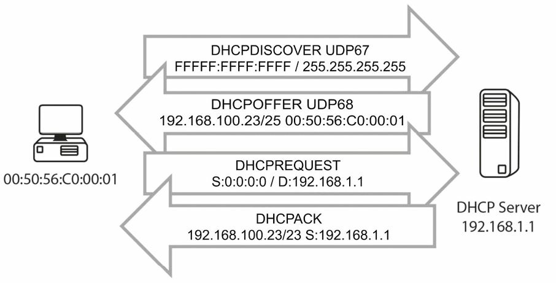
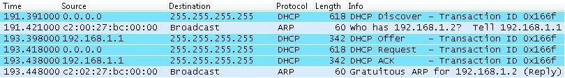
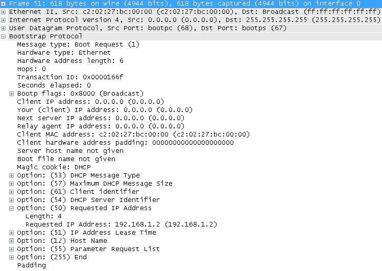
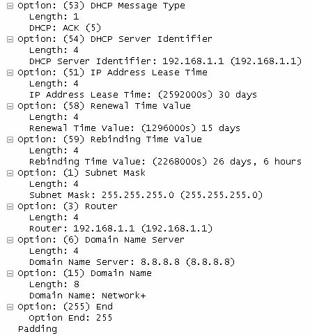

#第14天

**DHCP及DNS**

##第14天任务

- 阅读今天的课文
- 复习昨天的课文
- 完成今天的实验
- 阅读ICND1记诵指南
- 花15分钟在[subnetting.org](http://www.subnetting.org)上

主机使用动态主机配置协议（Dynamic Host Configuration Protocol, DHCP），紧接着加电启动后，收集到包括了IP地址、子网掩码及默认网关等初始配置信息。因为所有主机都需要一个IP地址，以在IP网络中进行通信，而DHCP就减轻了手动为每台主机配置一个IP地址的管理性负担。

域名系统（Domain Name System, DNS）将主机名称映射到IP地址，使得你可[www.in60days.com](www.in60days.com)输入到web浏览器中，而无需输入寄存该站点的服务器IP地址。

今天将学到以下内容。

- DHCP操作, DHCP operations
- 配置DHCP, configuring DHCP
- DHCP故障排除, troubleshooting DHCP issues
- DNS操作, DNS operations
- 配置DNS, configuring DNS
- DNS故障排除, troubleshooting DNS issues

本课对应了以下CCNA大纲要求。

+ 配置和验证DNS（IOS路由器）
    - 将路由器接口配置为使用DHCP, configure router interfaces to use DHCP
    - DHCP选项, DHCP options
    - 排除的地址, excluded addresses
    - 租期，lease time

##DHCP功能

**DHCP Functionality**

###DHCP操作

**DHCP Operations**

DHCP通过在网络上给主机自动分配IP信息，简化了网络管理任务。分配的信息可以包括IP地址、子网掩码及默认网关，且通常实在主机启动时。

在主机第一次启动时，如其已被配置为采用DHCP（大多数主机都是这样的），它就会发出一个询问分配IP信息的广播报文。该广播将为DHCP服务器收听到，同时该信息会被中继。

> Farai指出 -- "这是假定主机和DHCP服务器实在同一子网的情形，而如它们不在同一子网，就看下面的`ip helper-address`命令。"


*图14.1 -- 主机请求IP配置信息*

DHCP具体使用UDP端口`67`和`68`，来在网络上通信，同时，尽管在需要时路由器也可实现DHCP功能，但通常都会使用具体服务器作为DHCP服务器。在需要时，路由器同样可以配置为从DHCP服务器取得其接口IP地址，但很少这样做。配置这个特性的命令如下。

`Router(config-if)#ip address dhcp`

客户端的DHCP状态如下：

- 初始化，initialising
- 选择，selecting
- 请求，requesting
- 绑定，bound
- 更新，renewing
- 重绑定，rebinding

DHCP服务器可被配置为在一个名为租期的特定时期，赋予某台主机一个IP地址。租期可以是几个小时或几天。对于那些不能在网络上分配给主机的IP地址，可以也应该予以保留。这些保留的IP地址，将是已被路由器接口或服务器所使用的地址。如未能保留这些地址，就会看到网络上的重复IP地址告警，因为DHCP服务器已将配置给路由器或服务器的地址，分配给了主机。

下面的图14.2中，可以看到完整的DHCP请求和分配过程。


*图14.2 -- DHCP请求和分配过程*

1. **DHCP发现数据包**（DHCP Discover packet）当某台设备启动后，同时其被配置为通过DHCP取得一个地址时，就会发出一个自UDP端口`68`(UDP port `68`, `bootpc`）到UDP端口`67`(UDP port `67`, `bootps`）的广播数据包。该数据包将到达网络上的所有设备，包括任何位处网络上的可能的DHCP服务器。

    **DHCP提议数据包**（DHCP Offer packet），本地网络上的DHCP服务器看到由客户端发出的广播发现报文（the broadcasted Discover message），就用UDP源端口`bootps 67`及目的端口`bootpc 68`, 同样以广播地址的形式，发回一个响应（就是DHCP提议数据包）。之所以同样以广播地址形式，是因为客户端此时仍然没有IP地址，而无法接收单播数据包。

2. **DHCP请求数据包**（DHCP Request packet）, 一旦客户端工作站收到由DHCP服务器做出的提议（an offer made by the DHCP server），它就会发出一个广播（用于告知所有DHCP服务器，它已接受了来自某台服务器的提议）DHCP请求报文到某台特定的DHCP服务器，并再度使用UDP源端口`bootpc 68`及目的端口`bootps 67`。**客户端可能会收到来自多台DHCP服务器的提议，但它只需单独一个IP地址，所以它必需选择一台DHCP服务器**（基于服务器标识），而选择通常都是按照"先到，先服务"原则完成的（on a "first-come, first-served" basis）。

3. **DHCP确认数据包**（DHCP ACK packet）, 选中的那台DHCP服务器发出另一个广播报文，来确认给那台特定客户端的地址分配，再度用到UDP源端口`bootps 67`及目的端口`bootpc 68`。


###DHCP的预订
 
**DHCP Reservations**

DHCP服务器可被配置为以几种不同方式提供IP地址，包括下面这些。

- 动态分配, Dynamic allocation
- 自动分配, Automatic allocation
- 静态分配, Static allocation

**动态分配**

**Dynamic allocation**

通过DHCP指派地址的一个十分常用方法，就是采用动态分配过程，在此过程中，DHCP服务器配置为有着一个大的IP地址池，且根据客户端的请求，而为其分配地址池中的一个IP地址。在设备租期超时或设备离开网络时，该特定IP地址就被交还给DHCP服务器，之后就可被分配给另一客户端。

**自动分配**

**automatic allocation**

采用DHCP服务器分配IP地址的另一方式，叫做自动分配，该方式跟动态分配极为相似，但采用此种方式，DHCP服务器尝试维护一个所有过往分配地址清单，而如有某台"旧有"客户端请求一个IP地址，该客户端就会分配到一个跟以前一样的IP地址（也就是说，其曾于此前请求过一个IP地址）。自动分配是一种较为低效的分配IP地址方式，但如有着一个极大的可用IP地址池，这就是一种总能确保某网络中的客户端在每次开机时，获得同样IP地址的巧妙方法。


**静态分配**

**Static allocation**

DHCP服务器的IP地址静态分配，是指定义出一些期望在网络上出现的MAC地址，并手动为这些MAC地址都分配上一个唯一IP地址，因此就管理性地建立起一张`MAC-to-IP`关联表。这通常在服务器环境中用到，因为服务器必须使用可预期的IP地址，以可供访问。

###DHCP范围

**DHCP Scopes**

打算配置一台DHCP服务器的网络管理员，作为配置过程的一部分，也需要配置DHCP范围。范围就是网络某个特殊部分的一组IP地址（A scope is a grouping of IP addresses for a particular section of the network）。而每个子网通常有着自己的范围。

范围也可以是可供DHCP服务器分配的一个连续地址池（a contiguous pool of addresses）。大多数DHCP服务器都提供了从地址池中排除一些地址的功能，以避免将这些地址动态地分配给客户端。这些排除的地址，就通常是那些手动分配给网络中服务器（及网络设备）的IP地址。

在定义的DHCP范围内部，可以配置诸如下面的一些参数。

- IP地址范围, IP address range
- 子网掩码, subnet mask
- 租约持续时间，lease duration
- 默认网关，default gateway
- DNS服务器，DNS server
- WINS服务器，WINS server

依据所使用的DHCP服务器，也可以使用不同参数，创建出不同的范围，而这通常与不同子网有关。

###DHCP租期

**DHCP Leases**

DHCP所提供的主要优势之一，就是租借IP地址的能力，也就是说1P地址的分配是临时的。通常，当客户端离开网络时，其所分配到的特定IP地址将变成可用，并由DHCP服务器分配给其它设备。

DHCP租期关乎每次DHCP分配，限定允许用户使用一个分配到的1P地址多长时间。通常是在DHCP范围内对该参数进行管理性配置。每当有客户端重启后，它都必须再次从DHCP服务器请求一个IP地址。而DHCP服务器又通常被配置为给那台特定主机再度分配同样的地址并扩展租期。

工作站也能手动释放其IP地址，比如在以下情况下。

- 设备无限期关机，the device is turned off indefinitely
- 设备移至另一子网（比如，从有线网络移到无线网络），the device moves to another subnet(e.g, to a wireless network from a wired network)

租借过程有几个相关的计时器，因此可以肯定在所有网络设备上总是会有一个更新过的IP地址。下面是两个重要的DHCP计时器。

- **续借（`T1`）计时器**（renewal(T1) timer, 默认是租期的一半）：在工作站取得一个IP地址后，此计时器就开始计时，当到达租期的`50%`时，DHCP客户端将向来源DHCP服务器重申租约。
- **重新绑定（`T2`）计时器**（rebinding(T2) timer, 默认是租期的`87.5%`）：这第二个计时器用在DHCP服务器未有在续借计时器超时后，进行回应或确认的情形。该计数器指出，如租期已过`7/8`, 那么客户端将尝试找到（发出一个DHCP请求）另一能够提供DHCP地址的DHCP服务器。

有了租借过程及上述有关计时器，就可以肯定总是会及时拥有一个IP地址，且连带不会有任何停止时间，同时自动地有着一种构建于DHCP过程中的冗余机制。

图14.3中展示了`T1`及`T2`计时器与租期的关系。


*图14.3 -- DHCP租期计时器*

###DHCP选项
 
**DHCP Options**

在DHCP中有一个特殊字段，可用于帮助扩展一些自动配置过程的性能。可在此字段中放入在DHCP RFC中给出的许多不同配置选项。

> **注意：**BOOTP选项曾被称作“厂商扩展”。

DHCP提供了`256`选项值，其中仅`254`个是可用的，因为`0`是垫底选项，而`255`是最后选项（0 is the pad option and 255 is the end option）。许多DHCP选项都是通常所了解的经常使用到的参数，包括下面这些。

- 子网掩码，subnet mask
- 域名服务器，domain name server
- 域名，domain name

这些年来，已加入一些额外的DHCP选项，尤其是VoIP用途的那些选项，比如下面这些。

- 选项`129`: 呼叫服务器IP地址
- 选项`135`: 话机相关应用的HTTP代理服务器

所有这些选项都是直接在DHCP服务器上配置，但不是所有DHCP服务器都提供了设置DHCP选项的能力。如网络管理员要用到这些特性，就应该采用一种企业级别的DHCP服务器。在将小型路由器作为家庭办公环境的DHCP服务器是，就可能不会有这些功能上的益处。

##配置DHCP
 
**Configuring DHCP**

###思科路由器上的DHCP服务器
 
**DHCP Servers on Cisco Routers**

第一步就是在路由器上开启DHCP服务。这是通过使用`service dhcp`命令完成的，如下面所示（as exemplified below）。

```
Router#configure terminal
Enter configuration commands, one per line. End with CNTL/Z.
Router(config)#service dhcp
```

下一步就是创建一个DHCP池，该DHCP池定义出将分配给客户端的IP地址池。在本例中，名为`SUBNET_A`的池将提供来自范围`192.168.1.0/24`的IP地址。

```
Router(config)#ip dhcp pool SUBNET_A
Router(dhcp-config)#network 192.168.1.0 255.255.255.0
Router(dhcp-config)#default-router 192.168.1.1
Router(dhcp-config)#dns-server 8.8.8.8
Router(dhcp-config)#domain-name Network+
Router(dhcp-config)#lease 30
```

该DHCP池配置模式（the DHCP Pool Configuration mode）同时也是配置其它DHCP选项的地方。在上面的配置输出中，配置了以下这些参数。

- 默认网关：`192.168.1.1`(指派到将该路由器作为DHCP服务器所服务网络中的路由器接口地址)
- DNS服务器：`8.8.8.8`
- 域名：`Network+`
- 租期：`30`天

在需要时，也可以配置一些从`192.168.1.0/24`范围中排除的地址。我们就说要排除路由器接口IP地址（`192.168.1.1`）及`192.168.1.250`到`192.168.1.255`地址范围，从该范围就可手动为网络中的服务器分配地址。这是通过下面的配置完成的。

```
Router(config)#ip dhcp excluded-address 192.168.1.1
Router(config)#ip dhcp excluded-address 192.168.1.250 192.168.1.255
```

可使用下面的命令来查看当前由该路由器DHCP服务器所服务的客户端。

```
Router#show ip dhcp binding
Bindings from all pools not associated with VRF:
IP address      Client-ID/  Lease expiration    Type    Hardware address/
192.168.1.2     Mar 02 2014 12:07 AM       Automatic    0063.6973.636f.2d63
```

在上面的输出中，由该DHCP服务器服务的是单独一台客户端，同时分到到DHCP范围的第一个非排除IP地址：`192.168.1.2`。还可以看到租期超时日期及设备MAC地址。

###思科路由器上的DHCP客户端
 
**DHCP Clients on Cisco Routers**

除了DHCP服务器功能，思科路由器同样允许将其接口配置为DHCP客户端。这就是说接口将使用标准DHCP过程，请求到一个地址，而在特定子网上的任何服务器，都能分配该IP地址。

将一个路由器接口配置为DHCP客户端的命令如下。

```
Router(config)#int FastEthernet0/0
Router(config-if)#ip address dhcp
```

一旦某台DHCP服务器分配了一个IP地址，在路由器控制台上就可以看到下面的通知消息（该消息包含了地址和掩码）。

```
*Mar 1 00:29:15.779: %DHCP-6-ADDRESS_ASSIGN: Interface FastEthernet0/0 assigned DHCP address 10.10.10.2, mask 255.255.255.0, hostname Router
```

使用命令`show ip interface brief`，就可以观察到该DHCP分配方式。

```
Router#show ip interface brief
Interface       IP-Address  OK? Method  Status                  Protocol
FastEthernet0/0 10.10.10.2  YES DHCP    up                      up
FastEthernet0/1 unassigned  YES unset   administratively down   down
```

###DHCP数据包分析
 
**DHCP Packet Analysis**

为实际掌握在本模块中介绍的这些知识点，将生成一些上述示例中涉及到设备的流量捕获。在配置好DHCP服务器及客户端工作站启动起来后，就会发生`4`步的DHCP过程，可在下面的截屏中观察到。



*图14.4 -- DHCP 4步过程*

下面可以观察到DHCP发现数据包所包含的部分。


*图14.5 -- DHCP发现数据包*

正如你在截屏中看到的，该数据包（DHCP Discover packet）是由客户端发出，将其广播到网络上（目的地址是`255.255.255.255`）。同时还看到其报文类型为“Boot Request（`1`)”。

下一个数据包就是DHCP提议数据包（DHCP Offer packet），如下面所示。


*图14.6 -- DHCP提议数据包*

该数据包是由服务器（源IP：`192.168.1.1`）发出到广播地址（目的地址：`255.255.255.255`）,同时包含了提议的IP地址（`192.168.1.2`）。同时也可看到报文类型为“Boot Reply(`2`)”。

第三个数据包是DHCP请求数据包（DHCP Request packet）。



*图14.7 -- DHCP请求数据包*

DHCP请求数据包是由客户端发出到广播地址。可以看到报文类型是`Boot Request(1)`。该数据包与最初的DHCP发现数据包类似，但包含了一个非常重要的字段，就是`50`选项: 被请求的IP地址（`192.168.1.2`）（a very important field, which is Option 50: Requested IP Address(192.168.1.2)）。这就是在DHCP提议数据包中由DHCP服务器所提供的同一IP地址，而该客户端对其进行了确认和接受。

DHCP分配过程的最后数据包就是由服务器发出的DCHP确认数据包了(the DHCP ACK packet)。



*图14.8 -- DHCP确认选项数据包*

该数据包发自DHCP服务器并被广播到网络上；其同样包含了在上面的截屏中所看到的一些额外字段。

- DHCP服务器标识：该DHCP服务器的IP地址（`192.168.1.1`）
+ 路由器上配置的所有选项。
    - 租期：`30`天（以及派生出的早前讨论的过续租时间和重新绑定时间值）
    - 子网掩码：`255.255.255.0`
    - 默认网关（路由器）: `192.168.1.1`
    - DNS服务器：`8.8.8.8`
    - 域名：`Network+`

##DHCP故障排除

**Troubleshooting DHCP Issues**

跟NAT一样，DHCP故障基本上总是因为错误配置造成的（开玩笑说就是第8层问题，意思是人为疏忽，jokingly referred to as Layer 8 issue, meaning somebody messed up）。

命令`service dhcp`默认是开启的，但有些时候其已被网络管理员因为某些原因关闭了。（作者就曾遇到过有管理员在他们的路由器上敲入`no ip routing`命令后因为紧急的路由故障打电话给思科 -- 真的！）

如在另一子网上使用一台服务器来管理DHCP配置，就要允许路由器放行DHCP数据包。在地址分配过程中，DHCP用到广播报文（而路由器是不会转发广播报文的），那么就**需要将DHCP服务器的IP地址加入到路由器，以令到路由器将该广播报文作为单播数据包进行转发**。**命令`ip helper-address`**就可以实现这点。这是另一个考试喜欢的问题哦。

同样可以使用下面的`debug`命令作为排错过程中的部分。

```
debug ip dhcp server events
debug ip dhcp server packet
```

###DNS操作

**DNS Operations**

DNS将主机名映射到IP地址（而不是反过来）。这就允许你在web浏览器中浏览一个网址，而无需输入服务器IP地址。

在主机或路由器想要将一个域名解析到IP地址（或反过来将IP地址解析到域名时），DNS用到UDP `53`号端口。而在两台DNS服务器之间打算同步或分享它们的数据库时，就使用TCP `53`号端口。
 
##配置DNS
 
**Configuring DNS**

如想要容许路由器找到web上的某台DNS服务器，就使用命令`ip name-server 1.1.1.1`，或是服务器相应的地址。

也可以将某个主机名设置到路由器上的一个IP地址表中来节省时间，或是令到更易于记住要`ping`的或是连接到的哪台设备，如下面的输出所示。

```
Router(config)#ip host R2 192.168.1.2
Router(config)#ip host R3 192.168.1.3
Router(config)#exit
Router#ping R2
Router#pinging 192.168.1.2
!!!!!
```

###DNS故障排除
 
**Troubleshooting DNS Issues**

路由器配置默认将会有一个`ip domain-lookup`命令。如此命令已被关闭，则DNS将不工作。某些时候路由器管理员会因避免在输入错误命令时，等待路由器执行数秒DNS查询，而关闭该命令。可通过下面的命令关闭DNS查询。

`Router(config)#no ip domain-lookup`

访问控制清单（access control lists, ACL）常常拦阻DNS，那么这是另一个故障原因。使用命令`debug domain`，可在路由器上对DNS进行调试。


##第14天问题
 
1. DHCP simplifies network administrative tasks by automatically assigning `_______` to hosts on a network.
2. DHCP uses UDP ports `_______` and `_______`.
3. What are the six DHCP states for clients?
4. Which command will prevent IP addresses `192.168.1.1` to `192.168.1.10` from being used in the pool?
5. Which command will set a DHCP lease of 7 days, 7 hours, and 7 minutes?
6. Which command will enable the router to forward a DHCP Broadcast as a Unicast?
7. DNS uses UDP port `_______`.
8. Which command will set a DNS server address of `192.168.1.1` on your router?
9. If the `_______` `_______`-`_______` command has been disabled on your router, then DNS won’t work.
10. Which command will debug DNS packets on your router?

##第14天问题答案

1. IP information (IP addresses).
2. 67 and 68.
3. Initialising, Selecting, Requesting, Bound, Renewing, and Rebinding.
4. The `ip dhcp excluded-address 192.168.1.1 192.168.1.10`
5. The `lease 7 7 7` command under DHCP Pool Configuration mode.
6. The `ip helper-address` command.
7. 53.
8. The `ip name-server 192.168.1.1` command.
9. `ip domain-lookup`.
10. The `debug domain` command.
 
##第14天实验
 
###路由器上的DHCP实验
 
**拓扑**


**实验目的**

学习可如何将路由器用作DHCP服务器。

**实验步骤**

1. 如你使用着家用电脑或笔记本电脑，就将网络适配器设置为自动获取IP地址。在Packet Tracer中也可这样设置。让后使用交叉线将PC连接到路由器的以太网端口。


2. 将IP地址`172.16.1.1 255.255.0.0`加入到路由器接口。如忘记了这个怎么配置，就请看看前面的实验。要确保`no shut`该接口。

3. 配置DHCP地址池。接着为地址配置一个`3`天`3`小时`5`分的租期。最后将`1`到`10`的地址排除在分配给主机的地址之外。假设这些地址已为其它服务器或接口使用。

```
Router#conf t
Router(config)#ip dhcp pool 60days
Router(dhcp-config)#network 172.16.0.0 255.255.0.0
Router1(dhcp-config)#lease 3 3 5    ← command won’t work on Packet Trer
Router1(dhcp-config)#exit
Router(config)#ip dhcp excluded-address 172.16.1.1 172.16.1.10
Router(config)#
```

4. 执行一个`ipconfig /all`命令，查看是否有IP地址分配到PC。如旧地址仍在使用，就需要执行一下`ipconfig /renew`命令。

```
PC>ipconfig /all
Physical Address................: 0001.C7DD.CB19
IP Address......................: 172.16.0.1
Subnet Mask.....................: 255.255.0.0
Default Gateway.................: 0.0.0.0
DNS Servers.....................: 0.0.0.0
```

5. 如想要的话，可回到DHCP地址池配置模式（DHCP Pool Configuration mode），加入一个默认网关及DNS服务器地址，它们也将在主机PC上得到设置。

```
Router(config)#ip dhcp pool 60days
Router(dhcp-config)#default-router 172.16.1.2
Router(dhcp-config)#dns-server 172.16.1.3
PC>ipconfig /renew
IP Address......................: 172.16.0.1
Subnet Mask.....................: 255.255.0.0
Default Gateway.................: 172.16.1.2
DNS Server......................: 172.16.1.3
```

###路由器上的DNS实验
 
**DNS on a Router lab**

在一台有着某种到互联网连通性的路由器上完成此实验。确保该路由器可以`ping`通比如Google公司的DNS服务器`8.8.8.8`这样的公网IP地址。将该地址配置为一个名字服务器。

`ip name-server 8.8.8.8`

接着尝试解析一些公网网站名字，比如通过`ping www.cisco.com`。

请访问[www.in60days.com](http://www.in60days.com), 观看我是怎么完成这个实验的。

