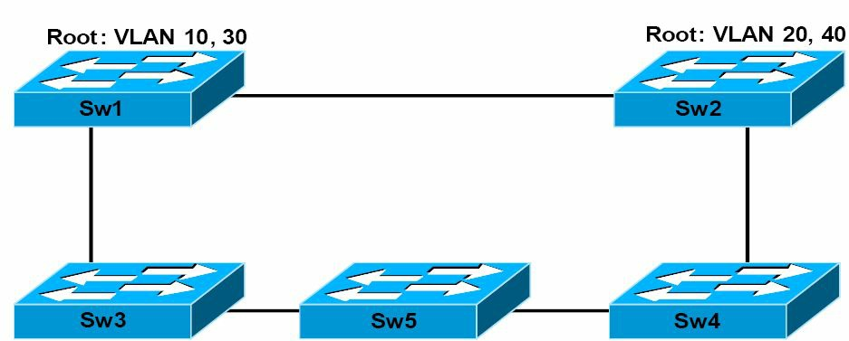

#第15天

**一二层排错**

**Layer 1 and Layer 2 Troubleshooting**

##第15天任务

- 阅读今天的课文
- 复习昨天的课文
- 完成今天的实验
- 阅读ICND1记诵指南
- 在[subnetting.org](http://www.subnetting.org)花15分钟

先前数课中已涵盖ICND1排错的许多要求，尤其是关于ACLs及IP分址方面。许多可能的故障都发生在一二层，一二层故障及其原因，是今天这课的重点。

LAN交换是一种用在局域网中的包交换形式。LAN交换是在数据链路层的硬件中完成的。正因为其是基于硬件的，使用到被称为介质访问控制地址（Media Access Control addresses, MAC地址）的硬件地址。**LAN交换机使用MAC地址来转发帧。**

今天将学习以下内容。

- 物理层排错
- VLAN、VTP及中继概述
- VLANs排错
- 运用`show vlan`命令

本模块对应了下面的CCNA大纲要求。

+ 一层故障的排错及处理
    - 组帧，framing
    - 循环冗余校验，CRC
    - 畸形帧，runts
    - 巨大帧，giants
    - 丢掉的数据包，dropped packets
    - 晚发冲突，[late collision](https://en.wikipedia.org/wiki/Late_collision)
    - 输入/输出错误，Input/Output errors
+ VLAN故障的排错和处理
    - 验证VLANs已配置, verify that VLANs are configured
    - 验证端口成员关系是正确的，verify that port membership is correct
    - 验证配置了IP地址, verify that the IP address is configured
+ 思科交换机上中继问题的排错和处理
    - 验证中继状态是正确的, verify that the trunk states are correct
    - 验证封装类型是正确配置的, verify that encapsulation is configured correctly
    - 验证那些VLANs是被放行的，verify that VLANs are allowed

##物理层上的排错

**Troubleshooting at the Phycical Layer**

思科IOS交换机支持好几个可用于一层，或至少怀疑是一层故障排错的命令。但是，除了对这些软件命令工具包要熟悉外，对可用于链路状态排错，或示出错误情形的物理指示器（也就是那些LEDs）的掌握，也是重要的。

###使用发光二极管（LEDs）的链路状态排错

**Troubleshooting Link Status Using Light Emitting Diodes(LEDs)**

如可物理接触到交换机，那么LEDs就会是一项有用的排错工具。不同类型的思科Catalyst交换机，提供了不同的LED能力。掌握这些LEDs的意义，是Catalyst交换机链路状态及系统排错所不可或缺的部分。思科Catalyst交换机有一些可用于判断链路状态及其它一些诸如系统状态等变量的前面板LEDs。

经由Google"Catalyst 2960 Switch Hardware Installation Guide"，来查看Catalyst 2960型号交换机的思科文档。该安装和配置手册包含了几百页的注记、建议和技术信息。通读一下该文档是值得的，但不要期望从该文档得到CCNA考试大纲的内容（CCNA考试大纲内容在这本书才有）。


<table>
<tr>
<td>`1`</td><td>系统LED</td><td>`5`</td><td>速率LED</td>
</tr>
<tr>
<td>`2`</td><td>冗余电源（redundant power supply, RPS） LED</td><td>`6`</td><td>PoE LED</td>
</tr>
<tr>
<td>`3`</td><td>状态LED</td><td>`7`</td><td>模式按钮</td>
</tr>
<tr>
<td>`4`</td><td>双工LED</td><td>`8`</td><td>端口LEDs</td>
</tr>
</table>

*图15.1 -- 思科2960交换机LEDs，图片版权归思科系统公司*

PoE LED只有在Catalyst 2960交换机型号上才能找到。

**系统LED**

**System LED**

系统LED表明系统通电了的（或是未通电）且正常发挥功能。

下表15.1列出了系统LED颜色及其所表明的状态。

*表15.1 -- 系统LED*

<table>
<tr><th>系统LED颜色</th><th>系统状态</th></tr>
<tr><td>不亮</td><td>系统未通电</td></tr>
<tr><td>绿色</td><td>系统运行正常</td></tr>
<tr><td>琥珀色（amber）</td><td>系统以通电，但未有正确发挥功能</td></tr>
</table>

**冗余电源LED**

**RPS LED**

冗余电源LED只在那些有着冗余电源的交换机上才有。下表15.2列出了RPS LED的颜色和其意义。

*表15.2 -- 冗余电源LEDs*

<table>
<tr><th>RPS LED颜色</th><th>状态</th></tr>
<tr><td>绿色</td><td>连接了RPS，且RPS在需要时就可提供后备电力</td></tr>
<tr><td>绿色闪烁(Blinking Green)</td><td>连接了RPS，但因为其正为另一设备提供电力（冗余已被分配给一台相邻设备）而不可用</td></tr>
<tr><td>琥珀色</td><td>RPS处于待机模式或故障状态（in standby mode or in a fault condition）。按下RPS上的Standby/Active按钮，此时该LED应变成绿色。如未变成绿色，则该RPS风扇可能损坏。请联系思科系统公司。</td></tr>
<tr><td>琥珀色闪烁</td><td>交换机内部电源失效，且正由RPS给交换机供电（冗余电源已分配给该设备）</td></tr>
</table>

**端口LEDs及其模式**

**Port LEDs and Modes**

端口LEDs提供了一组端口或单个端口的信息，如下表15.3所示。

*表15.3 -- 端口LEDs的模式*

<table>
<tr><th>所选模式LED</th><th>端口模式</th><th>说明</th></tr>
<tr><td>1 -- 系统</td><td></td><td></td></tr>
<tr><td>2 -- RPS</td><td></td><td>RPS状态</td></tr>
<tr><td>3 -- 状态</td><td>端口状态</td><td>端口状态（默认模式）</td></tr>
<tr><td>4 -- 双工</td><td>端口双工情况</td><td>双工模式：全双工或半双工</td></tr>
<tr><td>5 -- 速率</td><td>端口速率</td><td>端口运行速率：10, 100或1000Mbps</td></tr>
<tr><td>6 -- PoE</td><td>PoE端口供电</td><td>PoE状态</td></tr>
<tr><td>7 -- 模式</td><td></td><td>循环显示端口状态、双工模式及速率LEDs</td></tr>
<tr><td>8 -- 端口</td><td></td><td>依不同模式有不同含义</td></tr>
</table>

不停按下模式按钮（the Mode button）可在不同模式之间循环，直到需要的模式设置。这会改变端口LED颜色的意义，如下表15.4所示。

*表15.4 -- 模式设置*

<table>
<tr><th>端口模式</th><th>LED颜色</th><th>系统状态</th></tr>
<tr><td rowspan=6>状态</td><td>不亮</td><td>未插入网线或管理性关闭</td></tr>
<tr><td>绿色</td><td>有链路且链路无问题</td></tr>
<tr><td>绿色闪烁</td><td>活动的：端口在发送或接收数据</td></tr>
<tr><td>绿色琥珀色交替闪烁</td><td>链路故障（link fault）：出现可影响连通性的错误帧，以及过多的冲突、循环冗余校验（CRC），同时将对以太网的alignment及jabber问题进行检测（<a href="pdfs/EthernetErrorDescription.pdf" >以太网错误描述</a>, <a href="pdfs/EthernetErrors.pdf">以太网错误</a>）</td></tr>
<tr><td>琥珀色</td><td>端口被生成树协议（Spanning Tree Protocol, STP）阻塞而未转发数据。注意：在某端口重新配置后，端口LED将保持琥珀色30秒，因为STP会检查网络拓扑有没有可能的环回。</td></tr>
<tr><td>琥珀色闪烁</td><td>端口被STP阻塞同时没有发送或接收数据。</td></tr>
<tr><td rowspan=2>双工</td><td>不亮</td><td>端口以半双工方式运行。</td></tr>
<tr><td>绿色</td><td>端口以全双工方式运行。</td></tr>
<tr><td rowspan=8>速率</td><td colspan=2>10/100及10/100/1000Mbps端口</td></tr>
<tr><td>不亮</td><td>端口以10Mbps速率运行。</td></tr>
<tr><td>绿色</td><td>端口以100Mbps速率运行。</td></tr>
<tr><td>绿色闪烁</td><td>端口以1000Mbps运行。</td></tr>
<tr><td colspan=2>SPF(小封装可插拔，small form-factor pluggable, SPF)端口</td></tr>
<tr><td>不亮</td><td>端口以10Mbps速率运行。</td></tr>
<tr><td>绿色</td><td>端口以100Mbps速率运行。</td></tr>
<tr><td>绿色闪烁</td><td>端口以1000Mbps速率运行。</td></tr>
<tr><td rowspan=5>PoE</td><td>不亮</td><td>PoE关闭。如被供电设备从交流电源取得电力，那么就算被供电设备是连接到交换机的，PoE端口LED也会不亮。</td></tr>
<tr><td>绿色</td><td>PoE开启。端口LED只在该交换机端口供电时才亮起绿色。</td></tr>
<tr><td>绿色和琥珀色交替亮起</td><td>因为向被供电设备提供电力会超出交换机电源功率，而将PoE禁用了。Catalyst 2960-24PC-L、2960 48PST-L、2960-48PST-S及2960-24PC-S可以提供最高370W的电力。而Catalyst 2960-24LT-L和2960-24LC-S交换机只能提供最高124W的电力。</td></tr>
<tr><td>琥珀色闪烁</td><td>PoE因为故障而关闭。<br>注意：在做网线不合规及加电的设备连接到PoE端口(non-compliant cabling or powered devices are connected to a PoE port)时，都会导致PoE故障。在将思科认证的IP电话、无线接入点或符合IEEE 802.3af规范的设备连接到PoE端口时，只能使用标准规范的做网线方式。必须将导致PoE故障的网线或设备从网络上移除。（Only standard-compliant cabling can be used to connect Cisco prestandard IP phones, wireless access points, or IEEE 802.3af-compliant devices to PoE ports. You must remove the cable or device that cause the PoE fault from the network.）</td></tr>
<tr><td>琥珀色</td><td>端口的PoE已被关闭。默认PoE是开启的。</td></tr>
</table>

除了要掌握这些不同颜色的意义外，重要的是掌握修复这些故障所需的做法。比如，假设正在对一台Catalyst 6500交换机进行排错，并注意到管理引擎（或交换模块）的状态LEDs是红色或不亮。在此情况，就可能是该模块脱离了其插槽，或是因为某个新模块没有正确插入到其机架上。那么建议做法就是重新插好该模块。而有些时候，还需要重启整个系统。

在某条链路或某个端口LED颜色不是绿色时，就往往表明某种失效或其它故障，而重要的是记住**一条链路发出绿光也并不总意味着网线是完全没有问题的**。比如，只有一根线坏掉或是一个关闭端口，就可能导致一侧显示线路绿色光而另一侧不显示绿色绿色光。这可能是因为网线出现了物理压力而引起该网线具备临界级别的功能。在这种情况下，就可以使用CLI来完成额外的派错。

###线缆故障排错

**Troubleshooting Cable Issues**

在对线路故障进行排错时（一层排错），因为可以直接地查看及检查网线，所以通常都是非常容易找到问题的。但是，有些时候线路问题可以是看不见的，所以就不得不完成一个系统性的排错过程，以确保问题确实是在一层当中。一个一般性建议就是在进行复杂步骤之前，先适当地对所有网线进行测试（however, sometimes cabling problems can be invisible, so you will have to engage in a systematic troubleshooting process to make sure the problem is really localised at Layer 1. A general recommendation is to properly test all cabling before engaging in a complex infrastructure implementation）。下面是一些常见的线路问题。

- 有插入网线但没有连接
- 有插入网线且有得到连接，但那条连接的吞吐量极低
- 所有都工作正常，但突然没有了连接，接着又恢复正常，接着又无连接（也就是抖动，flapping）
- 间歇的连通性，看起来工作正常，但信号一次又一次地丢失

一些针对这些问题的建议测试有下面这些。

- 检查交换机链路灯是否亮起
- 检查链路灯有没有间隙地开启和关闭
- 检查网线压得对不对
- 检查网线未有物理损坏
- 检查网线不是过长（这会导致信号恶化）
- 检查网线连接头没有问题（可能需要另外的连接头）
- 检查电线针脚顺序是正确的（如是铜线的话）

如要确认遇到的不是网线故障，最简单的做法就是换一根好的网线，在进行同样的测试。这很容易办到同时可马上解决问题，而无需在排错过程中耗费过多的时间和资源。

> **注意：**就算是全新的网线有时也有问题，所以不要假定一根新网线就会如预期那样起作用。


###模块故障的排错

**Troubleshooting Module Issues**

大多数企业网络中用到的路由器和交换机都提供了铜质端口连接性，也提供了将不同类型的发送接收器进行板上组装的专门接口。这些发送接收器通常用于光纤连接，不过也有铜质的发送和接收器（copper-compatible transceivers）。

光纤连接可在很长距离上运作，同时这些特定端口通常都是模块化的，需要一个兼容的SFP（小型可插入发送和接收器），如图15.2中给出的那样。


*图15.2 -- SFP模块*

尽管SFP模块看起来都一样，但依据所使用的连接类型，根据下面这些参数，来选用适当的SFP模块。

- 介质类型：光纤还是铜缆, optical fibre or copper
- 光纤类别：单模还是多模光纤（single-mode or multi-mode fibre）
- 带宽, bandwidth
- 波长, wavelength
- 光纤规格，core size
- 模带宽，modal bandwidth
- 运行距离，operating distance

> **注意：**在为网络采购收发器时，应总要对设备端口、模块类型及所使用的光纤进行检查。

任何时候都可将收发器插入到网络设备（比如交换机、路由器、防火墙等），或从其上拔下，而无需重启设备。在没有连接时，不会在SFP模块上看到活动，而这就是在可接触到设备时最容易排错的故障了。

此外，插入光纤将激活那个端口，但又因为各种不同故障而致使连通性受到影响（比如性能恶化或是间歇的连通性），或是没有连通性。此时，有着下面几种可供采行的方法。

- 依据收发器的类型，检查使用的线缆类型是正确的（多模还是单模）
- 检查线缆是完好的，要使用那些专门的光纤测试工具
- 检查所使用的收发器是正确的类型
- 检查收发器没有硬件故障（换另一个收发器并进行测试）
- 依据所使用的收发器和线缆类别，检查设备端口有配置上正确的参数

为令到连接停机时间最低，就应检测那些插入了SFP模块的端口，以观察出现在统计信息中的可能错误。而这可通过标准监测工具完成，最常用的就是SNMP。

##使用命令行接口来对链路故障进行排错

**Using the Command Line Interface to Troubleshoot Link Issues**

思科IOS Catalyst交换机上，可使用好几个命令行接口命令来对一层故障进行排错。常用的命令包括`show interfaces`、`show controllers`以及`show interface [name] counters errors`命令。除了要知道这些命令，还要能解读这些命令的输出或所提供的信息。

`show interfaces`命令是一个提供过剩信息的强大工具，提供包括以下这些信息。

- 交换机端口的管理状态
- 端口允许状态
- 介质类型（对于特定交换机及端口，for select switches and ports）
- 端口输入及输出数据包数目
- 端口缓存失效数及端口错误数
- 端口输入及输出错误
- 端口输入及输出队列丢失情况

下面是在一个GigabitEthernet交换端口上的`show interfaces`命令的输出。

```
Catalyst-3750-1#show interfaces GigabitEthernet3/0/1
GigabitEthernet0/1 is up, line protocol is down (notconnect)
Hardware is GigabitEthernet, address is 000f.2303.2db1 (bia 000f.2303.2db1)
MTU 1500 bytes, BW 10000 Kbit, DLY 1000 usec,
    reliability 255/255, txload 1/255, rxload 1/255
Encapsulation ARPA, Loopback not set
Keepalive not set
Auto-duplex, Auto-speed, link type is auto, media type is unknown
input flow-control is off, output flow-control is desired
ARP type: ARPA, ARP Timeout 04:00:00
Last input never, output never, output hang never
Last clearing of “show interface” counters never
Input queue: 0/75/0/0 (size/max/drops/flushes); Total output drops: 0
Queueing strategy: fifo
Output queue: 0/40 (size/max)
5 minute input rate 0 bits/sec, 0 packets/sec
5 minute output rate 0 bits/sec, 0 packets/sec
    0 packets input, 0 bytes, 0 no buffer
    Received 0 broadcasts (0 multicasts)
    0 runts, 0 giants, 0 throttles
    0 input errors, 0 CRC, 0 frame, 0 overrun, 0 ignored
    0 watchdog, 0 multicast, 0 pause input
    0 input packets with dribble condition detected
    0 packets output, 0 bytes, 0 underruns
    0 output errors, 0 collisions, 1 interface resets
    0 babbles, 0 late collision, 0 deferred
    0 lost carrier, 0 no carrier, 0 PAUSE output
    0 output buffer failures, 0 output buffers swapped out
```

多数思科Catalyst交换机端口默认都是`notconnect`状态，如同该命令打印输出的第一行所示。但如果网线从该端口拔出或未有正确连接，端口状态也会转换成该状态。在连接的网线有问题或是网线另一端没有插入到活动端口或设备（比如某台工作站插入交换机的端口是关闭的）时，将同样显示为`notconnect`。

> **注意：**在对GigabitEthernet端口排错时，若两端使用了不正确千兆接口转换器（Gigabit Interface Converters, GBICs），也会导致`notconnect`端口状态。

输出的第一部分是该命令打印出的第一行（也就是`[interface] is up`），表示特定接口的物理层状态。输出的第二部分（也就是`line protocol is down`）表明该接口的数据链路层状态。而如该该部分指示`up`，就意味着该接口可发送和接收保持活动信号。**记住交换机端口可能在物理层是起来的，却在数据链路层是宕掉的**，比如，当端口是一个SPAN(Switch)目的端口时，或者本地端口连接到一台CatOS交换机的一个关闭的端口时，都会这样（if this indicates an `"up"`, then it means that the interface can send and receive keepalives. Keep in mind that it is possible for the switch port to indicate that the Physical Layer is up while the Data Link Layer is down, for example, such as when the port is a SPAN destination port(for sniffer traffic) or if the local port is connected to a CatOS(older switch operating system) switch with its port disabled）。

输入队列（the Input queue）表明因为超出最大队列尺寸而丢弃帧的实际数量。而其中的“fushes”列对Catalyst 6000系列交换机上的SPD（selective packet discard, 选择性数据包丢弃, [Selective Packet Discard](pdfs/SelectivePacketDiscard.pdf)，[Understanding Selective Packet Discard](http://www.cisco.com/c/en/us/support/docs/routers/12000-series-routers/29920-spd.html)）丢弃数据包进行计数。SPD在CPU超负荷时将低优先级的数据包丢弃，从而为高优先级数据包节省下处理能力。`show interfaces`命令输出中的`flushes`计数器随SPD部分而增长，SPD对路由器IP处理队列运用一种选择性数据包丢弃策略（a selective packet drop policy）。因此SPD仅用在进程交换流量上（appliese only to process-switched traffic）。

总的输出丢弃数量（the total output drops）表示由于输出队列充满而丢弃的数据包数量。输出丢弃经常在正将来多个的高带宽入站链路（比如几条千兆以太网链路）的流量，交换到单个的出站低带宽链路(比如一条快速以太网)时见到。输出丢弃的增长，是因为入站和出站带宽不匹配而造成的超出流量将该接口击败造成的（this is often seen when traffic from multiple inbound high-bandwidth links(e.g., GigabitEthernet links) is being switched to a single outbound lower-bandwidth(e.g., a FastEthernet link). The output drops increment because the interface is overwhelmed by the excess traffic due to the speed mismatch between the inbound and outbound bandwidths）。

`show interfaces`的输出中的一些其它接口相关的可分析的，同时在一二层排错中非常有用的术语，有下面这些。

- **帧数目**（frame number）：该字段给出了接收到的带有不正确的CRC及大小不是整数个字节的数据包数目。这通常是由不正常功能的以太网设备（硬件错误）而导致的冲突造成的。
- **循环冗余校验**（CRC）：该字段表示由发送设备生成的CRC与接收设备计算出的校验和不一致。这通常表示LAN上的传输错误、冲突或是系统传输不良数据。
- **畸形帧**（runts）: 此字段表示由于比最小数据包大小还小而丢弃的包数量。在以太网段上，比`64`字节还小的包都被看作畸形帧。
- **巨大帧**（giants）: 此字段表示由于比最大数据包大小还大而丢弃的包数量。在以太网段上，比起`1518`字节还大的数据包被看作巨大帧。
- **晚发冲突**(late collisions): 晚发冲突通常在网线过长或网络中有过多中继器时。冲突数目反应了因为以太网冲突而导致的重传报文数目。而这通常是由于对LAN的过度扩展造成的。
- **输入错误**（input errors）: 该字段提供所有畸形帧、巨大帧、CRC错误帧、超出帧（overruns）及忽略数据包的总数。
- **输出错误**（output errors）: 该字段提供了阻止数据报最后从接口发出的错误总数（this field provides the total sum of all errors that prevented the final transmission of datagrams out of the interface）。

除了`show interfaces`命令，命令`show interfaces [name] counters errors`也可以用来查看接口错误及促进一层的排错。下面就是命令`show interface [name] counters errors`打印出的输出。

```
Catalyst-3750-1#show interfaces GigabitEthernet3/0/1 counters errors
Port        Align-Err   FCS-Err   Xmit-Err    Rcv-Err UnderSize
Gi3/0/1         0         0          0          0         0
Port     Single-Col Multi-Col Late-Col Excess-Col Carri-Sen Runts
Gi3/0/1       0          0       0          0         0      0
Port        Giants
Gi3/0/1       0
```

接下来的部分对命令`show interfaces [name] counters errors`输出中的一些错误字段，以及这些字段所表示的故障或问题，进行讲述。

`Align-Err`字段反应了接收到的**没有以偶数个字节结束，同时有着错误CRC帧的数目**。这些错误**通常是由不匹配的双工不匹配或物理问题造成**，比如线路问题、坏端口或坏网卡造成的。在网线头一次插入端口时，一些这类错误就会发生。此外，如有集线器连接到端口，集线器上其它设备之间的冲突也会造成这些错误。

`FCS-Err`字段反应了有帧校验序列（Frame Check Sequence, FCS）错误的大小有效(valid-sized)、没有组帧错误的帧数目。这通常是因为物理故障，诸如网线做得不好、坏端口或者坏网卡造成的。此外，该字段下的非零值，可能表明存在双工不匹配。

`Xmit-Err`字段中的非零值是内部发送（Tx）缓冲器充满的表征。当有来自多个入站高带宽链路（比如多条GigabitEthernet链路）的流量正转发到单一的出站低带宽链路（比如一条FastEthernet链路）时，通常会见到这种情形。

字段`Rcv-Err`表示收到帧错误的总和。该计数器在接口收到诸如畸形帧、巨大帧或FCS错误帧时增长。

`UnderSize`字段在交换机接收到长度小于`64`字节的帧时增长。这通常是由故障发送设备造成的。

不同的`collisions`字段表示接口上的冲突。接口上的冲突通常发生在半双工以太网上，而这在现代网络中几乎是不存在的。因此，这些计数器对于全双工链路不应增长。如果这些计数器下出现了非零数值，那么通常表明存在全双工不匹配故障。当探测到全双工不匹配时，交换机会在控制台或日志中打印出类似于下面的消息。

```
%CDP-4-DUPLEX_MISMATCH: duplex mismatch discovered on FastEthernet0/1 (not full duplex), with R2 FastEthernet0/0 (full duplex)
```

如同将在生成树协议（Spanning Tree Protocol, STP）章节中介绍的那样，全双工不匹配可能导致在某端口连接到另一交换机时，交换网络中的STP循环。这些不匹配**可通过手动配置交换机端口的速率和双工方式予以解决。**

当以太网控制器每次想要在半双工连接上发送数据时，`Carri-Sen`（载波侦听，carrier sense）都会增长。控制器侦听线路并确保在传输前线路是空闲的。该字段下的非零值表示接口运行于半双工模式。这对半双工来说是正常的。

因为双工不匹配或其它物理层问题，比如坏网线、坏端口以及所连接设备上的坏网卡，也可能导致`Runts`字段下可以看到非零值。畸形帧是指所接收到的有着错误的CRC、小于最小IEEE 802.3帧大小，也就是以太网的64字节的那些帧。

最后，当接收到的帧超过IEEE 802.3最大帧大小，非巨大以太网（non-jumbo Ethernet, [Jumbo frame](https://en.wikipedia.org/wiki/Jumbo_frame), [Linux_Jumbo_frame](pdfs/Linux_Jumbo_frame.pdf)）的`1518`字节时，并有着坏的FCS时，`Giants`计数器就会增长。对于那些连接到某台工作站的端口或接口，该字段下的非零数值典型地是由所连接设备上的坏网卡导致的。不过，对于那些连接到另一交换机（比如通过中继链路）的端口或接口，如采用的是802.1Q封装方式，则该字段将会包含一个非零数值。**在802.1Q下，其打标记机制（the tagging mechanism）对帧进行了修改，因为中继设备插入了一个`4`字节的标记，并随后再度计算了FCS。**

对已有最大以太网帧大小的帧插入`4`字节后，就构成了一个`1522`字节的帧，那么接收设备就会将其看着是一个幼小巨大帧（a baby giant frame）。因此，尽管交换机仍将处理这些帧，该计数器将增长并包含一个非零值。为解决这个问题，802.3委员会建立一个名为802.3ac的小组来将以太网最大大小扩展到`1522`字节；这样以来，采行802.1Q中继时就不常见到该字段下的非零值了。

类似与`show interfaces`及`show interfaces <name> counters errors`命令所提供的信息，命令`show controllers ethernet-controller <interface>`也可以用来现实流量计数及错误计数信息。`show controllers ethernet-controllers <interface>`命令的输出如下所示。

```
Catalyst-3750-1#show controllers ethernet-controller GigabitEthernet3/0/1
Transmit GigabitEthernet3/0/1   Receive
4069327795 Bytes                3301740741 Bytes
  559424024 Unicast frames        376047608 Unicast frames
   27784795 Multicast frames       1141946 Multicast frames
    7281524 Broadcast frames       1281591 Broadcast frames
          0 Too old frames       429934641 Unicast bytes
          0 Deferred frames      226764843 Multicast bytes
          0 MTU exceeded frames  137921433 Broadcast bytes
          0 1 collision frames           0 Alignment errors
          0 2 collision frames           0 FCS errors
          0 3 collision frames           0 Oversize frames
          0 4 collision frames           0 Undersize frames
          0 5 collision frames           0 Collision fragments
          0 6 collision frames
          0 7 collision frames     257477 Minimum size frames
          0 8 collision frames  259422986 65 to 127 byte frames
          0 9 collision frames   51377167 128 to 255 byte frames
          0 10 collision frames  41117556 256 to 511 byte frames
          0 11 collision frames   2342527 512 to 1023 byte frames
          0 12 collision frames   5843545 1024 to 1518 byte frames
          0 13 collision frames         0 Overrun frames
          0 14 collision frames         0 Pause frames
          0 15 collision frames
          0 Excessive collisions        0 Symbol error frames
          0 Late collisions             0 Invalid frames, too large
          0 VLAN discard frames  18109887 Valid frames, too large
          0 Excess defer frames         0 Invalid frames, too small
     264522 64 byte frames              0 Valid frames, too small
   99898057 127 byte frames
   76457337 255 byte frames             0 Too old frames
    4927192 511 byte frames             0 Valid oversize frames
   21176897 1023 byte frames            0 System FCS error frames
  127643707 1518 byte frames            0 RxPortFifoFull drop frames
  264122631 Too large frames
          0 Good (1 coll) frames
          0 Good (>1 coll) frames
```

> **注意：**根据该命令执行所在平台的不同，上面的输出会略有不同。比如，Catalyst 3650系列交换机还包含了一个`Discarded frames`字段，该字段显示因资源不可用而导致的放弃传输尝试的帧总数（a `Discarded frames` field, which shows the total number of frames whose transmission attempt is abandoned due to insufficient resources）。该字段中出现了较大的数值就典型地表明存在网络壅塞故障（a network congestion issue）。在上面的输出中，应探究一下`RxPortFifoFull drop`帧字段，该字段表示因为入口队列充满而丢弃的接口所接收到的帧总数（the `RxPortFifoFull drop` frame field, which indicates the total number of frames received on an interface that are dropped because the ingress queue is full）。

###端口配置排错

**Troubleshooting Port Configuration**

各台网络设备都可以不同方式进行配置。多数类型的错误配置都产生网络中的问题，包括下面这些。

- 极低的流量吞吐，poor throughput
- 没有连通性，lack of connectivity

某台设备可以连接到网络，有着网络信号，同时可以与Internet及其它设备通信，却有着以持续的、易于重现方式的低通信性能。这种情况可能在正常运行中，包括与网络其它部分进行文件传输或其它类型的通信中出现。

在重大配置问题下，该故障可能以完全的连通性缺失，包括特定设备端口上连接信号灯不亮的形式出现（with major configuration issues, the issue might manifest as lack of connectivity, including no link lights on the specific device ports）。有时连接灯亮起但仍然没有任何类型的连通性。这显示在网线上有信号，也就是说没有网线问题，而是在端口上的端口问题故障或其它问题。这就要对设备的配置进行问题调查。

配置端口时有几项不同的设置，包括下面这些。

- 速率，speed
- 双工，duplex
- 封装/VLAN, encapsulation/VLAN

大多数的这些参数都必须在链路两侧保持一致，要么通过手动配置，或是通过开启端口自动配置。如能探测到，自动配置方式将在链路上发送协商数据包，来探测另一端的各种能力，并就两端设备的最佳参数达成一致，以建立最优传输。问题在于有的时候自动配置并不会按照需求选择出最佳参数，所以就要对此进行检查并针对各种特定情形对端口进行手动配置。

如正对各个端口进行手动配置，那么要注意的第一个参数，就是接口速率。在**链路两端上的接口速率必须一致**。如在一侧配置不正确，链路就可以不会运作。另一个有关的设置就是**端口双工方式**，这可以配置为半双工或全双工。**可以在一侧配置为半双工、另一侧配置为全双工**，这样做尽管链路也会运行，但通过流量将极大地受到影响，因为两侧都期望以不同方式处理通信。同时这样做也会导致对那条链路上的传输造成影响的冲突。为令到流量能够尽可能有效地进行发送，请确保两侧都使用同样的双工设置。

而如在企业级环境下运营（if you are operating in an enterprise-level environment），就可能需要使用不同的VLANs对流量进行分段。所有交换机在这方面都必须准确配置，如此一来所有交换机端口都分配到正确的VLAN中。而如直接将配置到使用不同VLAN IDs的端口直接连接，那么就算物理层上显示没有故障，二层上的通讯仍将遭到破坏。

通过对上述的端口配置选项进行检查，以及确保链路两端的所有参数都保持同步，那么就可以肯定所连接设备的连通性及流量吞吐都将是最优的。

##VLANs及中继排错

**Troubleshooting VLANs and Trunking**

先前的小节中，我们谈到可用用于物理层故障排除的三个命令行命令的使用。本节将给出一些用于对VLAN内倍连通性故障进行鉴别及排错的常见方法（the use of three CLI commands that can be used for troubleshooting Physical Layer issues. this section describes some common approaches to identifying and troubleshooting intra-VLAN connectivitiy issues）。VLAN内部连通性故障的一些相对来讲更为常见的原因，有下面这些。

- 双工不匹配，duplex mismatches
- 坏的网卡或网线，bad NIC or cable
- 壅塞，congestion
- 硬件故障，hardware issues
- 软件故障, software issues
- 资源过度预订, resource oversubscription, [Cisco MDS交换机端口组速率模式介绍](pdfs/EMC_Community_Network-ECN_Cisco_MDS交换机端口组速率模式介绍.pdf)
- 配置问题，configuration issues

**双工不匹配**可导致甚低网络性能及连通性。尽管已有对自动协商的改进，同时采行自动协商被认为是有效的做法，双工不匹配仍有可能发生。比如，在网卡设置为100/Full，而交换机端口是自动协商时，网卡将保持其100/Full设置，但交换机端口将被设置为100/Half。而与此相反，也会出现双工不匹配的问题。也就是网卡设置自动协商，交换机端口设置为100/Full。此时，网卡将自动协商为100/Half，而交换机端口保持其静态的100/Full配置，导致双工不匹配。

因此好的做法就是在那些可以手动设置的地方，对10/100以太网连接的速率和双工手动进行设置，以避免自动协商带来的双工不匹配问题。**双工不匹配可能不仅会对直接连接到交换机上的用户造成影响，还可能对有着不匹配双工设置的交换机间连接上通过的网络流量造成影响。**使用命令`show interface`就可以查看到端口的接口速率和双工设置。

>**注意：**因为Catalyst交换机仅支持1Gbps链路全双工，所以对于GigabitEthernet连接，双工问题并不常见。

思科IOS软件中的多个计数器都可用来鉴别潜在**坏网卡或网线问题**。通过对不同的`show`命令中的一些计数器的检查，来识别网卡或网线问题。比如，假设交换机端口计数器显示带有无效CRC或FCS错误的帧数持续增长，就有极大可能是因为工作站或机器的坏网卡，以及坏的网线。

网络壅塞同样可能引起交换网络中的间隙性连通故障。VLAN超载的第一个表象就是某端口上的接收或发送缓冲过度预订(oversubscribed)。此外，端口上过多的帧丢弃也是网络壅塞的指标。而网络壅塞的常见原因，就是对主干连接的聚合带宽需求估计不足。那么，**壅塞问题就可以通过配置以太网信道或往现有以太网信道中加入更多的端口，得到解决。**同时网络壅塞又是连通性故障的常见原因，同时重要的是要知道**交换机本身可能经历壅塞问题，而交换机本身的壅塞问题有可能会对网络性能产生类似的影响**（a common cause of network congestion is due to underestimating aggregate bandwidth requirements for backbone connections. In such cases, congestion issues can be resolved by configuring EtherChannels or by adding additional ports to existing EtherChannels. While network congestion is a common cause of connectivity issues, it is also important to know that the switch itself can experience congestion issues, which can have a similar impact on network performance）。

**交换机内部壅塞**，有限的交换机带宽可能导致壅塞问题，由此造成的壅塞可能对网络性能造成极为严重的影响。在LAN交换中，带宽是指交换机内部交换线路（[the switch fabric](pdfs/the_Definition_of_a_Switch_Fabric-EtherealMind.pdf)）的传输能力。因此，如果交换线路的传输能力是`5Gbps`, 而要尝试将`7Gbps`的流量通过交换机传输，结果就是数据包丢失及差强人意的网络性能了。在那些所有端口的聚合传输容量可能超出总的骨干容量的超出预订平台上，这是一个常见的问题（this is a common issue in oversubscribed platforms, where the aggregate capacity of all ports can exceed the totoal backplane capacity）。

在交换LAN中，**硬件故障**也可能引起连通性问题。这类问题的实例包括交换机的坏端口或坏模块。尽管在可能的情况下可以通过查看诸如LEDs等物理指示器来对这类故障进行排错，某些时候这类问题是难于排错及诊断的。在怀疑存在潜在的硬件故障的多数情况下，都应需求技术支持中心（Technical Assistance Centre, TAC）的支持。

相比上面这些问题，软件缺陷（software bugs）就更难于分辨出来，因为软件缺陷引起难于对其进行排错的偏差（deviation）。在怀疑有软件缺陷导致连通性问题时，应该就发现的问题，联系技术支持中心（TAC）。此外，如在控制台或日志中有打印出错误消息，就也可以使用思科提供的一些在线工具，来采取一些替代方法（implement a workaround）或是得到某个已经解决该问题并得到验证的软件版本的建议。

与其它硬件设备相比，交换机有着受限的资源，比如物理内存。在这些资源过度使用时，就会导致严重的性能问题。而像是高CPU使用率这样的问题，就可能对交换机及网络性能造成极为严重的影响。

最后，如同其它技术一样，**不正确的配置同样会直接或间接地造成连通性问题**。比如，根桥放置粗劣就会导致慢速用户连通性。而将一台不当配置的交换机直接加入到生产网络，则会导致一些或全部用户的网络连接完全中断（the poor placement of the Root Bridge may result in slow connectivity for users. Directly integrating or adding an incorrectly configured switch into the production network could result in an outright outage for some or all users）。下面的小节对一些常见的VLAN相关故障、其可能的原因，以及为排除这些故障可采取的做法，进行了讲解。

###动态VLAN通告排错

**Troubleshooting Dynamic VLAN Advertisements**

思科Catalyst交换机使用VLAN中继协议（VLAN Trunk Protocol, VTP）来在交换域中传播VLAN信息（propagate VLAN information dynamically throughout the switched domain）。VTP是一个思科专有的二层报文发送协议，用于管理位处同一VTP域中的交换机上VLANs的添加、删除及重命名。

某台交换机在加入到VTP域时无法动态接收任何VLAN信息的原因有好几个。下面是一些常见的原因。

- 二层中继配置错误，Layer 2 trunking misconfiguration
- 不正确的VTP配置，incorrect VTP configuration
- 配置修订号，configuration revision number
- 物理层故障, Physical Layer issues
- 软件或硬件故障或缺陷，software or hardware issues or bugs
- 交换机性能问题, switch performance issues

为令到交换机采用VTP交换VLAN信息，交换机间必须建立中继链路。思科IOS交换机支持ISL和802.1Q两种中继机制。尽管一些交换机默认采用ISL这种思科专有中继机制，不过当前思科IOS Catalyst交换机默认都采用802.1Q了。在提供交换机间中继时，手动指定中继封装协议被认为是好的做法。这是通过在将链路配置为中继端口时，使用接口配置命令`switchport trunk encapsulation [isl|dot1q]`完成的。

可用于对中继连通性问题进行排错的命令有好几个。可使用`show interfaces`命令来检查基本的端口运行及管理性状态（you can use the `show interfaces` command to verify basic port operational and administrative status）。此外，可通过在`show interfaces`命令后追加`trunk`或`errors`关键字来进行额外排错和检查。 而命令`show interfaces [name] counters trunk`则可用于查看中继端口上传输和接收到的帧数目。

该命令的输出还包括了封装错误数，而封装错误数可用于检查802.1Q和ISL，以及中继封装不匹配数目，如下面的输出所示。

```
Cat-3550-1#show interfaces FastEthernet0/12 counters trunk
Port    TrunkFramesTx   TrunkFramesRx   WrongEncap
Fa0/12           1696           32257            0
```

参考上面的输出，可以反复执行该命令，以确保Tx及Rx栏是持续增长的，并以此完成更多的排错。比如，假设该交换机没有发出任何帧，则该接口就可能并未配置为中继接口，或者其是宕掉的或关闭的（or it might be down or disabled）。而如果Rx栏没有增长，则可能是远端交换机未有正确配置。

用于对可能的二层错误配置进行排错的另一个命令，就是`show interfaces [name] trunk`。该命令的输出包含了中继封装协议及模式、802.1Q的原生VLAN、允许通过中继链路VLANs、VTP域中活动的VLANs，以及被修剪掉的VLANs（the output of `show interfaces [name] trunk` includes the trunking encapsulation protocol and mode, the native VLAN for 802.1Q, the VLANs that are allowed to traverse the trunk, the VLANs that are active in the VTP domain, and the VLANs that are pruned）。**一个VLAN传播的常见问题，就是上游交换机已通过使用接口配置命令`switchport trunk allowed vlan`，被配置为对某些VLANs进行过滤。**命令`show interfaces [name] trunk`的输出如下所示。

```
Cat-3550-1#show interfaces trunk
Port    Mode        Encapsulation   Status      Native vlan
Fa0/12  desirable   n-802.1q        trunking    1
Fa0/13  desirable   n-802.1q        trunking    1
Fa0/14  desirable   n-isl           trunking    1
Fa0/15  desirable   n-isl           trunking    1
Port    Vlans allowed on trunk
Fa0/12  1-4094
Fa0/13  1-4094
Fa0/14  1-4094
Fa0/15  1-4094
Port    Vlans allowed and active in management domain
Fa0/12  1-4
Fa0/13  1-4
Fa0/14  1-4
Fa0/15  1-4
Port    Vlans in spanning tree forwarding state and not pruned
Fa0/12  1-4
Fa0/13  none
Fa0/14  none
Fa0/15  none
```

**另一个常见中继错误配置故障就是原生VLAN不匹配。**在配置802.1Q中继链路时，中继链路两端的原生VLAN必须匹配；否则该链路便不会工作。如存在原生VLAN不匹配，STP就会将该端口置为端口VLAN ID不一致状态（a port VLAN ID(PVID) inconsistent state），且不会在该链路上进行转发。在此情况下，将有类似于下面的消息在控制台或日志中打印出来。

```
*Mar 1 03:16:43.935: %SPANTREE-2-RECV_PVID_ERR: Received BPDU with inconsistent peer vlan id 1 on FastEthernet0/11 VLAN2.
*Mar 1 03:16:43.935: %SPANTREE-2-BLOCK_PVID_PEER: Blocking FastEthernet0/11 on VLAN0001. Inconsistent peer vlan.
*Mar 1 03:16:43.935: %SPANTREE-2-BLOCK_PVID_LOCAL: Blocking FastEthernet0/11 on VLAN0002. Inconsistent local vlan.
*Mar 1 03:16:43.935: %SPANTREE-2-RECV_PVID_ERR: Received BPDU with inconsistent peer vlan id 1 on FastEthernet0/12 VLAN2.
*Mar 1 03:16:43.935: %SPANTREE-2-BLOCK_PVID_PEER: Blocking FastEthernet0/12 on VLAN0001. Inconsistent peer vlan.
*Mar 1 03:16:43.939: %SPANTREE-2-BLOCK_PVID_LOCAL: Blocking FastEthernet0/12 on VLAN0002. Inconsistent local vlan.
```

尽管STP排错将在本书后面进行讲解，该不一致状态仍可通过使用`show spanning-tree`命令进行查证，如下面所示。

```
Cat-3550-1#show spanning-tree interface FastEthernet0/11
Vlan                Role    Sts     Cost        Prio.Nbr    Type
------------------- ----    ---     --------    --------    ----------------
VLAN0001            Desg    BKN*    19          128.11      P2p *PVID_Inc
VLAN0002            Desg    BKN*    19          128.11      P2p *PVID_Inc
```

如已经查明该中继链路确实是正确配置，及两台交换机间是可运作的，接下来就应对VTP配置参数进行检查了。这些参数包括VTP域名、正确的VTP模式及VTP口令，如对该VTP域配置了某个参数，就要使用相应的`show vtp status`及`show vtp password`命令。`show vtp status`命令的输出如下所示。

```
Cat-3550-1#show vtp status
VTP Version                     : running VTP2
Configuration Revision          : 0
Maximum VLANs supported locally : 1005
Number of existing VLANs        : 8
VTP Operating Mode              : Server
VTP Domain Name                 : TSHOOT
VTP Pruning Mode                : Enabled
VTP V2 Mode                     : Enabled
VTP Traps Generation            : Disabled
MD5 digest                      : 0x26 0x99 0xB7 0x93 0xBE 0xDA 0x76 0x9C
...
[Truncated Output]
```

在应用`show vtp status`命令时，要确保交换机使用同一版本的VTP。默认情况下，Catalyst交换机允许VTP版本`1`。而运行VTP版本`1`的交换机是不能加入到VTP版本`2`的域中的。而如某交换机不兼容VTP版本`2`, 那么就要使用全局配置命令`vtp version`，将所有VTP版本`2`的交换机配置为运行版本`1`。

> **注意：**如在服务器上修改了VTP版本，那么此改变将自动传播到VTP域中的客户端交换机。

VTP客户端/服务器（clinet/server）或服务器/服务器(server/server)设备上的VTP传播是开启的。而如果在某台交换机上VTP是关闭的（也就是透明模式），那么该交换机将不会经由VTP动态地接收VLAN信息。不过，要留意**VTP版本2的透明模式交换机，将在其中继端口转发出接收到的VTP通告，而充当VTP中继。**就算VTP版本不一样，该过程也会照常进行。域中交换机上的VTP域名称也应保持一致。

最后，`show vtp status`命令的输出也包含了用于认证目的的MD5散列值。该散列值是从VTP域名称和密码生成的，域中所有交换机上的该散列值应是一致的。而如在这些交换机上的域名称和密码不同，则计算出的MD5也会不同。而如域名称或密码不同，那么`show vtp status`命令就会示出一条MD5摘要校验和不匹配（an MD5 digest checksum mismatch）消息，如下面的输出所示。

```
Cat-3550-1#show vtp status
VTP Version                     : running VTP2
Configuration Revision          : 0
Maximum VLANs supported locally : 1005
Number of existing VLANs        : 8
VTP Operating Mode              : Server
VTP Domain Name                 : TSHOOT
VTP Pruning Mode                : Enabled
VTP V2 Mode                     : Enabled
VTP Traps Generation            : Disabled
MD5 Digest                      : 0x26 0x99 0xB7 0x93 0xBE 0xDA 0x76 0x9C
*** MD5 digest checksum mismatch on trunk: Fa0/11 ***
*** MD5 digest checksum mismatch on trunk: Fa0/12 ***
...
[Truncated Output]
```

最后，在应用VTP时，**配置修订号可能会造成严重破坏。VTP域中的交换机使用配置修订号来保持对域中最新信息的跟踪**（the configuration revision number can wreak havoc when using VTP. Switches use the configuration revision number to keep track of the most recent information in the VTP domain）。域中所有交换机都将其前一次从一条VTP通告中收听到的配置修订号存储起来，同时在每次接收到新信息时该号码都被增加。而在任何交换机接收到带有高于其自身配置修订号的通告报文时，都将覆写任何存储的VLAN信息，并将其自身存储的VLAN信息与所接收到的通告报文中的信息进行同步。

因此，如想知道为何加入到VTP域中的交换机没有接收任何的VLAN信息，那么可能是该交换机已有一个较高的配置修订号，而导致所有其它交换机覆写了它们的本地VLAN信息，并将本地VLAN信息替换成了接收自新交换机的通告报文中的VLAN信息。为避免此种情形，**在将新的交换机加入到某VTP域之前，总是要确保其配置修订号被设置为0。**这可以通过在该交换机上修改VTP模式或修改VTP域名称完成。配置修订号在命令`show vtp status`的输出中有包含。

###VLAN内部端到端连接丢失

**Troubleshooting Loss of End-to-End Intra-VLAN Connectivity**

某个VLAN中端到端连通性丢失有好几个原因。而最常见的原因包括下面这些。

- 物理层故障，Physical Layer issues
- VTP修剪，VTP pruning
- VLAN中继链路过滤，VLAN trunk filtering
- 新的交换机，new switches
- 交换机性能问题，switch performance issues
- 网络壅塞, network congestion
- 软件或硬件问题或缺陷，software or hardware issues or bugs


> **注意：**为简明扼要地讲解，这里只会对中继、VTP修剪、以及往域内新加入交换机三个方面进行说明。软件或硬件问题或缺陷及交换机性能问题在本书中已有说明。而物理层排错在本模块早前已经进行了讲解。


**VTP修剪在没有本地端口属于某些VLANs时，将那些VLANs从本地交换机的VLAN数据库中移除。**VTP修剪通过消除不必要的广播、多播及通过网络泛洪的那些未知流量，而提升中继链路效率（VTP pruning increases the efficiency of trunks by eliminating unnecessary Broadcast, Multicast, and unknown traffic from being flooded across the network）。

尽管VTP修剪是一项值得部署的特性，但不正确的配置或是部署可能导致端到端连通性的丢失。应仅在客户端/服务器环境中开启（in client/server environments）。在包含透明模式交换机的网络中应用修剪，就可能造成连通性丢失。如网络中有一或多台的交换机处于VTP透明模式，就应该要么对整个VTP域全局关闭修剪，否则就要通过在适当的接口下，使用接口配置命令`switchport trunk pruning vlan`, 以确保到上游的透明模式交换机中继链路上的VLANs都无资格修剪（也就是它们在这些链路上不被修剪，ensure that all VLANs on the trunk link(s) to the upstream transparent mode switch(es) are pruning ineligible, i.e., they are not pruned，using the `switchport trunk pruning vlan` interface configuration command under the applicable interfaces）。

**对放行的VLANs及中继状态进行检查**

**Verify Allowed VLANs and Trunk Status**

除了VTP修剪外，交换机中继链路上对VLANs的不正确过滤，也可能导致端到端VLAN连通性的丢失。**默认允许所有VLANs通过所有中继链路；**但是思科IOS软件允许管理员通过使用接口配置命令`switchport trunk allowed vlan`，在指定中继链路上选择性地移除（或加入）VLANs。可以使用命令`show interfaces [name] trunk`及`show interfaces [name] switchport`，来查看中继链路上被修剪和限制的VLANs。作为检查某个中继端口上放行VLANs最容易的方式，命令`show interfaces [name] trunk`的输出如下所示。

```
Cat-3550-1#show interfaces trunk
Port    Mode    Encapsulation   Status      Native vlan
Fa0/1   on      802.1q          trunking    1
Fa0/2   on      802.1q          trunking    1
Port    Vlans allowed on trunk
Fa0/1   1,10,20,30,40,50
Fa0/2   1-99,201-4094
Port    Vlans allowed and active in management domain
Fa0/1   1,10,20,30,40,50
Fa0/2   1,10,20,30,40,50,60,70,80,90,254
Port    Vlans in spanning tree forwarding state and not pruned
Fa0/1   1,10,20,30,40,50
Fa0/2   1,40,50,60,70,80,90,254
```

同样要检查中继链路上通告的正确VLANs。在中继链路上放行的不适当VLANs可能引起功能缺失或安全问题。也想要确保中继链路两端有着同样的放行VLANs（Inproper VLANs allowed on the link can lead to a lack of functionality or security issues. Also, you want to make sure that the same VLANs are allowed on both ends of a trunk）。

>**注意：**在将另外的需要在某条中继链路上放行的VLAN(s)加入进去时，应非常谨慎地不要忘记关键字`add`。比如，在已经配置了`switchport trunk allowed vlan 10, 20`，而打算同样放行VLAN 30时，就需要输入命令`switchport trunk allowed vlan add 30`。而如只是简单地配置`switchport trunk allowed vlan 30`，那么先前所允许的VLANs 10和20就会从中继链路上移除，这将导致VLANs 10和20的通信中断。

由命令`show interfaces trunk`命令所提供的另一重要信息，就是中继端口状态。中继端口状态信息确认该中继链路是否形成，同时必须要在链路两端对此进行检查。如该端口未处于“中继”模式，此时最重要的就是必须对端口中继运作模式（the mode of operation, o/auto等）进行检查，看看在该模式下是否能与链路另一端形成中继状态。

**检查封装类型**

**Verify Encapsulation Type**

解决中继故障的另一重要步骤，就是查明中继链路两端所配置的正确封装类型。大多数思科交换机都允许ISL及802.1Q封装类型。而尽管大多数现代网络都是设计使用dot1Q, 仍然可能存在一些网络优先使用ISL的情形。封装类型是通过使用接口配置命令`switchport trunk encapsulation <type>`配置的。而可用于查看封装类型的命令如下。

- `show interfaces trunk`
- `show interfaces <number> switchport`

在某个已被静态配置为802.1Q中继链路端口上的`show interfaces [name] switchport`命令的输出如下所示。

```
Cat-3550-2#show interfaces FastEthernet0/7 switchport
Name: Fa0/7
Switchport: Enabled
Administrative Mode: trunk
Operational Mode: trunk
Administrative Trunking Encapsulation: dot1q
Operational Trunking Encapsulation: dot1q
Negotiation of Trunking: On
Access Mode VLAN: 1 (default)
Trunking Native Mode VLAN: 1 (default)
Administrative Native VLAN tagging: enabled
Voice VLAN: none
Administrative private-vlan host-association: none
Administrative private-vlan mapping: none
Administrative private-vlan trunk native VLAN: none
Administrative private-vlan trunk native VLAN tagging: enabled
Administrative private-vlan trunk encapsulation: dot1q
Administrative private-vlan trunk normal VLANs: none
Administrative private-vlan trunk associations: none
Administrative private-vlan trunk mappings: none
Operational private-vlan: none
Trunking VLANs Enabled: 3,5,7
Pruning VLANs Enabled: 2-8
Capture Mode Disabled
Capture VLANs Allowed: ALL
Protected: false
Unknown unicast blocked: disabled
Unknown multicast blocked: disabled
Appliance trust: none
```

如之前小节所说到的，网络中一台新交换机的加入，可能导致管理域中VLAN信息的丢失（the integration of a new switch into the network can result in a loss of VLAN information in the management domain）。而此VLAN信息丢失又可能导致同一VLAN中设备间连通性的丢失。所以在将新交换机加入到LAN之前，一定要确保其配置修订号被重置到0。

###使用“show vlan”命令

**Using the "show vlan" Command**

除了在前面几个小节中介绍的那些命令外，还有一些用于对VLAN配置进行检查和排错的有用思科IOS软件的命令。最常用到的VLAN检查和排错命令之一就是`show vlan`命令了。该命令显示管理域内所有VLANs的参数，如下面的输出所示。

```
Cat-3550-1#show vlan
VLAN Name                             Status    Ports
---- -------------------------------- --------- -------------------------------
1    default                          active    Fa0/11, Fa0/12,
                                                Fa0/13, Fa0/14,
                                                Fa0/20, Fa0/21,
                                                Fa0/22, Fa0/23,
                                                Fa0/24
150  VLAN_150                         active    Fa0/2, Fa0/3, Fa0/4,
                                                Fa0/5, Fa0/6, Fa0/7,
                                                Fa0/8, Fa0/9, Fa0/10
160  VLAN_160                         active    Fa0/15, Fa0/16,
                                                Fa0/17, Fa0/18,
                                                Fa0/19
170  VLAN_170                         active    Gi0/1, Gi0/2
1002 fddi-default                     active
1003 token-ring-default               active
1004 fddinet-default                  active
1005 trnet-default                    active
VLAN Type  SAID       MTU   Parent RingNo BridgeNo Stp  BrdgMode
---- ----- ---------- ----- ------ ------ -------- ---- --------
1    enet  100001     1500  -      -      -        -    -
150  enet  100150     1500  -      -      -        -    -
160  enet  100160     1500  -      -      -        -    -
170  enet  100170     1500  -      -      -        -    -
1002 fddi  101002     1500  -      -      -        -    -
1003 tr    101003     1500  -      -      -        -    -
1004 fdnet 101004     1500  -      -      -        ieee -
1005 trnet 101005     1500  -      -      -        ibm  -
Trans1 Trans2
------ ------
0      0
0      0
0      0
0      0
0      0
0      0
0      0
0      0
Remote SPAN VLANs
-------------------------------------------------------------------
Primary Secondary Type              Ports
------- --------- ----------------- -------------------------------
```

该命令打印出所有可用的VLANs，以及所分配到每个单独VLANs的那些端口。该命令的输出所包含的端口仅是接入端口，且不管这些端口是否开启或宕掉，都会显示出来。该命令输出不包括中继链路，因为这些输出属于所有所有VLANs。`show vlan`命令还提供了RSPAN(Remote Switch Port ANalyser, 远程交换机端口分析器) VLANs, 以及交换机上私有VLAN（Private VLAN, PVLAN， 这是一个CCNP考点）的信息。`show vlan`命令还可以带上一些额外关键字来使用，以提供更具体的信息。下面的输出显示了可与该命令一起使用的所支持的附加关键字。

```
Cat-3550-1#show vlan ?
brief           VTP all VLAN status in brief
id              VTP VLAN status by VLAN id
ifindex         SNMP ifIndex
name            VTP VLAN status by VLAN name
private-vlan    Private VLAN information
remote-span     Remote SPAN VLANs
summary         VLAN summary information
|               Output modifiers<cr>
```

`brief`字段打印所有活动VLANs的简要信息。此命令的输出与上面的相同，唯一的区别就是省掉了后两个部分。`id`字段提供了和`show vlan`一样的信息，但如下面的输出所示，只包含特定VLAN的信息。

```
Switch-1#show vlan id 150
VLAN Name                             Status    Ports
---- -------------------------------- --------- --------------------
150  VLAN_150                         active    Fa0/1, Fa0/2, Fa0/3,
                                                Fa0/4, Fa0/5, Fa0/6,
                                                Fa0/7, Fa0/8, Fa0/9,
                                                Fa0/10
VLAN Type  SAID       MTU   Parent RingNo BridgeNo Stp  BrdgMode
---- ----- ---------- ----- ------ ------ -------- ---- --------
150  enet  100150     1500  -      -      -        -    -
Trans1 Trans2
------ ------
0      0
0      0
Remote SPAN VLAN
----------------
Disabled
Primary Secondary Type              Ports
------- --------- ----------------- --------------------------------
```

VLAN与属于该VLAN的接入端口一样，再度包含在了输出中。中继端口因为是属于所有VLANs，而不包含在输出中。额外信息包括了VLAN MTU、RSPAN配置（如适用），以及PVLAN配置参数（如适用）。

`name`字段允许指定VLAN名称而不是其ID。该命令打印与`show vlan id <number>`命令同样的信息。`ifindex`字段现实VLAN的SNMP IfIndex(如适用)，而`private-vlan`及`remote-span`字段打印相应的PVLAN及RSPAN配置信息。最后, `summary`字段打印管理域（the management domain）中活动的VLANs数目的一个汇总信息。活动VLANs包括了标准和扩展VLANs。

带上或不带参数的`show vlan`命令，在排错过程的以下方面，都是最为有用的命令。

- 确认设备上所配置的VLANs
- 判定端口成员关系

另一个有用的VLAN排错命令，就是`show vtp counters`。该命令打印有关VTP数据包统计的信息。以下是在某台配置为VTP服务器的交换机上，`show vtp counters`的输出。

```
Cat-3550-1#show vtp counters
VTP statistics:
Summary advertisements received     : 15
Subset advertisements received      : 10
Request advertisements received     : 2
Summary advertisements transmitted  : 19
Subset advertisements transmitted   : 12
Request advertisements transmitted  : 0
Number of config revision errors    : 0
Number of config digest errors      : 0
Number of V1 summary errors         : 0
VTP pruning statistics:
Trunk   Join Transmitted    Join Received   Summary advts received
                                            from non-pruning-
                                            capable device
-----   ----------------    --------------  -----------------------
Fa0/11                0                  1                        0
Fa0/12                0                  1                        0
```

`show vtp counters`命令打印输出的前六行，提供了三种类型VTP数据包的统计信息：通告请求（advertisement requests）、汇总通告（summary advertisements）以及子集通告（subset advertisements）。随后小节将对这些不同报文进行讲解。

**VTP通告请求**是对配置信息的请求。这些报文是由VTP客户端发出给VTP服务器，用以请求其没有的VLAN及VTP信息。在交换机重置、VTP域名称改变，或交换机接收到一条带有比其自身更高的配置修订号的VTP汇总通告帧时，客户端交换机便发出一条VTP通告请求报文。VTP服务器应仅显示接收计数器增长，而所有VTP客户端都应只显示发送计数器增长。

**VTP汇总通告**是由服务器默认每隔5分钟发出的。这些报文类型用于告知邻接交换机当前VTP域名称、配置修订号及VLAN配置状态，及包括时间戳、MD5散列值及子网数目通告等其它VTP信息（VTP summary advertisements are used to tell an adjacent switch of the current VTP domain name, the configuration revision number and the status of the VLAN configuration, as well as other VTP information, which includes the time stamp, the MD5 hash, and the number of subnet advertisements to follow）。而如果服务器上的这些计数器在增长，那么在VTP域中就有不知一台交换机充当或配置为VTP服务器。

**VTP子集通告**是由VTP服务器在某个VLAN配置改变时，比如有VLAN被加入、中止、改变、删除或其它VLAN指定参数（比如VLAN的MTU等）发生变化时所发出的。在VTP汇总通告之后，会有一或更多的子集通告发出。而一条子集通告包含了一个VLAN信息清单。而如果涉及多个VLANs，就需要多于一条的子集通告，以实现对所有VLANs的通告。

字段`Number of config revision errors`显示了交换机因其接收到带有相同配置修订号，却有着不同MD5散列值的数据包，而无法接受的通告数目。在同一VTP域中有两台以上的服务器交换机上的VTP信息同时发生变动，且*中间交换机*(an intermediate switch)于同一时间接收到来自这些服务器的通告时，这是常见会发生的。此概念在下图15.3中进行了演示，该图演示了一个基本的交换网络。



*图15.3 -- 配置修订号错误的排错*

图15.3演示了一个结合了冗余和负载均衡（incorporates redundancy and load sharing）的基本网络。应假设Sw1和Sw2都是配置成的VTP服务器，而Sw3是配置成的VTP客户端。Sw1是VLANs 10及30的根交换机，同时Sw2是VLANs 20及40的根交换机。假设在Sw1和Sw2上同时应用了改变，将VLAN 50加入到了Sw1, VLAN 60加入到了Sw2。在数据库的改变之后两台交换机都发出一条通告。

变动在域中传播，覆写其它接收到该信息交换机先前的数据库。假设Sw5同时接收到来自邻居的同样信息，同时接收到的两条通告都包含了同样配置修订号。那么在此情况下，该交换机就无法接受这两条通告，因为它们有着同样配置修订号，但却有着不同的MD5散列值。

当这种情况发生时，交换机就将`Number of config revision errors counter`字段加一，同时不更新其VLANs数据库。而这种情况可能导致一个或多个VLANs中连通性的丢失，因为在该交换机上的VLAN信息没有得到更新。为解决此问题并确保该交换机上的本地数据库保持更新，就要在其中一台服务器交换机上配置一个虚构的VLAN（a dummy vlan），这样就导致对所有交换机本地数据库的覆写，从而允许Sw5也更新其数据库。切记这并不是一种常见现象（this is not a common occurance）; 但还是可能发生，因此，这里将这么多也是有必要的。

在交换机接收到一条带有与其计算出的MD5散列值不一致的MD5散列值的通告时，`Number of config digest errors counter`字段就会增长。这是在交换机上配置了不同VTP密码的结果。可使用`show vtp password`命令检查所配置的VTP密码是正确的。同样重要的是记住在密码一致时，硬件或软件的问题或缺陷也会造成VTP数据包的数据错误，从而也会导致这样的错误出现。

最后，字段`VTP pruning statistics`将只在VTP域的VLAN修剪开启时，才会包含非零值。**修剪是在服务器上开启的，同时该配置在该VTP域中得以传播。**在某VTP域的修剪开启时，服务器将接收来自客户端的Join报文（the VTP Join messages）（pruning is enabled on servers and this configuration is propagated throughtout the VTP domain. Servers will receive joins from clients when pruning has been enabled for the VTP domain, [VTP pruning, InformIT](pdfs/VTP-Pruning_InformIT.pdf)）。


*VTP Join报文及VTP修剪*
 
##第15天问题

1. What is the colour of the system LED under normal system operations?
2. What is the colour of the RPS LED during a fault condition?
3. You can cycle through modes by pressing the Mode button until you reach the mode setting you require. This changes the status of the port LED colours. True or false?
4. What port speed is represented by a blinking green LED?
5. If you want to be sure that you are not dealing with a cabling issue, one of the simplest things to do is to `_______` the cable and run the same tests again.
6. Which command is generally used to troubleshoot Layer 1 issues (besides show interfaces )?
7. The `_______` status is reflected when the connected cable is faulty or when the other end of the cable is not connected to an active port or device (e.g., if a workstation connected to the switch port is powered off).
8. What are runts?
9. The `_______` command can also be used to view interface errors and facilitate Layer 1 troubleshooting.
10. Which command prints a brief status of all active VLANs?


##第15天答案

1. Green.
2. Amber.
3. True.
4. 1000Mbps.
5. Replace.
6. The `show controllers` command.
7. `notconnect`.
8. Packets that are smaller than the minimum packet size (less than 64 bytes on Ethernet).
9. `show interfaces [name] counters errors`.
10. The `show vlan brief`command.

##第15天实验

###一层排错实验

在真实设备上对本模块中提到的一层排错相关命令进行测试。

    - 如同模块中所讲解的那样，检查不同场景下交换机系统及端口LED状态
    - 执行一下`show interface`命令，并对本模块中所说明的有关信息进行查证
    - 对`show controllers`及`show interface counters errors`进行同样的执行

###二层排错使用

在真实设备上对本模块中提到的二层排错相关命令进行测试。

    - 在交换机之间配置VTP，并将一些VLANs从VTP服务器通告到VTP客户端（查看第三天的VTP实验）
    - 在两台交换机之间配置一条中继链路，并生成一些流量（ping操作）
    - 测试`show vlan`命令
    - 测试`show interface counters trunk`命令
    - 测试`show interface switchport`命令
    - 测试`show interface trunk`命令
    - 测试`show VTP status`命令
    - 测试`show VTP counter`命令

