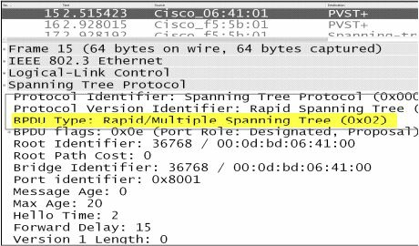

#第32天

**快速生成树协议**

**Rapid Spanning Tree Protocol**

#第32天任务

- 阅读今天的课文
- 复习昨天的课文
- 完成今天的实验
- 阅读ICND2记诵指南
- 在网站[http://subnetting.org/](subnetting.org)

IEEE 802.1D标准是在连通性从失去到恢复需要一分钟左右，就被认为性能已经可观的时期设计出来的。在IEEE 802.1D STP下，恢复大约需要50秒，这其中包括20秒的最大老化计时器（the Max Age timer）超时，以及额外的给端口从阻塞状态过渡到转发状态的30秒。

随着计算机技术的进化，网络变得更为重要，更为快速的网络收敛显然是人们所需要的。思科通过开发一些包括骨干快速（Backbone Fast）及上行快速（Uplink Fast）等专有的STP增强，来满足此需求。

今天你将学到以下知识。

- RSTP的需求, the need for RSTP
- 配置RSTP，RSTP configuration

本课对应了以下CCNA大纲要求。

+ 认识增强的交换技术，identify enhanced switching technologies
    - RSTP
    - PVSTP

## RSTP的需求

**the Need for RSTP**

随着技术的持续演化，以及在同一物理平台上路由及交换的融合，在诸如OSPF及EIGRP这样的可以在更短时间内提供出替代路径的路由协议面前，交换网络的延迟就变得明显起来。802.1W标准就被设计出来解决此问题。

IEEE 802.1W标准，或者是快速生成树协议（Rapid Spanning Tree Protocol, RSTP）, 显著地缩短了在某条链路失效时，STP用于收敛的时间。在RSTP下，网络从故障切换到一条替代路径或链路可在亚秒级别完成（with RSTP, network failover to an alternate path or link can occur in a subsecond timeframe）。RSTP是802.1D的一个扩展，执行与上行快速及骨干快速类似的功能。**RSTP比传统的STP执行得更好，且无需额外配置。此外，RSTP向后兼容最初的IEEE 802.1D STP标准。**其通过使用一种如下面的截屏中所示的修改的BPDU，实现的向后兼容。



*图 32.1 -- 修改的BPDU*

RSTP的各种端口状态可如下这样与STP端口状态对应起来。

- 关闭 -- 丢弃，Disabled -- Discarding
- 阻塞 -- 丢弃，Blocking -- Discarding
- 侦听 -- 丢弃，Listening -- Discarding
- 学习 -- 学习，Learning -- Learning
- 转发 -- 转发，Forwarding -- Forwarding

RSTP包含了以下的端口角色。

- 根端口（转发状态）, Root(Forwarding state)
- 指定端口（转发状态），Designated(Forwarding state)
- 可变端口（阻塞状态），Alternate(Blocking state)
- 备份端口（阻塞状态），Bakup(Blocking state)

对于考试，掌握上面这些着重号标记的内容是非常重要的，尤其是哪些端口状态转发流量（一旦网络完成收敛）。图32.2及32.3分别演示了一个RSTP可变端口及一个RSTP备份端口。


*图 32.2 -- RSTP可变端口*


*图 32.3 -- RSTP备份端口*

###带有PVST+的RSTP

**RSTP with PVST+**

加强版的基于各VLAN的生成树允许每个VLAN都有一个单独的STP实例（Per VLAN Spanning Tree Plus(PVST+) allows for an individual STP instance per VLAN）。传统或普通的PVST+模式在出现某条链路失效时，在网络收敛中，依赖较旧的802.1D STP的使用。

###RPVST+

快速的基于各VLAN的生成树加强版，允许与PVST+ 一起使用802.1W（Rapid Per VLAN Spanning Tree Plus(RPVST+) allows for the use of 802.1W with PVST+）。这就允许在每个VLAN都有一个单独的RSTP实例的同时，提供比起802.1D STP所能提供的更为快速的收敛。**默认情况下，在某台思科交换机上开启RSTP时，也就在该交换机上开启了R-PVST+。**

这里有一些可用来记住IEEE STP规格字母命名的记忆窍门。

- 802.1D（“经典的”生成树） -- It's dog-gone slow
- 802.1W(快速生成树) -- Imagine Elmer Fudd saying "rapid" as "wapid"
- 802.1S（多生成树） -- You add the letter "s" to nouns to make them plural(multiple) but this is a CCNP SWITCH subject

##RSTP的配置

**Configuring RSTP**

RSTP的配置只需一个命令！

```
Switch(config)#spanning-tree mode rapid-pvst
Switch#show spanning-tree summary
Switch is in rapid-pvst mode
Root bridge for: VLAN0050, VLAN0060, VLAN0070
```

##第32天问题

**Day 32 Questions**

1. RSTP is not backward compatible with the original IEEE 802.1D STP standard. True or false?
2. What are the RSTP port states?
3. What are the four RSTP port roles?
4. Which command enables RSTP?
5. By default, when RSTP is enabled on a Cisco switch, R-PVST+ is enabled on the switch. True or false?

##第32天问题答案

**Day 32 Answers**

1. False.
2. Discarding, Learning, and Forwarding.
3. Root, Designated, Alernate, and Backup.
4. The `spanning-tree mode rapid-pvst` command.
5. True.

##第32天实验

**Day 32 Lab**

###RSTP实验

**RSTP Lab**

**拓扑图**


**实验目的**

学习RSTP的配置命令。

**实验步骤**

1. 检查交换机上的生成树模式。

```
SwitchA#show spanning-tree summary
Switch is in pvst mode
Root bridge for: VLAN0002 VLAN0003
```

2. 将模式改为RSTP并再度检查。

```
SwitchA(config)#spanning-tree mode rapid-pvst
SwitchA#show spanning-tree summary
Switch is in rapid-pvst mode
Root bridge for: VLAN0002 VLAN0003
```

3. 用RSTP模式来重复第31天的实验。

4. 你可以预先预测出那些端口将是根/指定/阻塞端口吗（can you predict which ports will be Root/Designated/Blocking beforehand）？

