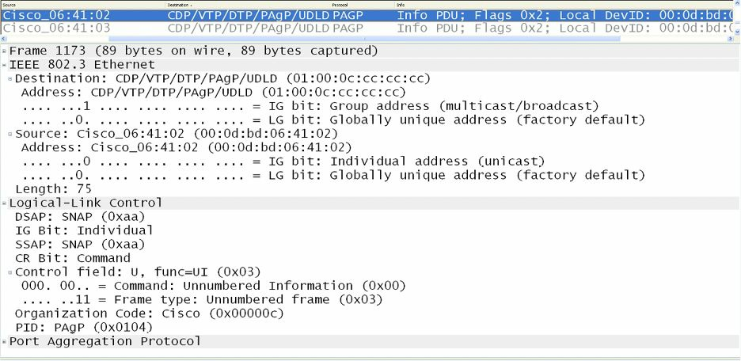

#第33天

**以太网通道及链路聚合协议**

**EtherChannels and Link Aggregation Protocols**

##第33天任务

- 阅读今天的课文
- 复习昨天的课文
- 完成今天的实验
- 阅读ICND2记诵指南
- 在网站[subnetting.org](http://subnetting.org/)上花15分钟

思科IOS软件允许管理员将交换机上的多条物理链路（multiple physical links），结合成为一条单一的逻辑链路。这样做提供了一种负载分配以及链路冗余的理想方案，且可同时为二层及三层子系统所使用（provides an ideal solution for load sharing, as well as link redundancy, and can be used by both Layer 2 and Layer 3 subsystems）。

今天将学习以下内容。

- 掌握各种以太网通道, Understanding EtherChannels
- 端口聚合协议概述，Port Aggregation Protocol(PAgP) overview
- PAgP的端口模式，PAgP port modes
- PAgP 以太网通道协议的数据包转发, PAgP EtherChannel Protocol packet forwarding
- 链路聚合控制协议概述，Link Aggregation Control Protocol(LACP) overview
- 各种LACP端口模式，LACP port modes
- 不同以太网通道负载分配方法，EtherChannel load-distribution methods
- 不同二层以太网通道的配置和验证，Configuring and verifying Layer 2 EtherChannels

本课对应了以下ICND2大纲要求。

- 不同以太网通道技术，EtherChannels

##掌握各种以太网通道

**Understanding EtherChannels**

以太网通道是由一些物理的、单独的FastEthernet、GigabitEthernet或Ten-GigabitEthernet(10Gbps)链路绑定在一起，所构成的一条单一逻辑链路（links that are bundled together into a single logical link），如下面的图33.1所示。由FastEthernet链路所构成的以太网通道叫做FastEtherChannel(FEC)；由GigabitEthernet链路所构成的通道被称为GigabitEtherChannel(GEC)；最后，由Ten-GigabitEthernet链路所构成的以太网通道则被称为是Ten-GigabitEtherChannel(10GEC)。


*图33.1 -- 以太网通道的物理和逻辑视图*

**每个以太网通道最多可由8个端口构成。**以太网通道中的物理链路**必须有着相似特性**(physical links in an EtherChannel must share similar characteristics)，诸如是定义在同一个VLAN中、或有着同样的速率以及双工设置。当在思科Catalyst交换机上配置以太网通道时，重要的是记住在不同Catalyst交换机型号之间，所支持的以太网通道数目会有所不同。

比如在Catalyst 3750系列交换机上，支持的数目是1到48个；在Catalyst 4500系列交换机上，是1到64个；而在旗舰的Catalyst 6500系列交换机，有效的以太网通道配置数目则是依据软件版本（the software release）。对早于12.1(3a）E3的版本，有效数值是1到256；对于12.1(3a）E3、12.1(3a）E4以及12.1(4)E1，有效数值是1到64。而对于12.1(5c)EX及以后的版本，支持最大64的数量，范围从1到256。

>**注意：**并不要求知道不同IOS版本中所支持的以太网通道数量。

用于自动创建一个以太网通道组（an EtherChannel group）的链路聚合协议有两个：**端口聚合协议**（Port Aggregation Protocol, PAgP）及**链路聚合控制协议**(Link Aggregation Control Protocol, LACP)。**PAgP是一个思科专有协议，同时LACP则是IEEE 802.3ad用于从几条物理链路建立逻辑链路规格的一部分。**本模块中将详细对这两个协议进行讲述。

##端口聚合协议概述

**Port Aggregation Protocol Overview**

端口聚合协议（Port Aggregation Protocol, PAgP）是一个实现以太网通道自动建立的思科专有链路聚合协议（a Cisco proprietary link aggregation protocol that enables the automatic creation of EtherChannels）。默认下，PAgP数据包在可作为以太网通道的端口之间发送（PAgP packets are sent between EtherChannel-capable ports），就以太网通道的形成进行协商。这些数据包被发送到目的多播MAC地址`01-00-0C-CC-CC-CC`(the destination Multicast MAC address `01-00-0C-CC-CC-CC`)，而该多播MAC地址也是CDP、UDLD、VTP以及DTP所用到同一多播地址。下图33.2显示了在线路上所见到的一个PAgP数据帧中所包含的字段。


*图 33.2 -- PAgP以太网头部*

尽管对PAgP数据包格式的深入探讨超出了CCNA考试要求范围，下图33.3还是对一个典型的PAgP数据包所包含的字段进行了展示。PAgP数据所包含的一些字段与CCNA考试有关，在本模块的跟进中将详细说明这些字段。


*图 33.3 -- 端口聚合协议数据帧*

##各种PAgP端口模式

**PAgP Port Modes**

PAgP支持不同端口模式，而这些端口模式则决定在两台支持PAgP的交换机(two PAgP-capable switches)之间将是否形成一个以太网通道。在深入到这两种PAgP端口模式之前，一种特别的模式需要专门关注。该模式（就是“on”模式）有时被误当作一种PAgP模式。事实上，其并不是一种PAgP的端口模式。

**该`on`模式强制将某个端口无条件地置于某个通道当中。**该通道将只在另一个交换机端口连接上、且被配置为`on`模式时建立起来。在此模式开启后，就不会有该通道的协商被本地以太网通道协议所执行。也就是说，这样做将切实关闭以太网通道协商并强制该端口到该通道（when this mode is enabled, there is no negotiation of the channel performed by the local EtherChannel protocol. In other words, this effectively disables EtherChannel negotiation and forces the port to the channel）。该模式的运作与中继链路上的`switchport nonegatiate`类似。**而重要的是记住配置为`on`模式的交换机接口不会对PAgP数据包进行交换。**

采用PAgP的交换机以太网通道可被配置为以这两种模式运行：**自动**（`auto`）或**我要**（`desirable`）。这两种PAgP模式的运作，在下面的小节进行说明。

###自动模式

**Auto Mode**

自动模式(`auto` mode)是一种仅在该端口接收到一个PAgP数据包时，才与另一PAgP端口进行协商的PAgP端口模式。在此模式开启后，该（这些）端口绝不会发起PAgP通信，而会在与邻居交换机建立一个以太网通道之前，被动地侦听任何接收到的PAgP数据包（when this mode is enabled, the port(s) will never initiate PAgP communications but will instead listen passively for any received PAgP packets before creating an EtherChannel with the neighbouring switch）。

###我要模式

**Desirable Mode**

我要模式（`desirable` mode）是一种导致某端口发起与另一PAgP端口就通道建立而进行PAgP协商的PAgP端口模式（desirable mode is a PAgP mode that causes the port to initiate PAgP negotiation for a channel with another PAgP port）。也就是说，在此模式下，该端口主动尝试与运行了PAgP的另一交换机建立一个以太网通道。

总的来说，要记住配置成`on`模式的交换机接口，不交换PAgP数据包，**但它们会与那些配置为`auto`或`desirable`模式的伙伴接口进行PAgP数据包的交换**（but they do exchange PAgP packets with partner interfaces configured in the auto or desirable modes）。表33.1展示了不同的PAgP组合及其在建立一个以太网通道时所使用的结果。

*表 33.1 -- 采用不同PAgP模式的以太网通道形成*

<table>
<tr><th>交换机一PAgP模式</th><th>交换机二PAgP模式</th><th>以太网通道结果</th></tr>
<tr><td>Auto</td><td>Auto</td><td>不会形成以太网通道</td></tr>
<tr><td>Auto</td><td>Desirable</td><td>形成以太网通道</td></tr>
<tr><td>Desirable</td><td>Auto</td><td>形成以太网通道</td></tr>
<tr><td>Desirable</td><td>Desirable</td><td>形成以太网通道</td></tr>
</table>

##PAgP以太网通道协议数据包的转发

**PAgP EtherChannel Protocol Packet Forwarding**

尽管PAgP允许以太网通道中的所有链路用于转发和接收用户流量，但应熟知一些关于在转发来自其它协议的流量时的限制。**DTP及CDP透过以太网通道中的所有物理接口发送和接收（协议）数据包。而PAgP仅在那些起来（`up`）并开启了`auto`或`desirable`模式的接口上发送并接收PAgP协议数据单元**（while PAgP allows for all links within the EtherChannel to be used to forward and receive user traffic, there are some restrictions that you should be familiar with regarding the forwarding of traffic from other protocols. DTP and CDP send and receive packets over all the physical interfaces in the EtherChannel. PAgP sends and receives PAgP Protocol Data Units only from interfaces that are up and have PAgP enabled for auto or desirable modes）。

在以太网通道捆绑（an EtherChannel bundle）被配置成一个中继端口时，该中继就在编号最低的VLAN上发送和接收PAgP数据帧。**生成树协议总是选择以太网通道捆绑中的第一个可运作端口**（when an EtherChannel bundle is configured as a trunk port, the trunk sends and receives PAgP frames on the lowest numbered VLAN. Spanning Tree Protocol(STP) always chooses the first operational port in an EtherChannel bundle）。命令`show pagp [channel number] neighbor`同样可用于验证将会用于STP数据包发送和接收的端口，确定出以太网通道捆绑中STP将使用的端口，如下面的输出所示。

```
Switch-1#show pagp neighbor
Flags:  S - Device is sending Slow hello.   C - Device is in Consistent state.
        A - Device is in Auto mode.         P - Device learns on physical port.
Channel group 1 neighbors
        Partner     Partner         Partner         Partner Group
Port    Name        Device ID       Port    Age     Flags   Cap.
Fa0/1   Switch-2    0014.a9e5.d640  Fa0/1   2s      SC      10001
Fa0/2   Switch-2    0014.a9e5.d640  Fa0/2   1s      SC      10001
Fa0/3   Switch-2    0014.a9e5.d640  Fa0/3   15s     SC      10001
```

根据上面的输出，STP将在端口`FastEthernet0/1`上发出其协议数据包，因为该端口是第一个可运作接口。而如那个端口失效，STP将在`FastEthernet0/2`上发出其协议数据包。而由PAgP所使用的默认端口则可由`show EtherChannel summary`命令进行查看，如下面的输出所示。

```
Switch-1#show EtherChannel summary
Flags:  D - down
        I - stand-alone
        H - Hot-standby (LACP only)
        R - Layer3
        u - unsuitable for bundling
        U - in use
        d - default port
        P - in port-channel
        s - suspended
        S - Layer2
        f - failed to allocate aggregator
Number of channel-groups in use: 1
Number of aggregators: 1
Group  Port-channel  Protocol    Ports
------+-------------+-----------+--------------------------------
1      Po1(SU)       PAgP        Fa0/1(Pd)  Fa0/2(P)    Fa0/3(P)
```

当在以太网通道上配置诸如`Loop Guard`这样的附加STP特性时，非常重要的是记住就算该通道捆绑中的其它端口是可运作的，**在`Loop Guard`阻塞以太网通道捆绑的第一个端口时，就不会有BPDUs通过该通道得以发送了**。这是因为PAgP将强制令到作为以太网通道端口组中的所有端口在`Loop Guard`配置上一致（when configuring additional STP features such as Loop Guard on an EtherChannel, it is very important to remember that if Loop Guard blocks the first port, no BPDUs will be sent over the channel, even if other ports in the channel bundle are operational. This is because PAgP will enforce uniform Loop Guard configuration on all of the ports that are part of the EtherChannel group）。

> **真实场景应用**

> **Real-World Implementation**

> 在生产网络中，可能会用到思科虚拟交换系统（the Cisco Virtual Switching System, VSS），该系统是由两台物理Catalyst 6500系列交换机所构成的一台单一逻辑交换机。在VSS中，一台交换机被选为活动交换机（the active switch），同时另一交换机就被选为了备用交换机（the standby switch）。这两台交换机就是通过以太网通道连接在一起，从而允许它们之间控制数据包的发送和接收。

> 接入交换机通过采用多机以太网通道（Multichassis EtherChannel, MEC）与VSS连接起来。而一个MEC就是一个对两台物理的Catalyst 6500交换机进行跨越而端接至一台逻辑虚拟交换机系统的以太网通道。增强的端口聚合协议（Enhanced PAgP, PAgP+）可用于允许Catalyst 6500交换机在其相互之间的以太网通道失效，导致两台交换机都假定其自身是活动角色（双活动）， 从而切实影响到交换网络中流量转发时，经由MEC进行通信（an MEC is simply an EtherChannel that spans the two physical Catalyst 6500 switches but terminates to the single logical VSS. Enhanced PAgP(PAgP+) can be used to allow the Catalyst 6500 switches to communicate via the MEC in the event that the EtherChannel between them fails, which would result in both switches assuming the active role(dual active), effectively affecting forwarding of traffic within the switched network）。这在下面的图表中进行了演示。


尽管VSS超出了CCNA考试要求范围，了解**只有PAgP才能用于承载VSS控制数据包**是有益处的。因此，如要在一个VSS环境，或者要在一个最终会部署上VSS的环境中部署一些以太网通道，就会打算考虑运行PAgP而不是LACP，因为LACP是一个开放标准，不支持专有的VSS数据帧。本书中不会更为深入地涉及VSS。

##链路聚合控制协议概述

**Link Aggregation Control Protocol Overview**

链路聚合控制协议（Link Aggregation Control Protocol, LACP）是IEEE 802.3ad规格的组成部分，用于从多条物理链路建立起一条逻辑链路。因为LACP与PAgP是不兼容的，所以链路的两端需要运行LACP以令到以太网通道组自动形成（Because LACP and PAgP are incompatible, both ends of the link need to run LACP in order to automate the formation of EtherChannel groups）。

与PAgP的情形一样，**在配置LACP以太网通道时，所有LAN端口都必须是同样速率，且都必须被配置成二层或三层LAN端口。**而当某端口通道中的一条链路失效时，那么先前由该链路所承载的流量就由该端口通道中剩下的链路进行交换。此外，在对某个端口通道中的活动绑定端口的编号进行修改后，流量模式将反应出该端口通道重新平衡之后的状态。

LACP通过在端口之间交换LACP数据包，实现对端口通道自动创建的支持。其对端口组别具备的各项能力进行动态学习，并通知给其它端口。而一旦LACP正确地识别出这些匹配的以太网链路，其就推进将这些链路编组为一个GigabitEthernet端口通道。与PAgP要求端口有着相同速率及双工设置不同，**LACP要求端口只能是全双工，因为半双工是不支持的**。某个LACP以太网通道中的那些半双工端口，被置为暂停状态（Half-duplex ports in an LACP EtherChannel are placed into the suspended state）。

默认情况下，一条链路上的所有入口广播及多播数据包在该端口通道的其它链路上的返回都被阻止（by default, all inbound Broadcast and Multicast packets on one link in a port channel are blocked from returning on any other link of the port channel）。LACP数据包被发送到IEEE 802.3慢速协议多播组地址（the IEEE 802.3 Slow Protocols Multicast group address）`01-80-C2-00-00-02`。LACP数据帧以EtherType数值0x8809进行编码。下图33.4演示了一个以太网数据帧中的这些字段。


*图 33.4 -- IEEE 802.3 LACP数据帧*

##LACP的端口模式

**LACP Port Modes**

LACP通过在端口之间交换LACP数据包，实现对端口通道自动建立的支持。而LACP又是通过动态地掌握端口组的各项能力并将其通告给其它端口完成的端口间数据交换。一旦LACP正确地识别出那些匹配的以太网链路，就推进这些链路编组为一个端口通道。而一旦LACP模式得以配置，其仅会在某单个接口被分配到指定通道组时被改变。LACP支持两种模式，**主动**（`acitve`）及**被动**（`passive`）模式。后续小节将对这两种模式的运作进行说明。

###LACP主动模式

**LACP Active Mode**

LACP主动模式将一个交换机端口置为经由发送LACP数据包，对远端端口发起协商的主动协商状态（an active negotiating state in which the switch port initiates negotiations with remote ports by sending LACP packets）。主动模式与PAgP的`desirable`模式等价。也就是说，在此模式下，交换机端口主动尝试与另一台同样运行LACP的交换机建立以太网通道。

###LACP被动模式

**LACP Passive Mode**

当交换机端口被配置为被动模式时，其只在接收到其它LACP数据包时，才就建立LACP通道进行协商。在被动模式下，该端口对其所接收到的LACP数据包进行响应，而并不发起LACP数据包协商。该设置减少了LACP数据包传输。在此模式下，该端口通道组将该接口附加到以太网通道捆绑。此模式与PAgP所用到的`auto`模式类似。

重要的是记住**主动和被动模式只在非PAgP接口上是有效的**（the active and passive modes are valid on non-PAgP interfaces only）。但是，如有着一个PAgP以太网通道，并打算将其转换到LACP，那么**思科IOS软件允许随时对协议进行改变**。而其间唯一的限制，就是此**改变导致全部现有以太网通道重置为新协议的默认通道模式**。下表33.2展示了不同的LACP组合及它们在两台交换机之间建立一个以太网通道中应用的结果。

*表 33.2 -- 使用不同LACP模式的以太网通道形成*

*Table 33.2 -- EtherChannel Formation Using Different LACP Modes*

<table>
<tr><th>交换机一的LACP模式</th><th>交换机二的LACP模式</th><th>以太网通道结果</th></tr>
<tr><td>被动模式</td><td>被动模式</td><td>没有以太网通道形成</td></tr>
<tr><td>被动模式</td><td>主动模式</td><td>形成以太网通道</td></tr>
<tr><td>主动模式</td><td>主动模式</td><td>形成以太网通道</td></tr>
<tr><td>主动模式</td><td>被动模式</td><td>形成以太网通道</td></tr>
</table>

##以太网通道的负载分配方式

**EtherChannel Load-Distribution Methods**

对于PAgP及LACP以太网通道，Catalyst交换机使用到一种利用数据包头部的一些关键字段，生成一个随后匹配到以太网通道组中的某条物理链路的散列值的多态算法。也就是说，交换机通过将由帧中的地址所形成的二进制模式，减少到从以太网通道中多条链路选出一条的一个数值，从而实现流量负载在这些链路上的分配（a polymorphic algorithm that utilises key fields from the header of the packet to generate a hash， which is then matched to a physical link in an EtherChannel group. In other words, the switch distributes the traffic load across the links in an EtherChannel by reducing part of the binary pattern formed from the addresses in the frame to a numerical value that selects one of the links in the EtherChannel）。

此操作可在MAC地址或IP地址上完成，并可仅基于源或目的地址，或同时基于源或目的地址。尽管对以太网通道负载分配中所用到的该散列值的实际计算的深入探讨，是超出CCNA考试要求范围的，但知道管理员可以指定头部中的哪些字段，作为确定某个数据包的传输物理链路所用到的算法的输入，是重要的（while delving into detail on the actual computation of the hash used in EtherChannel load distribution is beyond the scope of the CCNA exam requirements, it is important to know that the adminitrator can define which fields in the header can be used as input to the algorithm used to determine the physical link transport to the packet）。

负载分配方式通过全局配置命令`port-channel load-balance [method]`进行配置。在任何时间，都只能使用一种单一方式。下表33.3列出并解释了在配置以太网通道负载分配时，思科IOS Catalyst交换机中可用的不同方式。

*表 33.3 -- 以太网通道负载分配（负载均衡）的可选项*

*Table 33.3 -- EtherChannel Load-Distribution(Load-Balancing) Options*

<table>
<tr><th>方式</th><th>说明</th></tr>
<tr><td>dst-ip</td><td>进行基于目的IP地址的负载分配，performs load distribution based on the destination IP address</td></tr>
<tr><td>dst-mac</td><td>进行基于目的MAC地址的负载分配，performs load distribution based on the destination MAC address</td></tr>
<tr><td>dst-port</td><td>进行基于基于目的第4层端口的负载分配，performs load distribution based on the destination Layer 4 port</td></tr>
<tr><td>src-dst-ip</td><td>进行基于源和目的IP地址的负载分配，performs load distribution based on the source and destination IP address</td></tr>
<tr><td>src-dst-port</td><td>进行基于源和目的第4层端口的负载分配，performs load distribution based on the source and destination Layer 4 port</td></tr>
<tr><td>src-ip</td><td>进行基于源IP地址的负载分配，performs load distribution based on the source IP address</td></tr>
<tr><td>src-mac</td><td>进行基于源MAC地址的负载分配, performs load distribution based on the source MAC address</td></tr>
<tr><td>src-port</td><td>进行基于源第4层端口的负载分配，performs load distribution based on the source Layer 4 port</td></tr>
</table>

##以太网通道配置准则

**EtherChannel Configuration Guidelines**

以下小节列出并说明了配置二层PAgP以太网通道所需要的步骤。但在深入到这些配置步骤之前，有必要熟悉下面这些配置二层以太网通道时的限制。

- 每个以太网通道可以有最多8个兼容配置的以太网接口。而LACP则允许一个以太网通道组中多于8个的端口。不过这些额外端口都是热备份（hot-standby）端口。
- 以太网通道中的所有接口都必须以相同的速率及双工模式运行。记住，与PAgP不同，LACP并不支持半双工端口。
- 确保以太网通道中的所有接口都是开启的。在某些情况下，如这些接口没有开启，那么该逻辑端口通道接口（the logical port channel interface）就不会被自动创建。
- 在初次配置一个以太网通道组时，重要的是记住这些端口与所加入的第一个组端口参数集一致（when first configuring an EtherChannel group, it is important to remember that ports follow the parameters set for the first group port added）。
- 如有为某个以太网通道中的某个成员端口配置交换机端口分析器（Switch Port Analyzer, SPAN）, 那么该端口将会从该以太网通道组中移除。
- 将以太网通道中的所有端口都指派到同一个VLAN，或将它们配置成中继端口，是必要的。而如果这些参数不同，该通道就不会形成。
- 记住有着不同STP路径开销（由某位管理员所修改的）的那些类似接口，仍可用于组成一个以太网通道。
- 在开始通道配置之前，建议首先关闭所有成员接口（it is recommended to shut down all member interfaces prior to beginning channelling configuration）。

###配置并验证二层以太网通道

**Configuring and Verifying Layer 2 EtherChannels**

该部分内容通过无条件地强制所选接口建立一个以太网通道，对二层以太网通道的配置进行了说明（this section describes the configuration of Layer 2 EtherChannels by unconditionally forcing the selected interfaces to establish an EtherChannel）。

1. 第一个配置步骤是通过全局配置命令`interface [name]`或`interface range [range]`，进入那些所需要的以太网通道接口的接口配置模式；
2. 配置的第二步是通过接口配置命令`switchport`，将这些接口配置为二层交换机接口；
3. 第三个配置步骤是通过接口配置命令`switchport mode [access|trunk]`，将这些交换机端口配置为中继或接入链路；
4. 作为可选步骤，如该接口或这些接口已被配置为接入端口，就要使用命令`switchport access vlan [number]`，将其指派到同样的VLAN中。而如该接口或这些接口已被配置为中继端口，就要通过执行接口配置命令`switchport trunk allowed vlan [range]`，选择允许通过该中继的那些VLANs；而如VLAN 1将不作为原生VLAN（802.1Q的），就要通过执行接口配置命令`switchport trunk native vlan [number]`, 输入原生VLAN。此项配置在所有端口通道成员接口上必须一致。
5. 下一配置步骤就是通过接口配置命令`channel-group [number] mode on`, 将这些接口配置为无条件中继(the next configuration step is to configure the interfaces to unconditionally trunk via the `channel-group [number] mode on` interface configration command)。

用到上述步骤的无条件以太网通道配置，将基于下图33.5中所演示的网络拓扑。


*图 33.5 -- 以太网通道配置输出示例的网络拓扑*

下面的输出演示了如何在Switch 1及Switch 2上，基于图33.5中所描述的网络拓扑，配置无条件通道操作。该以太网通道将配置成一个使用默认参数的二层802.1Q中继。

```
Switch-1#conf t
Enter configuration commands, one per line. End with CNTL/Z.
Switch-1(config)#interface range fa0/1 – 3
Switch-1(config-if-range)#no shutdown
Switch-1(config-if-range)#switchport
Switch-1(config-if-range)#switchport trunk encapsulation dot1q
Switch-1(config-if-range)#switchport mode trunk
Switch-1(config-if-range)#channel-group 1 mode on
Creating a port-channel interface Port-channel 1
Switch-1(config-if-range)#exit
Switch-1(config)#exit
```

>**注意：**注意到该交换机自动默认创建出`interface port-channel 1`（根据下面的输出）。**没有要配置该接口的显式用户配置**（notice that the switch automatically creates `interface port-channel 1` by default(refer to the output below). No explicit user configurtion is required to configure this interface）。

```
Switch-2#conf t
Enter configuration commands, one per line. End with CNTL/Z.
Switch-2(config)#interface range fa0/1 - 3
Switch-2(config-if-range)#switchport
Switch-2(config-if-range)#switchport trunk encapsulation dot1q
Switch-2(config-if-range)#switchport mode trunk
Switch-2(config-if-range)#channel-group 1 mode on
Creating a port-channel interface Port-channel 1
Switch-2(config-if-range)#exit
Switch-2(config)#exit
```

命令`show EtherChannel [options]`此时即可用于验证该以太网通道的配置。下面的输出中打印了可用选项（依据不同平台会有不同）。

```
Switch-2#show EtherChannel ?
    <1-6>           Channel group number
    detail          Detail information
    load-balance    Load-balance/frame-distribution scheme among ports in port-channel
    port            Port information
    port-channel    Port-channel information
    protocol        protocol enabled
    summary         One-line summary per channel-group
    |               Output modifiers
    <cr>
```

下面的输出对命令`show EtherChannel summary`进行了演示。

```
Switch-2#show EtherChannel summary
Flags:  D - down
        I - stand-alone
        H - Hot-standby (LACP only)
        R - Layer3
        u - unsuitable for bundling
        U - in use
        d - default port
        P - in port-channel
        s - suspended
        S - Layer2
        f - failed to allocate aggregator
Number of channel-groups in use: 1
Number of aggregators: 1
Group  Port-channel  Protocol    Ports
------+-------------+-----------+--------------------------------
1      Po1(SU)          -        Fa0/1(Pd)  Fa0/2(P)    Fa0/3(P)
```

在上面的输出中，可以看到在通道组1（Channel Group 1）中有三条链路。接口FastEthernet0/1是默认端口；**该端口将用于发送比如的STP数据包**。如果该端口失效，FastEthernet0/2就将被指定为默认端口，如此延续（this port will be used to send STP pakcets, for example. If this port fails, FastEthernet0/2 will be designated as the default port, and so forth）。同时通过看看`Po1`后面的`SU`标志，还可以看到该端口组是一个活动的二层以太网通道。下面的输出现实了由`show EtherChannel detail`命令所打印出的信息。

```
Switch-2#show EtherChannel detail
                Channel-group listing:
                ----------------------
Group: 1
----------
Group state = L2
Ports: 3    Maxports = 8
Port-channels: 1 Max Port-channels = 1
Protocol:    -
                Ports in the group:
                -------------------
Port: Fa0/1
------------
Port state      = Up Mstr In-Bndl
Channel group   = 1           Mode  = On/FEC           Gcchange = -
Port-channel    = Po1         GC    = -     Pseudo port-channel = Pol
Port index      = 0           Load  = 0x00             Protocol = -
Age of the port in the current state: 0d:00h:20m:20s
Port: Fa0/2
------------
Port state      = Up Mstr In-Bndl
Channel group   = 1           Mode  = On/FEC           Gcchange = -
Port-channel    = Po1         GC    = -     Pseudo port-channel = Pol
Port index      = 0           Load  = 0x00             Protocol = -
Age of the port in the current state: 0d:00h:21m:20s
Port: Fa0/3
------------
Port state      = Up Mstr In-Bndl
Channel group   = 1           Mode  = On/FEC           Gcchange = -
Port-channel    = Po1         GC    = -     Pseudo port-channel = Pol
Port index      = 0           Load  = 0x00             Protocol = -
Age of the port in the current state: 0d:00h:21m:20s
                Port-channels in the group:
                ---------------------------
Port-channel: Po1
------------
Age of the Port-channel     = 0d:00h:26m:23s
Logical slot/port   = 1/0               Number of ports = 3
GC                  = 0x00000000        HotStandBy port = null
Port state          = Port-channel Ag-Inuse
Protocol            = -
Ports in the Port-channel:
Index   Load   Port     EC state        No of bits
------+------+------+------------------+-----------
0       00     Fa0/1    On/FEC          0
0       00     Fa0/2    On/FEC          0
0       00     Fa0/3    On/FEC          0
Time since last port bundled:   0d:00h:21m:20s     Fa0/3
```

在上面的输出中，可以看出这是一个带有通道组中最多8个可能端口中的三个的二层以太网通道。还可以看出，以太网通道模式是`on`, 这是基于由一条短横线所表示的协议字段看出的。此外，同样可以看出这是一个FastEtherChannel(FEC)（in the output above, you can see that this is a Layer 2 EtherChannel with three out of a maximum of eight possible ports in the channel group. You can also see that the EtherChannel mode is on, based on the protocol being denoted by a hash(-). In addition, you can also see that this is a FastEtherChannel(FEC)）。

最后，还可以通过执行命令`show interface port-channel [number] switchport`，对该逻辑的port-channel接口的二层运行状态进行检查。这在下面的输出中进行了演示。
在上面的输出中，可以看到这是一个带有通道组中最多8个中的3个端口的二层以太网通道。还可以从由短横所表示的协议，看出以太网通道模式是`on`。此外，还可以看到这是一个FastEtherChannel(FEC)。

最后，还可通过执行命令`show interfaces port-channel [number] switchport`, 对该逻辑的端口通道接口（the logical port-channel interface）的二层运作状态进行查看。这在下面的输出中有所演示。

```
Switch-2#show interfaces port-channel 1 switchport
Name: Po1
Switchport: Enabled
Administrative Mode: trunk
Operational Mode: trunk
Administrative Trunking Encapsulation: dot1q
Operational Trunking Encapsulation: dot1q
Negotiation of Trunking: On
Access Mode VLAN: 1 (default)
Trunking Native Mode VLAN: 1 (default)
Voice VLAN: none
Administrative private-vlan host-association: none
Administrative private-vlan mapping: none
Administrative private-vlan trunk native VLAN: none
Administrative private-vlan trunk encapsulation: dot1q
Administrative private-vlan trunk normal VLANs: none
Administrative private-vlan trunk private VLANs: none
Operational private-vlan: none
Trunking VLANs Enabled: ALL
Pruning VLANs Enabled: 2-1001
Protected: false
Appliance trust: none
```

###配置并验证PAgP以太网通道

**Configuring and Verifying PAgP EtherChannels**

此部分对PAgP二层以太网通道的配置进行了说明。为配置并建立一个PAgP以太网通道，需要执行以下步骤。

1. 第一个配置步骤是通过全局配置命令`interface [name]`或`interface range [range]`，进入到所需的这些以太网接口的接口配置模式；
2. 配置的第二步，是通过接口配置命令`switchport`, 将这些接口配置为二层交换端口；
3. 第三个配置步骤，是通过接口配置命令`switchport mode [access|trunk]`，将这些交换端口，配置为中继或接入链路；
4. 作为可选步骤，如果已将这些端口配置为接入端口，那么就要使用命令`switchport access vlan [number]`, 将其指派到同一个VLAN中；而如果这些接口已被配置为中继端口，那么就要通过执行接口配置命令`switchport trunk allowed vlan [range]`，来选择所允许通过该中继的那些VLANs；如未打算将VLAN 1用作原生VLAN（对于802.1Q），就要通过执行接口配置命令`switchport trunk native vlan [number]`，输入原生VLAN。此项配置在所有端口通道的成员接口上一致。
5. 作为可选项，通过执行接口配置命令`channel-protocol pagp`，将PAgP配置作为以太网通道协议（the EtherChannel protocol）。因为以太网通道默认是PAgP的，所以此命令被认为是可选的而无需输入。但执行该命令被看作是良好实践，因为可以令到配置绝对确定（it is considered good practice to issue this command just to be absolutely sure of your configuration）。
6. 下一步就是通过接口配置命令`channel-group [number] mode`，将这些接口配置为无条件中继。

下面的输出演示了如何在基于上面的图33.5中所给出的网络拓扑的Switch 1和Switch 2上，配置PAgP的通道（PAgP channelling）。该以太网通道将被配置为使用默认参数的二层802.1Q中继。

```
Switch-1#conf t
Enter configuration commands, one per line. End with CNTL/Z.
Switch-1(config)#interface range fa0/1 - 3
Switch-1(config-if-range)#switchport
Switch-1(config-if-range)#switchport trunk encap dot1q
Switch-1(config-if-range)#switchport mode trunk
Switch-1(config-if-range)#channel-group 1 mode desirable
Creating a port-channel interface Port-channel 1
Switch-1(config-if-range)#exit
```

>**注意：**在上面的输出中，选择了端口通道的`desirable`模式。可以在此命令（`channel-group 1 mode desirable`）之后加上一个额外关键字`[non-silent]`。这是因为，默认情况下，PAgP的`auto`模式默认是安静模式。当交换机被连接到一台不兼容PAgP的设备时，就用到安静模式，且绝不会传送数据包(an additional keyword, `[non-silent]`, may also be appended to the end of this command. This is because, by default, PAgP auto and desirable modes default to a silent mode. The silent mode is used when the switch is connected to a device that is not PAgP-capable and that seldom, if ever transmits packets)。一台安静相邻设备的例子（an example of a silent partner），就是一台文件服务器或未有生成流量的数据包分析器。而如果一台设备不会发出PAgP数据包（比如处于`auto`模式），也用到安静模式。

在此示例中，在一个连接到一台安静相邻设备的物理端口上运行PAgP阻止了那个交换机端口成为运作端口；但是，该安静设置允许PAgP运行，从而将该接口加入到一个通道组，同时利用该接口进行传输。在本例中，因为Switch 2将被配置为`auto`模式（被动模式）, 该端口采用默认的安静模式运作，就是首先的了（In this case, running PAgP on a physical port connected to a silent partner prevents that switch port from ever becoming operational; however, the silent setting allows PAgP to operate, to attatch the interface to a channel group, and to use the interface for transmission. In this example, because Switch 2 will be configured for auto mode(passive mode), it is preferred that the port uses the default silent mode operation）。这在下面的PAgP以太网通道配置中进行了演示。

```
Switch-1#conf t
Enter configuration commands, one per line. End with CNTL/Z.
Switch-1(config)#interface range fa0/1 - 3
Switch-1(config-if-range)#switchport
Switch-1(config-if-range)#switchport trunk encap dot1q
Switch-1(config-if-range)#switchport mode trunk
Switch-1(config-if-range)#channel-group 1 mode desirable ?
    non-silent  Start negotiation only after data packets received
    <cr>
Switch-1(config-if-range)#channel-group 1 mode desirable non-silent
Creating a port-channel interface Port-channel 1
Switch-1(config-if-range)#exit
```

继续进行PAgP以太网通道的配置，则Switch 2被配置为以下这样。

```
Switch-2#conf t
Enter configuration commands, one per line. End with CNTL/Z.
Switch-2(config)#int range fa0/1 - 3
Switch-2(config-if-range)#switchport
Switch-2(config-if-range)#switchport trunk encapsulation dot1q
Switch-2(config-if-range)#switchport mode trunk
Switch-2(config-if-range)#channel-group 1 mode auto
Creating a port-channel interface Port-channel 1
Switch-2(config-if-range)#exit
```

以下输出演示了怎样通过在Switch 1及Switch 2上使用命令`show EtherChannel summary`，验证该PAgP以太网通道的配置。

```
Switch-1#show EtherChannel summary
Flags:  D - down
        I - stand-alone
        H - Hot-standby (LACP only)
        R - Layer3
        u - unsuitable for bundling
        U - in use
        d - default port
        P - in port-channel
        s - suspended
        S - Layer2f - failed to allocate aggregator
Number of channel-groups in use:    1
Number of aggregators:              1
Group  Port-channel  Protocol    Ports
------+-------------+-----------+--------------------------------
1      Po1(SU)         PAgP      Fa0/1(Pd)  Fa0/2(P)    Fa0/3(P)
```

还可以通过执行命令`show pagp [options]`, 查看到PAgP以太网通道的配置及统计数据。下面的输出，演示了此命令下可用的选项。

```
Switch-1#show pagp ?
  <1-6>     Channel group number
  counters  Traffic information
  internal  Internal information
  neighbor  Neighbor information
```

>**注意：**对需要的端口通道编号的进入，提供上面所打印出的后三个选项。这在下面的输出中进行了演示。

```
Switch-1#show pagp 1 ?
  counters  Traffic information
  internal  Internal information
  neighbor  Neighbor information
```

关键字`[counters]`提供了有关PAgP发出及接收到的数据包的信息。关键字`[internal]`提供了诸如端口状态、Hello间隔时间、PAgP端口优先级以及端口学习方式等的信息。下面的输出对命令`show pagp internal`的使用进行了演示。

```
Switch-1#show pagp 1 internal
Flags:  S - Device is sending Slow hello.   C - Device is in Consistent state.
        A - Device is in Auto mode.         d - PAgP is down.
Timers: H - Hello timer is running.         Q - Quit timer is running.
        S - Switching timer is running.     I - Interface timer is running.
Channel group 1
                                Hello       Partner PAgP     Learning   Group
Port    Flags   State   Timers  Interval    Count   Priority Method     Ifindex
Fa0/1   SC      U6/S7   H       30s         1       128      Any        29
Fa0/2   SC      U6/S7   H       30s         1       128      Any        29
Fa0/3   SC      U6/S7   H       30s         1       128      Any        29
```

关键字`[neighbor]`打印出邻居名称、PAgP邻居的ID、邻居设备ID（MAC）以及邻居端口。同时在比如邻居是一台物理学习设备时（a physical learner）,这些标志同样表明了邻居运行的模式。下面的输出对命令`show pagp neighbor`的使用，进行了演示。

```
Switch-1#show pagp 1 neighbor
Flags:  S - Device is sending Slow hello.   C - Device is in Consistent state.
        A - Device is in Auto mode.         P - Device learns on physical port.
Channel group 1 neighbors
        Partner     Partner         Partner     Partner Group
Port    Name        Device ID       Port    Age Flags   Cap.
Fa0/1   Switch-2    0014.a9e5.d640  Fa0/1   19s SAC     10001
Fa0/2   Switch-2    0014.a9e5.d640  Fa0/2   24s SAC     10001
Fa0/3   Switch-2    0014.a9e5.d640  Fa0/3   18s SAC     10001
```

###配置并验证LACP以太网通道

**Configuring and Verifying LACP EtherChannels**

此部分对LACP的二层以太网通道的配置进行了讲述。为配置并建立一个LACP以太网通道，需要执行下面这些步骤。

1. 第一个配置步骤是通过全局配置命令`interface [name]`或`interface range [range]`, 进入到所需要的以太网通道接口的接口配置模式；
2. 第二个配置步骤时通过接口配置命令`switchport`，将这些接口配置为二层交换端口；
3. 第三个配置步骤，时通过接口配置命令`switchport mode [access|trunk]`，将这些交换端口配置为中继或接入链路；
4. 作为可选步骤，如该接口或这些接口已被配置为接入端口，就要使用命令`switchport access vlan [number]`将其指派到同样的VLAN中。而如该接口或这些接口已被配置为中继端口，就要通过执行接口配置命令`switchport trunk allowed vlan [range]`, 选择允许通过该中继的VLANs; 而如将不使用VLAN 1作为原生VLAN（802.1Q的），就要通过执行接口配置命令`switchport trunk native vlan [number]`，输入该原生VLAN。此项配置在所有的端口通道成员接口上一致；
5. 通过执行接口配置命令`channel-protocol lacp`, 将LACP配置作为以太网通道协议。因为以太网通道协议默认时PAgP，该命令被认为时LACP所强制的，同时也是所要求输入的（because EtherChannels default to PAgP, this command is considered mandatory for LACP and is required）；
6. 下一配置步骤时通过接口配置命令`channel-group [number] mode`，将这些接口配置为无条件中继（the next configuration step is to configure the interfaces to unconditionally trunk via the `channel-group [number] mode` interface configuration command）。

下面的输出对在Switch 1和Switch 2上如何配置基于图33.5中所给出的网络拓扑的LACP通道，进行了演示，该以太网通道将被配置为一个使用默认参数的二层802.1Q中继，如下面的输出所示。

```
Switch-1#conf t
Enter configuration commands, one per line. End with CNTL/Z.
Switch-1(config)#int range FastEthernet0/1 - 3
Switch-1(config-if-range)#switchport
Switch-1(config-if-range)#switchport trunk encapsulation dot1q
Switch-1(config-if-range)#switchport mode trunk
Switch-1(config-if-range)#channel-protocol lacp
Switch-1(config-if-range)#channel-group 1 mode active
Creating a port-channel interface Port-channel 1
Switch-1(config-if-range)#exit
Switch-2#conf t
Enter configuration commands, one per line. End with CNTL/Z.
Switch-2(config)#interface range FastEthernet0/1 - 3
Switch-2(config-if-range)#switchport
Switch-2(config-if-range)#switchport trunk encapsulation dot1q
Switch-2(config-if-range)#switchport mode trunk
Switch-2(config-if-range)#channel-protocol lacp
Switch-2(config-if-range)#channel-group 1 mode passive
Creating a port-channel interface Port-channel 1
Switch-2(config-if-range)#exit
```

下面的输出演示了如何通过在Switch 1及Switch 2上执行`show EtherChannel summary`命令，来对该LACP以太网通道配置进行验证。

```
Switch-1#show EtherChannel summary
Flags:  D - down
        I - stand-alone
        H - Hot-standby (LACP only)
        R - Layer3
        u - unsuitable for bundling
        U - in use
        d - default port
        P - in port-channel
        s - suspended
        S - Layer2
        f - failed to allocate aggregator
Number of channel-groups in use: 1
Number of aggregators: 1
Group  Port-channel  Protocol    Ports
------+-------------+-----------+--------------------------------
1      Po1(SU)       LACP        Fa0/1(Pd)  Fa0/2(P)    Fa0/3(P)
```

默认LACP允许最多16个端口进入到一个端口通道组中（by default, LACP allows up to 16 ports to be entered into a port channel group）。前8个运作接口将为LACP所使用，而剩下的8个接口将被置为热备份状态。命令`show EtherChannel detail`显示出一个LACP以太网通道中所支持的链路最大数量，如下面的输出所示。

```
Switch-1#show EtherChannel 1 detail
Group state = L2
Ports: 3   Maxports = 16
Port-channels: 1 Max Port-channels = 16
Protocol:   LACP
                Ports in the group:
                -------------------
Port: Fa0/1
------------
Port state    = Up Mstr In-Bndl
Channel group = 1           Mode = Active       Gcchange = -
Port-channel  = Po1         GC   = -        Pseudo port-channel = Po1
Port index    = 0           Load = 0x00         Protocol = LACP
Flags:  S - Device is sending Slow LACPDUs.   F - Device is sending fast
                                                  LACPDUs.
        A - Device is in active mode.         P - Device is in passive mode.
Local information:
                     LACP port     Admin      Oper    Port     Port
Port   Flags  State  Priority      Key        Key     Number   State
Fa0/1  SA     bndl   32768         0x1        0x1     0x0      0x3D
Partner’s information
          Partner                 Partner                    Partner
Port      System ID               Port Number    Age         Flags
Fa0/1     00001,0014.a9e5.d640    0x1            4s          SP
          LACP Partner           Partner        Partner
          Port Priority          Oper Key       Port State
          32768                  0x1            0x3C
Age of the port in the current state: 00d:00h:00m:35s
Port: Fa0/2
------------
Port state      = Up Mstr In-Bndl
Channel group   = 1           Mode  = Active       Gcchange = -
Port-channel    = Po1         GC    = -        Pseudo port-channel = Po1
Port index      = 0           Load  = 0x00         Protocol = LACP
Flags:  S - Device is sending Slow LACPDUs.      F - Device is sending fast
                                                 LACPDUs.
        A - Device is in active mode.            P - Device is in passive mode.
Local information:
                      LACP port   Admin         Oper    Port     Port
Port    Flags  State  Priority    Key           Key     Number   State
Fa0/2   SA     bndl   32768       0x1           0x1     0x1      0x3D
Partner’s information
          Partner               Partner                         Partner
Port      System ID             Port Number         Age         Flags
Fa0/2     00001,0014.a9e5.d640  0x2                 28s         SP
          LACP Partner         Partner             Partner
          Port Priority        Oper Key            Port State
          32768                0x1                 0x3C
Age of the port in the current state: 00d:00h:00m:33s
Port: Fa0/3
------------
Port state      = Up Mstr In-Bndl
Channel group   = 1           Mode  = Active        Gcchange = -
Port-channel    = Po1         GC    = -         Pseudo port-channel = Po1
Port index      = 0           Load  = 0x00          Protocol = -
Flags:  S - Device is sending Slow LACPDUs.       F - Device is sending fast
                                                  LACPDUs.
        A - Device is in active mode.             P - Device is in passive mode.
Local information:
                     LACP port     Admin          Oper    Port     Port
Port   Flags  State  Priority      Key            Key     Number   State
Fa0/3  SA     bndl   32768         0x1            0x1     0x2      0x3D
Partner’s information:
          Partner               Partner                          Partner
Port      System ID             Port Number          Age         Flags
Fa0/3     00001,0014.a9e5.d640  0x3                  5s          SP
          LACP Partner         Partner              Partner
          Port Priority        Oper Key             Port State
          32768                0x1                  0x3C
Age of the port in the current state: 00d:00h:00m:29s
                Port-channels in the group:
                ----------------------
Port-channel: Po1    (Primary Aggregator)
------------
Age of the Port-channel = 00d:00h:13m:50s
Logical slot/port   = 1/0          Number of ports = 3
HotStandBy port = null
Port state          = Port-channel Ag-Inuse
Protocol            = LACP
Ports in the Port-channel:
Index   Load   Port    EC state
------+------+------+------------
0       00     Fa0/1   Active
0       00     Fa0/2   Active
0       00     Fa0/3   Active
Time since last port bundled:    00d:00h:00m:32s    Fa0/3
Time since last port Un-bundled: 00d:00h:00m:49s    Fa0/1
```

LACP的配置及统计数据也可以通过执行`show lacp [options]`命令进行查看。此命令可用的选项在下面的输出中进行了演示。

```
Switch-1#show lacp ?
  <1-6>     Channel group number
  counters  Traffic information
  internal  Internal information
  neighbor  Neighbor information
  sys-id    LACP System ID
```

`[counters]`关键字提供了有关LACP发出和接收到的数据包的信息。该命令的打印输出如下面所示。

```
Switch-1#show lacp counters
          LACPDUs        Marker     Marker Response     LACPDUs
Port    Sent   Recv    Sent   Recv    Sent   Recv       Pkts Err
---------------------------------------------------------------------
Channel group: 1
Fa0/1   14     12      0      0       0      0          0
Fa0/2   21     18      0      0       0      0          0
Fa0/3   21     18      0      0       0      0          0
```

而`[internal]`关键字提供了诸如端口状态、管理密钥（adminitrative key）、LACP端口优先级，以及端口编号等信息。下面的输出对此进行了演示。

```
Switch-1#show lacp internal
Flags:  S - Device is sending Slow LACPDUs. F - Device is sending Fast
                                            LACPDUs.
        A - Device is in Active mode.       P - Device is in Passive mode.
Channel group 1
                        LACP port    Admin    Oper   Port    Port
Port      Flags  State  Priority     Key      Key    Number  State
Fa0/1     SA     bndl   32768        0x1      0x1    0x0     0x3D
Fa0/2     SA     bndl   32768        0x1      0x1    0x1     0x3D
Fa0/3     SA     bndl   32768        0x1      0x1    0x2     0x3D
```

关键字`[neighbor]`打印出邻居名称、LACP邻居的ID、邻居的设备ID（MAC），以及邻居端口等信息。这些标志还表明邻居运行所处状态，以及其是否时一个物理学习设备（the flags also indicate the mode the neighbor is operating in, as well as whether it is a physical learner, for example）。下面的输出对此进行了演示。

```
Switch-1#show lacp neighbor
Flags:  S - Device is sending Slow LACPDUs. F - Device is sending Fast
                                            LACPDUs.
        A - Device is in Active mode.       P - Device is in Passive mode.
Channel group 1 neighbors
Partner’s information
          Partner               Partner                     Partner
Port      System ID             Port Number     Age         Flags
Fa0/1     00001,0014.a9e5.d640  0x1             11s         SP
          LACP Partner         Partner         Partner
          Port Priority        Oper Key        Port State
          32768                0x1             0x3C
Partner’s information:
          Partner               Partner                     Partner
Port      System ID             Port Number     Age         Flags
Fa0/2     00001,0014.a9e5.d640  0x2             19s         SP
          LACP Partner         Partner         Partner
          Port Priority        Oper Key        Port State
          32768                0x1             0x3C
Partner’s information:
          Partner               Partner                     Partner
Port      System ID             Port Number     Age         Flags
Fa0/3     00001,0014.a9e5.d640  0x3             24s         SP
          LACP Partner         Partner         Partner
          Port Priority        Oper Key        Port State
          32768                0x1             0x3C
```

最后，关键字`[sys-id]`提供了本地交换机的系统ID（finally, the `[sys-id]` keyword provides the system ID of the local switch）。这是一个该交换机MAC地址和LACP优先级的结合体，如下面的输出所示。

```
Switch-1#show lacp sys-id
1    ,000d.bd06.4100
```

##第33天问题

1. What type of ports does a FastEtherChannel contain?
2. How many ports can a standard EtherChannel contain?
3. What are the two protocol options you have when configuring EtherChannels on a Cisco switch?
4. Which of the protocols mentioned above is Cisco proprietary?
5. PagP packets are sent to the destination Multicast MAC address `01-00-0C-CC-CC-CC`. True
or false?
6. What are the two port modes supported by PagP?
7. What are the two port modes supported by LACP?
8. If more than eight links are assigned to an EtherChannel bundle running LACP, the protocol uses the port priority to determine which ports are placed into a standby mode. True or false?
9. LACP automatically configures an administrative key value on each port configured to use LACP. The administrative key defines the ability of a port to aggregate with other ports. Only ports that have the same administrative key are allowed to be aggregated into the same port channel group. True or false?
10. What is the command used to assign a port to a channel group?

##第33天答案

1. 100 Mbps ports.
2. Up to eight ports.
3. PagP and LACP.
4. PagP.
5. True.
6. Auto and desirable.
7. Active and passive.
8. True.
9. True.
10. The `channel-group [number] mode` command in Interface Configuration mode.

##第33天实验

###以太网通道实验

**EtherChannel Lab**

在一个包含了两台直接相连的交换机（它们至今至少有两条链路）上，对本课程模块中出现的配置命令进行测试。通过Fa1/1及Fa2/2将它们连接起来（Fa1/1到Fa1/1及Fa2/2到Fa2/2）。

+ 在两条链路上以`auto-desirable`模式配置PAgP
+ 将该以太网通道配置为一条中继并允许一些VLANs通过它
+ 执行一条`show etherchannel summary`命令，并验证该端口通道是运行的
+ 执行一条`show mac-address-table`命令，并看看在两台交换机上所学习到的MAC地址
+ 执行一条`show pagp neighbor`命令，并检查结果
+ 采用LACP的`passive-active`模式，重复上述步骤
+ 使用命令`show EtherChannel detail`及`show lacp neighbor`命令，对配置进行验证
+ 使用`show interface port-channel [number] switchport`命令，对配置进行验证
+ 通过端口通道发出一些流量（ping）, 并使用`show lacp counters`命令对计数器进行检查
+ 配置一个不同的`lacp system-priority`输出，并使用`show lacp sys-id`命令予以验证
+ 配置一个不同的`lacp port-priority`输出，并使用命令`show lacp internal`予以验证
+ 使用命令`port-channel load-balance`，对LACP的负载均衡进行配置，并使用`show etherchannel load-balance`命令对此进行验证
