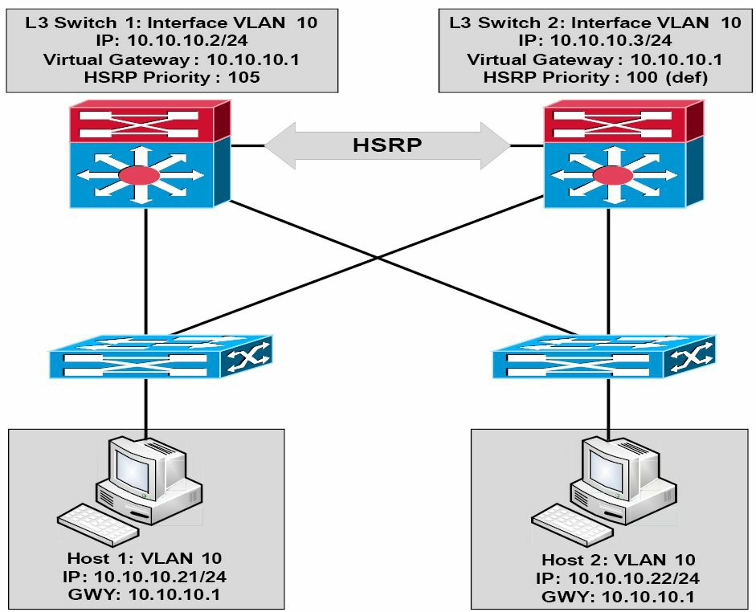
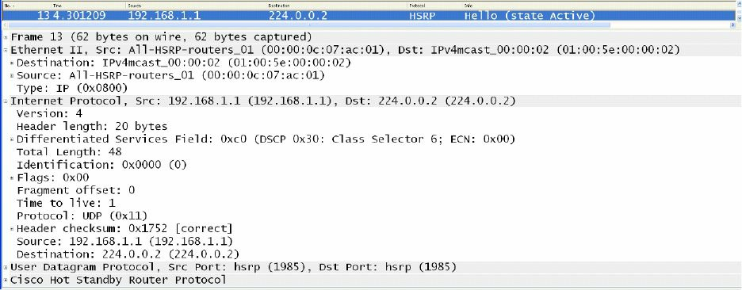
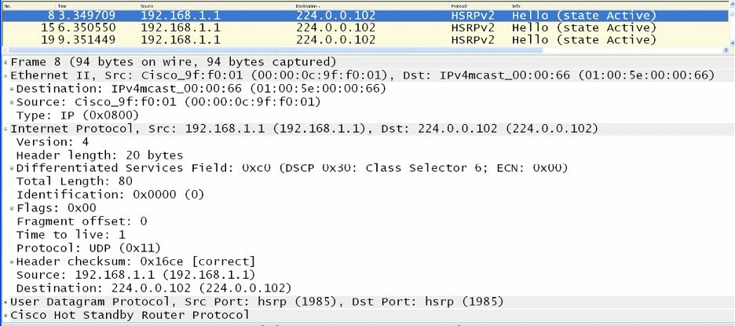
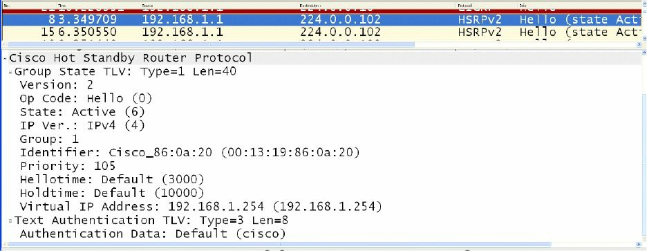
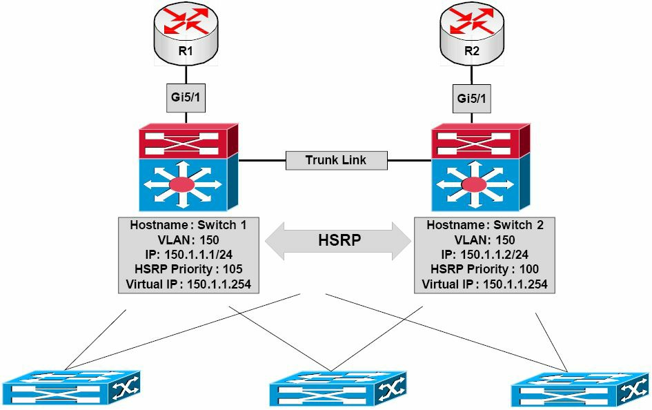
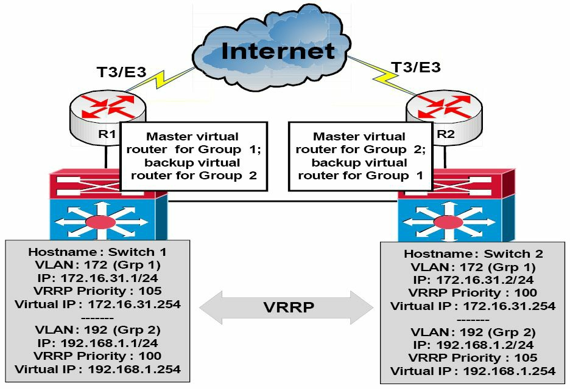
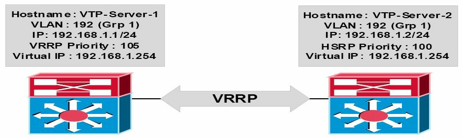
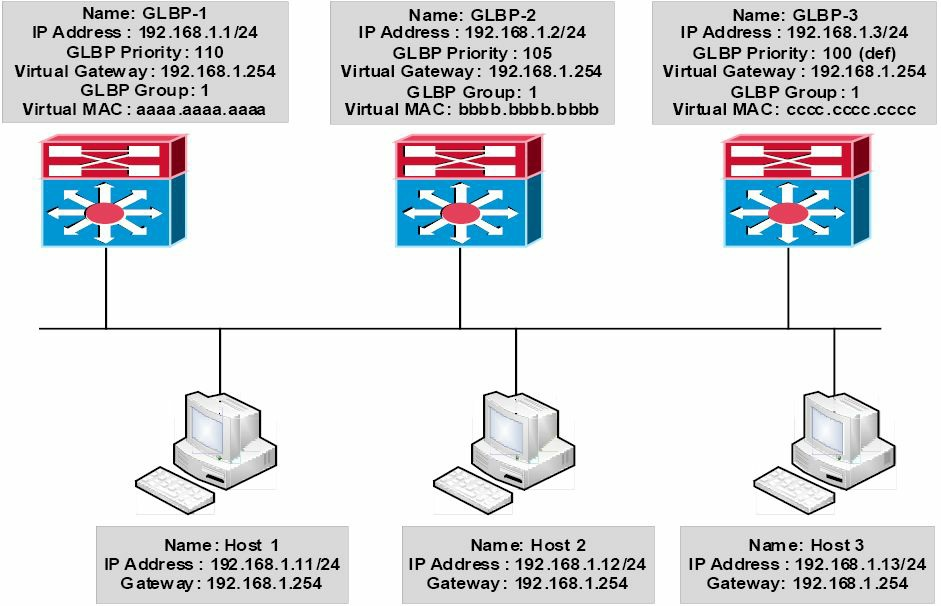

#第34天

**第一跳冗余协议**

**First Hop Redundancy Protocols**

##第34天任务

- 阅读今天的课文
- 回顾昨天的课文
- 完成今天的实验
- 阅读ICND2记诵指南
- 在[subnetting.org](subnetting.org)上花15分钟

在设计和部署交换网络时，**高可用性**（High Availability, HA）是一项不可或缺的考虑。作为思科IOS软件中所提供的一项技术，高可用性确保了网络层面的弹性与恢复能力，从而提升了IP网络的可用性。所有网段都必须具备弹性和恢复能力，以便网络能足够快地从故障中恢复过来，且此恢复过程要对用户及网络应用无感知及透明。这里的这些第一跳冗余协议（First Hop Redundancy Protocols, FHRPs），就提供了在不同的包交换局域网环境下的冗余。

今天将学习以下内容：

- 热备份路由器协议（Hot Standby Router Protocol）
- 虚拟路由器冗余协议（Virtual Router Redundancy Protocol）
- 网关负载均衡协议（Gateway Load Balancing Protocol）

这节课对应了一下ICND2考试大纲要求：

+ 认识高可用性（FHRP）
    - HSRP
    - VRRP
    - GLBP

## 热备份路由器协议

**Hot Standby Router Protocol**

热备份路由器协议是一项思科公司专有的第一跳冗余协议。HSRP令到两台配置在同样HSRP组中的物理网关，使用同样的虚拟网关地址。而位处这两台网关所在的子网中的网络主机，就以该虚拟网关IP地址，作为其默认网关地址。

当HSRP运作时，由主网关（the primary gateway）转发该HSRP组的那些以虚拟网关IP地址为目的地址的数据包。而加入主网关失效，则从网关（the secondary gateway）就接过主网关角色，并转发那些发送到虚拟网关IP地址的数据包。下面的图34.1演示了某网络中HSRP的运作：


*图 34.1 -- 热备份路由器协议的运作*

参阅图 34.1，HSRP是在三层（分发/分布层，the Layer 3, Distribution Layer）交换机之间的，给VLAN 10提供了网关的冗余性。分配给三层交换机Switch 1上的交换机虚拟借口（the Switch Virtual Interface, SVI）的IP地址是`10.10.10.2/24`, 同时分配给三层交换机Switch 2的交换机虚拟接口的IP地址是`10.10.10.3/24`。两台交换机都被配置为同一HSRP组的组成部分，并共用了该虚拟网关`10.10.10.1`。

Switch 1 已被配置了优先级值`105`，而Switch 2使用的是默认优先级值`100`。因为三层交换机Switch 1有着更高的优先级值，其就被选作主交换机，同时三层交换机Switch 2被选作从交换机。在VLAN 10上的所有主机，都配置了默认网关地址`10.10.10.1`。因此，假如Switch 1失效，Switch 2就将接过网关的职责。此过程对这些网络主机完全透明无感知。

> **真实世界应用**
> **Real-World Implementation**

> 在生产网络中配置各种FHRPs，确保子网的活动（主）网关同时也是该特定VLAN的生成树根桥，被认为是一种好的做法。比如参阅图34.1中的图例，Switch 1在作为VLAN 10的HSRP主网关的同时，也应被配置为该VLAN的根桥。

如此做法带来的是一个确切的网络（a deterministic network），从而避免在二层或三层上的次优转发。比如假设VLAN 10的根桥是Switch 2，而VLAN 10的主网关又是Switch 1，那么从网络主机发送到默认网关IP地址的数据包就将如下图34.2那样被转发了：


*图 34.2 -- STP拓扑与HSRP拓扑的同步，Synchronising the STP Topology with HSRP*

在上面的网络中，从Host 1到`10.10.10.1`的数据包将被如下这样转发：

1. 接入层交换机收到一个来自Host 1、以虚拟网关IP地址之MAC地址为目标的数据帧。此数据帧实在VLAN 10中收到的，同时该接入交换机经由其根端口，已学习到了虚拟网关的MAC地址。

2. 因为VLAN 10的根桥是Switch 2，那么到Switch 1（也就是HSRP的主路由器）的上行线路也被置于阻塞状态。此时该接入交换机就将该数据帧经由到Switch 2的上行链路予以转发。

3. Switch 2又经由连接到Switch 1的指定端口，转发该数据帧。对于来自Host 2的数据帧，会使用上述的相同次优路径。

思科IOS软件当前支持两个版本的HSRP：版本1及版本2。后续章节将对它们的相似点和不同点进行说明。

###HSRP版本1

默认情况下，当在思科IOS软件中开启热备份路由器协议是，是开启的版本1。HSRP版本1将可配置的HSRP分组限制在最多255个。HSRP版本1的那些路由器之间的通信，是通过往多播组地址（Multicast group address）`224.0.0.2`上，使用UDP端口`1985`发送报文进行的。下面的图34.3显示了HSRP版本1的报文：


*图 34.3 -- HSRP版本1多播组地址*

对HSRP数据包格式的深入探讨，是超出CCNA考试要求的范围的，下图34.4仍然给出了HSRP版本1数据包的信息：


*图 34.4 -- HSRP版本1数据包的字段*

在图34.4中，要注意版本字段显示的是数值0。这是在版本1开启时该字段的默认值；不过仍然要知道这里使用的是HSRP版本1。

###HSRP版本2

HSRP版本2使用了新的多播地址`224.0.0.102`，而不是版本1的多播地址`224.0.0.2`, 来发送Hello数据包。不过其所用到的UDP端口号仍然一样（`1985`）。同时此新地址在IP数据包及以太网数据帧中都得以编码，如下图34.5所示：


*图 34.5 -- HSRP版本2多播组地址*

对HSRP版本2数据包格式的深入探讨，也是超出CCNA考试要求范围的，但要记住HSRP版本2并未使用与版本1相同的数据包格式。

版本2数据包使用了一直类型/长度/值的格式（a Type/Length/Value format, TLV format）。被HSRP版本1的路由器接收到的版本2数据包，会将类型字段映射到HSRP版本1的版本字段，而被忽略掉。下图34.6给出了HSRP版本2数据包中所包含的信息：


*图 34.6 -- HSRP版本2的数据包字段*

###HSRP版本1与版本2的比较

HSRP 版本2包括了一些对版本1的增强。本小节将对这些增强及与版本1的不同进行说明。

尽管HSRP版本1通告了计时器数值，但这些数值都是整秒的，因为版本1无法通告或学习到毫秒的计时器数值。而版本2就既可以通告也可以学习毫秒的计时器数值了。下面的图34.7与图34.8分别着重表示了HSRP版本1与版本2在计时器字段上的不同：


*图 34.7 -- HSRP版本1的计时器字段*


*图 34.8 -- HSRP版本2的计时器字段*

HSRP版本1的分组编号是限制在0到255的，而版本2的分组编号则已拓展到0到4095了。本课程模块后面的HSRP配置示例中，将就此差异进行演示。

版本2通过包含一个由物理路由器接口的MAC地址生成、用于对HSRP活动Hello报文来源的唯一性识别的6字节识别符字段（a 6-byte Identifier field），提供了改进的管理与故障排除功能。在版本1中，这些Hello报文所包含的源MAC地址，都是虚拟MAC地址，那就是说无法找出是哪台HSRP路由器发送的HSRP Hello报文。下图34.9给出了HSRP版本2，而非版本1数据包中出现的识别符字段：


*图 34.9 -- HSRP版本2中的识别符字段*

在HSRP版本1中，虚拟IP地址所使用的二层地址将是一个由`0000.0C07.ACxx`构成的虚拟MAC地址，这里的`xx`就是HSRP分组编号的十六进制值，同时是基于相应接口的。而在HSRP版本2中，虚拟网关IP地址则是使用了新的MAC地址范围`0000.0C9F.F000`到`0000.0C9F.FFFF`。下图34.10给出了这些不同，该图现实了HSRP `Group 1`的版本1的虚拟MAC地址，同时在图34.11中显示了版本2的虚拟MAC地址，也是HSRP `Group 1`的：


*图 34.10 -- HSRP版本1的虚拟MAC地址格式*


*图 34.11 -- HSRP版本版本2的虚拟MAC地址格式*

###HSRP的主网关选举

可通过将默认HSRP优先级值100, 修改为1到255之间的任何值，对HSRP主网关的选举施加影响。有着最高优先级的路由器将被选举为该HSRP分组的主网关。

而在两个网关都使用默认优先级值时，或两个网关上的优先级值被手工配置为相等是，那么有着最高IP地址的路由器将被选举为主网关。在HSRP数据帧中，HSRP优先级值与该路由器的当前状态（比如是主路由器还是备份路由器），都有进行传送。下图34.12演示了一台配置了非默认优先级值`105`, 此优先级令到该路由器被选举为此HSRP组的活动网关，的网关的优先级和状态字段：


*图 34.12 -- HSRP的优先级与状态字段*

###HSRP报文

HSRP路由器之间就下列三种类型的报文进行交换：

- Hello报文
- Coup报文
- Resign报文

Hello报文是经由多播进行交换的，这些报文告诉另一网关本地路由器的HSRP状态和优先级数值。Hello报文还包含了组ID（the Group ID）、各种HSRP计时器数值、HSRP版本，以及认证信息。前面给出的所有报文，都是HSRP的Hello报文。

HSRP Coup报文实在当前备份路由器打算接过该HSRP组的活动网关角色时发出的。这与现实生活中的一次篡位（a coup d’état）类似。

而HSRP的Resign报文，则是在活动路由器即将关闭，以及在一台有着更高优先级的网关发出一个Hello报文或Coup报文时发出的。也就是说，在活动网关交出其作为主网关角色时，发出此报文。

###HSRP的抢占

**HSRP Preemption**

在已有一台网关被选举为活动网关的情况下，作为HSRP组一部分的另一网关被重新配置了一个更高的HSRP优先级数值时，当前活动网关会保留主转发角色。这是HSRP的默认行为。

而为了在某HSRP组中已有一个主网关的情形下，令到具有更高优先级的网关接过活动网关功能，就必须要将该路由器配置上抢占功能。这样做就允许该网关发起一次抢占，并接过该HSRP组的活动网关角色。HSRP抢占在接着的配置示例中有演示。

> 注意：抢占并不意味着生成树拓扑也会发生改变（译者注：这将导致次优路径）。

###HSRP的各种状态

与开放最短路径有限（Open Shortest Path First, OSPF）的方式类似，当在某个接口上开启了HSRP时，该网关接口会经历以下一系列状态的改变：

1. 关闭（Disabled）

2. 初始化（Init）

3. 侦听（Listen）

4. Speak

5. 备份（Standby）

6. 活动（Active）

> 注意：这些接口状态过度并无设置时间数值（There are no set time values for these interface transitions）。

在关闭及初始化状态中，该网关处于尚未准备妥当或是无法参与到HSRP组情形，可能的原因在于相关接口没有开启。

而侦听状态是适用于备份网关的。仅有备份网关才会监听来自活动网关的Hello报文。假如备份网关在10秒内未能收到Hello报文，其就假定活动网关已经宕机，并接过活动网关角色。如有在统一网段上存在其它网关，这些网关也会侦听Hello报文，且如果它们有着下一最高优先级值或IP地址，那么它们就会被选举为该分组的活动网关。

在Speak阶段，备份网关与活动网关进行报文交换。在此阶段完成后，主网关就过渡到活动状态，同时备份网关过渡到备份状态。备份状态表明该网关已准备好在主网关阵亡时接过活动网关角色，同时活动状态表明该网关已准备好进行数据包的转发。

以下输出给出了在一台刚开启HSRP的网关上，`debug standby`命令中显示的状态变化：

```
R2#debug standby
HSRP debugging is on
R2#
R2#conf t
Configuring from terminal, memory, or network [terminal]?
Enter configuration commands, one per line.
End with CNTL/Z.
R2(config)#logging con
R2(config)#int f0/0
R2(config-if)#stand 1 ip 192.168.1.254
R2(config-if)#
*Mar 1 01:21:55.471: HSRP: Fa0/0 API 192.168.1.254 is not an HSRP address
*Mar 1 01:21:55.471: HSRP: Fa0/0 Grp 1 Disabled -> Init
*Mar 1 01:21:55.471: HSRP: Fa0/0 Grp 1 Redundancy “hsrp-Fa0/0-1” state Disabled -> Init
*Mar 1 01:22:05.475: HSRP: Fa0/0 Interface up
...
[Truncated Output]
...
*Mar 1 01:22:06.477: HSRP: Fa0/0 Interface min delay expired
*Mar 1 01:22:06.477: HSRP: Fa0/0 Grp 1 Init: a/HSRP enabled
*Mar 1 01:22:06.477: HSRP: Fa0/0 Grp 1 Init -> Listen
*Mar 1 01:22:06.477: HSRP: Fa0/0 Redirect adv out, Passive, active 0 passive 1
...
[Truncated Output]
...
*Mar 1 01:22:16.477: HSRP: Fa0/0 Grp 1 Listen: d/Standby timer expired (unknown)
*Mar 1 01:22:16.477: HSRP: Fa0/0 Grp 1 Listen -> Speak
...
[Truncated Output]
...
*Mar 1 01:22:26.478: HSRP: Fa0/0 Grp 1 Standby router is local
*Mar 1 01:22:26.478: HSRP: Fa0/0 Grp 1 Speak -> Standby
*Mar 1 01:22:26.478: %HSRP-5-STATECHANGE: FastEthernet0/0 Grp 1 state Speak -> Standby
*Mar 1 01:22:26.478: HSRP: Fa0/0 Grp 1 Redundancy “hsrp-Fa0/0-1” state Speak -> Standby
```

###HSRP地址分配

**HSRP Addressing**

在本课程模块的早期，已了解到HSRP版本1中，用于虚拟IP地址的二层地址将是一个由`000.0C07.ACxx`构成的虚拟MAC地址，其中的`xx`就是该HSRP组的编号，且是基于相应接口的。而在HSRP版本2中，使用了一个新的MAC地址范围，从`0000.0C9F.F000`到`0000.0C9F.FFFF`, 作为虚拟网关IP地址的虚拟MAC地址。

而在某些情况下，我们并不期望使用这些默认的地址范围。比如在连接到一个配置了端口安全的交换机端口的某个路由器接口上，配置了好几个HSRP组时。在此情况下，该路由器就应对不同HSRP组使用不同的MAC地址，那么结果就是这些MAC地址都需要满足（accommodate）交换机端口的安全配置。该项配置在每次将HSRP组加入到路由器接口时都必须进行修改；否则就会触发端口安全冲突（otherwise, a port security violation would occur）。

为解决此问题，思科IOS软件允许管理员将HSRP配置为使用其所配置上的物理接口的实际MAC地址。那么结果就是一个单独的MAC地址为所有HSRP组所使用（也就是活动网关所使用的MAC地址），且在每次往连接到这些交换机上的路由器添加HSRP组的时候，无需对端口安全配置进行修改。此操作是通过使用接口配置命令`standby use-bia`命令完成的。下面的输出演示了命令`show standby`，该命令给出了一个配置了两个不同HSRP组的网关接口的信息：

```
Gateway-1#show standby
FastEthernet0/0 - Group 1
    State is Active
        8 state changes, last state change 00:13:07
    Virtual IP address is 192.168.1.254
    Active virtual MAC address is 0000.0c07.ac01
        Local virtual MAC address is 0000.0c07.ac01 (v1 default)
    Hello time 3 sec, hold time 10 sec
        Next hello sent in 2.002 secs
    Preemption disabled
    Active router is local
    Standby router is 192.168.1.2, priority 100 (expires in 9.019 sec)
    Priority 105 (configured 105)
    IP redundancy name is “hsrp-Fa0/0-1” (default)
FastEthernet0/0 - Group 2
    State is Active
        2 state changes, last state change 00:09:45
    Virtual IP address is 172.16.1.254
    Active virtual MAC address is 0000.0c07.ac02
        Local virtual MAC address is 0000.0c07.ac02 (v1 default)
    Hello time 3 sec, hold time 10 sec
        Next hello sent in 2.423 secs
    Preemption disabled
    Active router is local
```

在上面的输出中，由于是默认的HSRP版本，那么HSRP `Group 1`的虚拟MAC地址就是`0000.0c07.ac01`，同时HSRP组2的就是`0000.0c07.ac02`。这就意味着连接此网关的交换机端口要学习三个不同地址：物理接口`Fastethernet0/0`的实际或出厂地址、HSRP `Group 1`的虚拟MAC地址，以及HSRP组2的虚拟MAC地址。

下面的输出，演示了如何将HSRP配置为使用该网关接口的实际MAC地址，作为不同HSRP分组的虚拟MAC地址：

```
Gateway-1#conf
Configuring from terminal, memory, or network [terminal]?
Enter configuration commands, one per line. End with CNTL/Z.
Gateway-1(config)#int f0/0
Gateway-1(config-if)#standby use-bia
Gateway-1(config-if)#exit
```

基于上面的输出中的配置，命令`show standby`会反应出HSRP组的新MAC地址，如下面的输出所示:

```
Gateway-1#show standby
FastEthernet0/0 - Group 1
    State is Active
        8 state changes, last state change 00:13:07
    Virtual IP address is 192.168.1.254
    Active virtual MAC address is 0013.1986.0a20
        Local virtual MAC address is 0013.1986.0a20 (bia)
    Hello time 3 sec, hold time 10 sec
        Next hello sent in 2.756 secs
    Preemption disabled
    Active router is local
    Standby router is 192.168.1.2, priority 100 (expires in 9.019 sec)
    Priority 105 (configured 105)
    IP redundancy name is “hsrp-Fa0/0-1” (default)
FastEthernet0/0 - Group 2
    State is Active
        2 state changes, last state change 00:09:45
    Virtual IP address is 172.16.1.254
    Active virtual MAC address is 0013.1986.0a20
        Local virtual MAC address is 0013.1986.0a20 (bia)
    Hello time 3 sec, hold time 10 sec
        Next hello sent in 0.188 secs
    Preemption disabled
    Active router is local
    Standby router is unknown
    Priority 105 (configured 105)
    IP redundancy name is "hsrp-Fa0/0-2" (default)
```

那么这里两个HSRP组所用的MAC地址，都是`0013.1986.0a20`，就是分配给物理网关接口的MAC地址了。这在下面的输出中有证实：

```
Gateway-1#show interface FastEthernet0/0
FastEthernet0/0 is up, line protocol is up
    Hardware is AmdFE, address is 0013.1986.0a20 (bia 0013.1986.0a20)
    Internet address is 192.168.1.1/24
    MTU 1500 bytes, BW 100000 Kbit/sec, DLY 100 usec,
        reliability 255/255, txload 1/255, rxload 1/255
    Encapsulation ARPA, loopback not set
...
[Truncated Output]
```

> **注意**：除了将HSRP配置为使用出厂地址（the burnt-in address, BIA）, 管理员亦可经由接口配置命令`standby [number] mac-address [mac]`，静态指定虚拟网关要使用的MAC地址。但一般不会这样做，因为这可能会导致交换网络中的重复MAC地址，这就会引起严重的网络故障，甚至造成网络中断。

###HSRP的明文认证

**HSRP Plain Text Authentication**

HSRP报文默认以明文密钥字串(the plain text key string)`cisco`发送，以此作为一种对HSRP成员（HSRP peers）进行认证的简单方式。如报文中的密钥字串与HSRP成员路由器上所配置的密钥匹配，报文就被接受。否则，HSRP就忽略那些未认证的报文。

明文密钥提供了最低的安全性，因为使用诸如Wireshark或Ethereal这样的简单抓包软件，它们就可被抓包捕获。下图34.13显示了HSRP报文中所使用的默认命令认证密钥：


*图 34.13 -- 查看HSRP默认明文密钥*

因为明文认证提供很低的安全性，那么下面介绍的消息摘要5（message digest 5, MD5）, 就是推荐的HSRP认证方式了。

###HSRP MD5 认证

这并非CCNA题目，放在这里是为了完整性及那些要实际从事网络方面工作的人的考虑。

消息摘要5认证通过生成一个多播HSRP协议数据包的HSRP部分的摘要，提供了HSRP比起明文认证更强的安全性。在采行了MD5认证后，就允许各个HSRP组成员使用一个密钥，来生成一个加密了的MD5散列值，并作为发出数据包的一部分。而接收到的HSRP数据包也会产生一个加密的散列值，如果接收到的数据包的加密散列值与MD5生成值不匹配，接收路由器就会忽略此数据包。

既可以通过在配置使用一个密钥字串直接提供MD5散列值的密钥，也可以通过密钥链（a key chain）来提供到。本课程模块稍后会对这两种方式进行讲解。在应用了明文或是MD5认证时，在出现以下情形之一后，网关都会拒绝那些HSRP数据包：

- 路由器与收到的数据包认证方案不一致时
- 路由器与收到的数据包的MD5摘要不同时
- 路由器与收到的数据包的明文认证字串不一致时

###HSRP接口跟踪

**HSRP Interface Tracking**

HSRP允许管理员对当前活动网关上的接口状态进行追踪，所以在有接口失效时，网关就会将其优先级降低一个特定数值，默认为10, 这样就可以让其它网关接过HSRP组的活动网关角色。此概念在下图34.14中进行了演示：


*图 34.14 -- HSRP 接口追踪*

参考图34.14, 对于VLAN 150, 已在Switch 1及Switch 2上开启了HSRP。而基于当前的优先级配置，Switch 1有着优先级数值105, 已被选举为该VLAN的主交换机。Switch 1与Switch 2都通过其各自的`Gigabitethernet5/1`接口，分别连接到两台路由器。这里假定这两台与其它外部网络相连，比如互联网。

在没有HSRP接口跟踪功能时，如果Switch 1与R1之间的`Gigabitethernet5/1`接口失效，那么Switch 1仍将保持其主网关状态。此时就必须将所有接收到的、比如前往互联网的数据包，使用Switch 1本身与Switch 2之间的连接，转发到Switch 2上。这些数据包将会通过R2转发到它们本来的目的地。这就造成了网络中的次优流量路径。

HSRP接口跟踪功能令到管理员可将HSRP配置为追踪某个接口的状态，并据此将活动网关的优先级降低一个默认10的值，亦可指定该降低值。同样参考图34.14, 如果在Switch 1上采用默认值配置了HSRP接口跟踪，那么就令到该交换机对接口`Gigabitethernet5/1`的状态进行跟踪，在那个接口失效后，Switch 1就会将其该HSRP组的优先级降低10, 得到一个95的优先级。

又假设Switch 2上配置了抢占（preempt），在此情形下是强制性要配置的，那么它就会注意到自己有着更高的优先级（100比95）, 就会执行一次篡位，结果该HSRP组的活动网关角色。

> **真实场景应用**
> 在生产网络中，思科Catalyst交换机还支持增强对象跟踪（Enhanced Object Tracking, EOT）功能，可用于所有FHRP（也就是HSRP、VRRP及GLBP）上。增强对象跟踪功能令到管理员可以将交换机配置为对以下参数进行跟踪：

> - 某个接口的IP路由状态，The IP routing state of an interface
> - IP路由的可达性，IP route reachablity
> - IP路由度量值阈值，The threshold of IP route metrics
> - IP SLA 的运作，IP SLA operations([Service-Level Agreements](http://www.cisco.com/c/en/us/tech/ip/ip-service-level-agreements-ip-slas/index.html), 服务等级协议)

> 对于这些FHRPs，比如HSRP，可被配置为对这些增强对象进行跟踪，以令到在部署FHRP失效情形时具有更大的灵活性。比如，在采用EOT时，可将活动HSRP路由器配置为在网络或主机路由不可达时（也就是出现在路由表中），降低其优先级某个数值。EOT功能是超出了CCNA考试要求的，在配置示例中不会涉及。

###HSRP的负载均衡

HSRP允许管理员在一些物理接口上配置多个HSRP组，以实现负载均衡。默认情况下，在两台网关之间配置HSRP时，在任何时期都只有一台网关对那个组的流量进行转发。这样就导致了备份网关链路上带宽的浪费。这在下图34.15中进行了演示：


*图 34.15 -- 不具备HSRP负载均衡的一个网络*

在图34.15中，在Switch 1和Switch 2上配置了两个HSRP组。Switch 1已被配置为两个组的活动（主）网关--这是基于其有着较高的优先级值。Switch 1与Switch 2都相应的连接到了路由器R1和R2上。这两台路由器都通过各自的T3/E3线路，连接到互联网。因为Switch 1是两个HSRP组的活动网关，它就会转发两个组的流量，直到其失效后，Switch 2才会结果活动（主）网关的角色。

尽管这样做满足了网络的冗余需求，但也造成R2上昂贵的T3/E3线路的空闲，除非在Switch 2成为活动网关并开始经由它来转发流量。自然，这就出现了一定数量带宽的浪费。

而通过配置多个HSRP组，每个组使用不同的活动网关，管理员就可以有效的防止不必要的资源浪费，并在Switch 1与Switch 2之间实现负载均衡。这在下图34.16中进行了演示：


*图 34.16 -- 一个采用HSRP实现负载均衡的网络*

这里通过将Switch 1配置为HSRP `Group 1`的活动网关，将Switch 2配置为HSRP组2的活动网关，管理员就令到来自两个不同组的流量，在Switch 1与Switch 2之间实现了负载均衡，并最终通过这两条专用T3/E3广域网连接。同时每台交换机又互为对方HSRP组的备份。比如在Switch 2失效时，Switch 1就将接过HSRP组2活动网关的角色，相反亦然。

> **真实世界的部署**

> 在生产网络中，需要记住多个HSRP组的建立，会造成网关上CPU使用率的上升，以及有HSRP报文交换所造成的网络带宽占用的增加。诸如Catalyst 4500及6500系列的思科Catalyst交换机，提供了对HSRP客户组（HSRP client groups）的支持。

> 在前面的小节中，了解到HSRP允许在单个的网关接口上配置多个HSRP组。而在网关接口上允许许多不同HSRP组的主要问题，就是这样做会导致网关上CPU使用率的上升，并也因为HSRP每隔3秒的Hello数据包，而潜在可能增加网络流量。

> 为解决这个潜在的问题，HSRP就还允许客户或从组的配置（the configuration of client or slave groups）。这些组是一些简单的HSRP组，它们跟随某个主HSRP组（a master HSRP group），而不参与HSRP选举。这些客户或从组跟随主组的允许与状态，因此它们本身无需周期性地交换Hello数据包。这样在运用多个HSRP组时，降低CPU与网络的使用。

> 但是，为了刷新那些交换机的虚拟MAC地址，这些客户组仍然要发送周期性的报文。不过与主组的协议选举报文相比，这些刷新报文是以低得多的频率发送的。尽管HSRP客户组的配置是超出CCNA考试要求的，下面的输出还是演示两个客户组的配置，这两个客户组被配置为跟随主组HSRP `Group 1`, 该主组又被命名为`SWITCH-HSRP`组：

```
Gateway-1(config)#interface vlan100
Gateway-1(config-if)#ip address 192.168.1.1 255.255.255.0
Gateway-1(config-if)#ip address 172.16.31.1 255.255.255.0 secondary
Gateway-1(config-if)#ip address 10.100.10.1 255.255.255.0 secondary
Gateway-1(config-if)#standby 1 ip 192.168.1.254
Gateway-1(config-if)#standby 1 name SWITCH-HSRP
Gateway-1(config-if)#standby 2 ip 172.16.31.254
Gateway-1(config-if)#standby 2 follow SWITCH-HSRP
Gateway-1(config-if)#standby 3 ip 10.100.10.254
Gateway-1(config-if)#standby 3 follow SWITCH-HSRP
Gateway-1(config-if)#exit
```

> 在上面的输出配置中，`Group 1` 被配置为了主HSRP组， 同时`Group 2`与`Group 3`被配置为了客户组或叫做从组。

###网关上HSRP的配置

在网关上配置HSRP，需要完成以下步骤：

1. 使用接口配置命令`ip address [address] [mask] [secondary]`配置网关接口的IP地址及掩码。

2. 通过接口配置命令`standby [number] ip [virtual address] [secondary]`, 在网关接口上建立一个HSRP组，以及给该HSRP组指派虚拟IP地址。关键词（keyword）`[secondary]`将该IP地址指定为指定组的次网关IP地址。

3. 这里作为可选项，使用接口配置命令`standby [number] name [name]`, 为HSRP组指派一个名称。

4. 作为可选项，如打算对活动网关的选举施加影响，就要经由接口配置命令`standby [number] priority [value]`，对组优先级进行配置。

本章中的后续HSRP配置输出，将建立在下图34.17中的网络：


*图 34.17 -- HSRP示例配置的拓扑*

> **注意**：这里假定在`VTP-Server-1`与`VTP-Server-2`之间的VLAN与中继已有配置妥当，同时交换机之间可以经由VLAN172 `ping`通。为简短起见，这些配置已在配置示例中省略。

```
VTP-Server-1(config)#interface vlan172
VTP-Server-1(config-if)#ip address 172.16.31.1 255.255.255.0
VTP-Server-1(config-if)#standby 1 ip 172.16.31.254
VTP-Server-1(config-if)#standby 1 priority 105
VTP-Server-1(config-if)#exit
VTP-Server-2(config)#interface vlan172
VTP-Server-2(config-if)#ip address 172.16.31.2 255.255.255.0
VTP-Server-2(config-if)#standby 1 ip 172.16.31.254
VTP-Server-2(config-if)#exit
```

> **注意**：这里应用到`VTP-Server-2`的HSRP配置并没有手动指派优先级数值。默认情况下，HSRP将使用一个100的优先级值，以允许带有优先级值105的`VTP-Server-1`，在选举中胜选，从而被选举为该HSRP组的主网关。

在配置应用后，就可使用`show standby [interface brief]`命令，对HSRP的配置进行验证。下面的输出对`show standby brief`命令进行了展示：

```
VTP-Server-1#show standby brief
                     P indicates configured to preempt.
                     |
Interface   Grp      Pri P State   Active  Standby         Virtual IP
Vl172       1        105   Active  local   172.16.31.2     172.16.31.254
VTP-Server-2#show standby brief
                     P indicates configured to preempt.
                     |
Interface   Grp      Pri P State   Active  Standby         Virtual IP
Vl172       1        100   Standby local   172.16.31.1     172.16.31.254
```

基于此种配置，只有在`VTP-Server-1`失效时，`VTP-Server-2`才会成为活动网关。此外，因为没有配置抢占（preemption），那么即使在`VTP-Server-1`重新上线时，就算在该HSRP组中，其比起`VTP-Server-2`有着更高的优先级，它仍然无法强制性地接过活动网关角色。

###HSRP抢占的配置

**Configuring HSRP Preemption**

抢占特性令到某台网关在本身比当前活动网关有着更高优先级时，强制性地接过活动网关的角色。使用命令`standby [number] preempt`命令，来配置HSRP抢占特性。下面的输出，演示了在`VTP-Server-1`上的此项配置：

```
VTP-Server-1(config)#interface vlan172
VTP-Server-1(config-if)#standby 1 preempt
```

这里同样使用命令`show standby [interface [name] |brief]`, 来验证在某个网关上已有配置抢占特性。是通过下面的`show standby brief`命令输出中的“P”字样演示的：

```
VTP-Server-1#show standby brief
                     P indicates configured to preempt.
                     |
Interface   Grp Pri  P State   Active  Standby         Virtual IP
Vl172       1   105  P Active  local   172.16.31.2     172.16.31.254
```

有了这个修改，在因`VTP-Server-1`失效而导致`VTP-Server-2`接过VLAN172的活动网关角色时，一旦`VTP-Server-1`再度上线，其就将强制性再度接手那个角色。在配置抢占特性时，思科IOS软件允许指定在交换机抢占及强制重新获得活动网关角色之前的时间间隔。

默认下抢占是立即发生的。但可使用接口配置命令`standby [number] preempt delay [minimum|reload|sync]`对此时间间隔进行修改。关键字`[minimum]`用于指定在抢占前等待的最短时间（秒）。下面的输出展示了如何配置在抢占前等待30秒钟：

```
VTP-Server-1(config)#interface vlan172
VTP-Server-1(config-if)#standby 1 preempt delay minimum 30
```

此配置可使用命令`show standby [interface]`进行验证。下面的输出对此进行了演示：

```
VTP-Server-1#show standby vlan172
Vlan172 - Group 1
    State is Active
        5 state changes, last state change 00:00:32
Virtual IP address is 172.16.31.254
Active virtual MAC address is 0000.0c07.ac01
    Local virtual MAC address is 0000.0c07.ac01 (v1 default)
Hello time 3 sec, hold time 10 sec
    Next hello sent in 0.636 secs
Preemption enabled, delay min 30 secs
Active router is local
Standby router is 172.16.31.2, priority 100 (expires in 8.629 sec)
Priority 105 (configured 105)
IP redundancy name is “hsrp-Vl172-1” (default)
```

而关键字`[reload]`用于指定网关在其重启后需要等待的时间（the `[reload]` keyword is used to specify the amount of time the gateway should wait after it initiates following a reload）。关键字`[sync]`是与IP冗余客户端配合使用的。此配置超出了CCNA考试要求，但在生产环境中是十分有用的，因为在出现某个正在被跟踪的抖动接口，或类似情况下，此配置可以阻止不必要的角色切换（this configuration is beyond the scope of the CCNA exam requirements but is very useful in production environments because it prevents an unnecessary change of roles in the case of a flapping interface that is being tracked, or similar activity）。

###配置HSRP接口跟踪

HSRP接口跟踪特性，令到管理员可以将HSRP配置为追踪接口状态，从而将当前优先级降低一个默认数值（10）或指定数值，以允许另一网关接过指定HSRP组的主网关角色。

在下面的输出中，`VTP-Server-1`被配置为对连接到假想WAN路由器的接口`Gigabitethernet5/1`的状态，进行跟踪。在那个接口状态转变为`down`时，该网关就将其优先级值降低10（默认的）:

```
VTP-Server-1#show standby vlan172
Vlan172 - Group 1
    State is Active
        5 state changes, last state change 00:33:22
    Virtual IP address is 172.16.31.254
    Active virtual MAC address is 0000.0c07.ac01
        Local virtual MAC address is 0000.0c07.ac01 (v1 default)
    Hello time 3 sec, hold time 10 sec
        Next hello sent in 1.085 secs
    Preemption enabled
    Active router is local
    Standby router is 172.16.31.2, priority 100 (expires in 7.616 sec)
    Priority 105 (configured 105)
    IP redundancy name is “hsrp-Vl172-1” (default)
    Priority tracking 1 interfaces or objects, 1 up:
    Interface or object          Decrement  State
    GigabitEthernet5/1           10         Up
```

而要将该网关降低值配置为比如50, 就可以执行命令`standby [name] track [interface] [decrement value]`, 如下面的输出所示：

```
VTP-Server-1(config)#interface vlan172
VTP-Server-1(config-if)#standby 1 track GigabitEthernet5/1 50
```

此项配置可使用命令`show standby [interface]`进行验证。下面对此进行了演示：

```
VTP-Server-1#show standby vlan172
Vlan172 - Group 1
    State is Active
        5 state changes, last state change 00:33:22
    Virtual IP address is 172.16.31.254
    Active virtual MAC address is 0000.0c07.ac01
    Local virtual MAC address is 0000.0c07.ac01 (v1 default)
    Hello time 3 sec, hold time 10 sec
        Next hello sent in 1.085 secs
    Preemption enabled
    Active router is local
    Standby router is 172.16.31.2, priority 100 (expires in 7.616 sec)
    Priority 105 (configured 105)
    IP redundancy name is “hsrp-Vl172-1” (default)
    Priority tracking 1 interfaces or objects, 1 up:
    Interface or object          Decrement  State
    GigabitEthernet5/1           50         Up
```

###配置HSRP的版本

如同在本课程模块先前指出的那样，默认当HSRP开启时，是启用的版本1。但可通过接口配置命令`standby version [1|2]`来手动开启HSRP版本2。下面的输出演示了HSRP版本2的配置：

```
VTP-Server-1(config)#interface vlan172
VTP-Server-1(config-if)#standby version 2
```

使用命令`show standby [interface]`，可对此配置进行验证。下面的输出对此进行了演示：

```
VTP-Server-1#show standby vlan172
Vlan172 - Group 1 (version 2)
    State is Active
        5 state changes, last state change 00:43:42
    Virtual IP address is 172.16.31.254
    Active virtual MAC address is 0000.0c9f.f001
        Local virtual MAC address is 0000.0c9f.f001 (v2 default)
    Hello time 3 sec, hold time 10 sec
        Next hello sent in 2.419 secs
    Preemption enabled
    Active router is local
    Standby router is 172.16.31.2, priority 100 (expires in 4.402 sec)
    Priority 105 (configured 105)
    IP redundancy name is “hsrp-Vl172-1” (default)
```

而HSRP的开启，就自动将HSRP所使用的MAC地址范围，从`0000.0C07.ACxx`，改变为`0000.0C9F。F000`到`0000.0C9F.FFFF`。因此务必要记住这将导致生产网络中的一些数据包丢失，因为网络中的设备必须要掌握到网关的新MAC地址。这类导致包丢失的变动，都推荐在维护窗口或几乎的断网窗口来进行。

##虚拟路由器冗余协议

**Virtual Router Redundancy Protocol**

虚拟路由器冗余协议（Virtual Router Redundancy Protocol, VRRP），是一个动态地将一个或多个网关的职责，指派给LAN上的VRRP路由器的网关选举协议（a gateway election protocol）, 其令到在诸如以太网这样的某个多路访问网段（a Multi-Access segment）上的数台路由器，能够使用同一个虚拟IP地址，作为它们的默认网关。

VRRP以与HSRP类似的方式运作；但与HSRP不同，VRRP是一个定义在[RFC 2338](http://www.ietf.org/rfc/rfc2338.txt)中的开放标准，RFC 2338 在[RFC 3768](http://www.ietf.org/rfc/rfc3768.txt)中被废弃。VRRP将通告发送到多播目的地址`224.0.0.18`（VRRP）, 使用的是IP协议编号`112`。在数据链路层，通告是从主虚拟路由器（the master virtual router）的MAC地址`00-00-5e-00-01xx`发出的，这里的"xx"表示了两位十六进制的组编号。这在下图34.18中进行了演示：


*图 34.18 -- VRRP的多播地址，VRRP Multicast Addresses*

> **注意**：这里的协议编号是十六进制形式的。而十六进制值`0x70`就等于是进制的112。与此类似，数据链路层目的地址`01-00-5e-00-00-12`中的十六进制值`12`就是十进制值18（也就是`224.0.0.18`）了。如你仍对这些数值是如何转换的没有掌握，那么本CCNA手册的十六进制到十进制转换在网上是很详细的。

> **真是世界的部署**

> 与HSRP不同，VRRP并没有允许网关使用出厂地址（Burnt-in Address, BIA）或静态配置的地址作为VRRP组的MAC地址的选项。因此，在带有多于VRRP组的生产网络中，对在某个特定接口上应用多个MAC地址的理解掌握，尤其是当部署了诸如端口安全这样的特性时， 是重要的。记得要着重于整体上；否则就会发现，尽管有正确配置，一些特性或协议也不会如预期那样跑起来。

一个VRRP网关是在一台或多台连接到LAN的路由器上，配置用于运行VRRP协议的（A VRRP gateway is configured to run the VRRP protocol in conjunction with one or more other routers attached to a LAN）。在VRRP配置中，一台网关被选举为主虚拟路由器（the master router）, 而其它网关则扮演在主虚拟路由器失效时的备份虚拟路由器。下图34.19对此概念进行了演示：


*图 34.19 -- VRRP的基本运作*

###VRRP的多虚拟路由器支持特性

可在某个接口上配置多大255个的虚拟路由器。而某个路由器接口实际能支持的虚拟路由器数目，由以下因素决定：

- 路由器的处理能力，Router processing capability

- 路由器的内存容量，Router memory capability

- 路由器接口对多MAC地址的支持情况，Router interface support of multiple MAC addresses 

###VRRP的主路由器选举

**VRRP Master Router Election**

VRRP默认使用优先级值来决定哪台路由器将被选举为主虚拟路由器。默认的VRRP优先级值为100; 但此数值可被手工修改为一个1到254之间的数值。而如多台网关有着相同的优先级数值，那么有着最高IP地址的网关将被选举为主虚拟路由器，同时有着较低IP地址的那台就成为备份虚拟路由器。

加入有多于两台的路由器被配置为VRRP组的组成部分，那么备份虚拟路由器中有着第二高优先级的，就会在当前主虚拟路由器失效或不可用时，被选举为主虚拟路由器。又假如那些备份虚拟路由器又有着相同的优先级，那么这些备份路由器中有着最高IP地址的那台，将被选举为主路由器。下图34.20对此概念进行了演示：


*图 34.20 -- VRRP主虚拟路由器及备份虚拟路由器的选举*

图34.20演示了一个采用了VRRP作为网关冗余的网络。主机1与主机2都配置了默认`192.168.1.254`作为默认网关，此网关就是配置在交换机`VRRP-1`、`VRRP-2`及`VRRP-3`上，给VRRP `group 192`的虚拟IP地址。

交换机`VRRP-1`已被配置了优先级值110, `VRRP-2`的是105, `VRRP-3`的是默认VRRP优先级100。基于此种配置，`VRRP-1`就被选举为主虚拟路由器，同时`VRRP-2`和`VRRP-3`就成为备份虚拟路由器。

在`VRRP-1`失效时，因为`VRRP-2`有着比起`VRRP-3`更高的优先级，所以它就成为主虚拟路由器。但如果`VRRP-2`与`VRRP-3`有着相同优先级的话，`VRRP-3`将被选举为主虚拟路由器，因为它有着更高的IP地址。

###VRRP的抢占

与HSRP不同，VRRP的抢占特性是默认开启的，因此无需管理员为开启此功能而进行显式的配置。但此功能可经由使用接口配置命令`no vrrp [number] preempt`进行关闭。

###VRRP的负载均衡

VRRP允许以与HSRP类似的方式，实现负载均衡。比如，在一个于某台网关上配置了多个虚拟路由器（VRRP组）的网络中，一个接口可作为某个虚拟路由器（VRRP组）的主接口（虚拟路由器），同时又可作为另一或更多虚拟路由器（VRRP组）的备份（虚拟路由器）。下图34.21对此进行了演示：


*图 34.21 -- VRRP的负载均衡*

###VRRP的版本

默认情况下，当在某台运行思科IOS软件的网关上配置了VRRP时，开启的是VRRP版本2（见下图）。版本2正是默认的以及当前的VRRP版本。这里并不能如同在HSRP中那样改变版本，因为并没有VRRP版本1的标准。

> **注意**: 在本手册编写过程中，为IPv4与IPv6定义VRRP的版本3，正处于草案阶段，且并未标准化。


*图 34.22 -- VRRP版本2的数据包*

###VRRP的各种通告

**VRRP Advertisements**

主虚拟路由器将通告发送给同一VRRP组中的其它VRRP路由器。通告就主虚拟路由器的优先级与状态进行通信。VRRP的通告是以IP数据包进行封装的，并被发送到在图34.18中所演示的那个指派给该VRRP组的IPv4多播地址。通告默认以每秒的频率发送；不过此时间间隔是可被用户配置的，因而可以改变。同时备份虚拟路由器收听主虚拟路由器通告的间隔，也可进行配置。

###在网关上配置VRRP

在网关上配置VRRP，需要以下步骤：

1. 使用接口配置命令`ip address [address] [mask] [secondary]`，给网关接口配置正确的IP地址与子网掩码。

2. 通过接口配置命令`vrrp [number] ip [virtual address] [secondary]`，在该网关接口上建立一个VRRP组，并为其指派一个虚拟IP地址。关键字`[secondary]`将该虚拟IP地址配置为指定VRRP组的次网关地址。

3. 作为可选项，使用接口配置命令`vrrp [number] description [name]`, 为该VRRP组指派一个描述性名称。

4. 作为可选项，在打算对主虚拟路由器及备份虚拟路由器的选举进行控制时，就要经由接口配置命令`vrrp [number] priority [value]`, 对该组的优先级进行配置。

本小节的VRRP配置输出，将基于下图34.23的网络：


*图 34.23 -- VRRP配置示例的拓扑*

> **注意**：这里假定在`VTP-Server-1`与`VTP-Server-2`之间的VLAN与中继已有配置妥当，同时交换机之间可以经由VLAN192 `ping`通。为简短起见，这些配置已在配置示例中省略。

```
VTP-Server-1(config)#interface vlan192
VTP-Server-1(config-if)#ip address 192.168.1.1 255.255.255.0
VTP-Server-1(config-if)#vrrp 1 ip 192.168.1.254
VTP-Server-1(config-if)#vrrp 1 priority 105
VTP-Server-1(config-if)#vrrp 1 description ‘SWITCH-VRRP-Example’
VTP-Server-1(config-if)#exit
VTP-Server-2(config)#interface vlan192
VTP-Server-2(config-if)#ip address 192.168.1.2 255.255.255.0
VTP-Server-2(config-if)#vrrp 1 ip 192.168.1.254
VTP-Server-2(config-if)#vrrp 1 description ‘SWITCH-VRRP-Example’
VTP-Server-2(config-if)#exit
```

> **注意**：这里没有为`VTP-Server-2`上所应用的VRRP配置手动指派优先级数值。那么默认情况下，VRRP将使用100的优先级数值，这就令到带有优先级数值105的`VTP-Server-1`，在选举中获胜而被选举为该VRRP组的主虚拟路由器。此外，这里还为该VRRP组配置了一个描述信息。

下面还使用命令`show vrrp [all|brief|interface]`, 对此配置进行了验证。关键字`[all]`展示了有关该VRRP配置的所有信息，包括了组的状态、描述信息（在配置了的情况下）、本地网关优先级，以及主虚拟路由器和其它信息。关键字`[brief]`则会列印出该VRRP配置的摘要信息。而`[interface]`关键字会列印出特定接口的VRRP信息。下面的输出展示了`show vrrp all`命令的输出：

```
VTP-Server-1#show vrrp all
Vlan192 - Group 1
‘SWITCH-VRRP-Example’
    State is Master
    Virtual IP address is 192.168.1.254
    Virtual MAC address is 0000.5e00.0101
    Advertisement interval is 1.000 sec
    Preemption enabled
    Priority is 105
    Master Router is 192.168.1.1 (local), priority is 105
    Master Advertisement interval is 1.000 sec
    Master Down interval is 3.589 sec
VTP-Server-2#show vrrp all
Vlan192 - Group 1
‘SWITCH-VRRP-Example’
    State is Backup
    Virtual IP address is 192.168.1.254
    Virtual MAC address is 0000.5e00.0101
    Advertisement interval is 1.000 sec
    Preemption enabled
    Priority is 100
    Master Router is 192.168.1.1, priority is 105
    Master Advertisement interval is 1.000 sec
    Master Down interval is 3.609 sec (expires in 3.328 sec)
```

下面的输出展示了由命令`show vrrp brief`所列印出的信息：

```
VTP-Server-1#show vrrp brief
Interface          Grp Pri Time Own Pre State   Master addr     Group addr
Vl192              1   105 3589      Y  Master  192.168.1.1     192.168.1.254
VTP-Server-2#show vrrp brief
Interface          Grp Pri Time Own Pre State   Master addr     Group addr
Vl192              1   100 3609      Y  Backup  192.168.1.1     192.168.1.254
```

###配置VRRP的接口跟踪特性

为将VRRP配置为对某个接口进行跟踪，就必须要在全局配置模式下，为接口追踪而使用全局配置命令`track [object number] interface [line-protocol|ip routing]`, 或为IP前缀追踪而使用全局配置命令`track [object number] ip route [address | prefix] [reachablity | metric threshold]`，建立一个被跟踪的对象。依据软件与平台的不同，交换机上可对高达500个的被追踪对象进行跟踪。随后再使用接口配置命令`vrrp [number] track [object]`, 实现VRRP对被追踪对象的跟踪。

> **注意**：CCNA考试不要求完成这些高级对象追踪的配置。

下面的输出展示了如何配置VRRP的跟踪，引用了对象1, 该被跟踪对象对`Loopback0`接口的线路协议进行跟踪：

```
VTP-Server-1(config)#track 1 interface Loopback0 line-protocol
VTP-Server-1(config-track)#exit
VTP-Server-1(config)#interface vlan192
VTP-Server-1(config-if)#vrrp 1 track 1
VTP-Server-1(config-if)#exit
```

而下面的输出则展示了如何将VRRP配置为对引用对象2的追踪，此被追踪对象追踪了到前缀`1.1.1.1/32`的可达性。一个被追踪的IP路由对象在存在一个该路由的路由表条目时，被认为是在线且可达的，同时该路由不是无法访问的（无法访问就是说有着255的路由度量值）, 当发生无法访问时，该路由就会从路由信息数据库中被移除（a tracked IP route object is considered to be up and reachable when a routing table entry exists for the route and the route is not accessible(i.e., has a route metric of 255)，in which case the route is removed from the Routing Information Base(RIB) anyway）。

```
VTP-Server-1(config)#track 2 ip route 1.1.1.1/32 reachability
VTP-Server-1(config-track)#exit
VTP-Server-1(config)#interface vlan192
VTP-Server-1(config-if)#vrrp 1 track 2
```

VRRP跟踪的配置，是通过使用命令`show vrrp interface [name]`命令进行验证的。下面的输出对此进行了演示：

```
VTP-Server-1#show vrrp interface vlan192
Vlan192 - Group 1
‘SWITCH-VRRP-Example’
    State is Master
    Virtual IP address is 192.168.1.254
    Virtual MAC address is 0000.5e00.0101
    Advertisement interval is 0.100 sec
    Preemption enabled
    Priority is 105
        Track object 1 state Up decrement 10
        Track object 2 state Up decrement 10
    Authentication MD5, key-string
    Master Router is 192.168.1.1 (local), priority is 105
    Master Advertisement interval is 0.100 sec
    Master Down interval is 0.889 sec
```

而要查看被追踪对象的各项参数，就使用命令`show track [number] [brief] [interface] [ip] [resolution] [timers]`。下面是`show track`命令输出的演示：

```
VTP-Server-1#show track
Track 1
    Interface Loopback0 line-protocol
    Line protocol is Up
        1 change, last change 00:11:36
    Tracked by:
        VRRP Vlan192 1
Track 2
    IP route 1.1.1.1 255.255.255.255 reachability
    Reachability is Up (connected)
        1 change, last change 00:08:48
    First-hop interface is Loopback0
    Tracked by:
        VRRP Vlan192 1
```

> **注意**：这些被追踪对象亦可与HSRP和GLBP配合使用。GLBP在下面的小节进行说明。

###VRRP的调试

命令`debug vrrp`提供给管理员用于查看有关VRRP运作情况实时信息的诸多选项。这些选项如下面的输出所示：

```
VTP-Server-1#debug vrrp ?
    all Debug all VRRP information
    auth VRRP authentication reporting
    errors VRRP error reporting
    events Protocol and Interface events
    packets VRRP packet details
    state VRRP state reporting
    track Monitor tracking
    <cr>
```


##网关负载均衡协议

**Gateway Load Balancing Protocol**

与HSRP一样，网关负载均衡协议也是一种思科专有的协议。GLBP以与HSRP和VRRP类似的方式，提供了高的网络可用性。但与HSRP与VRRP在任何时候都由单一网关来转发特定组的流量不同，GLBP允许在同一GLBP组中的多台网关，同时进行流量的转发。

GLBP网关之间的通信，是通过以每隔3秒的频率，往多播地址`224.0.0.102`上，使用UDP端口3322发送Hello报文进行的。下图34.24对此进行了演示：


*图 34.24 -- GLBP的三层及四层协议与地址，GLBP Layer 3 and Layer 4 Protocols and Addresses*

###GLBP的运作

在启用了GLBP后，该GLBP组的那些成员就选举出一台网关，作为改组的活动虚拟网关（the active virtual gateway, AVG）。该活动网关有着最高的优先级值。在成员优先级值相等时，组中带有最高IP地址的活动虚拟网关将被选举为网关。组中剩下的其它网关，就会在活动虚拟网关不可用时，提供活动虚拟网关的备份。

活动虚拟网关将应答所有对虚拟路由器地址的地址解析协议（Address Resolution Protocol, ARP）请求。此外活动虚拟网关还会为GLBP组的每个成员网关，都分配一个虚拟MAC地址。因此每个成员网关都要负责转发发送到由活动虚拟网关所指派的虚拟MAC地址上的数据包了。这些网关一起, 作为它们所分配到的虚拟MAC地址所对应的活动虚拟转发器（active virtual forwarders, AVFs）被看待。这就令到GLBP能够提供负载的共同承担。下图34.25对此概念进行了演示:


*图 34.25 -- GLBP的活动虚拟网关与活动虚拟转发器，GLBP Active Virtual Gateway and Active Virtual Forwarders*

图34.25展示了一个使用GLBP作为FHRP的网络。这里的三台网关都被配置在GLBP `Group 1`中。网关`GLBP-1`配置了110的优先级值，网关`GLBP-2`配置的优先级值是105, 网关`GLBP-3`使用了默认的优先级值100。那么`GLBP-1`就被选举为活动虚拟网关，同时`GLBP-2`和`GLBP-3`又被分配到相应的虚拟MAC地址`bbbb.bbbb.bbbb.bbbb`及`cccc.cccc.cccc`， 且各自成为这些虚拟MAC地址对应的活动虚拟转发器。`GLBP-1`也是其本身虚拟MAC地址`aaaa.aaaa.aaaa`的活动虚拟转发器。

主机1、2、3都配置了默认网关地址`192.168.1.254`, 此IP地址正是指派给该GLBP组的虚拟IP地址。主机1发出了查询其网关IP地址的ARP广播。此查询被活动虚拟网关（`GLBP-1`）接收到，`GLBP-1`就以其自身的虚拟MAC地址`aaaa.aaaa.aaaa`加以响应。主机1于是就将到`192.168.1.254`的流量，转发到这个MAC地址了。

主机2发出一个查询其网关IP地址的ARP广播。此查询被活动虚拟网关（`GLBP-1`）接收，进而以虚拟MAC地址`bbbb.bbbb.bbbb`进行响应。那么主机2就将那些到`192.168.1.254`的流量，都转发到这个MAC地址了，并由`GLBP-2`来进一步转发这些流量。

主机3的情况与此类似，将会把到`192.168.1.254`的流量，转发到虚拟MAC地址`cccc.cccc.cccc`, 由`GLBP-3`来转发这些流量。

通过使用上组中的所有网关，GLBP实现了无需像在HSRP或VRRP中那样需要配置多个组，就能做到负载均衡。

###GLBP的虚拟MAC地址分配

一个GLBP允许每组有4个的虚拟MAC地址。由活动虚拟网关来负责将虚拟MAC地址分配给组中的各个成员。其它组成员是在它们发现了活动虚拟网关后，精油Hello报文，请求到虚拟MAC地址的。

这些网关是依序分配到下一个虚拟MAC地址的。已通过活动虚拟网关分配到了虚拟MAC地址的网关，被称作主虚拟转发器（a primary virtual forwarder）, 而已学习到某个虚拟MAC地址的网关，被称作是从虚拟转发器（a secondary virtual forwarder）。

###GLBP的冗余

在GLBP组中，是单一一台网关被选举为活动虚拟网关，有另一网关被选举为备份虚拟网关（the standby virtual gateway）的。组中剩下的其它网关，都被置于侦听状态（a Listen state）。在活动虚拟网关失效时，备份虚拟网关将接过该虚拟IP地址的角色。于此同时，又会再进行一次选举，此时将从那些处于侦听状态的网关中选出一个新的备份虚拟网关。

在该活动虚拟网关失效时，处于侦听状态的某台从虚拟转发器，会接过该虚拟MAC地址的职责。但是因为新的活动虚拟转发器已是使用了另一虚拟MAC地址的转发器，GLBP就需要确保原有的转发器MAC地址停止使用，同时那些主机已从此MAC地址迁移。这是通过使用下面的两个计时器实现的（in the event the AVF fails, one of the secondary virtual forwarders in the Listen state assumes responsibility for the virtual MAC address. However, because the new AVF is already a forwarder using another virtual MAC address, GLBP needs to ensure that the old forwarder MAC address ceases being used and hosts are migrated away from this address. This is archived using the following two timers）：

- 重定向计时器，the redirect timer

- 超时计时器，the timeout timer


重定向时间是指在活动虚拟网关持续将主机重新到原有该虚拟转发器MAC地址的间隔。在此计时器超时后，活动虚拟网关就在ARP应答中停止使用原有的虚拟转发器MAC地址了，就算该虚拟转发器仍将持续发送到原有虚拟转发器MAC地址的数据包（the redirect time is the interval during which the AVG continues to redirect hosts to the old virtual forwarder MAC address. When this timer expires, the AVG stops using the old virtual forwarder MAC address in ARP replies, although the virtual forwarder will continue to forward packets that were sent to the old virtual forwarder MAC address）。

而在超时计时器超时后，该虚拟转发器就被从该GLBP组的所有网关中移除。那些仍在使用ARP缓存中原有MAC地址的客户端，就必须刷新此项项目，以获取到新的虚拟MAC地址。GLBP使用Hello报文，来就这两个计时器的当前状态进行通信（when the timeout timer expires, the virtual forwarder is removed from all gateways in the GLBP group. Any clients still using the old MAC address in their ARP caches must refresh the entry to obtain the new virtual MAC address. GLBP uses Hello messages to communicate the current state of these two timers）。

###GLBP的负载抢占

GLBP抢占默认是关闭的，也就是说仅在当前活动虚拟网关失效时，备份虚拟网关才能成为活动虚拟网关，这与分配给那些虚拟网关的优先级无关。这种运作方式，与HSRP中用到的类似。

思科IOS软件允许管理员开启GLBP的抢占特性，这就令到在备份虚拟网关被指派了一个比当前活动虚拟网关更高的优先级值时，成为活动虚拟网关。默认GLBP的虚拟转发器抢占性方案是开启的，有一个30秒的延迟（By default, the GLBP virtual forwarder preemptive scheme is enabled with a delay of 30 seconds）。但这个延迟可由管理员手动调整。

###GLBP的权重

**GLBP Weighting**

GLBP采用了一种权重方案（a weighting scheme），来确定GLBP组中各台网关的转发容量。指派给GLBP组中某台网关的权重，可用于确定其是否要转发数据包，因此就可以依比例来确定该网关所要转发的LAN中主机的数据包了（the weighting assigned to a gateway in the GLBP group can be used to determine whether it will forward packets and, if so, the proportion of hosts in the LAN for which it will forward packets）。

每台网关都默认指派了100的权重。管理员可通过配置结合了GLBP的对象跟踪，比如接口及IP前缀跟踪，来进一步将网关配置为动态权重调整。在某个接口失效时，权重就被动态地降低一个指定数值，如此令到那些有着更高权重值的网关，用于转发比那些有着更低权重值的网关更多的流量。

此外，在某个GLBP组（成员）的权重降低到某个值时，还可设置一个阈值，用于关闭数据包的转发，且在权重值上升到另一与之时，又可自动开启转发。在当前活动虚拟转发器的权重掉到低权重阈值30秒时，备份虚拟转发器将成为活动虚拟转发器。

###GLBP负载共同分担

**GLBP Load Sharing**

GLBP支持以下三种方式的负载分担：

- 有赖于主机的，Host-dependent

- 轮转调度的，Round-robin

- 加权的，Weighted

在有赖于主机的负载共担下，生成虚拟路由器地址ARP请求的各台客户端，总是会在响应中收到同样的虚拟MAC地址。此方式为客户端提供了一致的网关MAC地址。

而轮询的负载共担机制，将流量平均地分发到组中作为活动虚拟转发器的所有网关（the round-robin load-sharing mechanism distributes the traffic evenly across all gateways participating as AVFs in the group）。这是默认的负载分担机制。

加权的负载分担机制，使用权重值来确定发送到某个特定AVF的流量比例。较高的权重值会带来更频繁的包含那台网关虚拟MAC地址的ARP响应。

###GLBP的客户端缓存

GLBP的客户端缓存，包含了使用到某个GLBP组作为默认网关的那些网络主机的信息。此缓存项目包含了关于发送了IPv4 ARP或IPv6 邻居发现（Neighbor Discovery, ND）请求主机，以及AVG指派了哪个转发器给它的信息，还有每台网络主机已被分配的GLBP转发器的编号，和当前分配给GLBP组中各台转发器的网络主机总数。

可以开启某个GLBP组的活动虚拟网关，来存储一个使用到此GLBP组的所有LAN客户端的客户端缓存数据库（a client cache database）。客户端缓存数据库最多可以存储2000个条目，但建议条目数不要超过1000。同时GLBP缓存的配置，是超出CCNA考试要求的，此特性可使用命令`glbp client-cache`进行配置，使用命令`show glbp detail`进行验证。

###在网关上配置GLBP

在网关上配置GLBP，需要以下步骤：

1. 使用接口配置命令`ip address [address] [mask] [secondary]`，为网关接口配置正确的IP地址与子网掩码。

2. 通过接口配置命令`glbp [number] ip [virtual address] [secondary]`, 在网关接口上建立一个GLBP组，并给该组指派上虚拟IP地址。关键字`[secondary]`将该虚拟IP地址配置为指定组的第二网关地址。

3. 作为可选项，可通过接口配置命令`glbp [number] name [name]`，为该GLBP组指派一个名称。

4. 作为可选项，如打算对活动虚拟网关的选举进行控制，就要通过接口配置命令`glbp [number] priority [value]`，配置该组的优先级。

本小节中的GLBP示例，将基于下图34.26的网络：


*图 34.26 -- GLBP配置示例的拓扑*

> **注意**：这里假定在`VTP-Server-1`与`VTP-Server-2`之间的VLAN与中继已有配置妥当，同时交换机之间可以经由VLAN192 `ping`通。为简短起见，这些配置已在配置示例中省略。

```
VTP-Server-1(config)#interface vlan192
VTP-Server-1(config-if)#glbp 1 ip 192.168.1.254
VTP-Server-1(config-if)#glbp 1 priority 110
VTP-Server-1(config-if)#exit
VTP-Server-2(config)#interface vlan192
VTP-Server-2(config-if)#glbp 1 ip 192.168.1.254
VTP-Server-2(config-if)#exit
VTP-Server-3(config)#interface vlan192
VTP-Server-3(config-if)#glbp 1 ip 192.168.1.254
VTP-Server-3(config-if)#exit
VTP-Server-4(config)#interface vlan192
VTP-Server-4(config-if)#glbp 1 ip 192.168.1.254
VTP-Server-4(config-if)#exit
```

一旦该GLBP组已被配置，就可使用命令`show glbp brief`来查看该GLBP配置的摘要信息了，如同下面的输出所示：

```
VTP-Server-1#show glbp brief
Interface   Grp  Fwd Pri State      Address         Active router   Standby router
Vl192       1    -   110 Active     192.168.1.254   local           192.168.1.4
Vl192       1    1   -   Active     0007.b400.0101  local           -
Vl192       1    2   -   Listen     0007.b400.0102  192.168.1.2     -
Vl192       1    3   -   Listen     0007.b400.0103  192.168.1.3     -
Vl192       1    4   -   Listen     0007.b400.0104  192.168.1.4     -

VTP-Server-2#show glbp brief
Interface   Grp  Fwd Pri State      Address         Active router   Standby router
Vl192       1    -   100 Listen     192.168.1.254   192.168.1.1     192.168.1.4
Vl192       1    1   -   Listen     0007.b400.0101  192.168.1.1     -
Vl192       1    2   -   Active     0007.b400.0102  local           -
Vl192       1    3   -   Listen     0007.b400.0103  192.168.1.3     -
Vl192       1    4   -   Listen     0007.b400.0104  192.168.1.4     -

VTP-Server-3#show glbp brief
Interface   Grp  Fwd Pri State      Address         Active router   Standby router
Vl192       1    -   100 Listen     192.168.1.254   192.168.1.1     192.168.1.4
Vl192       1    1   -   Listen     0007.b400.0101  192.168.1.1     -
Vl192       1    2   -   Listen     0007.b400.0102  192.168.1.2     -
Vl192       1    3   -   Active     0007.b400.0103  local           -
Vl192       1    4   -   Listen     0007.b400.0104  192.168.1.4     -

VTP-Server-4#show glbp brief
Interface   Grp  Fwd Pri State      Address         Active router   Standby router
Vl192       1    -   100 Standby    192.168.1.254   192.168.1.1     local
Vl192       1    1   -   Listen     0007.b400.0101  192.168.1.1     -
Vl192       1    2   -   Listen     0007.b400.0102  192.168.1.2     -
Vl192       1    3   -   Listen     0007.b400.0103  192.168.1.3     -
Vl192       1    4   -   Active     0007.b400.0104  local           -
```

从上面的输出可以看出，基于`VTP-Server-1`（192.168.1.1）有着优先级值110, 该值高于所有其它网关的优先级值，而已被选举作为活动虚拟网关。网关`VTP-Server-4`（192.168.1.4）, 由于有着剩下三台网关中最高的IP地址，而就算这三台网关有着同样的优先级值，被选举作备份虚拟网关。因此网关`VTP-Server-2`与`VTP-Server-3`都被置于侦听状态了。

命令`show glbp`将有关该GLBP组状态的详细信息打印了出来，下面对此命令的输出进行了演示：

```
VTP-Server-1#show glbp
Vlan192 - Group 1
    State is Active
        2 state changes, last state change 02:52:22
    Virtual IP address is 192.168.1.254
    Hello time 3 sec, hold time 10 sec
        Next hello sent in 1.465 secs
    Redirect time 600 sec, forwarder time-out 14400 sec
    Preemption disabled
    Active is local
    Standby is 192.168.1.4, priority 100 (expires in 9.619 sec)
    Priority 110 (configured)
    Weighting 100 (default 100), thresholds: lower 1, upper 100
    Load balancing: round-robin
    Group members:
        0004.c16f.8741 (192.168.1.3)
        000c.cea7.f3a0 (192.168.1.2)
        0013.1986.0a20 (192.168.1.1) local
        0030.803f.ea81 (192.168.1.4)
    There are 4 forwarders (1 active)
    Forwarder 1
        State is Active
            1 state change, last state change 02:52:12
        MAC address is 0007.b400.0101 (default)
        Owner ID is 0013.1986.0a20
        Redirection enabled
        Preemption enabled, min delay 30 sec
        Active is local, weighting 100
    Forwarder 2
        State is Listen
        MAC address is 0007.b400.0102 (learnt)
        Owner ID is 000c.cea7.f3a0
        Redirection enabled, 599.299 sec remaining (maximum 600 sec)
        Time to live: 14399.299 sec (maximum 14400 sec)
        Preemption enabled, min delay 30 sec
        Active is 192.168.1.2 (primary), weighting 100 (expires in 9.295 sec)
    Forwarder 3
        State is Listen
        MAC address is 0007.b400.0103 (learnt)
        Owner ID is 0004.c16f.8741
        Redirection enabled, 599.519 sec remaining (maximum 600 sec)
        Time to live: 14399.519 sec (maximum 14400 sec)
        Preemption enabled, min delay 30 sec
        Active is 192.168.1.3 (primary), weighting 100 (expires in 9.515 sec)
    Forwarder 4
        State is Listen
        MAC address is 0007.b400.0104 (learnt)
        Owner ID is 0030.803f.ea81
        Redirection enabled, 598.514 sec remaining (maximum 600 sec)
        Time to live: 14398.514 sec (maximum 14400 sec)
        Preemption enabled, min delay 30 sec
        Active is 192.168.1.4 (primary), weighting 100 (expires in 8.510 sec)
```

当在活动虚拟网关上执行时，命令`show glbp`除了展示其它内容外，还会给出备份虚拟网关的地址和组中所有活动虚拟转发器的数目，以及由活动虚拟网关所指派给这些活动虚拟转发器的状态。同时还显示了各台活动虚拟转发器的虚拟MAC地址。

##第34天问题

1. Name two FHRP protocols that are Cisco proprietary.
2. Name the open standard FHRP protocol.
3. By default, when HSRP is enabled in Cisco IOS software, version 1 is enabled. True or false?
4. Which Multicast address does HSRP version 2 use to send Hello packets?
5. HSRP version 1 group numbers are restricted to the range of 0 to 255, whereas the version 2 group numbers have been extended from 0 to 4095. True or false?
6. Which parameter can be adjusted in order to influence the HSRP primary gateway election?
7. How does HSRP interface tracking influence the primary gateway election process?
8. Which command can you use to configure an HSRP address on an interface?
9. Just like HSRP, VRRP has the option of allowing the gateway to use the BIA or a statically configured address as the MAC address for VRRP groups. True or false?
10. Which command can you use to configure a GLBP group IP address on a router interface?

##第34天问题答案

1. HSRP and GLBP.
2. VRRP.
3. True.
4. 224.0.0.102.
5. True.
6. HSRP priority.
7. It modifies HSRP priority based on interface status.
8. The `standby [number] ip [virtual address]` command.
9. False.
10. The `glbp [number] ip [virtual address]` command.

##第34天实验

###HSRP实验

在包含了两台直连路由器的场景中（也就是`Fa0/0`连接到`Fa0/0`），对本课程模块中有解释的那些命令进行测试。这两天应都经由比如端口`Fa0/1`，连接到一台交换机。便在交换机上连接一台工作站（workstation）。

- 在两台路由器上配置某种一致的IP分址方案（configure a consistent IP addressing scheme on the two routers），比如`192.168.0.1/24`与`192.168.0.2/24`

- 使用地址`192.168.0.10`，在面向LAN的接口上配置HSRP 10（configure HSRP 10 on LAN-facing interfaces）

- 将该HSRP组命名为`CCNA`

- 使用命令`standby 10 priority 110`, 来对主HSRP网关的选举进行控制

- 使用命令`show standby [brief]`，对HSRP配置进行验证

- 在两台路由器都配置上HSRP抢占

- 关闭`Router 1`，观察`Router 2`如何成为主路由器

- 重启`Router 1`，并观察其如何因为开启了抢占，而再度成为主路由器

- 将工作站的IP地址配置为`192.168.0.100/24`, 网关地址为`192.168.0.10`; 并从该工作站对网关进行`ping`操作

- 配置接口跟踪：使用命令`standby 10 track [int number]`对路由器上的一个未使用接口进行跟踪; 将该接口循环置于不同根状态，进而对基于该接口状态，而发生的相应路由器优先级变化进行观察。

- 使用命令`standby version 2`，配置上HSRP版本2

- 通过命令`standby 10 timers x y`，在两台路由器上对不同HSRP计时器进行修改

- 在两台路由器之间配置MD5的HSRP验证

- 在一台路由器的主网关状态变化时，使用命令`debug standby`对HSRP进行调试，从而观察另一台是如何被选举为主网关的


###VRRP实验

重复上一实验，但这次在适用的命令改变下，用VRRP代替HSRP（repeat the previous lab but this time using VRRP instead of HSRP, with the applicable command changes）。

###GLBP实验

重复第一个实验，在适用的命令改变下，用GLBP代替HSRP。在两台路由器上使用`glbp 10 load-balancing round-robin`命令，配置GLBP的负载共担，并观察LAN中流量是如何同时到达两台路由器的。

访问[www.in60days.com](http://www.in60days.com/), 看看作者是怎样完成此实验的。
