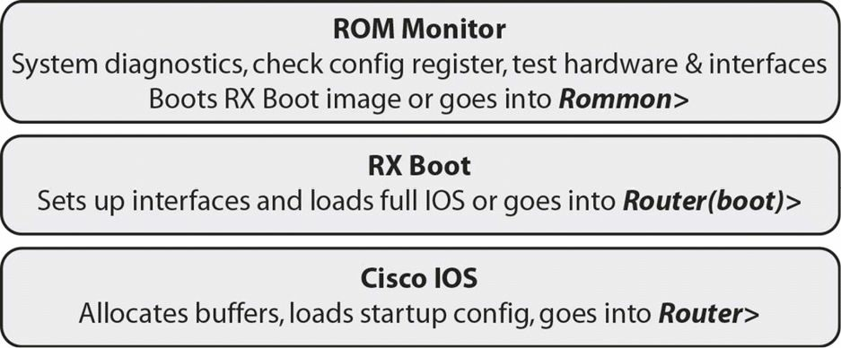
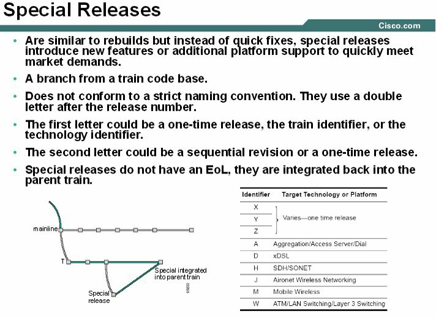

#第35天

**系统引导与IOS**

##第35天任务

- 阅读以下今天的课文
- 复习昨天的课文
- 完成后面的实验
- 阅读ICND2记诵指南

架构（architecture）指的是制造路由器所用的部件，以及在路由器启动过程中它们的用法。这些知识全是一名思科CCNA工程师所要掌握的基础知识，思科CCNA工程师需要知道路由器中的各种存储器完成什么功能，以及怎样使用IOS命令来对各种存储器进行备份或对其存储内容进行操作。

今天将学习以下内容：

- 路由器存储器及各种文件
- 管理IOS

本课程对应了以下ICND2大纲要求：

- 对思科IOS路由器的启动过程进行描述
- 加电自检过程，Power-On Self-Test, POST
- 路由器的启动过程，Router bootup process
- 管理思科IOS的各种文件
- 各种启动选项，Boot preferences
- 各种思科IOS镜像，Cisco IOS images(15)
- 软件许可，licensing
- 展示/修改许可证，show/change license

##路由器存储与各种文件

下图35.1对路由器内部的主要存储器部件进行了演示。每种存储器都扮演了不同角色，且包含了不同的文件：


*图 35.1 -- 路由器的各种存储器部件*

在将路由器盖子打开后，在其内部常能见到不同的存储器插槽。还能发现一些闪存卡插在路由器插槽中。


*图35.2 -- 在某台路由器主板上的DRAM单列直插内存模组（Dynamic Random Access Mememory Single In-line Mememory Module on a Router Motherboard）*

以下是每种内存及文件类型的作用：

引导ROM（boot ROM）-- 是电可擦可编程只读存储器（Electrically Erasable Programmable Read-Only Mememory, EEPROM,, 一种掉电后数据不丢失的存储芯片），用于启动图/Rommon（startup diagram/Rommon）的存储及IOS的装入。在路由器启动是，如缺少IOS文件，那么就会启动要一种叫做Rommon的紧急模式（an emergency mode），此模式下允许输入一些有限的几个命令，以对路由器进行恢复及装入其它IOS。此模式又叫做启动模式（bootstrap mode），在以下两种路由器提示符下，就可以明白是在此模式：

```
>
Rommon>
```

非易失性随机访问存储器（Non-Volatile Random Access Mememory, NVRAM) -- 用于启动配置与配置寄存器的存储。启动配置是用于存储已保存的路由器配置的文件。其在路由器重启是不被擦除。

闪存/PCMCIA（Personal Computer Mememory Card International Association）卡 -- 包含了IOS及一些配置文件。闪存存储器还被当作EEPROM， 同时思科IOS就以某种压缩形式存放在这里。在闪存容量充足时，甚至可以在闪存存储器上保存多个版本的思科IOS。

DRAM（内存）-- 也就是RAM，其存储完整的IOS、运行中的配置，及路由表。其为运行内存，在路由器重启后数据被擦除。

ROM监测程序（ROM Monitor）-- 用于系统诊断及启动。ROM监测程序中有着名为启动器或启动帮助器的一套甚为小型的代码，用于对安装的各种存储器及接口进行检查（The ROM Monitor has a very small code called bootstrap or boothelper in it to check for attached mememory and interfaces）。

RxBoot程序 -- 小型的IOS（Mini-IOS）, 在此程序模式下允许上传一个完整的IOS。其又被称为启动装载器（the boot loader），可用于完成一些路由器维护操作（参见[这里](http://www.cisco.com/image/gif/paws/10252/13.pdf)）。

路由器配置 -- 尽管严格来说这并非一类路由器组件，其存储在NVRAM中，在启动是拉入到DRAM中。可将DRAM中的配置，经由命令`copy run start`，放入到NVRAM，同时也可以使用命令`copy start run`，将NVRAM中的配置文件放到内存中。

配置寄存器（the Configuration Register）-- 设置启动中的一些指令（sets instructions for booting）。因为在实验中要对用到的路由器上的配置寄存器进行修改（比如无配置的干净启动），或是要完成一次口令恢复，所以对配置寄存器的掌握是非常重要的。虽然在某些模型上有所不同，但下面是两个最常见的设置：

- 配置寄存器值`0x2142` -- 启动并忽略启动配置
- 配置寄存器值`0x2102` -- 正常启动

通过命令`show version`，就可以查看到当前的配置寄存器设置：

```
Router#show version
Cisco Internetwork Operating System Software
IOS (tm) 2500 Software (C2500-JS-L), Version 12.1(17), RELEASE SOFTWARE (fc1) Copyright (c) 1986-2002 by Cisco Systems, Inc.
Compiled Wed 04-Sep-02 03:08 by kellythw Image text-base: 0x03073F40, data-base: 0x00001000
ROM: System Bootstrap, Version 11.0(10c)XB2, PLATFORM SPECIFIC RELEASE SOFTWARE (fc1) BOOTLDR: 3000 Bootstrap Software (IGS-BOOT-R), Version 11.0(10c)XB2, PLATFORM SPECIFIC RELEASE SOFTWARE (fc1)

Router uptime is 12 minutes
System returned to ROM by reload
System image file is “flash:c2500-js-l.121-17.bin”

Cisco 2500 (68030) processor (revision L) with 14336K/2048K bytes of memory.
Processor board ID 01760497, with hardware revision 00000000 Bridging software.
X.25 software, Version 3.0.0.
SuperLAT software (copyright 1990 by Meridian Technology Corp).
TN3270 Emulation software.
2 Ethernet/IEEE 802.3 interface(s)
2 Serial network interface(s)
32K bytes of non-volatile configuration memory.
16384K bytes of processor board System flash (Read ONLY)

Configuration register is 0x2102
```

命令还现实了该路由器已在线多长时间及上次重启的原因--在对启动问题进行故障排除时，这些信息是有用的。

```
Router uptime is 12 minutes
System returned to ROM by reload
```

同时改命令将显示处路由器上不同类型的存储器：

```
Router#show version
Cisco Internetwork Operating System Software
IOS (tm) 2500 Software (C2500-IS-L), Version 12.2(4)T1, RELEASE SOFTWARE Copyright (c) 1986-2001 by Cisco Systems, Inc.

ROM: System Bootstrap, Version 11.0(10c), SOFTWARE← ROM code
BOOTLDR: 3000 Bootstrap Software (IGS-BOOT-R), Version 11.0(10c)
System image file is “flash:c2500-is-l_122-4_T1.bin”← Flash image
Cisco 2522 (68030) processor CPU← CPU
with 14336K/2048K bytes of memory. ← DRAM
Processor board ID 18086064, with hardware revision 00000003
32K bytes of non-volatile configuration memory.← NVRAM
16384K bytes of processor System flash (Read ONLY) ← EEPROM/FLASH
```

下面是路由器启动过程的一个图形化再现：


*图 35.3 -- 路由器的启动过程*

##管理IOS

做好一些简单的路由器及交换机日常工作，就可避免许多的网络灾难（many network disasters could have been avoided with simple router and switch housekeeping）。如路由器配置文件对于你及你的业务比较重要，那么就应对其进行备份。

如觉得路由器的当前的运行配置，可作为工作版本，就可以使用命令`copy run start`，将其拷贝到NVRAM中。

而为了将该路由器配置保存起来，就需要在网络上保有一台运行着TFTP服务器软件的PC及或服务器。可从诸如SolarWinds这类公司下载到免费版的TFTP服务器软件。升级闪存镜像也需要有TFTP服务器。

路由器配置可在路由器或网络上的PC机或服务器之间移动。路由器上的运行配置保存在DRAM中。对配置做出的任何修改，都将保存在DRAM中，此时由于任何的原因而导致的重启，这些运行配置都会丢失。

你可以将运行配置拷贝到一台运行了TFTP服务器软件的PC机或服务器上：

```
Router#copy startup-config tftp:← You need to include the colon
```

还可以将IOS镜像复制到某台TFTP服务器上。如要将服务器IOS更新到另一较新版本，就必须要这么做，以防新版本可能带来的问题（管理员经常将一个路由器现有闪存装不下的IOS镜像放上去）。

```
Router#copy flash tftp:
```

路由器将提示输入TFTP服务器的IP地址，建议服务器与路由器位处同一子网。而如打算从TFTP服务器下载IOS镜像，就只需简单地逆转一下命令即可：

```
Router#copy tftp flash:
```

这些命令的问题在于大多数工程师一年也就用两三次，或者只在出现网络灾难时才用到。通常，你会发现在你的网络宕机时，互联网接入也没有了，所以必须要将路由器存储器中将它们备份出来！

作者强烈建议在家庭网络上对配置完成一些备份及恢复的联系。此外，还建议观看一下作者在Youtube上的恢复实验：

[www.youtube.com/user/paulwbrowning](http://www.youtube.com/user/paulwbrowning)

通过`show version`或`show flash`命令, 或者经由`dir flash:`进入到flash目录，进入到flash目录将显示出闪存中所有的文件，就可以查看到闪存的文件名。

```
RouterA#show flash
System flash directory:
File    Length      Name/status
1       14692012    c2500-js-l.121-17.bin
[14692076 bytes used, 2085140 available, 16777216 total]
16384K bytes of processor board System flash (Read ONLY)
```

作者本打算对此方面进行深入，但你应着重于CCNA考试本身及日常工作。不过灾难恢复应在深入研究及实验的目标清单当中。

##各种启动选项

**Booting Options**

在路由器启动时，有着许多可选选项。通常在闪存中都只有一个IOS镜像，因此路由器将使用那个镜像进行启动。在有着多个镜像，或者路由器闪存对于镜像太小而无法放下镜像时，就可能需要路由器从网络上的某台保存了IOS镜像的TFTP服务器启动了。

取决于所要配置的启动选项，命令可能有些许不同。所以要在一台开启的路由器上对所有选项都进行尝试。

```
RouterA(config)#boot system ?
WORD           TFTP filename or URL
flash          Boot from flash memory
mop            Boot from a Decnet MOP server
ftp            Boot from server via ftp
rcp            Boot from server via rcp
tftp           Boot from tftp server
```

对于闪存来说：

```
RouterA(config)#boot system flash ? WORD System image filename <cr>
```

而对于TFTP：

```
Enter configuration commands, one per line. End with CNTL/Z.
RouterB(config)#boot system tftp: c2500-js-l.121-17.bin ? Hostname or A.B.C.D Address from which to download the file <cr>
RouterA(config)#boot system tftp:
```

##启动过程及加电自检

**Booting Process and POST**

一次标准的路由器启动顺序，看起来像下面这样：

1. 设备开机并将首先执行加电自检（Power on Self Test）动作。加电自检对硬件进行测试，以确保所有组件都不缺少且是正常的（包括各种接口、存储器、CPU、专用集成电路(ASICs)等等）。加电自检程序是存储在ROM中，并自ROM运行的。

2. 启动引导程序（the bootstrap）查找并装入思科IOS软件。启动引导程序是ROM中的一个程序，用于执行一些其它程序，并负责查找各个IOS软件所处位置，接着就装入IOS镜像文件。启动引导程序找到思科IOS软件并将其装入到RAM中。思科IOS文件可在这三个地方找到：闪存、某台TFTP服务器，或在启动配置文件中所指定的另一位置。在所有思科路由器中，IOS软件默认都是从闪存装入的。要从其它位置进行装入，就必须对配置设置进行修改。

3. IOS软件在NVRAM中查找一个可用的配置文件（也就是启动配置文件(the startup-config file)）。

4. 如在NVRAM中确实有着一个启动配置文件，路由器就会装入此文件，此时路由器就将成为可运作的了。而如果在NVRAM中没有启动配置文件，路由器将启动设置模式的配置（the setup-mode configuration）。

在运行路由器上所作的任何修改，就将保存在RAM中，这里就需要手动执行命令`copy running-config startup-config`，令到当前配置作为在每次启动路由器时的启动配置。

##IOS许可

**IOS Licensing**

自思科为其第一台路由器构建首个互联网络操作系统（the first Internetwork Operating System, IOS）以来，其都遵循了以下方式：每种型号的路由器都有着其自己的版本与软件发布构建。大的版本都赋予了12.0的编号系统。对这些版本的改动，就被编号作12.1、12.2等等。这些小的版本是一些漏洞修复，或对一些模块的支持及引入其它特性，比如12.1(1a)。

不幸的是，随着支持的加入以及漏洞的修复，这些发布就被拆分成了路线，以致每个型号有其自己的IOS，这样就导致许多不同版本与发布（unfortunately, as support was added and bugs fixed, the releases were split into trains so each model had it's own IOS, which led to various versions and releases）。假如需要一个安全或是语音镜像，那么就必须购买对于手头路由器正确版本的特定镜像，同时有着正确的特性支持与漏洞修复。

思科公司最终发布了完整的训练工具与演示，这样就可以搞清楚IOS软件的命名约定、发布级别及支持的模块（the naming conventions, release levels, and supported modules）。而根据软件的测试及成熟情况，其还有着不同的名字，比如ED表示处于早期部署阶段(Early Deployment，ED)，而GD则表示处于一般部署阶段（General Deployment, GD）！这些对于消费者来讲都是非常迷惑的。下面是一张从思科官方文档中摘取的对IOS发布进行解释的图片：


*图 35.4 -- IOS软件的特别发布，IOS Special Releases(Image Copyright Cisco Systems Inc.)*

作者在思科技术支持中心（Technical Assistant Center, TAC）就解决了数不清的那些买了一台路由器及一套IOS软件，却发现到手的产品无法支持其对网络设施所要求的那些特性，而迷惑的或是愤怒的客户。还要记住对于大型、企业网络，必须要提前数月来安排IOS升级，把IOS升级放到一个很小的维护窗口。

##一个新的型号

**A New Model**

思科公司现在已经改变了其IOS型号，且从IOS发布12跳到了15（Cisco have now changed their IOS model and jumped from IOS release 12 to 15）。当前，对于每个型号的路由器，有着一个通用镜像。此镜像有着你需要的所有特性，但为了获取到那些真正所需的高级特性的使用，就需要购买适当的许可证，并在具体设备上对许可证加以验证。这样做的目的是为了思科公司及其客户的便利，以及阻止对思科软件的窃取与未授权共享，可以想象，这些思科软件是花了可观成本去开发的。

购买自思科（零售商）的所有新型号路由器，都带有安装好的基础镜像，以及启用了的许可证。而如果客户想要开启高级安全或是语音特性，那么就需要开启这些特性。这通常是经由使用一个名为思科许可证管理器（Cisco License Manager, CLM）的免费思科应用完成的。在[Cisco.com](http://www.cisco.com/)网站可轻易搜寻到此应用：


*图 35.5 -- 思科许可证管理器的下载页面*

可在某台允许客户在他们的设备与思科公司的许可证门户之间进行操作的服务器或主机上，安装CLM。CLM专注于对当前许可证及各台设备的特性的跟踪，使用图形界面。


*图 35.6 -- 思科许可证管理器的图形界面（Image Copyright Cisco Systems Inc.）*

##许可证的激活

**License Activation**

每种型号的思科路由器（支持许可证的），都已分配了一个叫做唯一设备标识符（the unique device identifier, UDI）的，唯一识别编号（a unique identifying number）。唯一设备标识符是由序列号及产品身份证组成的（this is compromised of the serial number(SN) and the product identification(PID)）。执行`show license udi`命令，来查看此信息。

```
Router#show license ?
all        Show license all information
detail     Show license detail information
feature    Show license feature information
udi        Show license udi information
Router#show license udi
Device#   PID               SN              UDI
--------------------------------------------------------------------
*0        CISCO1941/K9      FTX15240000     CISCO1941/K9:FTX15240000
```

在[www.cisco.com/go/license](http://www.cisco.com/go/license)处将IOS于思科公司进行注册时，就需要输入UDI。还需要把由经销商在你为IOS付款后提供给你的许可证（产品授权密钥，Product Authorization Key, PAK）加入进去，此许可证将与UDI进行比对检查。在验证通过后，思科将发送给你一封许可证密钥的电子邮件。

在下面可以看到有哪些特性也被激活。特性`ipbasek9`将总是开启的。

```
Router#show license all
License Store: Primary License Storage
StoreIndex: 0   Feature: ipbasek9                   Version: 1.0
        License Type: Permanent
        License State: Active, In Use
        License Count: Non-Counted
        License Priority: Medium
License Store: Evaluation License Storage
StoreIndex: 0   Feature: securityk9                Version: 1.0
        License Type: Evaluation
        License State: Inactive
            Evaluation total period: 208 weeks 2 days
            Evaluation period left: 208 weeks 2 days
        License Count: Non-Counted
        License Priority: None
StoreIndex: 1   Feature: datak9                     Version: 1.0
        License Type:
        License State: Inactive
            Evaluation total period: 208 weeks 2 days
            Evaluation period left: 208 weeks 2 days
        License Count: Non-Counted
        License Priority: None
```

命令`show license feature`将打印出已开启的特性摘要信息：

```
Router#show license feature
Feature name        Enforcement  Evaluation  Subscription   Enabled
ipbasek9            no           no          no             yes
securityk9          yes          yes         no             no
datak9              yes          no          no             no
```

一旦许可证得到验证，就必须通过U盘或网络服务器，及在命令行执行`license install [url]`, 将该许可证密钥添加到路由器。需要注意“.lic”这个文件名。

```
Router#dir usbflash0:

Directory of usbflash0:/

   1  -rw-        3064  Apr 18 2013 03:31:18 +00:00  FHH1216P07R_20090528163510702.lic

255537152 bytes total (184524800 bytes free)
Router#
Router#license install usbflash0:FHH1216P07R_20090528163510702.lic
Installing...Feature:datak9...Successful:Supported
1/1 licenses were successfully installed
0/1 licenses were existing licenses
0/1 licenses were failed to install
Router#
*Jun 25 11:18:20.234: %LICENSE-6-INSTALL: Feature datak9 1.0 was installed in this device. UDI=CISCO2951:FHH1216P07R; StoreIndex=0:Primary License Storage
*Jun 25 11:18:20.386: %IOS_LICENSE_IMAGE_APPLICATION-6-LICENSE_LEVEL: Module name = c2951 Next reboot level = datak9 and License = datak9
```

此时将必须重启该路由器，以激活新的特性集。


##第35天问题

1. Which files would you usually find in DRAM?
2. Where is the compressed IOS held?
3. You want to boot the router and skip the startup configuration. Which command do you use to modify the configuration register?
4. Which command puts the running configuration into NVRAM?
5. Which command will copy your startup configuration onto a network server?
6. You want to boot your router from a network server holding the IOS. Which command will achieve this?
7. The universal image includes all the feature sets you require, but in order to gain access to the advanced features you need to buy the appropriate license and verify it on the actual device. True or false?
8. The ROM monitor has a very small code called bootstrap or boothelper in it to check for attached memory and interfaces. True or false?
9. Which command do you use to view the files stored on the flash memory on a Cisco router?
10. What is the purpose of the POST?


##第35天答案

1. Uncompressed IOS, running configuration, and routing tables.
2. On the flash memory.
3. The `config-register [version]` command in Global Configuration mode.
4. The `copy run start` command.
5. The `copy start tftp:` command.
6. The `boot system [option]` command.
7. True.
8. True.
9. The `show flash/dir` command.
10. The POST tests the hardware in order to verify that all the components are present and healthy (interfaces, memory, CPU, ASICs, etc.).


##第35天实验

对本课程模块中讲到的那些配置命令进行测试：

- 在某台思科设备上执行一下`show version`命令，并对输出进行检查；将这些输出项与课程中详细解释进行联系

- 将启动配置拷贝到一台TFTP服务器上

- 从某台TFTP服务器拷贝配置文件到路由器上

- 从某台TFTP服务器拷贝一个IOS镜像到路由器的闪存中

- 使用`show flash`命令，对闪存中的内容进行检查

- 以`boot system flash: [name]`命令，使用新的IOS文件启动设备

访问[www.in60days.com](http://www.in60days.com/)网站，免费观看作者完成此实验。
