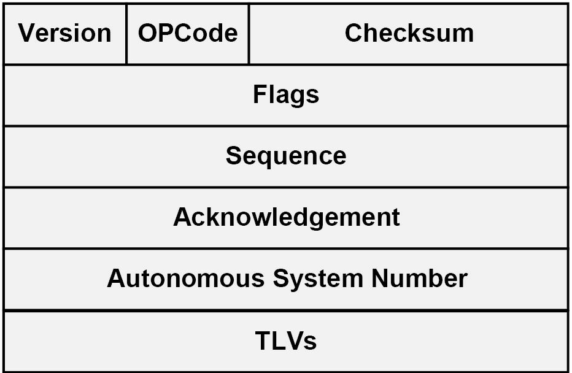
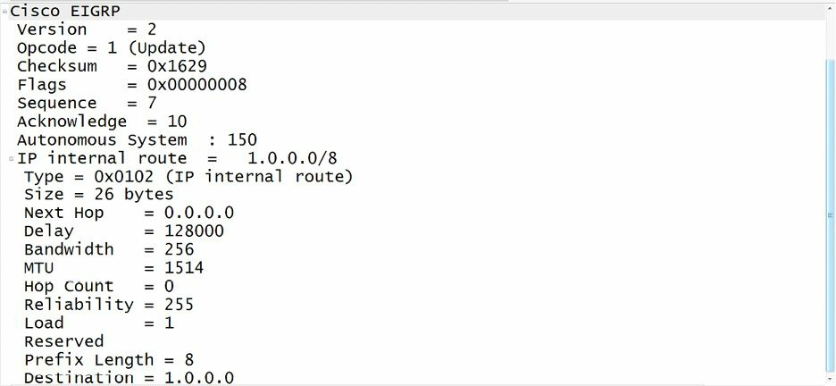
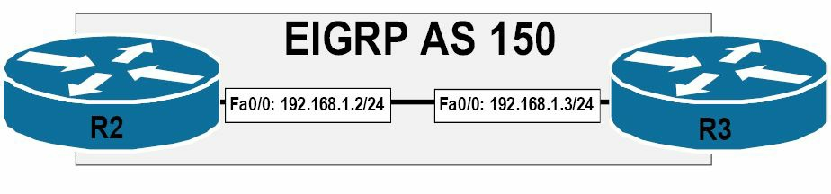
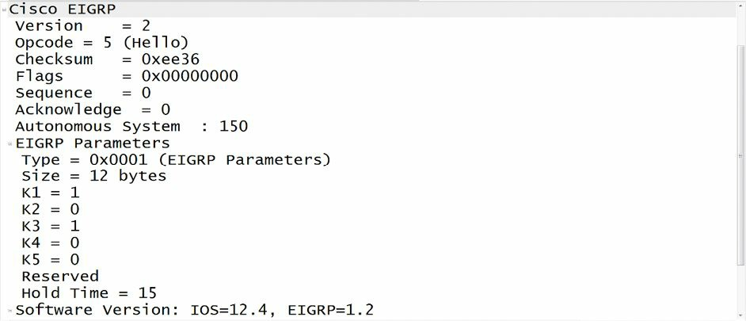
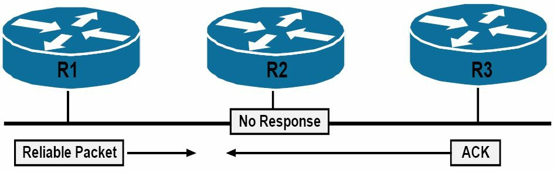
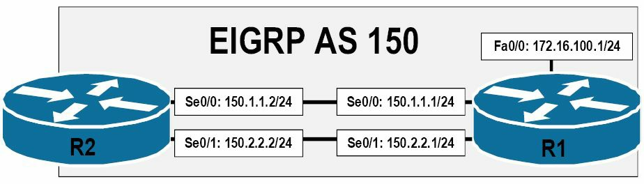
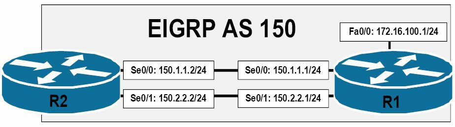

#第36天

**增强的内部网关路由协议**

**Enhanced Interior Gateway Routing Protocol, EIGRP**

##第36天任务

- 阅读今天的课文
- 复习昨天的课文
- 完成今天的实验
- 阅读ICND2记诵指南

增强的内部网关路由协议是一种有思科开发的专有的内部网关协议（a proprietary Interior Gateway Protocol(IGP) that was developed by Cisco）。EIGRP包含了那些传统的距离矢量特性，比如水平拆分（split horizon），还包含了与那些被链路状态路由协议所用到的类似特性，比如增量更新（EIGRP includes traditional Distance Vector characteristics, such as split horizon, as well as characteristics that are similar to those used by Link State routing protocols, such as incremental updates）。

尽管有着链路状态路由协议的一些特性，EIGRP是被分到距离矢量路由协议类别中的，被指为**一种高级的距离矢量路由协议**。EIGRP**直接在IP上运行，使用协议编号88**。

今天将学习以下内容：

- 思科公司EIGRP概述与基础知识, Cisco EIGRP overview and fundamentals
- EIGRP配置基础, EIGRP configuration fundamentals
- EIGRP的各种报文, EIGRP messages
- EIGRP的邻居发现与邻居维护, EIGRP neighbour discovery and maintenance
- 各种度量值、弥散更新算法（DUAL）与拓扑表，Metrics, DUAL, and the topology table
- 相等与不相等开销下的负载均衡，equal cost and unequal cost load sharing
- 采用EIGRP作为默认路由，default routing using EIGRP
- EIGRP网络中的水平分割
- EIGRP的存根路由，EIGRP stub routing
- EIGRP的路由汇总，EIGRP route summarisation
- 掌握被动接口，understanding passive interfaces
- 掌握EIGRP路由器ID的用法，understanding the use of the EIGRP router ID
- EIGRP的日志与报表，EIGRP logging and reporting

本课程对应了以下CCNA大纲要求：

- 配置并验证EIGRP（单一自治系统），configure and verify EIGRP(single AS)
- 可行距离/可行的后续路由/报告的距离/通告的距离分别是什么，Feasible Distance/Feasible Successor routes/Reported Distance/Advertised Distance
- 可行性条件，Feasiblity condition
- 度量值综合，Metric composition
- 路由器ID，Router ID
- 自动汇总，Auto summary
- 路径选择，path selection
+ EIGRP的负载均衡，load balancing
    - 开销一样时
    - 开销不同时
- 什么是EIGRP的被动接口，passive interfaces

##思科EIGRP概述与基础知识

为解决其先前专有的距离矢量路由协议，内部网关路由协议（Interior Gateway Routing Protocol, IGRP）的某些缺陷，思科公司就开发了EIGRP。IGRP相比路由信息协议（Routing Information Protocol, RIP），确实有着一些改进，比如对更多跳数的支持；但IGRP仍有着那些传统距离矢量路由协议的局限，这些局限如下所示：

- 发送完整的周期性路由更新，sending full periodic routing updates
- 跳数限制，a hop limitation
- 缺少对变长子网掩码的支持，the lack of VLSM support
- 收敛速度慢，slow convergence
- 缺少防止环回形成的机制，the lack of loop prevention mechanisms

与往邻居发送包含了所有路由信息的周期性路由更新的传统距离矢量路由协议不同，EIGRP发送的是非周期性的增量式路由更新，以将路由信息在整个路由域中分发（unlike the traditional Distance Vector routing protocols, which send their neighbours periodic routing updates that contain all routing information, EIGRP sends non-periodic incremental routing updates to ditribute routing information throughout the routing domain）。只有在网络拓扑发生变化时，才会发送EIGRP的增量更新。

默认RIP（一种以前的CCNA考试项目）有着15的跳数限制，这就令到RIP只适合与较小的网络。EIGRP默认跳数限制为100; 但此数值可被管理员在配置EIGRP时，使用路由器配置命令`metric maximum-hops <1-255>`, 予以手动调整。这就令到EIGRP具备对有着多达数百台路由器的网络的支持能力，使其具备了更大的可伸缩性，从而对较大型网络也是适合的。

增强的IGRP采用了两个独特的类型/长度/数值三联体数据结构来表示和传输路由条目（Enhanced IGRP uses two unique Type/Length/Value(TLV) triplets to carry route entries）。这两个TLVs分别是内部EIGRP路由TLV与外部EIGRP路由TLV， 分别用于内部及外部的EIGRP路由。两种TLVs都包含了一个8位的前缀长度字段（an 8-bit Prefix Length field）, 用于指明用于目的网络子网掩码的位数。包含在此字段中的该信息，就令到EIGRP能够支持不同的子网划分了。

增强的IGRP比起传统的距离矢量路由协议收敛得快得多。除了仅仅依赖于计时器，EIGRP还使用其拓扑表中的信息，来找出那些替代路径。EIGRP亦能在未能于本地路由器的拓扑表中找出替代路径的情况下，想邻居路由器查询信息。本课程模块后面会讲到EIGRP的拓扑表。

而为了确保整个网络中没有环回路径，EIGRP使用了弥散更新算法（Diffusing Update Algorithm, DUAL），使用此算法来对邻居通告的所有路由进行追踪，并随后选出到目的网络最优的无环回路径。弥散更新算法是EIGRP的一个核心概念，将在本课程模块的稍后讲到。

##EIGRP配置基础

**EIGRP Configuration Fundamentals**

在思科IOS软件中，是通过使用全局配置命令`router eigrp [ASN]`，来开启增强的IGRP的。关键字`[ASN]`指定EIGRP的自治系统编号（autonomous system number, ASN），这是一个32位整数，大小介于1-65535之间。除了本章后面将涉及的其它因素之外，**运行EIGRP的那些路由器都必须位处同一自治系统中**，以成功形成邻居关系。在全局配置命令`router eigrp [ASN]`之后, 路由器就转变为EIGRP路由器配置模式（EIGRP Router Configuration mode）了，在这里就可以对那些跟EIGRP有关的参数进行配置了。所配置的ASN，可在命令`show ip protocols`的输出中进行验证，如下面所示：

```
R1#show ip protocols
Routing Protocol is “eigrp 150”
    Outgoing update filter list for all interfaces is not set
    Incoming update filter list for all interfaces is not set
    Default networks flagged in outgoing updates
    Default networks accepted from incoming updates
    EIGRP metric weight K1=1, K2=0, K3=1, K4=0, K5=0
    EIGRP maximum hopcount 100
    EIGRP maximum metric variance 1
...


[Truncated Output]
```

而除了`show ip protocols`命令，命令`show ip eigrp neighbours`会打印出所有EIGRP邻居，以及这些邻居各自自治系统的信息。该命令及其可用选项，将在本课程模块的后面进行详细讲解。在那些运行了多个EIGRP实例的路由器上，可使用`show ip eigrp [ASN]`命令，来查看只与在此命令中所指定的自治系统有关的信息。下面的输出演示了这个命令的使用：

```
R1#show ip eigrp 150 ?
  interfaces  IP-EIGRP interfaces
  neighbors   IP-EIGRP neighbors
  topology    IP-EIGRP topology table
  traffic     IP-EIGRP traffic statistics
```

在上面的输出中，150就是自治系统编号（ASN）。如`show ip eigrp`命令没有指定自治系统，那么在思科IOS软件中该命令默认将打印出所有EIGRP实例的信息。

而一旦处于路由器配置模式（Router Configuration mode），就要使用`network`命令，来指明要在哪些网络（接口上）开启EIGRP路由了（once in Router Configuration mode, the `network` command is used to specify the network(s) (interfaces) for which EIGRP routing will be enabled）。在使用`network`命令并指明了一个大的有类网络后，该启用了EIGRP的路由器将完成以下动作：

- 位处该指明的有类网络范围的那些网络上的EIGRP被开启，EIGRP is enabled for networks that fall within the specified classful network range.
- 利用这些直连子网，生成一个拓扑表，the topology table is populated with these directly connected subnets.
- 从这些子网相关的接口，发出EIGRP Hello 数据包，EIGRP Hello packets are sent out of the interfaces associated with these subnets.
- EIGRP将这些网络，经由更新报文，通告给EIGRP邻居，EIGRP advertises the network(s) to EIGRP neighbours in Update messages.
- 在报文交换的基础上，EIGRP的那些路由，此时就被加入到IP路由表中，Based on the exchange of messages, EIGRP routes are then added to the IP routing table.

如EIGRP已开启使用，且将路由器配置命令`network`与大的有类`10.0.0.0/8`网络一道进行了使用，同时**所有4个环回接口**（all four Loopback interfaces）又都开启了EIGRP路由的话，那么下面就给出了此种情况下`show ip eigrp interfaces`的输出演示：

```
R1#show ip eigrp interfaces
IP-EIGRP interfaces for process 150
                     Xmit Queue   Mean    Pacing Time    Multicast      Pending
Interface      Peers Un/Reliable  SRTT    Un/Reliable    Flow Timer     Routes
Lo0            0         0/0         0        0/10            0             0
Lo1            0         0/0         0        0/10            0             0
Lo2            0         0/0         0        0/10            0             0
Lo3            0         0/0         0        0/10            0             0
```

可使用`show ip protocols`命令，来对大的有类`10.0.0.0/8`网络上EIGRP的启用情况，进行验证。此命令的输出如下所示：

```
R1#show ip protocols
Routing Protocol is “eigrp 150”
    Outgoing update filter list for all interfaces is not set
    Incoming update filter list for all interfaces is not set
    Default networks flagged in outgoing updates
    Default networks accepted from incoming updates
    EIGRP metric weight K1=1, K2=0, K3=1, K4=0, K5=0
    EIGRP maximum hopcount 100
    EIGRP maximum metric variance 1
    Redistributing: eigrp 150
    EIGRP NSF-aware route hold timer is 240s
    Automatic network summarization is in effect
    Maximum path: 4
    Routing for Networks:
        10.0.0.0
    Routing Information Sources:
        Gateway         Distance    Last Update
    Distance: internal 90 external 170
```

使用命令`show ip eigrp topology`，可查看到EIGRP的拓扑表。此命令的输出如下所示：

```
R1#show ip eigrp topology
IP-EIGRP Topology Table for AS(150)/ID(10.3.3.1)
Codes: P - Passive, A - Active, U - Update, Q - Query, R - Reply,
       r - reply Status, s - sia Status
P 10.3.3.0/24, 1 successors, FD is 128256
        via Connected, Loopback3
P 10.2.2.0/24, 1 successors, FD is 128256
        via Connected, Loopback2
P 10.1.1.0/24, 1 successors, FD is 128256
        via Connected, Loopback1
P 10.0.0.0/24, 1 successors, FD is 128256
        via Connected, Loopback0
```

> **注意**：本课程模块稍后会对拓扑表、EIGRP的Hello数据包及更新数据包进行详细讲解。本小节仅着重于EIGRP的配置实施（EIGRP configuration implementation）。

使用`network`命令来指明一个大的有类网络（a major classful network），就令到位于该有类网络中的多个子网，得以在最小配置下同时被通告出去。但可能存在管理员不想对某个有类网络中的所有子网，都开启EIGRP路由的情形。比如，参考前一示例中R1上所配置的环回接口，假设只打算对`10.1.1.0/24`及`10.3.3.0/24`子网开启EIGRP路由，而不愿在`10.0.0.0/24`及`10.2.2.0/24`开启EIGRP路由。那么很明显这在使用`network`命令时，对这些网络（也就是`10.1.1.0`及`10.3.3.0`）予以指明就可以做到，思科IOS软件仍会将这些语句，转换成大的有类`10.0.0.0/8`网络，如下所示：

```
R1(config)#router eigrp 150
R1(config-router)#network 10.1.1.0
R1(config-router)#network 10.3.3.0
R1(config-router)#exit
```

尽管有着上面的配置，但`show ip protocols`命令给出的确实下面的输出：

```
R1#show ip protocols
Routing Protocol is “eigrp 150”
    Outgoing update filter list for all interfaces is not set
    Incoming update filter list for all interfaces is not set
    Default networks flagged in outgoing updates
    Default networks accepted from incoming updates
    EIGRP metric weight K1=1, K2=0, K3=1, K4=0, K5=0
    EIGRP maximum hopcount 100
    EIGRP maximum metric variance 1
    Redistributing: eigrp 150
    EIGRP NSF-aware route hold timer is 240s
    Automatic network summarization is in effect
    Maximum path: 4
    Routing for Networks:
        10.0.0.0
    Routing Information Sources:
        Gateway     Distance        Last Update
Distance: internal 90 external 170
```

> **注意**：一个常见的误解就是，关闭EIGRP的自动汇总特性，就能解决此问题；但是，这与`auto-summary`命令一点关系都没有。比如，假设对在前一示例中的配置执行了`no auto-summary`命令，如下所示：

```
R1(config)#router eigrp 150
R1(config-router)#network 10.1.1.0
R1(config-router)#network 10.3.3.0
R1(config-router)#no auto-summary
R1(config-router)#exit
```

`show ip protocols`命令仍将显示对网络`10.0.0.0/8`开启了EIGRP，如下面的输出所示：

```
R1#show ip protocols
Routing Protocol is “eigrp 150”
    Outgoing update filter list for all interfaces is not set
    Incoming update filter list for all interfaces is not set
    Default networks flagged in outgoing updates
    Default networks accepted from incoming updates
    EIGRP metric weight K1=1, K2=0, K3=1, K4=0, K5=0
    EIGRP maximum hopcount 100
    EIGRP maximum metric variance 1
    Redistributing: eigrp 150
    EIGRP NSF-aware route hold timer is 240s
    Automatic network summarization is not in effect
    Maximum path: 4
    Routing for Networks:
        10.0.0.0
    Routing Information Sources:
        Gateway     Distance        Last Update
Distance: internal 90 external 170
```

为了提供到对那些开启EIGRP路由的网络进行更细粒度的控制，思科IOS软件支持在对EIGRP进行配置，将通配符掩码与`network`语句一起配合使用（in order to provide more granular control of the networks that are enabled for EIGRP routing, Cisco IOS software supports the use of wildcard masks in conjunction with the `network` statement when configuring EIGRP）。这里的通配符掩码，以与ACLs中用到的通配符掩码类似的方式运作，而与网络的子网掩码是不相干的。

作为一个示例，命令`network 10.1.1.0 0.0.0.255`将匹配到网络`10.1.1.0/24`、`10.1.1.0/26`及`10.1.1.0/30`网络。参考上一输出中所配置的那些环回借口（the Loopback interfaces），为将R1配置为对`10.1.1.0/24`及`10.3.3.0/24`子网开启EIGRP路由，且不对`10.0.0.0/24`子网或`10.2.2.0`子网开启，就应将其如下面那样进行配置：

```
R1(config)#router eigrp 150
R1(config-router)#network 10.1.1.0 0.0.0.255
R1(config-router)#network 10.3.3.0 0.0.0.255
R1(config-router)#exit
```

使用命令`show ip protocols`，就可对此配置进行验证，如下所示：

```
R1#show ip protocols
Routing Protocol is “eigrp 150”
    Outgoing update filter list for all interfaces is not set
    Incoming update filter list for all interfaces is not set
    Default networks flagged in outgoing updates
    Default networks accepted from incoming updates
    EIGRP metric weight K1=1, K2=0, K3=1, K4=0, K5=0
    EIGRP maximum hopcount 100
    EIGRP maximum metric variance 1
    Redistributing: eigrp 150
    EIGRP NSF-aware route hold timer is 240s
    Automatic network summarization is in effect
    Maximum path: 4
    Routing for Networks:
        10.1.1.0/24
        10.3.3.0/24
    Routing Information Sources:
        Gateway     Distance        Last Update
Distance: internal 90 external 170
```

此外，还可以使用命令`show ip eigrp interfaces`，确认到仅已对`Loopback1`与`Loopback3`开启了EIGRP路由：

```
R1#show ip eigrp interfaces
IP-EIGRP interfaces for process 150
                     Xmit Queue   Mean    Pacing Time    Multicast      Pending
Interface      Peers Un/Reliable  SRTT    Un/Reliable    Flow Timer     Routes
Lo1            0         0/0         0        0/10            0             0
Lo3            0         0/0         0        0/10            0             0
```

如上面所示，因为这里的通配符掩码配置，而仅在`Loopback1`和`Loopback3`上启用了EIGRP路由。

这里重要的是记住除了使用通配符掩码，也可以使用子网掩码来配置`network`命令。在此情况下，思科IOS软件将翻转子网掩码，而使用通配符掩码来保存该命令。比如，参照路由器上同样的环回借口，路由器R1也可被如下这样进行配置：

```
R1(config-router)#router eigrp 150
R1(config-router)#network 10.1.1.0 255.255.255.0
R1(config-router)#network 10.3.3.0 255.255.255.0
R1(config-router)#exit
```

基于此种配置，就在运行配置中输入了下面的参数（这里使用了管道（pipe），取得运行配置中感兴趣的部分）：

```
R1#show running-config | begin router eigrp
router eigrp 150
network 10.1.1.0 0.0.0.255
network 10.3.3.0 0.0.0.255
auto-summary
```

通过上面的配置可以看出，可与那些`show`命令一道运用管道，来获得更细的粒度。这对于那些有着编程知识的人来说，是一种熟悉的概念。

如将某个网络上的特定地址与通配符一起使用，那么思科IOS软件将执行一次逻辑与运算（a logical AND operation）, 从而确定出那个要启用EIGRP的网络。比如，在执行了`network 10.1.1.15 0.0.0.255`命令时，思科IOS软件会执行以下动作：

- 将通配符掩码翻转为子网掩码值`255.255.255.0`
- 执行一次逻辑与操作
- 将命令`network 10.1.1.0 0.0.0.255`加入到配置中

本示例中所用到的`network`配置，如下面输出所示：

```
R1(config)#router eigrp 150
R1(config-router)#network 10.1.1.15 0.0.0.255
R1(config-router)#exit
```

那么基于此配置，路由器上的运行配置，就会显示如下内容：

```
R1#show running-config | begin router eigrp
router eigrp 150
network 10.1.1.0 0.0.0.255
auto-summary
```

如上面的配置所示，不管是使用通配符子网掩码，还是子网掩码，都会在思科IOS软件中造成同样的操作，并得到同样的`network`语句配置。

> **真实世界的部署**

> 当在生产网络中对EIGRP进行配置时，**一般做法都是使用全0的通配符掩码或全1的子网掩码**。比如，`network 10.1.1.1 0.0.0.0`及`network 10.1.1.1 255.255.255.255`，两个命令都会执行同样的动作。全0的通配符掩码或全1的子网掩码的使用，就将思科IOS软件配置为与一个具体接口地址进行匹配，而不考虑在接口本身上所配置哦子网掩码了。这两个命令都会匹配到配置了比如`10.1.1.1/8`、`10.1.1.1/16`、`10.1.1.1/24`, 以及`10.1.1.1/30`等地址的接口。这些命令的用法如下面的输出所示：

```
R1(config)#router eigrp 150
R1(config-router)#network 10.0.0.1 0.0.0.0
R1(config-router)#network 10.1.1.1 255.255.255.255
R1(config-router)#exit
```

`show ip protocols`命令将验证到路由器对于两个`network`语句，都是以相似的方式进行处理的，如下所示：

```
R1#show ip protocols
Routing Protocol is “eigrp 150”
    Outgoing update filter list for all interfaces is not set
    Incoming update filter list for all interfaces is not set
    Default networks flagged in outgoing updates
    Default networks accepted from incoming updates
    EIGRP metric weight K1=1, K2=0, K3=1, K4=0, K5=0
    EIGRP maximum hopcount 100
    EIGRP maximum metric variance 1
    Redistributing: eigrp 150
    EIGRP NSF-aware route hold timer is 240s
    Automatic network summarization is in effect
    Maximum path: 4
    Routing for Networks:
        10.0.0.1/32
        10.1.1.1/32
    Routing Information Sources:
        Gateway     Distance        Last Update
Distance: internal 90 external 170
```

在使用了全1的子网掩码或全1的通配符掩码时，就会在所指定的（匹配的）接口上开启EIGRP，同时将通告那个接口所位处的网络。也就是说，EIGRP不会通告上面输出中的`/32`地址，而是通告基于配置在匹配接口上的子网掩码的具体网络。此配置的用法，是独立于配置在匹配的具体接口上的子网掩码的（when a subnet mask with all ones or a wildcard mask with all zeros is used, EIGRP is enabled for the specified(matched) interface and the network the interface resides on is advertised. In other words, EIGRP will not advertise the /32 address in the above but, instead, the actual network based on the subnet mask configured on the matched interface. The use of this configuration is independent of the subnet mask configuration on the actual interface matched）。


## EIGRP的各种报文

本小节将对EIGRP所用到的各种类型的报文进行说明。但是，在深入到各种不同报文类型前，首要的是对EIGRP数据包头部有扎实的掌握，这正是包含这些报文的地方。

###EIGRP数据包的头部

尽管对EIGRP数据包格式的具体了解，是超出CCNA考试要求的，但对EIGRP数据包头部的基本掌握，对于完整理解EIGRP这种路由协议的完整运作的，是很重要的。下图36.1对EIGRP数据包头部进行了演示：


*图 36.1 -- EIGRP数据包头部的各种字段*

在EIGRP数据包头部，其中的4位版本字段（the 4-bit Version field）用于表面该协议的版本。当前的思科IOS镜像都支持EIGRP版本`1.x`。后面的4为OPcode字段（the 4-bit OPCode field），则指定了EIGRP数据包或报文的类型。不同EIGRP数据包类型都被分配了一个唯一的OPcode数值，以将其与其它数据包类型进行区分。本课程模块后面会对这些报文类型进行说明。

而那个24位的校验和字段（the 24-bit Checksum field）, 是用于对该EIGRP数据包做完整性检查的（a sanity check）。该字段是给予完整的EIGRP数据包的, 而不包括IP头部。32位的标志字段（the 32-bit Flags field），用于表明该EIGRP数据包或报文是一个新的EIGRP邻居的`INIT`, 还是EIGRP的可靠传输协议（Reliable Transport Protocol, RTP）的有条件接受（the Conditional Receive, CR）的`INIT`。这里的RTP及CR都将在本课程模块稍后讲到。

后面的32为顺序字段（the 32-bit Sequence field）指定了EIGRP可靠传输协议所用到的顺序编号（the sequence number），用以可靠数据包的顺序投送。而32位的确认字段（the 32-bit Acknowledgment field），则被用于EIGRP可靠数据包的接收确认。

后面的32位自治系统编号字段（the 32-bit Autonomous System Number field）, 指定了该EIGRP域（the EIGRP domain）的自治系统编号（ASN）。最后的32为类型/长度/值三联体字段（the 32-bit Type/Length/Value(TLV) triplet field），就被用于路由条目的加载及EIGRP弥散更新算法信息的提供了。EIGRP支持几种不同类型的TLVs，最常用的是下面几种：

- 参数TLV, 有着建立邻居关系的那些参数，the Parameters TLV, which has the parameters to establish neighbour relationships
- 顺号TLV，RTP使用的TLV，the Sequence TLV, which is used by RTP
- 下一次多播序号TLV，RTP使用的TLV

> **注意**：并不要求对EIGRP的各种TLVs有详细了解。

下图36.2演示了一个抓包到的EIGRP数据包的所呈现的不同字段：


*图 36.2 -- 对EIGRP数据包头部的抓包*

在该EIGRP数据包头部，4位的OPCode字段被用于指定该EIGRP数据包或报文的类型。EIGRP使用到不同的报文或数据包类型，包括Hello数据包、确认数据包（Acknowledgment packets）、更新数据包（Update packets）、查询数据包（Query packets）、应答数据包（Reply packets）以及请求数据包（Request packets）。将在随后的小节对这些类型的数据包进行说明。

###Hello数据包

在某台路由器上对某个特定网络开启了增强的IGRP后，其就会发送Hello数据包（Enhanced IGRP sends Hello packets once it has been enabled on a router for a particular network）。这些报文被用于邻居的识别，同时邻居一经识别，Hello报文就用于在邻居直接作为一种保持活动机制，发挥作用（these messages are used to identify neighbours and, once identified, serve or function as a keepalive mechanism between neighbours）。EIGRP的邻居发现与维护机制，将在本课程模块的后面进行说明。

EIGRP的Hello数据包，是发送到链路本地多播组地址（the Link Local Multicast group address）`224.0.0.10`上。由EIGRP发出的Hello数据包，是不需要发出确认数据包来确认其已收到的（Hello packets sent by EIGRP do not require an Acknowledgment to be sent confirming that they were received）。因为Hello数据包不需要显式的确认，所以它们被分类为不可靠的EIGRP数据包（Hello packets are classified as unreliable EIGRP packets）。EIGRP Hello数据包的OPCode为5。

###确认数据包

一个EIGRP确认数据包，简单地就是一个不包含数据的EIGRP Hello数据包。EIGRP使用确认数据包来对EIGRP数据包的可靠送达进行确认。这些确认数据包（the ACK packets）总是发送到一个单播地址（a Unicast address）, 该地址就是可靠数据包发送方的源地址（the source address of the sender of the reliable packet），而并不是EIGRP的多播组地址了。此外，确认数据包将总是会包含一个非零的确认编号（a non-zero acknowledgment number）。确认数据包使用了Hello数据包相同的OPCode, 因为其本来就是一个不包含任何信息的Hello数据包。其OPCode为5。

###更新数据包

增强IGRP的更新数据包被用于传送目标的可达性（used to convey reachability of destinations）。也就是说，更新数据包包含了EIGRP的路由更新。在发现了一个新的邻居是，就会通过单播发出更新数据包（往该新的邻居），如此新的邻居就能够建立起自己的EIGRP拓扑表了。在其它比如某条链路的开销改变时，就会经由多播发出更新数据包。重要的是记住更新数据包都是可靠地传输的，且总是要求显式的确认。**分配给更新数据包的OPCode是1**。下图36.3演示了一个EIGRP的更新数据包：


*图 36.3 -- EIGRP的更新数据包*

> **注意**：并不要求对EIGRP各种数据包中的所包含的信息有深入了解。

###查询数据包

增强IGRP的查询数据包是多播的，并被用于请求可靠的路由信息。EIGRP的查询数据包是在某条路由不可用，但该路由器却需要为快速收敛而对该路由的状态进行应答时，发送给其邻居的数据包。如发出查询数据包的路由器未能从其所有邻居收到响应，其就会再度向那些未响应的邻居发出一次查询。如在16此尝试后都没有响应，那么EIGRP的邻居就被重置。本课程模块后面将对此概念进行更为深入的说明。**分配给EIGRP查询数据包的OPCode为3**。

###应答数据包

**Reply Packets**

增强IGRP的应答数据包是作为对查询数据包的响应发送的。应答数据包用于响应一个查询数据包。应答数据包是到查询发起方的单播数据包。**分配给EIGRP应答数据包的OPCode为4**。

###请求数据包

增强IGRP的请求数据包，是用于从一个或多个邻居处获取特定信息的，且是在一些路由服务器应用中用到的（used in roue server applications）。这些数据包既可通过单播、也可通过多播进行发送，但它们总是以不可靠方式传输的。也就是说，它们无需显式的确认。

> **注意**：尽管这里的Hello数据包和确认数据包是作为两种独立的数据包类型的，但重要的是记住在某些课本中，EIGRP的Hello数据包与确认数据包被认为是同一中类型的数据包。这是因为，正如在本小节中指出的那样，确认数据包就是不包含数据的Hello数据包。

命令`debug eigrp packets`可用于本小节中所讲到的各种不同EIGRP数据包的实时调试信息。要知道此命令还包括了一些这里并没有说到的其它数据包，因为这些其它类型的数据包是超出了当前CCNA考试要求的。下面的输出对此命令的用法进行了演示：

```
R1#debug eigrp packets ?
  SIAquery  EIGRP SIA-Query packets
  SIAreply  EIGRP SIA-Reply packets
  ack       EIGRP ack packets
  hello     EIGRP hello packets
  ipxsap    EIGRP ipxsap packets
  probe     EIGRP probe packets
  query     EIGRP query packets
  reply     EIGRP reply packets
  request   EIGRP request packets
  retry     EIGRP retransmissions
  stub      EIGRP stub packets
  terse     Display all EIGRP packets except Hellos
  update    EIGRP update packets
  verbose   Display all EIGRP packets
  <cr>
```

而`show ip eigrp traffic`命令，是用于对本地路由器所发送及接收到的EIGRP数据包的数量进行查看的命令。该命令同时还是一个强大的故障排除工具。比如，假设某路由器在发出Hello数据包，却并未收到任何回复，这就表明其尚未配置好预期的邻居，或者甚至有可能某个确认数据包阻塞了EIGRP数据包（For example, if the router is sending out Hello packets but is not receiving any back, this could indicate that the intended neighbour is not configured, or even that an ACK may be blocking EIGRP packets）。下面的输出对此命令进行了演示：

```
R2#show ip eigrp traffic
IP-EIGRP Traffic Statistics for AS 150
    Hellos sent/received: 21918/21922
    Updates sent/received: 10/6
    Queries sent/received: 1/0
    Replies sent/received: 0/1
    Acks sent/received: 6/10
    SIA-Queries sent/received: 0/0
    SIA-Replies sent/received: 0/0
    Hello Process ID: 178
    PDM Process ID: 154
    IP Socket queue: 0/2000/2/0 (current/max/highest/drops)
    Eigrp input queue: 0/2000/2/0 (current/max/highest/drops)
```

下表36.1对本小节中讲到的这些EIGRP的数据包进行了总结，以及各自是否以可靠或不可靠方式进行发送的：

*表 36.1 -- EIGRP数据包总结*

| 报文类型 | 说明 | 发送方式 |
| -- | -- | -- |
| Hello | 用于邻居发现、维护及保持存活 | 不可靠 |
| 确认数据包（Acknowledgment） | 用于对信息接收的确认 | 不可靠 |
| 更新数据包（Update） | 用于传达路由信息 | 可靠的 |
| 查询数据包（Query） | 用于请求指定的路由信息 | 可靠的 |
| 应答数据包（Reply） | 用于对查询数据包的响应 | 可靠的 |
| 请求数据包（Request） | 用于路由服务器应用中的信息请求 | 不可靠 |

##EIGRP的邻居发现与邻居维护

可将增强的IGRP配置为动态地发现相邻路由器（这是默认选项）（discover neighbouring routers dynamically），或者经由管理员手动配置来发现相邻路由器。下面的小节将对这两种方式，以及其它有关EIGRP邻居相关的话题，进行讨论。

###动态的邻居发现

动态的邻居发现，是通过往目的多播组地址（the destination Multicast group address）`224.0.0.10`, 发送EIGRP的Hello数据包完成的。动态邻居发现，又是紧跟着在路由器配置EIGRP时`network`命令的执行，而完成的。此外，如早先指出的那样，EIGRP数据包是直接透过IP、使用协议编号88发送的。下图36.4对此基本的EIGRP邻居发现与路由交换过程，进行了演示：


*图 36.4 -- EIGRP的邻居发现与路由交换，EIGRP Neighbour Discovery and Route Exchange*

参考图36.4, 在初始化时，这些EIGRP邻居便发出Hello数据包，以发现其它邻居（Referencing Figure 36.4, upon initialisation, the EIGRP neighbours send Hello packets to discover other neighbours）。随后这些邻居就通过完整更新，就其完整路由表进行交换。这些更新包含了所有已知路由的信息。因为更新包是可靠发送的，接收方就必须对其进行显式确认。

在这些邻居完成了它们的信息交换后，它们还将持续交换Hello数据包，以维护起邻居关系。除此之外，这些EIGRP邻居路由器此后就将仅发送增量更新了，通过增量更新来将其状态或路由变化，通告给它的邻居们。它们再也不会发送完整的更新给邻居们了。

明白仅简单地在两台或多台路由器上开启EIGRP，并不能确保邻居关系的建立，是重要的。而是还需一些参数要匹配，这样这些路由器才能成为邻居。在下面几种情况下，就不能建立EIGRP邻居关系：

- EIGRP认证参数不匹配（在有配置时），Mismatched EIGRP authentication parameters(if configured)
- EIGRP的那些K值不一致，Mismatched EIGRP K values
- EIGRP自治系统编号不一致，Mismatched EIGRP autonomous system number
- 在EIGRP邻居关系中，使用了接口的第二地址，Using secondary addresses for EIGRP neighbour relationships
- 邻居并不位于同一子网中，the neighbours are not on a common subnet

尽管`show ip eigrp neighbours`命令在动态与静态配置的邻居间没有区别，但**`show ip eigrp interfaces detail <name>` 命令却可以用于对路由器接口是否在发出多播数据包来发现和维护邻居关系，进行检查**。下面演示了在一台开启了动态邻居发现的路由器上该命令的输出：

```
R2#show ip eigrp interfaces detail FastEthernet0/0
IP-EIGRP interfaces for process 150
                      Xmit Queue   Mean   Pacing Time    Multicast      Pending
Interface      Peers  Un/Reliable  SRTT   Un/Reliable    Flow Timer     Routes
Fa0/0            1        0/0        1        0/1            50             0

  Hello interval is 5 sec
  Next xmit serial <none>
  Un/reliable mcasts: 0/2  Un/reliable ucasts: 2/2
  Mcast exceptions: 0  CR packets: 0  ACKs suppressed: 0
  Retransmissions sent: 1  Out-of-sequence rcvd: 0
  Authentication mode is not set
  Use multicast
```

> **注意**：`show ip eigrp neighbours`命令将在后面讲到。在查看`show ip eigrp interfaces detail <name>`命令的输出时，要注意因为EIGRP同时用到多播及单播数据包（both Multicast and Unicast packets），所以该命令的计数器将包含两种类型数据包的数值，如上面输出所示。

###静态的邻居发现

与动态EIGRP邻居发现过程不同，静态EIGRP邻居关系需要在路由器上对手动配置邻居。在配置好静态EIGRP邻居后，本地路由器就使用单播邻居地址，往所配置的那些路由器，发送数据包。

在EIGRP网络中，静态邻居关系的使用是十分罕见的。这主要是因为手动邻居配置在大型网络中无法适应其规模。但重要的是明白在思考IOS软件中为何还是有此选项，以及在什么情况下可以运用到此特性。使用静态邻居配置的一个主要实例，就是在那些没有广播或多播数据原生支持的传输介质，比如帧中继上，部署EIGRP的情况下（A prime example of when static neighbour configuration could be used would be in a situation where EIGRP is being deployed across media that does not natively support Broadcast or Multicast packets, such as Frame Relay）。

另一实例就是，为了在多路访问网络，比如以太网上，仅有少数几台开启了EIGRP的路由器时，为了防止发送不必要的EIGRP数据包的情形。在此情况下，除开基本的EIGRP配置，还必须在本地路由器上对**所有**静态EIGRP邻居配置`neighbour`命令。如果一台路由器被配置为使用单播（静态），而其它路由器又被配置为使用多播（动态），那么这些开启了EIGRP的路由器是不会建立邻接关系的（EIGRP-enabled routers will not establish an adjacency if one router is configured to use Unicast(static) while another uses Multicast(dynamic)）。

在思科IOS软件中，静态EIGRP的邻居，是通过使用路由器配置命令（router configuration command）`neighbour <address> <interface>`进行配置的。记住**这只是简单的对基础EIGRP配置的增加**（this is simply in addition to the basic EIGRP configuration）。下图36.5中给出的简单网络拓扑，将用于静态EIGRP邻居的演示和验证。


*图 36.5 -- 配置静态的EIGRP邻居*

参考图36.5中所给出的拓扑，路由器R2将作如下配置：

```
R2(config)#router eigrp 150
R2(config-router)#network 192.168.1.0 0.0.0.255
R2(config-router)#neighbor 192.168.1.3 FastEthernet0/0
R2(config-router)#no auto-summary
R2(config-router)#exit
```

而应用于路由器R3上的配置则如下：

```
R3(config)#router eigrp 150
R3(config-router)#network 192.168.1.0 0.0.0.255
R3(config-router)#neighbor 192.168.1.2 FastEthernet0/0
R3(config-router)#no auto-summary
R3(config-router)#exit
```

可使用`show ip eigrp interfaces detail <name>`命令，对路由器接口使用多播（动态），还是使用单播（静态）数据包来进行邻居发现与维护进行判断。下面的输出对此进行了演示：

```
R2#show ip eigrp interfaces detail FastEthernet0/0
IP-EIGRP interfaces for process 150
                      Xmit Queue   Mean   Pacing Time    Multicast      Pending
Interface      Peers  Un/Reliable  SRTT   Un/Reliable    Flow Timer     Routes
Fa0/0            1        0/0        2        0/1            50             0

  Hello interval is 5 sec
  Next xmit serial <none>
  Un/reliable mcasts: 0/1  Un/reliable ucasts: 3/8
  Mcast exceptions: 1  CR packets: 1  ACKs suppressed: 2
  Retransmissions sent: 1  Out-of-sequence rcvd: 0
  Authentication mode is not set
  Use unicast
```

此外，可使用`show ip eigrp neighbours [detail]`命令来判断EIGRP邻居的类型。在本课程模块的后面将对此命令进行详细讲解。

###EIGRP的Hello及保持计时器

**EIGRP Hello and Hold Timers**

增强的IGRP对不同传输介质，使用不同的Hello及保持计数器。Hello计时器被用于确定发送EIGRP Hello数据包的时间间隔。保持计数器则用于确定路由器在认为其某个邻居宕机前，要经历的时间（the Hold timer is used to determine the time that will elapse before a router consider an EIGRP neighbour as down）。默认保持时间是Hello间隔的三倍。

增强的IGRP在广播网络、点对点串行网络、点对点子接口网络及高于T1线路速率的多点电路网络上，每5秒发送一次Hello数据包（Enhanced IGRP sends Hello packets every 5 seconds on Broadcast, Point-to-Point Serial, Point-to-Point subinterfaces, and Multipoint circuits greater than T1 speed）。而默认的保持时间就是15秒。在其它链路类型网络上，包括速率低于T1线路的低带宽的WAN链路，EIGRP每60秒发送Hello数据包。在这些链路上的邻居关系保持时间也是Hello间隔的三倍，也就是180秒。

增强的IGRP计时器数值在那些相邻路由器上，不必为了形成邻居关系而要求保持一致（Enhanced IGRP timer value do not have to be the same on neighbouring routers in order for a neighbour relationship to be established）。此外，对保持时间是Hello间隔的三倍，也没有强制要求。这只是一种建议的做法（a recommended guideline），因此可在思科IOS软件中进行手动修改。可使用接口配置命令`ip hello-interval eigrp <ASN> <secs>`，对EIGRP的Hello时间进行调整，使用借口配置命令`ip hold-time eigrp <ASN> <secs>`，对EIGRP的保持时间进行调整。

掌握EIGRP中Hello计时器及保持计时器的用法，是重要的。保持时间是在EIGRP的Hello数据包中通告的，同时Hello时间值告诉本地路由器往其邻居发送Hello数据包的频率。而保持时间，则告诉其邻居路由器，在等待多长时间后，就可以宣布其已“死亡”（the hold time, on the other hand, tells the neighbour router(s) of the local router how long to wait before declaring the local router "dead"）。下图36.6演示了EIGRP的Hello数据包，以及保持时间字段（the Hold Time field）:


*图 36.6 -- EIGRP Hello 数据包中的EIGRP保持时间*

参考图36.6, 除开其它方面，该EIGRP Hello数据包（OPCode 5）包含了所配置的保持时间数值。图36.6中所显示的值15, 是一个使用接口配置命令`ip hold-time eigrp <ASN> <secs>`所配置的非默认数值。重要的是记住，在Hello数据包中，是**没有包含Hello时间间隔的**。但可使用`show ip eigrp interfaces detail <name>`命令，查看道所配置的Hello时间。下面演示了此命令所打印出的信息：

```
R2#show ip eigrp interfaces detail FastEthernet0/0
IP-EIGRP interfaces for process 150
                      Xmit Queue   Mean   Pacing Time    Multicast      Pending
Interface      Peers  Un/Reliable  SRTT   Un/Reliable    Flow Timer     Routes
Fa0/0            1        0/0        7        0/1            50             0

  Hello interval is 5 sec
  Next xmit serial <none>
  Un/reliable mcasts: 0/1  Un/reliable ucasts: 2/5
  Mcast exceptions: 1  CR packets: 1  ACKs suppressed: 0
  Retransmissions sent: 1  Out-of-sequence rcvd: 0
  Authentication mode is not set
  Use multicast
```

调整默认EIGRP计时器数值的最常见原因，就是要加速路由协议的收敛。比如在一条低速WAN链路上，180秒的保持时间将是一个在EIGRP宣告某台邻居路由器宕机之前，所要等待的相当长的时间。相反，在某些情形中，为了确保得到一个稳定的路由拓扑，就可能有必要在某些高速链路上增加EIGRP计时器数值。在部署某种活动粘滞路由方案（a solution for Stuck-In-Active routes）时，这是常见的做法。本课程模块后面或详细讲解活动粘滞路由。

###EIGRP的邻居表

运行EIGRP的路由器使用EIGRP邻居表来维护有关EIGRP邻居的状态信息。在学习到新近发现的邻居时，该邻居的地址和接口就被记录下来。这对于动态发现的邻居与静态定义的邻居，都是适用的。对每种协议相关模组（Protocol-Dependent Module, PDM），都有着一个唯一的EIGRP邻居表。

在某个EIGRP邻居发出了一个Hello数据包时，其就通告出一个保持时间，此保持时间就是某台路由器将一个邻居视为可达且运作中的时间长短。在某台路由器收到一个Hello数据包后，该保持时间就开始减少，知道计数到0。此时就会收到另一个Hello数据包，同时保持时间又开始从头减少，同时该过程继续重复。而如果在保持时间内未能收到Hello数据包，那么保持时间就超时了（到0）。在保持时间超时后，弥散更新算法被告知拓扑的变化，同时EIGRP宣告该邻居已宕机。路由器将打印并记录如下的一条类似消息：

`%DUAL-5-NBRCHANGE: IP-EIGRP(0) 1: Neighbor 10.1.1.2 (Serial0/0) is down: holding time expired`

EIGRP邻居表条目还包含了可靠传输协议（the Reliable Transport Protocol, RTP）所需要的信息。EIGRP使用可靠传输协议来确保更新、查询及应答数据包的可靠发送。此外还使用了顺序编号来对数据包的确认进行匹配。EIGRP邻居表条目中记录了从该邻居收到的最后一个顺序编号，以便检测出那些次序被打乱了的数据包（In addtion, sequence numbers are also used to match acknowledgments with data packets. The last sequence number received from the neighbour is recorded in order to detect out-of-order packets）。这样做确保了可靠的数据包送达。

> **注意**：本课程模块后面详细讲到了RTP。

邻居表包含了每个邻居的一个用于在可能需要重传时，对数据包进行排队的传输清单。此外，在邻居数据结构中还有着一些往返计时器，使用这些计时器来估算出最优重传间隔（the neighbour table includes a transmission list that is used to queue packets for possible retransmission on a per-neighbour basis. Additionally, round-trip timers are kept in the neighbour data structure to estimate an optimal retransmission interval）。所有这些信息都在`show ip eigrp neighbours`命令的输出中有打印出来。如下面所示：

```
R2#show ip eigrp neighbors
IP-EIGRP neighbors for process 150
H   Address      Interface  Hold   Uptime     SRTT    RTO    Q     Seq
                            (sec)             (ms)           Cnt   Num
0   192.168.1.3  Fa0/0      14     00:43:08    2      200    0     12
```

对此命令所打印出的信息的掌握，是相当重要的，既是对一项核心EIGRP组件能力进行演示的基础，同时在对EIGRP故障进行排除时会用到（It is important to understand the information printed by this command, both as a basis for demonstrating competency on a core EIGRP component and for troubleshooting EIGRP issues）。下表36.2对此命令输出中所包含的那些字段，进行了列出和说明：

*表 36.2 -- EIGRP邻居表的各个字段*
| 字段 | 说明 |
| -- | -- |
| H | 邻居清单（编号），以所学习到的先后顺序，以“0”开始 |
| Address | 邻居的IP地址 |
| Interface | 通过其学习到邻居的那个接口（本地路由器上的？） |
| Hold | 邻居的保持计数器；在其到0时，邻居就已宕机 |
| Uptime | 邻居关系已建立了多长时间 |
| SRTT | 平滑往返时间（Smooth Round-Trip Time）, 发送并接收到一个可靠EIGRP数据包所花费的时间 |
| RTO | 重传超时（Retransmission Timeout）, 在未收到一次确认时，路由器重新传送EIGRP可靠数据包所要等待的时间 |
| Q Cnt | 等待发送中的EIGRP数据包（Update, Query and Reply）数量 |
| Sequence Number | 从该邻居所接收到的上一个EIGRP可靠数据包的顺序编号，用以确保自该邻居接收到的数据包是有序的 |

尽管`show ip eigrp neighbours`命令打印出有关EIGRP邻居的那些信息，其在动态发现的邻居和手动配置的邻居上是没有区别的。比如，在路由器R2上的该`show ip eigrp neighbours`命令的输出表明该路由器有着两个EIGRP邻居关系。在此配置下，其中一个是静态配置的邻居，而另一个则是动态发现的。可以看出，从下面的输出是没法判断出哪个是哪个的：

```
R2#show ip eigrp neighbors
IP-EIGRP neighbors for process 150
H   Address      Interface  Hold   Uptime     SRTT    RTO    Q     Seq
                            (sec)             (ms)           Cnt   Num
1   150.2.2.2    Se0/0      13     00:00:48    153    918    0     4
0   192.168.1.3  Fa0/0      10     08:33:23    1      200    0     20
```

在既有着动态发现与静态配置的邻居关系的环境中，可以使用`show ip eigrp neighbours detail`命令，来判断出哪个邻居是静态配置的，哪个是动态发现的，如下面所示：

```
R2#show ip eigrp neighbors
IP-EIGRP neighbors for process 150
H   Address      Interface  Hold   Uptime     SRTT    RTO    Q     Seq
                            (sec)             (ms)           Cnt   Num
1   150.2.2.2    Se0/0      11     00:04:22    153    918    0     4
   Version 12.3/1.2, Retrans: 0, Retries: 0, Prefixes: 1
0   192.168.1.3  Fa0/0      10     08:33:23    1      200    0     20
   Static neighbour
   Version 12.4/1.2, Retrans: 0, Retries: 0, Prefixes: 1
```

参考上面的输出，邻居`192.168.1.3`就是手动配置的邻居，而邻居`150.2.2.2`则是动态发现的邻居了。还可以通过使用`show ip eigrp neighbours static <interface>`，来查看到那些静态邻居，如下所示：

```
R2#show ip eigrp neighbors static FastEthernet0/0
IP-EIGRP neighbors for process 150
Static Address           Interface
192.168.1.3              FastEthernet0/0
```

###可靠传输协议

增强的IGRP需要自己的传输协议，来确保数据包的可靠送达。EIGRP使用可靠传输协议（Reliable Transport Protocol, RTP），来确保更新（Update）、查询（Query）及应答（Reply）数据包的可靠发送。顺序编号的使用，还确保了EIGRP数据包的有序接收。

在可靠EIGRP数据包发送到某个邻居时，发送路由器期望从接收路由器收到一个表明该数据包已收到的确认。在使用可靠传输协议时，EIGRP维护着一个未确认数据包的传输窗口（a transport window of one unacknowledged packet）, 这就意味着所发出的所有可靠数据包，都需要进行确认，之后才能发出下一个数据包。发送方路由器将对未收到确认的可靠数据包进行重传，直到其收到一个确认。

但重要的是需注意到，**未经确认的数据包只会重传16次**。如在16次重传后仍没有确认，EIGRP将对该邻居关系进行重置。可靠传输协议使用到多播及单播数据包。在诸如以太网这样的广播多路访问网络，EIGRP就会向网段上的每台路由器发送多播数据包，而不是单个数据包（单播）（On Broadcast Multi-Access networks such as Ethernet, EIGRP uses Multicast packets instead of sending an individual packet(Unicast) to each router on the segment）。但在没有从多路访问网段上一台或更多的邻居收到响应时，还是会用单播发送数据包。下面结合图36.7中的图表，对此进行了说明：


*图 36.7 -- EIGRP可靠传输协议的运作*

在图36.7中，路由器R1、R2与R3位于多路访问网段上的同一子网中。在给定的传输介质下，EIGRP将使用多播，在这些路由器直接发送可靠数据包。这里假定，比如路由器R1发出了一个需要确认的数据包给路由器R2和R3。随后R1就等待来自R2和R3收到此数据包的确认。

假设路由器R3响应了，R2却无法对此数据包进行响应。在EIGRP维护了一个未确认数据包传输窗口的情况下，就是说每个发出的单独可靠数据包，在发送下一个可靠数据包之前，都必须要邻居路由器进行显式的确认，而由于路由器R1将无法在收到来自R2的确认前，发出数据包，这样就在该多路访问网段上出现了一个可能的问题。因此路由器R3就间接收到R2上故障的影响了（Given that EIGRP maintains a transport window of one unacknowledged packet, which means that every individual reliable packet that is sent out must be acknowledged explicitly by the neighbour router(s) before the next reliable packet can be sent, this presents a possible issue on the Multi-access segment because R1 will not be able to send out packets until it has received the acknowledgment from R2. R3 is therefore indirectly affected by the issues on R2）。

为了避免这种坑，路由器R1将等待连接到该多路访问网段上的以太网接口的多播流计时器超时（To avoid this potential pitfall, R1 will wait for the Multicast Flow Timer(MFT) on the Ethernet interface connected to the Multi-access segment to expire）。多播流计时器，或简单的说就是流计时器（the Flow Timer），是发送方路由器等待自某个组成员的确认数据包的最长时间。在该计数器超时后，路由器R1将以多播方式，发出一个特殊的名为顺序TLV的EIGRP数据包（when the timer expires, R1 will Multicast a special EIGRP packet called a Sequence TLV）。此数据包列出了路由器R2（也就是例外的那台路由器，the offender），且表明其是一个顺序错乱的多播数据包（this packet lists R2(the offender) and indicates an out-of-order Multicast packet）。而因为路由器R3未被列入到该数据包，所以其就进入到条件接收模式（the Conditional Receive(CR) mode）, 并继续侦听多播数据包。路由器R1此时就使用单播，将该数据包重传给R2。重传超时（the Retransmission Timeout, RTO）表示等待那个单播数据包的确认的时间。如在总共16次尝试后，仍没有来自路由器R2的响应，EIGRP将重置该邻居。

> **注意**：当前的CCNA考试不要求对MFT及RTO有深入了解。

##各种度量值、弥散更新算法及拓扑表

**Metrics, DUAL, and the Topology Table**

在部署EIGRP时，对在路由被真正放入到IP路由表中之前，在EIGRP中，以及为其所用到的那些方面的概念、方法及数据结构等的掌握，是重要的（when implementing EIGRP, it is important to understand the various aspects used within and by the protocol before routes are actually placed into the IP routing table）。在本小节中，将学到有关EIGRP的综合度量值及其计算方式（the EIGRP composite metric and how it is calculated）。还将学习影响度量值计算，及对计算出的度量值进行调整的不同方式（You will also learn about the different ways to influence metric calculation, as well as to adjust the calculated metric）。

在那之后，将学习到弥散更新算法（the Diffusing Update Algorithm, DUAL）与EIGRP的拓扑表。此小节包括了一个有关如何在一台运行着EIGRP的路由器上，将所有这些信息进行配合，以最终产生出IP路由表的讨论。

###

增强的EIGRP使用了一种综合度量值（a composite metric）, 该度量值包含了以不同的K值所表示的不同变量（Enhanced IGRP uses a composite metric, which includes different variables referred to as the K values）。这些K值是一些常量，用于赋予路径的不同方面以不同的权重，这些路径的不同方面，都可能包含在该综合EIGRP度量值中。这些K值的默认值为 `K1=K3=1`, `K2=K4=K5=0`。也就是说，K1与K3被默认被设置为1, 同时K2、K4和K5默认被设置为0。

假定在这些默认的K值下，那么完整的EIGRP度量值就可以使用下面的数学公式算出来：

`[K1*带宽 + (K2*带宽)/(256-负载) + K3*延迟] * [K5/(可靠性+K4)]`

但在仅有K1和K3有着默认的正值的情况下，默认的EIGRP度量值是由下面的数学公式计算出来的：

`[(10^7/路径上的最低带宽) + (所有延迟总和)] x 256`

这实际上就是说，EIGRP使用了到目的网络的路径上的最小带宽，以及总的累积延迟，来计算理由度量值。不过思科IOS软件允许管理员将其它K值设置为非零值，以将其它变量结合到该综合度量值中。通过使用路由器配置命令`metric weights [tos] k1 k2 k3 k4 k5`，就可完成此操作。

在使用`metric weights`命令时，`[tos]`表示服务类型（Type of Service）。尽管思科IOS软件显示可以使用任何0到8之间的数值，但在撰写本手册时，该字段（`[tos]`）当前却只能被设置为0。而这些K值，就可以被设置为0到255之间的任何数值。通过执行`show ip protocols`命令，就可查看默认的这些EIGRP K值。下面的输出对此进行了演示：

```
R2#show ip protocols
Routing Protocol is “eigrp 150”
  Outgoing update filter list for all interfaces is not set
  Incoming update filter list for all interfaces is not set
  Default networks flagged in outgoing updates
  Default networks accepted from incoming updates
  EIGRP metric weight K1=1, K2=0, K3=1, K4=0, K5=0
  EIGRP maximum hopcount 100
  EIGRP maximum metric variance 1
  Redistributing: eigrp 150
  EIGRP NSF-aware route hold timer is 240s
  Automatic network summarization is not in effect
  Maximum path: 4
  Routing for Networks:
    192.168.1.0
  Routing Information Sources:
    Gateway         Distance        Last Update
    192.168.1.3     90              00:00:15
  Distance: internal 90 external 170
```

在对这些EIGRP的K值进行调整时，重要的是记住在EIGRP域中的所有路由器上，都要配置上同样的这些数值。如这些K值不匹配，那么EIGRP的邻居关系就不会建立。

> **注意**：不建议对这些默认的K值进行调整。对这些K值的调整，只应在那些对网络中这类行为造成的后果有扎实了解老练的高级工程师的指导下，或在思科公司技术支持中心的建议下完成。

###使用接口带宽来影响EIGRP的度量值

可通过使用`bandwidth`命令对指定到单个接口的默认带宽进行调整，来直接对增强的IGRP度量值计算施加影响。通过此命令指定的带宽，是以千位（Kilobits）计的。在EIGRP的度量值计算中，带宽也是以千位计的。下图36.8演示了一个由两台路由器通过两条带宽为1544Kbps, 的串行（T1）链路连接所组成的网络。


*图 36.8 -- EIGRP度量值的带宽修改*

参考图36.8中的图示，因为路由器R1与R2之间两条链路的带宽（及延迟）是相等的，所以从路由器R2到子网`172.16.100.0/24`将同时继承到这两条路径的相同EIGRP度量值（because of the equal bandwidth (and delay) values of the links between R1 and R2, the same EIGRP metric will be derived for both paths from R2 to the `172.16.100.0/24` subnet）。EIGRP将在这两条链路之间进行流量负载均衡，如下面路由器R2上的输出所示：

```
R2#show ip route 172.16.100.0 255.255.255.0
Routing entry for 172.16.100.0/24
  Known via “eigrp 150”, distance 90, metric 2172416, type internal
  Redistributing via eigrp 150
  Last update from 150.2.2.1 on Serial0/1, 00:48:09 ago
  Routing Descriptor Blocks:
    150.2.2.1, from 150.2.2.1, 00:48:09 ago, via Serial0/1
      Route metric is 2172416, traffic share count is 1
      Total delay is 20100 microseconds, minimum bandwidth is 1544 Kbit
      Reliability 255/255, minimum MTU 1500 bytes
      Loading 1/255, Hops 1
  * 150.1.1.1, from 150.1.1.1, 00:48:09 ago, via Serial0/0
      Route metric is 2172416, traffic share count is 1
      Total delay is 20100 microseconds, minimum bandwidth is 1544 Kbit
      Reliability 255/255, minimum MTU 1500 bytes
      Loading 1/255, Hops 
```

对两条链路中的任何一条的带宽进行调整，都会直接影响到EIGRP对到目的网络路径的度量值计算。**这样的操作，可用于更为大型网络中路径的控制（也就是基于管理员定义的数值与配置，对流量所要采行的路径进行控制）**（Such actions can be used for path control within larger networks(i.e., controlling the path that traffic takes based on administrator-defined values and configurations)）。比如这里要令到EIGRP优先使用`Serial0/0`作为前往目的网络的主要路径，而将`Serial0/1`作为到目的网络的备份路径，就要采取两种操作之一。

第一种操作，就是可以增加`Serial0/0`上的带宽值，造成该路径的一个更好（更低）的度量值。那么第二种方法，就是可以降低`Serial0/1`上的带宽值，造成该路径的一个更差（更高）的度量值。两种选项都是可接受的，同时都将达成所需的结果。下面的输出演示了如何将`Serial0/0`上的默认带宽进行降低，从而有效地确保`Serial0/0`作为路由器R2及`172.16.100.0/24`网络之间的主要路径。

```
R2(config)#interface Serial0/1
R2(config-if)#bandwidth 1024
R2(config-if)#exit
```

> **注意**：如同在第1天指出的，该配置并不意味着接口`Serial0/1`上仅容许1024Kbps速率的流量通过该接口（As stated in Day 1, this configuration does not mean that `Serial0/1` is now capable of only 1024Kbps of throughput through this interface）。

该配置的结果就是接口`Serial0/0`成为路由器R2到达目的网络`172.16.100.0/24`网络的主要路径。这在下面的输出中有所演示：

```
R2#show ip route 172.16.100.0 255.255.255.0
Routing entry for 172.16.100.0/24
  Known via “eigrp 150”, distance 90, metric 2172416, type internal
  Redistributing via eigrp 150
  Last update from 150.1.1.1 on Serial0/0, 00:01:55 ago
  Routing Descriptor Blocks:
  * 150.1.1.1, from 150.1.1.1, 00:01:55 ago, via Serial0/0
      Route metric is 2172416, traffic share count is 1
      Total delay is 20100 microseconds, minimum bandwidth is 1544 Kbit
      Reliability 255/255, minimum MTU 1500 bytes
      Loading 1/255, Hops 1
```

> **注意**：这里星号（the asterisk, `*`）指向的接口，就是下一数据包要发送出去的接口。而在路由表中有着多个开销相等的路由时，星号的位置就会在这些开销相等的路径之间轮转。

在将EIGRP作为路由协议时，尽管经由`Serial0/1`接口的路径未被安装到路由表中, 重要的是记住该路径并未被完全忽略掉（Although the path via the `Serial0/1` interface is not installed into the routing table, when using EIGRP as the routing protocol, it is important to remember that this path is not completely ignored）。而是该路径被存储在EIGRP的拓扑表中，EIGRP的拓扑表包含了到那些远端目网络的主要及替代（备份）路径。本课程模块后面将对EIGRP的拓扑表予以讲解。

> **注意**: 默认在开启了EIGRP时，其可能会用到高大接口带宽的50%来发送EIGRP本身的数据包（EIGRP是一种非常话痨的协议，所以其在可能的带宽使用上进行了限制，EIGRP is a very chatty protocol, so it limits itself in possible bandwidth usage）。EIGRP是基于接口配置命令`bandwidth`，来判断带宽数量的。因此在对接口带宽数值进行调整时，就要记住这点。而该默认设置，可使用接口配置命令`ip bandwidth-percent eigrp [ASN] [percentage]`，进行修改。

总的来说，在应用带宽命令`bandwidth`对EIGRP的度量值计算施加影响时，重要的是记住，EIGRP会使用到目的网络路径上的最小带宽，以及延迟的累计值，来计算路由度量值（EIGRP uses the minimum bandwidth on the path to a destination network, along with the cumulative delay, to compute routing metrics）。同时还要对网络拓扑有牢固掌握，以对在何处使用`bandwidth`命令，从而实现对EIGRP度量值计算的影响。**但在真实世界中，对EIGRP度量值施加影响的首选方法，不是修改带宽，而是修改延迟**。

###运用接口的延迟来对EIGRP的度量值计算进行影响

**Using Interface Delay to Influence EIGRP Metric Calculation**

接口延迟数值，是用微秒来表示的。但在EIGRP度量值计算中用到的延迟数值，是以10微妙计的（in tens of microseconds）。因此，为了计算出EIGRP的度量值，接口上的延迟数值，就必须除以10。下面的表36.3对思科IOS软件中使用到的默认接口带宽及延迟数值，进行了演示：

*表 36.3 -- 默认的接口带宽与延迟数值*

| 接口类型 | 带宽（Kilobits） | 延迟（Microseconds, us） |
| -- | -- | -- |
| 以太网（Ethernet） | 10000 | 1000 |
| 快速以太网（FastEthernet） | 100000 | 100 |
| 千兆以太网（GigabitEthernet） | 1000000 | 10 |
| 万兆以太网（Ten-GigabitEthernet） | 10000000 | 10 |
| 串行线路（T1） | 1544 | 20000 |
| 串行线路（E1） | 2048 | 20000 |
| 串行线路（T3） | 44736 | 200 |
| 串行线路（E3） | 34010 | 200 |

在对接口的带宽及延迟数值进行计算时，重要的是记住**对接口带宽的调整并不会自动地调整到接口的延迟，相反也是这样。这两个数值是相互独立的**。比如，下面的输出展示了一个快速以太网接口的默认带宽及延迟数值：

```
R2#show interfaces FastEthernet0/0
FastEthernet0/0 is up, line protocol is up
  Hardware is AmdFE, address is 0013.1986.0a20 (bia 0013.1986.0a20)
  Internet address is 192.168.1.2/24
  MTU 1500 bytes, BW 100000 Kbit/sec, DLY 100 usec,
     reliability 255/255, txload 1/255, rxload 1/255
...
[Truncated Output]
```

为对此概念进行强化，下面使用接口配置命令`bandwidth`，将该快速以太网接口的带宽调整为1544Kbps：

```
R2(config)#interface FastEthernet0/0
R2(config-if)#bandwidth 1544
R2(config-if)#exit
```

此时显示在`show interfaces`命令的输出中的带宽数值，反应了该已应用下去的配置，但默认的接口延迟数值却仍然保持原来的大小，如下面的输出所示：

```
R2#show interfaces FastEthernet0/0
FastEthernet0/0 is up, line protocol is up
  Hardware is AmdFE, address is 0013.1986.0a20 (bia 0013.1986.0a20)
  Internet address is 192.168.1.2/24
  MTU 1500 bytes, BW 1544 Kbit/sec, DLY 100 usec,
     reliability 255/255, txload 1/255, rxload 1/255
```

而EIGRP所使用的累积延迟，则是在源网络与目的网络之间所有接口延迟的和。对路径中任何一个延迟数值的修改，都会影响到EIGRP度量值的计算。接口延迟数值，是通过使用接口配置命令`delay`进行调整的。该数值在用于EIGRP度量值计算时，会除以10。下图36.9演示了一个由两台通过两条有着1544Kbps的带宽，及默认20000微秒的延迟串行（T1）链路，连接的路由器所组成的网络。此外，网络`172.16.100.0/24`是直接连接到一个快速以太网接口的，该以太网接口有着默认100000Kbps的带宽，以及默认100微秒的延迟数值：


*图 36.9 -- EIGRP度量值中延迟的修改*

那么从路由器R2到网络`172.16.100.0/24`的EIGRP度量值的计算如下：

度量值 = [(10^7/路径上的最小带宽) + (延迟综合)] x 256

度量值 = [(10000000/1544) + (2000+10)] x 256

> **注意**：记住在EIGRP度量值计算中，要将接口延迟数值除以10。

> **注意**：这里计算出的数值应总是要向下取到最接近的整数。

度量值 = [(10000000/1544) + (2000+10)] x 256
度量值 = [6476 + 2010] x 256
度量值 = 8486 x 256
度量值 = 2172416

可使用`show ip route`命令对此计算进行验证，如下所示：

```
R2#show ip route 172.16.100.0 255.255.255.0
Routing entry for 172.16.100.0/24
  Known via “eigrp 150”, distance 90, metric 2172416, type internal
  Redistributing via eigrp 150
  Last update from 150.2.2.1 on Serial0/1, 00:03:28 ago
  Routing Descriptor Blocks:
    150.2.2.1, from 150.2.2.1, 00:03:28 ago, via Serial0/1
      Route metric is 2172416, traffic share count is 1
      Total delay is 20100 microseconds, minimum bandwidth is 1544 Kbit
      Reliability 255/255, minimum MTU 1500 bytes
      Loading 1/255, Hops 1
  * 150.1.1.1, from 150.1.1.1, 00:03:28 ago, via Serial0/0
      Route metric is 2172416, traffic share count is 1
      Total delay is 20100 microseconds, minimum bandwidth is 1544 Kbit
      Reliability 255/255, minimum MTU 1500 bytes
      Loading 1/255, Hops 1
```

与使用`bandwidth`命令一样，为了对EIGRP的度量值计算施加影响，我们既可以使用`delay`命令对接口延迟数值进行提升，也可以对其进行降低。比如，为了将路由器R2配置为使用链路`Serial0/0`到达`172.16.100.0/24`网络，而将`Serial0/1`仅用作一条备份链路，那么就可以如下将`Serial0/0`上的延迟数值进行降低：

```
R2(config)#int s0/0
R2(config-if)#delay 100
R2(config-if)#exit
```

此配置就对经由`Serial0/0`的路径的EIGRP度量值进行了调整，如下所示：

```
R2#show ip route 172.16.100.0 255.255.255.0
Routing entry for 172.16.100.0/24
  Known via “eigrp 150”, distance 90, metric 1686016, type internal
  Redistributing via eigrp 150
  Last update from 150.1.1.1 on Serial0/0, 00:01:09 ago
  Routing Descriptor Blocks:
  * 150.1.1.1, from 150.1.1.1, 00:01:09 ago, via Serial0/0
      Route metric is 1686016, traffic share count is 1
      Total delay is 1100 microseconds, minimum bandwidth is 1544 Kbit
      Reliability 255/255, minimum MTU 1500 bytes
      Loading 1/255, Hops 1
```

而经由`Serial0/1`的路径，则被保留在拓扑表中，作为到该网络的一条替代路径。

###关于弥散更新算法

**The Diffusing Update Algorithm(DUAL)**

弥散更新算法是EIGRP路由协议的关键所在。弥散更新算法会对从邻居路由器出接收到的所有路由进行观察与比较，然后选出有着到目的网络最低度量值（最优）的、无环回路径的路径，该度量值就是可行距离（the Feasible Distance, FD）, 得到后续路由（the Successor route）。可行距离既包含了由相连的路由所通告的某个网络的度量值，再加上到那台特定邻居路由器的开销。

由邻居路由器所通告的度量值，就被叫做到目的网路报告的距离（the Reported Distance, RD）, 又被叫做到目的网络通告的距离（the Advertised Distance, AD）。因此，可行距离就包含了报告的距离，加上到达那台特定邻居路由器的开销。那么该后续路由的下一跳路由器，就被叫做是后续路由器（the Successor）。后续路由器就被放入到IP路由表（the IP routing table）及EIGRP拓扑表（the EIGRP topology table）中, 并指向到后继路由器。

到相同目的网络的其它那些有着比起后继路由器路径可行距离高一些的报告的距离，却仍然是无环回的那些路由，就被叫做是可行后继路由器路由了（Any other routes to the same destination network that have a lower RD than the FD of the Successor path are guaranteed to be loop-free and are referred to as Feasible Successor(FS) routes）。这些路由不会被放入到IP路由表中；但它们仍然会与其它后继路由器路由，一起被放入到EIGRP的拓扑表。

而为了将某条路由变为可行后继路由器路由，该路由必须满足可行性条件（the Feasible Condition, FC）, 该可行性条件仅会在到目的网络的报告距离比起可行距离要低时，才会发生。在报告距离高于可行距离时，该路由不会被选为一条可行后继路由器路由。EIGRP这么做是为了防止可能出现的环回。下图36.10中所演示的网络拓扑，将会用于对本小节中出现的术语进行解释。


*图 36.10 -- 掌握弥散更新算法*

参考图36.10, 下表36.4给出了在路由器R1上观察到的到`192.168.100.0/24`网络的可行距离及报告距离数值：

| 网络路径 | R1 的邻居 | 邻居度量值（报告距离） | R1的可行距离 |
| -- | -- | -- | -- |
| R1-R2-R5 | R2 | 30 | 35 |
| R1-R3-R5 | R3 | 10 | 30 |
| R1-R4-R5 | R4 | 15 | 25 |

基于表36.4中的信息，路由器R1将选择经由R4的路径，作为后继路由，这是根据该路由的可行距离得出的。此路由将被放入到IP路由表以及EIGRP拓扑表中。路由器R1随后将对那些到`192.168.100.0/24`网络的替代路径进行查看。这里邻居路由器R3到`192.168.100.0/24`网络的度量值，又被叫做是报告的距离或通告距离，就是10。该距离小于（当前的）可行距离，所以该路由满足到可行条件（FC），那么就被放入到EIGRP的拓扑表中。而邻居路由器R2到`192.168.100.0/24`的度量值为30。该值高于了当前的可行距离25。此路由则不能满足可行条件，就不被看作是一个可行后继（FC）。但该路由仍然会被放入到EIGRP的拓扑表中。这将在后面的EIGRP拓扑表小节，进行演示。

当某个邻居路由器改变了度量值，或拓扑发生了改变，以及后继路由被移除或改变时，弥散更新算法会检查那些可行后继路由器的路由，在发现了一台可行后继路由器时，弥散更新算法就使用该可行后继路由器，以避免不必要的重新计算路由。执行一次本地运算，节省了CPU处理能力，因为在当前后继或主路由失效时，可行后继路由本身就已选出且已经存在了（When a neighbor changes a metric, or when a topology change occurs, and the Successor route is removed or changes, DUAL checks for FSs for the route and if one is found, then DUAL uses it to avoid re-computing the route unnecessarily）。此过程就叫做本地运算（local computation. This is referred to as local computation. Performing a local computation saves CPU power because the FS has been chosen and already exists before the Successor or primary route fails）。

而当目的网络的可行后继路由器不存在时，本地路由器将向邻居路由器发出一次查询，对邻居路由器是否有着关于目的网络的信息。如邻居路由器有该信息，同时另一路由器确实有着到目的网络的路由，此时该路由器将执行一次弥散运算（a diffusing computation），以确定出一台新的后继路由器（If the information is available and another neighbour does have a route to the destination network, then the router performs a diffusing computation to determine a new Successor）。

##EIGRP的拓扑表

**The EIGRP Topology Table**

EIGRP的拓扑表，是由EIGRP的各种协议相关模块（Protocol-Dependent Modules, PDMs）, 在弥散更新算法的有限状态机之上（the DUAL Finite State Machine），运算得到的（The EIGRP topology table is populated by EIGRP PDMs acted upon by the DUAL Finite State Machine）。由已形成邻居关系的EIGRP路由器（neighbouring EIGRP routers）通告的所有目的网络与子网，都被存储在EIGRP拓扑表中。该表包含了后继路由器路由、可行后继路由器路由，甚至那些并不满足可行条件的路由（This includes Successor routes, FS routes, and even routes that have not met the FC）。

正是拓扑表，才令到所有EIGRP路由器对整个网络，有着一致的视图。其还实现了EIGRP网络中的快速收敛。在拓扑表中的每个单独条目，都包含了某个目的网络及那些通告了该目的网络的**那些**路由器。可行距离及通告距离，都被存储在拓扑表中。EIGRP的拓扑表，包含了构建一个到所有可达网络的距离与矢量集合的所需信息，这些信息包括以下内容：

- 到目的网络的最低带宽
- 到目的网络的延迟综合
- 到目的网络路径的可靠性
- 到目的网络路径的负载
- 到目的网络的最大传输单元的最小值, The minimum Maximum Transmission Unit(MTU) to the destination network
- 到目的网络的可行距离
- 由邻居路由器所报告的到目的网络的报告距离（RD）
- 目的网络的路由源（仅针对那些外部路由），The route source(only external routes) of the destination network

> **注意**：尽管在拓扑表中包含了最大传输单元（MTU），但EIGRP并不会在实际的度量值计算中使用到该数值。而是该MTU仅简单地作为判断到目的网络数据包大小最小值而被追踪。接口的最大传输单元指定了经某条链路，在无需将数据报或数据包拆分到更小片的情况下，所能传输的数据报最大大小（The interface MTU specifies the largest size of datagram that can be transferred across a certain link without the need of fragmentation, or breaking the datagram or packet into smaller pieces）。

使用`show ip eigrp topology`命令，就可查看到EIGRP拓扑表的内容。该命令下可用的选项如下所示：

```
R2#show ip eigrp topology ?
  <1-65535>       AS Number
  A.B.C.D         IP prefix <network>/<length>, e.g., 192.168.0.0/16
  A.B.C.D         Network to display information about
  active          Show only active entries
  all-links       Show all links in topology table
  detail-links    Show all links in topology table
  pending         Show only entries pending transmission
  summary         Show a summary of the topology table
  zero-successors Show only zero successor entries
  |               Output modifiers
  <cr>
```

不带选项的`show ip eigrp topology`命令，将仅打印出那些拓扑表中的、所有该路由器上开启的EIGRP实例的后继路由器及可行后继路由器的路由（The `show ip eigrp topology` command with no options prints only the Successor and Feasible Successor information for routes in the topology table and for all of the EIGRP instances enabled on the router）。下面演示了该命令的打印输出：

```
R2#show ip eigrp topology
IP-EIGRP Topology Table for AS(150)/ID(2.2.2.2)
Codes: P - Passive, A - Active, U - Update, Q - Query, R - Reply,
       r - reply Status, s - sia Status
P 150.2.2.0/24, 1 successors, FD is 20512000
        via Connected, Serial0/1
        via 150.1.1.1 (2195456/2169856), Serial0/0
P 150.1.1.0/24, 1 successors, FD is 1683456
        via Connected, Serial0/0
P 172.16.100.0/24, 1 successors, FD is 1686016
        via 150.1.1.1 (1686016/28160), Serial0/0
```

而`show ip eigrp topology [network]/[prefix]`及`show ip eigrp topology [network] [mask]`两个命令，将打印出其各自所指定的路由的后继路由、可行后继路由以及未能满足可行条件的那些其它路由（The `show ip eigrp topology [network]/[prefix]` and `show ip eigrp topology [network] [mask]` commands print Successor routes, FS routes, and routes that have not met the FC for the route specified in either command）。下面的输出演示了`show ip eigrp topology [network]/[prefix]`命令的用法：

```
R2#show ip eigrp topology 172.16.100.0/24
IP-EIGRP (AS 150): Topology entry for 172.16.100.0/24
  State is Passive, Query origin flag is 1, 1 Successor(s), FD is 1686016
  Routing Descriptor Blocks:
  150.1.1.1 (Serial0/0), from 150.1.1.1, Send flag is 0x0
      Composite metric is (1686016/28160), Route is Internal
      Vector metric:
        Minimum bandwidth is 1544 Kbit
        Total delay is 1100 microseconds
        Reliability is 255/255
        Load is 1/255
        Minimum MTU is 1500
        Hop count is 1
  150.2.2.1 (Serial0/1), from 150.2.2.1, Send flag is 0x0
      Composite metric is (2167998207/2147511807), Route is Internal
      Vector metric:
        Minimum bandwidth is 128 Kbit
        Total delay is 83906179 microseconds
        Reliability is 255/255
        Load is 1/255
        Minimum MTU is 1500
        Hop count is 1
```

在上面的输出中，可以看出经由`Serial0/1`的路径并没有满足可行条件（FC），因为其报告的距离（RD）超过了可行距离（FD）。这就是该路径没有在`show ip eigrp topology`命令的输出中打印出来的原因。而为了判断出那些后继路由、可行后继路由，以及未能满足可行条件的那些路由，就可以使用`show ip eigrp topology all-links`命令，而不是对单个前缀进行查看，从而查看到在EIGRP拓扑表中所有前缀的所有可能的路由。下面对此命令的输出进行了演示：

```
R2#show ip eigrp topology all-links
IP-EIGRP Topology Table for AS(150)/ID(2.2.2.2)
Codes: P - Passive, A - Active, U - Update, Q - Query, R - Reply,
       r - reply Status, s - sia Status
P 150.2.2.0/24, 1 successors, FD is 20512000, serno 42
        via Connected, Serial0/1
        via 150.1.1.1 (2195456/2169856), Serial0/0
P 150.1.1.0/24, 1 successors, FD is 1683456, serno 32
        via Connected, Serial0/0
        via 150.2.2.1 (21024000/2169856), Serial0/1
P 172.16.100.0/24, 1 successors, FD is 1686016, serno 47
        via 150.1.1.1 (1686016/28160), Serial0/0
        via 150.2.2.1 (2167998207/2147511807), Serial0/1
```

在该EIGRP拓扑表中的路由条目，可能被标记为被动的（Passive, P）或主动的（Active, A）状态。处于被动状态的某条路由，表明EIGRP已经完成了该路由度量值的主动计算，同时可以使用该后继路由将流量转发到目的网络。此状态是拓扑表中所有路由的首选状态。

当后继路由丢失，且路由器为确定一个可行后继而发出了一个查询数据包时，那些增强IGRP的路由就处于主动状态了。通常情况下，是会存在这么一个可行后继的，且EIGRP会将那个可行后继提升为后继路由。那么在此情况下，路由器就无需涉及到网络中其它路由器，而完成收敛。此过程就叫做一次本地运算。

不过，如后继路由已丢失或被移除，而有没有可行后继时，那么路由器就将开始弥散运算（diffused computation）。在弥散运算中，EIGRP将往所有邻居路由器、从除开连接到后继路由的接口外的所有接口发出一次查询。当某台EIGRP邻居路由器收到某条路由的查询时，如那个邻居的EIGRP拓扑表中没有包含该被查询路由的条目，那么这个邻居就立即对该查询应答一条不可达报文，指出经过此邻居处并无这条路由的路径。

而如果邻居路由器上的EIGRP拓扑表已将发出查询的路由器，列为所查询路由的后继路由器，同时存在一条可行后继路由，那么该可行后继路由器路由就被安装起来，同时该邻居路由器对该邻居查询做出其有着一条到已丢失目的网络路由的应答（If the EIGRP topology table on the neighbour lists the router sending the Query as the Successor for that route, and an FS exists, then the FS is installed and the router replies to the neighbour Query that it has a route to the lost destination network）。

但如果该EIGRP拓扑表虽然将发出查询的路由器列为了该路由的后继路由器，却没有可行后继时，收到查询的路由器就会查询其所有的EIGRP邻居，除开那些作为其先前后继路由器而发出的同样接口。在尚未收到对此路由的所有查询的一条应答时，该路由器不会对先前的查询进行响应（However, if the EIGRP topology table lists the router sending the Query as the Successor for this route and there is no FS, then the router queries all of its EIGRP neighbors, except those that were sent out of the same interface as its former Successor. The router will not reply to the Query until it has received a Reply to all Queries that it originated for this route）。

最后，如某个非目的网络的后继的邻居收到了此次查询，且随后该邻居路由器以其自己的后继信息予以了应答。而加入这些邻居路由器仍然没有该已丢失的路由信息，那么这些邻居路由器就会向它们自己的邻居路由器发出查询，直到抵达查询边界。所谓查询边界，既可以是网络的末端、分发清单的边界，或者汇总的边界（Finally, if the Query was received from a neighbour that is not the Successor for this destination, then the router replies with its own Successor information. If the neighbouring routers do not have the lost route information, then Queries are sent from those neighbouring routers to their neighbouring routers until the Query boundary is reached. The Query boundary is either the end of the network, the distribute list boundary, or the summarization boundary）。

查询一旦发出，那么发出查询的EIGRP路由器就必须在计算后继路由前，等待完成所有应答的接收。如有任何邻居在三分钟之内没有应答，那么该路由就被称作处于活动粘滞状态（If any neighbour has not replied within three minutes, the route is said to be Stuck-In-Active(SIA)）。而当某条路由成为活动粘滞路由时，该（这些）未对查询进行响应的路由器的邻居关系，就将被重置。在此情况下，可以观察到路由器记录下了如下类似的一条消息：

```
%DUAL-5-NBRCHANGE: IP-EIGRP 150:
    Neighbor 150.1.1.1(Serial0/0) is down: stuck in active
%DUAL-3-SIA:
    Route 172.16.100.0/24 stuck-in-active state in IP-EIGRP 150.
Cleaning up
```

造成（这些）EIGRP邻居路由器未能对查询进行响应的原因有几种，包括下面这些：

- 该邻居路由器的CPU过载了，因此而无法及时响应
- 该邻居路由器本身就没有关于那条丢失路由的信息
- 电路质量问题，造成数据包丢失
- 某些低带宽链路壅塞，从而造成数据包的延迟

而为了防止因为延迟响应造成的来自其它EIGRP邻居的活动粘滞方面的故障，可使用路由器配置模式中的`timers active-time`命令，将本地路由器配置为等待多于默认的三分钟，以接收到返回给其查询数据包的响应。

> **注意**：重要的是应注意在对网络中某台路由器上的该默认参数进行修改时，就必须对EIGRP路由域中的所有路由器上的该参数进行修改（It is important to note that if you change this default parameter on one EIGRP router in your network, you must change it on all the other routers within your **EIGRP routing domain**）。

##相等开销及不相等开销下的负载均衡

**Equal Cost and Unequal Cost Load Sharing**

思科IOS软件支持默认对所有路由协议高达4条路径下的相等开销的负载均衡（Cisco IOS software supports equal cost load sharing for a default of up to four paths for all routing protocols）。下面的`show ip protocols`命令的输出，对此进行了演示：

```
R2#show ip protocols
Routing Protocol is “eigrp 150”
  Outgoing update filter list for all interfaces is not set
  Incoming update filter list for all interfaces is not set
  Default networks flagged in outgoing updates
  Default networks accepted from incoming updates
  EIGRP metric weight K1=1, K2=0, K3=1, K4=0, K5=0
  EIGRP maximum hopcount 100
  EIGRP maximum metric variance 1
  Redistributing: eigrp 150
  EIGRP NSF-aware route hold timer is 240s
  Automatic network summarization is not in effect
  Maximum path: 4
  Routing for Networks:
    150.1.1.2/32
    150.2.2.2/32
  Routing Information Sources:
    Gateway         Distance      Last Update
    Gateway         Distance      Last Update
    150.2.2.1       90            00:00:52
    150.1.1.1       90            00:00:52
  Distance: internal 90 external 170
```

而又可以使用路由器配置命令`maximum-paths <1-6>`，对默认的最多4条路径，修改为最多6条相等开销的路径。在进行相等开销的负载均衡时，路由器将负载在所有路径直接进行均匀地分配。有着一个流量分享计数，对每条路径上传输的数据包进行识别（The traffic share count identifies the number of outgoing packets on each path）。在进行相等开销的负载均衡时，单个的完整数据包在某条单独路径上发出的，如下面的输出所示：

```
R2#show ip route 172.16.100.0 255.255.255.0
Routing entry for 172.16.100.0/24
  Known via “eigrp 150”, distance 90, metric 2172416, type internal
  Redistributing via eigrp 150
  Last update from 150.2.2.1 on Serial0/1, 00:04:00 ago
  Routing Descriptor Blocks:
    150.2.2.1, from 150.2.2.1, 00:04:00 ago, via Serial0/1
      Route metric is 2172416, traffic share count is 1
      Total delay is 20100 microseconds, minimum bandwidth is 1544 Kbit
      Reliability 255/255, minimum MTU 1500 bytes
      Loading 1/255, Hops 1
  * 150.1.1.1, from 150.1.1.1, 00:04:00 ago, via Serial0/0
      Route metric is 2172416, traffic share count is 1
      Total delay is 20100 microseconds, minimum bandwidth is 1544 Kbit
      Reliability 255/255, minimum MTU 1500 bytes
      Loading 1/255, Hops 1
```

除了相等开销下的负载均衡能力，EIGRP还能完成不相等开销下的负载均衡。这种特别的能力令到EIGRP能够使用那些不相等开销的路径，基于不同的流量分享权重数值，从而将传输中的数据包发送到目的网络（This unique ability allows EIGRP to use unequal cost paths to send outgoing packets to the destination network based on weighted traffic share values）。通过使用路由器配置命令`variance <multiplier>`，就可以开启不相等开销下的负载均衡特性。

关键字`<multiplier>`是一个介于1到128之间的整数。默认的倍数（multiplier）1，就意味着没有进行不相等开销下的负载均衡。此默认设置在下面的`show ip protocols`命令的输出中进行了演示：

```
R2#show ip protocols
Routing Protocol is “eigrp 150”
  Outgoing update filter list for all interfaces is not set
  Incoming update filter list for all interfaces is not set
  Default networks flagged in outgoing updates
  Default networks accepted from incoming updates
  EIGRP metric weight K1=1, K2=0, K3=1, K4=0, K5=0
  EIGRP maximum hopcount 100
  EIGRP maximum metric variance 1
  Redistributing: eigrp 150
  EIGRP NSF-aware route hold timer is 240s
  Automatic network summarization is not in effect
  Maximum path: 4
  Routing for Networks:
    150.1.1.2/32
    150.2.2.2/32
  Routing Information Sources:
    Gateway         Distance      Last Update
    150.2.2.1             90      00:00:52
    150.1.1.1             90      00:00:52
  Distance: internal 90 external 170
```

该倍数是一个可变的整数, 告诉路由器在那些有着低于最小度量值乘以该倍数的那些路由上，进行负载均衡（The multiplier is a variable integer that tells the router to load share across routes that have a metric that is less than the minimum metric multiplied by the multiplier）。比如，在指定了5的变化时（specifying a variance of 5），就指示路由器在那些度量值低于最小度量值5倍的路由上，进行负载均衡。在使用了`variance`命令，同时指定了除开1之外的倍数时，该路由器就将在这些满足条件的路由上，按照各条路由的度量值，成比例的分配流量。也就是说，对那些有着较低度量值的路由，比起那些有着较高度量值的路由，要经由其发送更多的流量。

下图36.11演示了一个基本的运行EIGRP的网络。其中的路由器R1和R2，是通过背靠背的串行链路连接起来的（R1 and R2 are connected via back-to-back Serial links）。两台路由器间的链路`150.1.1.0/24`，有着1024Kbps的带宽。两台路由器之间的`150.2.2.0/24`链路，有着768Kpbs的带宽。路由器R1是通过EIGRP将`172.16.100.0/24`前缀，通告给R2的。


*图 36.11 -- 掌握EIGRP的非等价负载均衡，Understanding EIGRP Variance*

基于图36.11中所演示的拓扑，下面的输出演示在路由器R2上`172.16.100.0/24`前缀的路由表：

```
R2#show ip route 172.16.100.0 255.255.255.0
Routing entry for 172.16.100.0/24
  Known via “eigrp 150”, distance 90, metric 3014400, type internal
  Redistributing via eigrp 150
  Last update from 150.1.1.1 on Serial0/0, 00:00:11 ago
  Routing Descriptor Blocks:
  * 150.1.1.1, from 150.1.1.1, 00:00:11 ago, via Serial0/0
      Route metric is 3014400, traffic share count is 1
      Total delay is 20100 microseconds, minimum bandwidth is 1024 Kbit
      Reliability 255/255, minimum MTU 1500 bytes
      Loading 1/255, Hops 1
```

下面的EIGRP拓扑表，同时显示了后继与可行后继路由：

```
R2#show ip eigrp topology 172.16.100.0 255.255.255.0
IP-EIGRP (AS 150): Topology entry for 172.16.100.0/24
  State is Passive, Query origin flag is 1, 1 Successor(s), FD is 3014400
  Routing Descriptor Blocks:
  150.1.1.1 (Serial0/0), from 150.1.1.1, Send flag is 0x0
      Composite metric is (3014400/28160), Route is Internal
      Vector metric:
        Minimum bandwidth is 1024 Kbit
        Total delay is 20100 microseconds
        Reliability is 255/255
        Load is 1/255
        Minimum MTU is 1500
        Hop count is 1
  150.2.2.1 (Serial0/1), from 150.2.2.1, Send flag is 0x0
      Composite metric is (3847680/28160), Route is Internal
      Vector metric:
        Minimum bandwidth is 768 Kbit
        Total delay is 20100 microseconds
        Reliability is 255/255
        Load is 1/255
        Minimum MTU is 1500
        Hop count is 1
```

这里为了确定要配置到路由器上的非等价负载均衡数值（the variance value to configure on the router）, 就可使用下面的公式：

非等价负载均衡数值（Variance） = 考虑要用到路径的度量值中最高的/最优路径的度量值（最小的度量值）

使用此公式，就可以像下面这样，计算出在路由器R2上，所要配置的非等价负载均衡数值：

非等价负载均衡数值（Variance） = 考虑要用到路径的度量值中最高的/最优路径的度量值（最小的度量值）
非等价负载均衡数值（Variance） = 3847680/3014400
非等价负载均衡数值（Variance） = 1.28

随后必须对此数值进行向上取整，这里就是2了。那么就可以在路由器配置模式中，通过应用将下面的配置，将路由器R2配置为进行非等价的负载均衡了：

```
R2(config)#router eigrp 150
R2(config-router)#variance 2
R2(config-router)#exit
```

而根据此配置，此时`172.16.100.0/24`前缀的路由表条目就变成如下所示了：

```
R2#show ip route 172.16.100.0 255.255.255.0
Routing entry for 172.16.100.0/24
  Known via “eigrp 150”, distance 90, metric 3014400, type internal
  Redistributing via eigrp 150
  Last update from 150.2.2.1 on Serial0/1, 00:00:36 ago
  Routing Descriptor Blocks:
    150.2.2.1, from 150.2.2.1, 00:00:36 ago, via Serial0/1
      Route metric is 3847680, traffic share count is 47
      Total delay is 20100 microseconds, minimum bandwidth is 768 Kbit
      Reliability 255/255, minimum MTU 1500 bytes
      Loading 1/255, Hops 1
  * 150.1.1.1, from 150.1.1.1, 00:00:36 ago, via Serial0/0
      Route metric is 3014400, traffic share count is 60
      Total delay is 20100 microseconds, minimum bandwidth is 1024 Kbit
      Reliability 255/255, minimum MTU 1500 bytes
      Loading 1/255, Hops 1
```

