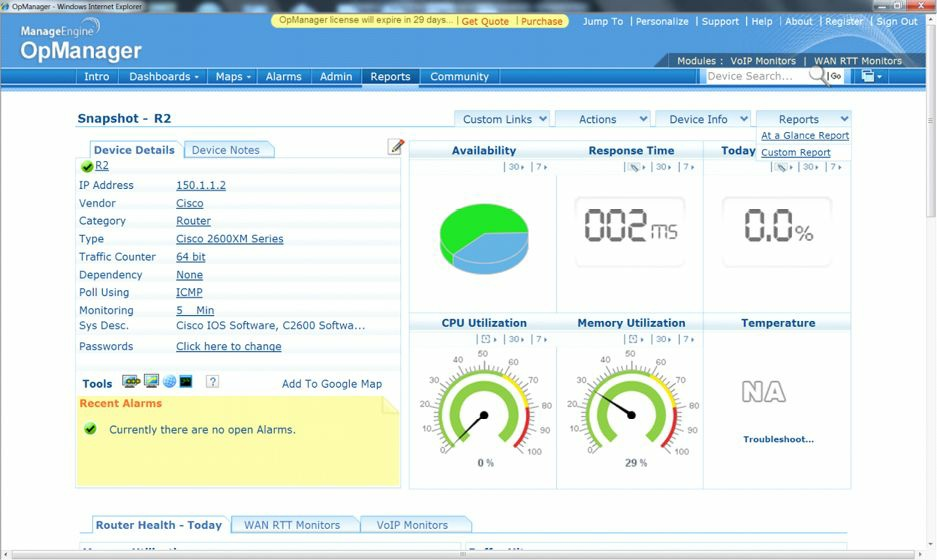

# 第 40 天 Syslog、 SNMP 与Netflow

__Syslog, SNMP and Netflow__

___


Gitbook：[ccna60d.xfoss.com](https://ccna60d.xfoss.com/)


你可以在 https://github.com/gnu4cn/ccna60d 上 fork 本项目，并提交你的修正。


本书结合了学习技巧，包括阅读、复习、背书、测试以及 hands-on 实验。

> 本书译者用其业余时间完成本书的翻译工作，并将其公布到网上，以方便你对网络技术的学习掌握，为使译者更有动力改进翻译及完成剩下章节，你可以 [捐赠译者](https://github.com/gnu4cn/buy-me-a-coffee)。

___

## 第 40 天任务

- 阅读今天的课文（下面）
- 复习昨天的课文
- 完成今天的实验
- 阅读 ICND2 补充指南
- 在[subnetting.org](http://www.subnetting.org)网站上花 15 分钟


将（系统）消息或事件在本地或某台 syslog 服务器上进行记录，是一项核心的维护任务。 Syslog 是一种允许主机将事件通知消息，经由 IP 网络发送到事件消息收集器（event message collectors），也叫做 syslog 服务器或 syslog 守候程序（ daemon ），的协议。也就是说，某台主机或设备可被配置为，生成一条 syslog 消息，并将该消息转发到某个特定的 syslog 守候程序（服务器）的方式。

简单网络管理协议，则是一种广泛使用的管理协议，其定义了一套用于连接到 IP 网络设备通信的标准。 SNMP 提供了一种用于对网络设备进行监视与控制的方法。与思科 IOS 的IP SLA操作（IP Service Level Agreement, IP 网络服务等级协议，该特性通过使用活动流量监视来测量网络性能，而允许客户对 IP 服务等级进行分析）一样， SNMP 可用于收集统计数据、监测设备性能，以及提供到网络的一个基线（a baseline of the network），且 SNMP 是使用最为广泛的网络维护与监测工具之一。

尽管 SNMP 可以提供流量统计，但其无法区分各种数据流（While SNMP can provide traffic statistics, SNMP cannot differentiate between individual flows）。不过思科 IOS 的 Netflow 就可以做到。数据流（A flow）简单地就是一系列的、有着同样源与目的地址、源与目的端口、协议接口，以及同样的服务参数类（Class of Service parameters）的数据包。

今天将学到有关以下方面的知识：

- Syslog
- SNMP
- Netflow


此课程对应了以下 CCNA 大纲要求：

+ 配置并验证Syslog
    - `syslog`输出的使用
- 对 SNMP 版本 2 与版本 3 进行描述
- `netflow`数据的使用

## 日志记录（ Logging ）

所谓某个`syslog`守候程序或某台`syslog`服务器，就是一个对发送给它的`syslog`消息进行监听的实体。将某个`syslog`守候程序配置为请求某台特定设备向其发送`syslog`报文，是不可行的。也就是说，在某台特定设备无法生成`syslog`报文的情况下，那么`syslog`守候程序就什么也不能做。真实世界中，集团公司通常采用`SolarWinds`（或类似）软件来做`syslog`的捕获。此外，诸如`Kiwi Syslog daemon`这类自由软件，也可用于`syslog`的捕获。

`Syslog`使用用户数据报协议（User Datagram Protocol, UDP），作为所采用的传输机制，因此数据包没有被排序与确认。因为 UDP 没有包含在 TCP 中的额外开销（the overhead included in TCP），这意味着在某些重度使用的网络中，一些数据包可能被丢弃，而因此导致记录的信息丢失。不过思科 IOS 软件允许管理员出于冗余目的，配置多台`syslog`服务器。`syslog`方案由两个主要元素构成：`syslog`服务器与`syslog`客户端。

`syslog`客户端将`syslog`报文，使用 UDP 作为传输层协议，指定一个`513`目的端口，发送给`syslog`服务器。这些报文的大小不能超过`1024`字节；不过没有最小长度的限制。所有`syslog`报文，都包含三个不同的部分：优先级、头部与报文。

`syslog`报文的优先级，同时表示了设施，与报文的严重程度（The priority of a syslog message represents both the facility and the severity of the message）。此数字是一个 8 位的数字。前 3 个最低有效位（The first 3 least significant bits），表示报文的严重程度（在 3 位的情况下，可表示 8 中不同的严重程度），其它 5 位表示了某项设施。可使用这些值，来对`syslog`守候程序中的事件进行过滤。

> **注意：** 请注意这些值是由那些生成事件的应用产生的，而不是由`syslog`服务器本身产生的。

下表40.1中列出并介绍了思科 IOS 设备所设置的值（请记住这些严查程度级别与它们的名称）：

*表 40.1 - 思科 IOS 软件`syslog`的优先级分级与定义*

| 严重程度级别 | 严查程度级别名称 | `syslog`的定义 | 介绍 |
| :---: | :---: | :---: | :--- |
| `0` | 紧急（ Emergencies ） | `LOG_EMERG` | 此级别用于那些将导致系统不可用的最严重的错误情景。 |
| `1` | 告警（ Alerts ） | `LOG_ALERT` | 此级别用于表示那些需要管理员立即注意的情况。 |
| `2` | 严重（ Critical ） | `LOG_CRIT` | 此级别用于表明那些严重性低于告警，但仍需管理员介入的严重情况。 |
| `3` | 错误（ Errors ） | `LOG_ERR` | 此级别用于表明系统中有错误发生，但这些错误并不会导致系统不可用。 |
| `4` | 警告（ Warnings ） | `LOG_WARNING` | 此级别用于表示有关系统操作未能成功完成的警告情况。 |
| `5` | 通知（ Notifications ） | `LOG_NOTICE` | 此级别用于表示系统中的状态改变（比如路由协议临接关系过渡到`down`状态）。 |
| `6` | 消息（ Informational ） | `LOG_INFO` | 此级别用于表示有关系统正常运行的消息。 |
| `7` | 调试（ Debugging ） | `LOG_DEBUG` | 此级别用于表示通常用于故障排除目的的实时的（调试的）信息。 |

在`syslog`中，设施（the facility）用于表示生成消息的源。源可以是某个本地设备上的进程、应用，或者甚至操作系统本身。设施是以数字（整数）表示的。在思科 IOS 软件中，有八个本地使用设施可由进程及应用（以及设备本身）用于发送`syslog`消息。默认思科 IOS 设备使用设施`local7`来发送`syslog`报文。但要注意大多数思科设备提供了改变默认设施级别的选项。在思科 IOS 软件中，可使用全局配置命令`loggin facility [facility]`来指定`syslog`的设施。该命令可用的选项如下所示：

```console
R1(config)#logging facility ?
  auth    Authorization system
  cron    Cron/at facility
  daemon  System daemons
  kern    Kernel
  local0  Local use
  local1  Local use
  local2  Local use
  local3  Local use
  local4  Local use
  local5  Local use
  local6  Local use
  local7  Local use
  lpr     Line printer system
  mail    Mail system
  news    USENET news
  sys10   System use
  sys11   System use
  sys12   System use
  sys13   System use
  sys14   System use
  sys9    System use
  syslog  Syslog itself
  user    User process
  uucp    Unix-to-Unix copy system
```

要通过`syslog`来发送消息，就必须在设备上执行以下顺序的步骤：

1. 使用`logging on`配置命令在路由器或交换机上全局性开启日志记录功能。默认在思科 IOS 软件中，日志记录是开启的；但仅开启了将消息发送到控制台。对于要将消息发到除控制台外的其它任何目的地，`logging on`命令都是强制要求的。

2. 使用全局配置命令`logging trap [severity]`，指定出要发送到`syslog`服务器的消息的严重程度。可使用数字或使用等价的严重性名称，来指定发送消息的严重程度。

3. 使用全局配置命令`logging [address]`或`logging host [address]`，指定一个或多个的`syslog`服务器目的地址。

4. 作为可选项，使用`logging source-interface [name]`指定在`syslog`报文中的源 IP 地址。在有着配置的多个接口的设备上，这是普遍的做法。乳未指定此命令，则`syslog`报文将包含路由器或交换机用于抵达服务器的接口的 IP 地址。而在出于冗余目的有着多个接口时，该地址就会在主要路径（接口）宕掉时发生改变。因此，通常将其设置为某个环回接口。

下面的配置实例，演示了如何将所有信息（informational(level6)）及以下的报文，发送到一台有着 IP 地址`192.168.1.254`的`syslog`服务器：

```console
R2(config)#logging on
R2(config)#logging trap informational
R2(config)#logging 192.168.1.254
```

此配置可使用`show syslog`命令进行验证，如下所示：

```console
R2#show logging
Syslog logging: enabled (11 messages dropped, 1 messages rate-limited, 0 flushes, 0 overruns, xml disabled, filtering disabled)
    Console logging: disabled
    Monitor logging: level debugging, 0 messages logged, xml disabled,filtering disabled
    Buffer logging: disabled, xml disabled, filtering disabled
    Logging Exception size (4096 bytes)
    Count and timestamp logging messages: disabled
No active filter modules.
    Trap logging: level informational, 33 message lines logged
        Logging to 192.168.1.254(global) (udp port 514, audit disabled, link up), 2 message lines logged, xml disabled, filtering disabled
```

一般在配置日志记录时，重要的是要确保路由器或交换机的时钟反映的是真实的当前时间，这可实现与错误数据的关联。日志消息上的不准确或不正确时间戳，会令到使用过滤或关联流程，来做错误与问题隔离十分困难，并十分耗时。在思科 IOS 软件中，系统时钟可手动配置，或者将设备配置为自动将其时钟与网络时间协议服务器进行同步。在后面的小节将对这两种方法进行讨论。在网络中仅有少数互联网络设备时，手动的时钟或时间配置没有问题。在思科 IOS 软件中，系统时间是通过使用`clock set hh:mm:ss [day & month | month & day] [year]`特权`EXEC`命令进行配置的。其不是在全局配置模式下配置或指定的。下面的配置示例，演示了如何将系统时钟设置为 2010 年 10 月 20 日上午12:15：

```console
R2#clock set 12:15:00 20 october 2010
```

也可以向下面这样在路由器上应用同样的配置：

```console
R2#clock set 12:15:00 october 20 2010
```

在此配置下，可使用`show clock`命令来查看到系统时间：

```console
r2#show clock
12:15:19.419 utc wed oct 20 2010
```

观察到一个有趣现象，就是在使用`clock set`命令手动配置或设置了系统时间是，其默认到 GMT （ UTC ）时区，如上面所看到的。为了确保系统始终反映对于不在 GMT 时区的那些正确时区，就必须使用全局配置命令`clock timezone [time zone name] [GMT offset]`。比如，美国有六个不同的时区，每个时区都有不同的 GMT 偏移量。这些时区分别是东部时间（Eastern Time），中部时间（Central Time），山区时间（Mountain Time），太平洋时间（Pacific Time）、夏威夷时间（Hawaii Time）以及阿拉斯加时间（Alaska Time）。

此外，一些地方使用标准时间（Standard Time）与夏令时间（Dayligh Saving Time）。考虑这个因素，那么在手动配置系统时钟时，确保于所有设备上正确设置系统时间（标准还是夏令时）就很重要了。下面的配置实例，演示了如何将系统时钟，设置为比 GMT 晚 6 个小时的中部标准时间（Central Standard Time, CST）时区的 2010 年 10 月 20 日上午 12 点 40 分：

```console
R2#config t
Enter configuration commands, one per line.
End with CNTL/Z.
R2(config)#clock timezone CST -6
R2(config)#end
R2#clock set 12:40:00 october 20 2010
```

依据此配置，本地路由器上的系统时钟现在显示为下面这样：

```console
R2#show clock
12:40:17.921 CST Wed Oct 20 2010
```

> **注意：** 如在`clock timezone`命令之前使用`clock set`命令，那么使用`clock set`命令所指定的时间，将被`clock timezone`命令的使用进行偏移。比如假定上面示例中使用的配置命令是像下面这样输入的时：

```console
R2#clock set 12:40:00 october 20 2010
R2#config t
Enter configuration commands, one per line.
End with CNTL/Z.
R2(config)#clock timezone CST -6
R2(config)#end
```

因为这里`clock set`命令先使用，所以路由器上的`show clock`命令将显示偏移了 6 小时的系统时钟，就如使用`clock timezone`命令所指定的那样。在同样的路由器的以下输出对此行为进行了演示：

```console
R2#show clock
06:40:52.181 CST Wed Oct 20 2010
```

> **注意：** 使用全局配置命令`clock summer-time zone recurring [week day month hh:mm week day month hh:mm [offset]]`，可将思科 IOS 的路由器与交换机可配置为自动切换到夏令时间（summertime, Daylight Saving Time）。这样做可消除标准时间与夏令时期间，在所有手动配置的设备上，手动调整系统时钟的需要。

第二种设置或同步系统时钟的方法，就是使用网络时间协议服务器作为参考时间源了。在那些有着多余几台设备的较大网络中，这是首选方法。 NTP 是一个设一用于机器网络时间同步的协议。在[RFC 1305](https://tools.ietf.org/html/rfc1305)中对 NTP 进行了文档说明，其运行在 UDP 上。

NTP网络通常是从权威的时间源处，比如无线电时钟或连接某台时间服务器的原子钟，获取它的时间。 NTP 随后经由网络对此时间进行分发。 NTP 是相当高效的；每分钟不多于一个数据包，就可以将两台机器同步到一毫秒之内。

NTP使用层的概念（a concept of a stratum），来描述某台机器距离权威时间源有多少跳。请记住这不是路由或交换的条数，而是 NTP 跳数，这是一个完全不同的概念。一台层`1`的时间服务器（A stratum 1 time server），通常具有一个直接安装的无线电或原子钟，同时一台层`2`的时间服务器（a stratum 2 time server），则是通过 NTP 从层`1`的时间服务器接收其时间，如此等等。在某台设备被配置了多台 NTP 参考服务器时，它将自动选择有着配置为通过 NTP 进行通信的最低层编号的机器，作为其时间源（When a device is configured with multiple NTP reference servers, it will automatically choose as its time source the machine with the lowest stratum number that it is configured to communicate with via NTP）。

在思科 IOS 软件中，使用全局配置命令`ntp server [address]`，来将某台设备配置带有一台或多台 NTP 服务器的 IP 地址。如先前指出的那样，可通过重复使用同样的命令，指定多个 NTP 参考地址。此外，该命令还可用于配置服务器与客户端之间的安全及其它特性。下面的配置实例，演示了如何将某台设备配置为将其时间与一台有着 IP 地址`10.0.0.1`的 NTP 进行同步：

```console
R1(config)#ntp server 10.0.0.1
```

根据此配置，可使用`show ntp accociations`命令来对 NTP 设备之间的通信进行检查，如下面的输出所示：

```console
R2#show ntp associations
address     ref clock    st  when  poll  reach  delay  offset  disp
*~10.0.0.1  127.127.7.1  5   44    64    377    3.2    2.39    1.2
* master (synced), # master (unsynced), + selected, - candidate, ~ configured
```

`address`字段表示 NTP 服务器的 IP 地址，如同该字段下所指出的值`10.0.0.1`所确认的那样。而`ref clock`字段则表示了那台 NTP 服务器所使用的参考时钟。在此实例中， IP 地址`127.127.7.1`表示该设备使用的是一个内部时钟（`127.0.0.0/8`子网）作为其参考时间源。如该字段包含了另一个值，比如`192.168.1.254`，那么那将是该服务器用作其参考的 IP 地址。

接着的`st`字段表示该参考的层（the stratum of the reference）。从上面的打印输出，可以看到`10.0.0.1`的 NTP 设备有着`5`的层数。本地设备的层数，将增加`1`到值`6`，如下所示，因为其是从有着层`5`的服务器出接收到的时间源。如有另一台设备被同步到该本地路由器，那么它将反应出一个`7`的层数，如此等等。用于检查 NTP 配置的第二个命令，就是`show ntp status`命令了，其输出如下面所示：

```console
R2#show ntp status
Clock is synchronized, stratum 6, reference is 10.0.0.1
nominal freq is 249.5901 Hz, actual freq is 249.5900 Hz, precision is 2**18
reference time is C02C38D2.950DA968 (05:53:22.582 UTC Sun Mar 3 2002)
clock offset is 4.6267 msec, root delay is 3.16 msec
root dispersion is 4.88 msec, peer dispersion is 0.23 msec
```

该`show ntp status`命令的输出表示时钟是被同步到所配置的 NTP 服务器（`10.0.0.1`）。此服务器有着层数`5`，因此本地设备反应了一个层数`6`。在配置了 NTP 是一个观察到的一个有意思的事情，就是本地时间将默认到 GMT ，如在上面的输出中所看到的那样。为确保该设备显示正确的时区，就必须在该设备上执行`clock time-zone`命令。

在不论是通过手动还是 NTP 设置好系统时钟之后，都要确保发送给服务器的日志包含正确的时间戳。这是通过使用全局配置命令`service timestamp log [datetime | uptime]`执行的。关键字`[datetime]`支持下面这些字面的额外子关键字：

```console
R2(config)#service timestamps log datetime ?
  localtime      Use local time zone for timestamps
  msec           Include milliseconds in timestamp
  show-timezone  Add time zone information to timestamp
  year           Include year in timestamp
<cr>
```

而`[uptime]`关键字则没有额外关键字，而将本地路由器配置为仅包含系统运行时间（the system uptime）作为发送的消息的时间戳。下面的配置实例，演示了如何将本地路由器配置为所有消息都包含本地时间、毫秒信息，以及时区：

```console
R2#configure terminal
Enter configuration commands, one per line.
End with CNTL/Z.
R2(config)#logging on
R2(config)#logging console informational
R2(config)#logging host 150.1.1.254
R2(config)#logging trap informational
R2(config)#service timestamps log datetime localtime msec show-timezone
```

根据此配置，本地路由器的控制台将打印以下消息：

```console
Oct 20 02:14:10.519 CST: %SYS-5-CONFIG_I: Configured from console by console
Oct 20 02:14:11.521 CST: %SYS-6-LOGGINGHOST_STARTSTOP: Logging to host 150.1.1.254 started - CLI initiated
```

此外，在服务器`150.1.1.254`上的`syslog`守候程序，将反映出同样内容，如下图40.1中的Kiwi Syslog Manager屏幕截图中所示：


*图 40.1 - 日志时间戳的配置*

## 简单网络管理协议（Simple Network Management Protocol）

简单网络管理协议，是一个应用层（`Layer 7`）协议，使用 UDP 端口`161`与`162`，促进网络设备之间管理信息的交换。一个 SNMP 管理的网络，由管理系统、代理程序及所管理的设备构成（An SNMP-managed network consists of a management system, agents, and managed devices）。其中，管理系统执行监控应用及对所管理的设备进行控制。其也执行大多数的管理流程，并提供了用于网络管理的大部分存储资源。某个网络科恩该是由一套或多套的管理系统所管理。

代理程序，则是出于各个受管理的设备之上，而对本地管理信息数据，比如性能信息或事件与软件装置中捕获到的错误信息（error information caught in software traps），转换为管理系统可读取的形式。 SNMP 代理程序使用将数据传输到网络管理软件的[SNMP`get-request`指令](pdfs/06-ch06.pdf)。 SNMP 代理程序从管理信息库（Management Information Bases, MIBs）或从错误或修改陷阱设置处捕获数据，而管理信息库则是设备参数与网络数据存放的地方（SNMP agents capture data from Management Information Bases(MIBs), which are device parameters and network data repositories, or from error or change **traps**）。

而受管理元素，比如路由器、交换机、计算机或防火墙，是通过 SNMP 代理程序进行管理的。受管理设备对管理信息进行收集与存储，从而令到这些信息通过 SNMP 对其它有着相同协议兼容性的管理系统可用。下图40.2演示了 SNMP 管理的网络的三个主要部件之间的交互：


*图 40.2 - SNMP网络组件的交互*

参考图40.2, `R1`就是 SNMP 管理的设备。逻辑上出于该设备上的，就是 SNMP 代理程序。 SNMP 代理程序，将存储在受管理设备的管理数据库中的本地管理信息数据，转化为这里称为网络管理站（Network Management Station, NMS）的管理系统可读取的形式。

在使用 SNMP 时，使用三种常见的 SNMP 命令：`read`、`write`与`trap`，使得受管理的设备得以被监视与控制。网络管理站所使用的`read`命令，用于监视受管理的设备。这是通过 NMS 对由受管理设备所维护的不同变量进行检查完成的。而`write`命令，则是由 NMS 用于对受管理设备进行控制的。 NMS 使用该命令可对存储在受管理设备上的变量的值，进行修改。最后， SNMP 的`trap`命令，是由受管理设备，用来将事件报告给 NMS 的。设备可配置为将 SNMP 陷阱或通知，发送给 NMS 。所发送的陷阱或通知，取决于设备上所运行的思科 IOS 软件版本，以及设备的平台。

SNMP陷阱简单地就是就网络上的某个状况，通知 SNMP 管理器的消息（SNMP traps are simply messages that alert the SNMP manager of a condition on the network）。一个 SNMP 陷阱的实例，可能包含了某个接口从`up`状态过渡到了`down`状态。 SNMP 的主要问题在于它们是无确认的。这就意味着发出设备无法确定该陷阱是否被 NMS 接收到。

而 SNMP 通知命令，则是包含了来自 SNMP 管理器的接收确认的 SNMP 陷阱。这些消息可用于表示诸如失败的认证尝试，或失去到邻居路由器的连接等消息。管理器在没有接收到通知请求的情况下，它就不发送响应。而发送者在从没有接收到响应的情况下，通知请求可被再度发送。因此， SNMP 的通知，更可能抵达其想要的目的（Thus, informs are more likely to reach their intended destination）。

尽管通知比陷阱更为可靠，但不利支出在于它们在路由器上与网络中与消耗了更多的资源。与发出后就丢弃的陷阱不同，在接收到一个响应或请求超时之前，通知请求（an inform request）必须要驻留在内存中。此外陷阱仅发送一次，而通知在没有接收到一个来自 SNMP 服务器的响应之前，必须多次发送。

下图40.3演示了 SNMP 管理器与 SNMP 代理程序之间，发送陷阱与通知的通信：


*图 40.3 - 由网络管理站与 SNMP 管理的元素所使用的 UDP 端口*

SNMP的三个版本分别是版本`1`、`2`与`3`。版本`1`，或`SNMPv1`，是 SNMP 协议的最初实现。`SNMPv1`运行在诸如用户数据报协议（ UDP ）、互联网协议（ IP ），以及开放系统互联的无连接网络服务（OSI Connectionless Network Service, CLNS）之上。

`SNMPv1`是广泛使用的，且是互联网社区中使用的事实上的网络管理协议。

`SNMPv2`对`SNMPv1`进行了修订，包含了在性能、安全性、保密性及管理器到管理器通信等方面的提升。`SNMPv2`还定义了两种新的操作（命令、 operations ）：`GetBulk`与`Inform`。`GetBulk`用于有效地获取大块的数据（large blocks of data）。`Inform`操作允许一个网络管理站发送陷阱信息到另一网络管理站，并于随后接收一个响应。在`SNMPv2`中，如某个对`GetBulk`操作进行响应的代理程序无法在一个清单中提供所有变量的值，那么它就提供部分结果。

`SNMPv3`提供了先前版本的 SNMP 所不具备的以下三项额外安全服务：消息完整性、认证及加密。`SNMPv3`使用消息完整性来确保数据包在传输过程中不被篡改。`SNMPv3`还使用了用于判断消息是否是来自有效的源。最后`SNMPv3`提供了用于打乱（ scramble ）数据包内容，以防止其被未授权的源看到的加密机制。

在思科 IOS 软件中，使用`snmp-server host [hostname | address]`命令，来指定本地设备将发送陷阱或通知的目的主机名或 IP 地址。为实现网络管理站对本地设备的轮询，`SNMPv1`与`SNMPv2`要求使用全局配置命令`snmp-server community <name> [ro | rw]`，为只读或读写访问，指定一个共有字符串（a community string）。

`SNMPv3`蜜柑有使用这种同样的基于共有的安全形式（the same community-based form of security），而是使用了用户与组的安全（user and group security）。下面的配置实例，演示了如何配置带有两个共有字符串的本地设备，其一用于只读访问，另一个用于读写访问。此外，该本地设备还配置了为思科 IOS 的 SLA （Service Level Agreement, 服务级别协议）操作/命令与`syslog`，而使用只读共有字符串，将 SNMP 陷阱发送到`1.1.1.1`：

```console
R2#config t
Enter configuration commands, one per line.
End with CNTL/Z.
R2(config)#snmp-server community unsafe RO
R2(config)#snmp-server community safe RW
R2(config)#snmp-server host 1.1.1.1 traps readonlypassword rtr syslog
```

下图40.4演示了一个基于 SNMP 轮询（SNMP polling）的、使用ManageEngine OpManager网络监控软件的，设备资源使用情况与可用性的示例报告：



*图 40.4 - 有关设备资源使用情况的示例 SNMP 报告*

## 思科 IOS 的 NetFlow （Cisco IOS NetFlow）

与 SNMP 一样，思科 IOS 的 NetFlow 是一个强大的维护与监控工具，可用于对网络性能进行基准测量及辅助故障排除。但其与 SNMP 之间有着一些显著的区别。第一个不同就是 SNMP 主要报告的是有关设备统计数据（比如资源使用情况等），而思科 IOS 的 NetFlow 则是就流量统计数据进行报告（比如数据包与字节）。

这两个工具之间的第二个不同，就是 SNMP 是一种基于轮询的协议（a poll-based protocol），意味着受管理设备被轮询信息。在那些 SNMP 设备发送陷阱（甚至报告，even report）到管理站的实例中，也可认为它是基于推送的（push-based）。而思科 IOS 的 NetFlow ，则是基于推送的技术，意味着配置了 NetFlow 的设备，是将其收集的信息发送出来，到某个中心存储库的。由于这个原因， NetFlow 与 SNMP 互为补充，可作为标准网络维护与监控工具套件（the standard network maintenance and monitoring toolkit）的组成部分。但它们并非各自的替代；这是一个常被误解的概念，重要的是记住这一点。

IP（数据）流基于五个，上至七个的一套 IP 数据包属性，它们可能包含下面这些：

- 目的 IP 地址
- 源 IP 地址
- 源端口
- 目的端口
- `Layer 3`的协议类型
- 服务类（Class of Service）
- 路由器或交换机的接口

除了这些 IP 属性外，（数据）流还包含了其它一些额外信息。这些额外信息包括对于计算每秒数据包与字节数有用的时间戳。时间戳还提供了有关某个数据流生命周期（持续时间）的信息。数据流还包括下一跳 IP 地址的信息，其包含了边界网关协议的路由器自治系统信息。除了 TCP 流量的标志外，数据流源与目的地址的子网掩码信息也有包含，而 TCP 流量的诸多标志，则可用于对 TCP 握手进行检查。

> **译者注**：总的来说，思科 IOS 的 NetFlow 中的数据流，包含了数据包属性（七种）、时间戳、包含 BGP 路由自治系统的下一跳 IP 地址信息、 TCP 流量的诸多标志，以及源与目的地址的子网掩码信息。

简要地讲，思科 IOS 的 NetFlow 特性，除了可用于提供有关网络用户与网络应用、峰值用量时间，与流量路由之外，还可用于有关的信息网络流量记账、基于用量的网络计费、网络规划、安全、拒绝服务攻击的监视能力，以及网络监控。所有的这些用途，令到其成为一个非常强大的维护、监控与故障排除工具。

思科 IOS 的 NetFlow 软件，对数据流数据进行收集，并将其存储在一个名为“ NetFlow 缓存”或简单地说就是“数据流缓存”的数据库中。数据流信息会留存到该数据流终止或停止、超时或缓存溢出为止。有两种方式来访问存储在数据流中的数据：使用命令行界面（也就是使用`show`命令），或导出该数据，并通过使用某种类型的报告工具对导出的数据进行查看。下图40.5演示了在思科 IOS 路由器上的 NetWork 操作，以及数据流缓存的生成方式：


*图 40.5 - 基本的 NetFlow 操作与数据流缓存的生成*

参考图40.5，在本地路由器上入口流量被接收到。该流量被路由器加以探测，且 IP 属性信息被用于创建一个数据流。随后该数据流信息被存储在流缓存中。该信息可使用命令行界面进行查看，或被导出到某个称为 NetFlow 收集器的外部目的地，随后在 NetFlow 收集器出，该同样的信息可使用某种应用报告工具（an application reporting tool）进行查看。要实现将 NetFlow 数据报告给 NetFlow 收集器，需要使用以下步骤：

1. 在设备上要配置思科 IOS 的 NetFlow 特性，以将数据流捕获到 NetFlow 缓存。

2. 要配置好 NetFlow 导出功能，以将数据流发送到收集器。

3. 就那些已经有一段时间不活动的、以被终止的，或者仍活动但超出了活动计时器的数据流，对 NetFlow 进行搜索（The NetFlow cache is searched for flows that have been inactive for a certain period of time, have been terminated, or, for active flows, that last greater than the active timer）。

4. 将这些已标识出的数据流导出至 NetFlow 收集器服务器（Those identified flows are exported to the NetFlow Collector server）。

5. 将接近 30 到 50 个数据流打包在一起，并通常经由 UPD 进行传送。

6. NetFlow收集器软件从数据创建出实时或历史性的报告。

在配置思科 IOS 的 NetFlow 特性时，需要三个主要步骤，如下所示：

1. 在那些希望对信息进行捕获并在流缓存中存储的所有接口上，使用接口配置命令`ip flow ingress`，把接口配置为将数据流捕获进入 NetFlow 缓存。重要的是记住 NetFlow 仅在每个接口的基础上配置的（Configure the interface to capture flows into the NetFlow cache using the `ip flow ingress` interface configuration command on all interfaces for which you want information to be captured and stored in the flow cache. It is important to remember that NetFlow is configured on a per-interface basis only）。


    > **Dario先生的提醒**：命令`ip route-cache flow`可在物理接口及其下的所有子接口上，开启（ NetFlow ）数据流（the `ip route-cache flow` command will enable flows on the physical interface and all subinterfaces associated with it）。
    > 而`ip flow ingress`命令则将开同一接口上的单个子接口、而非所有子接口上，开启（ NetFlow ）数据流。这在对观看某个接口的子接口`X`、`Y`及`Z`上的数据流不感兴趣，而真正想要观看同一接口上的子接口`A`、`B`与`C`子接口上的数据流时，此命令就很好用。
    > 此外，在 NetFlow 版本 5 下，唯一选项是使用`ip flow ingress`命令来监视上传统计数据（with NetFlow v5, the only option was to monitor inbound statistics using the `ip flow ingress` command）。不过随着 NetFlow 版本 9 的发布，现在就了使用`ip flow egress`命令，来对离开各个接口的流量进行监控的选择了。


    > **注意：** 从思科 IOS 版本`12.4(2)T`及`12.2(18)SXD`起，已将命令`ip flow ingress`替换为`ip route-cache flow`命令。而从思科 IOS 版本`12.2(25)S`起，命令`show running configuration` 的输出已被修改，因此命令`ip route-cache flow`命令，以及`ip flow ingress`命令，将在二者之一被配置后，出现在`show running-configuration`的输出中。

    随后 NetFlow 信息就存储在本地路由器上，同时可在本地设备上，使用`show ip cache flow`查看到。

    在打算将数据导出到 NetFlow 收集器的情况下，将需要两个额外任务，如下：

2. 使用全局配置命令`ip flow-export version [1 | 5 | 9]`，配置思科IOS NetFlow的版本或格式。 NetFlow 版本`1`（`v1`）是在首个 NetFlow 发布中所支持的最初格式。在用于分析导出的 NetFlow 数据的应用仅支持该版本时，才应使用此版本。相比版本`1`，版本`5`导出更多的字段，同时也是应用最广泛的版本。而版本`9`则是最新的思科IOS NetFlow版本，也是一个新的 IETF 标准的基础。版本`9`是一个灵活的导出格式版本。

3. 使用全局配置命令`ip flow-export destination [hostname | address] <port> [udp]`，配置并指定 NetFlow 收集器的 IP 地址，并于随后指定 NetFlow 收集器用于接收来自思科设备的 UDP 输出的 UDP 端口。其中的`[udp]`关键字是可选的，且在使用该命令是不需要指定，因为在将数据发送到 NetFlow 收集器时，用户数据报协议是默认使用的传输协议。

以下实例演示了如何为某个指定的路由器接口开启 NetFlow ：

```console
R1#config t
Enter configuration commands, one per line.
End with CNTL/Z.
R1(config)#interface Serial0/0
R1(config-if)#ip flow ingress
R1(config-if)#end
```

根据此配置，可使用`show ip cache flow`命令来查看在数据流缓存中所收集的统计数据，如下面的输出所示：

```console
R1#show ip cache flow
IP packet size distribution (721 total packets):
   1-32   64   96  128  160  192  224  256  288  320  352  384  416  448  480
   .000 .980 .016 .000 .000 .000 .000 .000 .000 .000 .000 .000 .000 .000 .000
   512   544  576 1024 1536 2048 2560 3072 3584 4096 4608
  .002  .000 .000 .000 .000 .000 .000 .000 .000 .000 .000

IP Flow Switching Cache, 278544 bytes
  4 active, 4092 inactive, 56 added
  1195 ager polls, 0 flow alloc failures
  Active flows timeout in 30 minutes
  Inactive flows timeout in 15 seconds

IP Sub Flow Cache, 21640 bytes
  4 active, 1020 inactive, 56 added, 56 added to flow
  0 alloc failures, 0 force free
  1 chunk, 1 chunk added
  last clearing of statistics never

Protocol         Total    Flows   Packets Bytes  Packets Active(Sec)  Idle(Sec)
--------         Flows     /Sec     /Flow  /Pkt     /Sec     /Flow      /Flow
TCP-Telnet           2      0.0        34    40      0.0      10.5       15.7
TCP-WWW              2      0.0         9    93      0.0       0.1        1.5
UDP-NTP              1      0.0         1    76      0.0       0.0       15.4
UDP-other           42      0.0         5    59      0.0       0.0       15.7
ICMP                 5      0.0        10    64      0.0       0.0       15.1
Total:              52      0.0         7    58      0.0       0.4       15.1

SrcIf      SrcIPaddress   DstIf   DstIPaddress   Pr SrcP DstP  Pkts
Se0/0      150.1.1.254    Local   10.0.0.1       01 0000 0800   339
Se0/0      10.0.0.2       Local   1.1.1.1        06 C0B3 0017     7
Se0/0      10.0.0.2       Local   10.0.0.1       11 07AF D0F1     1
Se0/0      10.0.0.2       Local   10.0.0.1       11 8000 D0F1    10
Se0/0      150.1.1.254    Local   10.0.0.1       01 0000 0800   271
Se0/0      10.0.0.2       Local   1.1.1.1        06 C0B3 0017    59
```

下面的示例演示了如何配置并开启指定路由器接口的 NetFlow 数据收集，并于随后使用 NetFlow 版本`5`的数据格式，将数据导出到某台有着 IP 地址`150.1.1.254`的 NetFlow 收集器：

```console
R1(config)#interface Serial0/0
R1(config-if)#ip flow ingress
R1(config-if)#exit
R1(config)#interface FastEthernet0/0
R1(config-if)#ip flow ingress
R1(config-if)#exit
R1(config)#interface Serial0/1
R1(config-if)#exit
R1(config)#ip flow-export version 5
R1(config)#ip flow-export destination 150.1.1.254 5000
R1(config)#exit
```

根据此配置，就可在那台NetFlow Collector上，使用某种应用报告工具，查看到收集的信息。而尽管有数据的导出，仍然可以在本地设备上，使用`show ip cache flow`命令来查看统计数据，在对网络故障进行排除或报告问题时，此命令可作为一个有用的工具。

### 使用 NetFlow 的数据进行故障排除（Troubleshooting Utilising NetFlow Data）

典型的企业网络，有着成千上万的、仅在很短时间内就生成海量 NetFlow 数据的连接。 NetFlow 数据可转换为帮助管理员弄清楚网络中正在发生什么的，有用图形与表格。 NetFlow 数据可辅助于以下方面：

- 提升整体网络性能
- 对一些诸如网络电话（ VoIP ）的应用提供支持
- 更好地对峰值流量进行管理（Better manage traffic spikes）
- 加强网络规定的执行（Enforce network policies）
- 揭示出那些指向恶意行为的流量模式（Expose trffic patterns that point to malicious activities）

NetFlow信息还可帮助管理员掌握到任何时候，各种数据类型所消耗的网络资源百分比。一眼就可以发现由电邮、计费与 ERP 系统及其它应用等使用了多少带宽，以及工作日期间有多少用户在观看 YouTube 视频，或在打互联网电话。

NetFlow数据可以易于理解的形式进行呈现，这就使得管理员能够轻易地对更多细节信息进行研究。他们可以就用户、应用、部门、对话、接口与协议等所产生的流量进行检查。使用 NetFlow 数据可以解决的一些情况示例，包括：

- 网络容量问题（Capacity issues）： NetFlow 可清楚地显示什么应用使用了最多的带宽，及它们在何时使用了最多的带宽。此信息有助于改变应用流量模式，从而提升网络性能。通用的做法对用户进行应用。
- 安全问题（Security issues）： NetFlow 数据可对网络上的未授权流量模式进行探测，并可在对网络造成任何危害之前阻止威胁。
- 网络语言故障（比如低质量，VoIP problems(poor quality, for example)）：在使用 NetFlow 分析识别出原因后，这方面的问题可被矫正。 NetFlow 报告可给出对网络语音通话造成影响的带宽不足（insufficient bandwidth）、延迟或网络抖动等因素。

## 第 40 天问题

1. What underlying protocol does syslog use?
2. The syslog client sends syslog messages to the syslog sever using UDP as the Transport Layer protocol, specifying a destination port of `_______`.
3. The priority of a syslog message represents both the facility and the severity of the message. This number is an `________` -bit number.
4. Name the eight Cisco IOS syslog priority levels.
5. In Cisco IOS software, the `_______` `_______` `_______` global configuration command can be used to specify the syslog facility.
6. Which command do you use to globally enable logging on a router?
7. Name the command used to specify the syslog server destination.
8. Name the command used to set the clock on a Cisco IOS router.
9. On which ports does SNMP operate?
10. Name the command you can use to change the NetFlow version.

## 第 40 天答案

1. UDP.
2. `514`.
3. `8`.
4. Emergencies, alerts, critical, errors, warnings, notifications, informational, and debugging.
5. The `logging facility [facility]` command.
6. The `logging on` command.
7. The `logging [address]` or `logging host [address]` command.
8. The `clock set` command.
9. UDP `161` and `162`.
10. The `ip flow-export version x` global configuration command.

## 第 40 天实验

### 日志记录实验

在思科路由器上配置日志记录：

- 选择日志记录设施`local3`：`logging facility local2`
- 执行全局的`logging on`命令
- 选择日志记录的严重程度`informational`
- 在一台 PC 机上配置一个自由的`syslog`服务器并将其连接到路由器
- 执行`logging [address]`命令来指定该`syslog`服务器
- 指定`logging source-interface`命令
- 验证命令`show logging`
- 配置`service timestamp log datetime localtime msec show-timezone`命令
- 在 PC 机上检查`syslog`消息

### SNMP实验

在思科路由器上配置 SNMP ：

- 使用`snmp-server host`命令配置 SNMP 服务器
- 使用`snmp-server community`命令，配置 SNMP 的只读（ RO ）与读写（ RW ）共有字符串（Configure SNMP RO and RW communities using the `snmp-server community` command）


### NetFlow实验

在思科路由器上配置 NetFlow ：

- 在某个路由器接口上开启 IP 数据流的入口与出口（Enable IP flow ingress and egress on a router interface）
- 在有流量通过路由器后，对`show ip cache flow`命令进行检查
- 使用`ip flow-export`命令对 NetFlow 的版本进行配置
- 使用`ip flow-export`命令配置一台外部 NetFlow 服务器

请访问[www.in60days.com](http://www.in60days.com)网站，免费观看作者完成此实验。
