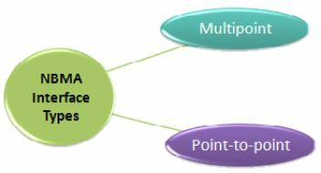
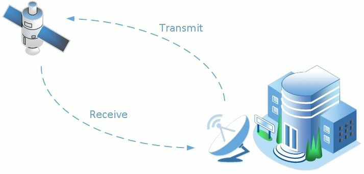

# 第41天 - 广域组网

**Wide Area Networking**

## 第41天任务

- 约定今天的课文（下面）
- 复习昨天的课文
- 完成自主选择的实验
- 阅读ICND2记诵指南
- 在[subnetting.org](http://www.subnetting.org)网站上花15分钟


思科将WAN有关的概念拆分到了ICND1与ICND2考试中，后者关注的是帧中继及PPP协议（Frame Relay and PPP protocols）。因此，本手册将看看基本的WAN概念、技术及协议。

今天，将学习以下知识：

- 关于WAN的组件（WAN components）
- 关于WAN的协议（WAN protocols）
- 基本的串行线路的配置
- WAN连接的故障排除

此课程模块对应了以下ICND2考试大纲的有关有求：

+ 认识不同的广域网技术
    - 城域以太网（Metro Ethernet）
    - 甚小孔径终端（Very Small Aperture Terminal，VSAT，参考[维基百科](https://en.wikipedia.org/wiki/Very-small-aperture_terminal)）
    - T1/E1（参考[维基百科T-carrier](https://en.wikipedia.org/wiki/T-carrier)，[维基百科E-carrier](https://en.wikipedia.org/wiki/E-carrier)）
    - T3/E3
    - 综合业务数字网（Integrated Services Digital Network，ISDN）
    - 数字用户线路（Digital Subscriber Line，缩写：DSL）
    - 同轴线组网
    - 第3代/第4代蜂窝网络（Celluar 3G/4G, 基站蜂窝网络）
    - 虛拟私人/专用网络（Virtual Private Network，VPN） 
    - 多协议标签交换（Multi-Protocol Label Switching，MPLS）

- 配置并验证一条基本的WAN串行连接
- 对PPPoE进行部署与故障排除

## 广域网概述（WAN Overview）

为了提供网络设施不同部分的连通性，广域网跨越极大的地理范围。与局域网环境不同，并非所有的WAN组件都是由其所服务的特定企业保有的。相反，WAN设备或连通性，可从服务提供商处进行短期或长期租用（rended, 短期、口头、临时的租用，leased, 长期、书面、固定期限的租用）。

大多数服务提供商都有良好培训，以确保它们可同时在极大的地理范围上，适当地支持传统数据流量，以及语音与视频业务（这些对延迟都更为敏感）。

有关WANs的另一个有趣的地方，即与LANs不同，这里通常有某种初期固定的投入，以及某种周期性的经常业务费用（Another interesting thing about WANs is that, unlike LANs, there is typically some initial fixed cost and some periodic recurring fees for the services）。在广域组网下，用户既不会拥有连接与某些设备，还将必须持续付费给服务提供商。这就是应避免高配（即购买仅需的带宽）的原因之一。这就带来对部署有效的服务质量机制（implementing effective Quality of Service mechanisms），以避免购买额外WAN带宽的需求。靠开销通常与带宽高配中出现的经常性开支有关（The high costs are usually associated with the recurring fees that might appear in the case of over-provisioning the bandwidth）。

有关WAN技术设计方面的要求，通常派生自以下这些方面：

- 应用的类型（Application type）
- 应用的可用性（Application availability）
- 应用的可靠性（Application reliability）
- 与某种特定WAN技术有关的成本情况（Costs associatedd with a particular WAN technology）
- 应用的使用级别（Usage levels for the application）

## 广域网的类别（WAN Categories）

WAN分类中的一个必要概念就是电路交换技术，该技术最为相关的实例，就是公众交换电话网络了（An essential concept in WAN categorisation is circuit-switched technology， the most relevant example of this technology being the Public Switched Telephone Network, PSTN）。而归入此类别的一种技术，就是综合业务数字网。电路交换WAN连接的工作方式，是在需要连接时变为连接建立状态，并在连接不需要时连接终止。反映这种电路交换行为的另一个实例，就是老式的拨号连接（仅有PSTN的拨号调制解调器的模拟信号访问）。

> **注意**：就在不久之前，拨号技术都还是访问互联网资源的唯一方式，这种方式提供到平均`40kbps`的可用带宽。如今这种技术几乎绝迹了。

电路交换选择的反面，就是长期租用线路技术了（leased-line technology）。这种技术是一条完全专属的连接，持续可用并由租户公司拥有。长租线路的实例，包括基于时分复用的长租线路（Time Division Multiplexing(TDM)-based leased lines）。这类接入方式通常都很昂贵，因为单个客户具有连接的整个使用权。

WAN技术的另一种流行分类，涉及包交换网络（packet-switched networks）。在包交换设施中，共享带宽利用了虚拟电路技术（in a packet-switched infrastruture, shared bandwidth utilises virtual circuits）。客户可通过服务提供商的设施云，创建出一条虚拟路径（与长租线路类似）。此虚拟电路有着专属的带宽，但技术上将虚拟电路并非一条真实的长租线路。帧中继就是此种技术类型的一个实例。

包括作为帧中继前身的`X.25`在内的一些古早WAN技术。这种技术在某些实现中仍有出现，但已经很罕见了（如今帧中继也很少见了）。

另一种可能听过的WAN类别，就是单元交换技术（cell-switched technology）了。这种WAN类型通常包含在包交换技术中，因为它们非常类似。一种单元交换技术的实例，就是异步传输模式（Asynchronous Transfer Mode, ATM，这种技术如今也相当罕见了）。ATM是以固定大小的数据单元运作的，而不是使用数据包（如同在帧中继网络中所用的）。单元交换技术构成一个共享带宽的环境，因此服务提供商可确保客户有着通过其设施的固定水平的带宽。

宽带（Broadband）接入是另一种正在增长中的WAN类别，这种WAN接入方式包含了诸如以下这些技术：

- 数字订户线路（Digital Subscriber Line, DSL）
- 同轴线网络（Cable）
- 无线接入（Wireless）

宽带接入有着此种能力：采用如老式传输电视信号的同轴线的某种连接，并解决如何充分使用该既有带宽的不同方面的能力。比如通过将一个额外的、可与原先的电视信号一同传输的数据信号进行复用。


*图 41.1 - 广域网的类别*

如同在上面的图41.1中详细展示的那样，在讨论广域网的类别时有许多选项，同时这里只是对它们的简单介绍。所有这些技术都可以支持运行在`20/80`设计原则下的现代网络，所谓`20/80`设计原则，指的是`80%`的网络流量使用了某种广域网技术，来访问远端资源。

## 非广播多路复用技术（NBMA Technologies）

出现在广域组网中的一种特殊技术，就是非广播多路复用了。所谓非广播多路复用技术，表示某些在传统广播组网中没有的挑战。当某个需要经由同一网络进行通信系统分组不支持原生的广播时，就出现了非广播多路访问的需求（The need for NBMA arises when there is no native Broadcast support for a group of systems that want to communicate over the same network）。在设备无法原生地发送以多路访问网段上的所有设备为目的的数据包时，问题也就出现了。帧中继、ATM与ISDN默认就是非广播多路访问技术的实例。

所有这些技术都不具备支持广播的任何能力。这一点阻止了它们在其运作中运行那些用到广播的路由协议。在非广播网络中，原生的多播支持也是没有的。在某种路由协议情景下，参与的所有节点都必须接收到多播更新（In the case of a routing protocol, all the nodes that participate must receive Multicast updates）。对于使用非广播多路访问网络的这个问题，一种办法就是作为重复的单播数据包，来发送多播或广播数据包。在这种方式下，广播/多播帧，是单独地发送到拓扑中的各节点的。此场景中的变通部分，就是设备必须想办法找到一种解决`Layer 3`到`Layer 2`解析的办法。特定数据包必须投送到需要接收到它们的特定机器上。

接着这个`Layer 3`到`Layer 2`的解析问题的方法必须存在才行。`Layer 3`的地址通常是IP地址，而`Layer 2`的地址有通常根据所使用的技术而有所不同。在帧中继的情况下，`Layer 2`地址将由数据链路连接标识符（Data Link Connection Identifier, DLCI）编号构成，那么就必须找到一种将DLCI解析到IP地址的方法。

在广播网络的情况下，`Layer 3`的解析，使用MAC地址作为`Layer 2`的地址，且MAC地址也必须被解析到IPv4地址。这是通过地址解析协议（Address Resolution Protocol, ARP）完成的。在基于广播的网络中，设备通过指定其想要与其进行通信的设备（通常经由DNS学习到），及询问特定于那些设备的MAC地址，而广播出解析请求。对地址解析请求的响应，是经由单播并包含了所请求的MAC地址（In a Broadcast-based network, the devices broadcast the requests by specifying the devices it wants to communicate with(typically learned via DNS) and asking for the MAC addresses specific to those devices. The reply is via Unicast and includes the requested MAC addresses）。

在非广播多路访问环境中，仍需要将`Layer 3`地址（IP地址）绑定到`Layer 2`地址（数据链路连接标识符）。这可通过使用反向ARP的一种自动化方式完成（This can be done in an automated fashion using Inverse ARP）。此操作用于将远端的`Layer 3`地址解析到`Layer 2`地址，并仅用于本地。反向ARP可用在帧中继环境中。反向ARP作为一种在非广播多路复用环境中`Layer 3`到`Layer 2`解析的方案，问题在于其受限于直接连接的设备。这就造成在部分网状网络（partial-mesh networks，其中并非所有设备都是直接连接的）中的问题。

非广播多路服务的接口有两种 -- 多点与点对点接口，如下图41.2所示。多点接口要求某种`Layer 3`到`Layer 2`的解析方法。顾名思义，多点接口可作为多个`Layer 2`电路的端节点（As its name implies, it can be the termination point of multiple Layer 2 circuits）。



*图 41.2 - 非广播多路访问接口类型*

在设备的主要物理接口上配置了帧中继时，那个接口将默认成为多点的。而在某个帧中继物理接口上创建了一个子接口时，创建它的选项，就意味着多点存在了（If a subinterface is created on a Frame Relay physical interface, the option of creating it as Multipoint exists）。对于物理接口与子接口（逻辑接口？），都必须配置上`Layer 3`到`Layer 2`的解析。在帧中继中，有两个选项来完成此解析：

- 反向ARP（Inverse ARP）
- 静态映射（Statically map）

`Layer 3`到`Layer 2`的解析，并不总是NBMA接口上的问题，因为可创建出点对点广域网接口（Point-to-Point WAN interfaces）。点对点接口仅能端接单个的`Layer 2`电路，因此在接口仅与单个设备通信时，`Layer 3`到`Layer 2`的解析就无必要。在只有一条电路上，进行通信的就只有一个`Layer 2`地址。在比如运行一个帧中继的点对点子接口，或一个ATM的点对点子接口时，`Layer 3`到`Layer 2`的解析问题会消失。

## 广域网组件（WAN Components）

广域网需要一些物理组件，来建立连接（WAN requires a number of physical components to enable a connection）。依据所使用的连接类型（比如ISDN、ADSL、帧中继、长租线路等）与其它因素，诸如后备连接与传入网络数目等，这些组件会有所不同。


*图 41.3 - 基本的广域网组件*

上图41.3展示了一个基本的接到ISP的串行连接（Figure 41.3 above shows a basic serial connection going out to an ISP）。作为用户，要负责数据终端设备（Data Terminal Equipment, DTE），也就是接受传入链路的用户路由器接口。用户还将负责连接到用户的信道服务单元/数据业务单元（Channel Service Unit(CSU)/Data Service Unit(DSU)）的电线，CSU/DSU将用户数据转换成ISP可传输的格式。CSU/DSU通常已被内建到用户路由器的WAN接口卡（WAN interface card, WIC）中。上图中的CPE为客户驻地设备（Customer Premise Equipment, CPE），由用户负责。

从这一点开始，通常就是ISP或电信公司来负责连接了。它们铺设电缆并提供将数据在其网络上传输的交换站（From this point on, your ISP or Telco is usually responsible for the connection. They lay the cables and provide switching stations, which transport the data across their network）。ISP保有作为（连接）末端、提供时钟的数据通信设备（Data Communication Equipment, DCE），所谓时钟，指的是在线路上数据可以何种速率进行传递。

常见的广域网连接类型包含下面这些：

- 长租线路 - 7x24小时可用的专用连接（Leased-line - a dedicated connection available 24/7）
- 电路交换 - 在需要时建立连接（Circuit-switching - set up when required）
- 包交换 - 共享链路/虚拟电路（Packet-switching - shared link/virtual circuit）

用户所购买的连接类型，取决于其需求与预算。在可承担专线费用时，就将有着带宽的独占性使用，同时安全问题也较少。而共享连接则意味着高峰时段连接速度较慢（A shared connection can mean a slower connection during peak times）。

## 广域网的协议（WAN Protocols）

常见的广域网协议包括点对点协议（Point-to-Point Protocol, PPP）、高级别数据链路控制协议（High-level Data Link Control，HDLC）与帧中继协议（Frame Relay）。当然也有许多其它协议，只是这里需要重点关注CCNA大纲中所包含的这三个协议。

点对点协议（PPP）可用于思科设备连接到一台非思科设备时。PPP同样具备包含认证的优势。其可在多种连接类型，包括数字订户线路（DSL）连接、电路交换连接以及异步/同步连接等上使用。

思科的高级数据链路控制（High-level Data Link Control, HDLC）是思科对开放标准HDLC的实现。HDLC需要数据终端设备（DTE）与数据通信设备（DCE），并是思科路由器（串行接口）上默认的封装类型。为对链路状态进行检查，会从DCE发出保持活动报文（注：保持活动报文是由一台设备往另一台设备发送的，用于检查二者之间运作，或阻止链路破坏的报文）。

如同早前所讨论的，帧中继是一种近年来以日渐式微的包交换技术，因为数字订户链路接入已成为相较帧中继更为经济及更可行的WAN连接方式。帧中继工作在从`56Kbps`到`2Mbps`的速度上，并在每次连接需要时，建立起虚拟电路。没有将安全考量构建到帧中继中（不过请参阅下面Farai的补充内容）。后面将详细介绍到帧中继。

> Farai先生谈到 -- “虽然帧中继可以使用按需创建的交换虚拟电路（Switched Virtual Circuits, SVCs），但其一般使用总是存在的永久虚拟电路（Permanent Virtual Circuits, PVCs）。永久虚拟电路是虚拟专用网络的一种（a type of Virtual Private Network(VPN)）。不过有人在帧中继上运行PPP，从而实现帧中继连接的PPP安全性。”

## 城域以太网（Metro Ethernet）

城域以太网（Metro Ethernet）技术涉及在城域网上运营商以太网的运用（Metro Ethernet technologies involve the use of carrier Ethernet in Metropolitan Area Networks(MANs)）。城域以太网可将公司局域网或个人终端用户连接到广域网或互联网。公司通常使用城域以太网将其分支机构连接到内部网（Companies often use Metro Ethernet to connect branch offices to an intranet）。

典型的城域以太网部署，通常采用铜缆或光缆，使用以互联的网络节点的星形或网状拓扑（A typical Metro Ethernet deployment uses a star or a mesh topology with interconnected network nodes using copper or fibre optic cables）。在城域以太网部署中采用标准及广泛应用的以太网技术，与同步光网络（Synchronous Optical Networking, SONET）/同步数字体系（Synchronous Digital Hierarchy，SDH），或多协议标签交换（Multi-Protocol Label Switching, MPLS）相比，可提供到诸多优势：

- 较少的成本（Less expensive）
- 更容易部署（Easier to implement）
- 更易于管理（Easier to manage）
- 因为其使用了标准的以太网方法，故易于连接客户设备（Easy to connect customer equipment because it uses the standard Ethernet approach）

典型的城域网，可在接入/聚合/核心标准设计（一种思科的设计模式，the access/aggregation/core standard design,）下进行结构化，如下所示：

- 接入层 - 通常位于客户驻地处。这一层可能包含一台办公室路由器或家用网关（Access Layer -- usually at the customer's premises. This may include an office router or residential gateway）。
- 聚合层 - 通常由微波、数字订户线路（DSL）技术或点对点以太网链路等构成（Aggregation Layer -- usually comprises microwave, DSL technologies, or Point-to-Point Ethernet links）。
- 核心层 - 可能使用多协议标签交换技术来对不同城域网进行互联（Core Layer -- may use MPLS to interconnect different MANs）。

在城域网中，以使用实现数据包区分的以太网VLAN标签的方式，客户流量隔离通常得以确保（Customer traffic separation is usually ensured in a MAN by using Ethernet VLAN tags that allow the differentiation of packets）。

## 甚小口径终端（VSAT）

甚小口径终端（Very Small Aperture Terminal, VSAT）技术，是一种基于无线卫星技术的电讯系统。甚小口径终端是由小型卫星地球站与一个典型的天线构成，如下图41.4所示：



*图 41.4 - 卫星通信*

典型的甚小口径终端，其组件包括下面这些：

- 主地球站（Master earth station）
- 远端地球站（Remote earth station）
- 卫星

主地球站是整个VSAT网络的网络控制中心。于主地球控制站于完成整个网络的配置、管理与监测。

远端地球站则是安装在客户驻地的硬件设备，包含以下这些：

- 室外单元（outdoor unit, ODU）
- 室内单元（indoor unite, IDU）
- 连接电缆（interfacility link, IFL）

VSAT卫星环绕全球，从地球站接收信号并将信号发送给地球站（The VSAT satellite orbits round the globe and receives and transmits signals from and to the earth stations）。

VSAT网络可以下面的拓扑之一进行配置：

- 星形拓扑（Star topology）
- 网状网络（Mesh topology）
- 星形网状拓扑（Star-mesh topology）

使用卫星技术来确保WAN的连通性，一般要比使用传统的地面网络连接要昂贵（Using satellite technology to ensure WAN connectivity is generally more expensive than using a traditional terrestrial network connection）。此类连接所提供到的速度可达`5Mbps`的下载与`1Mbps`的上传，对于远端站点这通常是足够的。

使用卫星连通性的一个显著不足，就是流量延迟的增加，延迟可达单向（天线到卫星或卫星到天线）`250ms`，这是由于在极远距离上无线电信号的使用造成的。在规划安装卫星广域网连接时，延迟就应予以仔细分析，因为延迟增加可能导致那些对延迟敏感的应用停摆，当然对其它应用并没有什么影响。

使用卫星连通性的另一挑战，就是卫星碟形天线必须要有到卫星的视线（Another challenge of using satellite connectivity is that the satellite has to have line of sight to the satellite）。这就意味着必须使用高频范围（`2GHz`），同时任何的干扰（如像是下雨或暴风云等自然现象），都将对连接的吞吐能力与可用性造成影响。

## `T1`/`E1`

`T1`与`E1`的广域组网标准已存在相当长时间了。`T1`代表T-载波级别1（T-carrier Level 1，`T1`），其为一条使用了基于时间的、与不同信道相关的数字信号的市分复用的线路（a line that uses Time Division Multiplexing with digital signals associated with different channels based on time）。`T1`使用`24`个分立信道、运行在`1.544Mbps`的线路传输速率，那么每个单独信道分配的就是`64Kbps`（`T1` operates using `24` separate channels at a `1.544Mbps` line rate, thus allocating `64Kbps` per individual channel）。这`24`个信道可以想怎么用就怎么用，设置可根据需要从服务提供商那里只购买其中的几个信道。笼而统之，可将一条`T1`连接，看作是一个有着`24`条分立线路的中继/捆绑（In general terms, consider a `T1` connection as a trunk/bundle carrying `24` separate lines）。在以下地区，`T1`作为一项经常使用的标准：

- 北美
- 日本
- 韩国

`E1`（E-载波级别1）是一种与`T1`类似的标准，不过仅在欧洲使用。`E1`与`T1`的主要区别在于，`E1`使用了`32`个信道，而不是`24`个，这些信道仍然运行在`64Kbps`，因此提供到共计`2.048Mbps`的线路速率。与`T1`一样，`E1`也是基于时分复用的，因此二者之间的所有其它功能都一样。

## `T3`/`E3`

`T3`/`E3`标准提供到相较它们的`T1`与`E1`前辈更高的带宽。`T3`表示T-载波级别3（T-carrier Level 3），且是一种通常基于同轴电缆与BNC连接器（英语：Bayonet Neill-Concelman，直译为“尼尔-康塞曼卡口”）的连接类型。这一点与通过双绞线介质进行提供的`T1`有所不同。

`T3`连接通常被称为数字信号3（Digital Signal 3, `DS3`，有贝尔实验室所涉及的T载波信号发送方案）连接，而`DS3`连接则与在`T3`线路上所传递的数据有关。因为`T3`使用相当于`28`条的`T1`电路，也就是`672`个`T1`信道，从而提供到额外的吞吐量。这就提供了总共`44.736Mbps`的线路速率。

`E3`除了等价于`16`条的`E1`电路，也就是`512`个`E1`信道，及总计`33.368Mbps`的线路速率外，`E3`连接与那些`T3`类似。

因为`T3`/`E3`提供了在需要时增加吞吐总量的能力，因此`T3`/`E3`连接通常用在大型数据中心里。

## 数字综合业务网（ISDN）

数字综合业务网（Integrated Services Digital Network, ISDN），是一种在传统模拟电话线路上，实现数字通信的技术，从而语音与数据都可在公众交换电话网（Public Switched Telephone Network, PSTN）上进行数字传输。因为其生不逢时，诞生之时恰逢其它替代技术也在开发，所以ISDN从来也没有如预期的那样得到广泛应用。

数字综合业务网有两种流派（There are two flavours of ISDN）：

- 数字综合业务网的基本速率接口（ISDN Basic Rate Interface）
- 主速率接口（ISDN Primary Rate Interface）

采用ISDN协议设备被成为 **终端仿真设备**，而这类设备又可分类为原生ISDN与非原生ISDN设备（The ISDN-speaking devices are called terminal enulation equipment and the devices can be categorised into native ISDN and non-native ISDN equipment）。原生ISDN设备又制作为ISDN就绪的装置构成，且这些设备被称为`TE1`（终端设备一，Terminal Equipment 1）装置。非原生ISDN设备，则是由`TE2`装置构成。非原生ISDN设备，可使用特别的终端适配器（Terminal Adapters, `TAs`）与原生ISDN设备进行集成，也就是说只有`TE2`的装置，才需要终端适配器模块。

移步到ISDN服务提供商处，将找到网络端接二（Network Termination 2, `NT2`）设备，及网络端接一（Network Termination 1, `NT1`）设备。这些设备是传输介质的转换设备，将五线连接，转换成两线连接（本地环回）。本地环回就是用户连接线路，且它是一条两条线的链路。

网络端接装置（the network termination devices）的一个有趣的地方在于，在北美，是由客户负责`NT1`设备，而在世界上的其它地方，则是由服务提供商负责`NT1`设备的。因为这个问题，一些思科路由器提供了内建的`NT1`功能，而这些路由器将在端口编号下标注一个可见的`U`字符，这样用户就可以很快注意到路由器的此项能力。`U`这个记号，是来自于ISDN的参考点命名法（the ISDN reference points terminology），该命名法对ISDN设施中的何处可能有故障进行了描述，如下图41.5中所示：


*图 41.5 - ISDN的参考点*

在某个ISDN网络的故障排除或维护过程中，这些参考点尤为重要。ISDN交换机通常位于服务提供商处。这些不同的ISDN参考点就是下面这些：

- `U`参考点 - 位于ISDN交换机与`NT1`装置之间
- `T`参考点 - 位于`NT2`与`NT1`装置之间
- `S`参考点 - 位于终端（`TE1`或`TA`）与`NT2`之间
- `R`参考点 - 位于非ISDN原生设备（`TE2`）与`TAs`之间

> **注**： 1、TE2` + `TA` === `TE1`；2、大多数`NT1`设备都包含了`NT2`设备的功能，因此`S`与`T`一般合并为`S/T`；3、在北美，`NT1`设备属于用户自备设备，用户必须自己来维护，因此电话公司提供给用户`U`接口。在其他国家，`NT1`设备由电信公司维护，他们提供给客户`S/T`接口。

ISDN的基本速率接口（Basic Rate Interface, BRI）连通性，包含两个用于传递数据的`B`（ _Bearer_, 承载？）信道，与一个用于信号与控制（也能用于数据）的`D`（ _Delta_ ）信道。基本速率接口被缩写为`2B+D`，以对每个接口所提供的信道数目进行提示。ISDN中的每个承载信道都将以`64Kbps`进行运作。可在这些接口上配置多链路的点对点协议（Multilink Point-to-Point Protocol），以允许用户达到`128Kbps`的带宽。与当今网络需求相比，此带宽被认为是相当低的。

BRI ISDN中的`D`信道，专用于`16Kbps`的控制流量。在ISDN环境中还有全部用于组帧控制及其它额外开销的`48Kbps`（带宽），那么BRI的总ISDN带宽就是`192Kbps`（来自`B`信道的`128Kbps` + `D`信道的`16Kbps` + 额外开销`48Kbps`，the _delta_ channel in BRI ISDN is dedicated to 16Kbps for control traffic. There are also `48Kbps` overall for framing control and other overhead in the ISDN environment, meaning the total ISDN bandwidth for BRI is `192Kbps`(`128Kbps` from the `B` channels + `16Kbps` from the `D` channel + `48Kbps` overhead)）。

在美国和日本，ISDN主速率接口（Primary Rate Interface, PRI）有着`23`个`B`承载信道及一个`D`控制（ _delta_ ）信道。所有承载与控制信道都支持`64Kbps`。在包含了额外开销后，总的PRI带宽为`1.544Mbps`。在世界上的其它地方（即欧洲与澳大利亚），PRI包含`30`个承载信道与一个控制信道。

ISDN PRI连接通常用作从公众交换电话网到大型电话系统（<电话>专用交换分机，专用电话总机，private branch (telephone) exchange, PBX）的连通性。`23`或`32`个`B`信道中的每个，都可用作单独电话线路，因此可将整个的PRI连接，看作是传递多条线路的中继线路（a trunk that carries multiple lines）。使用PRI连接而不是多条独立线路的优势在于，其更易于管理且提供了伸缩性。

上面所介绍的技术，叫做时分复用技术。时分复用市值可将多个信道，经由单一完整的传输介质进行结合，并将这些不同信道分别用于语音、视频及数据。时分指的是将连接分切为不同通信信道的、小的时间窗口（TDM refers to being able to combine multiple channels over a single overall transimission medium and using these differenct channels for voice, video, and data. Time Division refers to splitting the connection into small windows of time for the various communication channels）。

在某个公众交换电话网中，就需要沿同一传输介质，传输多个通话，因此就使用时分复用来达到此目标。实际上在电报时期，时分复用就开始了，并于随后在传真机及其它使用到时分复用的设备上广泛使用。

在拥有长租线路（购买的专用带宽）时，所售卖的电路是以带宽的名义进行计量的。北美的一条数字信号1（Digital Signal 1, `DS1`）或T载波级别1（T-carrier Level 1, `T1`）电路提供了`24`个、每个`64Kbps`的时间槽（`24` time slots of `64Kbps` each）。以及一个`9Kbps`的控制时间槽（a `9Kbps` control time slot，如先前所提到的，总共`1.544Mbps`）。时分复用的术语，与长租线路采购流程紧密的联系在一起（TDM terminology is tightly connected with the leased-line pruchasing process）。

## 数字订户线路（Digital Subscriber Line, DSL）

数字订户线路用作家庭用户的ISDN的替代方案（DSL is used as an alternative to ISDN for home users）。DSL连接的类型有数种，但最重要的几种包括下面这些：

- ADSL(Asymmetric DSL，非对称DSL)
- HDSL（High-bit-rate DSL，高速DSL）
- VDSL（Very-high-bit-rate DSL, 甚高速DSL）
- SDSL（Symmetric DSL，对称DSL）

非对称DSL是经由标准电话线路运作的DSL连接的最常见形式。其被成为非对称的原因，就是其提供了不相等的下载和上传吞吐量，其中下载速率要高于上传速率。一条标准的非对称DSL连接，通常提供到在最远3公里的，最大`24Mbps`的下载吞吐量与最大`3.5Mbps`的上传吞吐量。

在非对称DSL下，客户是连接到位处服务提供商处的DSL访问服用器（DSL Access Multiplexer, DSLAM）上的。DSL访问服用器是一台对来自多个用户的连接，进行聚合的DSL汇聚设备（DSLAM is a DSL concentrator device that aggregates connections from multiple users）。

> **注意**：ADSL的一个问题在于订户与DSLAM的距离受限。

高速DSL（High Bitrate DSL, HDSL）与甚高速DSL（Very High Bitrate DSL, VDSL），是其它大规模使用的DSL技术，提供了与ADSL相比增加了的吞吐量。甚高速率DSL可运行在最高`100Mbps`的速率。

对称DSL提供同样的下载与上传吞吐量，但其从未被标准化，抑或得到大规模使用。


## 同轴线（Cable）

家庭用户也可经由标准电视同轴线连接，接收到数字信号。通过使用有线电视数据服务接口规范（the Data Over Cable Service Interface Specification, DOCSIS）标准，可经由同轴线提供互联网访问。此方式通常是一种廉价的服务，因为服务提供商不需要为数据服务安装新的设施。对既有网络的唯一升级，就是在客户驻地安装一台廉价的同轴线调制解调器，该调制解调器通常为用户设备提供了`RJ45`的数据连通性。

经由同轴线的数据流量传输速率可高达`100Mbps`，这对于家庭用户甚至小型公司来说，都是绰绰有余的。

> **注意**：除开电视和数据信号，同轴线连接还可传递语音流量。

可与同轴线结合使用的另一种技术，就是以太网上的点对点协议（Point-to-Point Protocol over Ethernet, PPPoE）。这种连接方式可在同轴线调制解调器与端点设备（the endpoint devices）之间使用，以为同轴线调制解调器设施添加安全性。这种连接方式允许用户登录，并提供为了获取要使用的同轴线业务，而必须加以认证的用户名与口令。（登录）凭据是通过到同轴线调制解调器的以太网连接，并晚于对运行在以太网上的PPP的使用之前，进行传递（The credentials are carried across the Ethernet connection to the cable modem and beyond by using the PPP running over the Ethernet）。后面后简短地对PPPoE进行介绍。

## 蜂窝网络（Celluar Networks）

蜂窝网络是与移动设备（比如手机、平板电脑、个人数字助理<Personal Digital Assistants, PDAs>等）结合，用于与经典语音业务一起的数据的发送与接收。这些网络通过划分为不同单元，而覆盖到极大的地理范围（These networks cover large geographical areas by splitting them into cells）。天线的布设经过详细考虑，从而确保对蜂窝单元的优化覆盖，及在用户从一个地方走到另一个地方时的单元间的无缝漫游。传统连通性类型也叫做`2G`，`2G`包括下面两种：

- 全球移动通信系统（Global System for Mobile Communications, `GSM`）
- 码分复用（Code Division Multiple Access, `CDMA`）

虽然从功能上，它们都被称作`2G`网络，但依据所使用的运营商及所居住的国家，可能用到`GSM`或`CDMA`类型的通信。这些网络被设计为使用电路交换的模拟连接，且最初并不是设计用于发送数据的。因为数据连接使用包交换技术，所以`2G`类型的连接，提供的是有限数据传输支持。

经由蜂窝网络、实现了全功能包交换与专属数据传输的新近连接类型，包括以下这些：

- 高速包访问（High Speed Packet Access, `HSPA+`）
- 长期演进（方案）（Long Term Evolution, `LTE`）

`LTE`与`HSPA+`是由第三代合作伙伴计划（3rd Generation Partnership Project, 3GPP）所创建的标准，该计划是数个判断它们需要某种在蜂窝网络上发送数据的标准化方式的电讯公司，之间的协作。

`HSPA+`是一个基于`CDMA`的、提供高达`84Mbps`下载速率与`22Mbps`上传速率的标准。`LTE`则是基于`GSM/EDGE`的，提供高达`300Mbps`的下载与`75Mbps`上传速率的标准。

> **注意**：这些标准都在持续开发中，因此它们的吞吐速率可能在将来会有所提升。

`GSM 3G`(第三代，third generation)，是一个对具备提供可达数兆（several `Mbps`）传输速率的网络的泛称。可通过提升信道的分配带宽（the channels' allocated bandwidth, 请参考[这里](https://en.wikipedia.org/wiki/Channel_allocation_schemes)，及[这里](https://en.wikipedia.org/wiki/Bandwidth_allocation)），并同时使用包交换技术，来达到这种传输速率。

`GSM 4G`(第四代，fourth generation)，则是GSM相关标准的最新补充（the latest addition to the GSM portfolio），同时在大多数国家，其仍处于部署阶段。`4G`提供到超过`100Mbps`的、适合高速宽带互联网访问的传输速率。`GSM 4G`完全基于IP通信，且原先`3G`中所使用的扩频视频技术（the spread spectrum radio technology），在`4G`中被正交频分多路复用多载波技术（Orthogonal Frequency Division Multiplex Access multi-carrier, OFDMA）所取代，从而可确保更高的传输速率。

## 虚拟专用网技术（VPN Technologies）

虚拟专用网是一种覆盖于通信网络之上，给予到这些通信网络业务所需的安全性与可管理性的技术。在VPN技术下，在享受到低成本与互联网可用的同时，还可建立起安全关系、自动连接、认证及加密等特性（VPN is a technology that overlays communications networks and gives them the security and manageability required by businesses. With VPN technology, you can set up secure relationships, automated connections, authorizations, and encryption, while still enjoying the low cost and availability of the Internet）。

虚拟专用网对跨越互联网传输的，或公司内部范围的数据进行保护（VPNs protect data while in transit across the Internet, or within a company's enclave）。虚拟专用网有着多种能力，但其主要功能包括这些：

- 保持数据机密（经由加密实现，Keep data confidential(encryption)）
- 确保通信双方身份可靠（经由认证实现，Ensure the identities of two parties communicating(authentication)）
- 保护通信各方的身份信息（经由隧道化实现，Safeguard the identities of communicating parties(tunnelling)）
- 确保数据是准确的，且以其最初形式呈现（具有不可抵赖性，Ensure data is accurate and in its original form(non-reudiation)）
- 防止数据包被反复发送（可防止回放，Guard against packets being sent over and over(replay prevention)）

虽然虚拟专用网概念大多数时间默认就带有了安全性，但仍存在不安全的虚拟专用网（Even though the VPN concept implies security most of the time, unsecured VPNs still exists）。帧中继就是不安全虚拟专用网的一个实例，因为它提供了两个地点之间的专用通信，但却可能在其上没有任何的安全特性。是否应将安全性添加到VPN连接，取决于该连接的特定需求。

而因为在服务提供商设施中缺乏可见性，VPN的故障排除难于进行（VPN troubleshooting is difficult to manage because of the lack of visibility in the service provider infrastructure）。通常将服务提供商视为聚合了全部网络地点的连接的云。在执行VPN的故障排除时，应首先确定故障不在自己的设备上，随后才联系服务提供商。

虚拟专业网的类型有很多，包括下面这些：

- 站点到站点的VPNs，或内部网VPNs（Site-to-Site VPNs, or Intranet VPNs ），比如覆盖式VPN（如帧中继，`Overlay VPN`(like Frame Relay)）或对等点到对等点VPN（如同多协议标签交换，Peer-to-Peer VPNs(like MPLS)）。在将不同地点经由公共设施进行连接时，必须使用这些类型。在使用对等点到对等点设施时，可在站点之间无缝通信，而不必担心IP地址分配的重复。
- 远程访问VPNs（Remote Access VPNs），比如虚拟专用的拨号网络（Virtual Private Dial-up Network, VPDN），是一种通常考虑到安全性的VPN的拨号方式（which is a dial-up approach for the VPN that is usually done with security in mind）。
- 外部网VPNs（Extranet VPNs），在要连接到业务伙伴或客户的网络时，需要使用此种VPN。

在使用VPNs时，就通常是将流量进行隧道化处理，以将其经由某项设施加以发送（When you use VPNs, you are often tunnelling traffic in order to send it over an infrastructure）。一种`Layer 3`的隧道化方法，被叫做通用路由封装（Generic Routing Encapsulation, GRE）。通用路由封装实现了流量的隧道传输，但其并不提供安全性。为了在对流量进行隧道化传输的同时提供到安全性，可使用一种名为IP安全（IP Security, `IPSec`）的技术。`IPSec`是`IPv6`的一项强制实现的组件，但对`IPv4`来说却不是。`IPSec`同时与认证、授权与计费（Authentication, Authorisation and Accounting, AAA）服务一同使用，实现对用户行为的追踪。

VPNs带来的主要好处如下：

- 可伸缩性（可将更多站点持续加入到VPN，Scalability(you can contiously add more sites to the VPN)）
- 灵活性（可使用如MPLS这样的非常灵活的技术，Flexibility(you can use very flexible technologies like MPLS)）
- 成本低（可以较低代价，经由互联网实现流量的隧道化传送，Cost(You can tunnel traffic through the Internet without much expense)）

## 多协议标签交换技术（Multiple Protocol Label Switching, MPLS）

多协议标签交换，是通过将一个标签追加到任意类型的数据包上，而运作的（Multiprotocol Label Switching(MPLS) functions by appending a label to any type of packet）。随后数据包就根据该标签的值，而非任何`Layer 3`信息，经由网络设施得以转发。给数据包打上标签，提供了非常高效的转发，且令到MPLS可工作在极大范围的现有技术上。通过简单地将一个标签添加到数据包头部中，MPLS就可在许多物理与数据链路层的广域网实现中使用（The labeling of the packet provides very efficient forwarding and allows MPLS to work with a wide range of undelying technologies. By simply adding a label in the packet header, MPLS can be used in many Physical and Data Link Layer WAN implementations）。

MPLS的标签，是放在`Layer 2`头部与`Layer 3`头部之间的。使用MPLS技术，仅在数据包进入服务提供商云时，才会加入额外开销。在进入MPLS网络后，相比传统的`Layer 3`网络，数据包交换的完成要快得多，因为MPLS的包交换只是基于MPLS标签的交换，而不是要拆封整个的`Layer 3`头部（By using MPLS, overhead is added only when the packet enters the service provider cloud. After entering the MPLS network, packet switching is done much faster than in traditional Layer 3 networks because it is based only on swapping the MPLS label, instead of stripping the entire Layer 3 header）。

MPLS有两种不同样式（MPLS comes in two different flavours）：

- 帧模式的MPLS（Frame Mode MPLS）
- （数据）单元模式的MPLS（Cell Mode MPLS）

帧模式的MPLS是最为流行的MPLS类型，而在此场景中，标签是放在`Layer 2`头部与`Layer 3`头部之间的（因此MPLS通常被视为一种`Layer 2.5`的技术）。单元模式的MPLS用在`ATM`网络中，并使用`ATM`头部中的一些字段，作为标签。

兼容MPLS的路由器（MPLS-capable routers），也被叫做标签交换路由器（Label Switched Routers, LSRs），同时这些路由器也有两种样式：

- 边沿标签交换路由器（服务提供商边沿路由器，Edge LSR(PE<Provider Edge> routers)）
- 服务提供商标签交换路由器（P(Provider) LSR）

`PE routers`（服务提供商边沿路由器），是那些关注标签分布的服务提供商边沿设备（`PE routers` are Provider Edge devices that take care of label distribution）；它们根据标签对数据包进行转发，并负责标签的插入与移除。`P routers`就是服务提供商路由器，它们的职责包括 _标签式转发_，以及基于标签的高效率包转发（`P routers` are Provider routers and their responsibility consists of _label forwarding_ and efficient packet forwarding based labels）。

> **注**：请参考[这里](http://blog.51cto.com/sirstma/1860720)。

## 基本的串行线路配置（Basic Serial Line Configuration）

在不打算改变默认的`HDLC`（High-level Data Link Control，高级数据链路控制，思科专有）封装时，那么为建立WAN连接，仅需完成下面的步骤：

1. 给接口添加一个IP地址
2. 开启接口（以`no shutdown`命令）
3. 确保在数据通信设备侧有一个时钟速率（Ensure there is a clock rate on the DCE side）

在连接了数据通信设备电缆时的配置如下：

```console
Router#config t
Router(config)#interface Serial0
Router(config-if)#ip address 192.168.1.1 255.255.255.0
Router(config-if)#clock rate 64000
Router(config-if)#no shutdown
Router(config-if)#^Z
Router#
```

## 以太网上的点对点协议（Point-to-Point over Ethernet, PPPoE）

以太网上的点对点协议，是一个用于在以太网帧内部，封装点对点协议帧的网络协议（Point-to-Point Protocol over Ethernet(PPPoE) is a network protocol used to encapsulate PPP frames inside Ethernet frames）。

要实现客户部署非对称数字订户线路，他们就必须支持在极大安装基数的老旧桥接的客户处设备上的点对点样式的认证与授权。`PPPoE`技术提供了将主机网络经由简单的桥接访问设备，连接到远端访问集中器，或聚合集中器的能力（As customers deploy ADSL, they must support PPP-style authentication and authorisation over a large installed base of legacy bridging customer premises equipment(CPE). PPPoE provides the ability to connect a network of hosts over a simple bridging access device to a remote access concentrator or aggregation concentrator）。在此模型下，每台主机都使用其自身的点对点协议栈，因此呈现给用户的是一个熟悉的用户界面。访问控制、计费与服务类型（type of service），可基于每名用户，而不是基于每个地点完成。

如同在[RFC 2516](http://man.chinaunix.net/develop/rfc/RFC2516.txt)中所指明的那样，PPPoE有两个不同阶段：发现阶段与会话阶段（As specified in RFC 2516, PPPoE has two distinct stages: a discovery stage and a session stage）。在主机发起一个PPPoE会话时，其必须首先进行发现，以找到可满足客户端请求的服务器，并找到对等点的以太网MAC地址而建立一个PPPoE会话ID。在PPP定义一个对等点到对等点的关系时，发现本质上就是一个客户端服务器的关系（While PPP defines a peer-to-peer relationship, discovery is inherently a client-server relationship）。

### PPPoE的配置

下面的小节涵盖了服务器（互联网服务提供商处）与客户端PPPoE的配置。之所以包含此内容，是因为现在CCNA大纲强制要求考生知道如何配置PPPoE。

#### 服务器的配置

创建PPPoE服务器配置的第一步，是定义一个将对传入连接进行管理的宽带聚合组（broadband aggregation group, BBA group）。该宽带聚合组必须关联到某个虚拟模板：

```console
Router(config)#bba-group pppoe GROUP
Router(config-bba-group)#virtual-template 1
```

下一步为面向客户端的接口，创建出一个虚拟模板。在虚拟模板上，需要配置一个IP地址以及一个可从中为客户端分配到协商地址的地址池（The next step is to create a virtual template for the customer-facing interface. On the virtual template you need to configure an IP address and a pool of address from which clients are assigned a negotiated address）：

```console
Router(config)#interface virtual-template 1
Router(config-if)#ip address 10.10.10.1 255.255.255.0
Router(config-if)#peer default ip address pool POOL
```

该IP地址池是在全局配置模式中定义的。这与DHCP地址池的配置类似：

```console
Router(config)#ip local pool POOL 10.10.10.2 10.10.10.254
```

最后一步就是在面向客户端的接口上开启该PPPoE分组：

```console
Router(config)#interface FastEthernet0/0
Router(config-if)#no ip address
Router(config-if)#pppoe enable group GROUP
Router(config-if)#no shutdown
```

#### 客户端的配置（Client Configuration）

在客户端侧上，必须创建出一个拨号器接口（On the client side a dialer interface has to be created）。拨号器接口将对PPPoE连接进行管理。可将手动IP地址分配给拨号器接口，或将其设置为从服务器请求一个IP地址（使用`ip address negotiated`命令）：

```console
Router(config)#interface dialer1
Router(config-if)#dialer pool 1
Router(config-if)#encapsulation ppp
Router(config-if)#ip address negotiated
Router(config)#interface FastEthernet0/0
Router(config-if)#no ip address
Router(config-if)#pppoe-client dial-pool-number 1
Router(config-if)#no shutdown
```

### 关于认证（Authentication）

为了令到PPPoE连接安全，可使用两种方法：

- 口令认证协议（Password Authentication Protocol, PAP） - 不安全的、以明文方式发送凭据（包含用户名与口令）
- 询问握手协议（Challenge Handshake Authentication Protocol, CHAP） - 安全的（明文的用户名与经`MD5`散列化的口令），是首选方式

可如下配置`PAP`：

_服务器侧_：

```console
Server(config)#username Client password Password
Server(config)#interface virtual-template 1
Server(config-if)#ppp authentication pap
Server(config-if)#ppp pap sent-username Server password Password
```

_客户端_：

```console
Client(config)#username Server password Password
Client(config)#interface dialer 1
Client(config-if)#ppp authentication pap
Client(config-if)#ppp pap sent-username Client password Password
```

`CHAP`可如下进行配置：

_服务器侧_：

```console
Server(config)#username Client password Password
Server(config)#interface virtual-template 1
Server(config-if)#ppp authentication chap
```

_客户端_：

```console
Client(config)#username Server password Password
Client(config)#interface dialer 1
Client(config-if)#ppp authentication chap
```

### PPPoE的验证与故障排除（PPPoE Verification and Troubleshooting）

在PPPoE会话成功形成后，客户端控制台上将出现下面的消息：

```console
%DIALER-6-BIND: Interface Vi1 bound to profile Di1
%LINK-3-UPDOWN: Interface Virtual-Access1, changed state to up
%LINEPROTO-5-UPDOWN: Line protocol on Interface Virtual-Access1, changed state to up
```

在客户端路由器上使用下面的命令，可对拨号器接口，以及从PPPoE服务器处获取到的（协商到的）IP地址进行检查：

```console
Router#show ip interface brief
Interface                  IP-Address       OK? Method Status               Protocol
Virtual-Access1            unassigned       YES unset  up/up
Dialer1                    10.10.10.2       YES IPCP   up/up
```

在客户端路由器上可使用下面的命令，显示出PPPoE会话的状态：

```console
Router#show pppoe session
1 client session
Uniq ID  PPPoE  RemMAC      Port        Source   VA         State
       SID  LocMAC                               VA-st
N/A     16  ca00.4843.0008  Fa0/0       Di1      Vi1        UP
            ca01.4843.0008                                  UP
```

一些对于PPPoE连接进行故障排除有用的命令如下：

```console
Router#debug ppp ?
  authentication  CHAP and PAP authentication
  bap             BAP protocol transactions
  cbcp            Callback Control Protocol negotiation
  elog            PPP ELOGs
  error           Protocol errors and error statistics
  forwarding      PPP layer 2 forwarding
  mppe            MPPE Events
  multilink       Multilink activity
  negotiation     Protocol parameter negotiation
  packet          Low-level PPP packet dump
```

## WAN连接的故障排除（Troubleshooting WAN Connections）

在试图启动一条广域网连接（现在先不管PPP与帧中继连接）时，可运用开放系统互联模型：

`Layer 1` -- 对线缆进行检查，以确保其连接正确。其外还要检查一下有没有执行`no shutdown`命令，以及在数据通信设备侧有没有应用一个时钟速率。

```console
RouterA#show controllers serial 0
HD unit 0, idb = 0x1AE828, driver structure at 0x1B4BA0
buffer size 1524 HD unit 0, V.35 DTE cable

RouterA#show ip interface brief
Interface     IP-Address     OK? Method Status              Protocol
Serial0       11.0.0.1       YES unset  administratively down down
Ethernet0     10.0.0.1       YES unset  up                    up
```

`Layer 2` -- 检查以确保对接口应用了正确的封装。确保链路的另一侧有着同样的封装类型。

```console
RouterB#show interface Serial0
Serial1 is down, line protocol is down
Hardware is HD64570
Internet address is 12.0.0.1/24
MTU 1500 bytes, BW 1544 Kbit, DLY 1000 usec, rely 255/255, load 1/255
Encapsulation HDLC, loopback not set, keepalive set (10 sec)
```

`Layer 3` -- IP地址与子网掩码对不对，子网掩码与另一侧是不是匹配。

```console
RouterB#show interface Serial0
Serial1 is down, line protocol is down
Hardware is HD64570
Internet address is 12.0.0.1/24
MTU 1500 bytes, BW 1544 Kbit, DLY 1000 usec, rely 255/255, load 1/255
Encapsulation HDLC, loopback not set, keepalive set (10 sec)
```

## 第41天问题

1. Name at least three WAN categories.
2. The need for NBMA appears when there is no native `_______` support for a group of systems that want to communicate over the same network.
3. In NBMA environments you still need to bind the Layer 3 address (IP address) to the Layer 2 address (DLCI). This can be done in an automated fashion, using a technology called Inverse ARP. True or false?
4. Name 2 NBMA interface types.
5. `_______` requires DTE and DCE and is the default encapsulation type on Cisco routers.
6. `_______` technologies involve the use of carrier Ethernet in Metropolitan Area Networks (MANs).
7. T1 is a standard often used in what geographical regions?
8. What are the two flavours of ISDN?
9. `_______` is the most common form of DSL connection that functions over standard telephone lines. It offers unequal download and upload throughput, with the download rate being higher than the upload rate.
10. `_______` functions by appending a label to any type of packet.


## 第41天答案

1. Circuit-switched, cell-switched, broadband, leased-line, and packet-switched.
2. Broadcast.
3. True.
4. Multipoint and Point-to-Point.
5. HDLC.
6. Metro Ethernet.
7. North America, Japan, and South Korea.
8. BRI and PRI.
9. ADSL.
10. MPLS.


## 第41天实验

### PPPoE实验

在两台路由器之间，以本课程模块中所给出的信息，配置带有CHAP的PPPoE：

__服务器配置__：

```console
Router(config)#bba-group pppoe GROUP
Router(config-bba-group)#virtual-template 1
Router(config)#interface virtual-template 1
Router(config-if)#ip address 10.10.10.1 255.255.255.0
Router(config-if)#peer default ip address pool POOL
Router(config)#ip local pool POOL 10.10.10.2 10.10.10.254
Router(config)#interface FastEthernet0/0
Router(config-if)#no ip address
Router(config-if)#pppoe enable group GROUP
Router(config-if)#no shutdown
```

__客户端配置__:

```console
Router(config)#interface dialer1
Router(config-if)#dialer pool 1
Router(config-if)#encapsulation ppp
Router(config-if)#ip address negotiated
Router(config)#interface FastEthernet0/0
Router(config-if)#no ip address
Router(config-if)#pppoe-client dial-pool-number 1
Router(config-if)#no shutdown
```

__询问握手认证协议（CHAP）配置__:

```console
Server(config)#username Client password Password
Server(config)#interface virtual-template 1
Server(config-if)#ppp authentication chap
Client(config)#username Server password Password
Client(config)#interface dialer 1
Client(config-if)#ppp authentication chap
```

__对配置进行验证__：

```console
Router#show pppoe session
1 client session
Uniq ID  PPPoE  RemMAC      Port        Source   VA         State
       SID  LocMAC                               VA-st
N/A     16  ca00.4843.0008  Fa0/0       Di1      Vi1        UP
            ca01.4843.0008                                  UP
```

请访问[www.in60days.com](http://www.in60days.com)并自由观看作者完成该实验。
