# 交换机 `dot1x` 认证端口动态指定 VLAN 配置


## 交换机配置（华为HUAWEI）

华为交换机的配置，分传统模式与统一认证模式。因为核心交换机目前运行的是统一认证模式，因此配置时，应选择统一认证模式。而不论是统一认证模式，还是传统认证模式，M$ AD NPS 服务器配置都是一样的。


### 配置端口聚合（HUAWEI & H3C）


先创建出聚合出的端口，后将构成此聚合端口的接口，放入到所创建出的聚合端口中即可。


```console
<xfoss-com> system-view
[xfoss-com] interface eth-trunk 1
[xfoss-com-Eth-Trunk1] desc 'uplink to h3c'
[xfoss-com-Eth-Trunk1] bpdu enable
[xfoss-com-Eth-Trunk1] mode lacp-static
[xfoss-com-Eth-Trunk1] quit
[xfoss-com] interface GigabitEthernet 0/0/1
[xfoss-com-GigabitEthernet0/0/1] eth-trunk 1
[xfoss-com-GigabitEthernet0/0/1] quit
[xfoss-com] interface GigabitEthernet 0/0/2
[xfoss-com-GigabitEthernet0/0/2] eth-trunk 1
[xfoss-com-GigabitEthernet0/0/2] quit
```


### 交换机基础配置


交换机基础配置，包括较多项目，但重点是以下几个：

- 配置管理及众多的业务 VLAN；

```console
vlan batch 7 9 to 10
```

- 在管理 VLANIF 上配置管理地址；

```console
interface Vlanif9
 ip address 10.12.9.108 255.255.255.0
```


- 配置 TELNET/SSH 协议；

```config
telnet server enable
telnet server-source -i Vlanif9

user-interface con 0
 authentication-mode aaa
user-interface vty 0 4
 authentication-mode aaa
 user privilege level 15
 protocol inbound all


sftp server enable
stelnet server enable
scp server enable
ssh user admin
ssh user admin authentication-type password
ssh user admin service-type all
ssh server-source -i Vlanif9
ssh server cipher aes256_ctr aes128_ctr
ssh server hmac sha2_256
ssh server key-exchange dh_group16_sha512 dh_group15_sha512 dh_group14_sha256 dh_group_exchange_sha256
ssh client cipher aes256_ctr aes128_ctr
ssh client hmac sha2_256
ssh client key-exchange dh_group16_sha512 dh_group15_sha512 dh_group14_sha256 dh_group_exchange_sha256
ssh server dh-exchange min-len 2048
ssh server publickey rsa_sha2_512 rsa_sha2_256
```

- 配置静态路由；

```console
ip route-static 0.0.0.0 0.0.0.0 10.12.9.254
```

- 配置本地 AAA 用户；

```console
aaa
 local-user admin password irreversible-cipher $1c$MPc7J)sK!H$i^Q1J3!G_+o^ciK51Hq@R!,nL%6)&2bN[!$M-sE+$
 local-user admin privilege level 15
 local-user admin service-type telnet terminal ssh http
```

- 开启各种基础协议；

```console
dns resolve
dns server 10.12.10.5
dns server 10.12.10.9
dns domain xfoss.com

#
clock timezone Shanghai add 08:00:00
#
dhcp enable
```

- 在 VLANIF 上配置外部 DHCP 服务器地址；

```console
interface Vlanif10
 dhcp select relay
 dhcp relay server-ip 10.12.10.9
 dhcp relay server-ip 10.12.10.5
```


### 传统模式


1. 配置 `radius`、`aaa`、`domain`;

2. 全局开启 `dot1x`、`mac-auth`；

    ```console
    dot1x enable
    dot1x authentication-method eap
    dot1x retry 3
    ```

    ```console
    mac-authen
    ```


3. 端口配置为 `hybrid` 模式：

    ```console
    interface GigabitEthernet0/0/1
     port link-type hybrid
     port hybrid pvid vlan 10
     undo port hybrid vlan 1
     port hybrid untagged vlan 10
     dot1x mac-bypass
     authentication guest-vlan 7
     authentication restrict-vlan 7
     dot1x authentication-method eap
    ```

    其中 `vlan 10` 是认证通过后加入的 VLAN。

4. 全局配置 `mac-auth`：

    ```
    [acc-sw-05]mac-authen username macaddress format without-hypen password cipher xxxxxx
    ```

5. 接口在 `dot1x` 认证失败时，根据 `dot1x mac-bypass` 设置，就会前往全局设置的 `mac-authen` 认证。

6. 在 M$ NPS(网络策略服务，Network Policy Service) 设置 `网络策略`，并在 AD 服务器中添加 `mac` 地址的账户，密码为 MAC 地址（打印机等哑终端无法提供除MAC地址外的其他任何口令）。


### 统一认证模式

统一认证模式是传统模式的重构，通过建立公用的各个 profile 配置，减少了配置行数，并使得各种配置集中起来，便于配置更新、增加与删除等的管理。这里要配置为通过机器证书、用户名口令、MAC 地址，在 Windows NPS 服务器上认证后，加入 `VLAN 10` 网段；在认证不通过时，将机器分配到 `VLAN 7` 网段。其中就涉及到 `dot1x`、`dot1x-mac-bypass` 与 `mac` 认证三个过程。而涉及到的 `profile` 配置项与 `template` 模板项，先后包括：

- `radius-server template nps.xfoss.com`（全局配置模式，提供 radius 服务器）；

```console
radius-server template nps.xfoss.com
 radius-server shared-key cipher %^%#*/9TAID"s+dkpC%Z.ytCN'eWN<J`DAETeVHUy&A+%^%#
 radius-server authentication 10.12.10.14 1812 source Vlanif 9 weight 80
```


- `mac-access-profile name mac.profile`（全局配置模式，提供 MAC 认证参数配置）;

```console
mac-access-profile name mac.profile
 mac-authen username macaddress format without-hyphen password cipher %^%#^{jq5;FGYYu_r}Io7/&++P[q3!)nV)zo0!%$E\|V%^%#
```

- `dot1x-access-profile name dot1x.profile`（全局配置模式，提供 802.1x 认证配置参数）;

```console
dot1x-access-profile name dot1x.profile
 dot1x authentication-method eap
 dot1x timer client-timeout 30
```


- `authentication-scheme dot1x.auth`（`aaa` 配置模式，提供认证方案）

```console
 authentication-scheme dot1x.auth
  authentication-mode radius
```

- `domain xfoss.com` （全局配置模式，配置全局下的域）

- `domain xfoss.com` （`aaa`配置模式，将以上配置指定到所给的域）

```console
 domain xfoss.com
  authentication-scheme dot1x.auth
  accounting-scheme default
  radius-server nps.xfoss.com
```

- `authentication-profile name auth.profile` （全局配置模式，这是最终的认证 profile 配置，是综合了上面各种 profile 配置后得到的）


```console
authentication-profile name auth.profile
 dot1x-access-profile dot1x.profile
 mac-access-profile mac.profile
 authentication event authen-fail action authorize vlan 7
 authentication event pre-authen action authorize vlan 7
 authentication dot1x-mac-bypass
```

有了这最终认证 profile 配置后，就可以在接口上使用部署这个配置了。如下所示：


```console
interface GigabitEthernet0/0/2
 port link-type hybrid
 port hybrid pvid vlan 10
 undo port hybrid vlan 1
 port hybrid untagged vlan 10
 authentication-profile auth.profile
```


## 交换机配置（华三H3C）


新华三交换机 LS-S5008PV5-EI 配置 `telnet` 登录时，需要特别注意针对 `user-interface vty 0 15` 做配置，否则登录时会显示 `Connection closed by foreign host.` 报错。


### 基础配置

配置 `radius scheme nps.xfoss.com`、`domain xfoss.com`，全局开启 `dot1x`，并设置 `dot1x authentication-method eap`。


### 端口配置

为方便配置，先设置一个 `interface range name acc-grp`，将所有接入端口，都放入 `acc-grp`。


然后每个端口的配置如下：

```console
interface GigabitEthernet1/0/1
 port link-type hybrid
 undo port hybrid vlan 1
 port hybrid vlan 10 untagged
 port hybrid pvid vlan 10
 stp edged-port enable
 dot1x guest-vlan 7
 dot1x auth-fail vlan 7
 undo dot1x handshake
 dot1x mandatory-domain xfoss.com
 dot1x port-method portbased
 dot1x
```

其中，`undo dot1x handshake` 是需要的，否则在对微软 NPS 服务器认证时会失败。


> 注意：在配置网络时，为避免测试配置时有线连接路由权重高于无线连接，而造成网络连接中断（无线连接是可靠连接），可通过将无线连接的度量值，手动设为低于有线连接的度量值，而保证计算机始终使用无线连接网络。“控制面板”->“Network and Internet” -> “Network Connections”，然后在有线与无线连接上分别点击右键，双击 “Internet 协议版本 4（TCP/IPv4）”，点击右下角的 “高级（Advanced...）”，取消勾选 “IP Settings” Tab 页底部的 “Automatic metric” 并手动设置诸如 `10`、`20` 这样的度量值，度量值越小，路由优先级越高。


## Windows 客户端与 NPS 服务器配置


### 客户端侧


在有线网卡上，要配置 “身份验证”。通过 AD 服务器，可集中下发域内计算机有线网卡“身份验证”策略。


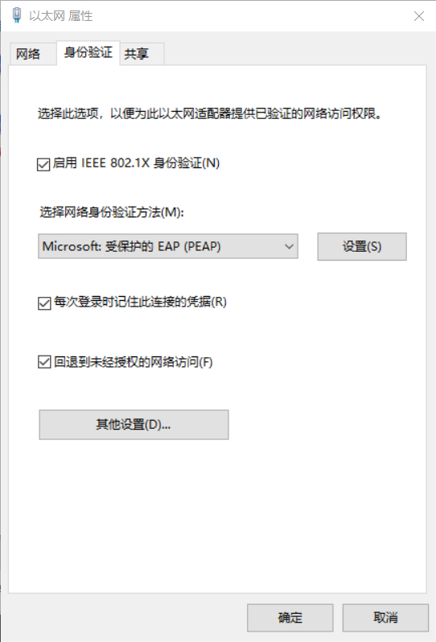

*图 1 - “以太网” 属性 “身份验证” 选项卡*


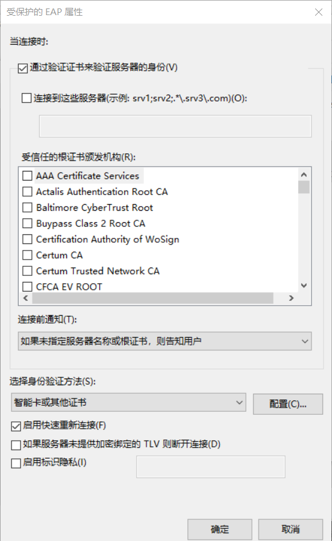

*图 2 - “PEAP” 属性对话框*

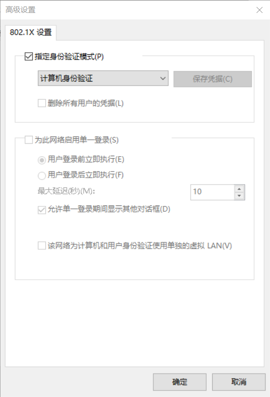

*图 3 - 身份验证 "高级设置" 对话框*


### NPS 服务器侧


在 NPS 服务器上，分别要建立 “连接请求策略” 和 “网络策略”。自接入交换机来的端口接入请求，首先会被 “连接请求策略” 处理，接下来被 “网络策略” 处理（类似于流式编程中的操作）。


#### “连接请求策略”

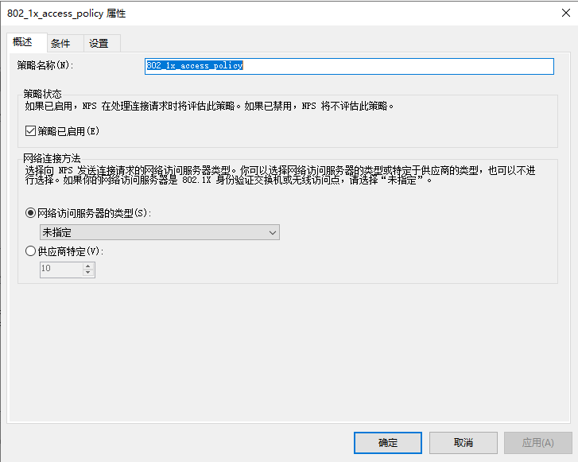

*图 4 - “连接请求策略” 概述 tab 页*

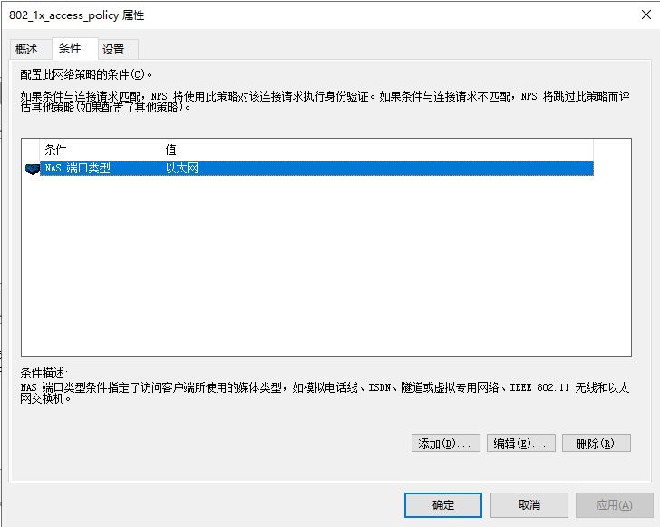

*图 5 - “连接请求策略” 条件 tab 页*

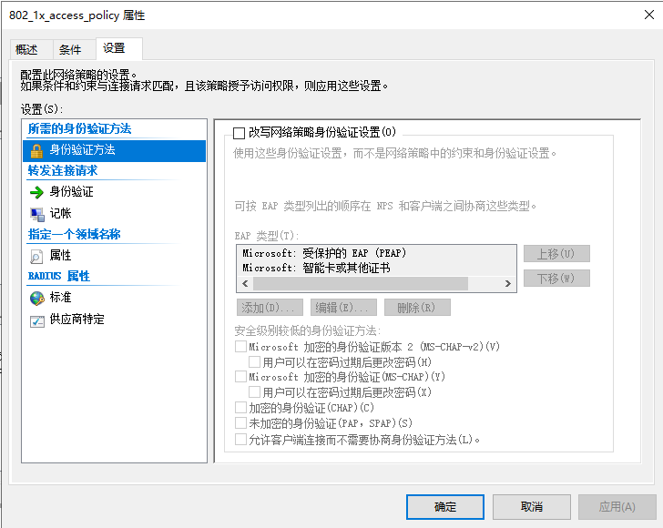

*图 6 - “连接请求策略” 设置 tab 页 - 身份验证方法*

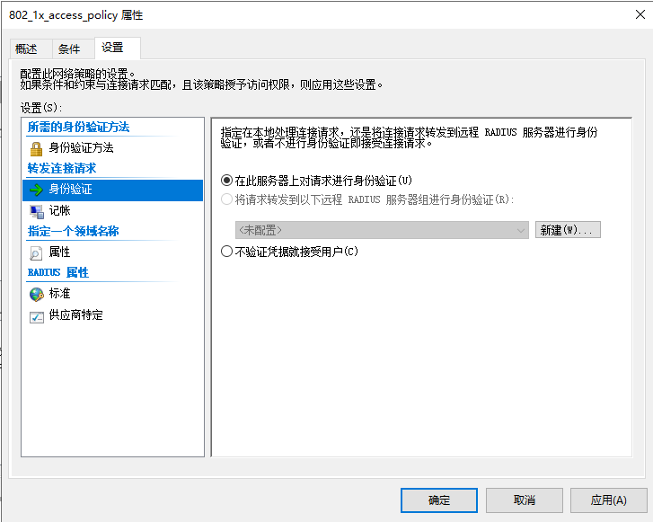

*图 7 - “连接请求策略” 设置 tab 页 - 身份验证*

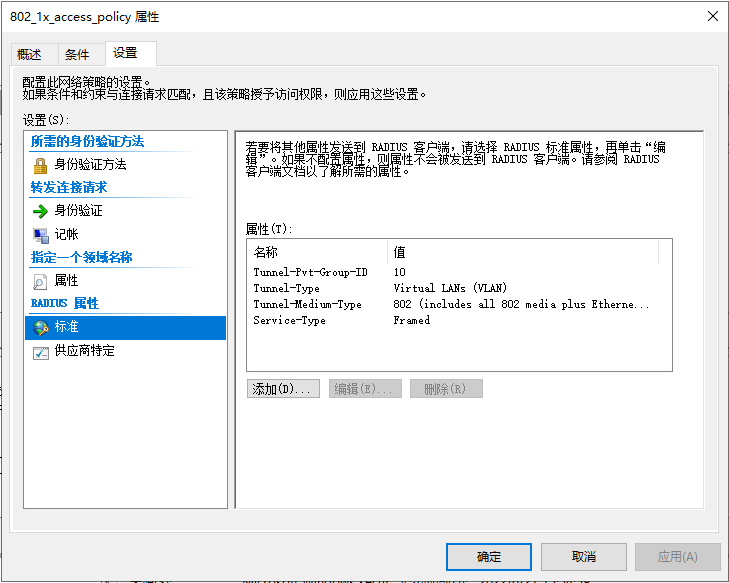

*图 8 - “连接请求策略” 设置 tab 页 - 标准*


#### “网络策略”


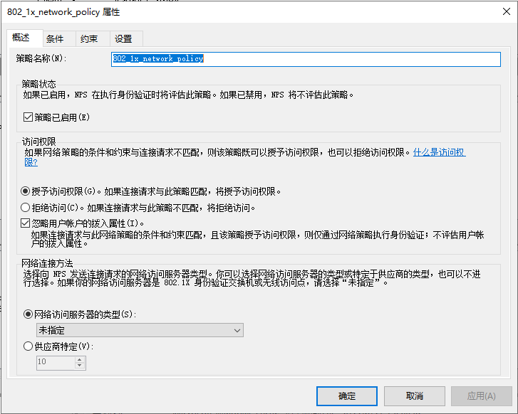

*图 9 - "网络策略" 概述 tab 页*

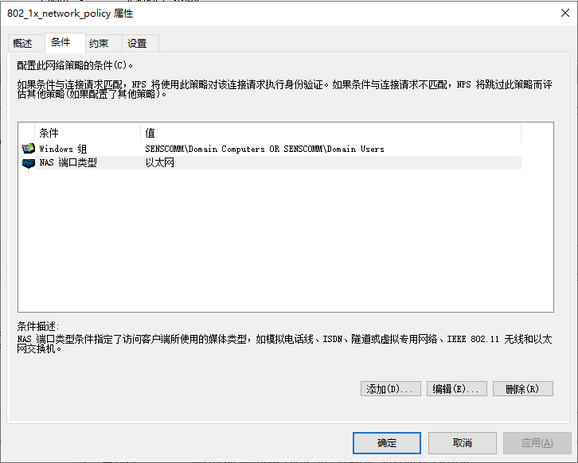

*图 10 - "网络策略" 条件 tab 页*

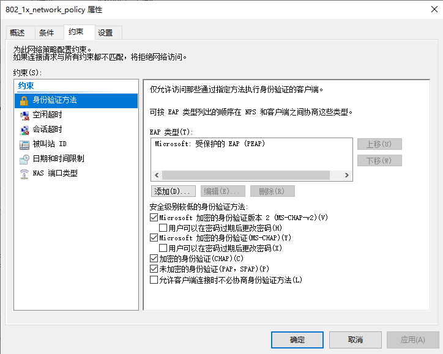

*图 11 - "网络策略" 约束 tab 页 - 身份验证方法*


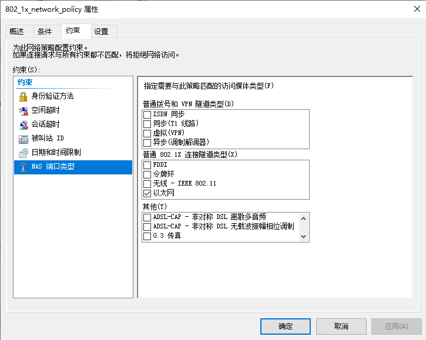

*图 12 - "网络策略" 约束 tab 页 - NAS 端口类型*


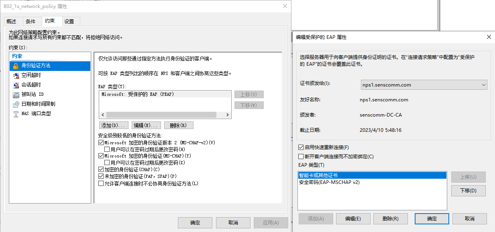

*图 13 - “Microsoft: 受保护的 EAP（PEAP）” - “编辑”*


（End）


