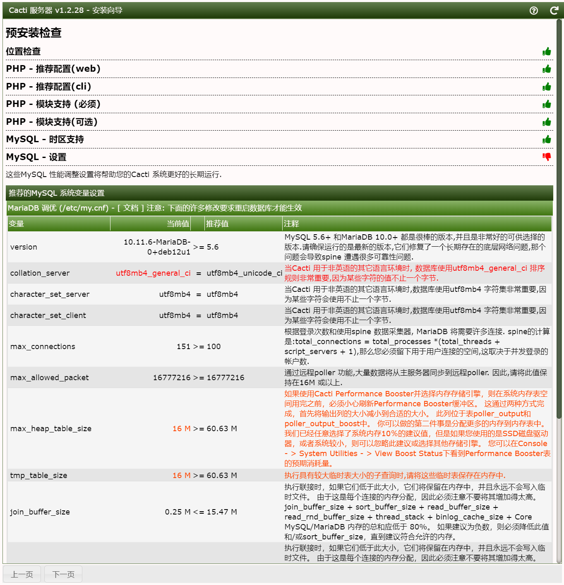
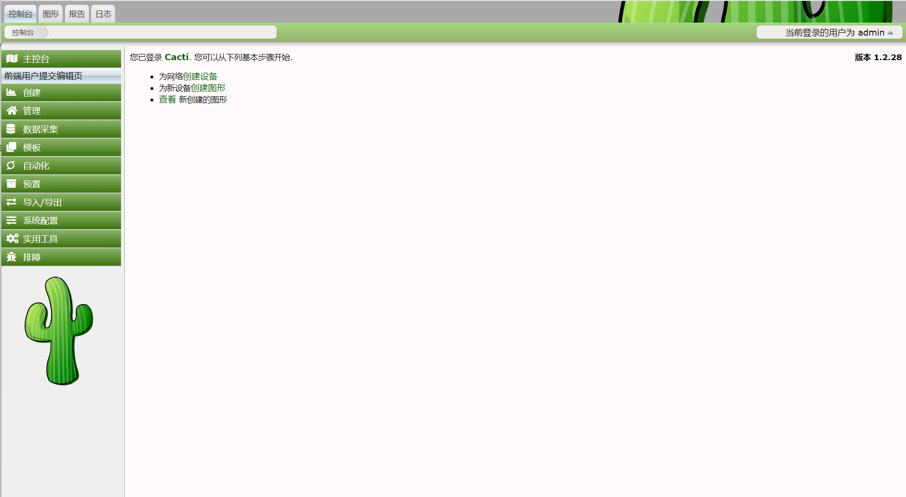
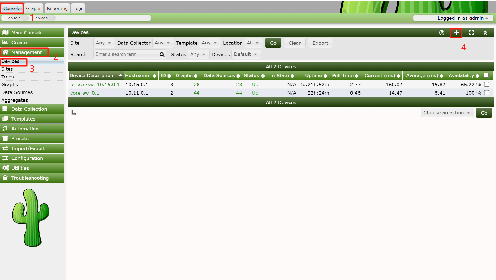
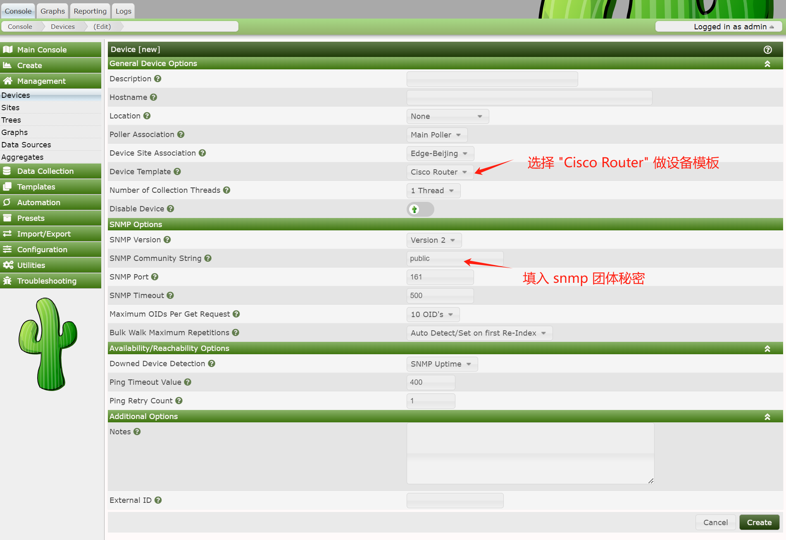
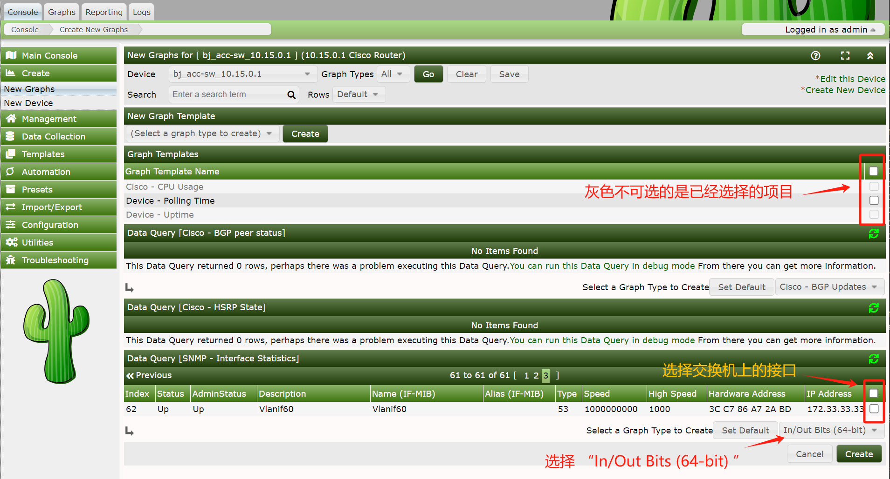

# Cacti 部署笔记


本文记录在 Debian Bookworm（12.7） 上，部署 [Cacti](https://www.cacti.net/) 开源（[Cacti/cacti](https://github.com/Cacti/cacti)）网络监控系统注意点。


## 安装 `nginx`、`snmpd` 与配置 `snmpd`


`snmpd` 会用到私有 MIBS，因此需要在 `/etc/apt/sources.list` 中加入 [`non-free`](https://www.debian.org/doc/debian-policy/ch-archive#s-non-free) 软件包仓库。


```list
# /etc/apt/sources.list

deb https://mirrors.huaweicloud.com/debian bookworm main
deb https://mirrors.huaweicloud.com/debian bookworm-updates main
deb https://mirrors.huaweicloud.com/debian-security bookworm-security main
deb https://mirrors.huaweicloud.com/debian bookworm-backports main
```

然后执行命令

```console
$ sudo apt install -y nginx snmpd
```

安装 `nginx` 与 `snmpd` 两个软件包。


### 配置 `snmpd`


- 修改 `/etc/default/snmpd`，加入 `export MIBS=ALL`；

- 修改 `/etc/snmp/snmp.conf`，加入


```conf
mibs :
rocommunity public localhost
```

> **注意**：加入这个配置后，`sudo systemctl status snmpd` 会显示如下信息。

```console
 snmpd[11916]: /etc/snmp/snmp.conf: line 5: Warning: Unknown token: rocommunity.
```

> 似乎这个告警并不重要。


### 下载 non-free 的 MIB 文件


```console
$ sudo apt install -y snmp-mibs-downloader
$ sudo service snmpd restart
$ sudo service snmpd status
```


## 安装 Cacti 与 Spine


> [`cacti-spine`](https://github.com/Cacti/spine)，Spine 是 Cacti 的多线程数据收集器，能够大规模地从连接了网络的设备中提取数据。他使 Cacti 系统安装，扩大到每个 Cacti 系统监控上万台主机。Spine 采用 C 语言编写，利用 POSIX 线程的优势，直接与 Net-SNMP 库链接，以达到最佳的数据采集速度。Spine 是默认的 `cmd.php` 数据收集器的替代品，后者的可扩展性有限。


```console
$ sudo apt install -y cacti cacti-spine
```

> 在安装 Cacti 的过程中，系统会询问咱们是否希望 `dbconfig-common` 自动为 Cacti 设置 MySQL。这将为 Cacti 创建用户和数据库，然后导入必要的数据。


> **注意**：这里设置的口令，将是安装随后登录用到的口令，而非网络上所说的 `admin/admin`。


Cacti 将安装在 `/usr/share/cacti`。**但是，我们不会使用这个 `apt` 安装的 Cacti**。


## Nginx 配置


我们会使用从 [Cacti 下载](https://www.cacti.net/info/downloads) 的源码包（`cacti-1.2.28.tar.gz`），解压到 `/home/it/cacti-1.2.28`，然后另外创建目录 `mrtg`，并在其下建立到 `/home/it/cacti-1.2.28` 的软链接（建立软链接的目的是后面更方便升级，以及 Nginx 配置的实现）。

```console
$ mkdir mrtg && cd mrtg
$ ln -s ~/cacti-1.2.28 cacti
```


~~Nginx 运行在 `it:www-data` 下，因此需要将 `/usr/share/cacti` 目录修改为 `it:www-data` 所有。并建立 `/var/log/cacti` 及设置为 `it:www-data` 所有。~~


### Nginx 配置文件

```conf
$ cat /etc/nginx/conf.d/cacti.conf
add_header X-XSS-Protection "1; mode=block";
add_header X-Content-Type-Options nosniff;

server {
        # listen 443 ssl default deferred;
        # server_name mrtg.xfoss.com;
        listen 8081;
        server_name _;
        # listen 443 ssl;
        root /home/it/mrtg/;
        index index.php;
        charset utf-8;

        access_log /var/log/nginx/cacti-access.log;
        error_log /var/log/nginx/cacti-error.log;


        location / {
                # try_files $uri $uri/ /index.php$query_string;
                root /home/it/mrtg/cacti;
                index index.php index.html;
        }

        location ~ \.php$ {
                alias /home/it/mrtg/cacti;
                index index.php
                        try_files $uri $uri/ =404;
                fastcgi_split_path_info ^(.+\.php)(/.+)$;

                # you may have to change the path here for your OS
                fastcgi_pass unix:/run/php/php8.3-fpm.sock;
                fastcgi_index index.php;
                fastcgi_param SCRIPT_FILENAME $document_root$fastcgi_script_name;
                include /etc/nginx/fastcgi_params;
        }

        location /cacti {
                root /home/it/mrtg/;
                index index.php index.html index.htm;

                location ~ ^/cacti/(.+\.php)$ {
                        try_files $uri =404;
                        root /home/it/mrtg;

                        # you may have to change the path here for your OS
                        fastcgi_pass unix:/run/php/php8.3-fpm.sock;
                        fastcgi_index index.php;
                        fastcgi_param SCRIPT_FILENAME $document_root$fastcgi_script_name;
                        include fastcgi_params;
                }

                location ~* ^/cacti/(.+\.(jpg|jpeg|gif|css|png|js|ico|html|xml|txt))$ {
                        expires max;
                        log_not_found off;
                }
        }

        ssl_certificate /etc/ssl/xfoss.com/PEM/_.xfoss.com.pem;
        ssl_certificate_key /etc/ssl/xfoss.com/PEM/_.xfoss.com.privatekey.pem;
}
```

上述在 `/home/it/mrtg` 下建立到 `/home/it/cacti-1.2.28` 软链接的目的，也是因为这个 Nginx 配置文件，否则会出现如下问题。


```log
2024/10/16 15:56:27 [error] 24759#24759: *1 "/home/it/cacti-1.2.28/cacti/install/index.php" is not found (2: No such file or directory), client: 192.168.234.1, server: _, request: "GET /cacti/install/ HTTP/1.1", host: "192.168.234.130:8081"
```

## 图形安装


在上述配置下，就可以打开 `http://192.168.234.130:8081` URL，进入图形界面了。此时需要以 `admin/admin` 进入安装过程，并在随后立即要求修改密码（要求有大小写字母特殊符号）。然后安装过程检查环境，需要根据提示，修改以下配置文件。


- `/etc/php/8.3/fpm/php.ini`

- `/etc/mysql/mariadb.conf.d/50-server.cnf`

**注意**：其中两项 MariaDB 的配置：

```conf
max_heap_table_size   = 64M
tmp_table_size        = 64M
```

在上述配置文件中并没有，需要新加入。


修改配置后，执行以下命令分别重启 `php8.3-fpm` 和 `mariadb`。


```console
sudo systemctl restart php8.3-fpm mariadb
```




随后安装过程环境检查通过，正式进入安装步骤。其间，根据提示还需执行以下命令创建出一个所需目录。


```console
$ sudo mkdir -p /var/lib/cacti/csrf
$ sudo chown -R it:it /var/lib/cacti/csrf/
```


安装完成后，如下图所示。





## 交换机配置与添加设备


首先，需要在要监控的交换机上开启并配置 `snmp-agent`，根据品牌型号的不同，配置有所不同。


### H3C S5500V2-54S-EI


```console
system-view

snmp-agent
snmp-agent community read h3ca2022
# 可写权限配置为可选配置
snmp-agent community write h3ca123456
# 适应所有snmp版本
snmp-agent sys-info version v2c
```

> **注意**：其中 `h3ca2022` 和 `h3ca123456` 分别是 `read` 和 `write` 的秘密。

使用 `snmpwalk` 命令验证：


```console
snmpwalk -v 2c -c h3ca123456 10.15.0.1
```


### 华为 FuturMatrix S5735S-L48T4S-A1


```console
[FutureMatrix] snmp-agent
[FutureMatrix] snmp-agent protocol source-interface vlanif 999
[FutureMatrix] snmp-agent sys-info version ?
[FutureMatrix] snmp-agent sys-info version v2c
[FutureMatrix] snmp-agent community read hwca123456
[FutureMatrix] snmp-agent target-host trap address udp-domain 10.15.0.249 params securityname hwca123456 v2c
[FutureMatirx] ctrl + z 
<FutureMatrix> save
```

使用 `snmpwalk` 命令验证：


```console
snmpwalk -v 2c -c h3ca123456 10.11.0.1
```


## 在 Cacti 中添加交换机


此步骤涉及 Cacti 中设备添加，以及随后的从设备创建图形。


### 添加设备




*图 1，Cacti 添加设备*




*图 2，提供设备参数*


### 创建图形





此外，Cacit 中还有树，Trees，的设置等，都较为简单。在查看图形时，点击 `Graphs` 标签页的标签，即可调出侧边栏的 `Default Tree` 来。


> **参考**：
>
> - [How to install cacti With Nginx](https://github.com/blackyboy/Ubuntu-Linux-Stuffs/blob/master/How-to-install-Cacti-Monitoring-Server-With-Nginx.md)
>
> - [Installing on CentOS 7](https://docs.cacti.net/Install-Under-CentOS_LEMP.md)
>
> - [交换机配置 SNMP 团体字](https://blog.csdn.net/C_0010/article/details/128178747)
>
> - [  网络设备监控 - Catic 添加 H3C 的监控图解](https://www.cnblogs.com/yinzhengjie/p/9916437.html)
>
> - [华为数通智选FutureMatrix配置snmpv2c](https://blog.csdn.net/2201_75774378/article/details/136698872)


（End）


