# GNS3 入门


> [Getting Started with GNS3](https://docs.gns3.com/docs/)


## 更新（2025 年 3 月）

时至今日，GNS3 已经发展到 `3.0.4` 版本，已经十分成熟。其安装使用也变得更加简单，已经可以平滑使用思科 iOS、VyOS 镜像，甚至华为 CE12800 镜像，仿真出这些设备并可在其上完成实验。


在基于 ArchLinux 的 Manjaro 发行版中，只需运行一条命令 `yay -S gns3-server gns3-gui`，即可安装好 GNS3。这里记录在 GNS3 `3.0.4` 版本中，添加思科 IOS、Arista、VyOS 与华为 CE12800 镜像的步骤。


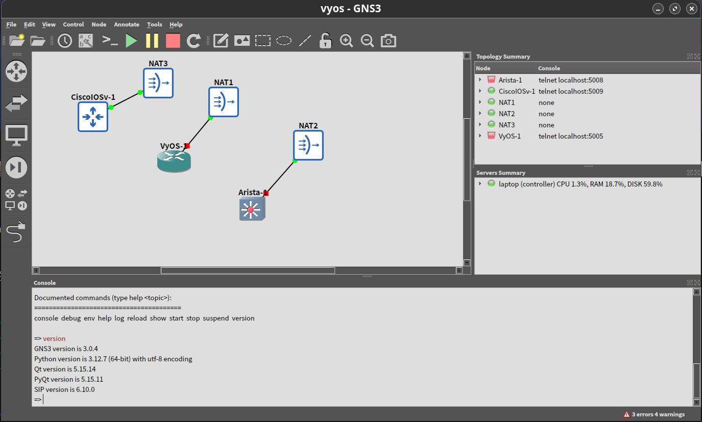


### 思科 IOS 镜像添加


1. 菜单 “Edit” - "Preferences" 打开 GNS3 选项设置对话框；

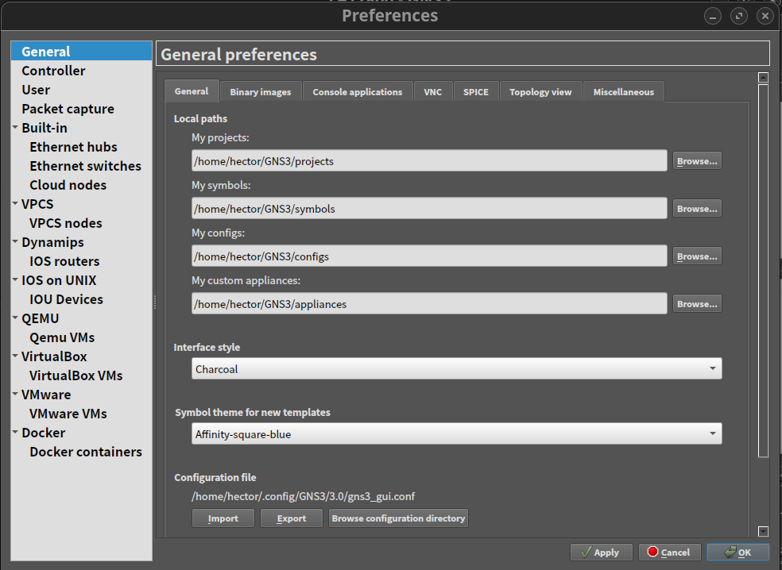


2. 选择左侧的 “Dynamips” - “IOS routers”，进入 “IOS router templates” 设置页面，点击 “New”；

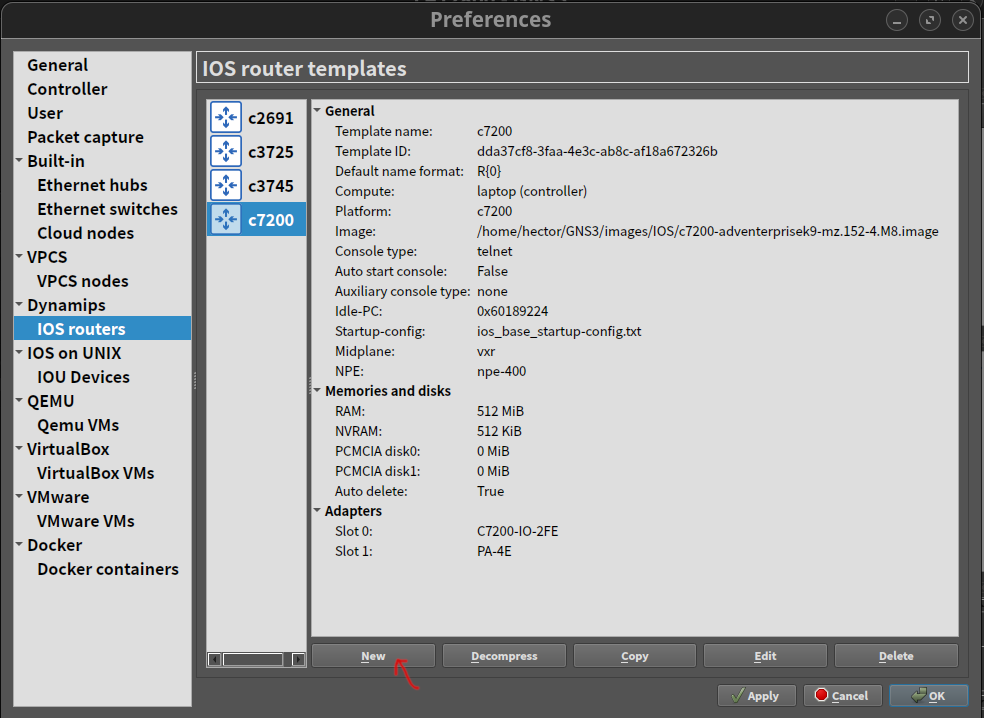

3. 然后一步步添加下载的 IOS `.bin` 镜像文件，添加完成后点击 “OK” 后即可完成。随后在项目的拓扑中使用相应的思科路由器了。


### VyOS `.qcow2` 镜像添加


1. 在 “Preferences” 对话框，选择 “QEMU” - “Qemu VMs” - “New”，添加下载的 VyOS `.qcow2` 镜像，然后点击 “OK” 添加该镜像；

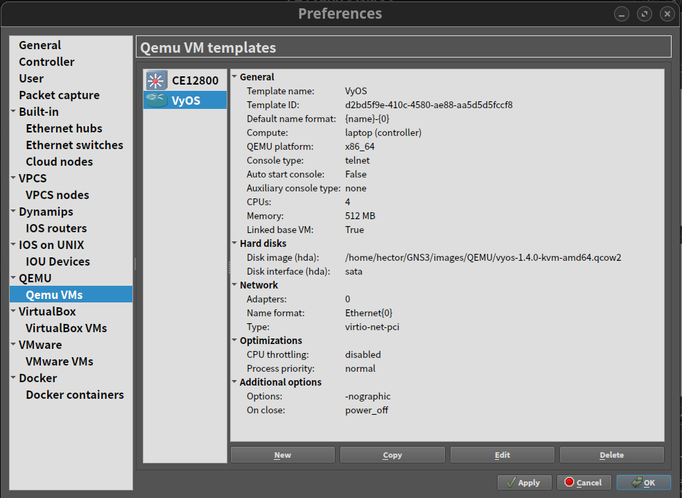


2. 在 “Qemu VM templates” 页面，选中刚添加的 VyOS 条目，点击 “Edit” 编辑其选项。对其做如下这些设置；

- 设置 “Symbol”、“Category”、“Boot priority” 等

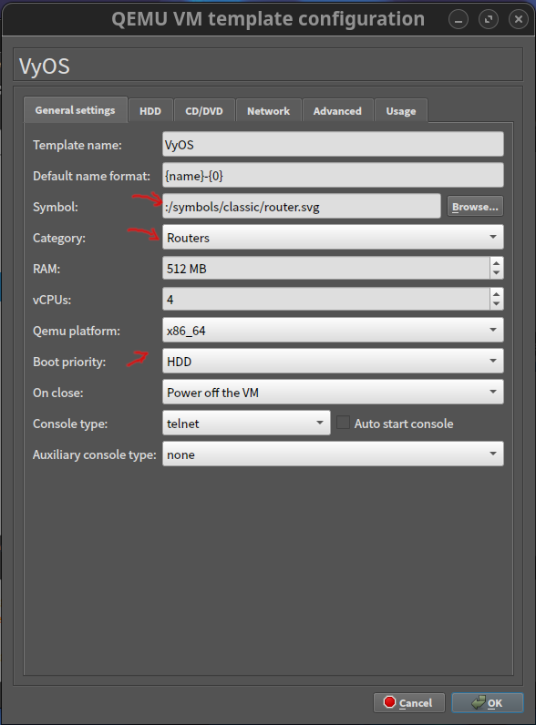

- 设置 “Disk interface”

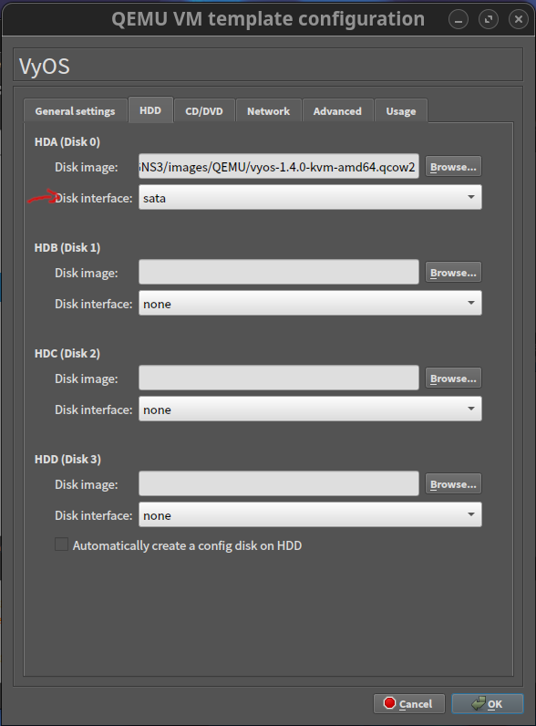

- 设置 VyOS “Network”

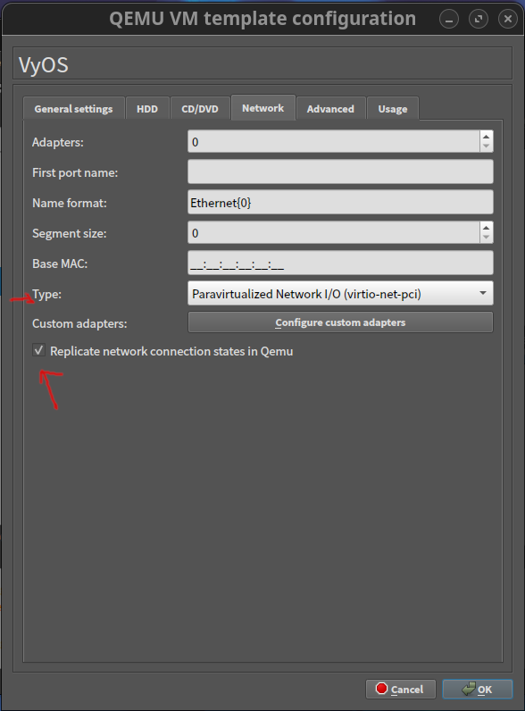


- 设置 VyOS “Advanced”

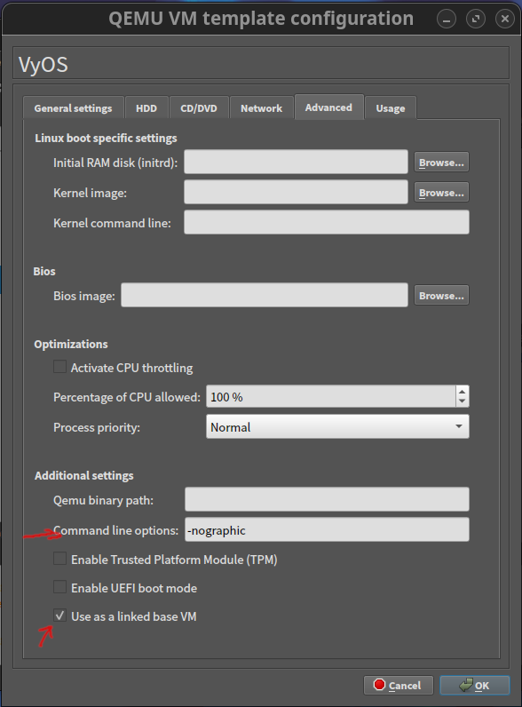


> 参考：[Running on GNS3](https://docs.vyos.io/en/equuleus/installation/virtual/gns3.html)


### 添加 CE12800 `.qcow2` 镜像


像 VyOS 那样添加 CE12800 的 `.qcow2` 镜像。并像 VyOS 那样编辑其配置。

- 设置 CE12800 的 “QEMU VM template configuration” - “General settings”

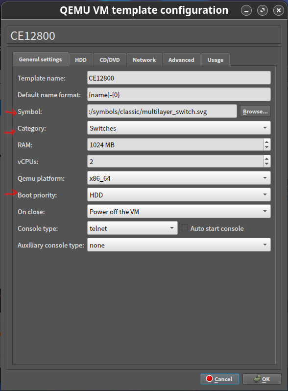

- 设置 CE12800 的 “HDD”

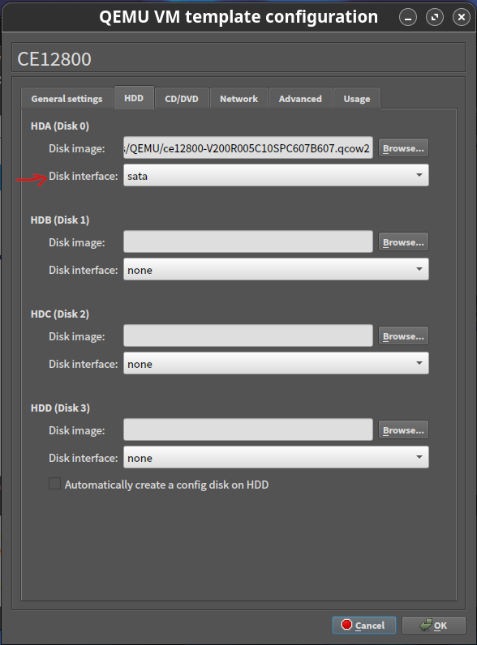

- 设置 CE12800 的 “Network”

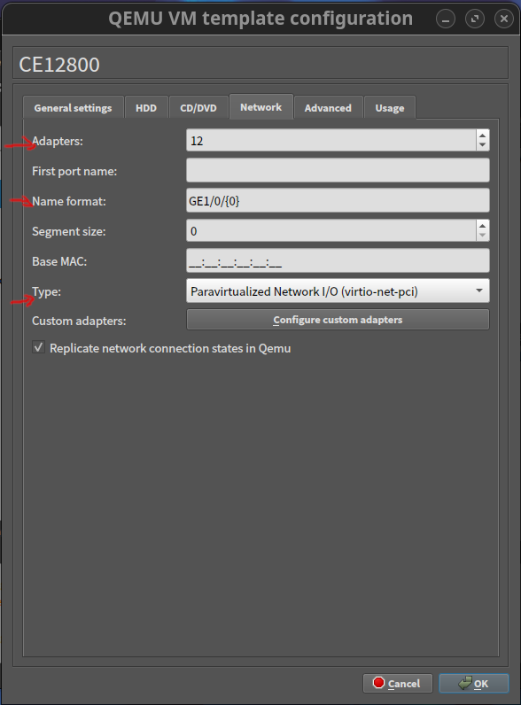


- 设置 CE12800 的 “Advanced”

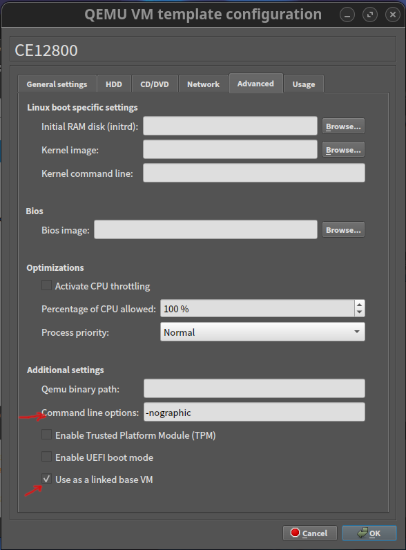


### 添加 Arista 设备 `.qcow2`

像 VyOS 那样添加 CE12800 的 `.qcow2` 镜像。并像 VyOS 那样编辑其配置。


- Arista "QEMU VM template configuration" - "General settings"

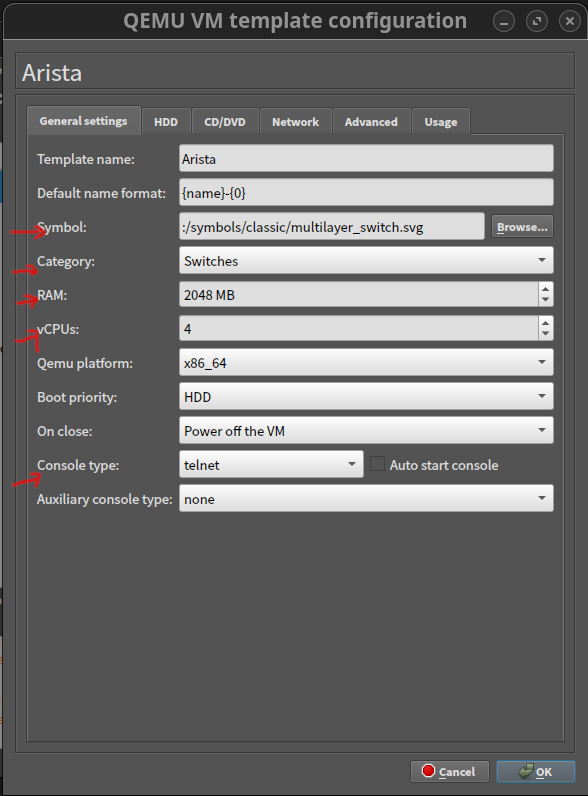


- Arista "QEMU VM template configuration" - "HDD"

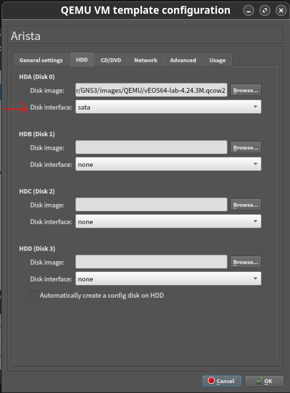

- Arista "QEMU VM template configuration" - "Network"

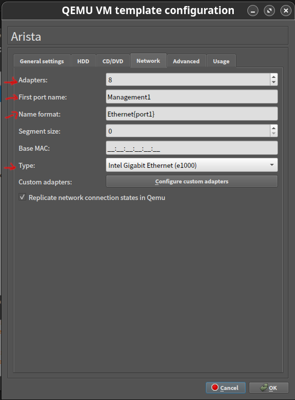

- Arista "QEMU VM template configuration" - "Advanced"

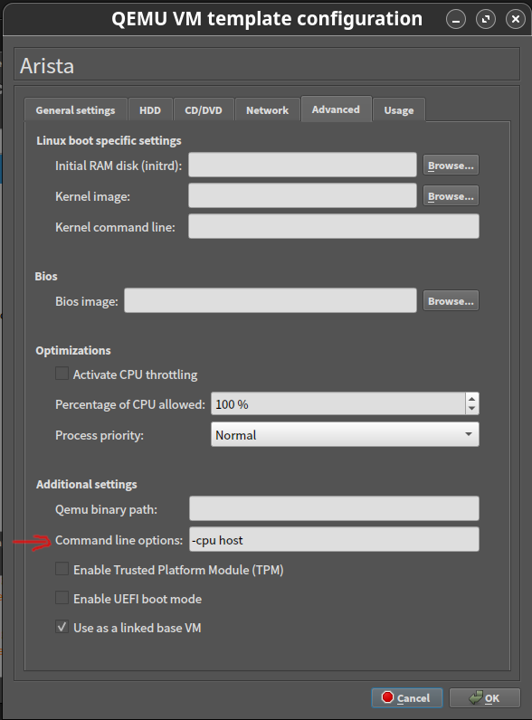


### 将 VyOS/CE12800/Arista 设备连接到宿主机


通过 `Cloud` 或 `NAT` 设备即可将虚拟设备连接到宿主机。可以拖入多个 `Cloud` 或 `NAT` 设备，实现多个虚拟交换机/路由器同时连接到宿主机。


### Arista/VyOS 设备添加 SSH 密钥认证

- Arista 设备


在配置模式下，运行命令以下命令。


```console
localhost(config)# username admin ssh-key ssh-rsa AAA...E8= hector@laptop
```

其中 `ssh-rsa AAA...B8= hector@laptop` 是 `~/.ssh/id_rsa.pub` 里的全部内容。添加 `~/.ssh/id_ecdsa.pub` 的内容（更为简短）也是可以的。


- VyOS 设备

与 Arista 设备不同，VyOS 设备添加 SSH 密钥需要两步。首先添加密钥，接下来要为添加的密钥指定类型。

```console
# set system login user <username> authentication public-keys <identifier> key <key>
# set system login user <username> authentication public-keys <identifier> type <type>
```

比如：

```console
# set system login user hector authentication public-keys hector@laptop key AAA...Bb2w=
# set system login user hector authentication public-keys hector@laptop type ecdsa-sha2-nistp256
```

其中 `hector@laptop` 是所添加密钥的标识符，这样就可以在一台 VyOS 设备上，添加多名用户密钥或同一用户在多台计算机上的密钥。

> 参考：
>
> - [SSH login without password](https://arista.my.site.com/AristaCommunity/s/article/ssh-login-without-password)
>
> - [User Management](https://docs.vyos.io/en/equuleus/configuration/system/login.html#key-based-authentication)


## 简介

世界范围内数十万网络工程师们，都在使用着GNS3，他们使用GNS3来对虚拟与真实网络进行模拟、配置、测试以及故障排除。GNS3允许在笔记本电脑上运行一个有着几台设备的小型拓扑，也可以在跨越多台服务器，以致云上运行有着众多设备的大型拓扑。

GNS3是开放源代码的自由软件，可从 [http://gns3.com](http://gns3.com) 下载到。

GNS3目前仍是活跃开发着，有着超过80万会员的持续增长的社区。加入到GNS3的社区，就意味着你加入了一个由众多学生、网络工程师、架构师以及其他那些已经下载了GNS3超过一百万次的这些人当中。GNS3在世界上的众多公司中都有使用，包括很多财富500强的公司。

在诸如思科CCNA这样的认证考试中，GNS3可以用来备考，也可以对真实世界的网络部署进行测试和验证。GNS3最初的开发者，Jeremy Grossman, 一开始就是为了帮助他的CCNP认证考试编写的这个软件。正是因为他的最初工作，今天我们才可以使用模拟器，而不需要去购买昂贵的硬件，来达到学习网络技术的目的。

10多年前，GNS3就已允许网络工程师将实体硬件设备进行虚拟。最初只能通过使用名为 Dynamips 的软件对思科设备进行虚拟，现在GNS3已经进化到支持多家网络厂商的众多设备了，包括思科虚拟交换机、思科ASAs、Brocade vRouters、Cumulus Linux交换机、Docker实例、HPE VSRs，以及多个Linux设备等等。在 [https://gns3.com/marketplace/appliances](https://gns3.com/marketplace/appliances) 可以查看到这些支持的设备。

> __注意__ GNS3 已有超过10年历史。因此互联网上的一些信息已经过时或完全是错误的。希望这个文档能够回答一些疑问，并帮助你开始GNS3之旅。

> __注意__ GNS3 不止支持思科设备。虽然因为大多数网络工程师都对学习思科设备感兴趣而提到思科设备。在现今的GNS3中，许多其他的商业或是开源厂商都是支持的。如今，你可以对许多不同厂商设备的互操作性进行测试，甚至可以尝试那些采用了SDN、NFV、Linux以及Docker技术的深奥设置。


__建议：__ 如你使用的是旧版本的GNS3，那些建议你将其升级到当前的稳定版GNS3。


## 什么是 GNS3


### 架构

GNS3是由两个软件组建构成的：

- GNS3一体软件（The GNS3-all-in-one software, GUI, 图形用户界面）
- GNS3的虚拟机（The GNS3 virtual machine, VM）


关于GNS3一体软件：

他是GNS3的客户端部分，同时是一个图形用户界面（graphical user interface, GUI）。在本地计算机（Windows, MAC, Linux）上安装这个一体软件，通过他创建出网络拓扑。所谓网络拓扑，就是我们常见到的如下的屏幕截图：

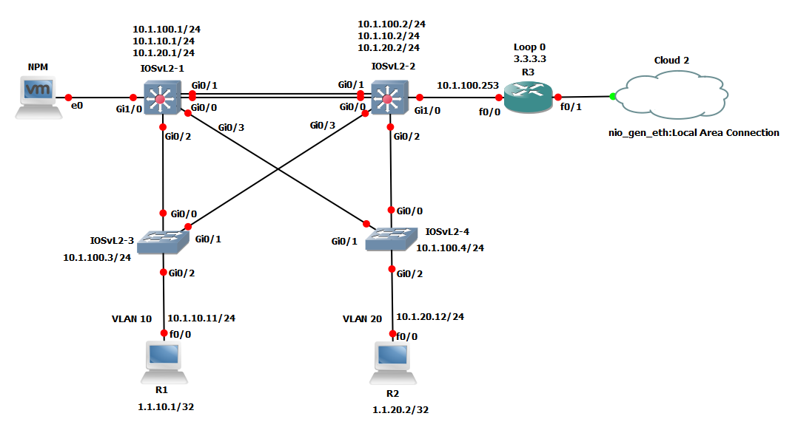


### 服务器选项：

通过一体软件的图形界面客户端，在GNS3中创建网络拓扑时，所创建出的设备就需要经由一个服务器进程进行驻守并运行起来。关于GNS3软件的服务器部分，有少数几个选项：

1. 本地的GNS3服务器
2. 本地的GNS3虚拟机
3. 远程的GNS3虚拟机

本地GNS3服务器运行在安装GNS3一体软件的同一计算机上。比如在使用一台Windows PC时，那么GNS3 GUI与本地GNS3服务器，就都是以进程形式运行在Windows中的。那些诸如Dynamips这样的其他进程，也将运行在PC上：

若你决定运行GNS3虚拟机（推荐做法），那么就既可以在你的PC上，使用诸如 VMWare Workstation、Virtualbox 或 Hyper-V本地运行；或者也可以在运行了VMWare ESXi的服务器上远程运行 GNS3 VM， 甚至还可以在云上远程运行。

> __注意__ 在不使用 GNS3 VM的情况下，同样可以使用GNS3。这在刚开始时是一个好办法，但这种设置带有局限性，而无法提供到与拓扑规模与设备支持相关的许多选项（You are able to use GNS3 without using the GNS3 VM. This is a good way to get started initially, but this setup is limited and does not provide as many choices with regards to topology size and devices supported）。在要创建更多先进GNS3拓扑，或者打算包含诸如思科VIRL设备（IOSvL2, IOSvL3, ASAv），或其他需要Qemu模拟器的设备时，就推荐使用GNS3 VM（而且通常是必要的）。

> __注意__ 仅使用GNS3一体软件来启动一个基本的GNS3拓扑，一旦那个拓扑可以运行，就可以参考附加文档来设置一个本地的GNS3虚拟机了。


### 关于仿真与模拟（Emulation vs. Simulation）

GNS3同时支持仿真与模拟设备。

__仿真：__ GNS3对某个设备的硬件进行模仿与仿真，同时你是在虚拟设备上运行着真实的镜像。比如可以从某台真实的物理思科路由器上拷出思科IOS镜像，进而在GNS3中对思科路由器进行仿真。

__模拟：__ GNS3对某个设备的特性与功能进行模拟，比如交换机。你并未运行真实的操作系统（诸如思科IOS），而是运行的一台由GNS3所开发的模拟设备，就比如GNS3内建的2层交换机。

> __注意__ 模拟与仿真之间的界线，如今已不那么分明的。现在你可以运行真正的思科操作系统的思科VIRL镜像，这些镜像运行在标准的虚拟硬件上。GNS3则是仿真了这些VIRL镜像所需要的硬件。


__记住：__ 无需过多考虑模拟与仿真之间的区别，除非在下面几点情况下：

1. Dynamips 是一种较为陈旧的对思科硬件进行仿真的技术。它使用真实的思科IOS镜像。对于基本的CCNA类型拓扑，是可以的，但有着一些局限，比如只支持较旧的思科IOS版本（12.X），这些版本已不被思科支持或积极更新。

2. 推荐的在GNS3中使用的思科镜像，是思科VIRL（IOSv、IOSvL2、IOS-XRv、ASAv）的那些镜像。这些镜像是受思科支持并处于积极更新中的。所支持的这些镜像，是思科IOS（15.X）的当前发布，同时提供了最佳规模与用户体验（provide the best scale and user experience）。

## GNS3 对照

总会有人问到底那个软件是最好的。这个问题取决于个人喜好，而每种解决方案都有着同样的优势与不足（Questions often arise about which software is best. A lot of this is down to personal preference with all solutions providing some benefits and having some disavantages）。

不堪的过往：如今网工的世界，远好于过去的日子！在以前，网络工程师们为了学习他们的CCNAs、CCNPs或CCIEs，就只有很少的选择：购买或租用物理的思科设备。

如今，在学习或测试网络时，就有了多种选择：

1. GNS3
2. 思科 Packet Tracer
3. 思科VIRL
4. 物理设备
5. 其他方案

### 关于GNS3

如同上面所提到的，GNS3是开放源代码的软件，可以自由下载使用。如想要看看GNS3的代码，那么其源代码在GitHub上可以获取到。GNS3团队希望你发现GNS3是有用、有益的，不过如果你不喜欢GNS3的某些东西，或者想要添加一些特性，就可以为GNS3贡献代码。加入到GNS3社区或志愿者，对代码进行检查或添加代码推荐。在一个有着超过80万成员的社区里，我们总能相互学习。

当然你可以使用其他选项。其中一些是免费的，一些则需要花钱。就使用那些适合于你的吧。在需要时，也可以结合使用多个方案。我们乐于见到今日百花齐放的局面，这有助于我们所有人提升与学习网络技能。

__优势__

- 自由软件
- 开放源码软件
- 没有月度或年度许可证费用
- 没有所支持设备数量上的限制（唯一的限制是你的硬件：CPU与内存）
- 支持多种交换选项（NM-ESW16以太网交换模块、IOU/IOL二层镜像、VIRL IOSvL2）
- 支持所有的VIRL镜像（IOSv, IOSvL2, IOS-XRv, CSR1000v, NX-OSv, ASAv）
- 支持多厂商环境
- 可带或不带管理程序运行（Can be run with or without hypervisors）
- 支持免费或付费的管理程序（Supports both free and paid hypervisors, Virtualbox, VMWare workstation, VMWare player, ESXi, Fusion）
- 提供了下载，自由，预先配置好的，优化过的配置，可简化部署
- Linux下的原生支持，无需额外的虚拟软件
- 可免费使用多家厂商的软件
- 大型活跃的社区（超过80万成员）


__不足__

- 需要由用户提供思科的镜像（从cisco.com下载，或购买VIRL许可证，或从物理设备上拷出来）
- 不是一个自包含的软件包，而需要本地安装的软件（GUI）
- 因为是本地安装，GNS3会受到你的PC设置和限制的影响（防火墙、安装设置、公司笔记本电脑策略等等）


### Packet Tracer

思科 Packet Tracer 是一个思科给思科学院学员使用的官方产品，对思科网络进行模拟。其并不对思科硬件进行仿真，也不支持思科或其他厂商的真实镜像。

__优势__

- 易于设置
- 支持思科路由器、交换机及PC的模拟
- 对于CCNA的学习是足够的
- 模拟多个设备与协议（路由器、交换机、无线、RADIUS等等）
- 免费的（需要在思科的 NetAcad网站上注册）


__不足__

- 代码专有 --不是开源的
- 只模拟思科设备（并未运行真正的思科镜像）
- 不是多厂商支持
- 无法与真实的物理设备进行集成
- 只能使用其开发者实现了的那些IOS命令。不是所有Packet Tracer中所模拟的平台上的命令，都是可用的


### 思科VIRL

思科已经创建出另一个官方支持的网络模拟平台 - 思科虚拟互联网路由实验室（Cisco Virtual Internet Routing Lab, VIRL）。与思科Packet Tracer相比，这是一个强大得多的方案，从而不仅能够在上面学习，也可以对真实网络进行模拟。

> __注意__ 思科VIRL是一个与GNS3更为接近的产品，除了学习思科技术外，还允许网络工程师对真实世界的网络进行模拟。


__优势__

- 支持思科路由器、交换机、防火墙及PC的模拟（IOSv, IOSvL2, ASAv...）
- 对于CCNA、CCNP及CCIE的学习都不错
- 支持思科防火墙（ASAv）
- 丰富的协议与特性支持：RPCST+、Etherchannel、端口安区、MPLS、VRFs等等，完整清单参考这里: [http://virl.cisco.com/work/](http://virl.cisco.com/work/)
- 支持最新版的思科IOS（15.X）


__不足__

- 不是自由软件。需要支付每年$200的个人版VIRL订阅费
- 所支持的设备数量有限。使用个人版时，每个网络拓扑不能超过20个思科节点
- VIRL的配置较为复杂
- 资源密集（需要的内存与CPU很大很高）
- 需要虚拟软件（VMWare Workstation Player/Pro, Fusion 或 ESXi）
- 不支持VirtualBox
- 不具有多厂商支持 -- 只支持思科的网络设备


> __注意__ GNS3支持所有的VIRL镜像。可将VIRL镜像倒入到GNS3中，并在每个拓扑下不加限制的进行使用（仅受限于你的硬件资源）。


## 设备支持

GNS3支持多厂商的众多设备，同时随时都有更多设备添加近来。GNS3 marketplace是查看当前支持设备清单的最佳位置：

[https://gns3.com/marketplace/appliances](https://gns3.com/marketplace/appliances)


## 用例

GNS3最为著名的，是用作学习与教学的一个平台。为网络技术学生与网络工程师用于实践和准备诸如思科CCNA这样的厂商考试，GNS3被使用已有多年。

GNS3也可用于其他诸如概念验证与商业演示等用例。GNS3提供了一种容易的、极具成本优势的方式的新型软件，诸如网络管理或软件定义网络类软件。其实现了虚拟实验室环境下，而非必需特定物理设备，对多家厂商的互操作性进行测试。

在一台笔记本电脑上，就可以创建出整个的GNS3拓扑并加以运行。这就允许工程师把网络拓扑与软件，在路上给客户或其他人演示了。

使用GNS3的其他理由：

- 无需网络硬件，即可进行预部署测试的实时网络模拟：运行对网络硬件真实行为进行仿真的操作系统
- 在无风险的虚拟环境中对超过20家不同网络厂商进行测试：无需硬件就可以快速对多家硬件厂商进行运行和测试
- 为故障排除与概念验证（proof of concept, PoC）测试，创建动态网络地图：在构建网络之前，就对你的网络进行测试，以缩短获得生产网络运行起来的时间
- 可将GNS3与真实网络连接起来：通过将GNS3技术直接连接到真实网络，从而利用上既有硬件，并将当前实验室进行扩展
- 为网络认证考试训练目的，对GNS3中的网络拓扑与实验进行定制：GNS3是网络从业者寻求各种认证的最佳学习工具，而无需在家里搭建一个实验室


## 关于GNS3的版本

当前最新版的GNS3可在这里找到：[https://gns3.com/software](https://gns3.com/software)


GNS3的开发版本，可在这里找到： [https://github.com/GNS3/gns3-gui/releases](https://github.com/GNS3/gns3-gui/releases)

> __注意__ 请使用最新的稳定版GNS3。只有在遇到问题或GNS3数据丢失时，才去使用开发中的发布版本。在准备考试或有某个最后期限的项目时，不要使用开发中的版本。


## GNS3帮助与支持

GNS3提供了多种获取帮助的途径，包括：

### 文档

可在这里访问到GNS3文档：[https://docs.gns3.net/](https://docs.gns3.net/)

### 社区

社区时获得帮助的最佳场所。加入到数以万计的GNS3用户与专家，进而互相帮助，让GNS3成为主流。[http://gns3.com/community](http://gns3.com/community)

__什么可以做__: 在GNS3社区可以汇报程序缺陷（bugs）并提问

__什么不可以做__： 不要谈论违法的事，或违反GNS3用户政策的事。不要试图索取思科IOS镜像。不要分享思科IOS镜像。不要做任何试图盗版或违反法律的事。

### GNS3 Youtube 频道

可在David Bombal的GNS3频道上观看视频：

[https://www.youtube.com/playlist?list=PLhfrWIlLOoKPTPPv6ZiNHFM2FKAZ96f-r](https://www.youtube.com/playlist?list=PLhfrWIlLOoKPTPPv6ZiNHFM2FKAZ96f-r)


### GNS3课程

可在GNS3线上学院的GNS3课程注册，学习GNS3：

[http://academy.gns3.com/](http://academy.gns3.com/)

## 所支持的操作系统

GNS3支持以下操作系统：

- Windows 7 (64 bit)
- Windows 8 (64 bit)
- Windows 10 (64 bit)
- Windows Server 2012 (64 bit)
- Windows Server 2016 (64 bit)
- Mac OS X Marericks(version 10.9) and later
- Linux

其他可运行GNS3 VM的平台：

- ESXi
- 诸如packet.net这样的基于裸金属云提供商（Bare Metal Cloud based providers such as Packet.net）


## 支持的设备

__Supported Appliances__


GNS3支持多种操作系统、设施及仿真器。[我该使用哪种仿真器](https://docs.gns3.com/docs/emulators/which-emulators-should-i-use)


## 需要使用GNS3虚拟机吗？

在使用Windows或Mac OS时，对于绝大多数模拟，都建议使用GNS3的虚拟机。GNS3开发团队花费了大量精力来创建出了一个轻量、可靠的，避开了在使用本地安装的GNS3时遇到过的多种常见问题的，创建GNS3拓扑的方法（The GNS3 development team have worked hard to create a lightweight, robust way of creating GNS3 topologies that avoids multiple common issues experienced when using a local install of GNS3）。这些问题就包括在Windows（不推荐）上原生运行VIRL时，缺少合适的Qemu支持的问题。

但如果只是要创建基本的，使用思科IOS路由器的GNS3拓扑，那么本地（Dynamips）安装就足够了。本地安装就是说，只安装GNS3的图形用户界面，而不使用GNS3的虚拟机。

本地安装是更简单的设置，但有许多限制，可作为GNS3之旅的起点。在逐渐适应了GNS3之后，就建议往GNS3的虚拟机设置过渡，获得GNS3的丰富选项与最佳优化。

> __注意__ 在Windows与Mac OS上使用GNS3的虚拟机。在Linux上原生运行GNS3时，GNS3虚拟机是可选的，而非必须的。


## 不支持或不推荐的

### ASA 8


> __注意__ ASA 8不被支持

在互联网上可以找到很多有关如何从物理设备提取ASA 8镜像，并在GNS3中进行使用的教程。这种办法在过去是唯一获取到ASA镜像的办法，但具体结果是随机的。在现代计算机和操作系统中这种情况变得更糟了。比如在Windows 10中运行ASA 8就有许多问题。

这样做的问题在于，所使用的镜像是为思科的特定设备制作的。Qemu可以对该硬件进行部分仿真，但特定于物理ASA的一些组建是缺失的。比如硬件ASA设备的硬件时钟就没有。ASA的内核有时可以将其你的计算机速率对其替代，但结果总是根据具体情况而定。

在同时运行多个ASAs会遇到各种问题。

### 带Qemu镜像的本地安装

__Local install with Qemu images__

在Windows或 Mac OS上，GNS3不支持或不推荐本地GNS3安装下使用Qemu镜像。此时应该在GNS3虚拟机中使用Qemu镜像。

__Qemu 镜像示例__ IOSvL2, IOSv, IOS-XRv, ASAv以及GNS3网站上所有可用的设备：[https://gns3.com/marketplace/appliances](https://gns3.com/marketplace/appliances)


## 关于复杂网络拓扑

在Windows或Mac OS上创建复杂网络拓扑时，推荐使用GNS3虚拟机。只有在创建简单GNS3拓扑时，才使用本地安装的GNS3。


（End）


