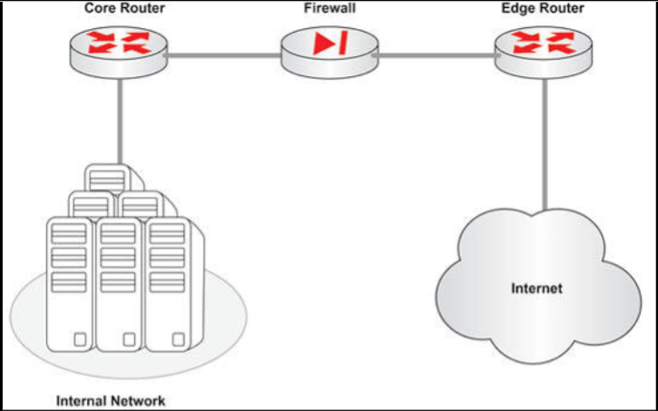
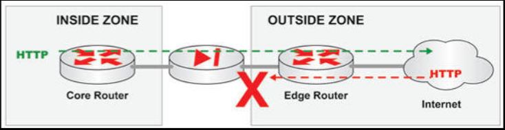
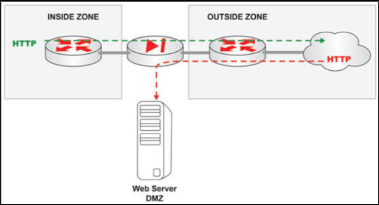
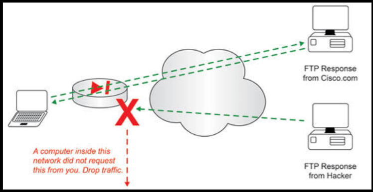

# 防火墙

防火墙一直处于 CCNA 考试大纲边缘，但也仅限于笼统地了解他们所发挥的作用。CCNA (CyberOps)、CCNP 和 CCIE 的安全方向，要求深入了解防火墙技术。

为了反映现代 CCNA 工程师的角色，咱们现在就要求对他们如何完成他们的工作，有些许更多了解。但是，配置与故障排除，则在考试大纲范围之外。请记住，防火墙可能是网络问题的原因，特别是由于防火墙的工作即是过滤数据包，而出现的数据包丢失。当 ICMP 被咱们的防火墙阻止了时，防火墙将阻止咱们使用 `ping` 命令作为咱们故障排除的一部分。

## 防火墙的目的

我们稍后会介绍访问控制列表，但咱们可能已经知道，他们是基于 IP 地址、源、目的、协议、端口号等，放行或拒绝流量的一些配置行。一旦咱们掌握了这点，咱们将很容易理解防火墙的概念。

防火墙通过分析并对流经他的流量采取操作，而保护网络。所需的流量（通常是 HTTP、FTP 等等）会在防火墙上放行，而不需要的流量则被阻止。与 ACL 一样，咱们要指定咱们希望哪些流量通过防火墙，打算要阻止哪些流量。不过，与 ACL 的比较到此为止。防火墙可以做得更多，因为他们被设计来提供健壮与智能的网络数据包过滤方案。我们将在这一小节稍后，深入探讨这些细微差别。

> *知识点*：
>
> - access control lists, ACLs

## 防火墙的位置

通常情况下，防火墙将被放置在其要保护网络的边缘。例如，防火墙通常会被放置在核心路由器和边缘路由器（即连接某个外部提供商的路由器）之间，比如互联网服务提供商。这些方面及术语，在思科设计考试中有更详细介绍，我（作者）强烈建议咱们参加这些考试。

**图 1.13** -- **标准防火墙布置**

在上面的图 1.13 中，该防火墙正保护内部网络不受互联网影响。这是一种非常高级别但常见的防火墙设计。防火墙正保护内部网络，不受来自互联网的不必要流量影响。一个很好的比喻可能是，防火墙就像站在高级夜总会门口的保安。他看到每个人（数据包）都试图进入这扇门（接口），但只允许在贵宾名单（防火墙规则）上的人（数据包）进入。防火墙规则放行的数据包，可以通过防火墙。所有别的数据包，都将被防火墙丢弃。

当然，咱们还可以设置一些将公司各部门分隔开，或面向在家工作员工的内部防火墙。这都将在咱们网络的设计阶段决定。

## 安全区

**Security Zones**

在定义他们要保护的哪些网络区域，与保护免受威胁的那些网络区域时，防火墙会用到安全区的概念。防火墙通过使用具体定义了哪个网络主机可发起从一个安全区到另一安全区连接的规则，提供保护。这些规则被编程到应用中，并保存在防火墙上。一般来说，受保护的网络越小，规则就越少，而该网络越大，则所需的规则就越多。对于一些大型企业网络，防火墙实际上可能有成百上千的规则，管理起来可能非常复杂。

在防火墙的基础部署中，他会划分两个区域，而允许一个区域的主机，发起到另一区域中主机的连接。在下图 1.14 中，该防火墙正允许企业网络中的主机，发起到互联网的 HTTP（端口 80）请求，这样用户就可以浏览被视为那个顶部的数据流（以虚线箭头表示）的流量。某种 IP 数据流，基于（大部分或全部）以下的数据包属性列表：

- 源地址
- 目的地址
- 源端口
- 目的端口
- 三层协议类型
- 服务等级，Class of Service
- 路由器或交换机接口

> *知识点*：
>
> - the corporate network

**图 1.14** -- **安全区，Security Zones**

咱们认为公司防火墙应允许互联网用户，发起返回内部网络的 HTTP 请求吗？不，咱们不会希望邀请这种类型的流量，因此咱们将阻止那个底部数据流。

当咱们确实希望互联网用户，访问公司的 Web 服务器了解公司情况并提交订单呢？在这种情形下，咱们将创建一个与内部网络隔离的新安全区，这样任何来自互联网的流量，都会前往 Web 服务器。这个安全区通常被称为 DMZ，或非军事区，demilitarized zone。在军事上，这是个不属于任何一方的区域，而这适合用在组网中。尽管公司拥有并运营着 DMZ，但他也明白，由于互联网用户众多，这个区域总会以在某种方式受到影响，且实际上是个共享空间。

**图 1.15** -- **DMZ 安全区，DMZ Security Zone**

安全区可根据数据库、Web 服务器、机密信息，甚至根据那些需要自己的受限进出访问区域的人员团队创建。无论何种类型的安全区创建，防火墙都是其理想方案。

## 防火墙的高级功能

若防火墙的作用，仅仅是放行或拒绝安全区域间的流量，他们很容易就被已可使用 ACL 或前缀列表，完成这一功能的路由器取代。防火墙的难能可贵之处在于，他们提供了需要软件、处理能力，与单独的网络布局，以及一种专门的安全设备，而将路由器留作完成其设计的任务（即路由数据包）。

以下是防火墙可执行的一些，路由器很难或不可能完成的任务：

- 将数据包与基于 OSI 模型多层中条件的成千上万规则比较；
- 监控及实现应用层（七层）数据流的详细分析，做出过滤决定；
- 基于先前接收的数据包信息，做出过滤今后数据包的决定。

通过分享几个示例，咱们便可有望理解，对于这些类型的复杂事务，专用的处理及内存资源是需要的。另一方面，路由器和交换机需要尽可能高效地迁移流量，以便流量能够快速地从源移动至目的地。并不是说路由器无法执行复杂过滤或流量分析，而是理想情况下他不应做这些事情。

## 有状态防火墙与无状态防火墙

有状态的防火墙可以跟踪，例如，到某个 Web 服务器每秒的连接数，以了解典型连接数为何（如每秒五到六个连接）。然后，当该状态变化时，即若连接达到每秒 100 个时，那么有状态防火墙就会注意到这点，然后分析正发生什么。防火墙能区分其是否为某种拒绝服务攻击，当就是这种情况时，他将开始丢弃这些数据包，这样 Web 服务器就不会受这种攻击的负面影响。路由器将无法执行这种类型的任务，因为他无法分析历史数据，及根据数据做出决定。

有状态防火墙运行于 OSI 模型的第 3、4 和 5 层。他们在现代网络中无处不在。所有数据流都保存在一个防火墙用于检查攻击、放行或拒绝数据包，以及供网络管理员检查的状态表中。

在接下来的示例中，只有当请求来自某个内部源时，有状态防火墙才放行 FTP 流量进入网络。防火墙会跟踪传出的 FTP 会话请求，并当 FTP 响应不是从内部网络请求的时，阻止这些来自互联网的任何 FTP 响应。

**图 1.16** -- **有状态防火墙**

无状态防火墙不具备根据历史数据做出决定的增强能力（即他不关心数据包是某个既有连接的一部分，还是某个新连接的一部分）。无状态防火墙会观察实时网络流量，并根据一些静态值，比如源或目的地址阻止流量。他们不考虑流量模式，或数据流的历史。他们对流量进行简单及静态的比较，并将流量与防火墙的一些定义好的规则检查比对。由于这些因素，无状态防火墙不太常用。
