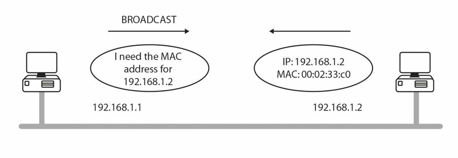
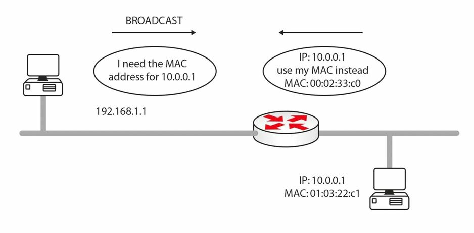

# TCP/IP

TCP/IP 是一套是使通信能经由网络进行的完整协议和服务。TCP/IP 早期的竞争对手，如 IPX/SPX 等，都已由于缺乏采用和持续开发而消亡。

TCP/IP 是一套由互联网工程任务组（IETF）负责维护的，可免费获取并免费使用的标准。他被用于端到端的设备连通性。其已经由众多提交评论请求（RFC）的提交，得以开发和改进，RFC 是一些由工程师提交，传达新的概念或进行同行评审而提交的文档。一个示例是 RFC 2663 中讨论的网络地址转换 (NAT)。IETF 采用了其中一些 RFC 作为互联网标准。咱们可通过下面这个链接，了解有关 IETF 和 RFC 的更多信息：

[IETF  | Internet Engineering Task Force](https://www.ietf.org/rfc/)

TCP/IP 提供了许多服务，但其中许多都超出了 CCNA 考试的范围而不会涉及。我（作者）还将略去后面章节中会涵盖的那些内容，比如 DNS 和 DHCP。以下小节概述了 TCP/IP 的一些基础。由于 CCNA 并非一门基础网络考试，因此就希望咱们已有一些网络概念的良好掌握，比如在 CompTIA 的 Network+ 考试中，学到的那些知识。

## 传输控制协议（TCP）

TCP 运行于 OSI 模型的传输层。他为网络设备间的可靠数据传输，提供了面向连接的服务。TCP 还提供了流量控制、排序、窗口化及错误检测等。他会将一个 32 位的头部，附加到应用层数据，其又会被封装以一个 IP 头部。TCP 是在 [RFC 793](https://datatracker.ietf.org/doc/html/rfc793) 中描述的。常见的 TCP 端口包括以下这些：

- FTP 数据 - 20
- FTP 控制 - 21
- SSH      - 22
- Telnet   - 23
- SMTP     - 25
- DNS      - 53 （也使用 UDP）
- HTTP     - 80
- POP3     - 110
- NNTP     - 119
- NTP      - 123
- TLS/SSL  - 443


## 互联网协议（IP）

IP 运行于 OSI 模型的网络层。其是无连接的，负责透过网络传输数据。IP 寻址是互联网协议的一项功能。IP 会检查每个数据包的网络层地址，并确定该数据包到达目的地所采取的最佳路径。互联网协议在 [RFC 791](https://datatracker.ietf.org/doc/html/rfc791) 中有详细讨论。


## 用户数据报协议（UDP）

UDP 也运行于 OSI 模型的传输层。他会传输网络设备间的信息，但与 TCP 不同，在传输前没有连接建立。UDP 是无连接的。他会提供提供尽力而为的投送，但并无数据将到达目的地的保证。UDP 很像是发送一封没有回信地址的信件。咱们知道信已经发出，但咱们永远不知道这封信是否到达那边。

相比 TCP，UDP 消耗更少带宽，而适用于那些更注重低延迟而非可靠性或保证的应用。TCP 和 UDP 都由 IP 承载。UDP 是在 [RFC 768](https://datatracker.ietf.org/doc/html/rfc768) 中描述的。常见的 UDP 端口编号如下：

- DNS  - 53
- TFTP - 69
- SNMP - 161/162


## 文件传输协议（FTP）

FTP 运行于应用层，负责透过一条远程链路可靠地传输数据。由于其必须是可靠的，FTP 使用了 TCP 来数据传输。

咱们可使用 `debug ip ftp` 命令调试 FTP 流量。所谓调试，是种我们将在后面详细介绍的故障排除工具。

FTP 用到端口 20 和 21。通常，一个初始连接，会从客户端构造至 FTP 服务器的端口 21 上。然后第二个数据连接会被构造，要么从 FTP 服务器的端口 20 离开，要么从客户端的随机端口到 FTP 服务器的 20 端口。咱们可能希望从咱们自己的信源，阅读更多关于主动 FTP 和被动 FTP 的信息，但这大概将不会在 CCNA-级别的考试中涉及。


## 简单文件传输协议（TFTP）

对于可靠性较低的数据传输，TFTP 提供了一种不错的替代。TFTP 通过利用 UDP 的端口 69，提供了一种无连接的传输。TFTP 可能难于使用，因为咱们必须准确指定文件所在的目录。

要使用 TFTP，咱们需要有个客户端（路由器，在咱们的情形下）以及某种 TFTP 服务器，这可以是台路由器或 PC 机，或网络上的服务器（最好在同一子网）。咱们需要有服务器上的 TFTP 软件，以便文件可从服务器上拉取，并被转发到客户端。

> **在现实世界中**：在网络上有台包含着启动配置与 IOS 备份副本的服务器，确实是个非常好的主意。


TFTP 在 Cisco 路由器上被广泛用于备份配置及升级路由器。以下命令将执行这些功能：

```console
Router#copy tftp flash:
```


咱们将被提示输入新闪存文件所在的另一主机的 IP 地址：

```console
Address or name of remote host []? 10.10.10.1
```


然后，咱们将必须输入另一路由器上的闪存映像名字：


```console
Source filename []? /c2500-js-1.121-17.bin
Destination name [c2500-js-1.121-17.bin]?
```

当咱们有着某个旧版本的 IOS 时，那么在拷贝前咱们可能会被提示擦除咱们路由器上的闪存，然后文件将被传输。当该路由器重新加载时，咱们的闪存镜像文件，就应可用了。

其他可选命令是当咱们打算存储一份备份拷贝时的 `copy flash tftp`；或当咱们打算备份咱们的运行配置文件时的 `copy running config tftp`。

咱们可以 `debug tftp` 命令，对 TFTP 流量运行一次调试。

## 简单邮件传输协议（SMTP）

SMTP 定义电子邮件如何从客户端发送到电子邮件服务器。他使用了 TCP 确保一种可靠连接。SMTP 的电子邮件会以不同方式，从 SMTP 服务器上拉取下来，而 ICMP 被大多数网络用作一种电子邮件投送服务（译注：这里原著可能错误写作了 SMTP）。POP3 是完成电子邮件投送的另一种流行方式。POP3 是一种将电子邮件从服务器传输到客户端的协议。SMTP 使用了 TCP 的端口 25。


## 超文本传输协议（HTTP）


HTTP 使用 TCP（端口 80）发送 web 服务器上的文本、图形与其他多媒体文件到客户端。这个协议允许咱们查看网页，而他位于 OSI 模型的应用层。HTTPS 是 HTTP 的安全版本，使用了安全套接层（SSL）或传输层安全（TLS），在数据发送前加密数据。

咱们可以 `debug ip http` 命令调试 HTTP 流量。


## 远程登录


Telnet 使用 TCP（端口 23）允许到网络设备的远程连接。咱们将在实验中对 Telnet 学到更多。Telnet 是不安全的，因此许多管理员现在都使用安全 Shell（SSH），其使用了 TCP 的端口 22，是确保安全连接的一种替代。Telnet 是唯一能检查 OSI 模型全部七个分层的实用工具。所以，当咱们 Telnet 到某个地址时，那么全部七层都是正常工作的。当咱们无法 Telnet 到另一设备时，这并不一定表明某个网络问题。可能是防火墙或访问控制列表，有意阻止该连接，也可能是该设备上未启用 Telnet。

要远程连接到某台 Cisco 路由器或交换机，路由器上必须配置了某种对 VTY 线路的认证方法。当咱们试图 Telnet 到另一设备却无法连接上他时，咱们可同时按住 Ctrl+Shift+6 键，然后松开并按 X 键退出。要退出某个活动的 Telnet 会话，咱们可只需键入 `exit` 或 `disconnect`。


咱们可以 `debug telnet` 命令调试 Telnet。


## 互联网控制消息协议 (ICMP)


ICMP 是种用于报告网络上 IP 数据包（或数据报）问题或故障的协议。对于任何希望在其网络上使用 IP 的厂商，ICMP 便是一项要求。当某个 IP 数据包出现问题时，该 IP 数据包将被销毁，同时一条 ICMP 消息会产生，并发送到该发出该数据包的主机。

正如 [RFC 792](https://datatracker.ietf.org/doc/html/rfc792) 中所定义的，ICMP 在 IP 数据包内投送消息。ICMP 最常见的用途，是发送测试远端主机网络连通性的 ping 数据报。在某个网络设备上执行的 `ping` 命令，会生成一个发送到目标设备的 echo 请求数据包。目标设备收到这个 echo 请求后，会生成一个 echo 回复。

由于 ping 请求数据包还有个 “存活时间”（TTL）字段，他们会给到网络延迟（延时）的良好指标。下面的 ping 输出来自一台台式电脑。


```console
$ ping cisco.com -c 4
PING cisco.com (2001:420:1101:1::185) 56 字节的数据
64 字节，来自 2001:420:1101:1::185: icmp_seq=1 ttl=44 时间=255 毫秒
64 字节，来自 2001:420:1101:1::185: icmp_seq=2 ttl=44 时间=241 毫秒
64 字节，来自 2001:420:1101:1::185: icmp_seq=3 ttl=44 时间=253 毫秒
64 字节，来自 2001:420:1101:1::185: icmp_seq=4 ttl=44 时间=238 毫秒

--- cisco.com ping 统计 ---
已发送 4 个包， 已接收 4 个包, 0% packet loss, time 3005ms
rtt min/avg/max/mdev = 237.873/246.546/254.769/7.324 ms
```


在上面的输出中，ping 数据包为 64 字节长，Time 字段报告了响应所花的毫秒数，TTL 即 Time to Live 字段（即数据包超时前的跳数）。

Cisco 路由器上的 ping 命令，有一项提供了更细粒度的详细时设，咱们可从中指定咱们正在 ping 源地址、ping 次数、发送的大小，以及其他参数。这项功能被称为扩展的 ping，对测试非常有用。事实上，在随附的实验场景中，其就被多次使用，如下面的输出所示。方括号内的输出均为默认值，咱们既可以更改这些默认值，或按回车键使用他们：


<code>
Router#ping <- <b>press Enter here</b>
Protocol [ip]:
Target IP address: 172.16.1.5
Repeat count [5]:
Datagram size [100]: 1200
Timeout in Seconds [2]:
Extended commands [n]: yes
Source address: <- <b>you can specify a source address or interface here</b>
Type of service [0]:
Set DF bit in IP header? [no]: yes
Data pattern [0xABCD]:
Loose, Strict, Record, Timestamp, Verbose [none]:
Type escape sequence to abort.
Sending 5, 1000-byte, ICMP Echos to 131.108.2.27, timeout is 2 seconds:
U U U U U
Success rate is 0% percent, round-trip min/avg/max = 4/6/12 ms
</code>


有数个符号表示 ping 数据包所收到的响应，如下所示：

- `!` -- 一个叹号标记一个响应；
- `.` -- 每次超时一个句点；
- `U` -- 目的地址不可达的消息；
- `N` -- 网络不可达的消息；
- `P` -- 协议不可达的消息；
- `Q` -- 源淬火消息；<sub>1</sub>
- `M` -- 无法分片；
- `?` -- 未知的数据报类型。

通过按住 Ctrl+Shift+6 键（全部按住），然后按 X 键（单独按住），咱们可终止某个 ping 会话。

ICMP 的数据包类型定义在 [RFC 1700](https://datatracker.ietf.org/doc/html/rfc1700) 中。掌握全部的代码编号和名字，超出了 CCNA 考试大纲范围。

> **译注**：
>
> "source quench message"，或称源淬火/抑制消息，属于一种过时的 ICMP 消息，网络设备会发送该消息到某个源地址，请求其降低发送数据速度。其已在 [RFC 6633](https://datatracker.ietf.org/doc/html/rfc6633) 中被正式弃用。


许多初级网络工程师会在排除故障时，误用 ping 这一工具。一次失败的 ping 可能表明某种网络问题，或 ICMP 流量在网络中被阻止。由于 ping 攻击是种攻击网络的常见方式，因此 ICMP 通常是被阻止的。

## 跟踪路由

跟踪路由是种可测试网络连通性的极广泛使用工具，并是一种用于测量与管理的便利工具。通过发送一些带有小的最大 TTL 字段的 UDP 数据包，然后监听 ICMP 时间超限响应，跟踪路由会跟踪这些目的地址的 IP 数据包。随着 Traceroute 数据包的进展，这些记录会一跳接一跳地显示。每一跳都会测量三次。星号 [`*`] 表示某一跳已超出其时间限制。

思科路由器使用 `traceroute` 命令，而 Windows PC 则使用 `tracert`，如下输出所示：


```console
C:\Documents and Settings\pc>tracert hello.com
Tracing route to hello.com [63.146.123.17]
over a maximum of 30 hops:
1 81 ms 70 ms 80 ms imsnet-cl10-hg2-berks.ba.net [213.140.212.45]
2 70 ms 80 ms 70 ms 192.168.254.61
3 70 ms 70 ms 80 ms 172.16.93.29
4 60 ms 81 ms 70 ms 213.120.62.177
5 70 ms 70 ms 80 ms core1-pos4-2.berks.ukore.ba.net [65.6.197.133]
6 70 ms 80 ms 80 ms core1-pos13-0.ealng.core.ba.net [65.6.196.245]
7 70 ms 70 ms 80 ms transit2-pos3-0.eang.ore.ba.net [194.72.17.82]
8 70 ms 80 ms 70 ms t2c2-p8-0.uk-eal.eu.ba.net [165.49.168.33]
9 151 ms 150 ms 150 ms t2c2-p5-0.us-ash.ba.net [165.49.164.22]
10 151 ms 150 ms 150 ms dcp-brdr-01.inet.qwest.net [205.171.1.37]
11 140 ms 140 ms 150 ms 205.171.251.25
12 150 ms 160 ms 150 ms dca-core-02.inet.qwest.net [205.171.8.221]
13 190 ms 191 ms 190 ms atl-core-02.inet.qwest.net [205.171.8.153]
14 191 ms 180 ms 200 ms atl-core-01.inet.net [205.171.21.149]
15 220 ms 230 ms 231 ms iah-core-03.inet.net [205.171.8.145]
16 210 ms 211 ms 210 ms iah-core-02.inet.net [205.171.31.41]
17 261 ms 250 ms 261 ms bur-core-01.inet.net [205.171.205.25]
18 230 ms 231 ms 230 ms bur-core-02.inet.net [205.171.13.2]
19 211 ms 220 ms 220 ms buc-cntr-01.inet.net [205.171.13.158]
20 220 ms 221 ms 220 ms msfc-24.buc.qwest.net [66.77.125.66]
21 221 ms 230 ms 220 ms www.hello.com [63.146.123.17]
Trace complete.
```

Traceroute 输出中的字段如下所示：

- `...`   --  超时
- `U`     --  端口不可达消息
- `H`     --  主机不可达消息
- `P`     --  协议不可达消息
- `N`     --  网络不可达消息
- `?`     --  未知包类型
- `Q`     --  收到源抑制


当咱们打算排除网络连通性故障时，Traceroute 是条非常有用的命令。虽然他在 CCNA 考试大纲范围之外，但以下是其工作原理的更详细解释。

Traceroute 的工作原理是顺序递增发往某个主机 UDP 数据包的 TTL 字段，并记录从那些中间路由器收到的回复。他仅在 Cisco 与 Linux 中被用到。Microsoft Windows 的 `tracert` 命令，使用了 ICMP 的 echo 请求数据报，而不是 UDP 数据报作为探测器。

每个数据包都有一个与之关联的 TTL 值，数据包每到达一跳时，其 TTL 值就会减少 1。第一个数据包以 TTL=1 发送到目的地，其就会到达路由器 1，由于其 TTL 值已降至 0，路由器便会发送一条错误消息（传输中 TTL 已超出）。然后第二个数据包以 TTL=2 发送。这个数据包会到达路由器 2，其也会发送与路由器 1 相同的错误消息。这种情况一直持续到目的到达。

除最后一跳外，所有其他跳都应返回 `"TTL exceeded in transit"`（传输中 TTL 已超出）的消息，而最后一跳则应返回 `"destination unreachable/port unreachable"`（目标不可达/端口不可达）的消息，表明其无法处理所接收的流量（UDP 的 Traceroute 数据包通常会被寻址到某个终端主机不大可能监听的伪随机的高端口）。


## 地址解析协议（ARP）

有两种类型的用于识别网络主机方式 -- IP（或三层）地址与本地（数据链路的二层）地址。数据链路层地址通常也称为 MAC 地址。正如定义在 [RFC 826](https://datatracker.ietf.org/doc/html/rfc826) 中那样，地址解析是 IOS 根据网络层（或 IP）地址，确定数据链路层地址的过程。

ARP 会将某个已知的 IP 地址解析为一个 MAC 地址。当一台主机需要透过网络传输数据时，他需要知道另一主机的 MAC 地址。该主机会检查其 ARP 缓存，并当这个 MAC 地址不在那里时，他就会发送一条 ARP 广播消息查找该主机，如下图 1.34 中所示。




**图 1.34** -- 一台主机为另一主机的 MAC 地址而广播*


咱们可以 `debug arp` 命令调试 ARP。

透过网络的通信需要一个 ARP 条目。当没有 ARP 条目，咱们就可以看到一次广播便已发生。明白路由器和交换机上的 ARP 表，会在一定时间（默认为四小时）后刷新，以节省资源及防止不准确条目，也很重要。


在下面的路由器上，直到其邻居被 ping 前，他就只有其自己 FastEthernet 接口的一个 ARP 条目，所以如句点后的四个叹号所示，五个 ping（ICMP）数据包中的第一个会失败。

```console
Router#show arp
Protocol    Address     Age (min)   Hardware Addr   Type    Interface
Internet    192.168.1.1 -           0002.4A4C.6801  ARPA    FastEthernet0/0
-

Router#ping 192.168.1.2
Type escape sequence to abort.
Hardware Addr Type Interface
Sending 5, 100-byte ICMP Echos to 192.168.1.2, timeout is 2 seconds:
.!!!!   ← first packet fails due to ARP request
Success rate is 80 percent(4/5),round-trip min/avg/max = 31/31/31 ms

Router#show arp
Protocol    Address     Age (min)   Hardware Addr   Type    Interface
Internet    192.168.1.1             0002.4A4C.6801  ARPA    FastEthernet0/0
Internet    192.168.1.2 0           0001.97BC.1601  ARPA    FastEthernet0/0
Router#
```

## 代理 ARP


代理 ARP（见下图 1.35）定义于 [RFC 1027](https://datatracker.ietf.org/doc/html/rfc1027) 中。代理 ARP 使在某个以太网络上的主机，能与其他子网或网络上的主机通信，即使他们没有路由的知识。


当某个 ARP 广播到达一台路由器时，路由器将不转发该 ARP 广播（默认情况下）。路由器不会转发广播，但当他们确实知道如何找到该主机（即他们有条到该主机的路由）时，他们将把他们自己的 MAC 地址发送给主机。这个过程被称为代理 ARP，他允许主机以认为数据将直接前往源短主机的方式，发送数据。路由器会交换 MAC 地址，然后将数据包转发到正确的下一跳。


`ip proxy-arp` 这条命令在 Cisco 路由器上默认是启用的。




**图 1.35** -- **路由器运用代理 ARP 实现主机连接**


在前一点的基础上，考试要求的一部分便是掌握在数据包穿越网络时，寻址如何变化。当某个数据包穿越网络时，必须有某种每台终端设备通信的方法，还要有某种中间设备能够交换该数据包要穿越下一跳地址的方法。代理 ARP 再次提供了答案。源和目的 IP 地址永远不会改变，但为了数据包被传递到下一跳地址，这些设备间的 MAC 地址（在数据帧中）就会变化。


在下图 1.36 中，该数据帧将以

- 源 IP 地址 `192.168.1.1`
- 目的 IP 地址 `172.16.1.2`
- 源 MAC 地址 `AAAA:AAAA:AAAA`
- 目的 MAC 地址 `AAAA.AAA:BBBB`

离开主机 A。R1 将保留两个 IP 地址，但会将源地址更改为 `AAAA:AAAA:CCCC`。当这个数据包离开 R2 前往主机 B 时，两个 IP 地址将不会被改变，但源 MAC 地址现在是 `AAAA:AAAA:DDDD`，同时目标 MAC 地址是 `AAAA:AAAA:EEEE`。


**图 1.36** -- **MAC 地址会随着数据包穿越设备改变**


## 反向地址解析协议 (RARP)

RARP 将某个已知 MAC 地址，映射到一个 IP 地址。诸如无盘工作站（也称瘦客户机）的主机，在他们引导时便知道他们自己的 MAC 地址。他们会使用 RARP 发现网络上某个服务器中他们的 IP 地址。


## 无偿地址解析协议（GARP）

GARP 是种特殊 ARP 数据包。在链路启动或接口被启用后，普通主机始终将发出一次 GARP 请求。这种情形下的 “无偿”，表示根据 ARP 的 RFC 规范，一次请求/回复通常不需要，但在某些情况下则可以使用。一次无偿的 ARP 请求，是个其中源 MAC、源 IP 和目标 IP 地址，都被设置为发出该数据包机器 IP 地址，且目的 MAC 为广播地址 `FF:FF:FF:FF:FF:FF:FF` 的 ARP 请求数据包。通常情况下，不会出现回复数据包。

而所谓一次 GARP 回复，是对并发出请求的一次回复（当咱们看到某个 GARP 回复时，就意味着网络上另一台计算机，有着与咱们相同的 IP 地址）。GARP 会在一些 FHRP 协议（如将在后面介绍的 HSRP）中状态改变发生时，在更新第二层 CAM 表的目标下用到。我们将在 IPv6 小节，再次讨论 GARP。


## 简单网络管理协议（SNMP）

SNMP 用于一些网络管理服务。某种 SNMP 管理系统会允许网络设备，发送一些称为 “陷阱/捕获” 的消息到某个管理站。这将通知到网络管理员，网络上的任何故障（如接口故障）、服务器上的高 CPU 使用率等。

咱们可以 `debug snmp` 命令调试 SNMP 流量。SNMP 使用了 UDP 端口 `161` 和 `162`。


## 超文本传输协议安全 (HTTPS)

TLS 及较早的协议 SSL 用于透过互联网，通过一些加密手段实现的安全通信。咱们还将发现，这两种协议用于电子邮件及网络电话（VoIP），以及在浏览以 URL `https://` 开头的一些站点时。带有 TLS/SSL 的 HTTP（HTTPS），使用端口 443。


### IP 配置命令


这实际上不是个思科的工具，但是咱们故障排除工具包的一部分。在 Windows 命令提示符下用到的 `ipconfig`，允许咱们使用多个开关，但最常用到的命令可能是 `ipconfig /all`，如下图所示。


**图 1.37** -- **`ipconfig /all` 命令的输出**

其他咱们可与 `ipconfig` 命令一起使用的开关如下：

- `/?`          显示此帮助消息
- `/all`        显示完整的配置信息
- `/release`    释放指定适配器的 IP 地址
- `/renew`      更新指定适配器的 IP 地址
- `/flushdns`   清楚 DNS 解析器缓存
- `/registerdns` 刷新全部 DHCP 租约并重新注册 DNS 名字


