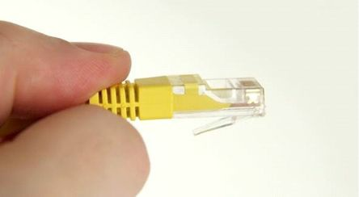
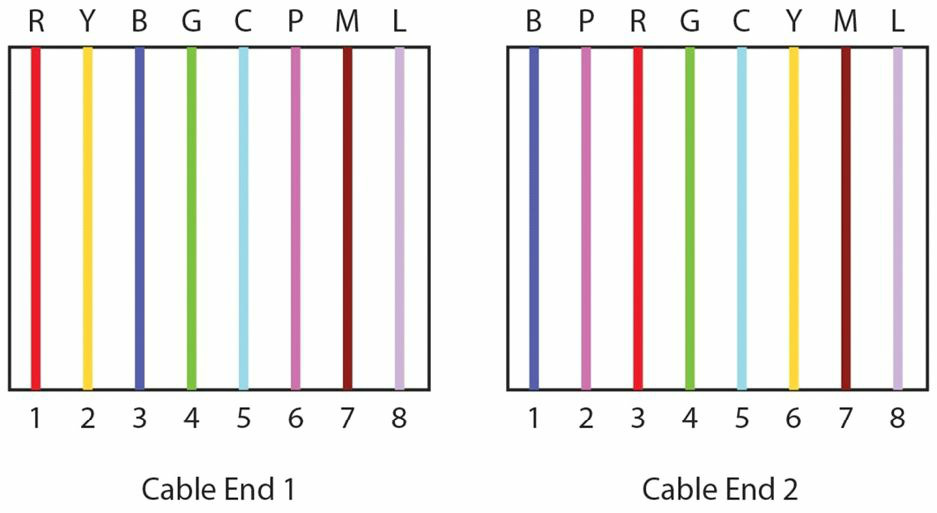
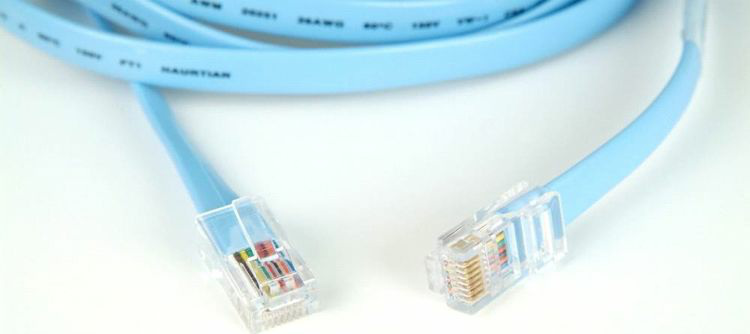
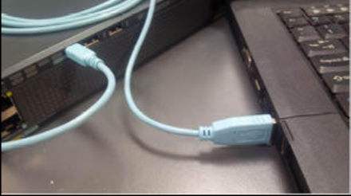
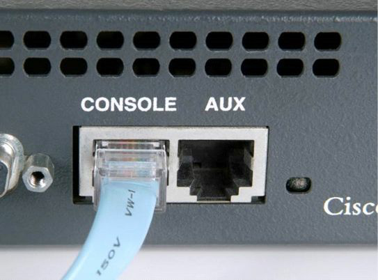

# 线缆和介质，Cables and Media

布线和线缆相关问题，将称为咱们作为网络工程师日常工作的一部分。咱们将需要清楚哪些电缆插入哪些设备、行业限制，以及如何将设备配置为使用正确的电缆类型。


## 局域网的线缆


### 以太网线

大多数线缆相关的网络故障，都将发生在局域网 (LAN) 侧，而不是广域网 (WAN) 侧，这是因为线缆和连接器的数量庞大，以及设备移动及测试时，较高频率的重新插入（拔出和插入）线缆。

以太网线用于连接工作站到交换机、交换机到交换机，以及交换机到路由器。以太网线的规格和速率在近年间已被多次修订和提升，这意味着咱们有望很快看到如今的标准速率，会被桌面可达的新的、提速后的高速链路超越。目前的标准以太网线，仍使用八根线对绞成对，以防止电磁干扰（EMI）和串扰，串扰是指一根线的信号溢出到邻近的电缆中。

由 ANSI/TIA/EIA-568-A 定义的电缆类别，包括了 3 类、5 类、5e 类和 6 类。每个类别都给到了一些标准、规格以及可达成的数据吞吐率，当咱们遵守距离限制，即可达到此速率。3 类的布线可承载最高 10Mbps 的数据。5 类布线主要用于更快速的以太网网络，比如 100BASE-TX 及 1000BASE-T。5e 类的布线使用了用于运行千兆以太网（1000Base-T）的 100-MHz 增强的线对。最后，在 6 类布线下，每对线缆运行着用于提升 1000Base-T 性能的 250 MHz。(“1000” 是指 Mbps 的数据速率，“Base” 代表基带，“T” 代表双绞线。）下表 1.6 展示了一些咱们应熟悉的常见以太网标准。


**表 1.6** -- **常见以太网标准**

| 速率 | 名字 | IEEE 的名字 | IEEE 标准 | 线缆/长度 |
| :-: | :-: | :-: | :-: | :-: |
| 10Mbps | 以太网 | 10BASE-T | 802.3 | 铜线/100 米 |
| 100Mbps | 快速以太网 | 100BASE-T | 802.3u | 铜线/100 米 |
| 1000Mbps | 千兆以太网 | 1000BASE-LX | 802.3z | 光纤/5000 米 |
| 1000Mbps | 千兆以太网 | 1000BASE-T | 802.3ab | 铜线/100 米 |
| 10Gbps | 万兆以太网 | 10GBASE-T | 802.3an | 铜线/100 米 |

思科会时不时把电缆规格的问题，插入到考试中，因此请务必记住上表。

## 双工

在以太网的组网刚开始使用时，数据在同一时间只在线路上单向传输。这是因为那时用到的电缆限制。发送设备在线路上发送数据前，必须等待线路畅通，并无线路上没有冲突的保证。现在这不再是个问题，因为对发送和接收信号所使用的是不同线组。

所谓半双工，是指在某个时刻，数据只能在一个方向上传递，而全双工是指在同一时间，数据可同时在线路上双向传输（见图 1.38）。这是经由使用以太网线内使的空线路实现的。除非另有配置，否则所有设备现在都以全双工方式运行。


**图 1.38** -- **双工的拓扑**

在考试中，咱们将仍需要掌握与排除一些双工故障；在本手册稍后，我们将介绍一些一层及二层的故障。咱们可以 `show interface X` 命令，轻松检查某个接口的双工设置。


```console
Switch#show interface FastEthernet0/1
FastEthernet0/1 is down, line protocol is down (disabled)
    Hardware is Lance, address is 0030.a388.8401 (bia 0030.a388.8401)
BW 100000 Kbit, DLY 1000 usec,
        reliability 255/255, txload 1/255, rxload 1/255
    Encapsulation ARPA, Loopback not set
    Keepalive set (10 sec)
    Half-duplex, 100Mb/s
```

当这个接口连接的是某个全双工设备时，咱们就会立即看到接口错误，并且会经历链路上的慢速流量。咱们也可在真实交换机上执行 `show interfaces status` 命令，但由于路由器模拟器的命令有限，在考试中这条可能不会生效（Packet Tracer 也是如此）。咱们可以看到接口 `FastEthernet 1/0/2` 的一些可能问题。

```console
Switch#show interfaces status
Port    Name    Status      Vlan    Duplex  Speed   Type
Fa1/0/1         notconnect  1       auto    auto    10/100BaseTX
Fa1/0/2         notconnect  1       half    10      10/100BaseTX
Fa1/0/3         notconnect  1       auto    auto    10/100BaseTX
Fa1/0/4         notconnect  1       auto    auto    10/100BaseTX
Fa1/0/5         notconnect  1       auto    auto    10/100BaseTX
```

当然，咱们可轻松修复这个问题，如下所示：


```console
Switch(config)#int f1/0/2
Switch(config-if)#duplex ?
    auto Enable AUTO duplex configuration
    full Force full duplex operation
    half Force half-duplex operation
Switch(config-if)#duplex full
```

请在真实 Cisco 设备、GNS3 或至少 Packet Tracer 上，尝试此命令及所有其他命令，以便记住他们！接下来我们将介绍速率设置。

### 速率


咱们可将咱们路由器或交换机上以太网端口的速率，保留作自动协商，或咱们可将其硬性设置为 `10Mbps`、`100Mbps` 或 `1000Mbps`。


要手动设置速率，咱们就要将路由器配置如下：


```console
Router#config t
Router(config)#interface GigabitEthernet 0/0
Router(config-if)#speed ?
    10      Force 10 Mbps operation
    100     Force 100 Mbps operation
    1000    Force 1000 Mbps operation
    auto    Enable AUTO speed configuration
```

下面的命令允许咱们查看路由器的以太网接口设置：

```console
Router#show interface FastEthernet0
FastEthernet0 is up, line protocol is up
    Hardware is DEC21140AD, address is 00e0.1e3e.c179 (bia 00e0.1e3e.c179)
    Internet address is 1.17.30.4/16
    MTU 1500 bytes, BW 10000 Kbit, DLY 1000 usec, rely 255/255, load 1/255
    Encapsulation ARPA, Loopback not set, keepalive set (10 sec)
    Half-duplex, 10Mb/s, 100BaseTX/FX
```

EIA/TIA 的以太网线规范规定，网线末端应表现为 RJ45 公头（见图 1.39；图 1.40 显示的是母头），这将允许咱们，将网线插入咱们路由器/交换机/PC 的以太网端口。




**图 1.23** -- **RJ45 公头**


**图 1.40** -- **RJ45 母头**


### 直通线

每条以太网线都包含八根导线，每根导线都会连接到水晶头的一个针脚。这些导线与针脚连接时的位置，决定了网线可被用于何种目的。当一端的每个针脚，与另一侧匹配时，则称为直通网线。这些网线可用于将某个终端设备，连接到交换机上的某个以太网端口，以及将交换机连接到路由器。如下图 1.41 和 1.42 所示，通过比较电缆的一侧和另一侧，咱们即可轻松检查那些导线是否匹配。


**图 1.41** -- **对比网线两端**


**图 1.42** -- **网线两端匹配**

### 交叉线

通过交换网线中的两根线，现在其便可用于连接 PC 和 PC（无需使用交换机或集线器，不过在较新网络接口上的 Auto-MDIX 端口，会检测连接是否需要交叉线，并自动选择 MDI 或 MDIX 配置，以正确匹配链路另一端），或连接交换机与交换机。一头的引脚 1 上的导线，需要连接到另一头的引脚 3，同时引脚 2 需要连接到另一头的引脚 6（见图 1.43）。我（作者）为网线设计了自己的配色方案，纯粹是为了说明我的观点 -- 红、黄、蓝、绿、青、粉红、洋红和淡紫。




**图 1.43** -- **引脚 1 接 引脚 3，同时引脚 2 接引脚 6**

### 翻转/控制台线

所有 Cisco 路由器和交换机，都有用于初始设置及灾难恢复或访问的一些物理端口。这些端口被称为控制台端口，作为 Cisco 工程师，咱们将经常用到这些端口。为了连接到这种端口，咱们需要使用一种叫做翻转或控制台线的特殊线（见图 1.44）。他有时也被称为扁平线，因为与大多数圆形的以太网线不同，其主体通常是扁平的。


翻转线交换了所有引脚（见图 1.45），因此一头的引脚 1 ，会连接到另一头的引脚 8，引脚 2 连接到引脚 7，依此类推。




**图 1.44** -- **典型的翻转线**


**图 1.45** -- **全部引脚互换**


翻转线通常在一端有个 RJ45 接头，在另一端则有个 9 针的 D 型接头，设计以连接 PC 或笔记本电脑的 COM 端口。问题是，这些设备不再带有这些端口，因为他们已很少用到。现在，咱们可在许多电子元件商店，或网上买到 DB9 转 USB 的转换器线（见图 1.46）。他们附带了的允许咱们经由 [PuTTY](https://www.chiark.greenend.org.uk/~sgtatham/putty/latest.html) 或 HyperTerminal 等终端程序，连接到咱们 PC 上的某个逻辑 COM 端口的软件驱动程序。

思科已开始将 mini-USB 端口（除 RJ45 端口外）置于其设备，以实现使用 USB Type-A 到 5 针 mini-Type B 型线的控制台端口连通性。当同时插入这两中控制台线时，那么 mini-USB 线会优先并处于活动状态。下图 1.47 和 1.48 显示了这两种不同的连接类型。


**图 1.46** -— **COM 到 USB 的转换器线**



**图 1.47** -- **连接到 USB 的控制台端口**（图片 © 51sec.org）



**图 1.48** -- **连接路由器的 RJ45 控制台端口**


## 广域网线缆

具体取决于路由器上的接口和连接类型，用于广域网连接的串行线缆，有多种形状、尺寸及规格。例如，ISDN 就使用了与帧中继或 ADSL 不同的线缆。

咱们将使用的一种常见广域网线缆类型为 DB60，尤其是当咱们有个实作的家庭网络时。对于这种类型的电缆，咱们将有个会插入客户设备的数据终端设备 (DTE) 端，以及一个决定来自 ISP 连接速率的数据通信设备 (DCE) 端。下图 1.50 显示了某个 WIC-1T 卡上的 DB60 串行接口。


**图 1.49** -- **DB60 线缆**


**图 1.50** -- **某个 WIC-1T 卡上的 DB60 串行接口**

Cisco 广域网接口卡（WIC）的一种常见的表示类型，称为智能串行线。


**图 1.51** -— **智能串行线**

当然，当咱们使用这种线缆类型时，咱们将需要路由器上的正确的接口卡，如下图 1.52 所示。


**图 1.52** -- **WIC-2T 的智能串行卡**

这种智能串行 WIC 卡，给到我们路由器上一个插槽的两个连接，而在标准 WIC-1T 卡下，咱们只能得到一个连接。每个串行连接都可使用某种不同封装类型，比如一个使用 PPP，而另一个则使用帧中继。

关于 DCE 和 DTE 线缆，要记住的最重要一点是，咱们需要将某个时钟速率，应到到 DCE 端以让该线路启动。通常，咱们的 ISP 会完成这一操作，因为他们拥有 DCE 端，但在家庭实验或真实机架上，咱们拥有 DCE 端，这会让咱们是某台路由器上的客户，同时又是另一路由器上的 ISP。咱们要输入的命令，为 `clock rate 64000`（或从咱们在可用选项中选择的任何速率，单位为比特每秒）。咱们可以键入 `clock rate ?`，查看咱们的选项。

在路由器上输入以下命令前，请确保咱们已掌握这些命令。首先，要确定哪个路由器连接了 DCE 电缆，咱们需要键入 `show controllers` 命令，随后键入接口编号。在实际考试（和现实世界）中，这是个要知道的用于排除故障的非常有用命令。使用 `show ip interface brief` 命令，咱们便可看到咱们路由器上有哪些接口。

实际上，咱们可缩短大多数的 Cisco IOS 命令，这在下面的输出中有演示。不过，由于考试使用了路由器模拟器（即非真实路由器），缩短后的版本在考试中，可能不会生效。


```console
Router#sh ip int brie
Interface       IP-Address  OK? Method  Status                  Protocol
FastEthernet0/0 unassigned  YES unset   administratively down   down
FastEthernet0/1 unassigned  YES unset   administratively down   down
Serial0/1/0     unassigned  YES unset   administratively down   down
Vlan1           unassigned  YES unset   administratively down   down
Router#show controllers s0/1/0
Interface Serial0/1/0
Hardware is PowerQUICC MPC860
DCE V.35, no clock
Router(config-if)#clock rate ?
Speed (bits per second)
    1200
    2400
    4800
    9600
    19200
    38400
    56000
    64000


[Truncated Output]
```


