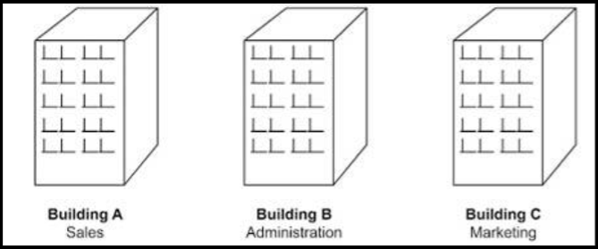
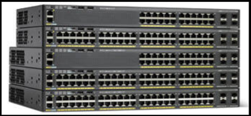
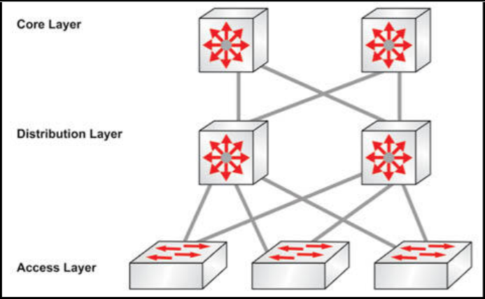
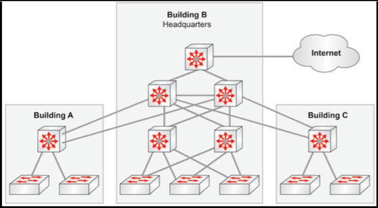
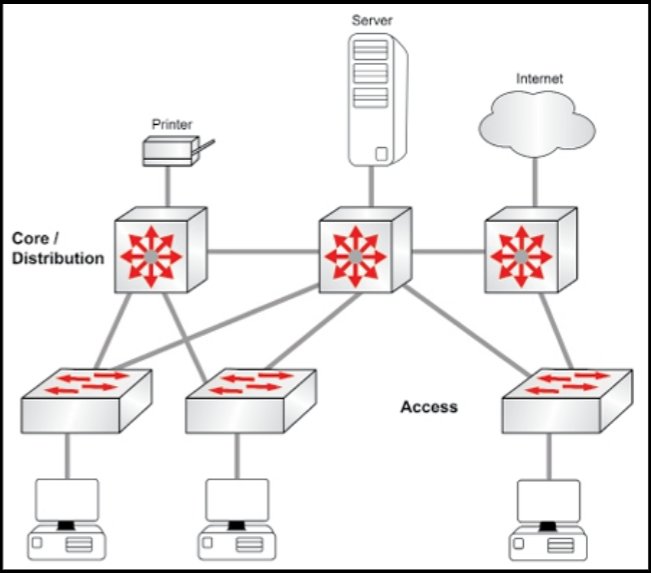
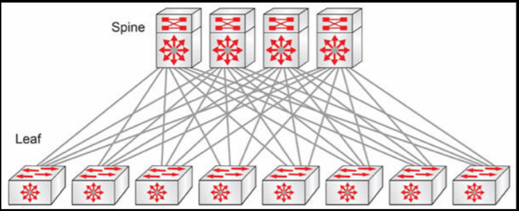

# 园区网络的拓扑结构

思科一直在 CCNA 考试大纲中暗示他的三层设计模型。现在，这已被正式加入，因此咱们将需要深入理解。不过，在此之前，咱们需要掌握园区局域网这一概念。

园区局域网一词，可以指一栋或多栋大楼中，为彼此相邻、通常在视线范围内的企业、大学或政府部门服务的设备。例如，当某家企业已将其办公空间，从一栋楼扩展到同一地理位置的三栋楼时，那么他们也将扩展其局域网，确保全部三栋楼间的高速连通性。通常情况下，高速的以太网中继线路，将连接起每栋楼，这样 A 楼栋的某名用户，就可与 C 楼栋的某名用户，以接近与他们在同一栋楼时同一网络性能水平通信。

**图 1.23** -- **多楼栋的园区局域网**

思科已发布了园区局域网的设计建议。毕竟，当咱们打算构建一个可随业务增长而扩展的网络时，咱们就需要仔细考虑公司的短期与长期目标。理解这些目标，将有助于咱们在构建园区局域网时，选择恰当的网络拓扑结构。

在一个完美世界里，咱们会从头开始设计园区局域网，但由于我们并未生活在完美世界，因此咱们很可能将不得不从已存在的网络开始设计，创建网络在今后看起来是什么样的图景，便是咱们的工作。这项工作要困难得多，但若咱们理解了园区网络高质量设计的一些关键概念和术语，其就将轻松得多。

## 园区局域网的分层

思科使用三个不同的层，描述园区网络设计中每种交换机的角色：接入层、分配层，与核心层。对于设计可扩展的解决方案，咱们掌握各个分层就至关重要。

接入交换机提供了网络上节点的连通性。这是那些通常不需要大量带宽，通常一次只接待一个用户系统的 “匝道”。这类节点的几个例子包括工作站、移动设备、打印机及 IP 电话等。接入层交换机的主要用途，是提供网络连通性。由于这个原因，咱们将看到更多对端口密度（即提供大量可插入的端口）的强调，而不太注重操作数据帧。下图 1.24 展示了 2960.X 系列中的接入层交换机型号。

**图 1.24** -- **2960.X 系列的思科交换机（图像 © Cisco 系统公司）**

分布层交换机扮演了接入层交换机与核心层交换机之间的智能中介。许多服务质量（QoS）参数与过滤（如 ACL、前缀列表），都编程在分布层交换机上，因为他们通常具备这些特性及硬件，以及处在适当的网络位置，适合处理或过滤语音、视频与数据流量。通常情况下，他们提供了每个接入交换机，连接到两个不同分布层交换机的冗余连通性（见下图 1.25）。以这种方式，当某个分布层交换机失效时，终端用户就不会受影响。

下图 1.25 展示了思科设计模型的三个分层。请注意，三层交换机是在分布层和核心层。

**图 1.25** -- **园区局域网的三个分层**

核心层交换机的主要目标是尽可能快地转发流量。由于全部分布层交换机都连接到核心层，因此核心层交换机在完成这一目标的同时，还要承担最重的流量负荷。毋庸置疑，核心必须要有已被调整到将大量流量转发到网络中的任何区域，通常是每个区域（如互联网、DMZ、服务器机房、工作组等）的冗余高速基础设施。

在核心处任何需要额外处理器速度或内存的编程工作都应避免。除非别无选择，咱们都将不会打算添加 ACL、QoS 或任何其他会延迟流量转发的编程。

到目前为止，咱们已经学习了：

- 发送流量到终端，并接收终端流量的接入交换机；
- 分配交换机是网络的智能设备，提供冗余、QoS 和过滤功能；
- 核心交换机汇聚所有流量，提供高带宽和高速度，以尽可能快地转发流量。

让我们学以致用，开发一个高级别的园区局域网。如咱们将在下图 1.26 中所见到的，园区内有三栋建筑，主数据中心位于总部（B 栋）。

**图 1.26** -- **高级别的三层园区局域网设计**

在总部处，核心层中有三台高端交换机（顶部的三台），而在同一栋楼里有服务于三台接入层交换机的两台分布层交换机。该公司已扩展到附近的两栋大楼，由于他们已建立适当的核心层，因此能轻松地扩展网络。他们在 B 号楼和 C 号楼，安装了一些有着楼栋间高速以太网冗余连接的分布层交换机。所有处所的终端用户，都由接入层交换机提供服务，但咱们将注意到，由于 B 号楼和 C 号楼都只有一台分布层交换机，那么这两栋楼里的接入层交换机，就没有冗余连接。

在这种设计下，网络的核心层属于全网状拓扑结构，但并不总是这样，因为有的时候部分网状拓扑结构会被部署。此外，处处都有冗余连接，但这也并不总是可行的，这取决于楼宇之间是否有布线或预算。换句话说，楼宇间的连通性，可能因预算和环境而异。

假如在预算允许下，一种典型的安装，将是在核心层和两个楼栋的分布层交换机之间，进行光纤布线。根据楼宇之间的距离，别的选项可以是铜缆或无线连接。例如，两座相距一英里的两栋办公楼，就可以通过无线网桥通信。无论如何，当咱们在建立楼宇间的连接时，相比在楼宇内建立连接，费用都要高一些。

思科设计师通常会根据咱们的具体需求和预算，提供专业的设计建议。

## 两层的园区 -- 坍缩核心层

并非每种园区设计，都要求分三层的方法。例如，当咱们有个有着只需要电子邮件、打印、偶尔文件共享和互联网等网络访问的 200 PC 园区时，那么就真的没有部署三层模式的需要，因为咱们的分布层交换机，就可以轻松处理这些穿越网络的流量。

正如咱们在下图 1.27 中所看到的，这种两层的设计允许终端用户连接到网络，然后使用合理数量的电缆，实现所有接入层交换机到两个分布层交换机的冗余连接。在这种类型的设计中，中心化的服务器和打印机，也可连接到分布层交换机。此外，面向互联网的边缘路由和安全基础设施，也将连接到这些分布层交换机。

这种设计也被称为折叠后核心，其中分布层同时提供了分布与核心的功能（如思科设计模型中所列）。

**图 1.27** -- **两层的设计**

## 主干-叶子的网络拓扑结构

**Spine-Leaf Network Topology**

思科在最新考试大纲中，已为我们引入了一种新的拓扑类型。所谓主干-叶子架构，是一种常用的，越来越多地从三层变为两层的数据中心网络拓扑结构。其有两个交换层 -- 骨干层和叶子层。叶子层由一些接入交换机组成，他们汇聚来自那些直接连接到骨干（网络核心）的服务器流量。骨干交换机以全网状拓扑，与全部叶子交换机互联。

使用这种架构，消除了对生成树实例的需要（稍后我们将对此讨论），从而使所有网络路径都使用，但如下图 1.28 所示，其确实需要更多的电缆连接。

**图 1.28** -- **骨干-叶子的网络拓扑结构**
