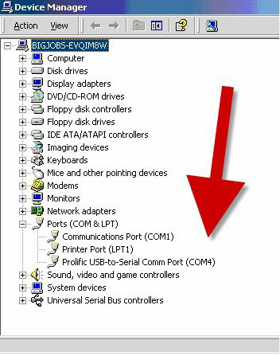
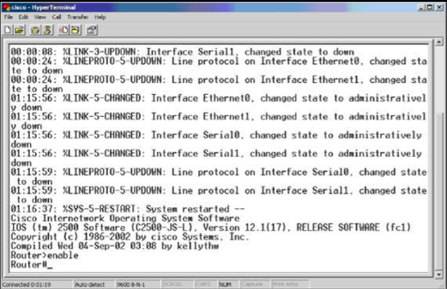

# 连接到路由器

当咱们第一次连接某个路由器或交换机时，可能有点望而生畏。上面我们曾介绍过控制台连接，因此一旦咱们连接线缆后，咱们将需要使用咱们台式电脑或笔记本电脑上的某种终端仿真程序。这种程序允许咱们看到路由器输出，并键入配置命令。

多年来，HyperTerminal 都曾是默认选项，当咱们需要执行灾难恢复时，咱们可能仍需要这个程序；不过，现在咱们可以坚持使用 PuTTY，其被使用非常广泛。咱们可从 [chiark.greenend.org.uk/~sgtatham/putty/latest.html](https://www.chiark.greenend.org.uk/~sgtatham/putty/latest.html) 下载 PuTTY。使用 PC 上 COM 端口的老式连接，几乎总是会用到其上标有 COM1 或 COM2 的某个逻辑端口。咱们可在 PuTTY 中，看到使用这种连接的设施，PuTTY 实际上将其称之为串行连接，如下图 1.53 所示：


**图 1.53** -- **PuTTY 将 COM 端口用于串行访问**

当咱们使用 USB 转翻转线缆时，则将已收到一个驱动程序 CD，其在运行时，将给到咱们一个要用到的 COM 端口编号。当咱们使用 Windows 系统时，则可在设备管理器中，找到这个端口编号，如下图 1.54 所示。




**图 1.54** -- **驱动程序已将 COM4 分配给控制台连接**

当咱们使用超级终端时，咱们将还需选择更多连接参数，比如波特率等。咱们应选择以下参数，如图 1.55 所示：

- 每秒比特数：9600
- 数据位：默认为 8
- 奇偶校验：默认为 None（无）
- 停止位：默认值为 1
- 流量控制：必须为 None（无）


**图 1.55** -- **设置咱们的超级终端设置项**

在咱们打开路由器时，若咱们已选择正确的 COM 端口，**并** 将翻转线插入了控制台端口（而不是意外插入某个另外端口），咱们就应看到路由器启动文本（见图 1.56）。若咱们无法看到任何文字，就要多按几次 Enter 键，然后仔细检查咱们的设置。



**图 1.56** -- **路由器的启动文本**

路由器可能会询问咱们是否打算进入初始配置模式。当路由器在 NVRAM（稍后会介绍）中找不到启动配置文件，或者配置寄存器被设置为忽略启动配置文件（通常为 `0x2142`）时，这种情况就会发生。一定要键入 "n" 或 "no"，否则咱们将进入设置模式，这是咱们不想要做的：


```
Would you like to enter the initial configuration dialog?
[yes/no]:
% Please answer ‘yes’ or ‘no’.
Would you like to enter the initial configuration dialog?
[yes/no]: no
Press RETURN to get started!
Router>
```

在某种不同路由器型号下，咱们将看到以下输出：


```
Technical Support: www.cisco.com/techsupport
Copyright (c) 1986-2007 by Cisco Systems, Inc.
Compiled Wed 18-Jul-07 04:52 by pt_team
        --- System Configuration Dialog ---
Continue with configuration dialog? [yes/no]: no
Press RETURN to get started!
Router>
```

> *知识点*：
>
> - Initial Configuration mode
>
> - the configuration register

## 路由器模式


为通过 CCNA 考试，咱们将需要掌握应从何种路由器提示符，开始执行各种操作。无论咱们希望执行什么功能，咱们都将必须处在正确模式下（以不同的路由器提示符区分）。当新手学员在配置路由器时遇到问题，找不到要使用的正确命令时，这便是他们犯的最大错误。请确保咱们是在正确的模式下。


### 用户模式

路由器引导后，呈现给咱们的第一个模式，称为用户模式或用户执行模式。用户模式只有一套极为有限的可用命令集，但对于查看一些路由器基本要素非常有用。路由器的默认名字为 "Router"，但正如咱们稍后看到的，这可被修改。

```console
Router>
```

### 高级模式

在用户模式的提示符下键入 `enable` 就会将咱们领入叫做特权模式，或特权执行模式的下一模式。要返回到用户模式，咱们只需键入 `disable`。要完全退出会话，就要键入 `logout` 或 `exit`。


```console
Router>enable
Router#
Router#disable
Router>
```

对于查看路由器的整个配置、有关路由器运行情况的统计信息，甚至咱们已将哪些模组连接到了该路由器，特权模式都非常有用。在这个提示符下，咱们将键入那些 `show` 命令，并以 `debug` 命令排除故障。


### 全局配置模式

为了配置路由器，咱们就必须是在全局配置模式下。要进入全局配置模式，咱们只需在特权执行提示符下，键入 `configure terminal` 或 `config t`。或者，只需键入 `config`，路由器将询问咱们想要进入哪种模式。默认选项为 `terminal`（默认选项将显示在方括号 `[]` 内）。当咱们按下 Enter 键时，括号内的命令将被接受。


<code>
Router#config
Configuring from terminal, memory, or network[terminal]? ← <b>press Enter</b>
Enter configuration commands, one per line. End with CNTL/Z.
Router(config)#
</code>
### 接口配置模式

接口配置模式允许咱们输入针对单个路由器接口的命令，如 FastEthernet、串行接口等。在某个新的路由器上，在不存在任何配置下，所有接口默认都将是关闭的。

```console
Router>enable
Router#config t
Enter configuration commands, one per line. End with CNTL/Z.
Router(config)#interface Serial0
Router(config-if)#
```

> 注： `show ip interface brief` 命令可以查看到路由器有哪些接口。咱们的串行接口可能不是 `Serial0`。

初次阅读这些内容没有问题，但当咱们在阅读的同时，在真正路由器上尝试使用所有命令时，这将更有意义。记住要执行 `show ip interface brief` 命令，查看咱们有哪些可用接口。


### 线路配置模式

线路配置模式用于更改控制台、Telnet 或辅助端口（当咱们的路由器有这些时）。咱们可控制谁可以经由这些端口访问路由器，也可以在这些端口上，设置密码或一种称为 “访问控制列表” 的安全功能。


```console
Router#config t
Enter configuration commands, one per line. End with CNTL/Z.
Router(config)#line console 0
Router(config-line)#
```

咱们还可在线路配置模式下，配置波特率、执行级别等等。


### 路由器配置模式

为了给路由器配置某种路由协议，以便其能够动态地构建起网络的图像，咱们将需要处在路由器配置模式下。


```console
Router#config t
Enter configuration commands, one per line. End with CNTL/Z.
Router(config)#router rip
Router(config-router)#
```

### VLAN 配置模式

这种模式实际上只适用于交换机，但由于咱们是在讨论模式，其还是值得一提。在咱们配置本书中的交换实验时，咱们将在该模式下花大量时间。


```console
Switch#conf t
Enter configuration commands, one per line.
Switch(config)#vlan 10
Switch(config-vlan)#
```

配备了以太网交换机卡的路由器，会用到 VLAN 数据库配置模式（在交换机上这种模式已被弃用），其与 VLAN 配置模式类似：


```console
Router#vlan database
Router(vlan)#vlan 10
VLAN 10 added:
    Name: VLAN0010
Router(vlan)#exit
APPLY completed.
Exiting....
Router#
```

> *知识点*：
>
> - User mode, or User Exec mode
>
> - Privileged mode, or Privileged Exec mode
>
> - Global Configuration mode
>
> - Interface Configuration mode
>
> - Line Configuration mode
>
> - Router Configuration mode
>
> - VLAN Configuration mode
>
> - VLAN Database Configuration mode


## 配置路由器

路由器中没有菜单可用，咱们无法使用鼠标在不同模式间导航。全都经由命令行界面（CLI）完成。不过，有种问号（`?`）形式的上下文相关帮助。当咱们在路由器提示符下键入 `?` 时，咱们将显示以一个所有可用命令的列表。

请注意，咱们将只会看到咱们模式下可用的那些命令。当咱们打算查看一些接口配置的命令时，咱们就必须在接口提示符下。


```console
Router#?
Exec commands:
access-enable           Create a temporary Access-List entry
access-profile          Apply user-profile to interface
access-template         Create a temporary Access-List entry
alps                    ALPS exec commands
archive                 manage archive files
bfe                     For manual emergency modes setting
cd                      Change current directory
clear                   Reset functions
clock                   Manage the system clock
cns                     CNS subsystem
configure               Enter configuration mode
connect                 Open a terminal connection
copy                    Copy from one file to another
debug                   Debugging functions (see also ‘undebug’)
delete                  Delete a file
dir                     List files on a directory
disable                 Turn off privileged commands
disconnect connection   Disconnect an existing network
enable                  Turn on privileged commands
erase                   Erase a file
exit                    Exit from the EXEC mode
help                    Description of the interactive help system


-- More –
```

当屏幕上显示信息过多时，咱们将看到那个 `-- More --` 的分页符。当咱们打算看到下一页时，就要按下空格键。若不想看下一页，那么就要同时按下 `Ctrl+Z` 键，或按下 "q" 返回路由器提示符。


此外，当咱们已开始键入某个命令，但忘记了还需要键入什么时，使用问号将给到咱们一个可用选项列表。`?` 在 CCNA 考试中将生效，但如果你在使用他，那就说明你没有完成我（作者）所有的实验！

```console
Router#cl?
clear clock
```

当咱们开始键入某条命令时，只要在该语法下仅有一个可能的单词或命令，那么咱们就可按下 Tab 键，为咱们补全这条命令。

<code>
Router#copy ru ← <b>press the Tab key here</b>
Router#copy running-config
</code>

路由器有数种可供选择的模式。这样做是为确保咱们不会更改路由器配置中，咱们不打算更改的部分。通过查看命令提示符，咱们便可识别咱们所处何种模式。例如，当咱们打算对其中一个快速以太网接口进行修改时，咱们就需要在接口配置模式下。

首先，进入全局配置模式：


```console
Router#config t
Router(config)#
```

接着，告诉路由器咱们打算配置哪个接口：


```console
Router(config)#interface FastEthernet0
Router(config-if)#exit
Router(config)#
```

当咱们不确定要以哪种方式输入接口编号，那么就要使用 `?`。不要担心将给到咱们的那些全部选项。大多数人只会用到 `FastEthernet`、`Serial` 及 `Loopback` 三种接口。


```console
Router(config)#interface ?
Async               Async interface
BRI                 ISDN Basic Rate Interface
BVI                 Bridge-Group Virtual Interface
CTunnel             CTunnel interface
Dialer              Dialer interface
FastEthernet        IEEE 802.3u
Group-Async         Async Group interface
Lex                 Lex interface
Loopback            Loopback interface
Multilink           Multilink-group interface
Null                Null interface
Serial              Serial interface
Tunnel              Tunnel interface
Vif                 PGM Multicast Host interface
Virtual-Template    Virtual Template interface
Virtual-TokenRing   Virtual TokenRing interface
range               interface range command


Router(config)#interface FastEthernet?
<0-0> FastEthernet interface number
Router(config)#interface FastEthernet0
```

最终，路由器会进入到接口配置模式。

```console
Router(config-if)#
```

在这里，咱们可为接口设置 IP 地址、设置带宽、应用某个访问控制列表，以及完成很多其他事情。请注意，咱们的路由器和交换机，可能有着不同于我（作者）的接口编号，所以要使用 `?` 或 `show ip interface brief` 命令，查看咱们的选项。


当咱们需要退出某种配置模式，只需键入 `exit`。这会将咱们带回到下一最高级级别。而要退出任何类别配置模式时，只需同时按下 `Ctrl+Z`（或键入 `end`）。


```console
Router(config-if)#exit
Router(config)#
```

或者使用 `Ctrl+Z` 这个选项：

```console
Router(config-if)#^z
Router#
```

### 环回接口

环回接口通常在 CCNA 考试大纲中不会涉及，但在现实世界与一些练习实验中，他们非常有用。所谓环回接口，是咱们配置的，而其物理上并不存在的某个虚拟或逻辑的接口（所以咱们永远不会在路由器面板上看到）。不过路由器将让咱们 ping 到这个接口，这样在实验中咱们就不必把设备连接到快速以太网接口上。


使用环回接口的一个好处是，只要路由器开机运行，他们便会保持在线。他们属于逻辑的，也就是他们永远不会宕机。不过，由于环回接口属于虚拟接口，因此咱们不能将网线插入这种接口。

<code>
Router#config t
Router#(config)#interface Loopback0
Router#(config-if)#ip address 192.168.20.1 255.255.255.0
Router#(config-if)#^z ← <b>press Ctrl+Z</b>
Router#
Router#show ip interface brief
Interface   IP-Address      OK?     Method  Status  Protocol
Loopback0   192.168.20.1    YES     manual  up      up
</code>

该命令的输出将显示咱们路由器上所有可用的接口。

> **实际应用**：
>
> 当咱们需要时，咱们可在接口配置模式下，使用 `shutdown` 命令关闭某个环回接口。


环回接口必须要给到某个有效 IP 地址。然后，咱们就可将他们用于路由协议，或测试咱们的路由器是否在放行某些流量。在整个课程中，咱们将经常用到这些接口。

### 编辑命令


在咱们已输入的配置行中浏览，而不是删除整行，是可行的。下表 1.7 所示的按键组合，将移动光标到行的不同位置。


| 按键输入 | 操作 |
| :-: | :-: |
| `Ctrl+A` | 移至命令行的开头 |
| `Ctrl+E` | 移至命令行的末尾 |
| `Ctrl+B` | 向后移动一个字符 |
| `Ctrl+F` | 向前移动一个字符 |
| `Esc+B` | 向后移动一个单词 |
| `Esc+F` | 向前移动一个单词 |
| `Ctrl+P` 或向上箭头 | 调出上一命令 |
| `Ctrl+N` 或向下箭头 | 调出下一命令 |
| `Ctrl+U` | 删除一行 |
| `Ctrl+W` | 删除一个单词 |
| `Tab` | 补全某个命令 |
| `show history` | 默认显示所输入的前 10 条命令 |
| 退格键，`Backspace` | 删除单个字符 |

考试中关于以上内容的题目相当常见。


### 配置路由器接口

为了给某个特定路由器接口设置地址，而进入接口配置模式配置一些特定参数，咱们就必须了解接口的表示法。接口表示法会根据路由器制造商而有所不同，但通常由两部分组成：

- 接口类型（`Ethernet`、`FastEthernet` 等）
- 接口插槽/模组与端口编号

例如，一些常见接口表示法包括下面这些：

- `Ethernet1/0`（插槽 1，端口 0）
- `FastEthernet0/3`（插槽 0，端口 3）
- `GigabitEthernet0/1/1`（模组 0，插槽 1，端口 1）

    **注意**：插槽 0 通常表示那些内置的端口。其他插槽则表示可随时添加的一些扩展插槽。插槽和端口的编号通常从 0 开始。

为了使路由器接口具有基本功能，咱们必须配置以下这些参数（除非他们有着由制造商设置的默认值）：

- 速率
- 双工
- IP 地址

咱们可在 Cisco 路由器上找到这些基本配置设置，因为他们通常会在现代企业网络中用到。要查看可用接口及其当前状态，咱们可执行以下命令：

```console
Router#show ip interface brief
Interface       IP-Address  OK? Method  Status                  Protocol
FastEthernet0/0 unassigned  YES unset   administratively down   down
FastEthernet0/1 unassigned  YES unset   administratively down   down
```

从上面的输出咱们可以看出，路由器在插槽 0 上有两个 `FastEthernet`（`100 Mbps`） 接口，这两个接口均未配置（即没有 IP 地址）且已被管理禁用（即状态为：`administratively down`）。

在开始配置接口参数前，咱们必须使用 Cisco 设备上的 `configure terminal` 命令，进入路由器配置模式，然后使用 `interface <interface name>` 命令进入接口配置模式。接口配置过程中的第一步，是启用该接口。例如，接口 `FastEthernet0/0` 便可使用 `no shutdown` 命令启用。

```console
Router#configure terminal
Enter configuration commands, one per line. End with CNTL/Z.
Router(config)#interface FastEthernet0/0
Router(config-if)#no shutdown
Router(config-if)#
*Mar 1 00:32:05.199: %LINK-3-UPDOWN: Interface FastEthernet0/0, changed state to up
*Mar 1 00:32:06.199: %LINEPROTO-5-UPDOWN: Line protocol on Interface FastEthernet0/0, changed state to up
FastEthernet0/0, changed state to up
```

下一个配置步骤涉及到设置好速度及双工的设置，我们已介绍过这些内容。


### 在接口上配置 IP 地址


为了让路由器与其他设备通信，他将需要有个已连接接口上的地址。在接口上配置 IP 地址非常简单，不过咱们务必要记得先要进入接口配置模式。

现在不用担心在哪里找到 IP 地址，因为我们稍后将讨论这个问题。

<code>
Router>enable   ← <b>takes you from User mode to Privileged mode</b>
Router#config t ← <b>from Privileged mode to Configuration mode</b>
Router(config)#interface Serial0    ← <b>and then into Interface Configuration mode</b>
Router(config-if)#ip address 192.168.1.1 255.255.255.0
Router(config-if)#no shutdown   ← <b>the interface is opened for traffic</b>
Router(config-if)#exit    ← <b>you could also hold down the Ctrl+Z keys together to exit</b>
Router(config)#exit
Router#
</code>


某种说明也可添加到接口，如以下输出所示：

<code>
RouterA(config)#interface Serial0
RouterA(config-if)#description To_Headquarters
RouterA(config-if)#^Z   ← <b>press Ctrl+Z to exit</b>
</code>

路由器接口配置完成后，咱们便可在 Cisco 路由器上，使用以下命令检查这个已完整配置后接口的那些参数，以验证设置。

```console
RouterA#show interface Serial0
Serial0 is up, line protocol is up
Hardware is HD64570
Description: To_Headquarters
Internet address is 12.0.0.2/24
MTU 1500 bytes, BW 1544 Kbit, DLY 20000 usec,
reliability 255/255, txload 1/255, rxload 1/255
Encapsulation HDLC, loopback not set
Keepalive set (10 sec)
Last input 00:00:02, output 00:00:03, output hang never
[Output Truncated]
```

### 显示命令


在特权模式下，使用 `show x` 命令，其中 `x` 为下一命令，咱们便可查看路由器中的大部分设置，如以下输出中所示：


```console
Router#show ?
access-expression   List access expression
access-lists        List access lists
accounting          Accounting data for active sessions
adjacency           Adjacent nodes
aliases             Display alias commands
alps                Alps information
apollo              Apollo network information
appletalk           AppleTalk information
arap                Show AppleTalk Remote Access statistics
arp                 ARP table
async               Information on terminal lines used as router interfaces
backup              Backup status
bridge              Bridge Forwarding/Filtering Database [verbose]
bsc                 BSC interface information
bstun               BSTUN interface information
buffers             Buffer pool statistics
cca                 CCA information
cdapi               CDAPI informationcdp CDP information
cef                 Cisco Express Forwarding
class-map           Show QoS Class Map
clns                CLNS network information

--More--
```

一些较常见的 `show` 命令及其含义，以及示例，在表 1.8 中列出。

**表 1.8** -- **常用 `show` 命令及其含义**

| 命令 | 含义 |
| :-: | :-: |
| `show running-configuration` | 显示 DRAM 中的配置 |
| `show startup-configuration` | 显示 NVRAM 中的配置 |
| `show flash:` | 显示哪个 IOS 在闪存中 |
| `show ip interface brief` | 显示所有接口的简要信息 |
| `show interface Serial0` | 显示串行接口的统计信息 |
| `show history` | 显示输入的前 10 条命令 |


```console
Router#show ip interface brief
Interface   Address     OK? Method  Status                  Protocol
Ethernet0   10.0.0.1    YES manual  up                      up
Ethernet1   unassigned  YES unset   administratively down   down
Loopback0   172.16.1.1  YES manual  up                      up
Serial0     192.168.1.1 YES manual  down                    down
Serial1     unassigned  YES unset   administratively down   down
```

其中 `method` 标签表示地址的分配方式。其可以是 `unset`、`manual`、`NVRAM`、`IPCP` 或 `DHCP`。


路由器可记住早先在路由器提示符下输入的命令（默认为 10 条命令），使用向上箭头便可调出这些命令。运用这一特性可节省大量时间和精力，因为其可避免咱们必须重新输入长行。`show history` 命令会显示处最近 10 条命令的缓冲区。

```console
Router#show history
show ip interface brief
show history
show version
show flash:
conf t
show access-lists
show process cpu
show buffers
show logging
show memory
```

咱们可使用 `terminal history size` 命令，增大历史记录缓冲区。

```console
Router#terminal history ?
size Set history buffer size
<cr>
Router#terminal history size ?
<0-256> Size of history buffer
Router#terminal history size 20
```

### 验证基本的路由器配置与网络连通性


有助于验证基本路由器配置的一些最有用命令，在接下来的小节中解释。


- `show version`

    `show version` 命令提供了可以作为验证大部分路由器操作起点的有用信息。这些信息包括以下内容：

    - 路由器类型（另一个列出路由器硬件的有用命令是 `show inventory`）
    - IOS 版本
    - 内存容量
    - 内存使用情况
    - CPU 类型
    - 闪存容量
    - 其他硬件参数
    - 上次重新加载的原因

    以下是 `show version` 命令的简短输出。请自行尝试。

    ```console
    Router#show version
    Cisco 1841 (revision 5.0) with 114688K/16384K bytes of memory.
    Processor board ID FTX0947Z18E
    M860 processor: part number 0, mask 49
    2 FastEthernet/IEEE 802.3 interface(s)
    2 Low-speed Serial(sync/async) network interface(s)
    191K bytes of NVRAM.
    63488K bytes of ATA CompactFlash (Read/Write)

    Configuration register is 0x2102
    ```

- `show running-config`

    `show running-config` 命令会提供路由器上的完整配置，同时其可被用于验证设备是否配置了那些正确功能特性。该命令的输出内容太过宽泛，因此其未在此给出。


- `show ip interface brief`

    正如上一小节中曾提到的，`show ip interface brief` 命令会列出路由器接口及其状态，包括：

    - 接口名称与编号
    - IP 地址
    - 链路状态
    - 协议状态

    ```console
    Router#show ip interface brief
    Interface       IP-Address  OK? Method  Status              Protocol
    FastEthernet0/0 unassigned  YES unset   administratively down   down
    FastEthernet0/1 unassigned  YES unset   administratively down   down
    Serial0/0/0     unassigned  YES unset   administratively down   down
    Serial0/1/0     unassigned  YES unset   administratively down   down
    Vlan1           unassigned  YES unset   administratively down   down
    Router#
    ```

- `show ip route`

    `show ip route` 命令会提供有关该设备路由能力的一些深度信息。他会列出路由器可到达的所有网络，以及有关这些网络可到达方式的信息，包括：

    - 网络
    - 路由协议
    - 下一跳
    - 传出接口

    ```console
    R1#show ip route
    Codes:  C - connected, S - static, R - RIP, M - mobile, B - BGP
            D - EIGRP, EX - EIGRP external, O - OSPF, IA - OSPF inter
            area, N1 - OSPF NSSA external type 1, N2 - OSPF NSSA external
            type 2, E1 - OSPF external type 1, E2 - OSPF external type 2,
            i - IS-IS, L1 - IS-IS level-1, L2 - IS-IS level-2, ia - IS-IS
            inter area, * - candidate default, U - per-user static route,
            o – ODR, P - periodic downloaded static route
    Gateway of last resort is not set
    R       80.1.1.0/24 [120/1] via 10.1.1.2, 00:00:04, Ethernet0/0.1
    D       80.0.0.0/8 [90/281600] via 10.1.1.2, 00:02:02, Ethernet0/0.1
    O E2    80.1.0.0/16 [110/20] via 10.1.1.2, 00:00:14, Ethernet0/0.1
    ```

除了上面介绍的这些 `show` 命令外，验证路由器连通性的其他有用方法，包括使用 `ping` 与 `traceroute` 命令。

- `ping`

    `ping` 命令提供了到某个特定目的地址的一种基本连通性测试。以这种方式，咱们可测试路由器是否能到达某个网络。Ping 的工作原理（使用 ICMP 时），是将一些 echo 请求发送到某台机器，以验证其是否开机和运行。当特定机器正在运行时，他将往回发送 ICMP 的 echo 回复消息到源地址，确认其可用性。一个 ping 示例在下面给出。

    ```console
    Router#ping 10.10.10.2
    Type escape sequence to abort.
    Sending 5, 100-byte ICMP Echos to 10.10.10.2, timeout is 2 seconds:
    .!!!!
    Success rate is 80 percent (4/5), round-trip min/avg/max = 20/40/76 ms
    ```

    标准 `ping` 命令会发送五个 ICMP 数据包到目的地址。在查看 ping 的输出时，圆点（`.`）表示一次失败，叹号（`!`）表示一次成功接收的数据包。ping 命令的输出还显示了到目的网络的往返时间（最小值、平均值及最大值）。

    当咱们需要操作 ping 相关的那些参数时，咱们可在 Cisco 路由器下执行扩展的 ping。这是通过在终端下，键入 `ping` 并按下回车完成的。路由器将以一个交互式菜单提示咱们，其中咱们可指定所需的参数，包括：

    - ICMP 数据包数量
    - 数据包大小
    - 超时
    - 源接口
    -服务类型

    早先我们已介绍了扩展的 ping 输出，本指南中还将执行多次扩展的 ping。

    ```console
    Router#ping
    Protocol [ip]:
    Target IP address: 10.10.10.2
    Repeat count [5]:
    Datagram size [100]:
    Timeout in seconds [2]:
    Extended commands [n]: y
    Source address or interface: FastEthernet0/0
    Type of service [0]:
    Set DF bit in IP header? [no]:
    Validate reply data? [no]:
    Data pattern [0xABCD]:
    Loose, Strict, Record, Timestamp, Verbose[none]:
    Sweep range of sizes [n]:
    Type escape sequence to abort.
    Sending 5, 100-byte ICMP Echos to 10.10.10.2, timeout is 2 seconds:
    Packet sent with a source address of 10.10.10.1
    !!!!!
    Success rate is 100 percent (5/5), round-trip min/avg/max = 20/36/72 ms
    ```


- `traceroute`

    `traceroute` 命令是另一个允许咱们查看数据包到达目的地址前，所经过跳数的有用工具。以下输出显示，数据包在到达其目的地前，只经过了一跳：


    ```console
    R2#traceroute 192.168.1.1
    Type escape sequence to abort.
    Tracing the route to 192.168.1.1
        1 10.10.10.1 60 msec *  64 msec
    ```

    与 ping 一样，Cisco 路由器允许咱们执行可定义数个相关参数，其中大部分与 ping 相关参数类似的扩展 `traceroute` 命令：

    ```console
    Router#traceroute
    Protocol [ip]:
    Target IP address: 192.168.1.1
    Source address: 10.10.10.2
    Numeric display [n]:
    Timeout in seconds [3]:
    Probe count [3]:
    Minimum Time to Live [1]:
    Maximum Time to Live [30]:
    Port Number [33434]:
    Loose, Strict, Record, Timestamp, Verbose[none]:
    Type escape sequence to abort.
    Tracing the route to 192.168.1.1
        1 10.10.10.1 76 msec *  56 msec
    ```

请参加 [Free CCNA Training Bonus – Cisco CCNA in 60 Days v4](https://www.in60days.com/free/ccnain60days/) 上第一天的考试。


