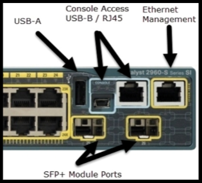

# 网络设备

作为一名网络工程师，咱们将用到一系列网络线缆及别的传输媒介。咱们需要知道，哪些线缆将与 WAN、LAN 及管理端口哪些设备和接口一起工作，以及各个设备怎样适用于整体网络设施。

## 常见网络设备

### 网络交换机

就在几年前，由于成本原因，网络规模都还相当小。这意味着咱们还只需将所有设备，插在一个或多个集线器上。集线器的工作，是在需要时增强网线上的信号，然后将网线上的数据，传送到插上的所有别的设备。当然，这样做的问题是，只打算发送给一台网络主机的消息，却被发送给了网络上连接到其他集线器的所有主机。(集线器和交换技术将在下一课程模组中详细介绍）。

网络交换机则是更智能版本的集线器。交换机使用了内容可寻址存储器，Content Addressable Memory, CAM, 而因此具备记住哪台设备被插入哪个端口的能力。

思科生产了设计工作于从小型办公室，到由数千台设备组成的大型企业网络的所有交换机型号。稍后我们将详细探讨这点，但基本上，交换机会以设备的 MAC 地址（称为二层地址）和 IP 地址（称为三层地址）运行，或他们能执行一些更复杂任务，比如处理放行/拒绝流量或协议及端口编号（称为四层流量），或所有这些层及更多层的某种结合的一些列表。我们将在这个模组稍后部分，介绍这些层的组成及其功能。

早期版本的交换机，被称为网桥。为建立一个表（端口转发表）并做出转发决定，网桥会检查数据帧的源端口（交换机端口）及 MAC 地址。这些表通常经由软件访问，而交换机（不同于网桥）则使用了硬件（即专用集成芯片，Application Specific Integreated Chips, 或 ASIC），访问某个 CAM 表（稍后详述）。因此，交换机可被看作是某种多端口的网桥。

实用交换机，允许咱们将咱们的网络，划分为一些更小、更易于管理的部分（称为网段）。进而允许在咱们公司内部工作的那些团队，比如人力资源、财务、法务等，可以同时在网络的同一区域上工作，这非常有用，因为他们的设备将把他们的大部分时间，花在相互通信上。

**图 1.1** -- **思科 2960 交换机**

每个设备都将连接到交换机上的某个接口，其被称为端口。常见的网络端口速度为 100Mbps 及 1000Mbps（通常称为 1Gbps）。通常有一些咱们可用于将一台交换机，连接到另一交换机的光纤端口。每个交换机都有一些咱们可连接以执行初始化配置，并获得网络维护一般访问权限的管理端口。

下图 1.2 显示了 Cisco 2960 交换机上端口的特写。2960 交换机的数种型号，可满足中小型企业的需求。有关端口功能和型号差异的详细信息，请查阅 Cisco 的发行说明。

**图 1.2** -- **交换机接口类型**

咱们还可在交换机下使用 IP 电话，更妙的是，交换机端口可为这些电话供电（使用以太网供电，Power over Ethernet，PoE 的接口）。基础网络交换机将用于：

- 连接诸如打印机与 PC 等网络设备
- 提供到网络服务器与路由器的访问
- 使用 VLAN 划分网络

所谓 VLAN，属于一些虚拟的局域网。我们将在第 5 天详细讨论这些内容。

### 路由器

作为一名思科工程师，咱们将花大量时间安装、配置路由器及排除故障。因此，CCNA 考试大纲一半以上的内容，都用来学习路由器的配置。

路由器（见图 1.3）是种用于组网的设备。当网络交换机涉及到同一网络上相互通信的设备时，路由器则会与不同网络上的设备通信。较早的路由器型号只有一些以物理方式内置于路由器中，并焊接到主板上的端口。这种情况仍时有存在，但如今的现代网络，需要执行 IP 电话、网络交换与安全，以及连接到多种类型电信公司等等功能的路由器。出于这一原因，路由器也是模组化的，这意味着咱们有路由器机架，和一些咱们可连接各种路由或交换模组的空插槽。

**图 1.3** -- **右边有个空插槽的模组化路由器*

思科网站上有很多可用以解释哪种路由器型号，适合咱们业务需求的建议和信息。还有一些将帮助咱们选择正确型号和操作系统的工具。花时间学习如何浏览这些支持和配置页面，并将他们添加到书签中以供快速参考是值得的。

### 网络如何以图表方式表示

全体网络工程师，需要某种通用的沟通方法，无论他们使用的是哪家供应商和电信提供商。当我（作者）处于设计或安全建议目的，必须向你描述我的网络拓扑结构时，若是以某种商定的格式，而不是凭记忆手绘的某种东西，那么效果就会好得多。对于 CCNA 考试，咱们将需要对这些拓扑结构基本了解，因为考试会呈现一些网络问题，并询问咱们认为问题出在哪里。

以下作为一名网络工程师，咱们将在咱们的工作中遇到的一些网络设备常见符号。当咱们在咱们的浏览器搜索引擎中输入 "Cisco icons"，咱们就可下载到思科网站上的这些图标。我们使用纯蓝色或彩色（Kindle 版本）。我（作者）已在全书中，混合使用了那些最常见的路由器和交换机符号，以便咱们习惯在现实世界的网络图中，咱们将看到的那些类型。

**路由器，Routers**

**交换机（二层），Switch(Layer 2)**

**带有防火墙的路由器，Router with Firewall**

**无线路由器，Wireless Router**

**多层交换机，Multilayer Switch**

**云 -- 电信提供商拥有的设备，The Cloud -- Equipment Owned by the Telecoms Provider**

**终端设备，End Device -- PC**

**串行线，Serial Line**

**以太网连接，Ethernet Link**

**IP 电话，IP Telephone**

**防火墙，Firewall**

