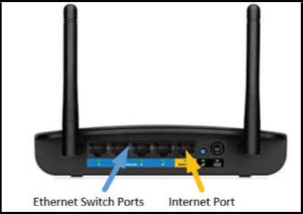
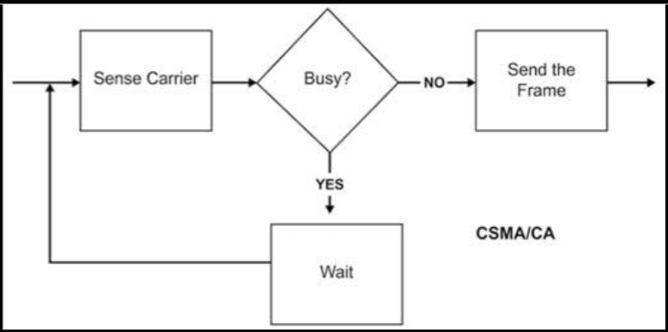
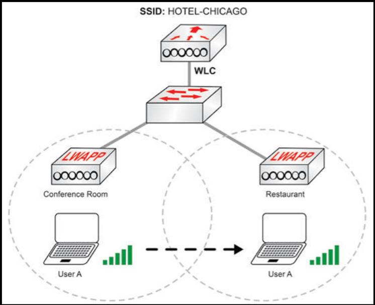
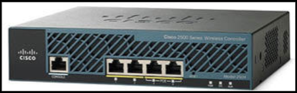
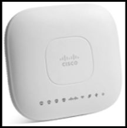
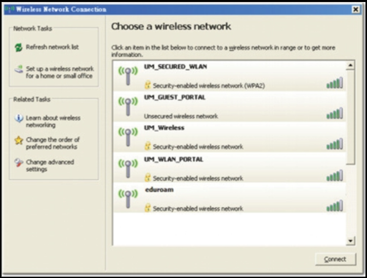

# 无线组网与组件

在创建了 CCNA 无线认证后，思科从先前版本的 CCNA 考试中移除了无线部分。不过，思科的客户（他们会影响考试大纲的制定）表示，他们希望他们的 CCNA 级别工程师，作为日常工作中的一部分，掌握无线技术，因此当前 CCNA 考试大纲的思路已有转变。许多新的 CCNA 考试大纲项目也是如此，比如二层的安全、防火墙等。

IEEE 同时定义了（有线）以太网局域网（IEEE 802.3），与无线局域网（IEEE 802.11）。这一小节将重点介绍企业的无线基础设施组件，但要了解无线组件在企业中的工作原理，咱们应首先构建基础知识。小型办公室/家庭办公室 (SOHO) 网络，就是个很好的开始。

> *知识点*：
>
> - small office/home office, SOHO

## SOHO 的无线方案

乍一看，SOHO 无线路由器可能并不像是一件令人印象深刻的网络设备。虽然在体积、复杂度和成本上，他肯定比不上思科的某些核心路由器（可能高达数万美元），但里面有很多东西，都是咱们需要注意的。首先，这种路由器通常有个提供了有线以太网连通性的以太网交换机。这就可给那些可能不支持 Wi-Fi 的设备，或不会移动、需要一条专用物理连接的设备，提供有线局域网连接。

这种路由器具有一个与网络上的任何无线设备通信，并转发数据帧到无线路由器，或从无线路由器转发到终端的无线接入点（WAP 或就是 AP）。最后，路由器可根据 IP 地址，将接收自无线或有线设备的流量，转发外出到广域网（互联网）接口。

**图 1.17** -- **Linksys N300+ SOHO 无线路由器**

在进一步了解之前，我们来探讨一下 WAP 的概念，因为 WAP 在家庭和企业无线方案中，都扮演了重要角色。

## 无线接入点

无论咱们是在别人家里、访问某间小型办公室，还是住在酒店，无线连通性都会可供咱们使用。所谓 WAP，便是实现无线接入及支持无线的设备连接到网络的技术。接入点与其他无线或有线设备一起工作，提供对本地网络或互联网的访问，而他们扮演了到网络 “高速公路” 上无线 “入口” 的重要角色。

无线网络使用带冲突检测的载波侦听多路访问（CSMA/CD）技术，防止数据帧冲突。这意味着，只有在检测他们所处信道空闲时，无线节点才将尝试传输，以避免冲突。这种技术的一种设想，便是我们在参与小组会议时的行为方式。通常情况下，在分享咱们的想法前，咱们都会等到别人停止说话。同一概念也适用于 CSMA/CA -- 无线设备会在开始他们的传输前，等待安静。

无线访问接入点便是帮助实现小组会议的主持人，他们可支持同一时间的数百名用户，但由于显而易见的原因，从性能角度看，用户越少越好。o

> **知识点**：
>
> - wireless access point, WAP
>
> - access point, AP
>
> - carries sense multiple access with collision avoidence, CSMA/CD

**图 1.18** -- **CSMA/CD 的高级别流程图**

## 企业无线方案

对于有限区域内的少数用户，单个无线路由器可能工作良好，但当咱们打算在几英亩土地上或高层建筑内，为成百上千或上万人提供无线服务时，该怎么办呢？在这种场景下，咱们需要某种可以跨越多个楼层，或允许人们从一栋楼漫游到另一栋而不会丢失他们的无线连通性的方案。咱们将需要一种不仅包括路由、交换和 WAP，还要包含帮助管理无线网络的进一步只能的健壮无线部署。

由于信号强度与技术的限制，每个接入点只能服务有限区域。接入点覆盖区域的大小，会受到许多不同因素的影响，包括建筑物的材料、所选择的无线标准、电子设备的干扰、WAP 上天线的形状，甚至天气！影响 AP 无线覆盖范围的情形很多，不过有种合理估算便是，一个 AP 可提供直径约 150 英尺的覆盖范围。

要确定某个特定地点需要多少个无线接入点，需由专业无线工程师，使用专门设备现场勘查。在推出无线方案前，对楼宇或园区的勘测，对无线方案的成功部署至关重要。当楼宇或园区尚未建成时，咱们即可使用一些软件模拟器，确定咱们的未来无线需求。

现在咱们业已确定咱们所需的 AP 数量，咱们就需要将他们连接到局域网；否则，咱们的终端用户将只有相互间通信的连通性，除此之外再无其他（没有互联网或到本地服务器的访问）。

假设咱们是某家打算提供无缝无线方案给其顾客的大型酒店网络管理员。目标是顾客在楼内任何地方行走（漫游），都不会丢失无线连接。仅仅在整个酒店部署一些接入点，将不足以解决这个挑战。这是因为接入点作为单个设备运行，在漫游时用户将被迫手动连接、断开连接并重新连接到新的接入点。

咱们可通过允许接入点作为一个组通信，克服这一障碍。这样，当用户在会议中心接入无线网络，然后步行几百英尺到餐厅，那么无线接入点就会知道用户在做什么并进行调整，确保顾客不会失去无线连通性。这一概念被称为漫游。

解决方案是个可接收来自全体无线接入点的端点信息，并将这些信息发送到全体无线接入点的一个中心化 “大脑”。如下图 1.19 所示，这个中心化的管理中心，称为无线局域网控制器。用户 A 是在某台无线笔记本电脑或移动设备上，并在大楼里四处走动，却体验着无缝连接。

**图 1.19** -- **企业的无线漫游，Enterprise Wireless Roaming**

## 无线局域网控制器

**Wireless LAN Controllers**

有了 WLC，无线接入点不再是存储终端信息的单独设备；而成为一些 “轻量级”（从 AP 变身为一些轻量级的 WAP，或 LWAP），并将他们学习到的所有信息，比如 WLAN（SSID）信息、漫游或身份验证等，转发给中心化的 WLC。WLC 随后通过以其从 LWAP 学习到的全部信息，管理无线网络，接管这些 AP 的角色。LWAP 通常使用叫做 CAPWAP（无线接入点的控制和配置）的协议，完成这项任务。下图 1.20 显示了由 Cisco Systems 提供的一个典型 WLC。

> *知识点*：
>
> - Control and Provisioning of Wireless Access Points, CAPWAP
>
> - lightweight WAPs, LWAPs

**图 1.20** -- **无线局域网控制器**

一台思科 AP 如下图 1.21 所示。经由简单地将流量转发到 WLC，其便成为了 “轻量级”（译注：这里表述有误，实际上 AP 是使用 CAPWAP 协议，将终端及网络本身的一些信息，转发到无线局域网控制器，而不会将终端网络流量转发到 WLC。终端的流量将直接转发到 LAN 交换机）。

**图 1.21** -- **接入点**

每个移动设备都会加入一个由服务集 ID（SSID）标识的无线网络。一旦加入后，设备通常会忽略其他 SSID。服务同一 SSID 的多个接入点，称为扩展服务集 (ESS)。单个接入点称为基本服务集 (BSS)。咱们可以在下图 1.22 中，看到一系列可用的 SSID。我（作者）相信咱们，已经在咱们的移动设备上看到过这个。

> *知识点*：
>
> - Service Set ID, SSID
>
> - Extended Service Set, ESS
>
> - Basic Service Set, BSS

**图 1.22** -- **可用 SSIDs**
