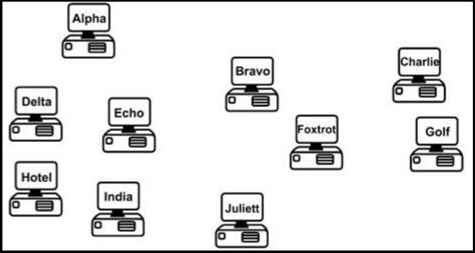

# IP 寻址

网络上的所有设备，都需要某种将自己标识为特定主机的方式。早期网络简单地使用一种命名的格式，以及网络上保存了 MAC 地址到主机名映射的一台网络服务器。数据表很快就变得非常庞大，一致性和准确性等问题也随之而来（见下图 2.5）。IP 寻址有效地解决了这一问题。



**图 2.5** -- **设备命名表变得过于繁琐**


## IP 版本 4

IP 第 4 版（IPv4），设计以解决设备命名问题。IPv4 使用二进制，将地址应用到网络设备。IPv4 的地址，用到分为四个八位组（或字节）的 32 个二进制位。下面是个二进制形式 IPv4 地址的示例：


`11000000.10100011.11110000.10101011`，在十进制下我们将视为 `192.163.240.171`。

每个二进制位代表一个十进制数，通过在相应列处分别置 1 或 0，咱们即可使用或不使用这个数。八个列分别如下：

| 128 | 64 | 32 | 16 | 8 | 4 | 2 | 1 |
| :-: | :-: | :-: | :-: | :-: | :-: | :-: | :-: |
| 1 | 1 | 0 | 0 | 0 | 0 | 0 | 0 |

在上面的图表中，咱们可以看到只有前两个十进制数被用到（两个其下有 1 的数字），这会得到 `128 + 64 = 192` 的值。

## 二进制

为了解 IP 寻址的工作原理，咱们需要掌握二进制数学（抱歉）。计算机和网络设备不懂十进制。我们使用十进制是因为他是一种用到 10 个数字的计数系统，是由千年前的穴居人，在他意识到自己手上有 10 个可以用来点数的数字时发明的。

计算机和网络设备只能理解电信号。由于电信号要么是 “开”，要么是 “关”，因此唯一可行的计数系统便是二进制。二进制只用到两个数字，即 0 或 1。0 表示电线上没有电脉冲，1 表示电线上有脉冲。

任何数字都可以二进制的值组成。咱们添加的二进制值越多，这个数就会变得越大。咱们添加的每个二进制值，就会从右边开始向左移动，增大下一数字一倍（例如，1 到 2 到 4 到 8 到 16，依此类推，直到无穷大）。在两个二进制数下，咱们最多可以数到 3。只需在列中置 0 或 1，即可决定咱们是否打算使用该值。

我们来第 1 和第 2 列中的两个二进制数开始：

| 2 | 1 |
| :-: | :-: |
| 0 | 0 |

`0 + 0 = 0`

| 2 | 1 |
| :-: | :-: |
| 0 | 1 |

`0 + 1 = 1`


| 2 | 1 |
| :-: | :-: |
| 1 | 0 |

`2 + 0 = 2`

| 2 | 1 |
| :-: | :-: |
| 1 | 1 |

`1 + 1 = 1`

当咱们使用八个二进制位空间时（一个八位），咱们可得到从 0 到 255 的任何数字。咱们可以看到，这些数字从右开始向左边移动，每一步的数值都会翻倍：

| 128 | 64 | 32 | 16 | 8 | 4 | 2 | 1 |
| :-: | :-: | :-: | :-: | :-: | :-: | :-: | :-: |
|   |   |   |   |   |   |   |   |


当咱们将 0 添加到每个这些列，咱们就得到了十进制的值 0：

| 128 | 64 | 32 | 16 | 8 | 4 | 2 | 1 |
| :-: | :-: | :-: | :-: | :-: | :-: | :-: | :-: |
| 0 | 0 | 0 | 0 | 0 | 0 | 0 | 0 |


当咱们将 1 添加到每个这些列，咱们就得到了十进制的值 255：


| 128 | 64 | 32 | 16 | 8 | 4 | 2 | 1 |
| :-: | :-: | :-: | :-: | :-: | :-: | :-: | :-: |
| 1 | 1 | 1 | 1 | 1 | 1 | 1 | 1 |


不信？

`128 + 64 + 32 + 16 + 8 + 4 + 2 + 1 = 255`

因此，从逻辑上讲，咱们实际上可通过在不同列上置 0 或 1，构造出从 0 到 255 之间的任何数字，比如：


| 128 | 64 | 32 | 16 | 8 | 4 | 2 | 1 |
| :-: | :-: | :-: | :-: | :-: | :-: | :-: | :-: |
| 0 | 0 | 1 | 0 | 1 | 1 | 0 | 0 |


`32 + 8 + 4 = 44`

IP 寻址和子网划分，就是基于上面的基本原理。表 2.1 总结了咱们目前所了解的知识。请特别注意此表，因为这些值可用于任意的子网掩码（稍后详述）。

**表 2.1** -- **一些二进制值**


| 二进制值 | 十进制值 |
| :-: | :-: |
| `1000 0000` | 128 |
| `1100 0000` | 192 |
| `1110 0000` | 224 |
| `1111 0000` | 240 |
| `1111 1000` | 248 |
| `1111 1100` | 252 |
| `1111 1110` | 254 |
| `1111 1111` | 255 |


请编一些咱们自己的二进制数，确保咱们完全理解这一概念。

## 十六进制

十六进制（或 `hex`）是另一种计数系统。与以 2 或 10 点数不同，其用到 16 个数字或字符。十六进制从 0 开始，一直到 F，如下所示：

    `0 1 2 3 4 5 6 7 8 9 A B C D E F`

每个十六进制数字，实际上表示四个二进制数字，如下表 2.2 所示：

<a name="table-2.2"></a>
**表 2.2** -- **十进制、十六进制及二进制的数字**

<table>
  <tr>
    <th>十进制</th>
    <td>0</td>
    <td>1</td>
    <td>2</td>
    <td>3</td>
    <td>4</td>
    <td>5</td>
    <td>6</td>
    <td>7</td>
    <td>8</td>
    <td>9</td>
    <td>10</td>
    <td>11</td>
    <td>12</td>
    <td>13</td>
    <td>14</td>
    <td>15</td>
  </tr>
  <tr>
    <th>十六进制</th>
    <td>0</td>
    <td>1</td>
    <td>2</td>
    <td>3</td>
    <td>4</td>
    <td>5</td>
    <td>6</td>
    <td>7</td>
    <td>8</td>
    <td>9</td>
    <td>A</td>
    <td>B</td>
    <td>C</td>
    <td>D</td>
    <td>E</td>
    <td>F</td>
  </tr>
  <tr>
    <th>二进制</th>
    <td>0000</td>
    <td>0001</td>
    <td>0010</td>
    <td>0011</td>
    <td>0100</td>
    <td>0101</td>
    <td>0110</td>
    <td>0111</td>
    <td>1000</td>
    <td>1001</td>
    <td>1010</td>
    <td>1011</td>
    <td>1100</td>
    <td>1101</td>
    <td>1110</td>
    <td>1111</td>
  </tr>
</table>

从二进制转换到十六进制再到十进制相当简单，如下表 2.3 所示：

**表 2.3** -- **二进制到十六进制到十进制的转换**

<table>
  <tr>
    <th>十进制</th>
    <td>13</td>
    <td>6</td>
    <td>2</td>
    <td>12</td>
  </tr>
  <tr>
    <th>十六进制</th>
    <td>D</td>
    <td>6</td>
    <td>2</td>
    <td>C</td>
  </tr>
  <tr>
    <th>二进制</th>
    <td>1101</td>
    <td>0110</td>
    <td>0010</td>
    <td>1100</td>
  </tr>
</table>


对于人类来说，十六进制是比二进制更易管理的计数系统，而其与二进制足够接近，故可被计算机和网络设备使用。任何数都可用十六进制构造出来，因为其可使用二进制或十进制；例如，只需用 16 的倍数计算即可：

    ```
    1 x 16 = 16
    16 x 16 = 256
    256 x 16 = 4096
    ```

    等等。

<table>
  <tr>
    <th rolspan="2">十六进制</th>
    <td>4096</td>
    <td>256</td>
    <td>16</td>
    <td>1</td>
  </tr>
  <tr>
    <td></td>
    <td></td>
    <td>1</td>
    <td>A</td>
  </tr>
</table>

因此，在以十六进制计算时，会得到 `0 1 2 3 4 5 6 7 8 9 A B C D E F 10 11 12 13 14 15 16 17 18 19 1A 1B 1C 1D 1E 1F 20 21 22` 等，直到无穷大。例如，`1A`（上面的）便是 1 列上的 A 和 16 列上的 1：`A = 10 + 16 = 26`。

在将二进制转换到十六进制时，若咱们将八个二进制位拆分成两组，每组四个比特，就会使转换任务变得更容易。因此，`11110011` 就变成了 `1111 0011`。而 `1111` 是 `8 + 4 + 2 + 1 = 15`，同时 `0011` 为 `2 +1 = 3`。`15` 是十六进制的 `F`，而 `3` 就是十六进制的 `3`，这就给到我们答案 `F3`。咱们可查看表 2.2 确认这一点。

十六进制到二进制的转换采用了同一过程。例如，`7C` 可拆分为 `7`，其为二进制的 `0111`，及 `C`（十进制的 `12`），其为二进制的 `1100`。那么答案就是 `01111100`。

## 换算练习

下面是一些供咱们尝试的示例。要写出上面用于计算十六进制和二进制的图表（即对于十六进制，先写 1 列，然后写 16 列，再写 256 列，依此类推）：

1. 将 `1111` 转换为十六进制和十进制；
2. 将 `11010` 转换为十六进制和十进制；
3. 将 `10000` 转换为十六进制和十进制；
4. 将 20 转换为二进制和十六进制；
5. 将 32 转换为二进制和十六进制；
6. 将 101 转换为二进制和十六进制；
7. 将 `A6` 从十六进制转换为二进制和十进制；
8. 将 `15` 从十六进制转换成二进制和十进制；
9. 将 `B5` 从十六进制转换成二进制和十进制。

在考试中，写出 [表 2.2](#table-2.2) 以帮助咱们完成任何的二进制到十六进制再到十进制的转换，是非常有用的。

使用 IP 寻址的规则是，网络上的每个地址，都必须是该主机独有的（即地址不能共用）。有些地址不能用于主机。这将在稍后详细介绍，但现在，咱们要知道，咱们不能使用为整个网络保留的地址、广播地址或为测试目的保留的地址。此外，有三组地址被保留作内部网络用途，以节省地址。

由于网络规模的迅速增长，每个 IP 地址都必须与子网掩码结合使用。子网掩码的作用是告诉网络设备，如何使用 IP 地址中的那些数字。这样做的原因是，可供咱们网络上主机使用的某些地址，实际上可以用来将网络分割成一些更小块或子网。

带有子网掩码的 IP 地址的一个示例，便是 `192.168.1.1 255.255.255.240`。
