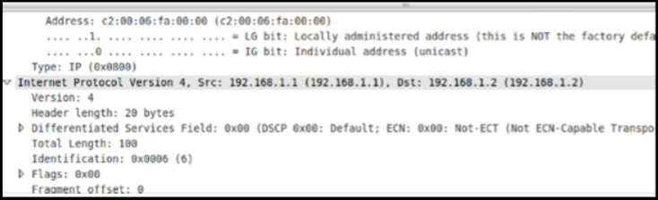
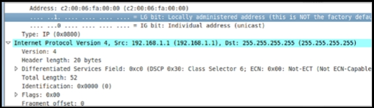
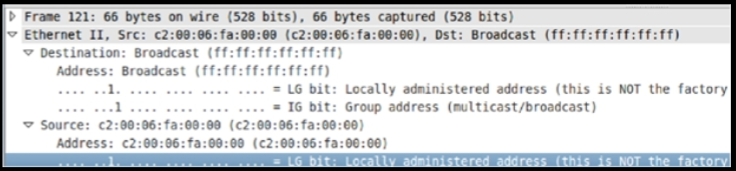
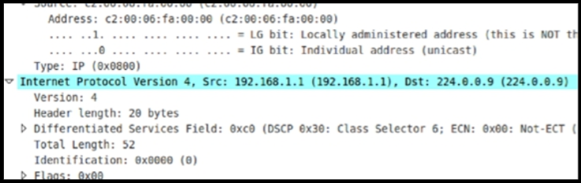

# 网络流量的类型

咱们应已熟悉一些基本网络概念，但作为复习，在描述各种网络设备时，以下术语会经常用到：

- 域：网络的某个特定部分
- 带宽：在给定时间内某链路上可承载的数据量
- 单播数据：发送到一台设备的数据
- 组播数据：发送到一组设备的数据
- 广播数据：发送到所有设备的数据
- 冲突域：包括了共享同一带宽的所有设备；冲突域会被交换机端口分隔
- 广播域：包括会接收到广播消息的所有设备；广播域会被路由器（及 VLAN）分隔

> *知识点*：
>
> - Domain
>
> - Bandwidth
>
> - Unicast data
>
> - Multicast data
>
> - Broadcast data
>
> - Collision domain
>
> - Broadcast domain

我们将在整本指南中，介绍组播与广播流量，特别是路由协议使用这些流量类型的方式。我们还将研究冲突域。

若咱们将 GNS3 用于任何实验，咱们便可以轻松使用某种诸如 Wireshark 的网络嗅探器，检查正被转发流量的类型。下图 2.1 显示了一次单播数据包的捕获。咱们可以看到，单一源 (`Src:`) 正在与单一目标 (`Dst:`) 联系，在这个案例中，便是 `192.168.1.1` 到主机 `192.168.1.2`。

**图 2.1** -- **单播数据报捕获**

下图 2.2 是一次广播数据包的捕获。RIPv1 路由协议正向整个局域网广播。我们知道这一个广播数据包，因为目的地址是 `255.255.255.255`。这意味着接收到该数据包的每个设备，都必须接受并处理他，以防其为预期的接收者之一。

**图 2.2** -- **广播数据包的捕获**

若咱们检查以太网数据帧，咱们就会看到十六进制的广播地址，即下图 2.3 中以一些 `F` 填充的目的地址字段。

**图 2.3** -- **广播数据帧的捕获**

下图 2.4 显示了一次多播数据包的捕获。多播地址不能用于网络上的主机。通常咱们将看到，多播地址会被一些路由协议，用于发送更新到那些被配置为路由域一部分，需要接收路由的设备。多播地址还可用于诸如音乐会之类的流媒体视频活动。多播地址范围为 `224.0.0.0` 到 `239.255.255.255`，被称为 D 类地址。我们稍后将介绍地址类别。

**图 2.4** -- **多播数据包的捕获**

