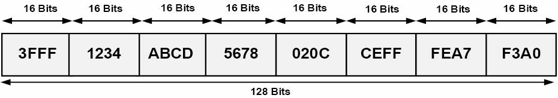
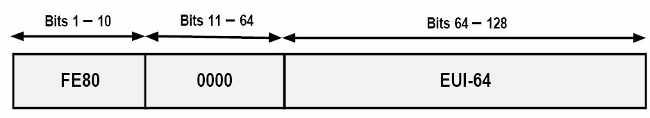
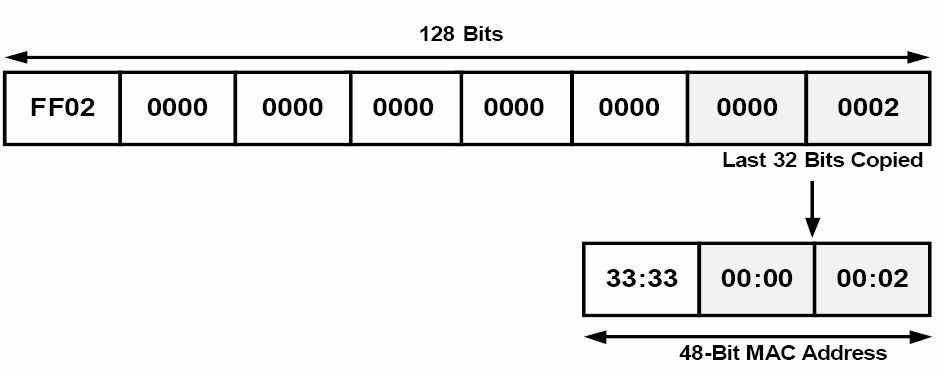
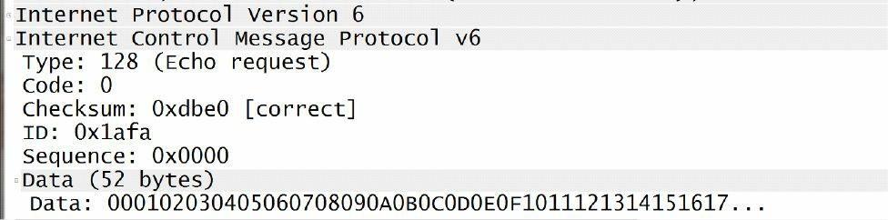
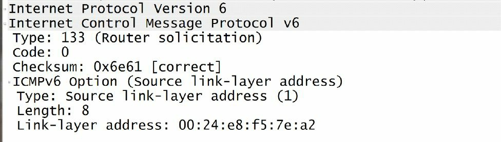
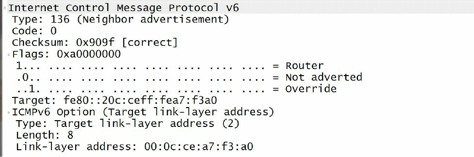
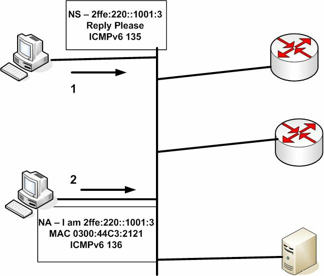

# IPv6分址

我们已经知道，IPv6 使用了 128 位的地址。由于地址格式不同于我们都已习惯的 IPv4 地址格式，乍一看往往会让人感到困惑。不过，一旦掌握了，那么其中逻辑和结构就非常简单。128 位的 IPv6 地址，用到十六进制值（即数字 0 至 9 及字母 A 至 F）。而在 IPv4 中，子网掩码可以 CIDR 表示法（如 `/16` 或 `/32`），或点分十进制表示法（如 `255.255.0.0` 或 `255.255.255.255`），而由于 IPv6 地址长度的原因，IPv6 的子网掩码只以 CIDR 表示法表示。全局的 128 位 IPv6 地址，分为以下三部分：

- 运营商分配的前缀
- 站点前缀
- 接口或主机的 ID

提供商分配的前缀，也称为全局地址空间，是个分为以下三个不同部分的 48 位前缀：

- 16 位的保留 IPv6 全局前缀
- 16 位的运营商持有前缀
- 16 位的运营商分配前缀

所谓 IPv6 的全局前缀，用于表示 IPv6 的全局地址空间。全部 IPv6 的全球互联网地址，都位于 `2000::/16` 到 `3FFF::/16` 的范围内。而 16 位的运营商持有 IPv6 前缀，属于分配给运营商并由提供商持有的。这些前缀的分配，遵循了与 IPv4 下前缀分配相同的规则。运营商持有的前缀，位于 `0000::/32` 到 `FFFF::/32` 范围内。

接下来的 16 位，表示由具体运营商，从提供商分配的前缀地址空间，分配给某个组织的 IPv6 前缀。这个前缀位于 `0000::/48` 到 `FFFF::/48` 范围内。总的来说，这前 48 位，被称为运营商分配的前缀，如下图 3.1 所示。


**图 3.1** -- **`48`位服务提供商分配的 IPv6 前缀**

在`48`位服务商分配的前缀之后，紧接着的`16`位就是**站点前缀**。站点前缀的子网掩码长度是`/64`, 该子网掩码已经包括了之前的`48`位服务商分配的前缀。**此前缀长度允许在每个站点前缀中有`2`的`64`次幂个地址**。图7.2演示了该`16`位站点前缀。


*图7.2 -- `16`位的 IPv6 站点前缀*

而在站点前缀之后，接下来的`64`位就用于接口或主机的分址了。**IPv6地址的接口或主机 ID 部分，表示了某个 IPv6 子网上的某台网络设备或主机**。至于确定接口或主机地址的不同方式，在今天的课程稍后会详细讲到。图7.3说明了 IPv6 的这些前缀是如何分配的。


*图7.3 -- IPv6前缀的分配*

参考图7.3, 客户一旦收到由 ISP 提供的`/48`前缀，就可以该前缀范围内，对站点前缀和主机或接口地址进行自由分配了。基于可用的地址空间全部容量，任何单一机构客户，只需一个的服务商分配前缀，机构网络上的所有设备就保证可以分配到一个唯一 IPv6 全球地址。因此， IPv6 绝对不需要 NAT 这样的技术。

### IPv6地址表示法

**IPv6 Address Representation**

IPv6地址可像下面这三种方式进行表示。

- 首选的或者说完整地址表示/形式
- 压缩的表示法
- 带有一个嵌入了 IPv4 地址的 IPv6 地址

尽管在以文本格式表示`128`位 IPv6 地址时，**首选形式或表示法是最常用的方式**，**熟悉其它两种 IPv6 地址表示法**也很重要。下面会对这三种方式进行说明。

### 首选形式

**The Prefered Form**

**IPv6地址的首选表示法**(the prefered representation for an IPv6 address)，有着最长的格式，又被称作**IPv6地址的完整形式**(the complete form of an IPv6 address)。此格式表示法使用`32`个十六进制字符，以构成一个 IPv6 地址。通过将某地址写作共八组的十六进制字段，用冒号将这`8`个字段分开（比如，`3FFF:1234:ABCD:5678:020C:CEFE:FEA7:F3A0`）。

每个`16`位字段，由 4 个十六进制字符表示，那么每个字符就表示了`4`位。每个`16`位十六进制字段，可以是`0x0000`和`0xFFFF`之间的值，但就如同今天后面讲到的那样，**第一组的一些数值已被保留，那么所有可能的数值都不被使用**（as will be described later in this module, different values have been reserved for use in the first `16` bits, so all possible values are not used）。在书写 IPv6 地址时，**十六进制字符不区分大小写**。也就是说，`2001:ABCD:0000`和`2001:abcd:0000`是完全一样的。 IPv6 地址表示法的完整形式，在下图7.4中有演示。



*图7.4 -- IPv6地址表示法的首选形式*

下面的这些 IPv6 地址，是完整形式下的有效 IPv6 地址实例。

- `0000:0000:0000:0000:0000:0000:0000:0001`
- `2001:0000:0000:1234:0000:5678:af23:bcd5`
- `3FFF:0000:0000:1010:1A2B:5000:0B00:DE0F`
- `fec0:2004:ab10:00cd:1234:0000:0000:6789`
- `0000:0000:0000:0000:0000:0000:0000:0000`

### 压缩的表示法

**Compressed Representation**

压缩的表示法，允许以两种压缩方式之一，对 IPv6 地址进行压缩。第一种压缩方式，允许使用**一对**冒号（`::`）, 对**一个有效 IPv6 地址中的那些由`0s`构成的连续`16`位字段的连续的`0`值，或者 IPv6 地址中前面的`0s`**，进行压缩。在使用这种方式时，**务必要记住，双冒号在一个 IPv6 地址中，只能使用一次**。

在用到压缩格式时，各个节点及各台路由器，负责去对双冒号两侧的位数进行计数，以判断出该双冒号究竟表示了多少个`0s`。表7.1显示了那些 IPv6 地址的首选形式及其压缩表示法。

*表7.1 -- 首选和压缩形式下的完整 IPv6 地址*

| 完整 IPv6 地址表示法 | 压缩的 IPv6 地址表示法 |
| -- | -- |
| `0000:0000:0000:0000:0000:0000:0000:0001` | `::0001` |
| `2001:0000:0000:1234:0000:5678:af23:bcd5` | `2001::1234:0:5678:af23:bcd5` |
| `3FFF:0000:0000:1010:1A2B:5000:0B00:DE0F` | `3FFF::1010:1A2B:5000:B00:DE0F` |
| `FEC0:2004:AB10:00CD:1234:0000:0000:6789` | `FEC0:2004:AB10:CD:1234::6789` |
| `0000:0000:0000:0000:0000:FFFF:172.16.255.1` | `::FFFF:172.16.255.1` |
| `0000:0000:0000:0000:0000:0000:172.16.255.1` | `::172.16.255.1` |
| `0000:0000:0000:0000:0000:0000:0000:0000` | `::` |

跟前面指出的那样，在单个的 IPv6 地址中，双冒号不能多于一次地使用。比如说，如要对这个完整 IPv6 地址`2001:0000:0000:1234:0000:0000:af23:bcd5`以压缩形式表示，那么你就只能使用双冒号一次，就算在该地址中有两组连续的`0`字符串。那么，在尝试将该地址压缩成`2001::1234::af23:bcd5`，就被看成是非法的；但是此 IPv6 地址既可以压缩成`2001::1234:0:0:af23:bcd5`, 也可以压缩成`2001:0:0:1234::af23:bcd5`, 取决于自己喜好。

第二种 IPv6 压缩地址表示法，对于**单个的`16`位字段，及前导`0s`，可从该 IPv6 地址中省略成单个的`0`**。在使用该方法时，如某个`16`位字段都是`0`, 那么就必须用一个`0`来表示此字段。在这种情况下，并非所有的`0`都能省略。表7.2中展示了首选形式的 IPv6 地址，以及它们怎样通过第二种 IPv6 压缩形式表示法进行压缩。

*表7.2 -- 以替代的压缩形式表示的完整 IPv6 地址*

| 完整 IPv6 地址表示法 | 压缩 IPv6 地址表示法 |
| -- | -- |
| `0000:0123:0abc:0000:04b0:0678:f000:0001` | `::123:abc:0:4b0:678:f000:1` |
| `2001:0000:0000:1234:0000:5678:af23:bcd5` | `2001::1234:0:5678:af23:bcd5` |
| `3FFF:0000:0000:1010:1A2B:5000:0B00:DE0F` | `3FFF::1010:1A2B:5000:B00:DE0F` |
| `fec0:2004:ab10:00cd:1234:0000:0000:6789` | `fec0:2004:ab10:cd:1234::6789` |
| `0000:0000:0000:0000:0000:FFFF:172.16.255.1` | `::FFFF:172.16.255.1` |
| `0000:0000:0000:0000:0000:0000:172.16.255.1` | `::172.16.255.1` |
| `0000:0000:0000:0000:0000:0000:0000:0000` | `::` |

这里就有了两种以压缩形式表示完整 IPv6 地址的方法，要记住，**两种方法之间并不互相排斥**。也就是说，在表示一个 IPv6 地址时，可以同时使用这两种方法。当某个完整 IPv6 地址既包含了连续`0s`字符串，又在其它字段中有前导`0s`时，这经常会用到。表7.3展示了一些既包含了连续`0s`字符串，又有前导`0s`的一些 IPv6 地址的完整形式，以及如何将这些地址表示成压缩形式。

*表7.3 -- 使用了两种压缩格式方法的完整 IPv6 地址*

| 完整 IPv6 地址表示法 | 压缩 IPv6 地址表示法 |
| -- | -- |
| `0000:0000:0000:0000:1a2b:000c:f123:4567` | `::1a2b:c:f123:4567` |
| `FEC0:0004:AB10:00CD:1234:0000:0000:6789` | `FEC0:4:AB10:CD:1234::6789` |
| `3FFF:0c00:0000:1010:1A2B:0000:0000:DE0F` | `3FFF:c00:0:1010:1A2B::DE0F` |
| `2001:0000:0000:1234:0000:5678:af23:00d5` | `2001::1234:0:5678:af23:d5` |

### 带有一个嵌入的 IPv4 地址的 IPv6 地址

**IPv6 Addresses with an Embedded IPv4 Address**

这是**第三种 IPv6 地址表示法，用于在 IPv6 地址内部使用一个 IPv4 地址**。尽管这也是有效的 IPv6 地址，但请记住这种方法是不赞成的做法，同时也在考虑废弃这种方法，因为该方法仅适用于从 IPv4 到 IPv6 的过渡。

## IPv6地址的不同类型

**The Different IPv6 Address Types**

**IPv4支持 4 中不同类别的地址，分别是任意播（ Anycast ）、广播(Broadcast)、多播(Multicast)及单播(Unicast)地址**。尽管在本教程之前的模块中并未用到任意播一词, 但要记住，**任意播地址并非特殊类型的地址**。相反，**一个任意播地址简单地就是一个分配给多个接口的 IP 地址**。常见的使用了任意播的技术包括 IP 多播应用(IP Multicast implementations)，以及`6to4`中继应用(`6to4` relay implementation)。

>**注意：** `6to4`是一种 IPv4 迁移到 IPv6 的过渡机制。对于 CCNA 考试来说，只需知道有这么个东西就行了。

在任意播寻址方式下，**设备使用从路由协议度量值上看离它们最近的那个公共地址**(the common address)。假如该主要地址不可达时，就会使用下一个最近的地址（with Anycast adressing, devices use the common address that is closest to them based on routing protocol metric. The next closest address is then used in the event that the primary address is no longer reachable）。此概念在下图7.5中进行了演示。


*图7.5 -- 理解任意播寻址方式*

在图7.5中，`R1`和`R2`都有一个配置了公共地址`15.1.1.254/32`的环回接口`Loopback 254`。该前缀此时会经由 EIGRP 进行通告。默认情况下，`R1`和`R2`都会经由它们各自的相应环回接口，优先选择`15.1.1.254/32`前缀，因为该前缀是一个直接连接的子网。因此，两台路由器上所使用的公共地址绝不会发生冲突。

假定是在一般 EIGRP 度量值计算下，则`R3`和`R5`都会优先选择`R1`通告的那个任意播地址（the Anycast address）, 这是由于其有着较小的内部网关协议（Interior Gateway Protocol, IGP）度量值(due to the lower IGP metric)。同样`R4`和`R6`则会优先选择 R3 通告的那个任意播地址，也是由于其有着较小的 IGP 度量值。要是`R1`或`R3`中的某台失效，网络中的路由器就会使用由剩下的那台路由器通告的任意播地址了。某个组织在应用任意播分址时，既可以使用`RFC 1918`中定义的地址空间中的某个单播地址(私有地址)，也可以使用其公网地址块中的某个单播地址。

> **注意：** 当前的 CCNA 考试并不要求你采用任何的任意播分址或解决方案。但熟悉此概念是必要的。在完成路由章节的学习后，你将更为明白。*译者注：*关于任意播，可以参看[wikipedia.org/wiki/Anycast](https://en.wikipedia.org/wiki/Anycast)，简单地说，任意播是一种冗余方法，可用来做负载均衡、加快访问速度。

在 CCNA 层次， IPv4 的广播、多播及单播地址都无需更为详尽地阐述，本课程及本模块都不会对它们进行更为详细的说明。与 IPv4 支持这四种类型的地址相比， IPv6 废除了广播地址，同时取而代之的仅支持以下类型的地址。

- 本地链路地址，Link-Local addresses
- 站点本地地址，Site-Local addresses
- 可聚合全球单播地址，Aggregatable Global Unicast addresses
- 多播地址，Multicast addresses，已被废除，取而代之的是本地唯一地址（Unique-Local addresses, ULAs)
- 任意播地址，Anycast addresses
- 环回地址，Loopback addresses
- 未指明的地址，Unspecified addresses，`::/128`

### 本地链路地址

**Link-Local Addresses**

**IPv6本地链路地址只能用在本地链路上**（也就是一个设备间所共享的网段），**是在某个接口上开启了 IPv6 时，自动分配给接口的**。这些地址分配自本地链路前缀（the Link-Local prefix）**`FE80::/10`**。记住`FE80::/10`等价于`FE80:0:0:0:0:0:0:0/10`, 又可以表示为`FE80:0000:0000:0000:0000:0000:0000:0000/10`。为了构成该地址，从第`11`到`64`位被设置为`0`, 同时接口的`EUI-64`(Extended Unique Identifier 64， 64 位扩展唯一标识）给追加到本地链路地址上去，作为下一顺位的`64`位（the lower-order `64` bits）。**EUI-64是由 IEEE 分配给接口产商的`24`位ID(Organization Unified Identifier, OUI)，以及产商分配给其产品的`40`位值构成**。本模块稍后会更为详细地说明`EUI-64`分址。图7.6演示了本地链路地址的格式。



*图7.6 -- IPv6本地链路分址*

**本地链路地址是唯一的，一旦分配给了某个接口，就不再改变**。这就是说，某个接口在分配了一个公网 IPv6 地址后（比如，`2001:1000::1/64`），就算该公网 IPv6 前缀发生改变(变成`2001:2000::1/64`)，本地链路地址也是不会改变的。这允许主机或路由器在 IPv6 全球互联网地址改变时，对其邻居始终保持可达。而**IPv6路由器是不会转发那些以本地链路地址作为源或目的地址的数据包，到其它 IPv6 路由器的**。

### 站点本地地址

**Site-Local Addresses**

站点本地地址是**那些仅在某个站点内部使用的地址**。与本地链路地址不同，必须**在网络设备上手动为其配置站点本地地址**。这些地址就是在 IPv6 中，与RFC 1918所定义的私有 IPv4 地址等价的地址，对于那些没有可全球路由 IPv6 地址空间的组织，可以使用这些地址。在 IPv6 互联网上，这些地址是不可路由的。

尽管在 IPv6 上进行 NAT 是可能的，但绝不建议这么做。理由就是有着大得多的 IPv6 地址（hence, the reason for the much larger IPv6 addresses）。站点本地地址是由`FEC0::/10`前缀、该前缀之后的 54 位子网 ID ，以及同样的为本地链路地址所用到的EUI-64格式的接口 ID 组成。与本地链路地址中设置为 0 的 54 位相比，站点本地地址中的 54 位，被用于构建不同的 IPv6 前缀（最多 2 的 54 次幂个）。下图7.7演示了站点本地地址的格式。


*图7.7 -- IPv6站点本地分址*

尽管在本章节中有对 IPv6 站点本地地址进行说明，同时在思科 IOS 软件中仍有对其的支持，但要知道**这些地址已被RFC 3879（废弃站点本地地址，Deprecating Site Local Addresses）所废弃**。与此同时，**RFC 4193(唯一本地 IPv6 单播地址，Unique Local IPv6 Unicast Addresses）又阐述本地唯一地址（Unique-Local addresses, ULAs）**, 本地唯一地址提供了站点本地地址的功能，它们在 IPv6 全球互联网上也是不可路由的，仅能在某个站点内部路由。

本地唯一地址分配自`FC00::/7`这个 IPv6 地址块，该地址块又被划分成两个`/8`的地址块，分别作为分配组和随机组（the assigned and random groups）。那么这两组就分别是`FC00::/8`和`FD00::/8`了。`FC00::/8`这个地址块是由一个分配机构（an allocation authority）管理其使用到的`/48s`，同时`FD00::/8`地址块则是通过在其后追加上随机生成的`40`位字符串，得到的一个有效`/48`地址块的。

### 可聚合全球单播地址

**Aggregatable Global Unicast Addresses**

**可聚合全球单播地址，就是那些用于一般 IPv6 流量传输、 IPv6 互联网的 IPv6 地址了**。这些地址与 IPv4 中用到的公网地址相似。而从网络分址角度看，每个 IPv6 全球单播地址都**是由三个主要部分构成的**：自服务商处收到的前缀（`48`位长）、站点前缀（`16`位长），以及主机部分（`64`位长）。这就构成了 IPv6 中所用到的`128`位地址了。

如同本模块前面提到的，服务商分配的前缀，是由 IPv6 服务提供商分配给作为其客户的某家组织的。默认情况下，这些前缀用到`/48`的前缀长度。此外，这些前缀又是从该服务提供商所拥有的 IPv6 地址空间中分配的（也就是`/32`前缀长度）。每家服务提供商都将有着其自己的 IPv6 地址空间，同时由一家服务提供商分配的 IPv6 前缀，不能在另一家的网络上使用。

而在某个站点内部，管理员此时就能通过用于子网划分的第`49`到`64`位，将服务提供商分配的`48`位前缀，划分成`64`位的站点前缀，从而可以得到`65535`个不同的，可在其网络中使用的子网。 IPv6 地址的主机部分表示该 IPv6 子网上的某台网络设备或主机。而这又是通过 IPv6 地址的低`64`位表示的（this is represented by the low-order 64 bits of the IPv6 address）。

IPv6的可聚合全球单播地址，是由互联网号码分配局（the Internet Assigned Numbers Authority, IANA）分配的，这些地址处于 IPv6 前缀`2000::/3`中。此前缀允许的可聚合全球单播地址范围是从`2000`到`3FFF`，如下表7.4所示。

*表7.4 -- IPv6可聚合全球单播地址*

| 说明 | 地址 |
| -- | -- |
| 范围中的第一个地址 | `2000:0000:0000:0000:0000:0000:0000:0000` |
| 范围中的最后一个地址 | `3FFF:FFFF:FFFF:FFFF:FFFF:FFFF:FFFF:FFFF` |
| 二进制标记 | 高位序的三位被设置为`001` |

在本模块编写时，`2000::/3`IPv6地址块中，仅分配使用了`3`个子网。这三个子网如下表7.5所示。

*表7.5 -- 由 IANA 所分配的 IPv6 可聚合全球单播地址*

| IPv6全球前缀 | 二进制表示法 | 说明 |
| -- | -- | -- |
| `2001::/16` | `0010 0000 0000 0001` | 全球 IPv6 互联网(单播) |
| `2002::/16` | `0010 0000 0000 0000` | `6to4`迁移前缀 |
| `3FFE::/16` | `0010 1111 1111 1110` | `6bone`前缀 |

> **注意：** 6to4迁移地址和 6bone 前缀将在本课程的后面说明。

在 IPv6 全球可聚合单播地址范围，保留了一个叫做**ORCHID**（`RFC 4843`中定义的覆盖可路由加密散列标识、Overlay Routable Cryptographic Hash Identifiers defined in RFC 4843）特别的实验范围。 ORCHID 是用于加密散列标识的不可路由 IPv6 地址。这些地址使用 IPv6 前缀`2001:10::/28`。关于 ORCHID 地址的细节，是超出当前 CCNA 考试要求范围的，本模块或本课程都不会包含。

### 多播地址

**Multicast Addresses**

IPv6中用到的多播地址，是从`FF00::/8`这个 IPv6 前缀中得到的。 IPv6 中的多播和 IPv4 中的多播，运行的方式是不一样的。**IPv6中重度使用到 IP 多播**，并用 IP 多播替换了一些诸如地址解析协议（Address Resolution Protocol, ARP）这样的 IPv4 协议。此外， IPv6 中还用多播来完成前缀通告及其重编号（prefix advertisements and renumbering）, 以及重复地址侦测（Duplicate Address Detection, DAD）等。本模块后面会对这些概念进行说明。

**IPv6中的多播数据包**，不是通过使用 TTL 值来将其限制在本地网段上。代之以**使用多播地址内部的范围字段（the Scope filed），定义出其范围**。网段上的 IPv6 节点，都侦听着多播包，甚至也会发出多播包来交换信息。这样,IPv6网段上所有节点，都知道在其同一网段上所有其它邻居节点了。下图7.8中演示了 IPv6 网络中用到的多播地址格式。


*图7.8 -- IPv6多播分址*

如同图7.8中所演示的那样， IPv6 多播地址格式与其它之前学到的 IPv6 地址略有不同。 IPv6 多播地址的前`8`位表示多播前缀`FF::/8`。 IPv6 多播地址的标志字段（the Flag field）用于指明多播地址类型 -- 是永久的还是临时的。

**IPv6永久多播地址是由 IANA 分配的，而 IPv6 临时地址则可用于多播预部署的测试**(Permanent IPv6 Multicast addresses are assigned by IANA, while temporary IPv6 Multicast addresses can be used in pre-deployment Multicast testing)。标志字段所包含的值可以是表7.6中所示的两个。

*表7.6 -- IPv6永久及临时多播地址*

| 多播地址类型 | 二进制表示法 | 十六进制值 |
| -- | -- | -- |
| 永久 | `0000` | `0` |
| 临时 | `0001` | `1` |

多播地址中接下来的 4 位表示**多播范围**。在 IPv6 多播分址中，该字段是一个**用于限制多播数据包发往网络其它区域的_强制_字段**（this field is a mandatory field that restricts Multicast packets from being sent to other areas in the network）。该字段本质上提供了与 IPv4 中所用到的 TTL 字段一样的功能。但是，**在 IPv6 中，范围的类型有好几种**，下表7.7中列出了这些类型。

*表7.7 -- IPv6多播地址范围的类型*

| 范围类型 | 二进制表示法 | 十六进制值 |
| -- | -- | -- |
| 本地接口，Interface-Local | `0001` | `1` |
| 本地链路，Link-Local | `0010` | `2` |
| 本地子网, Subnet-Local | `0011` | `3` |
| 本地管理域范围，Admin-Local | `0100` | `4` |
| 本地站点范围，Site-Local | `0101` | `5` |
| 组织范围，Organization | `1000` | `8` |
| 全球范围，Global | `1110` | `E` |

在这些 IPv6 多播前缀中，又**保留了一些地址**。这些保留地址称作多播指定地址（Multicast Assigned addresses）, 如下表7.8中所示。

*表7.8 -- 保留的 IPv6 多播地址*

| 地址 | 范围 | 说明 |
| -- | -- | -- |
| `FF01::1` | 主机 | 所有在本地接口范围内的主机 |
| `FF01::2` | 主机 | 所有在本地接口范围内的路由器 |
| `FF02::1` | 本地链路 | 所有在本地链路范围内的主机 |
| `FF02::2` | 本地链路 | 所有在本地链路范围内的路由器 |
| `FF05::2` | 站点 | 所有在本地站点范围内的路由器 |

除了这些地址外，对路由器接口和网络主机上配置的每个单播和任意播地址，都自动启用了一个节点询问多播地址（a Solicited-Node Multicast address）。此地址有着一个本地链路范围，就是说该地址绝不会超出本地网段之外（this address has a Link-Local scope, which means that it will never traverse farther than the local network segment）。**节点询问多播地址用于以下两个目的：取代 IPv4 的 ARP 和DAD**。

由于 IPv6 不会用到 ARP ，那么节点询问多播地址就被网络主机和路由器用于获悉邻居设备的数据链路地址（the Data Link address）。这样就可以实现 IPv6 数据包向帧的转换，并将帧发往 IPv6 主机和路由器了。 DAD 是 IPv6 邻居发现协议（Neighbor Discovery Protocol, NDP）的一部分, 在本模块的稍后会详细说明这个协议。 DAD 就是在设备在采用自动配置方法时，将某个 IPv6 地址配置为其自己的地址之前，检查该地址是否在本地网段上已被使用的方法。本质上， DAD 提供与 IPv4 中用到的无故 ARP （Gratuitous ARP）相似的功能。这些**节点询问多播地址**, 是由 IPv6 前缀`FF02::1:FF00:0000/104`定义出来的。它们的构成为前缀`FF02::1:FF00:0000/104`, 与单播或任意播地址低位序的`24`位结合而成。图7.9演示了这些节点询问多播地址的格式。


*图7.9 -- IPv6节点询问多播地址*

而作为与 IPv4 到二层以太网的多播映射的一个类似方案，**IPv6提供了一种独特的方法，来将三层 IPv6 多播地址，映射到二层多播地址**。 IPv6 中的多播映射是通过在某多播地址的后`32`位加上一个`16`位前缀`33:33`，这个前缀就是 IPv6 网络中定义的多播以太网前缀（the defined Multicast Ethernet prefix for IPv6 Networks）。其在下图7.10中，演示了所有位于本地接口范围前缀`FF02::2`上的路由器的以太网映射多播地址。



*图7.10 -- IPv6多播地址*

### 任意播地址

**Anycast Addresses**

本章节的早前引入了任意播，其可被简单地说成是一对最近的通信（one-to-nearest communication）, 这是因为基于路由协议度量值的那个最近的公共地址（the nearest common address），总是会为本地设备所优先选用。**在 IPv6 中，并无为任意播特别分配的地址范围**，因为**任意播地址使用的是全球单播地址、站点本地地址，甚或本地链路地址**。尽管如此，仍然保留一个作为特殊用途的任意播地址。该特别地址被称为**子网路由器任意播地址**(the Subnet-Router Anycast address)，是由前面的该子网`64`位单播前缀，及将后`64`位全部设置为`0`（比如`2001:1a2b:1111:d7e5::`）构成的。**任意播地址是绝对不能作为某个 IPv6 数据包的源地址的**。它们典型地用于诸如移动IPv6(Mobile IPv6）等的协议中，任意播地址的用途，超出 CCNA 考试范围。

### 环回地址

**Loopback Address**

IPv6中的环回地址，用法和 IPv4 中的一样。与 IPv4 中用到的环回地址`127.0.0.1`相比，每台设备也都有一个 IPv6 环回地址，且该地址有设备自身使用。 IPv6 环回地址用的是前缀`::1`, 用首选地址格式表示为`0000:0000:0000:0000:0000:0000:0000:0001`。也就是说，在环回地址中，除了最后一位总是`1`外，其它所有位都设置为 0 。当设备开启 IPv6 时，总是会自动分配上这些地址，且这些地址绝不会发生变化。

### 未指明地址

**Unspecified Addresses**

在 IPv6 分址里，未指明地址就是那些没有指派到任何接口上的单播地址。这些地址表明设备缺少一个 IPv6 地址，同时这些地址还用于某些诸如IPv6 DHCP和 DAD 等的用途。未指明地址是以 IPv6 地址中的全 0 值表示的，可以使用前缀`::`进行书写。在首选格式下，这些地址表示为`0000:0000:0000:0000:0000:0000:0000:0000`。

## 一些 IPv6 的协议和机制

**IPv6 Protocols and Mechanisms**

尽管互联网协议版本`6`与版本`4`是相似的，但在具体运作上，前者与后者相比仍然有着显著的不同。本节对以下的一些 IPv6 协议和机制进行了说明。

- IPv6的ICMP
- IPv6邻居发现协议（the IPv6 Neighbor Discovery Protocol, NDP）
- IPv6的有状态自动配置机制（IPv6 stateful autoconfiguration）
- IPv6的无状态自动配置机制（IPv6 stateless autoconfiguration）

### IPv6下的ICMP

**ICMP for IPv6**

ICMP用于将有关发往预期目的主机的 IP 数据的错误和其他信息，汇报给源主机。在`RFC 2463`中，作为`58`号协议定义的 ICMPv6 ，支持 ICMPv4 的各种报文，还包含了 ICMPv6 的一些额外报文。**ICMPv6作为一个如同 TCP 一样的，属较高级别的协议，意味着在 IPv6 数据包中， ICMPv6 是放在所有尽可能的扩展头部之后的**。下图7.11演示了 ICMPv6 数据包中所包含的字段。



*图7.11 -- ICMPv6数据包头部*

在 ICMPv6 数据包头部，其`8`位**类型字段**（the 8-bit Type field）**用于表明或区分 ICMPv6 报文类型**。该字段用于提供错误报文和信息性报文。表7.9列出并说明了一些可在此字段发现的常见值。

*表7.9 -- ICMPv6报文类型*

| ICMPv6 类型 | 说明 |
| -- | -- |
| `1` | 目的主机不可达 |
| `2` | 数据包太大 |
| `3` | 发生了超时 |
| `128` | Echo请求 |
| `129` | Echo回应 |

> **注意：** ICMPv4也是使用的这些报文类型。

紧接着类型字段的`8`位**代码字段**（the 8-bit Code field），**提供了有关发出的报文细节信息**。表7.10演示了该字段的常用值，也是 ICMPv4 所共用的。

*表7.10 -- ICMPv6代码*

| ICMPv6代码 | 说明 |
| -- | -- |
| `0` | Echo回应 |
| `3` | 目的主机不可达 |
| `8` | Echo |
| `11` | 发生了超时 |

在代码字段后面的`16`位**校验和字段**（the 16-bit Checksum field），包含一个用于检测 ICMPv6 中数据错误的运算值。 ICMPv6 数据包的最后，就是报文或数据二选一的字段（the Message or Data field is an optional）, 它是一个可变长度字段，包含了由类型及代码字段指明的报文类型特定数据。在用到报文或数据字段时，该字段提供了发送给目的主机的信息。

**ICMPv6是 IPv6 的一个核心部件**。在 IPv6 中， ICMPv6 有以下用途。

- 重复地址检测，Duplicate Address Detection, DAD
- ARP的替代，the replacement of ARP
- IPv6无状态自动配置, IPv6 stateless autoconfiguration
- IPv6前缀重新编号, IPv6 prefix renumbering
- 路径 MTU 发现，Path MTU Discovery, PMTUD

> **注意：** 在上述用途中， DAD 和无状态自动配置会在本章的稍后进行说明。 PMTUD 是超出当前 CCNA 考试要求范围的，在本模块及本教程中不会对其进行任何细节上的说明。

**IPv6邻居发现协议**

**The IPv6 Neighbor Discovery Protocol, NDP**

**IPv6邻居发现协议带来 IPv6 的即插即用特性**。它是在`RFC 2461`中定义的，是 IPv6 的一个必不可少的组成部分。**NDP运行在链路层**，负责**发现链路上的其它节点**、**确定其它节点的链路层地址**、**发现可用的路由器**，以及**维护有关到其它邻居节点路径的可达性信息**。**NDP实现了 IPv6 的类似于 IPv4 的ARP**（这正是其取代的功能）、**ICMP路由器发现**(ICMP Router Discovery)以及**路由器重定向协议（Router Redirect Protocols）等功能**。尽管如此，要记住 NDP 提供了比起 IPv4 中用到的诸多机制，都更为了不起的功能。在与 ICMPv6 配合使用时， NDP 可以完成以下任务。

- 动态邻居和路由器发现，dynamic neighbor and router discovery
- 取代 ARP ，the replacement of ARP
- IPv6无状态自动配置，IPv6 stateless autoreconfiguration
- 路由器重定向，router redirection
- 主机参数发现，host parameter discovery
- IPv6地址解析，IPv6 address resolution
- 确定下一跳路由器，next-hop router determination
- 邻居不可达检测，Neighbor Unreachablitiy Detection, NUD
- 重复地址检测，Duplicate Address Detection, DAD

> **注意：** 并不要求对上面列出的每个优势进行细节上的探究。

邻居发现协议又定义了五种 ICMPv6 数据包类型，在下表7.11中有列出和说明。

*表7.11 -- ICMPv6邻居发现报文类型*

| ICMPv6类型 | 说明 |
| -- | -- |
| `133` | 用于路由器询问报文，used for Router Solicitation(RS) messages |
| `134` | 用于路由器通告报文，used for Router Advertisement(RA) messages |
| `135` | 用于邻居询问报文，used for Neighbor Solicitation(NS) messages |
| `136` | 用于邻居通告报文，used for Neighbor Advertisement(NA) messages |
| `137` | 用于路由器重定向报文, used for Router Redirect messages |

**路由器询问报文**（Router Solicition messages）由主机在其接口开启 IPv6 时所发出。这些报文用于请求本地网段上的路由器立即生成 RA 报文，而不要等到下一个计划的 RA 时间间隔才生成 RA 报文。下图7.2演示了一条在线路上捕获到的 RS 报文。



*图7.12 -- IPv6路由器询问报文*

路由器收到该 RS 报文后，便使用 RA 报文通告其存在， RA 报文通常包含了本地链路的前缀信息，及所有诸如建议跳数限制等额外配置。 RA 中包含的信息在下图7.13中进行了演示。


*图7.13 -- IPv6路由器通告报文*

这里重申一点，**RS和 RA 报文，都是路由器到主机(route-to-host)或主机到路由器(host-to-router)的信息交换**, 如下图所示。


*图7.14 -- IPv6的 RS 和 RA 报文*

IPv6的**邻居询问报文**(Neighbor Solicition messages)，则是本地网段上的 IPv6 路由器所发出的多播报文，用于确定某个邻居的数据链路地址，或是用于检查某个邻居是否仍然可达（因而 NS 报文取代的是 ARP 的功能）。这些报文也用于重复地址检测(DAD)目的。尽管对 NS 报文的深入探究超出了 CCNA 考试要求的范围，下面的图7.15仍然演示了一个在线路上捕获到的 IPv6 邻居询问报文数据包。


*图7.15 -- IPv6邻居询问报文*

而**邻居通告报文**（Neighbor Advertisement messages）通常也是由本地网段上的路由器发出，用于对收到的 NS 报文进行回应。此外，**在一个 IPv6 前缀改变时，路由器也会发出一条无询问的 NS 报文**，以此来告知本地网络网段上的其它设备，发生了这个变化。在 NA 报文上，对 NA 报文中的格式或包含的字段的细节探究，也是超出 CCNA 考试要求范围之外的。图7.16和图7.17演示了一条在线路上捕获的邻居通告报文，**邻居通告报文也是通过 IPv6 多播发出的**。



*图7.16 -- IPv6邻居通告报文*



*图7.17 -- IPv6邻居通告报文*

最后，**路由器重定向**（router redirect）**使用报文类型为 137 的 ICMPv6 重定向报文**（ICMPv6 Redirect messages），路由器重定向用于告知网络主机，网络上存在一台路由器，该路由器有着前往预计目的主机的更优路径。 ICMPv6 的路由器重定向与 ICMPv4 的工作方式一样，而 ICMPv4 的路由器重定向就是用来对当前 IPv4 网络中的流量进行重定向的。

### IPv6的有状态自动配置

**IPv6 Stateful Autoconfiguration**

如同本模块先前指出的那样，有状态自动配置允许网络主机从某台网络服务器（比如通过 DHCP ）上收到其地址信息。 IPv4 和 IPv6 都支持这种方式。在 IPv6 网络中，使用 DHCPv6 来为 IPv6 主机提供有状态（及无状态）自动配置服务。**在 IPv6 的部署中，当某台 IPv6 主机收到来自本地网段上的路由器 RA 报文后，该主机就会检查这些数据包，以判定是否可以使用DHCPv6**。 RA 报文通过将那些`M`（受管理的，`Managed`）或`O`（其它方式，`Other`）位设置为`1`的方式，提供是否可以使用 DHCPv6 的信息。

在 DHCP 下，客户端设定为从 DHCP 服务器取得有关信息。而在 DHCPv6 下，客户端却并不知道从哪里得到这些信息，因为既可以从 SLAAC ，也可以从有状态的DHCPv6, 抑或从结合了 SLAAC 及 DHCPv6 两种的方式取得。

RA报文中的 M 位，指的是受管理的地址配置标志位（the Managed Address Configuration Flag bit）。在此位设置了时（也就是说该位的值为`1`时）， 它指示 IPv6 主机要取得一个由 DHCPv6 服务器所提供有状态的地址，并忽略之后的`O`位。而路由器通告报文中的`O`位，指的是其它有状态配置标志位（the Other Stateful Configuration Flag bit）。当该位设置了（也就是说该位的值为`1`）后，指示 IPv6 主机要使用 DHCPv6 ，来取得更多的设置项，比如 DNS 及 WINS 服务器等。

如某台主机未曾配置一个 IPv6 地址，它就可以采用下面的三种方法之一，来获得一个 IPv6 地址，及诸如 DNS 服务器地址等的其他网络设置。

- SLAAC -- 无状态自动配置（StateLess Address AutoConfiguration），`M`和`O`位设置为`0`。也就是没有 DHCPv6 信息。主机从一条 RA 收到所有必要信息。
- 有状态DHCPv6 -- `M`标志位设置为`1`, 告诉主机使用 DHCPv6 取得所有地址和网络信息。
- 无状态DHCPv6 -- `M`标志位设置为`0`, `O`标志位设置为`1`, 意味着主机将采用 SLAAC 来得到地址（从一条 RA ），而同时从 DNS 服务器取得其它信息。

尽管 SLAAC 能力是 IPv6 的一项优势，有状态自动配置仍然有着许多好处，包括以下这些。

- 相较 SLAAC 所提供的那些项目，有状态自动配置有着更大的控制权
- 在 SLAAC 网络上，同样可以使用有状态自动配置
- 在缺少路由器的情形下，仍然可以为网络主机提供分址
- 通过分配新的前缀给主机，而用来对网络重新编号
- 可用于将全部子网发布给用户侧设备（can be used to issue entire subnets to customer premise equipment，稍后会有说明）

### IPv6无状态自动配置

**IPv6 Stateless Address Autoconfiguration, SLAAC**

IPv6容许设备为自己配置一个 IP 地址，以便进行主机到主机的通信。有状态自动配置需要一台服务器来分配地址信息，对于 IPv6 来说，就要用到 DHCPv6 。有状态就是说，信息交换的细节在服务器（或路由器）上是有保存的，那么无状态就说的是没有服务器来保存这些细节了。 DHCPv6 既可以是有状态的，也可以是无状态的。

在 IPv6 中， SLAAC 允许主机依据本地网络网段上的路由器发出的前缀通告，自己配置其单播 IPv6 地址。所需的其它信息（比如 DNS 服务器地址等）则可从 DHCPv6 服务器获取。 IPv6 中 SLAAC 用到的三种机制，如下所示。

- 前缀通告，prefix advertisement
- 重复地址检测，DAD
- 前缀重编号，prefix renumbering

**前缀通告**

**prefix advertisement**

IPv6地址前缀通告用到了ICMPv6 RA报文，而ICMPv6 RA是发往链路上的所有主机（all-hosts-on-the-local-link）的，带有多播地址`FF02::1`的 ICMPv6 数据包。根据 IPv6 的设计，仅有路由器才被允许在本地链路上通告前缀。在采行 SLAAC 后，就务必要记住，所用到的前缀长度，必须是 64 位（比如`2001:1a2b::/64`）。

在前缀配置之后， SLAAC 用到的 RA 报文还包含了以下信息。

- IPv6前缀，the IPv6 prefix
- 生命期，the lifetime
- 默认路由器信息，default router information
- 标志和/或选项字段，Flags and/or Options fields

就像刚才指出的那样，**IPv6前缀必须是 64 位**。此外，**本地网段上还可以通告多个的 IPv6 前缀**。在该网络网段上的主机收到 IPv6 前缀后，就将它们的 MAC 地址以`EUI-64`格式，追加到前缀后面，从而自动地配置上他们的 IPv6 单播地址，这在本模块的先前部分已有说明。这样就为该网段上的每台主机，都提供了一个唯一的`128`位 IPv6 地址。

SLAAC RA报文也提供了每个通告前缀的生命期数值给这些节点，生命期字段可以是从`0`到无穷的值。节点在收到前缀后，就对该前缀的生命期值进行验证，从而在生命期数值到`0`时停用该前缀。此外，如收到生命期值为无穷的某个特定前缀，网络主机就绝不会停用那个前缀。每个通告前缀又带有两个生命期值：**有效生命期值**及**首选生命期值**（the valid and preferred lifetime value）。

有效生命期值用于确定出该主机地址将保持多长时间的有效期。在该值超时后（也就是说到值为`0`时），带有该前缀的主机地址就成为无效地址。而首选生命期值则用于确定经由 SLAAC 方式配置的某个地址将保持多长时间的有效期。此值必须小于或等于在有效生命期值，同时该值通常用于前缀的重编号。

SLAAC RA的默认路由器，提供了其本身 IPv6 地址的存在情况和生命期。默认情况下，用于默认路由器的那个地址是本地链路地址（`FE80::/10`）。这样做就可以在全球单播地址发生改变时，也不会像在 IPv4 中那样，在某个网络被重新编号时，导致网络服务中断。

最后，一些标志和选项字段可被用作指示网络主机采行 SLAAC 或有状态自动配置。这些字段在图7.13中的 RA 线路捕获中有包含。

**重复地址检测**

**Duplicated Address Detection, DAD**

重复地址检测（ DAD ）是一种用在 SLAAC 中，在某网段上主机启动时，用到的 NDP 机制。 DAD 要求某台网络主机启动期间，在永久地配置它自己的 IPv6 地址之前，先要确保没有别的网络主机已经使用了它打算使用的那个地址。

DAD通过使用邻居询问（`135`类型的 ICMPv6 ）及节点询问多播地址（Solicited-Node Multicast addresses），来完成这个验证。主机使用一个未指明 IPv6 地址（an unspecified IPv6 address, 也就是地址`::`）作为报文数据包的源地址，并将其打算使用的那个 IPv6 单播地址，作为目的地址，在本地网段上发送一个邻居询问 ICMPv6 报文数据包。如有其它主机使用着该地址，那么主机就不会自动将此地址配置为自己的地址；而如没有其他设备使用这个地址，则该主机就自动配置并开始使用这个 IPv6 地址了。

**前缀重编号**

**prefix renumbering**

最后，前缀重编号（prefix renumbering）机制允许 IPv6 网络从一个前缀变为另一个时，进行前缀透明重编号。与 IPv4 中同样的全球 IP 地址可由多个服务提供商进行通告不同， IPv6 地址空间的严格聚合阻止了服务提供商对不属于其组织的前缀进行通告（Unlike in IPv4, where the same global IP address can be advertised by multiple providers, the strict aggregation of the IPv6 address space prevents providers from advertising prefixes that do not belong to their organization）。

在网络发生从一家 IPv6 服务提供商迁移至另一家时， IPv6 前缀重编号机制，就提供了一种自一个前缀往另一前缀平滑和透明的过渡。前缀重编号使用与在前缀通告中同样的 ICMPv6 报文和多播地址。而前缀重编号可经由运用 RA 报文中包含的时间参数完成。

在思科 IOS 软件中，路由器可配置为通告带有被减少到接近 0 的有效和首选生命期当前前缀，这就令到这些前缀能够更快地成为无效前缀。此时再将这些路由器配置为在本地网段上通告新前缀。这样做将允许旧前缀和新前缀在同一网段上并存。

迁移期间，本地网段上的主机用着两个单播地址：一个来自旧的前缀，一个来自新的前缀。那些使用旧前缀的当前连接仍被处理着；但所有自主机发出的新连接，则都使用新前缀。在旧前缀超时后，就只使用新前缀了。

### 配置无状态DHCPv6

**Configuring Stateless DHCPv6**

为在某台路由器上配置无状态的DHCPv6, 需要完成一些简单的步骤。

- 创建地址池名称和其它参数, create the pool name and other parameters
- 在某个借口上开启它, enable it on an interface
- 修改 RA 设置，modify Router Advertisement settings

一个身份关联是分配给客户端的一些地址（an Identity Association is a collection of addresses assigned to the client）。使用到 DHCPv6 的每个借口都必须要有至少一个的身份关联（ IA ）。这里不会有 CCNA 考试的配置示例。

### 在思科 IOS 软件中开启 IPv6 路由

现在，你对 IPv6 基础知识有了扎实掌握，本模块剩下的部分将会专注于思科 IOS 软件中 IPv6 的配置了。默认下，思科 IOS 软件中的 IPv6 路由功能是关闭的。那么就必须通过使用__`ipv6 unicast-routing`这个全局配置命令__来开启 IPv6 路由功能。

在全局开启 IPv6 路由之后，接口配置命令`ipv6 address [ipv6-address/prefix-length | prefix-name sub-bits/prefix-length | anycast | autoconfig <default> | dhcp | eui-64 | link-local]`就可以用于配置接口的 IPv6 分址了。关键字`[ipv6-address/prefix-length]`用于指定分配给该接口的 IPv6 前缀和前缀长度。下面的配置演示了如何为一个路由器接口配置子网`3FFF:1234:ABCD:5678::/64`上的第一个地址。

```console
R1(config)#ipv6 unicast-routing
R1(config)#interface FastEthernet0/0
R1(config-if)#ipv6 address 3FFF:1234:ABCD:5678::/64
R1(config-if)#exit
```

按照此配置，`show ipv6 interface [name]`命令就可用于验证配置的 IPv6 地址子网（即`3FFF:1234:ABCD:5678::/64`）, 如下面的输出所示。

```console
R1#show ipv6 interface FastEthernet0/0
FastEthernet0/0 is up, line protocol is up
	IPv6 is enabled, link-local address is FE80::20C:CEFF:FEA7:F3A0
	Global unicast address(es):
		3FFF:1234:ABCD:5678::1, subnet is 3FFF:1234:ABCD:5678::/64
	Joined group address(es):
		FF02::1
		FF02::2
		FF02::1:FF00:1
		FF02::1:FFA7:F3A0
...
[Truncated Output]
```

就如在本模块早先指出的那样， IPv6 允许在同一接口上配置多个前缀。而如过在同一借口上配置了多个前缀，`show ipv6 interface [name] prefix`命令，就可以用来查看所有分配的前缀，以及它们各自的有效和首选生命期数值。下面的输出显示了在一个配置了多个 IPv6 前缀的路由器接口上，该命令所打印出的信息。

```console
R1#show ipv6 interface FastEthernet0/0 prefix
IPv6 Prefix Advertisements FastEthernet0/0
Codes:	A - Address, P - Prefix-Advertisement, O - Pool
		U - Per-user prefix, D - Default
		N - Not advertised, C - Calendar
	default [LA] Valid lifetime 2592000, preferred lifetime 604800
AD	3FFF:1234:ABCD:3456::/64 [LA] Valid lifetime 2592000, preferred lifetime 604800
AD	3FFF:1234:ABCD:5678::/64 [LA] Valid lifetime 2592000, preferred lifetime 604800
AD	3FFF:1234:ABCD:7890::/64 [LA] Valid lifetime 2592000, preferred lifetime 604800
AD	3FFF:1234:ABCD:9012::/64 [LA] Valid lifetime 2592000, preferred lifetime 604800
```

> **注意：** 和早前指出的一样，有效和首选生命期数值可自默认值进行修改，以实现在应用前缀重编号时的平滑过渡。但此配置是超出 CCNA 范围的，所以本教程不会对其进行演示。

跟着接口配置命令`ipv6 prefix`的使用之后，关键字`[prefix-name sub-bits/prefix-length]`用于配置一个通用前缀（a general prefix），通用前缀指定要配置到该接口上的子网的那些前导位。这个配置也是超出当前 CCNA 考试要求的，本模块不会对其进行演示。

关键字`[anycast]`用于配置一个 IPv6 任意播地址。和先前指出的那样，任意播分址允许将同一个**公共地址**（the same common address）分配到多个路由器接口。主机使用从路由协议度量值上看离它们最近的任意播地址。任意播配置超出 CCNA 考试要求范围，不会在本模块进行演示。

`[autoconfig <default>]`关键字开启 SLAAC 。如用到该关键字，路由器将动态学习链路上的前缀，之后将`EUI-64`地址加到所有学习到的前缀上。`[default]`关键字是一个允许安装一条默认路由的可选关键字（the `<default>` keyword is an optional keyword that allows a default route to be installed）。下面的配置样例，演示了如何在某个路由器接口上开启无状态自动配置，同时额外地允许安装上默认路由。

```console
R2(config)#ipv6 unicast-routing
R2(config)#interface FastEthernet0/0
R2(config-if)#ipv6 address autoconfig default
R2(config-if)#exit
```

按照这个配置，路由器`R2`将会监听`FastEthernet0/0`接口所在本地网段上的 RA 报文。该路由器将会对每个学习到的前缀，动态地配置一个`EUI-64`地址，并接着安装上指向该 RA 通告路由器本地链路地址的默认路由。使用`show ipv6 interface [name]`命令，即可对动态地址配置进行验证，如下面的输出所示。

```console
R2#show ipv6 interface FastEthernet0/0
FastEthernet0/0 is up, line protocol is up
	IPv6 is enabled, link-local address is FE80::213:19FF:FE86:A20
	Global unicast address(es):
		3FFF:1234:ABCD:3456:213:19FF:FE86:A20, subnet is 3FFF:1234:ABCD:3456::/64 [PRE]
			valid lifetime 2591967 preferred lifetime 604767
		3FFF:1234:ABCD:5678:213:19FF:FE86:A20, subnet is 3FFF:1234:ABCD:5678::/64 [PRE]
			valid lifetime 2591967 preferred lifetime 604767
		3FFF:1234:ABCD:7890:213:19FF:FE86:A20, subnet is 3FFF:1234:ABCD:7890::/64 [PRE]
			valid lifetime 2591967 preferred lifetime 604767
		3FFF:1234:ABCD:9012:213:19FF:FE86:A20, subnet is 3FFF:1234:ABCD:9012::/64 [PRE]
			valid lifetime 2591967 preferred lifetime 604767
		FEC0:1111:1111:E000:213:19FF:FE86:A20, subnet is FEC0:1111:1111:E000::/64 [PRE]
			valid lifetime 2591967 preferred lifetime 604767
	  Joined group address(es):
		FF02::1
		FF02::2
		FF02::1:FF86:A20
	  MTU is 1500 bytes
...
[Truncated Output]
```

在上面的输出中，注意到尽管接口上没有配置显式的 IPv6 地址，还是动态地为经由侦听 RA 报文所发现的子网，配置了一个`EUI-64`地址。每个这些前缀的计时器，都继承自通告 RA 报文的那台路由器。为了进一步验证无状态自动配置，可以使用`show ipv6 route`命令，来验证到首选通告路由器本地链路地址的默认路由，如下面所演示的那样。

```console
R2#show ipv6 route ::/0
IPv6 Routing Table - 13 entries
Codes:	C - Connected, L - Local, S - Static, R - RIP, B - BGP
		U - Per-user Static route
		I1 - ISIS L1, I2 - ISIS L2, IA - ISIS inter area, IS - ISIS summary
		O - OSPF intra, OI - OSPF inter, OE1 - OSPF ext 1, OE2 - OSPF ext 2
		ON1 - OSPF NSSA ext 1, ON2 - OSPF NSSA ext 2
S	::/0 [1/0]
	via FE80::20C:CEFF:FEA7:F3A0, FastEthernet0/0
```

在命令`ipv6 address`之后，关键字`[dhcp]`用于配置该路由器接口使用有状态自动配置（也就是 DHPCv6 ），来请求该接口的分址配置。在此配置下，有着一个额外的关键字，`[rapid-commit]`, 同样可以追加到此命令之后，以开启地址分配及其它配置信息的二报文交换快速方式（the two-message exchange method）。

再回到讨论主题，在`ipv6 address`命令下，关键字`[eui-64]`用于为某个接口配置一个 IPv6 地址，并在地址的低`64`位使用一个`EUI-64`地址而在该接口上开启 IPv6 处理。默认情况下，**本地链路、站点本地以及IPv6 SLAAC**都用到`EUI-64`格式来构造其各自的 IPv6 地址。`EUI-64`分址**将`48`位 MAC 地址扩展到一个`64`位地址**。通过两步实现该扩展，这两步将在下一段进行说明。**该过程就叫作SLAAC**。

构造`EUI-64`地址的**第一步，将值`FFFE`插入到 MAC 地址中间**，就将`12`个十六进制字符的`48`位 MAC 地址扩展到`16`个十六进制字符的`64`位了。下图7.18演示了`48`位 MAC 地址到`64`位 EUI 地址的转换。


*图7.18 -- 创建`EUI-64`地址*

`EUI-64`分址的下一步，涉及`64`位的第`7`位设置。**此第`7`位用于区分该 MAC 地址是否是唯一的**。如该位设置为`1`, 就表明该 MAC 地址是一个全球受管理 MAC 地址（a globally managed MAC address）-- 也就是说该 MAC 地址是有某厂商分配的。如该位设置为`0`, 就表明该 MAC 地址是本地分配的--就意味着该 MAC 地址有可能是由管理员添加的。为更进一步搞清楚此声明， MAC 地址实例`02:1F:3C:59:D6:3B`就被认为是一个全球分配的 MAC 地址（a globally-assigned MAC address）, 而 MAC 地址`00:1F:3C:59:D6:3B`则被看作是一个本地地址。下图7.19有演示。


*图7.19 -- 确定本地及全球 MAC 地址*

按照这样的配置，命令`show ipv6 interface`就可用于验证验证分配到接口`FastEthernet0/0`上的 IPv6 接口 ID ， 如下面的输出所示。

```console
R2#show ipv6 interface FastEthernet0/0
FastEthernet0/0 is up, line protocol is up
	IPv6 is enabled, link-local address is FE80::213:19FF:FE86:A20
	Global unicast address(es):
	  	3FFF:1A2B:3C4D:5E6F:213:19FF:FE86:A20, subnet is 3FFF:1A2B:3C4D:5E6F::/64 [EUI]
	Joined group address(es):
		FF02::1
		FF02::2
	FF02::1:FF86:A20
	MTU is 1500 bytes
...
[Truncated Output]
```

要验证该`EUI-64`地址的构造过程，同样可以通过使用`show interface`命令，查看指定接口的 MAC 地址的方式，来检查该完整的 IPv6 地址。

```console
R2#show interface FastEthernet0/0
FastEthernet0/0 is up, line protocol is up
	Hardware is AmdFE, address is 0013.1986.0a20 (bia 0013.1986.0a20)
		Internet address is 10.0.1.1/30
```

从上面的输出可以看出，该`EUI-64`地址实际上是有效的，且是基于该接口的 MAC 地址。此外，该地址是全球地址，因为那个第七位是开启的（也就是改为包含的是一个非零值）。

最后的`[link-local]`关键字用于分配给接口一个本地链路地址。一定要记住在默认情况下，对于动态地创建出一个本地链路地址来说，接口上并不是非得要启用一个 IPv6 前缀。而是当在某个接口下执行了接口配置命令`ipv6 enable`时，就会以`EUI-64`分址方式，自动创建出那个接口的一个本地链路地址。

而如果要手动配置一个本地链路地址，就必须分配一个本地链路地址块`FE80::/10`中的地址。下面的配置实例，演示了如何在某接口上配置一个本地链路地址。

```console
R3(config)#interface FastEthernet0/0
R3(config-if)#ipv6 address fe80:1234:abcd:1::3 link-local
R3(config-if)#exit
```

按照该配置，就可用`show ipv6 interface [name]`命令验证这个手动配置的本地链路地址，如下面的输出所示。

```console
R3#show ipv6 interface FastEthernet0/0
FastEthernet0/0 is up, line protocol is up
	IPv6 is enabled, link-local address is FE80:1234:ABCD:1::3
	Global unicast address(es):
		2001::1, subnet is 2001::/64
	Joined group address(es):
		FF02::1
		FF02::2
		FF02::1:FF00:1
		FF02::1:FF00:1111
	MTU is 1500 bytes
...
[Truncated Output]
```

> **注意：** 在进行手动配置本地链路地址时，如思科 IOS 软件侦测到另一主机正在使用一个它的 IPv6 地址，控制台上就会打印出一条错误消息，同时该命令将被拒绝。所以在手动配置本地链路地址时，要小心仔细。

### IPv6子网划分

**Subnetting with IPv6**

如你已经学到的， IPv6 地址分配给机构的是一个前缀。而 IPv6 地址的主机部分总是`64`位的`EUI-64`, 同时**标准的**前缀通常又是`48`位或`/48`。那么剩下的`16`位，就可由网络管理员自主用于子网划分了。

在考虑网络分址时，因为同样的规则对 IPv4 和 IPv6 都是适用的，那就是**每个网段只能有一个网络**。不能分离地址而将一部分主机位用在这个网络，另一部分主机位用在其它网络。

如你看着下面图表中的分址，就能更清楚这个情况。

| 全球路由前缀 | 子网ID | 接口ID |
| `48`位或`/48` | `16`位（`65535`个可能的子网） | `64`位 |

绝不用担心会用完每个子网的主机位，因为每个子网有超过`2`的`64`次幂的主机。任何组织要用完这些子网都是不大可能的，而就算发生了这种情况，也可以轻易地从 ISP 那里要一个前缀。

比如我们说分得了全球路由前缀（the global routing prefix）`0:123:abc/48`。该地址占用了一个完整 IPv6 地址的三个区段，而每个区段或 4 位 16 进制字符（ quartet ）则是`16`位，那么到目前为止就用了`48`位。主机部分则需要`64`位，留下`16`位用于子网的分配。

可以简单的从零（子网零也是合法的）开始以十六进制数下去。对于主机来说，也可以这样做，除非比如说想要将头几个地址留给网段上的服务器。

用一个更简单的前缀来打比方吧 -- `2001:123:abc/48`。第一个子网就是全零，当然，每个子网上的第一台主机也可以是全零，这也是合法的（只要不保留 IPv6 中的全`0s`和全`1s`地址）。又会将全零主机表示为缩写形式的`::`。那么这里就有开头的几个子网及主机地址。

| 全球前缀 | 子网 | 第一个地址 |
| -- | -- | -- |
| `2001:123:abc` | `0000` | `::` |
| `2001:123:abc` | `0001` | `::` |
| `2001:123:abc` | `0002` | `::` |
| `2001:123:abc` | `0003` | `::` |
| `2001:123:abc` | `0004` | `::` |
| `2001:123:abc` | `0005` | `::` |
| `2001:123:abc` | `0006` | `::` |
| `2001:123:abc` | `0007` | `::` |
| `2001:123:abc` | `0008` | `::` |
| `2001:123:abc` | `0009` | `::` |
| `2001:123:abc` | `000A` | `::` |
| `2001:123:abc` | `000B` | `::` |
| `2001:123:abc` | `000C` | `::` |
| `2001:123:abc` | `000D` | `::` |
| `2001:123:abc` | `000E` | `::` |
| `2001:123:abc` | `000F` | `::` |
| `2001:123:abc` | `0010` | `::` |
| `2001:123:abc` | `0011` | `::` |
| `2001:123:abc` | `0012` | `::` |
| `2001:123:abc` | `0013` | `::` |
| `2001:123:abc` | `0014` | `::` |
| `2001:123:abc` | `0015` | `::` |
| `2001:123:abc` | `0016` | `::` |
| `2001:123:abc` | `0017` | `::` |

我肯定你已经注意到这与 IPv4 分址规则有所不同，不同之处就在与**可以使用全零子网，同时子网的第一个地址总是全零**。请看看下面这个简单的网络拓扑，可以照这种方式进行子网分配。


*图7.20 -- IPv6子网分配*

就是那么容易吗？如回忆一下 IPv4 子网划分章节，要完成子网划分，以及算出有多少主机多少子网并记住要排除一些地址，简直就是一场噩梦。**IPv6子网划分就容易得多**。你分配到的不一定是一个`48`位前缀，可能是一个用于家庭网络的`/56`或更小的前缀，但原则是一样的。也可以自位界限以外进行子网划分，但这是很少见的，且如果思科要你用考试中的很段时间完成那么深的细节，也是不公平的（You can also subnet off the bit boundary, but this would be most unusual and unfair of Cisco to expect you to go into that amount of detail in the short amount of time you have in the exam）。还好的是，考试不是要你考不过，但谁又知道呢（Hopefully, the exam won't be a mean attempt to catch you out, but you never know）。为以防万一，这里给出一个有着`/56`前缀长度的地址示例。

`2001:123:abc:8bbc:1221:cc32:8bcc:4231/56`

该前缀是`56`位，转换一下就是`14`个十六进制数位（`14x4=56`）, 那么就知道了该前缀将带到一个`4`位字节（ quartet ）的中间。**这里有个坑**。在前缀终止前，必须要将该`4`位字节的第`3`和`4`位置为零。

`2001:123:abc:8b00:0000:0000:0000:0000/56`

上面对位界限分离的地方进行了加粗（I've made the quartet bold where the bit boundary is broken）。在匆忙中及考试中时间上的压力下，可能会完全忘记这重要的一步。请记住也要将下面这个地址（第一个子网上的第一台主机）写作这样。

`2001:123:abc:8b00::/56`

如他们硬要在考试中把你赶出去，就可能会试着让你把那两个零从位界限分离处之前的`4`位字节中去掉（If they do try to catch you out in the exam, it would probably be an attempt to have you remove the trailing zeros from the quartet before the bit boundary is broken）。

`2001:123:abc:8b::/56`

那么上面这个缩写就是非法的了。

也可以从主机部分借用位来用于子网划分，但绝没有理由这么做，同时这么做也会破坏采行发明 IPv6 而带来的可资利用的那些众多特性的能力，包括 SLAAC （You can steal bits from the host portion to use for subnets, but there should never be a reason to and it would break the ability to use many of the features IPv6 was invented to utilise, including stateless autoconfiguration）。

## IPv6和 IPv4 的比较

**IPv6 Compared to IPv4**

一名网络工程师应有一幅 IPv6 比起 IPv4 所带来众多优势的图景。看着 IPv6 的增强，可以总结出下面这些优势。

- IPv6有着一个扩展的地址空间，从`32`位扩展到了`128`位, IPv6 has an expanded address space, from 32 bits to 128bits
- IPv6使用十六进制表示法，而不是 IPv4 中的点分十进制表示法, IPv6 uses hexadecimal notation instead of dotted-decimal notation(as in IPv4)
- 因为采用了扩充的地址空间， IPv6 地址是全球唯一地址，从而消除了 NAT 的使用需求, IPv6 addresses are globally unique due to the extended address space, eliminating the need for NAT
- IPv6有着一个固定的头部长度（`40`字节），允许厂商在交换效率上进行提升, IPv6 has a fixed header length(40 bytes), allowing vendors to improve switching efficiency
- IPv6通过在 IPv6 头部和传输层之间放入扩展头部，而实现对一些增强选项（这可以提供新特性）的支持, IPv6 supports enhanced options(that offer new features)by placing extension headers between the IPv6 header and the Transport Layer header
- IPv6具备地址自动配置的能力，提供无需 DHCP 服务器的 IP 地址动态分配, IPv6 offers address autoconfiguration, providing for dynamic assignment of IP addresses even without a DHCP server
- IPv6具备对流量打标签的支持, IPv6 offers support for labeling traffic flows
- IPv6有着内建的安全功能，包括经由`IPSec`实现的认证和隐私保护功能等, IPv6 has security capabilities built in, including authentication and privacy via IPSec
- IPv6具备在往目的主机发送数据包之前的路径 MTU 发现功能，从而消除碎片的需求, IPv6 offers MTU path discovery before sending packets to a destination, eliminating the need for fragmentation
- IPv6支持站点多处分布，IPv6 supports site multi-homing
- IPv6使用 ND （邻居发现，Neighbor Discovery）协议取代 ARP ，IPv6 uses the ND protocol instead of ARP
- IPv6使用AAAA DNS记录，取代 IPv4 中的 A 记录, IPv6 uses AAAA DNS records instead of A records (as in IPv4)
- IPv6使用站点本地分址，取代 IPv4 中的`RFC 1918`， IPv6 uses Site-Local addressing instead of RFC 1918(as in IPv4)
- IPv4和 IPv6 使用不同的路由协议, IPv4 and IPv6 use different routing protocols
- IPv6提供了任意播分址, IPv6 provides for Anycast addressing

## 第七天的问题

1. IPv6 addresses must always be used with a subnet mask. True or false?
2. Name the three types of IPv6 addresses.
3. Which command enables IPv6 on your router?
4. The `0002` portion of an IPv6 address can be shortened to just 2. True or false?
5. How large is the IPv6 address space?
6. With IPv6, every host in the world can have a unique address. True or false?
7. IPv6 does not have natively integrated security features. True or false?
8. IPv6 implementations allow hosts to have multiple addresses assigned. True or false?
9. How can the broadcast functionality be simulated in an IPv6 environment?
10. How many times can the double colon (`::`) notation appear in an IPv6 address?

## 第七天问题答案

1. False.
2. Unicast, Multicast, and Anycast.
3. The `ipv6 unicast-routing`
4. True.
5. 128 bits.
6. True.
7. False.
8. True.
9. By using Anycast.
10. One time.

## 第七天实验

### IPv6概念实验

**IPv6 概念实验**

在一对直接连接的思科路由器上，对在本模块中提到的 IPv6 概念和命令，进行测试。

- 在两台路由器上都开启 IPv6 全球单播路由
+ 在每个连接的接口上手动配置一个 IPv6 地址，比如下面这样。
	- 在路由器 R1 的连接接口上配置`2001:100::1/64`
	- 在路由器 R2 的连接接口上配置`2001:100::2/64`
- 使用命令`show ipv6 interface`和`show ipv6 interface prefix`对配置进行验证
- 测试直接`ping`的连通性
- 使用 IPv6 无状态自动配置（`ipv6 address autoconfig default`）进行重新测试
- 使用`EUI-64`地址（ IPv6 地址`2001::/64` `EUI-64`）进行重新测试
- 硬编码一个借口本地链路地址: `ipv6 address fe80:1234:adcd:1::3 link-local`
- 查看 IPv6 路由表

### 十六进制转换及子网划分练习

**Hex Conversion and Subnetting Practice**

请把今天剩下的时间用于练习这些重要的题目上。

- 将十进制转换成十六进制（随机数字）
- 将十六进制转换成十进制（随机数字）
- IPv6子网划分（随机网络和场景）


（End）


