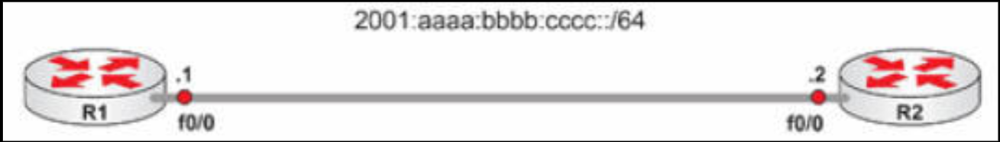

# 第 3 天实验

## IPv6 Ping 实验

### 拓扑结构



### 实验目的

学习如何配置 IPv6 地址，以及跨接口的 `ping`。

### 实验步骤


1. 在两侧同时启用 IPv6 路由。下面是如何 R1 上启用；

    ```console
    R1(config)#ipv6 unicast-routing
    ```

2. 将以下 IPv6 地址添加到 R1 的 `FO/0`。对于 R2 要添加 `:2` 的地址。确保不关闭这两个接口；

    ```console
    R1(config)#int f0/0
    R1(config-if)#ipv6 address 2001:aaaa:bbbb:cccc::1/64
    R1(config-if)#no shut
    ```

3. 从 R1 `ping` R2，或相反；

    ```console
    R2#ping 2001:aaaa:bbbb:cccc::1
    Type escape sequence to abort.
    Sending 5, 100-byte ICMP Echos to 2001:AAAA:BBBB:CCCC::1, timeout is 2 seconds:
    !!!!!
    Success rate is 100 percent (5/5), round-trip min/avg/max = 0/0/0 ms
    ```

4. 请尝试执行以下命令，并注意各种输出。要注意 MAC 地址被怎样用于创建链路本地地址。`show ipv6 interface brief` 命令将揭示 MAC 地址。

    ```console
    R1#show ipv6 interface brief
    R1#show ipv6 interface f0/0
    R1#show ip interface brief
    ```


## IPv6 概念实验


请在一对直连的 Cisco 路由器上，测试这一教学模组中，详细介绍的那些 IPv6 概念和命令：

- 在两台路由器上同时开启 IPv6 的全球单播路由；
+ 在每个连接的接口上，手动配置一个 IPv6 地址。例如：
    - R1 上 `2001:100::1/64`
    - R2 上 `2001:100::2/64`
- 使用 `show ipv6 interface` 和 `show ipv6 interface prefix` 两个命令，验证配置；
- 测试直接 `ping` 的连通性；
- 使用 IPv6 的无状态自动配置（`ipv6 address autoconfig default`），重复该测试；
- 使用 EUI-64 的地址重复该测试（IPv6 地址 `2001::/64 EUI-64`）；
- 将某个接口的链接本地地址，硬编码为：IPv6 的链路本地地址 `fe80:1234:abcd:1::3`；
- 检查 IPv6 路由表。

## 十六进制转换及子网划分练习

**Hex Conversion and Subnetting Practice**

请把今天剩下的时间用于练习这些重要的题目上。

- 将十进制转换成十六进制（随机数字）
- 将十六进制转换成十进制（随机数字）
- IPv6子网划分（随机网络和场景）


## IPv4 - IPv6 的基础整合实验

在两台直连的思科路由器上，测试这一教学模组中详细讲到的那些 IPv6 概念与命令：

- 在两台设备上启用 IPv6 的单播路由，并在两个直连接口上同时配置 IPv4 和 IPv6 的地址
- 使用 `show interface` 和 `show ipv6 interface` 两条命令，验证配置；
- 配置一些 IPv4 与 IPv6 的主机，作为远端接口地址；
- 在设备上验证主机配置（`show` 命令）;
- 通过使用主机名，在设备间 `ping`；
- 在两台设备上分别配置 IPv4 与 IPv6 的 DNS 服务器；

## IPv4 - IPv6 的隧道实验

在家庭网络环境中，重复在 [IPv4 上隧道传输 IPv6](tunnelling.md) 小节中的场景（包括所有的机制）。要按照该小节中所呈现的事件顺序。


