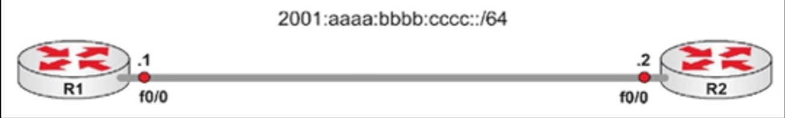

# 第 4 天 复习

## 第 4 天任务

- 复习前 3 天的课文；
- 重复前 3 天的实验；
- 完成今天的挑战实验（后文）；
- 阅读 CCNA 补习指南；
- 参加 [Free CCNA Training Bonus – Cisco CCNA in 60 Days v4](https://www.in60days.com/free/ccnain60days/) 处今天的考试；
- 在 subnetting.org 上花 10 分钟回答问题。

今天是这个 60 天课程中，咱们将遇到的众多复习日的第一个。这是个重读理论、再次动手实验及巩固所学知识的机会。不要给自己施加压力，让自己在第一、第二或第三遍就掌握这些主题。我们将通过复习日、补习指南、实验、考试和自由选择复习日等形式，多次复习这所有主题。

在头几个复习日中，我（作者）将给咱们布置一些任务，但之后我将把这项任务交给你，因为只有你自己知道自己的薄弱环节。咱们可随时更改或调整设定的任务。当咱们已是子网划分高手，那就把这个任务换成某项诸如记住管理距离（举个例子）的薄弱环节。

### 挑战 1

以下这些地址的压缩地址分别为何？

- `0000:0000:0000:0000:01a2b:000c:f123:456`
- `FEC0:0004:AB10:00CD:1234:0000:0000:6789`
- `3FFF:0c00:0000:1010:1A2B:0000:0000:DE0F`
- `2001:0000:0000:1234:0000:5678:af23:00d5`

### 挑战 2

请写出从 `192.168.16.0/24` 到 `192.168.31.0/24` 的那些子网。现在写出当咱们拥有全部这些网络时，咱们将通告出去的超网地址。

### 挑战 3

请完成这个简短的 IP 分址实验。我们不会提供挑战实验的答案，因为答案在咱们已经完成实验的早先版本中。

**说明**

请选择咱们想要的任意接口（以太网或串行接口），不过咱们需要 DCE 端上的一个时钟速率。请确保咱们有着设备的正确类型电缆。

1. 接口 IP 地址到两个接口；
2. 应用适当的子网掩码；
3. 当咱们使用的是串行连接时，要为 DCE 端添加时钟速率；
4. 在有必要时，要以 `no shut` 命令打开接口；
5. 自路由器 A `ping` 向路由器 B。

### 挑战 1 -- 答案

| 完全的 IPv6 地址表示 | 压缩的 IPv6 地址表示 |
| :-- | :-- |
| `0000:0000:0000:0000:01a2b:000c:f123:456`| `::1a2b:c:f123:456` |
| `FEC0:0004:AB10:00CD:1234:0000:0000:6789` | `FEC0:4:AB10:CD:1234::6789` |
| `3FFF:0c00:0000:1010:1A2B:0000:0000:DE0F` | `3FFF:c00:0:1010:1A2B::DE0F` |
| `2001:0000:0000:1234:0000:5678:af23:00d5` | `2001::1234:0:5678:af23:d5` |

### 挑战 2 -- 答案

要以二进制形式写出这些子网。咱们将发现，对于其中 20 处，所有二进制位匹配，因此咱们会通告一个 `/20` 的掩码。

`192.168.16.0/20`

