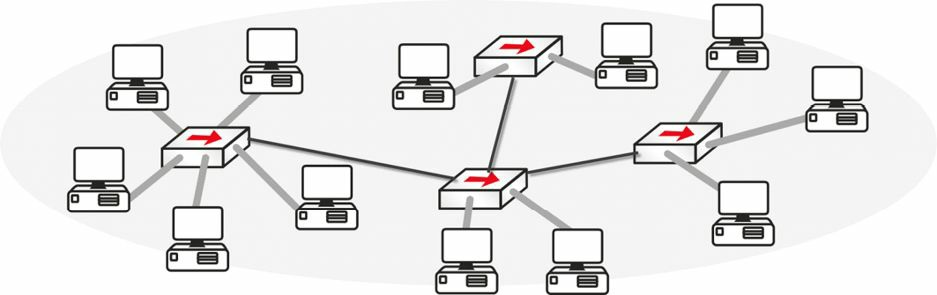
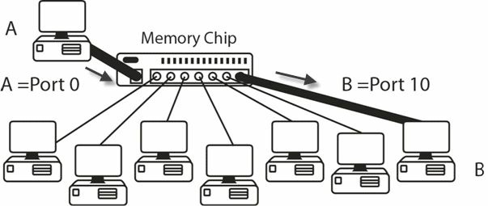
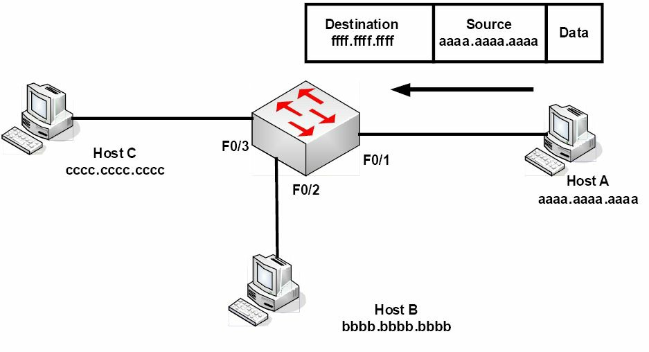

# 交换的一些概念

## 交换机的需求

在交换机发明前，网络上的每台设备都会收到来自所有其他的数据。每次一个数据帧于线路上检测到时，PC 都必须停下片刻，检查数据帧头部看看其是否是那个预期接收者。设想每分钟都有数百个数据帧在网络上发出。每台设备都会很快停机。下图 6.8 显示了网络上的所有设备；请注意，他们必须共用同一带宽，因为他们是由只会转发数据帧的集线器连接的。




**图 6.8** -- **每台设备都会监听其他所有设备**

**集线器的问题**

我（作者）之前曾提到，集线器只是一些多端口的中继器（见图 6.9）。他们接收传入的信号，将其清理干净，然后将其从每个连接导线的端口发出。集线器还会创建出一个巨大的冲突域。


**图 6.9** -- **集线器会将数据帧从每个端口发出**

集线器属于傻瓜设备。他们无法存储 MAC 地址，因此每次设备 A 发送一个数据帧到设备 B，都会从每个端口重复发送。另一方面，交换机包含一个称为专用集成电路 (ASIC) 的存储芯片，该芯片会构建起一个列出了哪个设备插在哪个端口的数据表（见图 6.10）。这个数据表保存在内容可寻址存储器 (CAM) 中。




**图 6.10** -- **交换机会构建一张 MAC 地址数据表**

在首次引导时，交换机并无任何存储于其 CAM 数据表（Cisco 考试也将这个数据表称为 MAC 地址数据表）中的地址。一旦数据帧开始传递，这个数据表就会建立起来。而若在指定时间内没有数据帧通过某一端口，那么该条目就会老化。在以下输出中，就尚未有任何数据帧经由该交换机发送。


```console
Switch#show mac-address-table
        Mac Address Table
-------------------------------------------
Vlan    Mac Address     Type        Ports
----    -----------     --------    -----
Switch#
```

数据表中没有条目，不过当咱们从一个路由器 `ping` 向另一路由器（二者都连接到了该交换机）时，那么数据表条目即被添加。

```console
Router#ping 192.168.1.2
Type escape sequence to abort.
Sending 5, 100-byte ICMP Echos to 192.168.1.2, timeout is 2 seconds:
.!!!!
Success rate is 80 percent (4/5), round-trip min/avg/max = 62/62/63 ms
Switch#show mac-address-table
        Mac Address Table
-------------------------------------------
Vlan    Mac Address     Type        Ports
----    -----------     --------    -----
1       0001.c74a.0a01  DYNAMIC     Fa0/1
1       0060.5c55.da01  DYNAMIC     Fa0/2
```

这个条目意味着，任何以连接到交换机 `FastEthernet` 端口 `0/1` 或 `0/2` 的 MAC 地址为目的地的数据帧，都将直接从相关端口发送出去。任何其他数据帧都意味着该交换机将必须执行一次性广播（帧泛洪），查看目的设备是否已连接。咱们可从上面五次 `ping` 中的第一个句点看出这点。在等待交换机广播并收到目标路由器响应过程中，第一个 `ping` 超时（80% 的成功率）。

帧泛洪在下图 6.11 中演示了。

> *知识点*：
>
> - a one-off broadcast(frame flooding)



**图 6.11** -- **广播数据帧将在全部接口上发出**

`show mac-address-table` 命令是条非常重要的命令，因此出于考试和实际应用目的，请务必记住这一命令。咱们应已知道 MAC 地址具体为何，但作为一次简单复习 -- MAC 地址是分配给所有设备，以允许通信于数据链路层进行。咱们将会看到，他们是由以太网卡、路由器上的以太网接口及无线设备等厂商分配的。以下是分配给我（作者）笔记本电脑以太网卡的 MAC 地址。


各家厂商都被分配了一个称为 “组织唯一标识符”（OUI）的地址，其构成 MAC 地址的前半部分。然后，他们便可根据他们自己的编号系统，自由创建地址的后半部分。MAC 地址为 48 个二进制位，因此我（作者）的上述地址由以下组成：

| OUI | 厂商的编号 |
| :-- | :-- |
| 24 个二进制位 | 24 个二进制位 |
| 6 个十六进制数 | 6 个十六进制数 |
| `00 1E EC` | `54 85 17` |

## 以太网数据帧

以太网有四种不同的数据帧类型：

- Ethernet 802.3
- Ethernet II
- Ethernet 802.2 SAP
- Ethernet 802.2 SNAP


前两种以太网标准涉及网卡之间通信所用到的组帧。他们无法识别上层协议，而这正是 802.2 数据帧发挥作用之处。咱们只需关注下面所示的 802.3 数据帧。


**图 6.12** -- **以太网的 802.3 数据帧**

IEEE 802.3 的以太网数据帧，由已被 IEEE 委员会确定的一些特定字段组成：

- 前导码（前同步信号，preamble）-- 同步和提醒网卡接收传入数据；
- 帧开始定界符 (Start-of-frame delimiter, SFD) -- 表示帧的开始
- 目的地址 -- 目的地的 MAC 地址（可以是单播、广播或组播）
- 源地址 -- 发送主机的 MAC 地址
- 长度 -- 定义了该数据帧中 `Data` 字段的长度
- 数据 -- 数据帧中的有效载荷（这即为正被传输的数据）
- 帧校验序列 (Frame-check sequence, FCS) -- 提供了数据帧中全部数据的循环冗余校验 (CRC)

