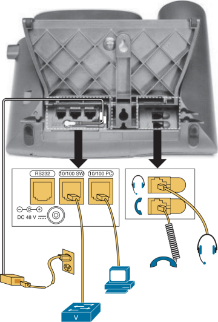
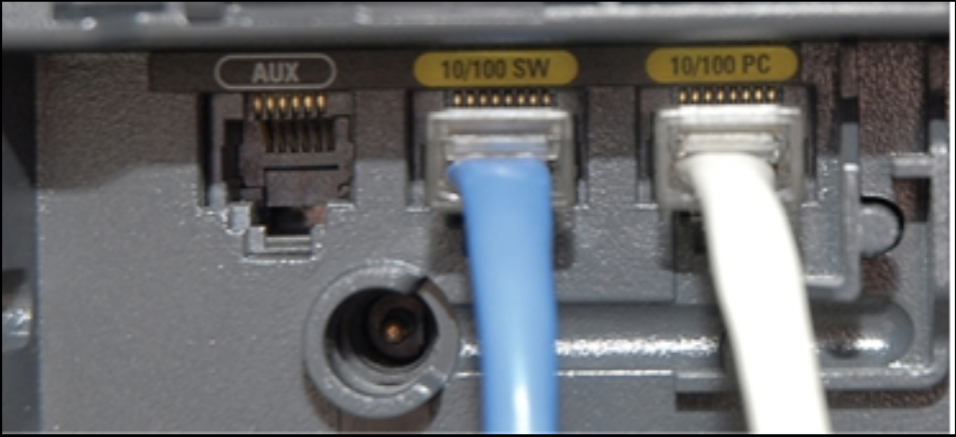
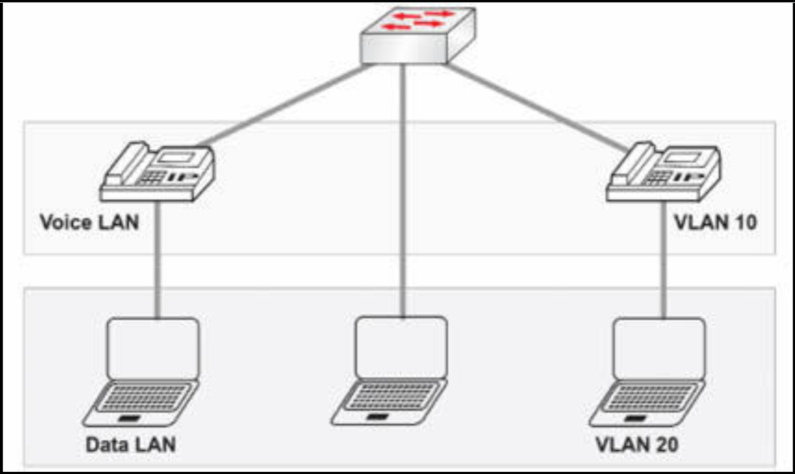

# 数据与语音接入端口

在 IP 语音出现前，想要拥有自己内部电话网络的大型机构，都会雇用一个负责将电话布线接入专用交换机（PBX）的语音团队。所谓 PBX，是一个由端口及软件组成的大匣子，每个端口都会分配一个分机号码，通过该号码可以拨打电话。一组电缆用于电话，另一组用于网络。

当然，这种方案既昂贵又繁琐，因此有人建议将现有的网络布线基础设施，用于语音通信，于是网络电话便应运而生。


所谓 IP 电话，是指一种使用 IP 数据包，发送及接收语音流量的特殊类型电话。话机会连入交换机，就像笔记本电脑和台式机一样。然后，话机会像大楼中的全部其他联网设备一样，使用同一网络通信。他们不再需要与 PBX 通信以控制呼叫；而是与位于某台服务器上的应用通信。若咱们对这方面感兴趣，那么可在 CCNA 协作考试中，了解更多有关语音和视频网络的知识。

到目前为止，这一切听起来都很理想，直到咱们意识到既有网络不可能支持咱们有的话机数量，因为咱们马上就需要咱们交换机上双倍数量端口（当然，咱们还必须安装双倍数量的网线）。思科很有远见，开始在每部 IP 话机中内置小型交换机。如下图所示，思科 IP 话机有个内置的 LAN 交换机。通常，一个端口会连接到本地交换机提供网络连通性，另一端口则会连接到本地个人电脑。

下图 6.21 显示了一部带有一些典型连接的 IP 话机。该设备需要电源和耳机端口，同时还有两个 IP 端口，一个用于话机连接网络交换机，另一个用于连接台式电脑。




**图 6.21** -- **与 IP 电话的连接**（图片 © Cisco Press）

下图 6.22 显示了物理连接到一部 IP 电话的网线。




**图 6.22** -- **插在 IP 话机上的网线**（图片 © `http://www.scsb.org/voip`）

这意味着 IP 话机充当了一台迷你交换机的角色，而为 PC 提供网络访问。现在就有了个问题，由于 IP 话机通常运行在一个与数据设备分开的单独 VLAN 中（若咱们遵循 Cisco 的最佳实践）。

正如咱们在下图 6.23 所看到的，语音 `VLAN10` 中有两部电话，同时数据 `VLAN20` 中有三台笔记本电脑。交换端口具备在同一端口下，向两个 VLAN 发送流量的能力。话机也具备将数据 VLAN 上的流量，转发给所连接个人电脑的能力。这种一层和二层的设计，就实现了在无需大量购买额外交换端口下，IP 电话的部署。



**图 6.23** -- **数据和语音 VLAN**

## 数据和语音 VLAN 配置


一旦咱们了解了接入端口所能实现的全部功能，那么将某个交换机端口，配置为支持 IP 电话就没有咱们想象的那么复杂了。例如，即使连接到某个话机的端口以接入端口运行，语音数据帧也会以某个 802.1Q 的头部打上标签，这样交换机和电话将都会明白，哪些是语音流量，哪些是数据流量。


在接下来的示例中，我们以默认配置编程了交换机端口 `FO/6`，从而其将支持我们会添加的新数据及语音 VLAN。咱们可使用 Packet Tracer 下的 IP 电话，拷贝下面的配置。只需通过将电源拖到 IP 话机的电源插座，确保咱们添加了电源；否则，接口将都不会起来。


```console
SW1#configure terminal
Enter configuration commands, one per line. End with CTRL/Z.
SW1(config)#vlan10
SW1(config-vlan)#vlan20
SW1(config-vlan)#interface FastEthernet0/6
SW1(config-if)#switchport mode access
SW1(config-if)#switchport access vlan20
SW1(config-if)#switchport voice vlan10
SW1(config-if)#^Z
```


在我们编程了该交换机后，我们验证了其已使用就绪。我们使用的第一条命令，是 `show interfaces switchport`。该命令提供了有关该接口当前运行模式的详细（二层）信息。


```console
SW1#show interfaces FastEthernet0/6 switchport
Name: Fa0/6
Switchport: Enabled
Administrative Mode: static access
Operational Mode: static access
Administrative Trunking Encapsulation: dot1q
Operational Trunking Encapsulation: native
Negotiation of Trunking: Off
Access Mode VLAN: 20 (VLAN020)
Trunking Native Mode VLAN: 1 (default)
Administrative Native VLAN tagging: enabled
Voice VLAN: 10 (VLAN010)

[Output Truncated]
```


交换机必须运行 CDP，才能将连接设备识别为 IP 话机。

上面的输出（希望是）不言自明，不过咱们可能对该接口的运行模式有疑问。正如咱们所看到的，尽管他支持多个 VLAN，且 802.1Q 的中继是允许的，但他是静态接入的。若咱们仍怀疑思科不会将这些端口视为中继端口，那么只要咱们执行 `show interfaces trunk` 这条通用命令，那些电话端口就不会出现在列表中。也就是说，在排除故障时，咱们可能需要深入研究端口的多 VLAN 能力。当咱们以指定接口执行 `show interfaces [interface] trunk` 命令时，咱们将看到一些额外信息。


```console
SW1#show interfaces trunk

SW1#show interfaces F0/6 trunk
Port        Mode        Encapsulation   Status        Native vlan
Fa0/6       off         802.1q          not-trunking  1
Port        Vlans allowed on trunk
Fa0/6       10, 20
Port        Vlans allowed and active in management domain
Fa0/6       10, 20
Port        Vlans in spanning tree forwarding state and not pruned
Fa0/6       10, 20
```


请参加 [Free CCNA Training Bonus – Cisco CCNA in 60 Days v4](https://www.in60days.com/free/ccnain60days/) 处第 6 天的考试。


