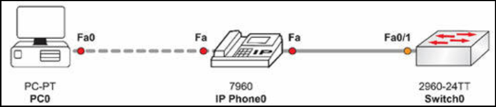
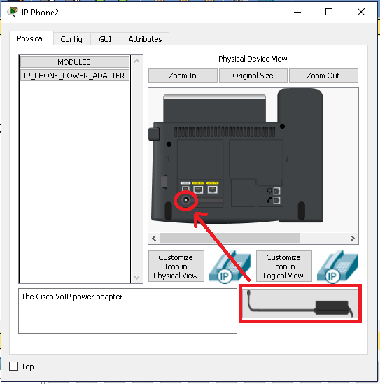
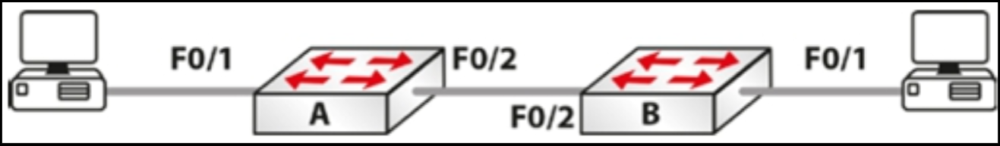

# 第 6 天实验

## 交换机概念实验


请登录一台思科交换机，并输入这一教学模组中讲解的命令。这应包括：

- 在不同交换机端口上配置不同的端口速率/自动协商；
- 分别使用 `show run` 和 `show interface` 命令，验证这些端口参数；
- 执行 `show version` 命令查看硬件详细信息与 IOS 版本；
- 检查交换机 MAC 地址数据表；
- 配置 VTY 线路的口令；
- 定义数个 VLAN 并为其分配名字；
- 为某个配置为 `switchport access` 的端口分配一个 VLAN；
- 将某个端口配置为中继（802.1Q）端口，并为该中继端口分配 VLAN；
- 使用 `show vlan` 命令验证 VLAN 配置；
- 分别使用 `show interface switchport` 命令和 `show interface trunk` 命令，验证接口的中继及 VLAN 配置；
- 查看然后删除 `vlan.dat` 文件。


## 语音 VLAN 实验

### 拓扑结构



### 实验目的

掌握如何在思科交换机上配置语音 VLAN。

除非咱们手头有一部 Cisco IP 话机，否则咱们将对本实验使用 Packet Tracer。要确保咱们在 PC 和 IP 话机之间使用一条交叉线，在话机和交换机之间使用直通线。咱们还将需要把电源线，物理拖放到话机的电源端口。




CDP 需要运行于该交换机上，而默认情况下其已被启用。

### 实验步骤

1. 在交换机上创建用于数据的 `VLAN 10` 和用于语音流量的 `VLAN11`；

    ```console
    Switch#conf t'
    Enter configuration commands, one per line.  End with CNTL/Z.
    Switch(config)#vlan 10
    Switch(config-vlan)#name data
    Switch(config-vlan)#vlan 11
    Switch(config-vlan)#name voice
    Switch(config-vlan)#end
    Switch#
    %SYS-5-CONFIG_I: Configured from console by console
    show vlan brief

    VLAN Name                Status    Ports
    ---- ----------------- --------- -------------------------------
    1    default             active    Fa0/1, Fa0/2, Fa0/3, Fa0/4
                                       Fa0/5, Fa0/6, Fa0/7, Fa0/8
                                       Fa0/9, Fa0/10, Fa0/11, Fa0/12
                                       Fa0/13, Fa0/14, Fa0/15, Fa0/16
                                       Fa0/17, Fa0/18, Fa0/19, Fa0/20
                                       Fa0/21, Fa0/22, Fa0/23, Fa0/24
                                       Gig0/1, Gig0/2

    10   data                             active
    11   voice                            active   
    1002 fddi-default                     active   
    1003 token-ring-default               active   
    1004 fddinet-default                  active   
    1005 trnet-default                    active
    ```

2. 将交换机上的接口设置为静态的接入接口；

    ```console
    Switch(config)#int f0/1
    Switch(config-if)#switchport mode access
    ```

3. 将该接口配置为 `VLAN 10` 和 `11` 的接口；

    ```console
    Switch(config-if)#switchport access vlan 10
    Switch(config-if)#switchport voice vlan 11
    ```

4. 检查交换机上的二层设置；

    ```console
    Switch#show int f0/1 switchport
    Name: Fa0/1
    Switchport: Enabled
    Administrative Mode: static access
    Operational Mode: static access
    Administrative Trunking Encapsulation: dot1q
    Operational Trunking Encapsulation: native
    Negotiation of Trunking: Off
    Access Mode VLAN: 10 (data)
    Trunking Native Mode VLAN: 1 (default)
    Voice VLAN: 11
    ```

5. 最后一步为可选步骤。检查该交换机接口的 CDP 条目。我们不会测试实际的话机连接。


    ```console
    Switch#show cdp neighbors
    Capability Codes: R - Router, T - Trans Bridge, B - Source Route Bridge
                      S - Switch, H - Host, I - IGMP, r - Repeater, P - Phone
    Device ID   Local Intrfce   Holdtme   Capability   Platform    Port ID
    IP Phone    Fas 0/1         147       H P          7960

    Switch#show cdp nei detail

    Device ID: IP Phone
    Entry address(es):
    Platform: cisco 7960, Capabilities: Host Phone
    Interface: FastEthernet0/1, Port ID (outgoing port): Switch
    Holdtime: 143

    Version :
    P00303020214
    advertisement version: 2
    Duplex: full
    ```

## VLAN 与中继实验


### 拓扑结构




### 实验目的

了解如何配置 VLAN 与中继链路。明天我们会更详细地介绍中继。


### 实验步骤

1. 咱们将需要添加一些 IP 地址到各个 PC。只要他们在同一子网上，咱们便可自由选择！
2. 在交换机 A 上设置主机名，创建 `VLAN 2`，并将咱们 PC 连接的接口放入 `VLAN 2`。若咱们愿意，咱们还可给这个 VLAN 一个名字；

    ```console
    Switch>en
    Switch#conf t Enter configuration commands, one per line.  End with CNTL/Z.
    Switch(config)#hostname SwitchA
    SwitchA(config)#vlan 2
    SwitchA(config-vlan)#name 60days
    SwitchA(config-vlan)#interface FastEthernet0/1
    SwitchA(config-if)#switchport mode access
    SwitchA(config-if)#switchport access vlan 2
    SwitchA(config-if)#^Z

    SwitchA#show vlan brief

    VLAN Name               Status    Ports
    ---- --------- -------------------------------
    1    default            active    Fa0/2, Fa0/3, Fa0/4, Fa0/5,
                                      Fa0/6, Fa0/7, Fa0/8, Fa0/9,
                                      Fa0/10, Fa0/11, Fa0/12, Fa0/13,
                                      Fa0/14, Fa0/15, Fa0/16, Fa0/17,
                                      Fa0/18, Fa0/19, Fa0/20, Fa0/21,
                                      Fa0/22, Fa0/23, Fa0/24
    2    60days             active    Fa0/1
    1002 fddi-default       active
    1003 token-ring-default active   
    1004 fddinet-default    active   
    1005 trnet-default      active   
    SwitchA#
    ```

3. 将咱们的中继链路，设置为中继模式；

    ```console
    SwitchA#conf t
    Enter configuration commands, one per line.  End with CNTL/Z.
    SwitchA(config)#int FastEthernet0/2
    SwitchA(config-if)#switchport mode trunk

    SwitchA#show interface trunk
    Port        Mode         Encapsulation  Status        Native vlan
    Fa0/2       on           802.1q         trunking      1

    Port        Vlans allowed on trunk
    Fa0/2       1-1005
    ```

4. 若咱们愿意，那么在该中继链路上只放行 `VLAN 2`；

    ```console
    SwitchA(config)#int FastEthernet0/2
    SwitchA(config-if)#switchport trunk allowed vlan 2
    SwitchA(config-if)#^Z
    SwitchA#
    %SYS-5-CONFIG_I: Configured from console by console

    SwitchA#show int trunk
    Port        Mode         Encapsulation  Status        Native vlan
    Fa0/2       on           802.1q         trunking      1
    Port        Vlans allowed on trunk
    Fa0/2       2
    ```

5. 此时，当咱们从一台 PC `ping` 另一 PC 时，其应会失败。这是因为一侧在 `VLAN 1` 中，而另一侧在 `VLAN 2` 中；


    ```console
    PC>ping 192.168.1.1

    Pinging 192.168.1.1 with 32 bytes of data:

    Request timed out.

    Ping statistics for 192.168.1.1:
        Packets: Sent = 2, Received = 0, Lost = 2 (100% loss)
    ```

6. 现在在交换机 B 上配置那些同样命令。在创建 VLAN 时，将 PC 的端口放入 `VLAN 2`，并将该接口设置为 `access`，将中继链路设置为 `trunk`；

7. 现在你应能够经由中继链路，从 PC `ping` 到 PC 了。

    ```console
    PC>ping 192.168.1.1
    Pinging 192.168.1.1 with 32 bytes of data:

    Reply from 192.168.1.1: bytes=32 time=188ms TTL=128
    Reply from 192.168.1.1: bytes=32 time=78ms TTL=128
    Reply from 192.168.1.1: bytes=32 time=94ms TTL=128
    Reply from 192.168.1.1: bytes=32 time=79ms TTL=128

    Ping statistics for 192.168.1.1:
        Packets: Sent = 4, Received = 4, Lost = 0 (0% loss),
    Approximate round trip times in milli-seconds:
        Minimum = 78ms, Maximum = 188ms, Average = 109ms
    ```

