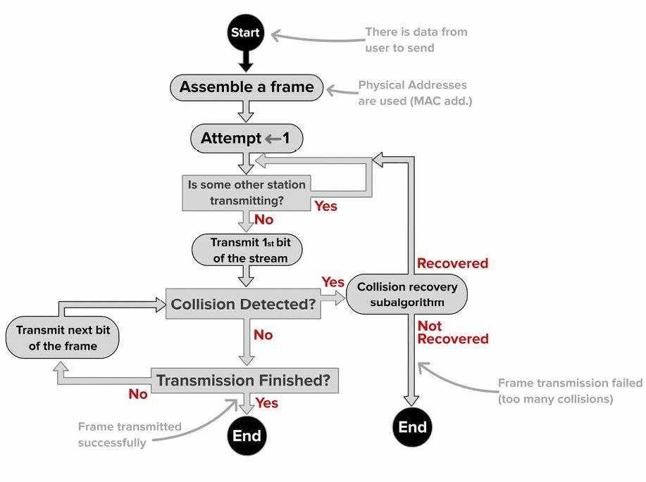
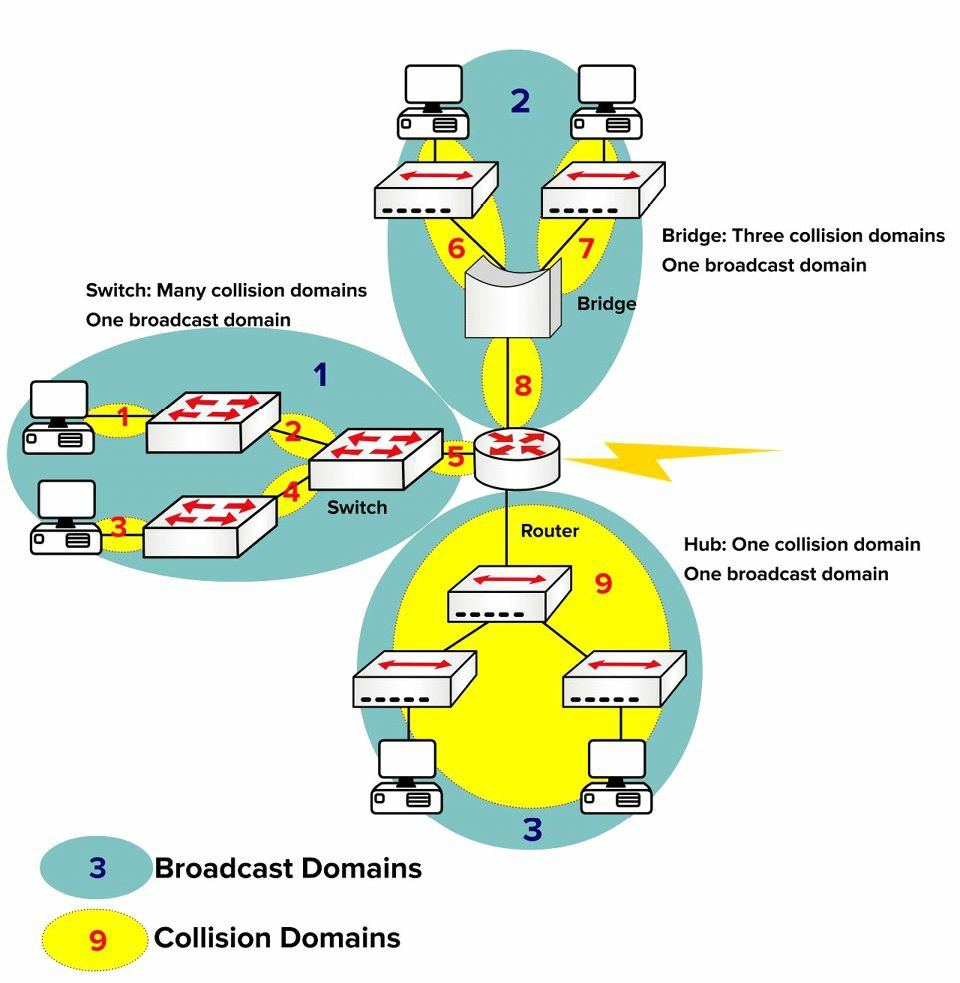

# 交换基础

## 载波侦听，带有冲突检测的多路复用

CSMA/CD 可细分如下。所谓载波侦测，是指线路被监听着，以确定线路上是否有信号通过。当线路在使用中时，数据帧就无法被传送。而多路访问，简单地说就是不止一个设备在使用网段上的线缆。最后，冲突检测指的是协议正运行某种算法，确定线路上的数据帧是否因遇到另一个数据帧而受损。在下图 6.1 中，咱们可以看到交换机端口正监听线路。


**图 6.1** -- **正监听线路的端口**

当线路上有冲突时，检测的设备就会一个通知其他网络设备发生了冲突的阻塞信号，从而其他就不应尝试发送数据到该线路。然后，算法会运行并生成一个等待重新传输的随机时间间隔。在发送某个数据帧前，其仍必须等待线路畅通。图 6.2 演示这个过程。



**图 6.2** -- **CSMA/CD 过程**

> **FARAI 有言**：“请注意，使用带有全双工连接交换机的现代以太网络，不再使用 CSMA/CD。其仍受支持，但仅是为了向后兼容性。”

## 冲突域和广播域

网络集线器的主要缺点之一，是当线路上存在冲突时，损坏的数据帧会被发送到所有连接设备。现代交换机的优点之一，是交换机上的每个端口被视为一个冲突域。在一次冲突事件（全双工下不可能发生）下，受损数据帧就不会通过接口。图 6.3 展示了一台已添加到某个用到两个集线器的小型网络。这台交换机会将该网络，分为两个冲突域。


**图 6.3** -- **一台交换机创建出两个冲突域**

思科经常会在考试中，通过问咱们交换机是否减少了多少个冲突域，尝试抓住咱们的把柄。情急之下，咱们可能会答出他们缺失减少了那个多个冲突域，但实际情况却恰恰相反，这是好事。交换机会增加冲突域数量。另外值得注意的是，由于技术限制，集线器只能工作于半双工。在下图 6.4 中，有四台 PC 连接到一台交换机，从而创建出四个冲突域。每台 PC 都能充分利用以全双工方式运行的 100Mbps 带宽。


**图 6.4** -- **四个冲突域**

交换机（这里我们说的是二层交换机）不会分离广播域，路由器才会。当交换机接收到某个带有广播目的地址的数据帧时，那么他就必须将其转发出除该数据帧被接收端口外的所有端口。要分离广播域，路由器是必要的。图 6.5 展示个用到交换机/网桥，及一台路由器的小型网络，以表示冲突域如何被分离。




**图 6.5** -- **广播及冲突域**

## 自动协商

咱们已经看到，当咱们以不同速度和双工设置连接设备时，问题便会涌现。由于预算限制，咱们通常会升级网络的一个部分，而在另一部分有着老旧设备。这就会导致双工与速率不匹配，从而导致报错及丢弃的数据帧。稍后我们将详细介绍交换机故障排除。

IEEE 以自动协商方式，提供了这一问题的解决方案，其允许设备在传输流量前，就速率及双工设置达成一致。速率被设置为较慢设备的速度。在下面的输出中，速率可被手动设置为 10Mbps 或 100Mbps，或被设置为自动协商。


```console
Switch(config)#int f1/0/1
Switch(config-if)#speed ?
  10 Force 10 Mbps operation
  100 Force 100 Mbps operation
  auto Enable AUTO speed configuration
```

咱们可以命令 `show interface x` 查看这些设置。

```console
Switch#show int f1/0/1
FastEthernet1/0/1 is down, line protocol is down (notconnect)
  Hardware is FastEthernet, address is 001e.13da.c003 (bia 001e.13da.c003)
  MTU 1600 bytes, BW 10000 Kbit, DLY 1000 usec,
     reliability 255/255, txload 1/255, rxload 1/255
  Encapsulation ARPA, Loopback not set
  Keepalive set (10 sec)
  Auto-duplex, Auto-speed, media type is 10/100BaseTX
```

但请注意，自动协商可能会造成问题。这就是为什么许多生产网络，坚持将端口直接配置为 `100/full` 或 `GigabitEthernet` 的 `1000/full`。援引自 Cisco：

> 自动协商问题可能由不合格实现、硬件能力或软件缺陷等造成。当网卡或供应商交换机不完全符合 IEEE 规范 802.3u 时，问题就会造成。硬件的不兼容及其他问题，也会由一些特定于供应商的高级特性造成，诸如自动极性或线缆完整性等，这些特性并未在 IEEE 802.3u 的 10/100 Mbps 自动协商描述 (Cisco.com)。
>
> -- [Troubleshoot Catalyst Switches to NIC Compatibility Issues](https://www.cisco.com/c/en/us/support/docs/switches/catalyst-6500-series-switches/17053-46.html)


> *知识点*：
>
> - non-confirming implementation
>
> - hardware incapabilities
>
> - software defects
>
> - network interface card, NIC
>
> - IEEE specification 802.3u
>
> - vendor-specific advanced features
>
> - auto-polarity
>
> - cable integrity

## 交换数据帧

交换机的存在，就是要交换数据帧（即把某一数据帧从传入接口传输到正确传出接口）。广播数据帧和带有未知目的地（不在 MAC 数据表中）的数据帧，会被交换出除他们被接收接口外的全部接口（称为数据帧泛洪）。为了实现这一功能，交换机会执行三种操作：

- 根据目的地 MAC 地址，转发（交换）或过滤（丢弃）数据帧
- 学习传入数据帧中的 MAC 地址
- 使用 STP 防止二层环路（STP 将在稍后介绍）

在下图 6.6 中，当某一数据帧源自 `Host A`（`F0/1`）以 `Host C` 为目的地时，交换机会过滤（阻止）其离开接口 `FO/2` ，并会将其正确转发出 `F0/3`：


**图 6.6** -- **数据帧过滤**

当目的地址不在 MAC 地址表中时，那么交换机就会将该数据帧，泛洪出除该数据帧被接收接口外的全部接口。交换机还将存储连接到另一交换机设备的 MAC 地址；不过接口名字将保持不变，因此多个 MAC 地址将被列出于同一出口接口下。这是找到在某个咱们不熟悉网络上设备的有用方法。下图 6.7 演示了这一概念。


**图 6.7** -- **同一接口上的多个 MAC 地址**


传输传递中的任何延迟，都称为延时。Cisco 交换机提供了三种交换流量的方式，具体取决于在数据帧传递前，咱们希望其如何被彻底检查程度。执行的检查越多，咱们将引入到交换机的延时就越大。可供选择的三种交换模式为：

- 直通
- 存储转发（现代交换机的默认模式）
- 无分段/分片

### 直通

直通式交换是最快的交换方法，意味着其有最低的延时。传入的数据帧会被读取到目的 MAC 地址。一旦其到达目的 MAC 地址，交换机就会查看其 CAM 表，找到要将数据帧转发出的正确端口，将其发送出去。由于没有错误检查，因此这种方法给到咱们最低的延迟。但代价是，交换机将转发任何包含错误的帧。

交换模式的过程，用个比喻来描述最好不过。咱们是某家夜店的保镖，被要求确保每个进入夜店的人都有证件照 -- 咱们为被要求要确保照片与人相符，而只是证件上有照片。在这种检查方法下，人们肯定会迅速进入场所。这就是直通式交换的工作原理。

### 存储转发

这里，交换机会读取整个数据帧，并将其拷贝到其缓冲区。一次循环冗余检查 (CRC) 会进行，以检查该数据帧是否有任何错误。当有错误被发现时，该数据帧就会被则丢弃。否则，交换数据表会被检查而该数据帧即被转发。存储转发会确保数据帧至少 64 字节，而又不超过 1518 字节。当数据帧小于 64 字节，或大于 1518 字节时，那么交换机将丢弃该数据帧。

现在再次设想咱们是某家夜总会的保镖，只是这次咱们必须确保照片与人相符，而且咱们必须在每个人进入前，写下他们的名字和地址。这样检查身份证，就会造成大量延误，而这就是存储转发的交换方式工作原理。

在全部三种交换方式中，存储转发的交换有着最高的延迟，并是 2900 系列交换机的默认设置。

### 无分片/分段（修订的直通/无侏儒帧）

由于直通式交换不会检查错误，而存储转发又耗时太长，因此我们需要一种又快又可靠的方法。以夜总会保镖为例，设想咱们被要求确保每个人都有身份证，而且照片与本人相符。在这种方法下，咱们就确保了每个人都是他们声称的那个人，但咱们又不必记下他们的所有信息。在交换中，这是通过通过使用无分片/分段的交换方法实现的，这是一些低端思科交换机的默认配置。

无分片/分段交换，是直通式交换的一种修订变种。数据帧的前 64 个字节会被检查是否有错误，并在没有检测到错误时，其将被传递。这种方法的原理是，任何的错误，都最有可能在数据帧的前 64 个字节中发现。

如上一小节中提到的，以太网数据帧的最小大小为 64 字节；任何小于 64 字节的数据帧，被称为 “侏儒” 帧。由于转发前每个数据帧都必须至少 64 字节，这种交换方式便消除了 “侏儒”，而这正是这种方式也被称为 “无侏儒帧” 交换的原因。


