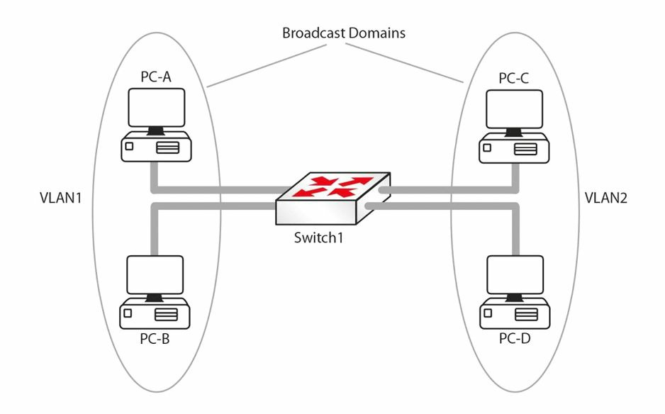
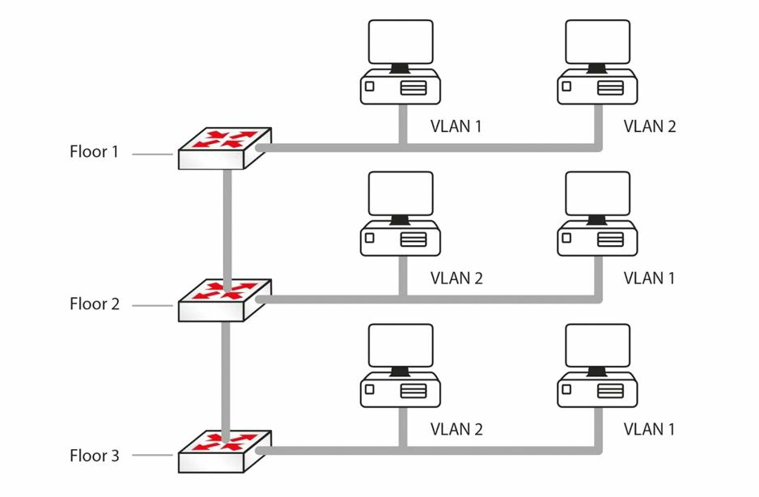
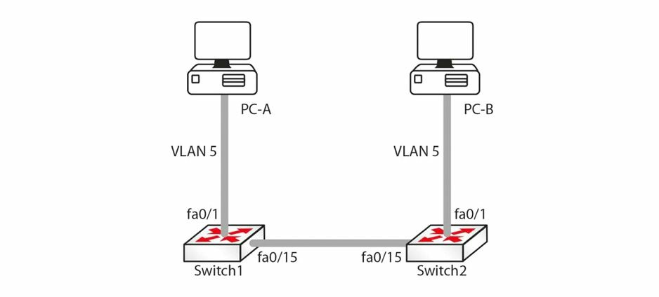

# 虚拟局域网

正如咱们已经看到的，交换机会打破冲突域。更进一步，路由器会打破广播域，这意味着网络会看起来像下图一样。


**图 6.13** -- **路由器分离广播域**

在我们继续前，我们来讨论一下局域网到底为何。局域网本质上是个广播域。在图 6.13 中所示的网络中，当 PC-A 发送一个广播数据包时，其将被 PC-B 接收，但不会被 PC-C 或 PC-D 接收。这是因为其中的路由器，打破了广播域。现在，咱们可使用虚拟局域网 (VLAN) ，将交换机端口置于不同广播域中，如下图所示。



**图 6.14** -- **VLAN 下的广播域**

在图 6.14 中，该二层网络已通过使用 VLAN，被划分为两个广播域。现在，由 PC-A 发送的某个广播数据包，将被 PC-B 接收，而不会被 PC-C 和 PC-D 接收。在没有 VLAN 下，PC-C 和 PC-D 都会收到由 PC-A 发送的广播。以下是 VLAN 的一些优点：
- 将广播限制在较小的设备组内，将是网络更快；
- 由于设备处理更少广播，因此节省了设备资源；
- 通过将某个组（或功能）中的设备，保持于一个单独广播域中，从而增加了安全性。这里所指的组，可以指部门、安全级别等。例如，属于开发或测试实验室的设备，应与生产设备分开；
- 跨越地理位置，以任何规模扩展网络的灵活性。例如，某台 PC 在大楼中的何处并不重要。他会认为自己与配置在同一 VLAN 中的任何其他 PC一样，处于同一网段。在下图 6.15 中，`VLAN 1` 中的所有主机，都可以相互通信，即使他们位于不同楼层。对他们来说，VLAN 是透明或不可见的。



<a name="f-6.15"></a>
**图 6.15** -- **VLAN 移除了局域网的物理边界**

## VLAN 标记

尽管各家厂商使用了各自方法创建 VLAN，但多厂商 VLAN 在互操作性问题方面必须加以谨慎处理。例如，思科就开发了通过添加一个新的 26 字节头部和一个新的 4 字节尾部，封装原始数据帧的 ISL 标准，如下图 6.16 所示。为了解决不兼容问题，IEEE 开发了 [802.1Q](https://en.wikipedia.org/wiki/IEEE_802.1Q)，一种独立于厂商的创建可互操作 VLAN 的方式 。


**图 6.16** -- **ISL 标记方法**

802.1Q 通常被称为数据帧标记，因为他会将一个称为 “标签” 的 32 位头部，插入原始数据帧的源地址字段后，而不修改其他字段。源地址字段后的 2 个字节，包含了一个注册的以太网类型值 `0x8100`，这表示该数据帧包含着一个 802.1Q 的头部。接下来的 3 个比特位，表示 802.1P 的 `User Priority` 字段，而会在服务质量（QoS）技术中，用作 [`Class of Service`（CoS）的比特位](../d33/models.md#cos)。下一子字段是个 1 位的 `Canonical Format Indicator`（规范格式指示符），然后是 VLAN ID（12 位）。在使用 802.1Q 时，这给到我们总共 4096 个 VLAN。

> *知识点*：
>
> - the Source Address field
>
> - a registered Ethernet type value of `0x8100`
>
> - the 802.1P User Priority field
>
> - Quality of Service, QoS
>


**图 6.17** -- **802.1Q 标记方法**

承载多个 VLAN 中数据的端口，被称为中继。他既可使用 ISL 协议，也可使用 802.1Q 协议。802.1Q 世界中的一个特殊概念，便是 “原生 VLAN”。这属于一种其中的数据帧不会被打标签的特殊 VLAN 类型。原生 VLAN 的目的，是允许交换机在某个接口上使用 802.1Q 的中继（单一链路上的多个 VLAN），而当另一设备不支持中继时，那么原生 VLAN 的流量，仍能经由该链路得以发送。当某一交换机接收到某条中继链路上的任何未打标签流量时，他就将认为其目的地为原生 VLAN。Cisco 使用 `VLAN 1` 作为默认的原生 VLAN。

## VLAN 成员关系


将端口与 VLAN 关联有两种常见方式 -- 静态地或动态地。

在静态的 VLAN 分配或配置下，交换机上的端口会被网络管理员配置为在不同 VLAN 下，而相关设备随后就会被连接到该端口。当用户需要搬到大楼的另一部分时，这将需要管理员修改交换机上的配置。默认情况下，所有交换机端口都属于 `VLAN 1`。

而所谓动态的 VLAN 分配，允许设备根据设备 MAC 地址（*译注*：也可运用 `dot1x` 协议而根据设备证书，参见：[交换机 dot1x 认证端口动态指定 VLAN 配置](../22_dot1x_port_dynamic_vlan.md)），加入某个特定 VLAN。这种方式给到管理员，允许用户连接到任何交换机，或在大楼内移动，而不必更改交换机上配置的灵活性。这是通过使用 VLAN 管理策略服务器 (VMPS) <sup>1</sup> 实现的。

> **FARAI 有言**： “端口被分配到 VLAN，而设备则会连接到端口。”

请注意，由于每个 VLAN 都是个不同的广播域，这意味着：

- 默认情况下，一个 VLAN 中的主机无法到达另一 VLAN 中的主机
- 对于 VLAN 间的通信，一个三层设备是必要的（这将在稍后介绍）
- 每个 VLAN 都需要自己的子网，例如，`VLAN 1` -- `192.168.1.0/24`、`VLAN 2` -- `192.168.2.0/24`
- 某个 VLAN 中的所有主机，都应属于同一子网


> *译注*：
>
> <sup>1</sup>：[Wikipedia: VLAN Management Policy Server](https://en.wikipedia.org/wiki/VLAN_Management_Policy_Server)


## VLAN 链路

我们知道，一台交换机有着连接到多个 VLAN 的一些主机。但是，当流量从一台主机前往另一主机时，会发生什么呢？例如，在上面的 [图 6.15](#f-6.15) 中，当 1 楼的 `VLAN 1` 中的主机，试图连接 2 楼 `VLAN 1` 中主机时，2 楼的交换机，将怎样知道该流量属于哪个 VLAN 呢？

我们现在已经知道，交换机会使用一种称为 VLAN 标记，或 “数据帧打标签” 的机制，保持流量在不同 VLAN 上分离。交换机会在帧上添加一个包含 VLAN ID 的头部。在 [图 6.15](#f-6.15) 中，1 楼的交换机将把源自 VLAN 2 的流量打上标签，并将其传递给交换机 2，交换机 2 将看到该标签，就会知道该流量需要保持在该 VLAN 内。此类打上标签的流量，只能在称为中继链路的特殊链路上流动。`VLAN 1` 通常会被指定为原生 VLAN，而原生 VLAN 上的流量不会被打标签。稍后我们将详细介绍 [原生 VLAN](../d07/dtp.md#ieee-8021q-原生-vlan)。

交换机端口（CCNA 考试范围内）可被分为以下几种：

- 接入链路或端口
- 中继链路或端口
- 动态端口（这将很快讨论）


### 接入链路

被定义为接入链路的交换机端口，只能是一个 VLAN 的成员。连接到接入链路的设备，不关心任何其他 VLAN 的存在。当某个数据帧从主机进入某一接入链路时，交换机就将添加一个标签到该数据帧，并在数据帧离开交换机接入链路前往主机时，移除这个标签。接入链路被用于连接主机，但也可用于连接路由器。中继链路将在接下来的小节中介绍。

### 中继

交换机端口通常要么将连接到网络上的某一主机，或连接到另一网络交换机、路由器或服务器。在这种情况下，那么链路就可能需要承载多个 VLAN 中的流量。为了实现这一目的，每个数据帧都需要识别其来自哪个 VLAN。这种识别方法被称为数据帧打标签，除原生 VLAN 外，所有帧数据在通过中继链路前都会被打上标签。数据帧中的标签包含着 VLAN ID。当数据帧到达目的主机所在交换机时，这个标签就会被移除。


**图 6.18** -- **VLAN 打标签**

VLAN 中继用于承载多个 VLAN 中的数据。要区分一个 VLAN 数据帧与另一 VLAN 数据帧，所有通过中继链路发送的数据帧都会被特别标记，以便目的交换机清楚数据帧属于哪个 VLAN。ISL 和 802.1Q 就是两种主要的封装方式，我们前面简要提到的这点。他们可用于确保穿越某已交换机中继链路的那些 VLAN 能被唯一识别。

ISL 是思科专有的；但是，CCNA 考试中测试的型号为 2960 交换机，其只能识别 802.1Q。我们在这里介绍 ISL 是出于完整目的，以及以防万一，咱们必须配置某一较旧交换机型号。

> **FARAI 有言**：“现在所有新的交换机都默认为 802.1Q。ISL 正被弃用。”

802.1Q 与 ISL 有几处不同。第一个显著区别是，802.1Q 支持多达 4096 个 VLAN，而 ISL 则只支持 1000 个 VLAN。另一显著区别，是 802.1Q 中使用的原生 VLAN 概念。默认情况下，在使用 802.1Q 时，所有 VLAN 的所有数据帧都会被打上标签。这一规则的唯一例外，是那些属于原生 VLAN 的数据帧，这些数据帧不会被打标签。

但是，要记住，通过将某个 VLAN 指定为特定中继链路上的原生 VLAN，而指定该 VLAN 的数据帧不被标记是可行的。例如，在使用 802.1Q 时，要阻止对 `VLAN 400` 中的数据帧打标签，咱们就可以将这一 VLAN 配置为某特定中继链路上的原生 VLAN。IEEE 802.1Q 的原生 VLAN 配置，将在稍后详细介绍。

下面总结了 802.1Q 的一些特性：

- 支持多达 4096 个 VLAN
- 使用了一种内部标记机制，修改原始数据帧
- 一种由 IEEE 制定的开放标准协议
- 不会标记原生 VLAN 上的数据帧；但所有其他数据帧都会被标记

下面是某台交换机的简短示例配置。我（作者）已包含 `switchport` 这条命令，其告诉交换机作为一个二层的交换集端口，而非一个三层端口。这条命令要添加到比如 3660 交换机的多层交换机。


```console
Sw(config)#interface FastEthernet 0/1
Sw(config-if)#switchport
Sw(config-if)#switchport mode trunk
Sw(config-if)#switchport trunk encapsulation dot1q
Sw(config-if)#exit
```

当然，在 2960 交换机上，`encapsulation` 这条命令将不被识别，因为只有一种类型（802.1Q）可用。当连接另一台交换机时，咱们将需要把接口设置为中继接口，以允许 VLAN 得以标记。`switchport` 命令也是如此。我（作者）之所以提及这点，因为在现实世界中，咱们很可能必须配置三层交换机，而若我们严格按照 2960 型号，那么咱们就会感到困惑，这是我们不希望的！

交换机上的中继链路，可能处于五种可能模式之一：

- `on` -- 这种模式会强制该端口进入永久中继模式。该端口会成为一个中继端口，即使所连接设备未同意将链路转换为一个中继链路；
- `off` -- 即使所连接设备被设置为 `trunk` 模式，该链路也不用作中继链路；
- `auto` -- 该端口愿意成为中继链路。当另一设备被设置为 `on` 或 `desirable` 模式时，则该链路会成为中继链路。而当双方都被设置为 `auto` 模式时，那么链路将永不会成为中继链路，因为双方都不会尝试转换；
- `desirable` -- 端口主动尝试转换为中继链路。当另一设备设置为 `on`、`auto` 或 `desirable`，则链路将成为中继链路；
- `nonegotiate` - 该模式会阻止端口协商中继连接。端口将根据配置，强制进入 `access` 或 `trunk` 模式。


## 配置 VLAN

现在咱们掌握了 VLAN 与中继链路，我们来配置下图 6.19 中所示的网络。咱们将需要配置交换机，使 `fa0/1` 端口上的主机位于 `VLAN 5` 中，并使 `fa0/15` 端口上的链路为一条中继链路。




**图 6.19** -- **测试网络**


在将端口指派到 VLAN 前，VLAN 本身必须使用 `vlan <vlan#>` 全局配置命令创建出来。这条命令将把咱们带入 VLAN 配置模式，其下一个描述性名字可被提供给 VLAN（若咱们希望）。下面是个示例：

```console
Switch1(config)#vlan 5
Switch1(config-vlan)#name RnD
```

```console
Switch2(config)vlan 5
Switch2(config-vlan)#name RnD
```

要查看交换机上存在哪些 VLAN，就要使用 `show vlan` 命令。输出将类似于下面这个输出：

```console
Switch1#show vlan
VLAN    Name        Status      Ports
----    --------    -------     --------------------------------------------
1       default     active      Fa0/1, Fa0/2, Fa0/3, Fa0/4 Fa0/5, Fa0/6, Fa0/7, Fa0/8 Fa0/9,
                                Fa0/10, Fa0/11, Fa0/12, Fa0/13 Fa0/14, Fa/15, Fa0/16, Fa0/17, Fa0/18
...
[Truncated Output]

...
5       RnD         active
...
[Truncated Output]
```

我们来使用 `switchport access vlan [vlan#]` 这条接口配置命令，将端口 `fa0/1` 指派给 `VLAN 5`。


```console
Switch1(config)#int fa0/1
Switch1(config-if)#switchport access vlan 5
```

```console
Switch2(config)#int fa0/1
Switch2(config-if)#switchport access vlan 5
```

在诸如 3560 交换机的具有三层能力的交换机上，在将端口放入某个 VLAN 前，我们必须以 `switchport mode access` 命令，手动将该端口设置为接入端口。现在我们来看看 `show vlan` 命令的输出。


```console
Switch1#show vlan
VLAN    Name        Status      Ports
----    ----        -----       --------------------------------------------
1       default     active      Fa0/2, Fa0/3, Fa0/4, Fa0/5, Fa0/6, Fa0/7,
                                Fa0/8, Fa0/9, Fa0/10, Fa0/11, Fa0/12, Fa0/13,
                                Fa0/14, Fa/15, Fa0/16, Fa0/17, Fa0/18
...
[Truncated Output]

...
5       RnD         active      Fa0/1
...
[Truncated Output]
```

注意 `fa0/1` 现在已被分配给 `VLAN 5`。咱们来将两台交换机上的接口 `fa0/15`，同时配置为中继链路。这里需要注意的是，（3550 型）交换机端口上的默认模式，是 `desirable`（在 3560 型号上其为 `auto`，因此请查看咱们的平台说明）。动态中继协议（DTP）将使两台交换机上的 `fa0/15`，成为 ISL 的中继链路。我们将在下一课中介绍 DTP，但我（作者）想要在这里简单提一下。这可使用 `show interface trunk` 命令验证：

```console
Switch1#show interface trunk
Port    Mode        Encapsulation   Status      Native vlan
Fa0/15  desirable   n-isl           trunking    1
```

请注意，其中模式为 `desirable`，封装为 ISL（`n` 代表协商的）。

下面的输出显示了如何将中继配置为使用 ISL 的中继：


```console
Switch1(config)#interface fa0/15
Switch1(config-if)#switchport trunk encapsulation isl
Switch1(config-if)#switchport mode trunk
```

```console
Switch2(config)#interface fa0/15
Switch2(config-if)#switchport trunk encapsulation isl
Switch2(config-if)#switchport mode trunk
```

`switchport trunk encapsulation` 这条命令，设置了端口上的中继协议，`switchport mode trunk` 命令会将端口设置为中继终端。`show interface trunk` 命令的输出，将看起来像下面这样。

```console
Switch2#show interface trunk
Port    Mode    Encapsulation   Status      Native vlan
Fa0/15  on      isl             trunking    1
```

请注意，封装现在 `isl` 而不是 `n-isl` 了。这是因为这次协议不再是协商的，而是在接口上配置的了。

**重要提示**：在将交换机端口设置为中继模式前，中继封装需要在其上配置好。请注意，这不适用于 2960 型交换机（目前用于 CCNA 教学大纲的型号），他只能使用 `dot1q`（802.1Q 的另一名称）封装。出于这一原因，`switchport trunk encapsulation` 这条命令在 2960 型交换机上将不起作用。

> **译注**：译者在 GNS3 中使用 IOU 的 15.2 镜像时，观察到 ISL 的中继封装下，无法于 VPCS 之间、交换机之间及 VPCS 与交换机之间 `ping` 通；在更换到 dot1q 的中继冯庄后，即可 `ping` 通。

同样，咱们也可将交换机端口配置为使用 802.1Q 而不是 ISL，如下输出中所示。


```console
Switch1(config)#interface fa0/15
Switch1(config-if)#switchport trunk encapsulation dot1q
Switch1(config-if)#switchport mode trunk
```

```console
Switch2(config)#interface fa0/15
Switch2(config-if)#switchport trunk encapsulation dot1q
Switch2(config-if)#switchport mode trunk
```

`show interface trunk` 命令的输出现在看起来像这样：

```console
Switch2#show interface trunk

Port    Mode    Encapsulation   Status      Native vlan
Fa0/15  on      802.1q          trunking    1
```

注意，原生 VLAN 为 `VLAN 1`。这是 802.1Q 中继上的默认原生 VLAN，而其可使用 `switchport trunk native vlan <vlan#>` 命令更改。中继上两个端口的原生 VLAN 必须匹配。该命令是 CCNA 考试大纲的一部分，并被视为 [一项安全措施](../d45/securing.md#修改原生-vlan)。

**重要提示**：交换机会记住所有 VLAN 信息，即使重新加载后也是如此。当咱们想要咱们的交换机以空白配置启动，那么咱们将需要在咱们的交换机上，执行 `delete vlan.dat` 命令，如下输出中所示。这一操作只适用实物交换机，而不适用于诸如 Packet Tracer 等交换机模拟器。


```console
SwitchA#dir flash:
Directory of flash:/

    1   -rw-    3058048     <no date>   c2960-i6q4l2-mz.121-22.EA4.bin
    2   -rw-    676         <no date>   vlan.dat

64016384 bytes total (60957660 bytes free)
SwitchA#
SwitchA#delete vlan.dat
Delete filename [vlan.dat]?
Delete flash:/vlan.dat? [confirm]

SwitchA#dir flash:
Directory of flash:/

    1   -rw-    3058048         <no date>   c2960-i6q4l2-mz.121-22.EA4.bin

64016384 bytes total (60958336 bytes free)
SwitchA#
```


