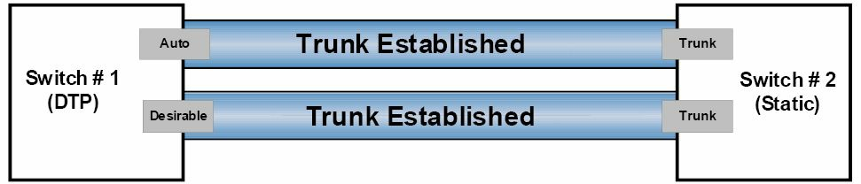

# 动态中继协议

DTP 是一种协商出两台交换机之间的共同中继模式的，思科专有的点对点协议。这一动态协商还可包括中继的封装方式。根据平台的不同，有两种交换机端口可使用的 DTP 模式：


- 动态 `desirable` 模式
- 动态 `auto` 模式

> **译注**：这两种 DTP 模式，是在接口配置模式下配置的，如下所示。
>
> ```console
> Switch(config-if)#switchport mode dynamic ?
>   auto       Set trunking mode dynamic negotiation parameter to AUTO
>   desirable  Set trunking mode dynamic negotiation parameter to DESIRABLE
>
> ```


在两台相邻交换机上使用 DTP 时，若交换机端口默认为动态 `desirable` 状态，那么该端口将主动尝试成为中继端口。而若交换机端口默认为动态 `auto` 状态时，则只有当相邻交换机被设置为动态 `desirable` 模式时，该端口才会恢复为中继端口。

下图 7.1 展示了将导致两台 Cisco Catalyst 交换机之间，中继建立或不建立的那些 DTP 模式组合（在这种情形下，他们都建立了；请参阅图 7.2 后的注释）：


**图 7.1** -- **DTP 模式组合**

下图 7.2 演示了成功建立两台相邻交换机之间中继链路的有效组合 -- 一台使用 DTP 同时另一台被静态配置为中继端口：





**图 7.2** -- **DTP 模式组合，第 2 部分**

**注意**：重要的是要知道，当两台交换机都被设置为动态 `auto` 模式时，他们将无法建立他们之间的中继链路。这是因为，与动态 `desirable` 模式不同，动态 `auto` 模式是种会等待对方发起中继建立的被动模式。同样，当某个静态配置的交换机端口，还配置了 `switchport nonegotiate` 命令时，那么他将不会使用 DTP 与相邻交换机形成中继，因为者会这将阻止 DISL 和 DTP 数据包从该端口发出。


> *译注*：
>
> 参考：[Disable DTP on a switch](https://community.cisco.com/t5/switching/disable-dtp-on-a-switch/td-p/3328521)

在某个交换式局域网中使用 DTP 时，`show dtp [interface <name>]` 命令可用于显示交换机全局，或指定接口的 DTP 信息。以下输出显示了由 `show dtp` 命令打印的信息：

```console
VTP-Server#show dtp
Global DTP information
        Sending DTP Hello packets every 30 seconds
        Dynamic Trunk timeout is 300 seconds
        4 interfaces using DTP
```

根据上述输出，该交换机正在每 30 秒发送一次 DTP 数据包。DTP 的超时值被设置为 300 秒（5 分钟），且 4 个接口当前正使用 DTP。`show dtp interface [name]` 命令会打印指定接口的 DTP 信息，其中包括接口类型（`trunk` 或 `access`）、 当前的端口 DTP 配置、中继封装方式，及 DTP 数据包统计信息等。


```console
VTP-Server#show dtp interface FastEthernet0/1
DTP information for FastEthernet0/1:
    TOS/TAS/TNS:                                TRUNK/ON/TRUNK
    TOT/TAT/TNT:                                802.1Q/802.1Q/802.1Q
    Neighbor address 1:                         000000000000
    Neighbor address 2:                         000000000000
    Hello timer expiration (sec/state):         7/RUNNING
    Access timer expiration (sec/state):        never/STOPPED
    Negotiation timer expiration (sec/state):   never/STOPPED
    Multidrop timer expiration (sec/state):     never/STOPPED
    FSM state:                                  S6:TRUNK
    # times multi & trunk                       0
    Enabled:                                    yes
    In STP:                                     no


    Statistics
    ----------
    0 packets received (0 good)
    0 packets dropped
        0 nonegotiate, 0 bad version, 0 domain mismatches, 0 bad TLVs, 0 other
    764 packets output (764 good)
        764 native, 0 software encap isl, 0 isl hardware native
    0 output errors
    0 trunk timeouts
    2 link ups, last link up on Mon Mar 01 1993, 00:00:22
    1 link downs, last link down on Mon Mar 01 1993, 00:00:20
```

## IEEE 802.1Q 原生 VLAN

在 [上一教学模组](../d06/vlan.md#vlan-标记) 中，咱们已经了解 802.1Q 或 VLAN 的打标签，会将某个标签插入除原生 VLAN 中数据帧外的所有数据帧。IEEE 定义了原生 VLAN，以提供到原有的那些不理解 VLAN 标签的 802.3 端口以连通性。

默认情况下，802.1Q 的中继会使用 `VLAN 1` 作为原生 VLAN。某一 802.1Q 中继链路上的默认原生 VLAN，可通过执行 `show interfaces [name] switchport` 或 `show interfaces trunk` 命令查看，如以下输出中所示：


```console
VTP-Server#show interfaces FastEthernet0/1 switchport
Name: Fa0/1
Switchport: EnabledAdministrative Mode: trunk
Operational Mode: trunk
Administrative Trunking Encapsulation: dot1q
Operational Trunking Encapsulation: dot1q
Negotiation of Trunking: On
Access Mode VLAN: 1 (default)
Trunking Native Mode VLAN: 1 (default)
Voice VLAN: none
...
[Truncated Output]
```

`VLAN 1` 会被交换机用来承载一些特定协议的流量，如 CDP、VTP、PAgP 及 DTP 等的信息。这本指南稍后将详细介绍 CDP 与 PAgP。虽然默认的原生 VLAN 始终是 `VLAN 1`，但原生 VLAN 可被手动修改为不在 VLAN 保留范围内的任何有效 VLAN 编号。

但重要的是记住，中继链路两侧的原生 VLAN 必须相同。当原生 VLAN 不匹配时，生成树协议 (STP) 就会将该端口置于端口 VLAN ID (PVID) 不一致状态，并且将不会在该链路上转发流量。此外，CDPv2 还会在交换机之间传递原生 VLAN 信息，而若原生 VLAN 不匹配，那么其将在交换机控制台上打印报错消息。默认原生 VLAN 可通过在指定 802.1Q 中继链路上，执行 `switchport trunk native vlan [number]` 接口配置命令更改，如下输出中所示：

> *知识点*：
>
> - Cisco Discovery Protocol, CDP
>
> - VLAN Trunking Protocol, VTP
>
> - Port Aggregation Protocol, PAgP
>
> - Dynamic Trunking Protocol, DTP
>
> - Spanning Tree Protocol, STP
>
> - a port VLAN ID(PVID) inconsistent state


```console
VTP-Server(config)#interface FastEthernet0/1
VTP-Server(config-if)#switchport trunk native vlan ?
  <1-4094>    VLAN ID of the native VLAN when this port is in trunking mode
```


