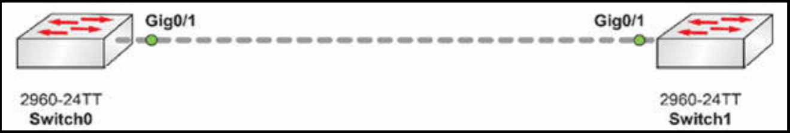

# 第 7 天的实验

## DTP 实验

### 拓扑结构




### 实验目的

了解如何在 Cisco 交换机上配置 DTP 设置。

不同平台的 DTP 设置各不相同，因此请随意更改咱们交换机上的设置，以便咱们能够尝试这些可用命令。请注意结果。下面的实验是使用 Packet Tracer 在 2960 型交换机上配置的。

对于这个实验中，我（作者）只是使用交叉线，在端口 `G0/1` 上连接两台 2960 交换机。

### 实验步骤

1. 检查咱们交换机上的当前 DTP 设置；

```console
Switch#show int g0/1 switchport
Name: Gig0/1
Switchport: Enabled
Administrative Mode: dynamic auto
Operational Mode: static access
Administrative Trunking Encapsulation: dot1q
Operational Trunking Encapsulation: native
Negotiation of Trunking: On
Access Mode VLAN: 1 (default)
Trunking Native Mode VLAN: 1 (default)
Voice VLAN: none
Administrative private-vlan host-association: none
Administrative private-vlan mapping: none
Administrative private-vlan trunk native VLAN: none
Administrative private-vlan trunk encapsulation: dot1q
Administrative private-vlan trunk normal VLANs: none
Administrative private-vlan trunk private VLANs: none
Operational private-vlan: none
Trunking VLANs Enabled: ALL
Pruning VLANs Enabled: 2-1001
Capture Mode Disabled Capture VLANs Allowed: ALL
Protected: false
Appliance trust: none
```

这些设置告诉咱们，该端口已动态地成为一个接入端口（而非手动配置）。他正以一个接入端口运行，同时由于 “中继协商”（Negotiation of Trunking）而开启了 DTP：`On Output`。


2. 将该端口的设置，从动态 `on`（被动成为中继）设置为动态 `desirable`（寻求主动成为中继）。我（作者）已添加了个问号，以便咱们可以查看这个平台上的那些可用选项；

```console
Switch(config-if)#switchport mode ?
access Set trunking mode to ACCESS unconditionally
dynamic Set trunking mode to dynamically negotiate access or trunk mode
trunk Set trunking mode to TRUNK unconditionally
Switch(config-if)#switchport mode dynamic ?
auto Set trunking mode dynamic negotiation parameter to AUTO
desirable Set trunking mode dynamic negotiation parameter to DESIRABLE
Switch(config-if)#switchport mode dynamic desirable
```

3. 再次检查该接口的设置。什么东西改变了？我（作者）截断了输出节省空间；

```console
Switch#show int g0/1 switchport
Name: Gig0/1
Switchport: Enabled
Administrative Mode: dynamic desirable
Operational Mode: trunk
Administrative Trunking Encapsulation: dot1q
Operational Trunking Encapsulation: dot1q
Negotiation of Trunking: On
Access Mode VLAN: 1 (default)
Trunking Native Mode VLAN: 1 (default)
Voice VLAN: none
```

4. 最后一步是关闭该接口的 DTP。咱们将看到，当该端口被设置为 `dynamic` 时，这条命令将不被接受。


```console
Switch(config-if)#switchport nonegotiate
Command rejected: Conflict between ‘nonegotiate’ and ‘dynamic’ status.
Switch(config-if)#switchport mode trunk
Switch(config-if)#switchport nonegotiate
Switch(config-if)#
Switch(config-if)#end
Switch#
%SYS-5-CONFIG_I: Configured from console by console

Switch#show int g0/1 switchport
Name: Gig0/1
Switchport: Enabled
Administrative Mode: trunk
Operational Mode: trunk
Administrative Trunking Encapsulation: dot1q
Operational Trunking Encapsulation: dot1q
Negotiation of Trunking: Off
Access Mode VLAN: 1 (default)
Trunking Native Mode VLAN: 1 (default)
Voice VLAN: none
```


## VTP 实验


在一个由两台交换机组成的拓扑结构中，测试这一教学模组中出现的那些 VTP 配置命令：

1. 将一台交换机配置为 VTP 服务器；
2. 将另一交换机配置为 VTP 客户端；
3. 在两台交换机上配置同样 VTP 域及口令；
4. 在服务器交换机上创建一系列 VLAN，看看他们如何被传播到各自交换机；
5. 在两台交换机上配置 VTP 修剪；
6. 验证（显示）两台交换机上的 VTP 配置；
7. 配置一个不同的 VTP 域名及口令，重复该过程；查看结果有何不同。


