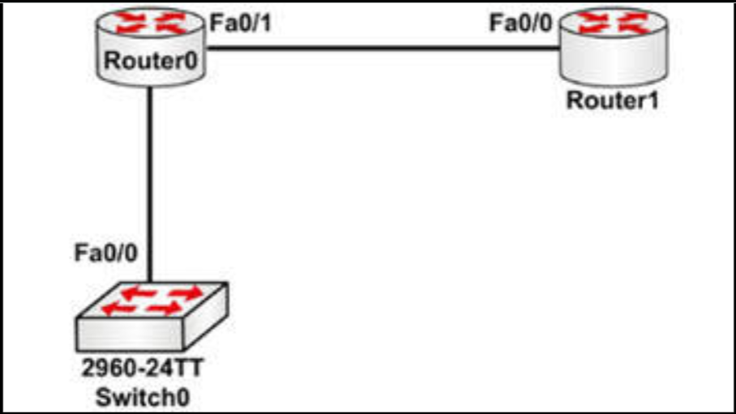

# Cisco Discovery Protocol (CDP)

CDP 是个热门考试话题，因为他提供了一种发现任何配置已应用前，网络设备信息的方法。这是一项非常有用的故障排除工具；但其存在安全风险。

CDP 是思科专有的，这意味着他将只会工作于思科设备上。他是一种由设备用来通告与发现有关直连邻居基本信息的服务。CDP 的 IEEE 版本，是链路层发现协议（LLDP）。

由于 CDP 是一种二层服务，因此他无需配置 IP 地址，即可交换信息。只有接口需要被启用。当 IP 地址被配置时，那么这将会包含在 CDP 报文中。

CDP 是一项非常强大的故障排除工具，在考试中咱们将需要了解如何使用他。下图 8.1 显示了一个我们可通过来自 `Router 0` 的 CDP 输出，发现的小型网络。




**图 8.1** -- **CDP 发现拓扑结构**


以下配置输出，与图 8.1 相对应：


```console
Router0#show cdp neighbors
Capability Codes: R - Router, T - Trans Bridge, B - Source Route Bridge, S - Switch, H - Host, I - IGMP, r - Repeater, P - Phone

Device ID  Local Interface  Holdtime  Capability  Platform   Port
Switch0    Fas 0/0          165       S           2960       Fas 0/1
Router1    Fas 0/1          169       R           C1841      Fas 0/0
Router0#
```

通过在末尾添加 `detail` 命令，咱们可查看更多信息：


```console
Router0#show cdp neighbors detail
Device ID: Switch0
Entry address(es):
Platform: cisco 2960, Capabilities: Switch
Interface: FastEthernet0/0, Port ID (outgoing port): FastEthernet0/1
Holdtime: 178
Version :
Cisco IOS Software, C2960 Software (C2960-LANBASE-M), Version 12.2(25)FX, RELEASE SOFTWARE (fc1)
Copyright (c) 1986-2005 by Cisco Systems, Inc.
Compiled Wed 12-Oct-05 22:05 by pt_team
advertisement version: 2
Duplex: full
---------------------------
Device ID: Router1
Entry address(es):
  IP address : 192.168.1.2
Platform: cisco C1841, Capabilities: Router
Interface: FastEthernet0/1, Port ID (outgoing port): FastEthernet0/0
Holdtime: 122
Version :
Cisco IOS Software, 1841 Software (C1841-ADVIPSERVICESK9-M), Version 12.4(15)T1, RELEASE SOFTWARE (fc2)
Technical Support: http://www.cisco.com/techsupport
Copyright (c) 1986-2007 by Cisco Systems, Inc.
Compiled Wed 18-Jul-07 04:52 by pt_team
advertisement version: 2
Duplex: full
```

现在咱们可以看到 10S 的版本、型号、IP 地址及其他信息。请记住，咱们还没有在 `Router 0` 上配置 IP 地址，为了演示输出，我（作者）添加了个 IP 地址到 `Router 1` 演示输出。

我们将在实验中，介绍如何关闭设备或接口上的 CDP。其他两条命令分别是显示设备协议信息的 `show cdp`，和通过输入名字显示特定设备信息的 `show cdp entry <Router>`。我（作者）建议咱们，在这本指南咱们将配置的实验中，花一些时间检查 CDP 输出。


```console
Router0#show cdp
Global CDP information:
    Sending CDP packets every 60 seconds
    Sending a holdtime value of 180 seconds
    Sending CDPv2 advertisements is enabled

Router0#show cdp ?
  entry      Information for specific neighbor entry
  interface  CDP interface status and configuration
  neighbors  CDP neighbor entries
  traffic    CDP statistics
  |          Output modifiers  
  <cr>
```
