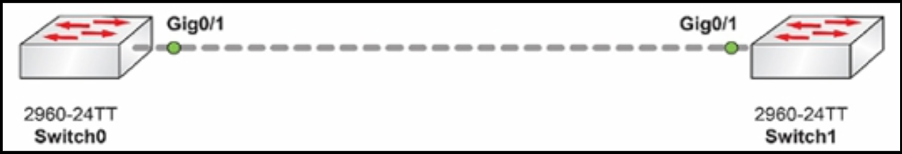

# 第 8 天实验


## CDP/LLDP 实验


### 拓扑结构




### 实验目的

了解如何验证及配置 Cisco 交换机上的 CDP 和 LLDP 设置。

CDP 在 Cisco 设备上时默认启用的。而 LLDP 是禁用的。

在本实验室中，我（作者）只是在端口 `GO/1` 上使用交叉线连接了两台 2960 交换机。

### 实验步骤

1. 检查咱们交换机上的当前 CDP 设置；

```console
Switch#show cdp neighbors
Capability Codes: R - Router, T - Trans Bridge, B - Source Route Bridge
S - Switch, H - Host, I - IGMP, r - Repeater, P - Phone
Device ID Local Intrfce Holdtme Capability Platform Port ID
Switch Gig 0/1 121 S 2960 Gig 0/1

Switch#show cdp neighbors detail

Device ID: Switch
Entry address(es):
Platform: cisco 2960, Capabilities: Switch
Interface: GigabitEthernet0/1, Port ID (outgoing port): GigabitEthernet0/1
Holdtime: 172

Version : Cisco IOS Software, C2960 Software (C2960-LANBASE-M), Version 12.2(25)FX, RELEASE SOFTWARE (fc1)
Copyright (c) 1986-2005 by Cisco Systems, Inc.
Compiled Wed 12-Oct-05 22:05 by pt_team

advertisement version: 2
Duplex:full
```


2. 关闭远端接口上的 CDP。清除交换机上的 CDP 条目，然后再次检查输出。条目应为空白；

```console
Switch1(config)#int g0/1
Switch1(config-if)#no cdp ?
enable Enable CDP on interface
Switch1(config-if)#no cdp enable

Switch#clear cdp table
Switch#show cdp neighbors
Capability Codes: R - Router, T - Trans Bridge, B - Source Route Bridge
S - Switch, H - Host, I - IGMP, r - Repeater, P - Phone

Device ID Local Intrfce Holdtme Capability Platform Port ID
Switch#
```

3. 检查 Switch1 的 LLDP 条目，注意 LLDP 是禁用的，然后在两侧都启用他；

```console
Switch#show lldp neighbors
% LLDP is not enabled
Switch#conf t
Switch(config)#lldp run
```


4. 再次检查 LLDP 条目，包括正常与详细信息。

```console
Switch#show lldp neighbors
Capability codes:
    (R) Router, (B) Bridge, (T) Telephone, (C) DOCSIS Cable Device
    (W) WLAN Access Point, (P) Repeater, (S) Station, (O) Other
Device ID           Local Intf     Hold-time  Capability      Port ID
Switch1             Gig0/1         120        B               Gig0/1

Total entries displayed: 1
Switch#show lldp neighbors detail
------------------------------------------------
Chassis id: 0001.64EE.CB19
Port id: Gig0/1
Port Description: GigabitEthernet0/1
System Name: Switch1
System Description: Cisco IOS Software, C2960 Software (C2960-LANBASE-M), Version 12.2(25)FX, RELEASE SOFTWARE (fc1)
Copyright (c) 1986-2005 by Cisco Systems, Inc.
Compiled Wed 12-Oct-05 22:05 by pt_team
Time remaining: 90 seconds
System Capabilities: B
Enabled Capabilities: B
Management Addresses - not advertised
Auto Negotiation - supported, enabled
Physical media capabilities:
    100baseT(HD)
    1000baseT(FD)
    1000baseT(HD)
Media Attachment Unit type: 10
Vlan ID: 1
Total entries displayed: 1
Switch#Name: Gig0/1
```


5. 检查对每个接口启用 LLDP 及对每个设备禁用 LLDP 的那些命令；


```console
Switch1(config-if)#lldp ?
  receive   Enable LLDP reception on interface
  transmit  Enable LLDP transmission on interface

Switch1(config-if)#exit
Switch1(config)#no lldp ?
  run  Enable LLDP
Switch1(config)#no lldp run
```
