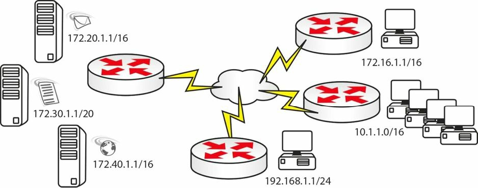

# 第 9 天 访问控制清单

**Access Control Lists**

___

Gitbook：[ccna60d.xfoss.com](https://ccna60d.xfoss.com/)


你可以在 https://github.com/gnu4cn/ccna60d 上 fork 本项目，并提交你的修正。


本书结合了学习技巧，包括阅读、复习、背书、测试以及 hands-on 实验。

> 本书译者用其业余时间完成本书的翻译工作，并将其公布到网上，以方便你对网络技术的学习掌握，为使译者更有动力改进翻译及完成剩下章节，你可以 [捐赠译者](https://github.com/gnu4cn/buy-me-a-coffee)。

___

## 第九天的任务

- 阅读今天的课文
- 完成今天的实验
- 阅读 ICND1 记诵指南
- 在[subnetting.org](http://www.subnetting.org)上花 15 分钟

和子网划分及 VLSM 一样，访问控制清单（access control lists, ACL）对于新 CCNA 学员来说，也是一大难点（one of the bugbear subjects）。有关 ACL 的问题包括，学习相关的 IOS 配置命令、理解 ACL 规则（包括隐式的`deny all`规则），以及掌握端口号及协议类型。

与其它 CCNA 科目一样，应该在学习过程中一次完成一个小部分，在路由器上使用所见到的每个命令，并完成许多实验。

今天你将学到以下内容。

- ACL基础
- 标准 ACLs ，扩展 ACLs ， 以及命名ACLs
- ACL 规则
- 反掩码（wildcard masks）
- ACL的配置
- ACLs 故障排除

本课程对应了以下 CCNA 大纲要求。

+ 描述 ACLs 的类型、特性及应用
	- 标准ACLs, standard
	- 序列号, sequence numbers
	- ACLs的编辑, editing
	- 扩展的ACLs, extended
	- 命名的ACLs, named
	- 编号的ACLs, numbered
	- 日志选项, log option
	- 在某个网络环境下配置并验证ACLs

## ACL基础

**ACL Basics**

**ACLs用于过滤那些通过路由器的流量**。没有那个网络是会让任何流量都进入或流出该网络的。

**在流量过滤的同时，ACLs 还可用于对 NAT 地址池的引用，及对调试命令进行过滤（filter your debugging commands）, 以及对路由地图进行过滤（这是超出 CCNA 大纲要求的）**。

依据所配置的 ACL 类型，可实现基于源网络/IP地址的过滤、基于目的网络/IP地址的过滤、基于协议或基于端口号的过滤。可在路由器的任何接口，包括 Telnet 端口，上应用 ACLs 。

下面是 3 中主要的 ACLs 类型。

- 标准的编号ACLs
- 扩展的编号ACLs
- 标准或扩展的命名ACLs

**标准的编号 ACLs 是可以应用到路由器上的最为基本的 ACL 形式**。它们是最易于配置的，因此其可用的过滤有着最大的限制。**它们仅能依据源 IP 地址或源网络进行过滤**。识别标准 ACL 的方法就是看配置行的前导数字；标准 ACLs 的该数字为`1`到`99`。

**扩展的编号 ACLs 可以有多得多的粒度, 但配置和故障排除起来会更难应付。**它们可以对某个目的或源 IP 地址或网络、某种协议类型以及某个端口号进行过滤（they can filter a destination or source IP address or network, a protocol type, and a port number）。可用于配置扩展 ACLs 的编号为`100`到`199`(包含`100`和`199`）。

**命名 ACLs 允许给某过滤清单一个名称，而不是编号**。这就令到在路由器配置中更易于区别这些 ACLs 了。命名 ACLs 可以是标准及扩展ACLs; 在该 ACLs 的初始化配置行处，可以选择其作为标准 ACL 还是扩展 ACL 。

为在 CCNA 考试中取得成功，并成为一名思科工程师，你需要理解以下内容。

- 端口号，port numbers
- ACL规则，ACL rules
- ACLs的命令语法，command syntax for ACLs

## 端口号，Port Numbers

如要通过 CCNA 考试，以及要在实际网络上工作，就必须要记住这些常见的端口号。在客户盯着你做事时，去查一下常见端口号是不可能的。这里有些你会碰到且需掌握的一些最常见的端口号。

| 端口 | 服务 | 端口 | 服务 |
| :-: | :-: | :-: | :-: |
| 20 | FTP 数据 | 80 | HTTP |
| 21 | FTP 控制 | 110 | POP3 |
| 22 | SSH | 119 | NNTP |
| 23 | Telnet | 123 | NTP |
| 25 | SMTP | 161/162 | SNMP |
| 53 | DNS | 443 | HTTPS(HTTP with SSL) |
| 69 | TFTP |  |  |

## 访问控制清单规则，Access Control List Rules

这是最难掌握的部分之一。我从没有在哪本思科手册中见到里面曾写过一条完整的规则清单。仅有一些手册对其简单概过或是稍加解释，另外一些则完全不讲。难点就在于这些规则一直都在用，但到目前为止你都是通过试误法发现的它们（the difficulty is that the rules always apply but unitil now, you found them only by trial and error）。下面就是你需要知道的这些规则了。

### ACL规则一 -- 在每个接口的每个方向，只使用一条ACL

**Use only one ACL per interface per direction**

这么做是很明智的。在同一接口上，有多条 ACLs 去做不同的事情，大概不是你想要的。简单地配置一条 ACL ，来完成需要完成的事情，而不是将过滤器分散到两条或多条的清单中。本应将“每个协议（per protocol）”加入到此规则中，因为这里是可以包含 IPX 的访问控制清单的，不过在现代网络中， IP 已成为唯一的协议了。


*图9.1 -- 接口上的一个方向仅做一条ACL*

### ACL规则二 -- ACLs行自顶向下进行处理

**the lines are processed top-down**

某些工程师在他们的 ACL 未如预期那样运行时感到迷惑。路由器会看看 ACL 的顶行，在发现匹配后，就会停在那里且不再对其它行进行检查了。为此，需要将**最明确的(最小的)那些条目放在 ACL 的顶部**（you need to put the most specific entries at the top of the ACL）。比如在利用 ACL 来阻挡主机`172.16.1.1`时的做法。

<table>
<tr><td>`Permit 10.0.0.0`</td><td></td><td>没有匹配的</td></tr>
<tr><td>`Permit 192.168.1.1`</td><td></td><td>没有匹配的</td></tr>
<tr><td>`Permit 172.16.0.0`</td><td>`〇`</td><td>匹配了-放行</td></tr>
<tr><td>`Permit 172.16.1.0`</td><td></td><td>不会处理了</td></tr>
<tr><td>`Deny 172.16.1.1`</td><td></td><td>不会处理了</td></tr>
</table>

在本例中，应该将`Deny 172.16.1.1`这行，放到顶部，或至少应在语句（ statement ）`Permit 172.16.0.0`之前。

### ACL规则三 -- 在每条 ACL 的底部，都有一句隐式的“deny all”

**There is an implicit "deny all" at the bottom of every ACL**

这条规则另很多工程师为难。在每条 ACL 的底部，有着一条看不见的命令。该命令设置为拒绝尚未匹配的所有流量。而阻止此命令起作用的唯一方法，就是在底部手动配置一条`permit all`命令。在取得来自 IP 地址`172.20.1.1`的某个进入的数据包时的做法。

<tr><td>`Permit 10.0.0.0`</td><td>无匹配项</td></tr>
<tr><td>`Permit 192.168.1.1`</td><td>无匹配项</td></tr>
<tr><td>`Permit 172.16.0.0`</td><td>无匹配项</td></tr>
<tr><td>`Permit 172.16.1.0`</td><td>无匹配项</td></tr>
<tr><td>`[Deny all]`</td><td>匹配 -- 丢弃数据包</td></tr>
</table>

你实际上想要路由器放行该数据包，但却拒绝了。原因就在于那条隐式的`deny all`命令了，而该命令实际上是一种安全手段。

### ACL规则四 -- 路由器是不能过滤自己产生的流量的

**The router can't filter self-generated traffic.**

这在某个实际网络上于部署 ACL 前进行测试时，会造成混乱。路由器不会过滤其自身产生的流量。在图9.2中有演示。


*图9.2 -- 对自身流量的 ACL 测试*

### ACL规则五 -- 不能对运行中的 ACL 进行编辑

**You can't edit a live ACL.**

实际上，在`IOS 12.4`之前的版本中，只能对命名 ACL 进行编辑, 而不能对标准 ACL 或扩展 ACLs 两种进行编辑。这曾是 ACL 架构的一个局限（this was a limitation of ACL architecture）。在`IOS 12.4`之前，如想要编辑标准 ACL 或扩展 ACL ，就必须按照以下步骤进行（这里使用`list 99`作为例子）。

1. 使用命令`no ip access-group 99 in`，在接口上停用 ACL 流量（stop ACL traffic on the interface with the `no ip access-group 99 in` command）。
2. 将该条 ACL 复制粘贴到文本编辑器，并在那里编辑好。
3. 进入到 ACL 模式，将新的 ACL 粘贴上去。
4. 再次将该 ACL 应用到接口。

在实际的路由器上，执行下面的这些命令。

在接口上已创建并应用的 ACL 。

```console
Router>en
Router#conf t
Enter configuration commands, one per line. End with CNTL/Z.
Router(config)#access-list 1 permit 172.16.1.1
Router(config)#access-list 1 permit 172.16.2.1
Router(config)#interface FastEthernet0/0
Router(config-if)#ip access-group 1 in
```

现在其从接口上卸下。

```console
Router(config)#int FastEthernet0/0
Router(config-if)#no ip access-group 1 in
Router(config-if)#^Z
```

查看那些 ACLs 。将其复制并粘贴到文本编辑器，并进行修改。

```console
Router#show run ← or show ip access lists
access-list 1 permit host 172.16.1.1
access-list 1 permit host 172.16.2.1
```

实际上还需在配置行之间加入一个叹号（如是将其粘贴到路由器上的情况下），来告诉路由器执行一次确认（you actually need to add an exclamation mark in-between each line of configuration, if you are pasting it in, to tell the router to do a carriage return）[wikipedia: 回车符](http://zh.wikipedia.org/wiki/%E5%9B%9E%E8%BD%A6%E7%AC%A6)。

```console
access-list 1 permit host 172.16.1.1
!
access-list 1 permit host 172.16.2.2
```

下面是正被粘贴到路由器配置中的那些行。要先删除早先的 ACL ，再粘贴进新版本。

```console
Router#conf t
Enter configuration commands, one per line. End with CNTL/Z.
Router(config)#no access-list 1
Router(config)#access-list 1 permit host 172.16.1.1
Router(config)#!
Router(config)#access-list 1 permit host 172.16.2.2
Router(config)#exit
Router#
%SYS-5-CONFIG_I: Configured from console by console
show ip access
Router#show ip access-lists
Standard IP access list 1
	permit host 172.16.1.1
	permit host 172.16.2.2
Router#
Router(config)#int FastEthernet0/0
Router(config-if)#ip access-group 1 in ← reapply to the interface
```

如使用的是Packet Tracer, 那么这些命可能不会工作。同时，请一定在某台路由器上尝试这些命令，因为它们是考试考点。**记住在编辑 ACL 前要先在接口上关闭它（此时它就不再是活动的了），以避免一些奇怪或是不可预期的行为发生**。而在`IOS 12.4`及以后的版本中，如何来编辑 ACLs ，会在后面演示。

### ACL规则六 -- 在接口上关闭ACL

**Disable the ACL on the interface.**

在打算短时间对 ACL 进行测试或是撤销 ACL 时，许多工程师都会将其完全删除掉。这是不必要的。如你要停止 ACL 运行，只需简单地将其从所应用到的接口上移除即可。

```console
Router(config)#int FastEthernet0/0
Router(config-if)#no ip access-group 1 in
Router(config-if)#^Z
```

### ACL规则七 -- 可重用同一ACL

**You can reuse the same ACL.**

这是我在实际网络中经常见到的。整个网络通常都有着同样的 ACL 策略。与其配置多条 ACLs ，只需简单地引用同一 ACL ，然后在所需要的那些接口上应用该 ACL 即可。图9.3演示了此概念。


*图9.3 -- ACL的重用*

### ACL规则八 -- ACL应保持简短

ACLs的基本规则就是保持简短且只专注于做一件事情。许多新手的思科工程师，将其 ACL 延伸到数行那么长，最后，经深思熟虑后，就可以紧缩到少数几行的配置。前面提到的将那些最为特定的（最小的）行放在 ACL 的顶部。这是好的做法，从而可以节约路由器 CPU 的执行周期。

优良的 ACL 配置技能，来自于知识和操练。

### ACL规则九 -- 尽可能将 ACL 放在接近源的地方

思科文档建议将扩展 ACL 尽量放在离源近的地方，而将标准 ACL 尽量放在离目的近的地方，因为这可以避免不必要的开销，又能放行那些合法流量。


*图9.4 -- 将 ACL 尽量放在离源近的地方*

>Farai 指出 -- “思科官方建议是扩展 ACL 尽量离源近，而标准 ACL 尽量离目的近”。

## 反掩码

**Wildcard Masks**

**因为在 ACLs 及某些路由协议的配置中，反掩码是命令行的组成部分，所有有必要学习反掩码**。之所有存在反掩码，是因为需要有某种方式来告诉路由器，我们要去匹配 IP 地址或网络地址的哪些部分。

匹配实在二进制层面完成的，却可以采用与子网掩码相同的表示法，来容易地配置反掩码。一个二进制`1`告诉路由器忽略对应的位，`0`则是要匹配的位。

CCNA考试中反掩码计算的一种简易方法，就是把一个数与子网掩码相加，确保它们的和为`255`。那么如果子网掩码的某个`8`位值为`192`时，需要加上`63`才等于`255`。而如果子网掩码的某个`8`位值为`255`, 则需要加的就是`0`。看看下面的例子吧。

<table>
<tr><th>子网掩码</th><td>`255`</td><td>`255`</td><td>`255`</td><td>`192`</td></tr>
<tr><th>反掩码</th><td>`0`</td><td>`0`</td><td>`0`</td><td>`63`</td></tr>
<tr><th>相加之和</th><td>`255`</td><td>`255`</td><td>`255`</td><td>`255`</td></tr>
</table>

<table>
<tr><th>子网掩码</th><td>`255`</td><td>`255`</td><td>`224`</td><td>`0`</td></tr>
<tr><th>反掩码</th><td>`0`</td><td>`0`</td><td>`31`</td><td>`255`</td></tr>
<tr><th>相加之和</th><td>`255`</td><td>`255`</td><td>`255`</td><td>`255`</td></tr>
</table>

<table>
<tr><th>子网掩码</th><td>`255`</td><td>`128`</td><td>`0`</td><td>`0`</td></tr>
<tr><th>反掩码</th><td>`0`</td><td>`127`</td><td>`255`</td><td>`255`</td></tr>
<tr><th>相加之和</th><td>`255`</td><td>`255`</td><td>`255`</td><td>`255`</td></tr>
</table>

在想要 ACL 与匹配某个子网或是整个网络时，就需要输入一个反掩码。比如，要匹配`172.20.1.0 255.255.224.0`, 就需要输入下面的命令。

`Router(config)#access-list 1 permit 172.20.1.0 0.0.31.255`

而要匹配子网`192.200.1.0 255.255.255.192`, 就需要下面的命令。

`Router(config)#access-list 1 permit 192.200.1.0 0.0.0.63`

在 OSPF 中应用网络语句时也要当心(be careful when applying network statements with OSPF)，那位那也要用到反掩码。

在有着一个仅有两位主机位的网络时，也要当心，因为需要输入一条 ACL 来匹配这些主机位。比如，要匹配子网`192.168.1.0 255.255.255.252`, 或`/30`的话，需要输入下面的命令。

`Router(config)#access-list 1 permit 192.168.1.0 0.0.0.3`

这里剔除了一些配置，是为展示出对应的部分。上面的命令将匹配`192.168.1.0`网络上的`1`号和`2`号主机。而如果要匹配`192.168.1.4/30`网络上的`5`号和`6`号主机，则需输入下面的命令。

`Router(config)#access-list 1 permit 192.168.1.4 0.0.0.3`

请阅读子网划分和 VLSM 部分的课文，以更好地掌握此概念。

## 访问控制清单的配置

**Configuring Access Control Lists**

熟能生巧，对于任何技能都是适用的。如同前面提到的，你应该在路由器上输入这里给出的每个例子，完成尽可能多的实验，并构建出自己的实例。在考试和现实世界中，你都需要精准快速的设计 ACL 。

接下来的章节中出现的标准和扩展 ACLs 都是编号 ACLs 。它们是配置 ACLs 的经典方法。命名 ACLs 是配置 ACLs 的另一种方式，将在其后的部分出现。

### 标准ACLs

**Standard ACLs**

标准的编号 ACLs 是最易于配置的，所以拿它来作为开端是最好的。**标准 ACLs 只能实现依据源网络或源 IP 地址的过滤**。


*图9.5 -- 带有源和目的地址的进入数据包*

在上面的图9.5中，进入的数据包有着一个源和目的地址，但标准 ACL 只会查看源地址。该 ACL 会放行会拒绝该源地址（参见图9.6）。


```console
Router(config)#access-list 1 permit host 172.16.1.1
Router(config)#access-list 1 permit host 172.16.1.1
Router(config)#access-list 1 permit host 192.168.1.1
Router(config)#access-list 1 permit 10.1.0.0 0.0.255.255
```

此 ACL 应在服务器侧的路由器上应用。又记得在清单的底部有一条隐式的`deny all`，所以其它流量都会给阻止掉。

### 扩展ACLs

**Extended ACLs**

**扩展的编号 ACLs 中可以构建出细得多的粒度**。而正是由于有了细得多的粒度，令到扩展的编号 ACLs 变得诡异起来。藉由扩展的编号 ACLs ，可以对源或目的网络地址、端口、协议及服务进行过滤。

一般来说，你可以看看扩展的 ACLs 配置语法，就像下面这样。

```console
access list# permit/deny [service/protocol] [source network/IP] [destination network/IP] [port#]
```

比如下面这样。

```console
access-list 101 deny tcp 10.1.0.0 0.0.255.255 host 172.30.1.1 eq telnet
access-list 100 permit tcp 10.1.0.0 0.0.255.255 host 172.30.1.1 eq ftp
access-list 100 permit icmp any any
```


*图9.7 -- 阻止服务器访问实例*


可为上面的网络配置一条 ACL ，以e-mail、 web 和文件服务器为例，可以像下面这样（应用在服务器侧的）。

```console
access-list 100 permit tcp host 172.16.1.1 host 172.20.1.1 eq smtp
access-list 100 permit tcp 10.1.0.0 0.0.255.255 host 172.30.1.1 eq ftp
access-list 100 permit tcp host 192.168.1.1 host 172.40.1.1 eq www
```

而如有不同要求，就也可以像下面这条 ACL 。

```console
access-list 101 deny icmp any 172.20.0.0 0.0.255.255
access-list 101 deny tcp 10.1.0.0 0.0.255.255 host 172.30.1.1 eq telnet
```

或者也可以像下面这样。

`access-list 102 permit tcp any host 172.30.1.1 eq ftp established`

关键字`[established]`告诉路由器仅放行在网络内部的主机所发起的流量。三次握手标志（ ACK 或 RST 位）将表明这点（the three-way handshake flags, ACK or RST bit, will indicate this）。

### 命名ACLs

**Named ACLs**

与编号 ACLs 不同，命名 ACLs 可由其描述性名称容易地区分，而这在一些大型的配置中尤其有用。引入命名 ACLs 就是为增加灵活性及 ACLs 的易于管理的。命名 ACLs 可以看着是配置增强的提升，因为它并未对 ACLs 结构进行修改（仅改变了引用 ACL 的方式而已）。

其语法跟编号 ACLs 是相似的，主要的不同就是使用名称而不是编号来区分 ACLs 。和编号 ACLs 一样，可以配置标准的或扩展的命名 ACLs 。

在配置命名 ACLs 时的另一不同之处，就是必须一直使用命令`ip access-list`，这与编号 ACLs 可以只使用简单的`access-list`命令，是不一样的。

```console
Router(config)#access-list ?
	<1-99>				IP standard access list
	<100-199>			IP extended access list
	<1100-1199>			Extended 48-bit MAC address access list
	<1300-1999>			IP standard access list (expanded range)
	<200-299>			Protocol type-code access list
	<2000-2699>			IP extended access list (expanded range)
	<700-799>			48-bit MAC address access list
	dynamic-extended	Extend the dynamic ACL absolute timer
	rate-limit			Simple rate-limit specific access list
Router(config)#ip access-list ?
	extended	Extended access list
	log-update	Control access list log updates
	logging		Control access list logging
	resequence	Resequence access list
	standard	Standard access list
R1(config)#ip access-list standard ?
	<1-99>	Standard IP access-list number<1300-1999> Standard IP access-list number (expanded range)
	WORD		Access-list name
R1(config)#ip access-list extended ?
	<100-199>	Extended IP access-list number
	<2000-2699>	Extended IP access-list number (expanded range)
	WORD 	Access-list name
```

命名 ACLs 在语法上与其它类型的 ACLs （也就是标准和扩展的编号 ACLs ）有着轻微的不同。同时也**可以编辑活动的命名ACLs**, 这是一个有用的特性。只需简单地告诉路由器要配置一条命名 ACL ， 而不管它是标准的还是扩展的。在较新的 IOS 版本上，也可以编辑编号 ACLs ，所以请检查所用的平台。

在使用`ip access-list`命令常见一条命名 ACL 时，思科 IOS 会将你带入 ACL 配置模式，在那里就可以输入或是移除 ACL 条目了（就是那些拒绝或放行的访问条件）。图9.8展示了一条命名 ACL 的实例，以及相应的输出。



**图9.8 -- 命名ACL**

```console
Router(config)#ip access-list extended BlockWEB
Router(config-ext-nacl)#?
Ext Access List configuration commands:
	<1-2147483647>	Sequence Number
	default			Set a command to its defaults
	deny			Specify packets to reject
	dynamic			Specify a DYNAMIC list of PERMITs or DENYs
	evaluate		Evaluate an access list
	exit			Exit from access-list configuration mode
	no				Negate a command or set its defaults
	permit			Specify packets to forward
	remark			Access list entry comment
Router(config-ext-nacl)#deny tcp any any eq 80
Router(config-ext-nacl)#permit ip any any
```

命名 ACL 的验证，可通过下面的命令完成。

- `show ip access-list`: 显示设备上所创建的所有ACLs
- `show ip access-list <acl_name>`: 显示某条特定的命名ACL

```console
Router(config)#do show ip access-lists
Standard IP access list test
	30 permit 10.1.1.1
	20 permit 192.168.1.1
	15 permit 172.20.1.1
	10 permit 172.16.1.1
```

要知道如何来增加或是删除某条命令 ACL 中的条目，请参考下面的“ ACL 序号（ACL Sequence Numbers）”小节。

### 应用ACLs

**Applying ACLs**

**为让 ACLs 发挥效果，就必须将 ACL 应用到路由器的某个接口或端口上**。之所以这样讲，是因为我曾见到许多的新手思科工程师在敲入了 ACL 后，就想为什么它不工作！或者他们配置了 ACL ，却将错误的 ACL 编号或命名应用到相应的接口上。

**如要应用在某条线路上，就必须使用`access-class`命令来指定它**，而**如果是应用在某个接口上，就要用`ip access-group`命令**。思科这么做的原因，我也不知道。

这里有应用 ACLs 到端口或接口上的三个实例。

接口上的应用。

```console
Router(config)#int FastEthernet0/0
Router(config-if)#ip access-group 101 in
```

线路上的应用。

```console
Router(config)#line vty 0 15
Router(config-line)#access-class 101 in
```

接口上的应用。

```console
Router(config)#int FastEthernet0/0
Router(config-if)#ip access-group BlockWEB in
```

## ACL序号

**ACL Sequence Numbers**

自`12.4`往后，你会发现思科 IOS 给每个 ACL 条目添加了序号。那么现在就可以创建一条访问控制清单，并在其后从它里面一处一行了。

```console
Router(config)#ip access-list standard test
Router(config-std-nacl)#permit 172.16.1.1
Router(config-std-nacl)#permit 192.168.1.1
Router(config-std-nacl)#permit 10.1.1.1
Router(config-std-nacl)#
Router(config-std-nacl)#exit
Router(config)#exit
Router#
*Jun 6 07:38:14.155: %SYS-5-CONFIG_I: Configured from console by console access
Router#show ip access-lists
Standard IP access list test
	30 permit 10.1.1.1
	20 permit 192.168.1.1
	10 permit 172.16.1.1
```

注意到**在路由器运行配置中，序号并不会显示出来**。要查看它们，必须执行一个`show [ip] access-list`命令。

## 加入一个 ACL 行

**Add an ACL Line**

**要加入一个新的 ACL 行，只需简单地输入新的序号并接着输入该 ACL 语句**。下面的例子展示如何往现有的 ACL 中加入行`15`。

```console
Router#conf t
Enter configuration commands, one per line. End with CNTL/Z.
Router(config)#ip access
Router(config)#ip access-list standard test
Router(config-std-nacl)#15 permit 172.20.1.1
Router(config-std-nacl)#
Router(config-std-nacl)#do show ip access
Router(config-std-nacl)#do show ip access-lists
Standard IP access list test
	30 permit 10.1.1.1
	20 permit 192.168.1.1
	15 permit 172.20.1.1
	10 permit 172.16.1.1
Router(config-std-nacl)#
```

### 移除一个 ACL 行

**Remove an ACL Line**

要移除某个 ACL 行，只需简单地敲入`no <seq_number>`命令即可，就如同下面的例子中行`20`被删除掉了。

```console
Router#conf t
Enter configuration commands, one per line. End with CNTL/Z.
Router(config)#ip access
Router(config)#ip access-list standard test
Router(config-std-nacl)#no 20
Router(config-std-nacl)#
Router(config-std-nacl)#do show ip access
Router(config-std-nacl)#do show ip access-lists
Standard IP access list test30 permit 10.1.1.1
	15 permit 172.20.1.1
	10 permit 172.16.1.1
Router(config-std-nacl)#
```

### 为某条 ACL 重新编号

**Resequence an ACL**

要对某条 ACL 重新编号，使用`ip access-list resequence <acl_name> <starting_seq_number> <step_to_increment>`命令。该命令的行为可由下面的例子进行检验。

```console
Router(config)#ip access-list resequence test 100 20
Router(config)#do show ip access-lists
Standard IP access list test
	100 permit 10.1.1.1
	120 permit 172.20.1.1
	140 permit 172.16.1.1
Router(config-std-nacl)#
```

命令`resequence`则会创建新的序号，自`100`开始，每个新行增加`20`。译者注：在更新的 IOS 版本中，此命令可指定开始序号及步进序号。

### ACL日志

**ACL Logging**

默认情况下，通过那些为某个接口的数据包所匹配上的 ACL 条目，会创建出一个不断增大的计数器，该计数器可使用`show ip access-list`命令进行查看，如下面的例子所示。

```console
Router#show ip access-lists
Extended IP access list test
	10 deny tcp any any eq 80 (10 matches)
	20 permit ip any any (56 matches)
```

而如果需要更详细的有关那些为 ACL 条目所匹配的流量信息，可以给相关的 ACL 条目配置`log`或`log-input`参数。

```console
Router(config)#ip access-list extended test
Router(config)#no 10
Router(config)#10 deny tcp any any eq 80 log
Router#show ip access-lists
Extended IP access list test
	10 deny tcp any any eq 80 log
	20 permit ip any any (83 matches)
```

在上面的配置样例中，配置了test ACL的 10 号条目的 ACL 日志。在某个数据包与那个条目匹配时，该 ACL 计数器就会增加，与此同时路由器也会生成一条包含了该特定 ACL 匹配的详细日志记录。

`%SEC-6-IPACCESSLOGP: list test denied tcp 10.10.10.2(24667) -> 10.10.10.1(80), 1 packet`

而如果你仍需要更多有关该事件（ transaction ）的细节，就要用`log-input`参数替代`log`参数了，就像下面这样。

```console
Router(config)#ip access-list extended test
Router(config)#no 10
Router(config)#10 deny tcp any any eq 80 log-input
Router#show ip access-lists
Extended IP access list test
	10 deny tcp any any eq 80 log-input
	20 permit ip any any (125 matches)
```

这时，当有该特定 ACL 条目匹配时，路由器就会生成一条更为详细的日志消息，当中包含了进入的接口以及源 MAC 地址。

```console
%SEC-6-IPACCESSLOGP: list test denied tcp 10.10.10.2(14013) (FastEthernet0/0 00aa.aabb.ccdd) -> 10.10.10.1(80), 1 packet
```

**ACL日志在查看到底那些数据包被丢弃或放行的故障排除中，会是非常有用的**, 但在现实世界情形中（此内容超出 CCNA 考试范围）不得提的是：包含`[log]`或`[log-input]`关键字的 ACL 条目是为路由器进行线程交换的, 与之相反，现代路由器中， 默认都是经由 CEF 交换的（ACL entries that contain `[log]` or `[log-input]` keyword are process-switched by the router, as opposed to being CEF-switched, which is the default in modern routers）。这需要更多的路由器 CPU 周期，因而导致在有大量与被记录的 ACL 条目匹配时，出现问题。

### 使用 ACLs 来限制 Telnet 和 SSH 访问

**Using ACLs to Limit Telnet and SSH Access**

除了在接口级别过滤流量外， ACLs 可与其他设备特性配合使用，包括过滤 VTY 线路上的流量。在前面的课程中，我们曾学过如何利用`line vty`命令，配置 Telnet 和 SSH 以实现对某台设备的访问（比如路由器或交换机）。

有时，我们可能不想接受到设备或自设备发出的所有Telnet/SSH连接。而为实现此操作，就必须定义一条 ACL ，以指定在 VTY 线路上所允许或拒绝的流量类型。该 ACL 可以是编号 ACL 或命名 ACL 。通过命令`access-class <acl> | [in|out]`, 将该 ACL 加入到想要的 VTY 线路上。

下面的例子定义了一条允许来自主机`10.10.10.1`的 Telnet 流量，该 ACL 随后被应用到 VTY 线路的进入方向。

```console
Router(config)#ip access-list extended VTY_ACCESS
Router(config-ext-nacl)#permit tcp host 10.10.10.1 any eq telnet
Router(config-ext-nacl)#deny tcp any any
Router(config-ext-nacl)#exit
Router(config)#
Router(config)#line vty 0 4
Router(config-line)# access-class VTY_ACCESS in
Router(config-line)#
```

使用以下命令对配置进行验证。

```console
Router#show run | sect line vty
line vty 0 4
access-class VTY_ACCESS in
.....
```

## ACLs故障排除和验证

**Trubleshooting and Verifying ACLs**

相信有了对配置命令和规则的深入理解，在访问控制清单上就不会有问题了。在 ACL 不工作的时候，首先要通过 ping 操作，检查有没有基本的 IP 连通性问题。接着看看有没有应用该 ACL ，看看在 ACL 中有没有什么文字错误，以及你是否需要允许任何 IP 流量通过（记住那个隐式的`deny all`条目）。而一些在 ACL 故障排除过程中最重要的检查点包括下面这些。

- 查看 ACL 统计信息
- 检查所允许的网络
- 检查应用 ACL 的接口及方向

### 查看 ACL 统计信息

在成功配置一条 ACL 并将其应用到某个接口上之后，某种可以验证该 ACL 正确行为的手段非常重要，尤其是某个 ACL 条目被使用到的次数。基于匹配次数，就可以对过滤策略进行调整，或者对 ACLs 进行增强，以实现整体安全性的提升。而根据需求的不同，可以在全局层面或者单个接口上（从`IOS 12.4`开始）查看 ACL 统计信息。

**ACL全局统计信息**

**Global ACL Statistics**

可使用命令`show ip access-list` 或 `show access-list`命令， 查看 ACL 全局统计信息，这两个命令又可以仅查看某个特定编号 ACL 或命名 ACL 的全局统计信息。

```console
Router#show ip access-lists
Extended IP access list test
	10 deny tcp any any eq 80 (10 matches)
	20 permit ip any any (56 matches)
```

在将某同一 ACL 重用到不同接口上时，这种方式并不会提供到十分特定的信息，因为它给出的是整体统计信息。

**单个接口上的 ACL 统计信息**

**Per Interface ACL Statistics**

在想要查看单个接口上的 ACL 匹配情况，不管是进还是出方向时，可以使用命令`show ip access-list interface <interface_name> [in|out]`，如下面所示。

```console
Router#show ip access-list interface FastEthernet0/1 in
Extended IP access list 100 in
	10 permit ip host 10.10.10.1 any (5 matches)
	30 permit ip host 10.10.10.2 any (31 matches)
```

如未有指定方向，则应用到该特定接口上的任何进或出方向的 ACL 都将显示出来。此特性也叫做“ ACL 可管理能力（ACL Manageability）”，自`IOS 12.4`开始可用。

### 检查那些放行的网络

**Verifying the Permitted Networks**

有的时候，特别实在那些必须配置很多 ACLs 的大型网络中，在配置 ACL 条目是就会犯下一些书写错误，而这就会导致不同接口上有错误的流量被阻止。为了检查那些正确的 ACL 条目（也就是 permit 及 deny 语句），可以照前面章节中讲到的那样，使用`show run | section access-list`或者`show ip access-list`命令。

### 检查 ACL 的接口和方向

**Verifying the ACL Interface and Direction**

在将某条 ACL 应用到某个接口上时，一个常见的错误就是将其应用到了错误的方向，也就是本应在进方向的，却应用到了出方向，或者本应在出方向的，却应用到了进方向。这会导致功能上和安全方面的很多问题。于是在 ACL 故障排除上的最先几步之一，就是检查 ACL 应用到正确的接口及正确的方向。

为此，可以使用多种命令，包括`show run`及`show ip access-list interface <interface> | [in|out]`命令。

## 第九天的问题

1. You can have a named, extended, and standard ACL on one incoming interface. True or false?
2. You want to test why your ping is blocked on your Serial interface. You ping out from the router but it is permitted. What went wrong? (Hint: See ACL Rule 4.)
3. Write a wildcard mask to match subnet mask `255.255.224.0`.
4. What do you type to apply an IP access control list to the Telnet lines on a router?
5. How can you verify ACL statistics per interface (name the command)?
6. How do you apply an ACL to an interface?

## 第九天问题的答案

1. False. You can only configure a single ACL on an interface per direction.
2. A router won’t filter traffic it generated itself.
3. `0.0.31.255`.
4. access-class .
5. Issue the show ip access-list interface command.
6. Issue the `ip access-group <ACL_name> [in|out]` command.

## 第九天的实验

### 标准 ACL 实验

**Standard ACL Lab**

**拓扑图**


标准 ACL 实验拓扑图

**实验目的**

学习如何配置一条标准 ACL 。

**实验步骤**

1. 配置上面的网络。在两台路由器上加入一条静态路由，领导到任何网络的任何流量都从串行接口发出。这么做的原因是，尽管这不是一个路由实验，仍然需要路由的流量。把`.1`地址加到路由器`A`的串行接口，`.2`地址加到路由器`B`的串行接口。


    ```console
    RouterA(config)#ip route 0.0.0.0 0.0.0.0 s0/1/0
    RouterB(config)#ip route 0.0.0.0 0.0.0.0 s0/1/0
    ```

2. 在路由器 A 上配置一条标准 ACL ，放行`192.168.1.0/10`网络。默认情况下，其它所有网络都将被阻止。


    ```console
    RouterA(config)#access-list 1 permit 192.168.1.0 0.0.0.63
    RouterA(config)#int Serial0/1/0
    RouterA(config-if)#ip access-group 1 in
    RouterA(config-if)#exit
    RouterA(config)#exit
    RouterA#
    ```

3. 从路由器`B`上测试该条 ACL ，默认将使用`10.0.0.1`地址。


    ```console
    RouterB#ping 10.0.0.1
    Type escape sequence to abort.
    Sending 5, 100-byte ICMP Echos to 10.0.0.1, timeout is 2 seconds:
    UUUUU
    Success rate is 0 percent (0/5)
    ```

4. 以源地址`192.168.1.1`来做另一个 ping 测试，这将没有问题。


    ```console
    RouterB#ping
    Protocol [ip]:
    Target IP address: 10.0.0.1
    Repeat count [5]:Datagram size [100]:
    Timeout in seconds [2]:
    Extended commands [n]: y
    Source address or interface: 192.168.1.1
    Type of service [0]:
    Set DF bit in IP header? [no]:
    Validate reply data? [no]:
    Data pattern [0xABCD]:
    Loose, Strict, Record, Timestamp, Verbose[none]:
    Sweep range of sizes [n]:
    Type escape sequence to abort.
    Sending 5, 100-byte ICMP Echos to 10.0.0.1, timeout is 2 seconds:
    Packet sent with a source address of 192.168.1.1
    !!!!!
    Success rate is 100 percent (5/5), round-trip min/avg/max = 31/31/32 ms
    ```

### 扩展 ACL 实验

**拓扑图**


扩展 ACl 实验的拓扑图

**实验目的**

学习如何配置一条扩展 ACL 。

**实验步骤**

1. 配置上述网络。在路由器`B`上加入一条静态路由，令到前往所有网络的所有流量都从串行接口上发出。这么做是因为，尽管这不是一个路由实验，仍然需要路由流量。


    ```console
    RouterB(config)#ip route 0.0.0.0 0.0.0.0 s0/1/0
    ```

2. 在路由器`A`上配置一条扩展 ACL 。仅允许往环回接口上发起 Telnet 流量。


    ```console
    RouterA(config)#access-list 100 permit tcp any host 172.20.1.1 eq 23
    RouterA(config)#int s0/1/0
    RouterA(config-if)#ip access-group 100 in
    RouterA(config-if)#line vty 0 15
    RouterA(config-line)#password cisco
    RouterA(config-line)#login
    RouterA(config-line)#^Z
    RouterA#
    ```

    上面的那条 ACL 编号为`100`, 这就告诉路由器，它是一条扩展 ACL 。所要允许的是 TCP 。该条 ACL 允许来自任何网络的，目的地址为`172.20.1.1`的 Telnet 端口，端口号为`23`。在执行`show run`命令时，就会看到，路由器实际上会将端口号替换为其对应的名称，就像下面演示的这样。

    ```console
    access-list 100 permit tcp any host 172.20.1.1 eq telnet
    ```

3. 现在，从路由器 B 上做一个 Telnet 测试。首先往路由器`A`的串行接口上 Telnet ，将会被阻止。接着测试环回接口。


    ```console
    RouterB#telnet 10.0.0.1
    Trying 10.0.0.1 ...
    % Connection timed out; remote host not responding
    RouterB#telnet 172.20.1.1
    Trying 172.20.1.1 ...Open
    User Access Verification ←password won’t show when you type it
    Password:
    RouterA> ←Hit Control+Shift+6 together and then let go and press the X key to quit.
    ```

> **注意：** 我们会在其它实验中涉及 ACLs ，但你真的需要完全地掌握这些内容。为此，要尝试其它的 TCP 端口，比如`80`、`25`等等。另外，要试试那些 UDP 端口，比如`53`。如没有将一台 PC 接上路由器，则是无法对这些其它端口进行测试的。

## 命名 ACL 实验

**拓扑图**


命名 ACL 实验拓扑图

**实验目的**

学习如何配置一条命名 ACL 。

**实验步骤**

1. 配置上面的网络。在两台路由器上加入一条静态路由，领导到任何网络的任何流量都从串行接口发出。这么做的原因是，尽管这不是一个路由实验，仍然需要路由的流量。


    ```console
    RouterA(config)#ip route 0.0.0.0 0.0.0.0 s0/1/0
    RouterB(config)#ip route 0.0.0.0 0.0.0.0 s0/1/0
    ```

2. 在路由器`B`上加入一条扩展的命名 ACL 。只放行主机`172.20.1.1`，阻止其它任何主机或网络。


    ```console
    RouterB(config)#ip access-list extended blockping
    RouterB(config-ext-nacl)#permit icmp host 172.20.1.1 any
    RouterB(config-ext-nacl)#exit
    RouterB(config)#int s0/1/0
    RouterB(config-if)#ip access-group blockping in
    RouterB(config-if)#
    ```

3. 现在分别从路由器`A`的串行接口和换回接口发出`ping`来测试该条 ACL 。


    ```console
    RouterA#ping 192.168.1.1
    Type escape sequence to abort.
    Sending 5, 100-byte ICMP Echos to 192.168.1.1, timeout is 2 seconds:
    UUUUU
    Success rate is 0 percent (0/5)
    RouterA#ping
    Protocol [ip]:
    Target IP address: 192.168.1.1
    Repeat count [5]:
    Datagram size [100]:
    Timeout in seconds [2]:
    Extended commands [n]: y
    Source address or interface: 172.20.1.1
    Type of service [0]:
    Set DF bit in IP header? [no]:
    Validate reply data? [no]:
    Data pattern [0xABCD]:
    Loose, Strict, Record, Timestamp, Verbose[none]:
    Sweep range of sizes [n]:
    Type escape sequence to abort.
    Sending 5, 100-byte ICMP Echos to 192.168.1.1, timeout is 2 seconds:
    Packet sent with a source address of 172.20.1.1
    !!!!!
    Success rate is 100 percent (5/5), round-trip min/avg/max = 31/34/47 ms
    ```

    > **注意：** 你需要搞清楚各种服务，以及各种服务所用到的端口。否则，要配置 ACL 就会非常棘手。本条 ACL 相当简单，因此可以仅用一行完成。在有着路由协议运行时，需要放行它们。

    要放行 RIP ，就要像这样指定。

    ```console
    access-list 101 permit udp any any eq rip
    ```

    要放行 OSPF ，要像这样指定。

    ```console
    access-list 101 permit ospf any any
    ```

    要放行 EIGRP ，要像这样指定。

    ```console
    access-list 101 permit eigrp any any
    ```


（End）


