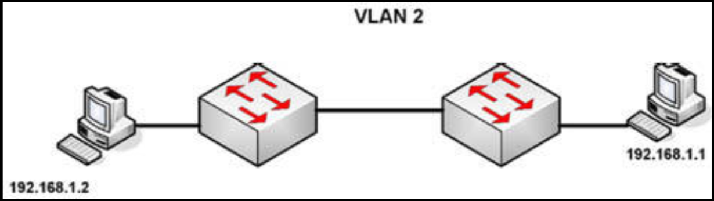
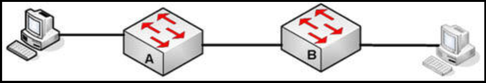

# 第 9 天 复习

## 第 9 天任务

- 复习前 3 天的课文；
- 重复前 3 天的实验；
- 完成今天的挑战实验；
- 参加 [Free CCNA Training Bonus – Cisco CCNA in 60 Days v4](https://www.in60days.com/free/ccnain60days/) 处今天的考试；
- 阅读 CCNA 补习指南。

在过去的三天里，我们已经讲了一些重要内容。请务必再次阅读课文，做好咱们自己的笔记并突出重要的学习要点。这本书中的挑战实验，都是基于前面已经配置过的实验，因此我们不会提供答案。

## 挑战 1 -- 配置 VLAN 实验

### 拓扑结构

### 实验说明

使用控制台连接，连接到交换机。将 PC 连接到每台交换机，或将交换机连接到一台路由器上的快速以太网端口。

1. 将 IP 地址添加到 PC 或路由器的以太网接口；
2. 在交换机上创建 `VLAN 2`；
3. 将 PC 连接的端口，设置为接入端口（这是默认设置，但还是要这样做）；
4. 将两个交换机端口放在 `VLAN 2` 下；
5. 将交换机之间的链路，配置为中继端口，并关闭他们；
6. 最多等待约 30 秒，然后从 PC `ping` 向 PC。

## 挑战 2 -- 中继、VLAN 及 DTP 实验

### 拓扑结构

### 实验说明

使用控制台连接，连接到交换机。选取咱们所选择的任意端口。要确保咱们有着设备的正确类型网线。

1. 将 `VLAN2` 添加到交换机；
2. 给交换机 A 上的 `VLAN2`（SVI），一个 `192.168.1.1/24` 的 IP 地址，给交换机 B 的 `VLAN2`（SVI） `192.168.1.2/24`；
3. 将主机的两个快速以太网接口，放在 `VLAN2` 下，并添加 IP 地址 `192.168.1.3/24` 和 `192.168.1.4/24`。将默认网关设置为最近交换机的 SVI 地址。
4. 将交换机上的主机端口，设置为接入端口；
5. 执行 `show vlan brief` 命令，检查这些接口是否在 `VLAN 2` 中；
6. 将左侧交换机上的接口，设置为中继接口；
7. 禁用右侧交换机上的 DTP，并将该接口设置为中接接口。在两台交换机上执行 `show interface trunk` 命令；
8. 在中继接口上执行 `show interface fast x/x switchport` 命令，并检查交换机 B 上的 DTP 是否关闭（要以正确的接口编号替换其中的 `x/x`）。

## 挑战 3 -- CDP 实验

### 拓扑结构

### 实验说明

使用控制台电缆及以太网线连接路由器。要连接另一个路由器（或直接使用 PT）。

1. 在两个面向路由器的接口上，分别配置一个 IP 地址，并 `ping` 通；
2. 使用 LLDP 命令查看，咱们可收集到对方路由器的哪些信息；
3. 在左侧路由器上，关闭接口上的 LLDP；
4. 在右路由器上，关闭整个设备的 LLDP。
