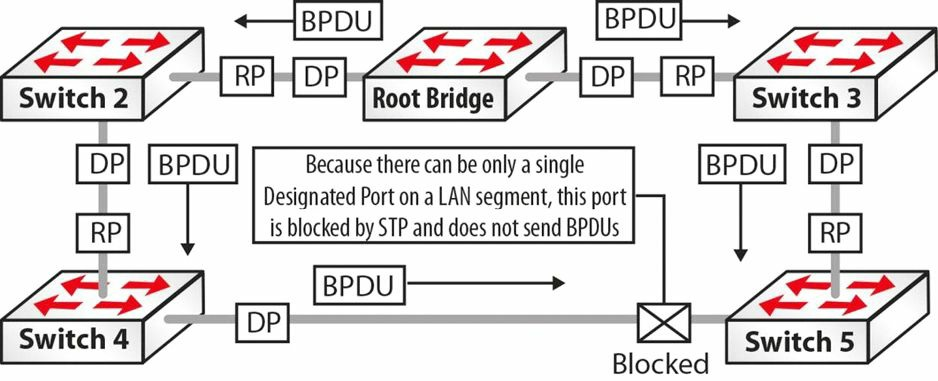

# IEEE 802.1D 的配置 BPDU

配置 BPDU 由 LAN 交换机发送，用于生成树拓扑的通信及计算。在交换机端口初始化后，端口便会被置于阻塞状态，同时 BPDU 会被发送到交换机上的每个端口。默认情况下，所有交换机最初都会假定他们是生成树的根节点，直到他们与别的交换机交换配置 BPDU。只要某个端口继续将其配置 BPDU 视为最具吸引力的 BPDU，那么他就将继续发送配置 BPDU。交换机会根据以下四个因素（按顺序排列），确定出最佳配置 BPDU：

1. 最低的根网桥 ID；
2. 最低的到根网桥根路径开销；
3. 最低的发送方网桥 ID；
4. 最低的发送端口 ID。

配置 BPDU 交换的完成，会造成以下操作：

- 整个生成树域的根交换机被选举出来；
- 生成树域中的每个非根交换机的根端口被选举出来；
- 每个 LAN 网段的指定交换机被选举出来；
- 每个网段的指定交换机的指定端口被选举出来（根交换机上的所有活动端口也会被指定出来）；
- 通过阻断冗余路径，网络中的环路会被消除。

**注意**：随着咱们继续学习这一教学模组，这些特性都将被讲到。

一旦在所有交换机端口都处于转发或阻塞状态时，那么生成树网络便已收敛，配置 BPDU 即会由根网桥在默认两秒的每次 `Hello` 时间间隔发送。这被称为配置 BPDU 的源头。配置 BPDU 会经由根网桥上的指定端口，转发到那些下游的相邻交换机。

当某个非根网桥在其提供了到根网桥最佳路径的根端口上，接收到配置 BPDU 时，他会通过其指定端口，发送该 BPDU 的更新版本。这被称为 BPDU 的传播。

所谓指定端口，是指定交换机上，转发该 LAN 网段上的流量到根网桥时，有着最低路径开销的某个端口。

一旦生成树网络已收敛，配置 BPDU 就始终会从根桥，传输到 STP 域内的其他交换机。要记住生成树网络收敛后，配置 BPDU 的流动方式，最简单的方法就是记住以下四条规则：

1. 配置 BPDU 源自根桥，并经由指定端口发送；
2. 配置 BPDU 会被非根网桥在根端口上收到；
3. 配置 BPDU 会被非根网桥在指定端口上传送；
4. 对于任何单一 LAN 网段，都只有一个指定端口（在某台指定交换机上）。

下图 10.2 展示了 STP 域中配置 BPDU 的流动方式，体现了上面列出的四条简单规则：

**图 10.2** -- **整个 STP 网域的配置 BPDU 流程**

1. 参照图 10.2，配置 BPDU 源自根桥，并经由根桥上的指定端口发往那些非根桥交换机，即 `Switch 2` 和 `Switch 3`；
2. 非根桥的 `Switch 2` 和 `Switch 3`，在其提供了通往根桥最佳路径的根端口上，接收到配置 BPDU；
3. `Switch 2` 和 `Switch 3` 会修改（更新）接收到的配置 BPDU，并将其转发出指定端口；`Switch 2` 是其本身与 `Switch 4` 的 LAN 网段上的指定交换机。`Switch 3` 是其本身和 `Switch 5` 的 LAN 网段上的指定交换机。指定端口位于指定交换机上，并是转发该 LAN 网段中的数据包到根网桥时，有着最低路径开销的端口；
4. 在 `Switch 4` 和 `Switch 5` 之间的 LAN 网段上，`Switch 4` 被选举为指定交换机，同时指定端口位于该交换机上。由于一个网段上只能有一个指定交换机，因此 `Switch 5` 上用于该 LAN 网段的端口即被阻塞。这个端口将不转发任何 BPDU。

> *知识点*：
>
> - Configuration BPDU
>
> - the Spanning Tree topology
>
> - the Blocking state
>
> - the Root of the Spanning Tree
>
> - the best Configuration BPDU
>
> - Root Bridge ID
>
> - Root path cost to Root Bridge
>
> - Bridge ID
>
> - Port ID
>
> - Root Switch
>
> - Root Port
>
> - Non-Root Switch
>
> - Designated Switch
>
> - Designated Port
>
> - converged
>
> - the Forwarding state
>
> - the Blocking state
>
> - Hello time interval
>
> - the origination of Configuration BPDU
>
> - downstream neighboring switches
>
> - the best path to the Root Bridge
>
> - an updated version of the BPDU
>
> - the propagation of BPDUs
>
> - the STP domain
>
> - the flow of Configuration BPDU
