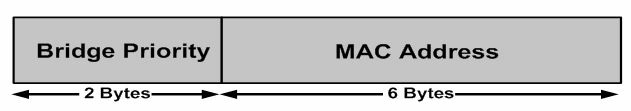

# 生成树网桥 ID

生成树域中的交换机，都有个用于唯一标识该 STP 域中交换机的网桥 ID (BID)。BID 还用于帮助 STP 根桥的选举，这将在稍后介绍。BID 是个 8 字节的字段，由 6 字节的 MAC 地址和 2 字节的网桥优先级组成。BID 如下图 10.3 中所示。




**图 10.3** -- **网桥 ID 的格式**


随位网桥优先级，是交换机相对于所有其他交换机的优先级。网桥优先级取值范围为 0 至 65535。Cisco Catalyst 交换机的默认值为 32768。


```console
Switch2#show spanning-tree vlan 2

VLAN0002
    Spanning tree enabled protocol ieee
    Root ID Priority    32768
            Address     0009.7c87.9081
            Cost        19
            Port        1 (FastEthernet0/1)
            Hello Time  2 sec Max Age 20 sec Forward Delay 15 sec
    Bridge ID Priority  32770 (priority 32768 sys-id-ext 2)
            Address     0008.21a9.4f80
            Hello Time  2 sec Max Age 20 sec Forward Delay 15 sec
            Aging Time  300

Interface   Port ID                 Designated                  Port ID
Name        Prior.Nbr   Cost    Sts Cost        Bridge ID       Prior.Nbr
----------  ---------   ----    --- ----------- --------------  ---------
Fa0/1       128.1       19      FWD 0  32768    0009.7c87.9081  128.13
Fa0/2       128.2       19      FWD 19 32770    0008.21a9.4f80  128.2
```

以上输出中的 MAC 地址，是派生自交换机背板或监控引擎的硬件地址。在 802.1D 标准下，每个 VLAN 都需要一个唯一 BID。


大多数 Cisco Catalyst 交换机都有个可用作 VLAN BID 的 1024 个 MAC 地址的地址池。这些 MAC 地址会被顺序地分配，范围中的第一个 MAC 地址会分配给 `VLAN 1`，第二个分配给 `VLAN 2`，第三个分配给 `VLAN 3`，以此类推。这样做提供了支持标准范围的 VLAN 的能力，但要支持扩展范围的 VLANS，将需要更多 MAC 地址。这个问题已在 [802.1t](https://www.ietf.org/proceedings/51/slides/bridge-0/tsld016.htm)（802.1D 的技术和编辑更正）标准中得到解决。


> *知识点*：
>
> - Bridge ID, BID
>
> - the election of an STP Root Bridge
>
> - a 2-byte Bridge Priority
>
> - the switch backplane
>
> - the supervisor engine，*译注*：所谓监督引擎，是指某种虚拟化技术，比如 hyper-v, qemu/kvm/libvirt 等
>
> - a pool of 1024 MAC addresses
>
> - the standard range of VLANs
>
> - the extended range of VLANs
