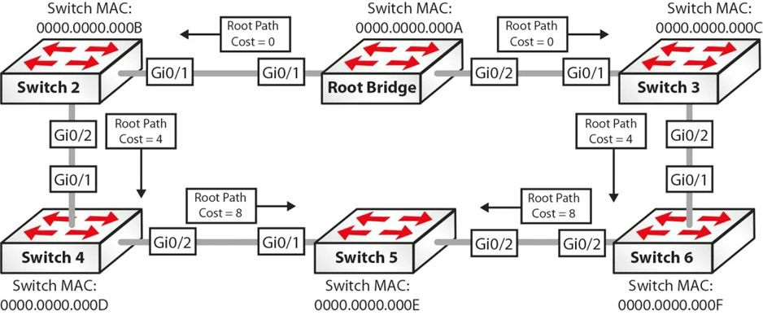
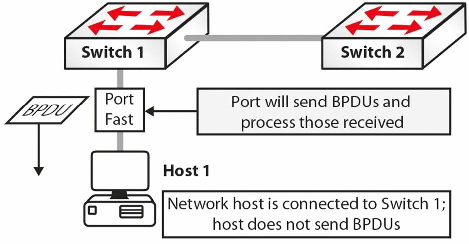
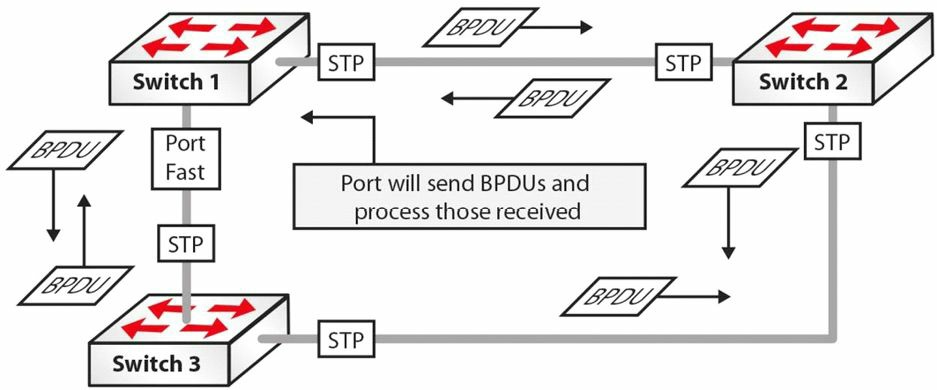
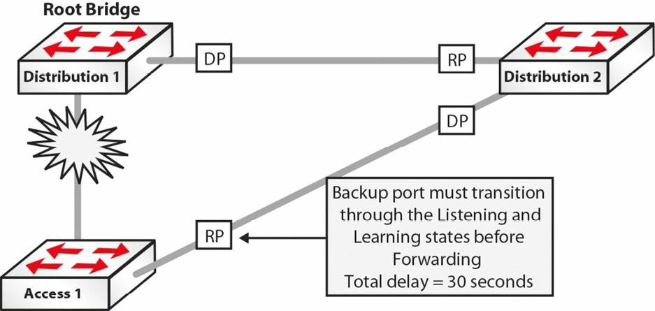
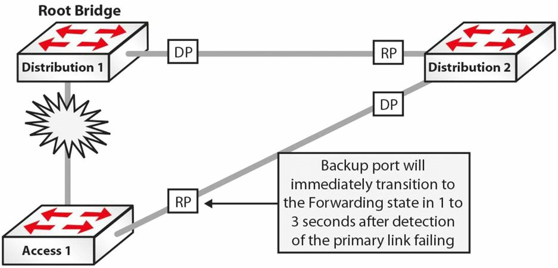

# 生成树根端口和指定端口

STP 选择两种用于转发 BPDU 的端口：根端口（指向根网桥）和指定端口（远离根网桥）。了解这两种端口类型的功能以及 STP 如何选举它们非常重要。生成树根端口选举 STA 定义了三种端口类型：根端口、指定端口和非指定端口。这些端口类型由 STA 选定，并进入相应的状态（如转发或阻塞）。在生成树选举过程中，如果出现平局，将使用以下值（按列出的顺序）作为破局者：
1.最低根桥 ID
2.到根网桥的最低根路径成本


2. 到根桥的最低根路径开销, lowest Root path cost to Root Bridge
3. 最低的发送方桥ID, lowest sender Bridge ID
4. 最低的发送方端口 ID ，lowest sender Port ID

> **注意：** 为掌握生成树选举及指定出在任何给定情形下不同端口类型，那么重要的是记住这些打破平局的标准了。这些标准不仅要对其进行测试，还要为真实世界中设计、部署及支持互联网络而牢固掌握这个知识点。

生成树**根端口是在该设备将数据包转发到根桥时，提供出最优路径，或最低开销的端口。**也就是说，根端口是接收到该交换机的最优 BPDU 的端口，而这又表明了在路径开销上其是到根桥的最短路径。根端口是基于根桥路径开销选举出的。

根桥路径开销又是基于连接到根桥的所有链路的累积开销（路径开销）计算出的。路径开销是各个端口贡献给根桥开销的数值（the path cost is the value that each port contributes to the Root Bridge path cost）。因为此概念通常是十分令人困惑，在下图31.7中对其进行了演示。

> **注意：** 图31.7中除了一条链路外，其它链路都是 GigabitEthernet 链路。应假定用于端口开销计算的方法是传统的802.1D方法。因此，默认 GigabitEthernet 的端口开销就是4, 同时 FastEthernet 是 19 。


*图31.7 -- 生成树根端口选举*

> **注意：** 下面的解释对网络中交换机間的 BPDUs 数据流进行了说明。与其它信息一起，这些 BPDUs 包含了根桥路径开销信息，而根桥路径开销在接收交换机上的入站端口处被增加（along with other information, these BPDUs contain the Root Bridge path cost information, which is incremented by the ingress port on the receiving switch）。

1. 根桥发出一个带有根桥路径开销值 0 的 BPDU ，因为其端口直接位于该根桥上。此 BPDU 发送给Switch 2和Switch 3。
2. 当Switch 2和Switch 3接收到来自根桥的 BPDU 时，它们便基于各自入站借口加上其自己的路径开销。因为Switch 2和Switch 3都是通过 GigabitEthernet 连接与根桥相连，所以它们将从根桥接收到的路径开销值（ 0 ）与它们的 GigabitEthernet 路径开销值（ 4 ）相加。Switch 2及Switch 3经由GigabitEthernet0/1到根桥的根桥路径开销也就是0+4=4。
3. Switch 2和Switch 3将新的 BPDUs 送出至其各自的邻居，也就是Switch 4和Switch 6。这些 BPDUs 包含了新的累积值（ 4 ）作为根桥路径开销。
4. 当Switch 4和Switch 6接收到分别来自Switch 2和Switch 3的 BPDUs 时，它们根据入站借口对接收到的**根桥路径开销**予以增长。因为使用的是GigabitEthernet, 从Switch 2和Switch 3接收到的值被加上 4 。那么在Switch 4和Switch 6上经由其各自GigabitEthernet0/1接口的根桥路径开销就是0+4+4=8。
5. Switch 5接收到两个 BPDUs ：一个来自Switch 4，另一个来自Switch 6。接收自Switch 4的 BPDU 有着根桥路径开销0+4+4+4=12。接收自Switch 6的 BPDU 有着根桥路径开销0+4+4+19=27。因为包含于接收自Switch 4的 BPDU 中的根桥路径开销值好于接收自Switch 6的，Switch 5将选举GigabitEthernet0/1作为**根端口**（the Root Port）。

> **注意：** 交换机 2 、 3 、 4 、 6 都将选举其各自的 GigabitEthernet 端口作为根端口。


**更多解释**

**Further Explanation**

为更为细致的进行解释（To explain further）, 并有助于掌握根端口选举过程，假定上图31.7中所有端口都是 GigabitEthernet 端口。这就意味着在上面的第 5 布中，Switch 5将接收到两个带有相同根桥 ID 的 BPDUs ，且两个都有着0+4+4+4=12的根路径开销值。为了选举出根端口， STP 将进入到下面所列出的打破僵局标准的下一选项（前两个选项已经用到，就被移除了）。

1. 最低发送方桥 ID ，lowest sender Bridge ID
2. 最低发送方端口 ID ，lowest sender Port ID

基于第三个选举标准，Switch 5将优先使用来自Switch 4的 BPDU ，因为Switch 4的 BID （0000.0000.000D）低于Switch 6的 BID （0000.0000.000F）。Switch 5选出端口GigabitEthernet0/1作为根端口。

### 生成树指定端口的选举

**Spanning Tree Designated Port Election**

与根端口不同，指定端口是指向与 STP 根相反方向的端口。该端口是指定设备（交换机）连接 LAN 的端口。指定端口同时也是在将来自 LAN 的数据包转发给根桥时有着最低路径开销的端口。

> **注意：** 一些人将指定端口当作是指定交换机。这两个术语是可以互换的，且指的是同一个东西。也就是说，这是用于将来自某个特定 LAN 网段的帧，转发到根桥的交换机，或端口。

**指定端口的主要目的是阻止循环。**在超过一台的交换机连接到同一网段时，所有交换机都将尝试对在那个网段上接收到的某个帧进行转发。这样的默认行为可能导致该帧的多个拷贝被多台交换机同时转发--从而造成网络循环。为避免这种默认行为，**STP在所有网段上都选举出一个指定端口。***这是因为根桥路径开销将始终为 0 。*STA的指定端口选举过程在下图31.8中进行了演示。



*图31.8 -- 生成树指定端口选举*

1. 在根桥和Switch 2之间的网段上，根桥的GigabitEthernet0/1被选举为指定端口，因为该端口有着较低的根桥路径开销 0 。

2. 在根桥和Switch 3之间的网段，根桥的GigabitEthernet0/2端口被选举作为指定端口，因为其有着较低的根桥路径开销 0 。

3. 在Switch 2和Switch 4之间的网段，Switch 2上的GigabitEthernet0/2被选举为指定端口，因为Switch 2有着最低的根桥路径开销 4 。

4. 在Switch 3和Switch 6之间的网段，Switch 3上的GigabitEthernet0/2端口被选举为指定端口，因为Switch 3有着最低的根桥路径开销 4 。

5. 在Switch 4和Switch 5之间的网段，Switch 4上的GigabitEthernet0/2端口被选举为指定端口，因为Switch 4有着最低的根桥路径开销 8 。

6. 在Switch 5和Switch 6之间的网段，Switch 6上的GigabitEthernet0/2被选举为指定端口，因为Switch 6有着最低的根桥路径开销 8 。

非指定端口（the Non-Designated Port）实际上不是一种生成树端口类型。而是其作为一个术语，只是简单地表示某个不作为某 LAN 网段上指定端口的端口。**非指定端口将始终被 STP 置为阻塞状态。**基于根端口及指定端口的计算，下图31.9中展示了用于根端口和指定端口选举示例的交换网络的最终生成树拓扑（Based on the calculation of Root and Designated Ports, the resultant Spanning Tree Topology for the switched network that was used in the Root Port and Designated Port election examples is shown in Figure 31.9 below）。


*图31.9 -- 已收敛的生成树网络*

## 思科生成树增强

**Cisco Spanning Tree Enhancements**

如早前指出的那样， STP 对其所在环境做出以下两点假设。

- 所有链路都是双向的，而能够发送和接收桥协议数据单元。
- 所有交换机都能正常地接收、处理及发出BPDUs

在现实世界的网络中，这两个假设并不总是正确。在这种情况下， STP 就可能无法阻止网络中循环的形成（in situations where that is the case, STP may not be able to prevent loops from being formed within the network）。正是由于存在这种可能，且为提升基本的802.1D STA性能，思科引入了一些对IEEE 802.1D标准的增强，将在下面进行说明。

### 端口快速

**Port Fast**

端口快速是一项典型地对连接了一台主机的端口或接口开启的特性。当该端口上的链路起来时，交换机将跳过 STA 的第一阶段并直接过渡到转发状态。与通常的看法相反，端口快速特性并不在选定的端口上关闭生成树。这是因为就算带有端口快速特性，该端口仍能发送并接收 BPDUs 。

这在该端口所连接的诸如某台工作站的网卡这样的，没有发送或响应 BPDUs 的网络设备时不是问题。但如该端口所连接的设备确实在发出 BPDUs ，比如另一台交换机，这可能造成交换循环。这是因为该端口跳过了侦听及学习阶段而立即进入到转发状态（this may result in a switching loop. This is because the port skips the Listening and Learning states and proceeds immediately to the Forwarding state）。端口快速简单地令到该端口相较经历所有 STA 步骤，快得多地开始转发以太网帧。

### BPDU守护

**BPDU Guard**

**BPDU守护特性用于保护生成树域免受外部影响。 BPDU 默认是关闭的，但建议在所有开启了端口快速特性的端口上予以开启。**在配置了 BPDU 守护特性的端口接收到一个 BPDU 时，就立即转变成错误关闭状态（the errdisable state）。

在那些关闭了生成树的端口上，这样做阻止了错误信息注入到生成树域中去。 BPDU 守护的运行，结合端口快速特性，在下面及后续的图31.10、31.11及31.12中，进行了演示。



*图31.10 -- 掌握 BPDU 守护*

图31.10中，Switch 1到Host 1的连接上**开启了端口快速。那么在初始化后，该端口便过渡到转发状态，这就消除了该端口在没有省略掉 STA 而要走完侦听及学习状态所要花掉的 30 秒。**因为该网络主机是一台工作站，其不在那个端口上发送 BPDUs 。

要么因为偶然，或是由于一些其它恶意目的，Host 1从Switch 1上断开连接。使用同一端口，SWitch 3被连接到Switch 1。Switch 3同时也连接到Switch 2。因为端口快速在连接Switch 1到Switch 3的端口上开启，此端口就从初始化变成转发状态，从而省略掉了一般 STP 初始化过程。此端口将接收并处理所有由Switch 3发送的 BPDUs ，如下图31.11所示。



*图31.11 掌握 BPDU 守护（续）*

基于上面所演示的端口状态，可很快看出一个循环将在此网络中如何建立起来。为阻止此情形的发生，就应在所有的那些开启了端口快速的端口上，开启 BPDU 守护。这在下面的图31.12中进行了演示。


*图31.12 -- 掌握 BPDU 守护（续）*

在端口快速端口上带有 BPDU 守护下，在Switch 1接收到来自Switch 3的一个 BPDU 时，就立即将该端口转变成错误关闭状态（immediately transitions the port into the errdisable state）。结果就是 STP 计算不受该冗余链路的影响，且该网络不会有任何循环。

### BPDU过滤器

**BPDU Filter**

BPDU守护与 BPDU 过滤器两个特性常常混淆或甚至被想成是同一个特性。但它们是不同的，而掌握它们之间的区别就很重要。在某个端口上开启了端口快速时，该端口将发出 BPDUs 且将接受及处理收到的 BPDUs 。 BPDU 守护特性阻止该端口接收任何的 BPDUs ，但不阻止其发送 BPDUs 。如有接收到任何 BPDUs ，该端口就将成为错误关闭端口（if any BPDUs received, the port will be errdisabled）。

而 BPDU 过滤器特性有着两方面的功能（the BPDU Filter feature has dual functionality）。当在接口级别配置上 BPDU 过滤器时，它将有效地在选定端口上，通过阻止这些端口发送或接收所有 BPDUs ，而关闭这些端口的 STP 。而在全局配置了 BPDU 过滤器，并与全局端口快速配合使用是，它会将任何接收到 BPDUs 的端口，还原成端口快速模式。下图31.13对此进行了演示。


### 循环守护

**Loop Guard**

循环守护特性用于防止生成树网络中循环的形成。循环守护对根端口及阻塞端口进行探测，并确保它们继续接收 BPDUs 。当交换机在阻塞端口上接收到 BPDUs ，该信息就被忽视，因为来自根桥的最佳 BPDU 仍通过根端口，正在接收着。

如该交换机链路是运行的，又没有接收到 BPDUs （因为该链路是单向链路，due to a unidirectional link），该交换机就假设将该链路开启是安全的，那么该端口就转换到转发状态并开始对接收到的 BPDUs 进行中继。如有某台交换机连接到该链路的另一端，这将有效地建立起一个生成树循环。下图31.14对此概念进行了演示。


*图31.14 -- 掌握循环守护*

图31.14中，该生成树网络已完成收敛，从而所有端口都处于阻塞或转发状态。但是，因为一条单向链路，Switch 3上的阻塞端口停止了接收来自Switch 2上的指定端口的 BPDUs 。Switch 3假定该端口可被转换成转发状态，并开始此转换。该交换机此时就将接收到的 BPDUs 中继出那个端口，从而导致网络循环。

在循环守护开启时，Switch 3保持对所有非指定端口的追踪。在端口持续接收到 BPDUs 时，该端口就是好的；但如该端口停止接收到 BPDUs ，就被转移到循环不一致状态（a loop-inconsistent state）。也就是说，在循环守护开启时， STP 端口状态机（the STP port state machine）被修改为在缺少 BPDUs 时，阻止该端口从非指定端口角色转变成指定端口角色（in other words, when Loop Guard is enabled, the STP port state machine is modified to prevent the port from transitioning from the Non-Designated Port role to the Designated Port role in the absence of BPDUs）。在应用循环守护时，应知道以下这些应用准则。

- 不能在开启了根守护（Root Guard）的交换机上开启循环守护, Loop Guard cannot be enabled on a switch that also has Root Guard enabled
- 循环守护不影响上行快速（Uplink Fast）或骨干快速（Backbone Fast）的运行, Loop Guard does not affect Uplink Fast or Backbone Fast operation
- 循环守护只是必须在点对点链路上开启，Loop Guard must be enabled on Point-to-Point links only
- 循环守护的运行不受生成树计时器的影响，Loop Guard operation is not affected by the Spanning Tree timers
- 循环守护无法真正探测出一条单向链路，Loop Guard cannot actually detect a unidirectional link
- 循环守护无法在端口快速或动态 VLAN 端口上开启，Loop Guard cannot be enabled on Port Fast or Dynamic VLAN ports

### 根守护

**Root Guard**

**根守护特性阻止指定端口成为根端口。**如在某个根守护特性开启的端口上接收到一个优良 BPDU （a superior BPDU）, 根守护将该端口移入根不一致状态（a root-inconsistent state）, 从而维持当前根桥状态（thus maintaining the current Root Bridge status quo）。下图31.15对此概念进行了演示。


*图31.15 -- 掌握根守护*

图31.15中，Switch 3被加入到当前 STP 网络，并发出比当前根桥更优质的 BPDUs 。在通常情况下， STP 将重新计算整个拓扑，同时Switch 3将会被选举为根桥。但因为当前根桥及Switch 2上的指定端口上开启了根守护特性，在接收到来自Switch 3的优良 BPDUs 时，两台交换机都会将这些指定端口置为根不一致状态。这样做保护了生成树拓扑。

**根守护阻止某个端口成为根端口，因此确保该端口始终是指定端口。**与其它可同时在全局基础上开启的思科 STP 增强不同，根守护必须手动在所有根桥不应出现的端口上开启（unlike other STP enhancements, which can also be enabled on a global basis, Root Guard must be manually enabled on all ports where the Root Bridge should not appear）。因为这点，在 LAN 中 STP 的设计和部署时确保拓扑的确定性就很重要（because of this, it is important to ensure a deterministic topology when designing and implementing STP in the LAN）。根守护令到网络管理员可以强制指定网络中的根桥（Root Guard enables an administrator to enforce the Root Bridge palcement in the network）, 确保不会有客户设备因疏忽或其它原因而成为生成树的根，所以根守护常用在 ISP 网络面向客户设备的边界（so it is usually used on the network edge of the ISP towards the customers's equipment）。

### 上行快速

**Uplink Fast**

**上行快速特性提升了在主要链路失效（根端口的直接失效）时，更快的到冗余链路的切换**（the Uplink Fast feature provides faster failover to a redundant link when the primary link fails(i.e., direct failure of the Root Port)）。该特性的主要目的是在出现上行链路失效时，提升 STP 的收敛时间。**该特性在带有到分布层冗余链路的接入层交换机上用的最多**；这也是其名称的由来。

在接入层交换机有着到分布层的双宿主时，其中一条链路被被 STP 置为阻塞状态以防止环回（when Access Layer switches are dual-homed to the Distribution Layer, one of the links is placed into a Blocking state by STP to prevent loops）。在到分布层的主链路失效时，处于阻塞状态的端口就必须在开始转发流量之前，转换到侦听和学习状态。这导致在交换机能够转发以其它网段为目的的帧之前，有一个 30 秒的延迟。上行快速的运作，在下图31.16中进行演示。



*图31.16 -- 掌握上行快速*

图31.16中，在Access 1和Distribution 1之间的链路上出现了失效，Distribution 1是 STP 根桥，此失效意味着 STP 会将Access 1和Distribution 2之间的链路移入转发状态（也就是"阻塞中">"侦听中">"学习中">"转发中"，Blocking > Listening > Learning > Forwarding）。侦听和学习阶段各耗时 15 秒，所以该端口只需在总共 30 秒过去之后，便开始转发数据帧。**而在上行快速开启时，到分布层的后备端口被立即置为转发状态，从而带来无网络宕机时间的结果。**下图31.17对此概念进行了演示。



*图31.17 -- 掌握上行快速（续）*

### 骨干快速

**Backbone Fast**

骨干快速特性提供了 STP 域中一条非直连链路出现失效时的快速切换。在交换机从其指定桥（在其根端口上）接收到一个较差 BPDU 时，快速切换便发生了。一个较差 BPDU 表明指定桥失去了其到根桥的连接，所以该交换机知悉存在上游失效而无需等待计时器超时就改变根端口。下图31.18中对此进行了演示。


*图31.18 -- 掌握骨干快速*

图31.18中，Switch 1和Switch 2之间的链路挂掉了。Switch 2探测到这个问题并发出 BPDUs 表明它是根桥。在来自Switch 1的 BPDUs 信息仍然保存着的Switch 3上，接收到较差的 BPDUs 。

Switch 3将忽略这些较差 BPDUs ，直到最大存活值（the Max Age value）超时。在此期间，Switch 2继续将 BPDUs 发送给Switch 3。在最大存活时间超时后，Switch 3会将来自根桥、存储的 BPDU 信息老化排除，并转换到侦听状态，接着将把从根桥接收到的 BPDU 发送出去，发送给Switch 2。

因为此 BPDU 好于Switch 2自己的，Switch 2将停止发送 BPDUs ，同时Switch 2和Switch 3之间的端口经历侦听及学习状态的转换，并最终进入到转发状态。 STP 过程的此默认运行方式将意味着Switch 2将至少在 50 秒内无法转发数据帧。

骨干快速特性包含了一种允许在接收到一个较差的 BPDU 时，立即检查某个端口上存储的 BPDU 信息是否仍然有效的机制。此特性通过一种叫做RLQ PDU 的新协议数据单元及根链路请求实现的（this is implemented with a new PDU and the Root Link Query(RLQ), which is referred to as the RLQ PDU）。

紧接着较差 BPDU 的接收，该交换机将在除接收该较差 BPDU 的端口外的所有非指定端口上，发出一个RLQ PDU。如该交换机是根桥或失去了到根桥的连接，就将对对该 RLQ 进行响应。否则，该 RLQ 将向上游传播（otherwise, the RLQ will be propagated upstream）。如该交换机在其根端口上接收到一个 RLQ 响应，那么到根桥的连通性仍然是完整的。如该响应实在非根端口上接收到的，就意味着到根桥的连通性已丢失，同时在交换机上的本地交换生成树必须重新计算且最大存活时间计数器被置为超时，如此就能重新找到一个新的根端口（if the response is received on a Non-Root Port, it means that connectivity to the Root Bridge is lost, and the local switch Spanning Tree must be recalculated on the switch and the Max Age timer expired so that a new Root Port can be found）。此概念在下图31.19中进行了演示。


*图31.19 -- 掌握骨干快速（续）*

参考图31.19, 紧接着较差 BPDU 的接收，Switch 3在除了该 BPDU 所接收到的端口之外的所有非指定端口上，发出一条 RLQ 请求。根桥功过一条从其指定端口发出的 RLQ 回应，对Switch 3的 RLQ 请求进行响应。因为是在Switch 3的根端口上接收到的该响应，该响应被认为是一条肯定响应（a positive response）。但如该响应是在非根端口上接收到的，那么该响应就被认为是否定的且该交换机将需要再度完成整个的生成树计算。

基于Switch 3上接收到的肯定响应，就可以老化排除连接到Switch 2的端口而无需等待最大存活时间计数器过期（based on the positive response received on Switch 3, it can age out the port connected to Switch 2 without waiting for the Max Age timer to expire）。但是该端口仍必须经过侦听及学习状态。而通过立即将最大存活时间计数器进行老化清楚，骨干快速将收敛时间从 50 秒（ 20 秒的最大存活时间 + 30秒的侦听和学习时间）减少到 30 秒（侦听和学习状态的时间）。

RLQs的类型有两种： RLQ 请求和 RLQ 响应。**RLQ请求典型地在根端口上发出，用以检查到根桥的连通性。所有 RLQ 响应都是在指定端口上发出的。**因为 RLQ 请求包含了发送该 RLQ 响应的根桥 BID ，如到根桥路径中其它交换机仍能到达该 RLQ 响应中所指定的根桥，其就会响应给发出 RLQ 请求的交换机（because the RLQ request contains the BID of the Root Bridge that sent it, if another switch in the path to the Root Bridge can still reach the Root Bridge specified in the RLQ response, it will respond back to the sending switch）。如路径上的交换机已不能到达 RLQ 响应中的根桥，该交换机就简单地通过其根端口，往根桥转发该查询。

> **注意：** RLQ PDU有着与普通 BPDU 同样的包格式，唯一区别在于RLQ PDU包含了两个用于请求和回应的思科SNAP(子网接入协议，[Subnetwork Access Protocol](https://en.wikipedia.org/wiki/Subnetwork_Access_Protocol))地址。

## STP排错

**Troubleshooting STP**

大多数二层故障都跟域中某种循环有关，而这又引起与其相关的多种问题，包括网络停机。在进行交换机配置的工作及将某台设备插入或拔出时，应确保没有在操作过程中建立循环。为缓和这类问题，就通常应在这些交换机上配置生成树协议，以避免出现在网络中的某处偶然创建出循环的情形（to mitigate against such problems, you should usually configure Spanning Tree Protocol on switches in order to avoid situations that might occur if you happen to accidently create a loop somewhere in the network）。

网络中的所有交换机都是靠 MAC 地址进行通信的。在数据包进入时，就对 MAC 地址进行分析，从而基于二层头部中的目的 MAC 地址，确定出那个数据包的去向。网络中的所有设备都有着其自己的 MAC 地址，所以所有数据包在其走向上都是具体的。**不幸的是，像是广播及多播数据包前往交换机的所有端口。**如一个广播帧到达某个交换机端口，它将那个广播拷贝到可能连接到那台交换机的每台其它设备。此过程在网络中有着循环时，通常能是个问题。

应记住 MAC 地址数据包内部没有超时机制。**在TCP/IP中（in the case of TCP/IP）， IP 协议在其头部有一个名为 TTL （存活时间，Time to Live）的功能，该功能就是通过路由器的跳数, 而不是事实上的时间单位。**所以如果 IP 数据包碰巧处于循环中而通过多台路由器，它们将最终超时而被从网络中移除。但是，交换机并未提供那种机制。二层数据帧理论上可以永久循环，因为没有将其超时的机制，意味着如创建出一个循环，那个循环就会一直在那里，直到手动将其从网络中移除。

如正将一台工作站插入到网络时，某个广播帧到达该工作站，那么该广播数据帧将在那个点终结而不会是个网络问题。但是，如在交换机侧端口进行了不当配置，或两端都插入了交换机而未开启 STP ，这将导致二层域内的广播风暴。广播风暴的发生，是因为广播数据包被转发到了所有其它端口，因此广播数据包保持继续存在并进入到同一网线上的另一交换机，引起二层循环。广播风暴能够引起高的资源使用甚至网络宕机。

如在这样的配置不当的网络上开启 STP ，交换机将识别到循环的出现，并会阻塞确定端口以避免广播风暴。而所有交换机中的其它端口则继续正常运作，所以网络不受影响。如未有配置 STP ，那么唯一可做的就是拔掉引起问题的网线，或者在还能对交换机进行操作的时候，将其管理性关闭。

STP故障通常有以下三类（STP issues usually fall within the following three categories）。

- 不正确的根桥, incorrect Root Bridge
- 不正确的根端口, incorrect Root Port
- 不正确的指定端口，incorrect Designated Port

### 不正确的根桥

优先级和基础 MAC 地址决定根桥是否是正确的（priority and base MAC addresss decide whether the Root Bridge is incorrect）。可以执行`show spanning-tree vlan <vlan#>`命令查看 MAC 地址及交换机优先级。而运用`spanning-tree vlan <vlan#> priority <priority>`命令修复此问题。

### 不正确的根端口

根端口提供了自该交换机到根桥最快的路径，同时开销是跨越整个路径的累积（the Root Port provides the fastest path from the switch to the Root Bridge, and the cost is cumulative across the entire path）。如怀疑存在正确的根端口，就可执行`show spanning-tree vlan <vlan#>`命令。如根端口是不正确的，可执行`spanning-tree cost <cost>`命令对其进行修复。

### 不正确的指定端口

指定端口是将某个网络区段连接到网络其它部分最低开销的端口（the Designated Port is the lowest cost port connecting a network segment to the rest of the network）。如怀疑存在指定端口问题，就可以执行`show spanning-tree vlan <vlan#>`及`spanning-tree cost <cost>`命令。

而可对相关事件进行调试的一个有用的 STP 排错命令，就是`Switch#debug spanning-tree events`。

## 第 31 天问题

1. How often do switches send Bridge Protocol Data Units ( BPDUs)?
2. Name the STP port states in the correct order.
3. What is the default Cisco Bridge ID?
4. Which command will show you the Root Bridge and priority for a VLAN?
5. What is the STP port cost for a 100Mbps link?
6. When a port that is configured with the `_______` `_______` feature receives a BPDU, it immediately transitions to the errdisable state.
7. The `_______` `_______` feature effectively disables STP on the selected ports by preventing them from sending or receiving any BPDUs.
8. Which two commands will force the switch to become the Root Bridge for a VLAN?
9. Contrary to popular belief, the Port Fast feature does not disable Spanning Tree on the selected port. This is because even with the Port Fast feature, the port can still send and receive BPDUs. True or false?
10. The Backbone Fast feature provides fast failover when a direct link failure occurs. True or false?

## 第 31 天答案

1. Every two seconds.
2. Blocking, Listening, Learning, Forwarding, and Disabled.
3. 32768.
4. The `show spanning-tree vlan x` command.
5. 19.
6. BPDU Guard.
7. BPDU Filter.
8. The `spanning-tree vlan [number] priority [number]` and `spanning-tree vlan [number] root [primary|secondary]` commands.
9. True.
10. False.

## 第 31 天实验

### 生成树根选举实验

**实验拓扑**


**实验目的**

学习如何对哪台交换机成为生成树根桥施加影响。

**实验步骤**

1. 设置各台交换机的主机名并将其用交叉线连接起来。此时可以检查它们之间的接口是否被设置到“ trunk ”中继。


    ```console
    Switch#show interface trunk
    ```

2. 在将一侧设置为中继链路之前，可能看不到中继链路变成活动的。


    ```console
    SwitchB#conf t
    Enter configuration commands, one per line. End with CNTL/Z.
    SwitchB(config)#int FastEthernet0/1
    SwitchB(config-if)#switchport mode trunk
    SwitchB(config-if)#^Z
    SwitchB#sh int trunk
    Port    Mode        Encapsulation   Status      Native vlan
    Fa0/1   on          802.1q          trunking    1
    Port    Vlans allowed on trunk
    Fa0/1   1-1005
    Port    Vlans allowed and active in management domain
    Fa0/1   1
    ```

3. 将看到另一交换机是留作自动模式的。


    ```console
    SwitchA#show int trunk
    Port    Mode        Encapsulation   Status      Native vlan
    Fa0/1   auto        n-802.1q        trunking    1
    Port    Vlans allowed on trunk
    Fa0/1   1-1005
    Port    Vlans allowed and active in management domain
    Fa0/1   1
    ```

4. 在每台交换机上创建出两个 VLANs 。


    ```console
    SwitchA#conf t
    Enter configuration commands, one per line.  End with CNTL/Z.
    SwitchA(config)#vlan 2
    SwitchA(config-vlan)#vlan 3
    SwitchA(config-vlan)#^Z
    SwitchA#
    %SYS-5-CONFIG_I: Configured from console by console
    SwitchA#show vlan brief
    VLAN Name                   Status      Ports
    ---- ------------------     -------     --------------------
    1    default                active      Fa0/2, Fa0/3, Fa0/4,
                                            Fa0/5, Fa0/6, Fa0/7,
                                            Fa0/8, Fa0/9, Fa0/10,
                                            Fa0/11, Fa0/12, Fa0/13,
                                            Fa0/14, Fa0/15, Fa0/16,
                                            Fa0/17, Fa0/18, Fa0/19,
                                            Fa0/20, Fa0/21, Fa0/22,
                                            Fa0/23, Fa0/24
    2    VLAN0002               active
    3    VLAN0003               active
    1002 fddi-default           active
    1003 token-ring-default     active
    ```

    同时也在交换机 B 上创建出 VLANs （拷贝上面的命令）。

5. 确定哪台交换机是VLANs 2和 3 的根桥。


    ```console
    SwitchB#show spanning-tree vlan 2
    VLAN0002
        Spanning tree enabled protocol ieee
        Root ID     Priority    32770
                    Address 0001.972A.7A23
                    This bridge is the root
                    Hello Time  2 sec
                    Max Age     20 sec  Forward Delay 15 sec
        Bridge ID   Priority    32770 (priority 32768 sys-id-ext 2)
                    Address     0001.972A.7A23
                    Hello Time  2 sec  Max Age 20 sec  Forward Delay 15 sec
                    Aging Time  20
    Interface           Role  Sts  Cost      Prio.Nbr Type
    ---------           ----  ---  ----      -------- ----
    Fa0/1               Desg  FWD  19        128.1    P2p
    ```

    可以看到，Switch B是根。在交换机 A 上完成同样的命令，并对VLAN 3进行检查。优先级是 32768 加上 VLAN 编号，这里就是2.最低 MAC 地址将确定出根桥。

    ```console
    SwitchB#show spanning-tree vlan 3
    VLAN0003
        Spanning tree enabled protocol ieee
        Root ID     Priority    32771
                    Address 0001.972A.7A23
                    This bridge is the root
                    Hello Time  2 sec   Max Age 20 sec  Forward Delay 15 sec
        Bridge ID   Priority    32771 (priority 32768 sys-id-ext 3)
                    Address 0001.972A.7A23
                    Hello Time  2 sec   Max Age 20 sec  Forward Delay 15 sec
                    Aging Time  20
    Interface           Role  Sts  Cost       Prio.Nbr Type
    ----------          ----  ---  ----       -------- ----
    Fa0/1               Desg  FWD  19         128.1    P2p
    ```

    这里Switch A的 MAC 地址较高，这就是为何其不会成为根桥的原因：`0010： 1123 ：D245`

6. 将另一个交换机设置为VLANs 2和 3 的根桥。对VLAN 2使用命令`spanning-tree vlan 2 priority 4096`，以及对VLAN 3的`spanning-tree vlan 3 root primary`命令。


    ```console
    SwitchA(config)#spanning-tree vlan 2 priority 4096
    SwitchA(config)#spanning-tree vlan 3 root primary
    SwitchA#show spanning-tree vlan 2
    VLAN0002
        Spanning tree enabled protocol ieee
        Root ID     Priority     4098
                    Address         0010.1123.D245
                    This bridge is the root
                    Hello Time      2 sec   Max Age 20 sec  Forward Delay 15 sec
        Bridge ID   Priority        4098  (priority 4096 sys-id-ext 2)
                    Address         0010.1123.D245
                    Hello Time      2 sec   Max Age 20 sec  Forward Delay 15 sec
                    Aging Time      20
    Interface           Role  Sts      Cost       Prio.Nbr Type
    ---------           ----  ---      ----       -------- ----
    Fa0/1               Desg  FWD      19         128.1    P2p
    SwitchA#show spanning-tree vlan 3
    VLAN0003
        Spanning tree enabled protocol ieee
        Root ID    Priority    24579
                   Address     0010.1123.D245
                   This bridge is the root
                   Hello Time  2 sec    Max Age 20 sec  Forward Delay 15 sec
    Bridge ID      Priority    24579 (priority 24576 sys-id-ext 3)
                   Address     0010.1123.D245
                   Hello Time  2 sec    Max Age 20 sec  Forward Delay 15 sec
                   Aging Time  20
    Interface          Role  Sts  Cost        Prio.Nbr Type
    ---------          ----  ---  ----        -------- ----
    Fa0/1              Desg  FWD  19          128.1    P2p
    SwitchA#
    ```

    > **注意：** 尽管Switch B有较低的桥 ID ，Switch A还是被强制作为根桥。


（End）


