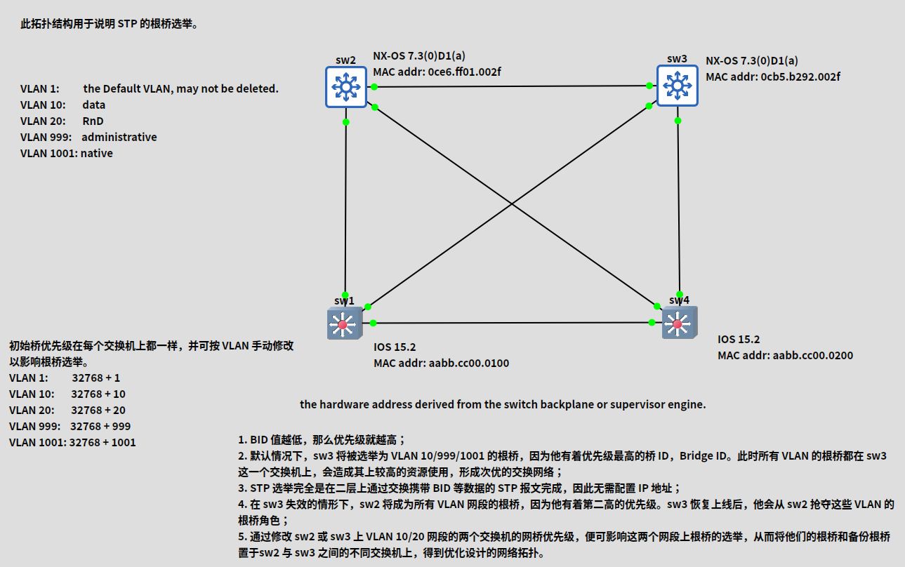

# 生成树根桥选举

默认情况下，在初始化后，所有交换机最初都会假定他们是生成树的根节点/根桥，直到他们与其他交换机交换 BPDU。在交换机交换 BPDU 时，一次选举即被举行，网络中有着最低网桥 ID 的交换机，会被选举为 STP 根桥。当两台或多台交换机有着同一优先级时，那么带有最低顺序 MAC 地址的交换机即被选中。这一概念在下图 10.4 中得以演示。


**图 10.4** -- **选举 STP 根桥**

在图 10.4 中，四台交换机 -- `Switch 1`、`Switch 2`、`Switch 3` 和 `Switch 4` -- 属于同一个 STP 网域。默认情况下，所有交换机都有着 32768 的网桥优先级。为了确定出哪台交换机将成为根桥，进而打破僵局，STP 将根据最低顺序的 MAC 地址，选中交换机。根据这个条件，并参考图 10.4 所示的信息，`Switch 1` 将被选为根桥。

一旦当选，根桥就成为生成树网络的逻辑中心。这并不是说根网桥物理上位于网络的中心。请确保咱们不会做出这种错误假设。

**注意**：重要的是记住，在 STP 根桥选举期间，没有流量经由同一 STP 域下的任何交换机转发。

Cisco 10S 软件允许管理员对根桥选举施加影响。此外，管理员还可以配置一个备份根桥。所谓备份根桥，是一台管理员选取的，在当前根桥失效，或从网络中移除时，会成为根桥的交换机。

该生成树域配置一个备份根桥，始终是种良好做法。这样做允许网络在根网桥失效情况下，具备确定性。最常见做法是在根桥上配置最高优先级（即最低数值），然后在当前根桥发生故障时，接管根桥功能的交换机上配置第二高的优先级。这种做法在下图 10.5 中得以演示。


**图 10.5** -- **选举 STP 根桥（续）**

根据图 10.5 中的配置，这个网络中最有可能当选根桥的交换机，是 `Switch 1`。这是因为，虽然所有优先级值都相同，但这台交换机有着最低顺序的 MAC 地址。在 `Switch 1` 失效的情况下，STP 会选举 `Switch 2` 作为根桥，因为他有着第二低的 MAC 地址。然而，这将造成一种次优的网络拓扑结构。

为解决这一问题，管理员可手动将 `Switch 1` 上的优先级，配置为最低的可能值（0），并将 `Switch 2` 的优先级，手动配置为第二低的可能值（4096）。这样做将确保在根桥（`Switch 1`）失效的情况下，`Switch 2` 将被选为根桥。由于管理员了解拓扑结构，而清楚哪台交换机将接管根网桥功能，因此他们会创建一个更容易排除故障的具有确定性网络。根 ID 承载于 BPDU 中，包括了根网桥的网桥优先级及 MAC 地址。

**考试提示**：当咱们打算强制某台交换机成为根网桥时，咱们可以执行以下操作（另见下图 10.6）。

- 咱们可以手动设置优先级；

```console
Switch(config)#spanning-tree vlan 2 priority ?
  <0-61440>   bridge priority in increments of 4096
```

- 或使用宏命令 `primary` 或 `secondary`，将其设置为根网桥

```console
Switch(config)#spanning-tree vlan 2 root ?
  primary     Configure this switch as primary root for this spanning tree
  secondary   Configure switch as secondary root
```


**图 10.6** -- **强制交换机成为根桥**

```console
SwitchC#show spanning-tree vlan 5
VLAN0005
Spanning tree enabled protocol ieee
Root ID  Priority   0
Address  0000.0000.000c
This bridge is the root
Bridge ID   Priority  0 (priority 0 sys-id-ext 5)
SwitchD#show spanning-tree vlan 5
VLAN0005
Spanning tree enabled protocol ieee
Root ID   Priority  4096
Address  0000.0000.000d
Bridge ID   Priority  4096 (priority 8192 sys-id-ext 5)
```

```console
SwitchD#show spanning-tree vlan 5
VLAN0005
Spanning tree enabled protocol ieee
Root ID   Priority  4096
Address  0000.0000.000d
Bridge ID   Priority  4096 (priority 8192 sys-id-ext 5)
```

请注意，VLAN 编号常会被添加到优先级编号，如下输出中所示。

```console
SwitchA#show spanning-tree vlan 5
Bridge ID   Priority 32773 (priority 32768 sys-id-ext 5)
Address 0013.c3e8.2500
Hello Time  2 sec Max Age 20 sec Forward Delay 15 sec
Aging Time 300
Interface  Role  Sts    Cost   Prio.Nbr  Type
---------  ----  ----   ----   --------  ----
Fa0/15     Desg  FWD    19     128.15    P2p
Fa0/18     Desg  FWD    19     128.18    P2
```

> **译注**：译者在 GNS3 下完成了下面图片中的实验。
>
> 


> *知识点*：
>
> - Spanning Tree Root Bridge Election
>
> - the lowest order MAC address
>
> - the same STP domain
>
> - the logical center of the Spanning Tree network
>
> - the election of the Root Bridge
>
> - a backup Root Bridge for the Spanning Tree domain
>
> - the highest priority
>
> - the second-highest priority
>
> - a deterministic network
>
> - the Root ID
