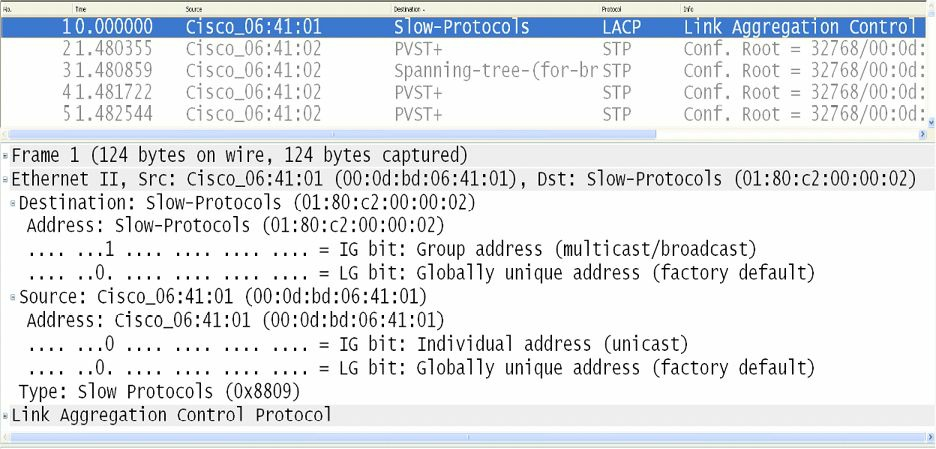

# 链路聚合控制协议概述

链路聚合控制协议 (LACP) 是用于从多条物理链路，创建一条逻辑链路的 [IEEE 802.3ad](https://en.wikipedia.org/wiki/IEEE_802.1ad) 规范的一部分。由于 LACP 与 PAgP 不兼容，因此为了自动形成 EtherChannel 组，链路两侧均需运行 LACP。

与 PAgP 下的情况一样，在配置 LACP 的 EtherChannel 时，所有 LAN 端口必须要是同一速率，并且必须配置为二层或三层的 LAN 端口。当端口通道内的某条链路失效时，早先承载于该失效链路上的流量，就会被切换到该端口通道内的其余链路。此外，当咱们修改某个端口通道中，活动捆绑的端口数量时，流量模式将反映该端口通道的再平衡状态。

LACP 支持通过在端口间交换 LACP 数据包，端口通道的自动创建。他会动态学习端口组的能力，并通知别的端口。一旦 LACP 识别到匹配正确的以太网链路，他就会推动将这些链路，编组为一条 `GigabitEthernet` 的端口通道。与端口要求有着同样速率和双工设置的 PAgP 不同，LACP 规定端口只能是全双工的，因为半双工不受支持。LACP EtherChannel 中的半双工端口，会被置于暂停状态。

默认情况下，端口通道中一条链路上的所有入站广播及组播数据包，都会被阻止返回该端口通道的任何其他链路。LACP 数据包会被发送到 IEEE 802.3 的低速协议组播地址 `01-80-C2-00-00-02`。LACP 的数据帧，以 `EtherType` 值` 0x8809` 编码。下图 11.4 演示了一个以太网数据帧中的这些字段。

**图 11.4** -- **IEEE 802.3 的 LACP 数据帧**

## LACP 端口模式

LACP 支持通过在端口间交换 LACP 数据包，端口通道的自动创建。LACP 通过动态学习端口组的能力，并通知其他端口实现这一功能。一旦 LACP 识别到正确匹配的以太网链路，他就会推动将这些链路编组为一条端口通道。一旦某种 LACP 模式已配置，那么其会在某单个接口被分配到指定的通道组时，才会被更改。LACP 支持两种模式：主动与被动模式。这两种运行模式，会在接下来的小节中介绍。

### LACP 主动模式

LACP 的主动模式，会将某个交换机端口置于一种主动协商状态，在这种状态下，该交换机端口会通过发送 LACP 数据包，发起与远端端口的协商。主动模式是 LACP 的 PAgP `desirable` 模式等价。换句话说，在这种模式下，交换机端口会主动尝试与另一也在运行 LACP 的交换机，建立 EtherChannel。

### LACP 被动模式

当某个交换机端口被配置为被动模式时，他只会在收到另一个 LACP 数据包时，才会就 LACP 通道进行协商。在被动模式下，端口会响应该接口收到的 LACP 数据包，而不会启动 LACP 数据包协商。这种设置最大限度地减少了 LACP 数据包的传输。在该模式下，端口通道组将该接口，吸纳到这个 EtherChannel 捆绑。这种模式类似于 PAgP 用到的 `auto` 模式。

重要的是记住，主动和被动模式均只对非 PAgP 的接口有效。但是，当咱们有个 PAgP EtherChannel，并打算将其转换为 LACP 时，那么 Cisco 10S 软件允许咱们随时更改协议。唯一需要注意的是，这种更改会导致全部既有以太通道，重置到新协议的默认通道模式。下表 11.2 显示了不同的 LACP 组合，及其他们应用于建立两台交换机之间的 EtherChannel 的结果：

**表 11.2** -- **使用不同 LACP 模式时 EtherChannel 的形成**

| `Switch 1` 的 LACP 模式 | `Switch 2` 的 LACP 模式 | EtherChannel 结果 |
| :-- | :-- | :-- |
| `passive` | `passive` | 不会有 EtherChannel 形成 |
| `passive` | `active` | EtherChannel 形成 |
| `active` | `active` | EtherChannel 形成 |
| `active` | `passive` | EtherChannel 形成 |

> *知识点*：
>
> - Link Aggregation Control Protocol
>
> - creating a logical link from multiple physical links
>
> - the formation of EtherChannel group
>
> - the number of active bundled ports in a port channel
>
> - traffic pattern
>
> - the capabilities of port group
>
> - grouping the links into a GigabitEthernet port channel
>
> - inbound Broadcast and Multicast packets
>
> - the IEEE802.3 Slow Protocols Multicast group address, `01-80-C2-00-00-02`
>
> - the `EtherType` value `0x8809`
>
> - two modes: `active` and `passive`
