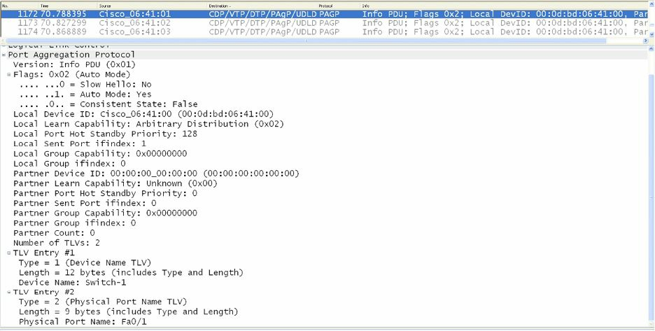

# 端口聚合协议概述

端口聚合协议（PAgP）是一种实现了 EtherChannel 自动创建的 Cisco 专有链路聚合协议。默认情况下，为了协商一条 EtherChannel 的形成，PAgP 的数据包会在具备 EtherChannel 能力的端口间发送。这些数据包会被发送到目的组播 MAC 地址 `01-00-0C-CC-CC-CC`，这也是被 CDP、UDLD、VTP 与 DTP 用到的同一组播地址。下图 11.2 展示了在线路上看到的 PAgP 数据帧内所包含的字段。


**图 11.2** -- **PAgP 的以太网头部**

虽然深入 PAgP 数据包格式细节，超出了 CCNA 考试要求范围，下图 11.3 显示了一个典型 PAgP 数据包中所包含的字段。PAgP 数据包内包含的一些字段，与 CCNA 考试有关，而将在我们学习这一教学模组时详细介绍。




**图 11.3** -- **端口聚合协议的数据帧**

## PAgP 端口模式


PAgP 支持会确定出两台具备 PAgP 能力交换机间，是否将形成 EtherChannel 的不同端口模式。在我们深入探讨这两种 PAgP 端口模式前，有种特殊模式值得特别注意。这种模式（`on` 模式）有时被错误地称为 PAgP 模式。但事实上，他并不是一种 PAgP 的端口模式。


`on` 模式会强制某个端口，被无条件地置于某个通道中。只有另一交换机端口被连接并被配置为 `on` 模式时，通道才将被创建出来。在这一模式启用时，就没有通道协商由本地 EtherChannel 协议完成。换句话说，这将有效地禁用 EtherChannel 协商，而强制端口为通道。这一模式的运行方式，与中继链路上的 `switchport nonegotiate` 命令类似。重要的是要记住，配置为 `on` 模式的交换机接口，不会交换 PAgP 数据包。


使用 PAgP 的交换机 EtherChannel，可被配置为以两种模式之一运行：`auto` 或 `desirable`。这两种 PAgP 运行模式在接下来的小节中介绍。

### `auto` 模式


所谓 `auto` 模式，是一种只有在端口收到一个 PAgP 数据包时，才会与另一 PAgP 端口协商的 PAgP 模式。在这一模式启用后，端口将绝不会发起 PAgP 通信。而是在与邻近交换机创建 EtherChannel 前，端口将被动监听任何收到的 PAgP 数据包。

### `desirable` 模式

`desirable` 模式是一种会引起端口发起，就与另一 PAgP 端口一起的通道，PAgP 协商的 PAgP 模式。换句话说，在这种模式下，端口会主动尝试与另一运行 PAgP 的交换机，建立一条 EtherChannel。

总之，重要的是记住，配置为 `on` 模式的交换机接口，不会交换 PAgP 数据包，但会与配置为 `on` 或 `desirable` 模式的伙伴接口交换 PAgP 数据包。表 11.1 显示了不同的 PAgP 组合，以及在建立一条 EtherChannel 中用到这些组合时的结果：

**表 11.1** -- **使用不同 PAgP 模式时 EtherChannel 的形成**

| `Switch 1` 的 PAgP 模式 | `Switch 2` 的 PAgP 模式 | EtherChannel 结果 |
| :-- | :-- | :-- |
| `auto` | `auto` | 没有 EtherChannel 形成 |
| `auto` | `desirable` | EtherChannel 形成 |
| `desirable` | `auto` | EtherChannel 形成 |
| `desirable` | `desirable` | EtherChannel 形成 |

## PAgP 以太通道协议数据包转发

尽管 PAgP 允许 EtherChannel 中的所有链路用于转发和接收用户流量，但在转发来自一些其他协议的流量方面，有一些咱们应熟悉的限制。DTP 和 CDP 会透过 EtherChannel 下的全部物理接口发送及接收数据包。而 PAgP 则只会在那些已启动且将 PAgP 开启为 `auto` 或 `desirable` 模式的接口上，发送和接收 PAgP 的协议数据单元。

当某条 EtherChannel 捆绑被配置为一个中继端口时，那么该中继链路就会在编号最低的那个 VLAN 上，发送及接收 PAgP 的数据帧。生成树协议 (STP) 总是选择某条 EtherChannel 捆绑中，第一个运行端口。`show pagp [channel number] neighbor` 命令也可用来验证，将被 STP 将用于发送和接收数据包的端口，确定出某条 EtherChannel 捆绑中，STP 将使用的端口，如下输出所示：


```console
Switch-1#show pagp neighbor
Flags:  S - Device is sending Slow hello.   C - Device is in Consistent state.
        A - Device is in Auto mode.         P - Device learns on physical port.

Channel group 1 neighbors
        Partner     Partner         Partner         Partner Group
Port    Name        Device ID       Port    Age     Flags   Cap.
Fa0/1   Switch-2    0014.a9e5.d640  Fa0/1   2s      SC      10001
Fa0/2   Switch-2    0014.a9e5.d640  Fa0/2   1s      SC      10001
Fa0/3   Switch-2    0014.a9e5.d640  Fa0/3   15s     SC      10001
```

参考上面的输出，STP 将只把数据包，在 `FastEthernet0/1` 上发出，因为他是第一个运行的接口。当那个端口失效时，STP 就将在 `FastEthernet0/2` 处发出数据包。由 PAgP 使用的默认端口，可使用 `show EtherChannel summary` 命令查看，如下输出所示：

```console
Switch-1#show EtherChannel summary
Flags:  D - down
        I - stand-alone
        H - Hot-standby (LACP only)
        R - Layer3
        u - unsuitable for bundling
        U - in use
        d - default port
        P - in port-channel
        s - suspended
        S - Layer2
        f - failed to allocate aggregator

Number of channel-groups in use: 1
Number of aggregators: 1

Group  Port-channel  Protocol    Ports
------+-------------+-----------+--------------------------------
1      Po1(SU)       PAgP        Fa0/1(Pd)  Fa0/2(P)    Fa0/3(P)
```

在某条 EtherChannel 上配置环路防护等额外 STP 特性时，重要的是记住，当环路防护阻塞了第一个端口时，那么即使这条通道捆绑中的其他端口正常工作，也不会有 BPDU 透过这条通道发送。这是因为 PAgP 将在属于这个 EtherChannel 组的所有端口上，强制执行统一的环路防护配置。


> **实际应用**
>
> 在生产网络中，咱们可能会遇到由两台物理 Catalyst 6500 系列交换机组成，以一台逻辑交换机运行的 Cisco 的虚拟交换系统 (VSS)。在 VSS 中，一台交换机会被选为活动交换机，而另一台会被选为备用交换机。这两台交换机就是经由 EtherChannel 连接在一起，EtherChannel 实现二者之间控制数据包的发送与接收。
>
> 接入交换机会使用多板卡 EtherChannel（MEC），连接到 VSS。MEC 就是一条跨越两台物理 Catalyst 6500 交换机，终止于是单个逻辑 VSS 的 EtherChannel。增强 PAgP（PAgP+）可用于实现这两台 Catalyst 6500 交换机，在他们之间的 EtherChannel 失效，而将导致两台交换机同时接管主动角色（双主动），有效影响交换网络中流量转发的情形下，通过 MEC 进行通信。这在下图中得以演示。
>
> 
>
> 虽然 VSS 超出了 CCNA 考试要求的范围，但清楚只有 PAgP 可用于中继 VSS 的控制数据包，还是有好处的。因此，当于 VSS 环境，或某种 VSS 最终要实施的环境中，实现 EtherChannels 时，咱们就会要考虑运行 PAgP，而不是作为一项不支持专有 VSS 数据帧的开放标准的 LACP。VSS 将不会在这本指南中进一步介绍。


> *知识点*：
>
> - Port Aggregation Protocol, PAgP
>
> - the automatic creation of EtherChannel
>
> - EtherChannel-capable ports
>
> - the two PAgP port modes
>
> - the `on` mode
>
> - the local EtherChannel protocol
>
> - the `auto` mode
>
> - a PAgP packet
>
> - PAgP Protocol Data Unit
>
> - the first operational port in an EtherChannel bundle
>
> - the first operational interface
>
> - enforce uniform Loop Guard configration on all of the ports that are part of the EtherChannel group
>
> - the Cisco Virtual Switching System, VSS
>
> - a single logical switch
>
> - the active switch
>
> - the standby switch
>
> - Multichassis EtherChannel, MEC
>
> - Enhanced PAgP, PAgP+
>
> - both switches assuming the active role(dual active)
>
> - VSS control packets
>
> - a VSS environment
>
> - the proprietary VSS frames
>
> - the `desirable` mode
