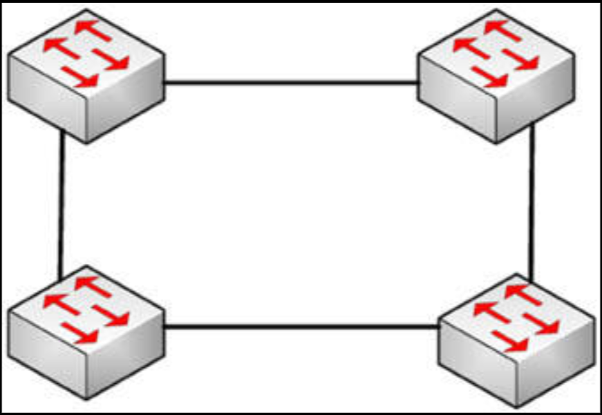
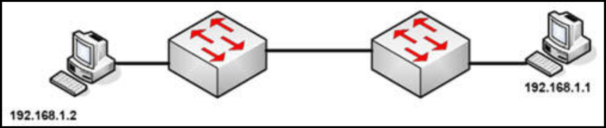
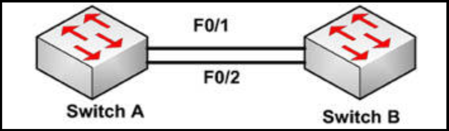

# 第 12 天 复习日

## 第 12 天任务

- 复习前两天的课文；
- 重复前两天的实验；
- 参加 [Free CCNA Training Bonus – Cisco CCNA in 60 Days v4](https://www.in60days.com/free/ccnain60days/) 处今天的考试；
- 阅读 CCNA 补习指南；
- 若咱们愿意，那么就完成以下挑战实验。

## 挑战 1 -- STP

### 拓扑结构

### 实验说明

将两台或四台交换机连接起来。

1. 在所有交换机上都配置 `VLAN 20` 与 `VLAN 30`；
2. 配置所有交换机之间的中继链路；
3. 禁用所有交换机上的 DTP；
4. 通过查看各个 MAC 地址，确定哪台交换机将为根桥；
5. 确定哪个接口将被阻塞；
6. 使用 `show` 命令检查咱们的结果。咱们是正确的吗？

## 挑战 2 -- VLAN 与 STP

### 拓扑结构

### 实验说明

使用控制台连接到交换机。分别将一台 PC 连接到两台交换机，或将交换机连接到一台路由器上的快速以太网端口。

1. 添加 IP 地址到 PC 或路由器的以太网接口；
2. 在两台交换机上创建出 `VLAN 4`；
3. 将 PC 连接的端口，设置为接入端口（虽然是默认的，但无论如何都要完成）；
4. 将两个交换机的端口放入 `VLAN 4`；
5. 将交换机之间的链路配置为中继端口，并开启他们；
6. 等待最多约 30 秒，然后从 `PC` `ping` 向 `PC`；
7. 以 `show spanning-tree vlan 4` 命令，查看哪台交换机为根桥；
8. 以 `spanning-tree vlan 4 priority 0` 命令，将另一交换机设为根桥；
9. 现在检查该交换机是否已成为根桥；
10. 移除这条命令，将原先那台交换机重置为根桥（在命令前加上 `no`）；
11. 现在以 `spanning-tree vlan 4 root primary` 命令，将另一交换机设为根桥。

## 挑战 3 -- EtherChannel

### 拓扑结构

### 实验说明

以交叉网线将两台交换机连接起来（或使用 Packet Tracer）

1. 将所有端口放入 `VLAN 10` 并设置为接入端口；
2. 通过使用 LCAP 创建出一条 EtherChannel。`Switch A` 应主动尝试创建 EtherChannel，而 `Switch B` 则只应在收到一次请求时，才这样做；
3. 执行 `show etherchannel summary` 命令，检查该通道是否起来；
4. 重新加载这两台交换机，并执行同样的操作，但这次要使用 PAgP。

