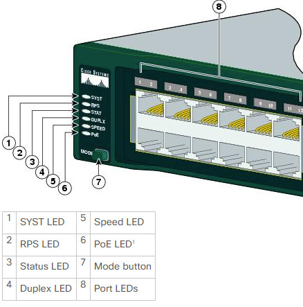

# 物理层上的排错

Cisco 10S 交换机支持可用于排除一层故障，或至少是一些疑似一层层问题的数条命令。不过，除要熟悉软件命令套件外，重要的是要扎实掌握一些，可用于对链路状态故障排除，或指示某种错误情形的物理指示灯（即发光二极管）。

## 使用发光二极管（LED）排除链路状态故障

当咱们具备对一台或一些交换机的物理访问时，那么发光二极管便会是一项有用的故障排除工具。不同的 Cisco Catalyst 交换机，提供了不同的 LED 能力。了解这些 LED 的含义，是 Catalyst 交换机链路状态及系统故障排除不可或缺的一部分。Cisco Catalyst 交换机有着一些可用于确定链路状态，以及诸如系统状态等其他变量的前面板 LED 。

请查看通过 Google 检索 "Catalyst 2960 Switch Hardware Installation Guide"，获取到的 Catalyst 2960 型号交换机的思科文档。这些安装和配置手册，包含了几百页的正文、建议及技术信息等。通读这些文档是值得的，但咱们不要期望从该文档得到 CCNA 考试大纲的内容（ 其在在这本指南中介绍）。

**图 13.1** -- **Cisco 2960 交换机的 LED 指示灯** Image © Cisco Systems

PoE 的 LED 只有 Catalyst 2960 的交换机型号上才会找到。

### 系统 LED 指示灯

系统 LED 指示系统通电（或未通电）并正常运行。下表 13.1 列出了这些 LED 指示灯的颜色及他们所指示的状态。

**表 13.1** -- **系统 LED 指示灯**

| 系统 LED 颜色 | 系统状态 |
| :-- | :-- |
| 不亮 | 系统未加电。 |
| 绿色 | 系统正常运行。 |
| 琥珀色 | 系统已加电，但未正常运行。 |

### RPS LED

RPS LED 仅在具有冗余电源的交换机上才有。下表 13.2 列出了这些 LED 指示灯的颜色及其含义。

**表 13.2** -- **RPS LED 指示灯**

| RPS LED 颜色 | RPS 状态 |
| :-- | :-- |
| 绿色 | RPS 已连接且准备好在需要时提供备份电力。 |
| 绿色闪烁 | RPS 已连接但不可用，因为他正给另一设备供电（冗余已被分配给某台相邻设be）。 |
| 琥珀色 | 该 RPS 处于待机模式或故障状态。按下该 RPS 上的 Standby 或 Active 按钮，这个 LED 指示灯应变为绿色。若他没有变绿，那么这个 RPS 的风扇可能失效。请联系 Cisco Systems 公司。 |
| 琥珀色闪烁 | 交换机的内部电源已失效，同时该 RPS 正为交换机供电（冗余已分配给这一设备）。 |

### 端口的 LED 指示灯与模式

端口 LED 指示灯给到有关一组端口或单个端口的信息，如下表 13.3 中所示。

**表 13.3** -- **端口 LED 指示灯的模式**

| 选定模式的 LED | 端口模式 | 描述 |
| :-- | :-- | :-- |
| 1 - 系统 |  |  |
| 2 - RPS |  | RPS 的状态 |
| 3 - 状态 | 端口状态 | 该端口的状态（默认模式） |
| 4 - 双工 |  | 双工模式：全双工或半双工 |
| 5 - 速率 | 端口速率 | 端口的运行速率： 10、100 或 1000Mbps |
| 6 - PoE | PoE 端口供电 | PoE 的状态 |
| 7 - 模式 |  | 在状态、双工及速率 LED 指示灯间循环 |
| 8 - 端口 |  | 含义因模式而异 |

通过按下模式按钮，咱们可在模式中循环，直至咱们达到咱们所需的模式设置。这将改变端口 LED 颜色的含义，如下表 13.4 中所示。

**表 13.4** -- **模式设置**

<table>
<tr>
<th>端口模式</th><th>LED 指示灯颜色</th><th>系统状态</th>
</tr>
<tr>
<td rowspan=6>状态</td>
<td>不亮</td>
<td>无链路或管理性关闭。</td>
</tr>
<tr>
<td>绿色</td><td>链路存在。</td>
</tr>
<tr>
<td>绿色闪烁</td><td>活动的：端口在发送或接收数据。</td>
</tr>
<tr>
<td>绿色琥珀色交替</td><td>链路故障：错误的数据帧会影响连通性，过多冲突、循环冗余校验（CRC）、对齐和抖动等错误都会作为链路故障指标而受监控。（译注：请参考 <a href="../pdfs/EthernetErrorDescription.pdf" >以太网错误描述</a>, <a href="../pdfs/EthernetErrors.pdf">以太网错误</a>）。</td>
</tr>
<tr>
<td>琥珀色</td><td>端口被生成树协议 (STP) 阻塞，而未在转发数据。  **注意**：在某个端口被重新配置后，由于 STP 会就可能的环路检查网络拓扑，因此该端口的 LED 指示灯会保持琥珀色长达 30 秒。</td>
</tr>
<tr>
<td>琥珀色闪烁</td><td>端口被 STP 阻塞，而未在发送或接收数据。</td>
</tr>
<tr>
<td rowspan=2>双工</td><td>不亮</td><td>端口正以半双工方式运行。</td>
</tr>
<tr>
<td>绿色</td><td>端口正以全双工方式运行。</td>
</tr>
<tr>
<td rowspan=8>速率</td><td colspan=2>10/100 及 10/100/1000Mbps 的端口</td>
</tr>
<tr>
<td>不亮</td><td>端口正以 10Mbps 速率运行。</td>
</tr>
<tr>
<td>绿色</td><td>端口正以 100Mbps 速率运行。</td>
</tr>
<tr>
<td>绿色闪烁</td><td>端口正以 1000Mbps 运行。</td>
</tr>
<tr>
<td colspan=2>SPF 端口</td></tr>
<tr>
<td>不亮</td><td>端口正以 10Mbps 速率运行。</td>
</tr>
<tr>
<td>绿色</td><td>端口正以 100Mbps 速率运行。</td>
</tr>
<tr>
<td>绿色闪烁</td><td>端口正以 1000Mbps 速率运行。  **注意**：当 SPF 安装在 Catalyst 2960 交换机中时，1000BASE-T SFP 的模组，可运行于全双工模式下的 10、100 或 1000Mbps 速率，或半双工模式下的 10 或 100Mbps 速率。</td>
</tr>
<tr>
<td rowspan=5>PoE</td><td>不亮</td><td>PoE 关闭。当受电设备正从交流电源接收电力时，那么即使该受电设备连接到这个交换机端口，PoE 的端口 LED 也不亮。</td>
</tr>
<tr>
<td>绿色</td><td>PoE 开启。端口 LED 只在这个交换机端口正供电时才是绿色。</td>
</tr>
<tr>
<td>绿色和琥珀色交替</td><td>
因为提供到受电设备的电力，将超出交换机供电能力，PoE 已被拒绝。Catalyst 2960-24PC-L、2960 48PST-L、2960-48PST-S 及 2960-24PC-S 交换机最多可提供 370 W 的电力。Catalyst 2960-24LT-L 和 2960-24LC-S 交换机则最多可提供 124 W 的电力。</td>
</tr>
<tr>
<td>琥珀色闪烁</td><td>PoE 因故障关闭。 **注意**：PoE 故障会在存在不符合标准的布线或受电设备连接到 PoE 端口时引发。只能符合标准的布线，才能用于将 Cisco 预标准 IP 电话、无线接入点，或符合 IEEE 802.3af 标准的设备等连接到 PoE 端口。咱们移除网络中造成 PoE 故障的网线或设备。</td>
</tr>
<tr><td>琥珀色</td><td>该端口的 PoE 已被关闭。默认情况下 PoE 是开启的。</td></tr>
</table>

除了掌握这些不同 LED 指示灯颜色的含义外，同样重要的是，要掌握要采取什么措施解决问题。例如，假设咱们正在排除一台 Catalyst 6500 系列交换机故障，咱们注意到监控引擎（或任何交换模组）的 LED 状态指示灯为红色或熄灭。在这种情况下，可能是该模组移出了他的插槽，或者在其是个新模组情况下，其未被正确插入机架。在这种情况下，建议操作便是重新安装这个模组。而在某些情况下，可能还需要重启整个系统。

当某条链路或某个端口的 LED 指示灯颜色不是绿色时，就通常表明某种失效或别的问题，重要的是记住，绿色的链路指示灯，并不总是意味着网线完全正常。例如，单根断线或一个关闭的端口，就可能造成一侧显示绿色链路指示灯，而另一侧不显示绿色链接指示灯的故障。这可能是因为网线遇到了导致其功能处于边缘水平的某种机械压力。在这种情况下，CLI 便可用于执行一些额外故障排除。

> *知识点*：
>
> - the software command suite
>
> - physical indicators, i.e., LEDs
>
> - an error condition
>
> - Light Emitting Diodes, LEDs
>
> - a useful troubleshooting tool
>
> - understanding the meaning of the LEDs is an integral part of the Catalyst switch link status and system troubleshooting
>
> - a redundant power supply, RPS
>
> - Port LEDs
>
> - the Mode button
>
> - small form-factor pluggable, SPF，小封装可插拔
>
> - the supervisor engine
>
> - the chassis
>
> - to reseat the module
>
> - the cable encountered physical stress that caused it to be functional at a marginal level

## 排除线缆故障

在排除布线故障（一层故障排除）时，有时会很容易发现问题，因为咱们可直接看到并检查线缆。不过，有时布线问题则会是看不见的，因此咱们将必须进行一次系统的故障排除过程，确保问题确实位于一层。一条一般建议是，在进行一次复杂基础设施部署前，要妥当测试所有布线。一些常见布线问题包括以下这些：

- 插入线缆却没有连接；
- 插入线缆并得到连接，但该连接上的吞吐量极低；
- 一切工作正常，但该连接会突然中断，然后又恢复，然后又中断（即 “抖动”）；
- 间歇性的连通性，其中似乎工作正常，但信号不时会丢失；

针对这些问题的一些建议测试项包括：

- 检查交换机链路指示灯是否亮起；
- 检查该链路指示灯是否间歇性地打开和关闭；
- 检查线缆是否正确压接；
- 检查线缆是否物理损坏；
- 检查线缆是否过长（这会造成信号衰减）；
- 检查线缆连接头无故障（咱们可能需要使用另一连接头）；
- 检查导线的针脚顺序是否正确（在铜线缆情形下）。

当咱们想要确定咱们遇到的不是布线问题时，最简单方法就是更换线缆，然后再次运行同一测试。这非常容易做到，而可能在无需投入大量时间和资源到故障排除过程下，有助于立即解决问题。

**注意**：有时，即使是全新线缆也会存在缺陷，因此不要认为一条新网线就应发挥预期功能。

## 模组问题的故障排除

企业网络中用到的大多数路由器和交换机，都提供铜缆端口的连通性，但同时也有可装入不同类型收发器的一些专用端口。这些收发器通常用于光纤连接，但也有一些兼容铜缆的收发器。

光纤连接可在很长距离上运行，一般来说，这些特定端口都是模组化的，并需要兼容的 SFP（小型可插拔收发器），如下图 13.2 中所示这个。

**图 13.2** -- **SFP 模组**

虽然他们看起来相似，但根据所使用的连接类型，应根据几个参数，使用恰当的 SFP 模块，包括：

- 介质类型：光纤或铜缆；
- 光纤类型：单模或多模光纤；
- 带宽
- 波长
- 纤芯尺寸
- 模态带宽
- 运行距离

**注意**：在为咱们的网络采购收发器时，咱们应始终检查兼容性。

收发器可在不重启设备下，随时插入或拔出网络设备（如交换机、路由器、防火墙等）。当无连接连接时，你将看到 SFP 模组上没有活动，当咱们有着到设备的访问时，这就是要排除故障的最简单问题之一。

另一方面，咱们可能要插入一根将激活该端口的光纤，而连通性会遭受不同故障的影响（如性能降级或间歇性的连通性），或者连通性根本没有。在这种情况下，咱们可采取数种方法：

- 根据收发器类型，检查是否已使用正确的线缆类型（多模与单模）；
- 使用专门的光纤测试工具，检查线缆是否断裂；
- 检查是否已使用的正确类型的收发器；
- 检查收发器有无硬件故障（更换收发器到另一 SFP 并测试连接）；
- 根据所用收发器及线缆类型，检查设备端口是否以正确参数配置。

为将连接停机时间降至最低，咱们应监控插有 SFP 模组的那些端口，以查看出现于统计数据中的那些可能报错信息。这可以一些标准的监控工具完成，而他们中大多数通常会用到 SNMP。

> *知识点*：
>
> - module issues
>
> - copper port connectivity
>
> - dedicated ports that can be populated with different kinds of transceivers
>
> - fiber connectivity
>
> - copper-compatible transceivers
>
> - small form-factor pluggable transceiver, SFP
>
> - SFP Module
>
> - Type of media: optical fiber or copper
>
> - Fiber type: single-mode or multimode fiber
>
> - Wavelength
>
> - Core size
>
> - Modal bandwidth
>
> - multi-mode vs. signle-mode
>
> - dedicated fiber optic testing tools
>
> - connection downtime
>
> - the ports populated with SFP modules
>
> - standard monitoring tools, most often using SNMP
