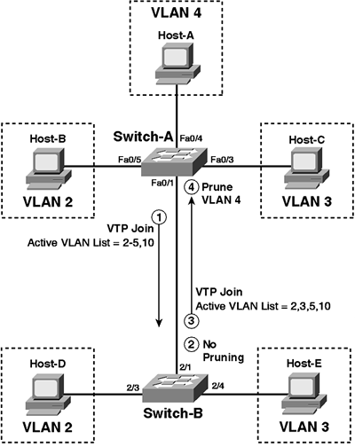

# VLAN 与中继的故障排除


在第 6 天和第 7 天，我们介绍了这一主题，但值得再次讨论。我们不会重复已经讲过的内容，而是会介绍一些其他的故障排除方面。前面，我们讨论了三个 CLI 命令的使用，这些命令可用于物理层问题的故障排除。本节将介绍识别和排除 VLAN 内连接问题的一些常见方法。造成 VLAN 内连接问题的一些常见原因包括以下几点：
双工不匹配
NIC 或电缆损坏
拥塞
硬件问题
软件问题
资源超额订购
## VLANs及中继排错

**Troubleshooting VLANs and Trunking**

先前的小节中，我们谈到可用用于物理层故障排除的三个命令行命令的使用。本节将给出一些用于对 VLAN 内倍连通性故障进行鉴别及排错的常见方法（the use of three CLI commands that can be used for troubleshooting Physical Layer issues. this section describes some common approaches to identifying and troubleshooting intra-VLAN connectivitiy issues）。 VLAN 内部连通性故障的一些相对来讲更为常见的原因，有下面这些。

- 双工不匹配，duplex mismatches
- 坏的网卡或网线，bad NIC or cable
- 壅塞，congestion
- 硬件故障，hardware issues
- 软件故障, software issues
- 资源过度预订, resource oversubscription, [Cisco MDS交换机端口组速率模式介绍](pdfs/EMC_Community_Network-ECN_Cisco_MDS交换机端口组速率模式介绍.pdf)
- 配置问题，configuration issues

**双工不匹配**可导致甚低网络性能及连通性。尽管已有对自动协商的改进，同时采行自动协商被认为是有效的做法，双工不匹配仍有可能发生。比如，在网卡设置为100/Full，而交换机端口是自动协商时，网卡将保持其100/Full设置，但交换机端口将被设置为100/Half。而与此相反，也会出现双工不匹配的问题。也就是网卡设置自动协商，交换机端口设置为100/Full。此时，网卡将自动协商为100/Half，而交换机端口保持其静态的100/Full配置，导致双工不匹配。

因此好的做法就是在那些可以手动设置的地方，对10/100以太网连接的速率和双工手动进行设置，以避免自动协商带来的双工不匹配问题。**双工不匹配可能不仅会对直接连接到交换机上的用户造成影响，还可能对有着不匹配双工设置的交换机间连接上通过的网络流量造成影响。**使用命令`show interface`就可以查看到端口的接口速率和双工设置。

> **注意：** 因为 Catalyst 交换机仅支持 1Gbps 链路全双工，所以对于 GigabitEthernet 连接，双工问题并不常见。

思科 IOS 软件中的多个计数器都可用来鉴别潜在**坏网卡或网线问题**。通过对不同的`show`命令中的一些计数器的检查，来识别网卡或网线问题。比如，假设交换机端口计数器显示带有无效 CRC 或 FCS 错误的帧数持续增长，就有极大可能是因为工作站或机器的坏网卡，以及坏的网线。

网络壅塞同样可能引起交换网络中的间隙性连通故障。 VLAN 超载的第一个表象就是某端口上的接收或发送缓冲过度预订(oversubscribed)。此外，端口上过多的帧丢弃也是网络壅塞的指标。而网络壅塞的常见原因，就是对主干连接的聚合带宽需求估计不足。那么，**壅塞问题就可以通过配置以太网信道或往现有以太网信道中加入更多的端口，得到解决。**同时网络壅塞又是连通性故障的常见原因，同时重要的是要知道**交换机本身可能经历壅塞问题，而交换机本身的壅塞问题有可能会对网络性能产生类似的影响**（a common cause of network congestion is due to underestimating aggregate bandwidth requirements for backbone connections. In such cases, congestion issues can be resolved by configuring EtherChannels or by adding additional ports to existing EtherChannels. While network congestion is a common cause of connectivity issues, it is also important to know that the switch itself can experience congestion issues, which can have a similar impact on network performance）。

**交换机内部壅塞**，有限的交换机带宽可能导致壅塞问题，由此造成的壅塞可能对网络性能造成极为严重的影响。在 LAN 交换中，带宽是指交换机内部交换线路（[the switch fabric](pdfs/the_Definition_of_a_Switch_Fabric-EtherealMind.pdf)）的传输能力。因此，如果交换线路的传输能力是`5Gbps`, 而要尝试将`7Gbps`的流量通过交换机传输，结果就是数据包丢失及差强人意的网络性能了。在那些所有端口的聚合传输容量可能超出总的骨干容量的超出预订平台上，这是一个常见的问题（this is a common issue in oversubscribed platforms, where the aggregate capacity of all ports can exceed the totoal backplane capacity）。

在交换 LAN 中，**硬件故障**也可能引起连通性问题。这类问题的实例包括交换机的坏端口或坏模块。尽管在可能的情况下可以通过查看诸如 LEDs 等物理指示器来对这类故障进行排错，某些时候这类问题是难于排错及诊断的。在怀疑存在潜在的硬件故障的多数情况下，都应需求技术支持中心（Technical Assistance Centre, TAC）的支持。

相比上面这些问题，软件缺陷（software bugs）就更难于分辨出来，因为软件缺陷引起难于对其进行排错的偏差（ deviation ）。在怀疑有软件缺陷导致连通性问题时，应该就发现的问题，联系技术支持中心（ TAC ）。此外，如在控制台或日志中有打印出错误消息，就也可以使用思科提供的一些在线工具，来采取一些替代方法（implement a workaround）或是得到某个已经解决该问题并得到验证的软件版本的建议。

与其它硬件设备相比，交换机有着受限的资源，比如物理内存。在这些资源过度使用时，就会导致严重的性能问题。而像是高 CPU 使用率这样的问题，就可能对交换机及网络性能造成极为严重的影响。

最后，如同其它技术一样，**不正确的配置同样会直接或间接地造成连通性问题**。比如，根桥放置粗劣就会导致慢速用户连通性。而将一台不当配置的交换机直接加入到生产网络，则会导致一些或全部用户的网络连接完全中断（the poor placement of the Root Bridge may result in slow connectivity for users. Directly integrating or adding an incorrectly configured switch into the production network could result in an outright outage for some or all users）。下面的小节对一些常见的 VLAN 相关故障、其可能的原因，以及为排除这些故障可采取的做法，进行了讲解。

### 动态 VLAN 通告排错

**Troubleshooting Dynamic VLAN Advertisements**

思科 Catalyst 交换机使用 VLAN 中继协议（VLAN Trunk Protocol, VTP）来在交换域中传播 VLAN 信息（propagate VLAN information dynamically throughout the switched domain）。 VTP 是一个思科专有的二层报文发送协议，用于管理位处同一 VTP 域中的交换机上 VLANs 的添加、删除及重命名。

某台交换机在加入到 VTP 域时无法动态接收任何 VLAN 信息的原因有好几个。下面是一些常见的原因。

- 二层中继配置错误，Layer 2 trunking misconfiguration
- 不正确的 VTP 配置，incorrect VTP configuration
- 配置修订号，configuration revision number
- 物理层故障, Physical Layer issues
- 软件或硬件故障或缺陷，software or hardware issues or bugs
- 交换机性能问题, switch performance issues

为令到交换机采用 VTP 交换 VLAN 信息，交换机间必须建立中继链路。思科 IOS 交换机支持 ISL 和802.1Q两种中继机制。尽管一些交换机默认采用 ISL 这种思科专有中继机制，不过当前思科IOS Catalyst交换机默认都采用802.1Q了。在提供交换机间中继时，手动指定中继封装协议被认为是好的做法。这是通过在将链路配置为中继端口时，使用接口配置命令`switchport trunk encapsulation [isl|dot1q]`完成的。

可用于对中继连通性问题进行排错的命令有好几个。可使用`show interfaces`命令来检查基本的端口运行及管理性状态（you can use the `show interfaces` command to verify basic port operational and administrative status）。此外，可通过在`show interfaces`命令后追加`trunk`或`errors`关键字来进行额外排错和检查。 而命令`show interfaces [name] counters trunk`则可用于查看中继端口上传输和接收到的帧数目。

该命令的输出还包括了封装错误数，而封装错误数可用于检查802.1Q和 ISL ，以及中继封装不匹配数目，如下面的输出所示。

```console
Cat-3550-1#show interfaces FastEthernet0/12 counters trunk
Port    TrunkFramesTx   TrunkFramesRx   WrongEncap
Fa0/12           1696           32257            0
```

参考上面的输出，可以反复执行该命令，以确保 Tx 及 Rx 栏是持续增长的，并以此完成更多的排错。比如，假设该交换机没有发出任何帧，则该接口就可能并未配置为中继接口，或者其是宕掉的或关闭的（or it might be down or disabled）。而如果 Rx 栏没有增长，则可能是远端交换机未有正确配置。

用于对可能的二层错误配置进行排错的另一个命令，就是`show interfaces [name] trunk`。该命令的输出包含了中继封装协议及模式、802.1Q的原生 VLAN 、允许通过中继链路 VLANs 、 VTP 域中活动的 VLANs ，以及被修剪掉的 VLANs （the output of `show interfaces [name] trunk` includes the trunking encapsulation protocol and mode, the native VLAN for 802.1Q, the VLANs that are allowed to traverse the trunk, the VLANs that are active in the VTP domain, and the VLANs that are pruned）。**一个 VLAN 传播的常见问题，就是上游交换机已通过使用接口配置命令`switchport trunk allowed vlan`，被配置为对某些 VLANs 进行过滤。**命令`show interfaces [name] trunk`的输出如下所示。

```console
Cat-3550-1#show interfaces trunk
Port    Mode        Encapsulation   Status      Native vlan
Fa0/12  desirable   n-802.1q        trunking    1
Fa0/13  desirable   n-802.1q        trunking    1
Fa0/14  desirable   n-isl           trunking    1
Fa0/15  desirable   n-isl           trunking    1
Port    Vlans allowed on trunk
Fa0/12  1-4094
Fa0/13  1-4094
Fa0/14  1-4094
Fa0/15  1-4094
Port    Vlans allowed and active in management domain
Fa0/12  1-4
Fa0/13  1-4
Fa0/14  1-4
Fa0/15  1-4
Port    Vlans in spanning tree forwarding state and not pruned
Fa0/12  1-4
Fa0/13  none
Fa0/14  none
Fa0/15  none
```

**另一个常见中继错误配置故障就是原生 VLAN 不匹配。**在配置802.1Q中继链路时，中继链路两端的原生 VLAN 必须匹配；否则该链路便不会工作。如存在原生 VLAN 不匹配， STP 就会将该端口置为端口VLAN ID不一致状态（a port VLAN ID(PVID) inconsistent state），且不会在该链路上进行转发。在此情况下，将有类似于下面的消息在控制台或日志中打印出来。

```console
*Mar 1 03:16:43.935: %SPANTREE-2-RECV_PVID_ERR: Received BPDU with inconsistent peer vlan id 1 on FastEthernet0/11 VLAN2.
*Mar 1 03:16:43.935: %SPANTREE-2-BLOCK_PVID_PEER: Blocking FastEthernet0/11 on VLAN0001. Inconsistent peer vlan.
*Mar 1 03:16:43.935: %SPANTREE-2-BLOCK_PVID_LOCAL: Blocking FastEthernet0/11 on VLAN0002. Inconsistent local vlan.
*Mar 1 03:16:43.935: %SPANTREE-2-RECV_PVID_ERR: Received BPDU with inconsistent peer vlan id 1 on FastEthernet0/12 VLAN2.
*Mar 1 03:16:43.935: %SPANTREE-2-BLOCK_PVID_PEER: Blocking FastEthernet0/12 on VLAN0001. Inconsistent peer vlan.
*Mar 1 03:16:43.939: %SPANTREE-2-BLOCK_PVID_LOCAL: Blocking FastEthernet0/12 on VLAN0002. Inconsistent local vlan.
```

尽管 STP 排错将在本书后面进行讲解，该不一致状态仍可通过使用`show spanning-tree`命令进行查证，如下面所示。

```console
Cat-3550-1#show spanning-tree interface FastEthernet0/11
Vlan                Role    Sts     Cost        Prio.Nbr    Type
------------------- ----    ---     --------    --------    ----------------
VLAN0001            Desg    BKN*    19          128.11      P2p *PVID_Inc
VLAN0002            Desg    BKN*    19          128.11      P2p *PVID_Inc
```

如已经查明该中继链路确实是正确配置，及两台交换机间是可运作的，接下来就应对 VTP 配置参数进行检查了。这些参数包括 VTP 域名、正确的 VTP 模式及 VTP 口令，如对该 VTP 域配置了某个参数，就要使用相应的`show vtp status`及`show vtp password`命令。`show vtp status`命令的输出如下所示。

```console
Cat-3550-1#show vtp status
VTP Version                     : running VTP2
Configuration Revision          : 0
Maximum VLANs supported locally : 1005
Number of existing VLANs        : 8
VTP Operating Mode              : Server
VTP Domain Name                 : TSHOOT
VTP Pruning Mode                : Enabled
VTP V2 Mode                     : Enabled
VTP Traps Generation            : Disabled
MD5 digest                      : 0x26 0x99 0xB7 0x93 0xBE 0xDA 0x76 0x9C
...
[Truncated Output]
```

在应用`show vtp status`命令时，要确保交换机使用同一版本的 VTP 。默认情况下， Catalyst 交换机允许 VTP 版本`1`。而运行 VTP 版本`1`的交换机是不能加入到 VTP 版本`2`的域中的。而如某交换机不兼容 VTP 版本`2`, 那么就要使用全局配置命令`vtp version`，将所有 VTP 版本`2`的交换机配置为运行版本`1`。

> **注意：** 如在服务器上修改了 VTP 版本，那么此改变将自动传播到 VTP 域中的客户端交换机。

VTP客户端/服务器（clinet/server）或服务器/服务器(server/server)设备上的 VTP 传播是开启的。而如果在某台交换机上 VTP 是关闭的（也就是透明模式），那么该交换机将不会经由 VTP 动态地接收 VLAN 信息。不过，要留意**VTP版本 2 的透明模式交换机，将在其中继端口转发出接收到的 VTP 通告，而充当 VTP 中继。**就算 VTP 版本不一样，该过程也会照常进行。域中交换机上的 VTP 域名称也应保持一致。

最后，`show vtp status`命令的输出也包含了用于认证目的的 MD5 散列值。该散列值是从 VTP 域名称和密码生成的，域中所有交换机上的该散列值应是一致的。而如在这些交换机上的域名称和密码不同，则计算出的 MD5 也会不同。而如域名称或密码不同，那么`show vtp status`命令就会示出一条 MD5 摘要校验和不匹配（an MD5 digest checksum mismatch）消息，如下面的输出所示。

```console
Cat-3550-1#show vtp status
VTP Version                     : running VTP2
Configuration Revision          : 0
Maximum VLANs supported locally : 1005
Number of existing VLANs        : 8
VTP Operating Mode              : Server
VTP Domain Name                 : TSHOOT
VTP Pruning Mode                : Enabled
VTP V2 Mode                     : Enabled
VTP Traps Generation            : Disabled
MD5 Digest                      : 0x26 0x99 0xB7 0x93 0xBE 0xDA 0x76 0x9C
*** MD5 digest checksum mismatch on trunk: Fa0/11 ***
*** MD5 digest checksum mismatch on trunk: Fa0/12 ***
...
[Truncated Output]
```

最后，在应用 VTP 时，**配置修订号可能会造成严重破坏。 VTP 域中的交换机使用配置修订号来保持对域中最新信息的跟踪**（the configuration revision number can wreak havoc when using VTP. Switches use the configuration revision number to keep track of the most recent information in the VTP domain）。域中所有交换机都将其前一次从一条 VTP 通告中收听到的配置修订号存储起来，同时在每次接收到新信息时该号码都被增加。而在任何交换机接收到带有高于其自身配置修订号的通告报文时，都将覆写任何存储的 VLAN 信息，并将其自身存储的 VLAN 信息与所接收到的通告报文中的信息进行同步。

因此，如想知道为何加入到 VTP 域中的交换机没有接收任何的 VLAN 信息，那么可能是该交换机已有一个较高的配置修订号，而导致所有其它交换机覆写了它们的本地 VLAN 信息，并将本地 VLAN 信息替换成了接收自新交换机的通告报文中的 VLAN 信息。为避免此种情形，**在将新的交换机加入到某 VTP 域之前，总是要确保其配置修订号被设置为 0 。**这可以通过在该交换机上修改 VTP 模式或修改 VTP 域名称完成。配置修订号在命令`show vtp status`的输出中有包含。

### VLAN内部端到端连接丢失

**Troubleshooting Loss of End-to-End Intra-VLAN Connectivity**

某个 VLAN 中端到端连通性丢失有好几个原因。而最常见的原因包括下面这些。

- 物理层故障，Physical Layer issues
- VTP修剪，VTP pruning
- VLAN中继链路过滤，VLAN trunk filtering
- 新的交换机，new switches
- 交换机性能问题，switch performance issues
- 网络壅塞, network congestion
- 软件或硬件问题或缺陷，software or hardware issues or bugs


> **注意：** 为简明扼要地讲解，这里只会对中继、 VTP 修剪、以及往域内新加入交换机三个方面进行说明。软件或硬件问题或缺陷及交换机性能问题在本书中已有说明。而物理层排错在本模块早前已经进行了讲解。


**VTP修剪在没有本地端口属于某些 VLANs 时，将那些 VLANs 从本地交换机的 VLAN 数据库中移除。**VTP修剪通过消除不必要的广播、多播及通过网络泛洪的那些未知流量，而提升中继链路效率（VTP pruning increases the efficiency of trunks by eliminating unnecessary Broadcast, Multicast, and unknown traffic from being flooded across the network）。

尽管 VTP 修剪是一项值得部署的特性，但不正确的配置或是部署可能导致端到端连通性的丢失。应仅在客户端/服务器环境中开启（in client/server environments）。在包含透明模式交换机的网络中应用修剪，就可能造成连通性丢失。如网络中有一或多台的交换机处于 VTP 透明模式，就应该要么对整个 VTP 域全局关闭修剪，否则就要通过在适当的接口下，使用接口配置命令`switchport trunk pruning vlan`, 以确保到上游的透明模式交换机中继链路上的 VLANs 都无资格修剪（也就是它们在这些链路上不被修剪，ensure that all VLANs on the trunk link(s) to the upstream transparent mode switch(es) are pruning ineligible, i.e., they are not pruned，using the `switchport trunk pruning vlan` interface configuration command under the applicable interfaces）。

**对放行的 VLANs 及中继状态进行检查**

**Verify Allowed VLANs and Trunk Status**

除了 VTP 修剪外，交换机中继链路上对 VLANs 的不正确过滤，也可能导致端到端 VLAN 连通性的丢失。**默认允许所有 VLANs 通过所有中继链路；**但是思科 IOS 软件允许管理员通过使用接口配置命令`switchport trunk allowed vlan`，在指定中继链路上选择性地移除（或加入） VLANs 。可以使用命令`show interfaces [name] trunk`及`show interfaces [name] switchport`，来查看中继链路上被修剪和限制的 VLANs 。作为检查某个中继端口上放行 VLANs 最容易的方式，命令`show interfaces [name] trunk`的输出如下所示。

```console
Cat-3550-1#show interfaces trunk
Port    Mode    Encapsulation   Status      Native vlan
Fa0/1   on      802.1q          trunking    1
Fa0/2   on      802.1q          trunking    1
Port    Vlans allowed on trunk
Fa0/1   1,10,20,30,40,50
Fa0/2   1-99,201-4094
Port    Vlans allowed and active in management domain
Fa0/1   1,10,20,30,40,50
Fa0/2   1,10,20,30,40,50,60,70,80,90,254
Port    Vlans in spanning tree forwarding state and not pruned
Fa0/1   1,10,20,30,40,50
Fa0/2   1,40,50,60,70,80,90,254
```

同样要检查中继链路上通告的正确 VLANs 。在中继链路上放行的不适当 VLANs 可能引起功能缺失或安全问题。也想要确保中继链路两端有着同样的放行 VLANs （Inproper VLANs allowed on the link can lead to a lack of functionality or security issues. Also, you want to make sure that the same VLANs are allowed on both ends of a trunk）。

> **注意：** 在将另外的需要在某条中继链路上放行的VLAN(s)加入进去时，应非常谨慎地不要忘记关键字`add`。比如，在已经配置了`switchport trunk allowed vlan 10, 20`，而打算同样放行VLAN 30时，就需要输入命令`switchport trunk allowed vlan add 30`。而如只是简单地配置`switchport trunk allowed vlan 30`，那么先前所允许的VLANs 10和 20 就会从中继链路上移除，这将导致VLANs 10和 20 的通信中断。

由命令`show interfaces trunk`命令所提供的另一重要信息，就是中继端口状态。中继端口状态信息确认该中继链路是否形成，同时必须要在链路两端对此进行检查。如该端口未处于“中继”模式，此时最重要的就是必须对端口中继运作模式（the mode of operation, o/auto等）进行检查，看看在该模式下是否能与链路另一端形成中继状态。

**检查封装类型**

**Verify Encapsulation Type**

解决中继故障的另一重要步骤，就是查明中继链路两端所配置的正确封装类型。大多数思科交换机都允许 ISL 及802.1Q封装类型。而尽管大多数现代网络都是设计使用dot1Q, 仍然可能存在一些网络优先使用 ISL 的情形。封装类型是通过使用接口配置命令`switchport trunk encapsulation <type>`配置的。而可用于查看封装类型的命令如下。

- `show interfaces trunk`
- `show interfaces <number> switchport`

在某个已被静态配置为802.1Q中继链路端口上的`show interfaces [name] switchport`命令的输出如下所示。

```console
Cat-3550-2#show interfaces FastEthernet0/7 switchport
Name: Fa0/7
Switchport: Enabled
Administrative Mode: trunk
Operational Mode: trunk
Administrative Trunking Encapsulation: dot1q
Operational Trunking Encapsulation: dot1q
Negotiation of Trunking: On
Access Mode VLAN: 1 (default)
Trunking Native Mode VLAN: 1 (default)
Administrative Native VLAN tagging: enabled
Voice VLAN: none
Administrative private-vlan host-association: none
Administrative private-vlan mapping: none
Administrative private-vlan trunk native VLAN: none
Administrative private-vlan trunk native VLAN tagging: enabled
Administrative private-vlan trunk encapsulation: dot1q
Administrative private-vlan trunk normal VLANs: none
Administrative private-vlan trunk associations: none
Administrative private-vlan trunk mappings: none
Operational private-vlan: none
Trunking VLANs Enabled: 3,5,7
Pruning VLANs Enabled: 2-8
Capture Mode Disabled
Capture VLANs Allowed: ALL
Protected: false
Unknown unicast blocked: disabled
Unknown multicast blocked: disabled
Appliance trust: none
```

如之前小节所说到的，网络中一台新交换机的加入，可能导致管理域中 VLAN 信息的丢失（the integration of a new switch into the network can result in a loss of VLAN information in the management domain）。而此 VLAN 信息丢失又可能导致同一 VLAN 中设备间连通性的丢失。所以在将新交换机加入到 LAN 之前，一定要确保其配置修订号被重置到 0 。

### 使用“show vlan”命令

**Using the "show vlan" Command**

除了在前面几个小节中介绍的那些命令外，还有一些用于对 VLAN 配置进行检查和排错的有用思科 IOS 软件的命令。最常用到的 VLAN 检查和排错命令之一就是`show vlan`命令了。该命令显示管理域内所有 VLANs 的参数，如下面的输出所示。

```console
Cat-3550-1#show vlan
VLAN Name                             Status    Ports
---- -------------------------------- --------- -------------------------------
1    default                          active    Fa0/11, Fa0/12,
                                                Fa0/13, Fa0/14,
                                                Fa0/20, Fa0/21,
                                                Fa0/22, Fa0/23,
                                                Fa0/24
150  VLAN_150                         active    Fa0/2, Fa0/3, Fa0/4,
                                                Fa0/5, Fa0/6, Fa0/7,
                                                Fa0/8, Fa0/9, Fa0/10
160  VLAN_160                         active    Fa0/15, Fa0/16,
                                                Fa0/17, Fa0/18,
                                                Fa0/19
170  VLAN_170                         active    Gi0/1, Gi0/2
1002 fddi-default                     active
1003 token-ring-default               active
1004 fddinet-default                  active
1005 trnet-default                    active
VLAN Type  SAID       MTU   Parent RingNo BridgeNo Stp  BrdgMode
---- ----- ---------- ----- ------ ------ -------- ---- --------
1    enet  100001     1500  -      -      -        -    -
150  enet  100150     1500  -      -      -        -    -
160  enet  100160     1500  -      -      -        -    -
170  enet  100170     1500  -      -      -        -    -
1002 fddi  101002     1500  -      -      -        -    -
1003 tr    101003     1500  -      -      -        -    -
1004 fdnet 101004     1500  -      -      -        ieee -
1005 trnet 101005     1500  -      -      -        ibm  -
Trans1 Trans2
------ ------
0      0
0      0
0      0
0      0
0      0
0      0
0      0
0      0
Remote SPAN VLANs
-------------------------------------------------------------------
Primary Secondary Type              Ports
------- --------- ----------------- -------------------------------
```

该命令打印出所有可用的 VLANs ，以及所分配到每个单独 VLANs 的那些端口。该命令的输出所包含的端口仅是接入端口，且不管这些端口是否开启或宕掉，都会显示出来。该命令输出不包括中继链路，因为这些输出属于所有所有 VLANs 。`show vlan`命令还提供了RSPAN(Remote Switch Port ANalyser, 远程交换机端口分析器) VLANs, 以及交换机上私有 VLAN （Private VLAN, PVLAN， 这是一个 CCNP 考点）的信息。`show vlan`命令还可以带上一些额外关键字来使用，以提供更具体的信息。下面的输出显示了可与该命令一起使用的所支持的附加关键字。

```console
Cat-3550-1#show vlan ?
brief           VTP all VLAN status in brief
id              VTP VLAN status by VLAN id
ifindex         SNMP ifIndex
name            VTP VLAN status by VLAN name
private-vlan    Private VLAN information
remote-span     Remote SPAN VLANs
summary         VLAN summary information
|               Output modifiers<cr>
```

`brief`字段打印所有活动 VLANs 的简要信息。此命令的输出与上面的相同，唯一的区别就是省掉了后两个部分。`id`字段提供了和`show vlan`一样的信息，但如下面的输出所示，只包含特定 VLAN 的信息。

```console
Switch-1#show vlan id 150
VLAN Name                             Status    Ports
---- -------------------------------- --------- --------------------
150  VLAN_150                         active    Fa0/1, Fa0/2, Fa0/3,
                                                Fa0/4, Fa0/5, Fa0/6,
                                                Fa0/7, Fa0/8, Fa0/9,
                                                Fa0/10
VLAN Type  SAID       MTU   Parent RingNo BridgeNo Stp  BrdgMode
---- ----- ---------- ----- ------ ------ -------- ---- --------
150  enet  100150     1500  -      -      -        -    -
Trans1 Trans2
------ ------
0      0
0      0
Remote SPAN VLAN
----------------
Disabled
Primary Secondary Type              Ports
------- --------- ----------------- --------------------------------
```

VLAN与属于该 VLAN 的接入端口一样，再度包含在了输出中。中继端口因为是属于所有 VLANs ，而不包含在输出中。额外信息包括了VLAN MTU、 RSPAN 配置（如适用），以及 PVLAN 配置参数（如适用）。

`name`字段允许指定 VLAN 名称而不是其 ID 。该命令打印与`show vlan id <number>`命令同样的信息。`ifindex`字段现实 VLAN 的SNMP IfIndex(如适用)，而`private-vlan`及`remote-span`字段打印相应的 PVLAN 及 RSPAN 配置信息。最后, `summary`字段打印管理域（the management domain）中活动的 VLANs 数目的一个汇总信息。活动 VLANs 包括了标准和扩展 VLANs 。

带上或不带参数的`show vlan`命令，在排错过程的以下方面，都是最为有用的命令。

- 确认设备上所配置的VLANs
- 判定端口成员关系

另一个有用的 VLAN 排错命令，就是`show vtp counters`。该命令打印有关 VTP 数据包统计的信息。以下是在某台配置为 VTP 服务器的交换机上，`show vtp counters`的输出。

```console
Cat-3550-1#show vtp counters
VTP statistics:
Summary advertisements received     : 15
Subset advertisements received      : 10
Request advertisements received     : 2
Summary advertisements transmitted  : 19
Subset advertisements transmitted   : 12
Request advertisements transmitted  : 0
Number of config revision errors    : 0
Number of config digest errors      : 0
Number of V1 summary errors         : 0
VTP pruning statistics:
Trunk   Join Transmitted    Join Received   Summary advts received
                                            from non-pruning-
                                            capable device
-----   ----------------    --------------  -----------------------
Fa0/11                0                  1                        0
Fa0/12                0                  1                        0
```

`show vtp counters`命令打印输出的前六行，提供了三种类型 VTP 数据包的统计信息：通告请求（advertisement requests）、汇总通告（summary advertisements）以及子集通告（subset advertisements）。随后小节将对这些不同报文进行讲解。

**VTP通告请求**是对配置信息的请求。这些报文是由 VTP 客户端发出给 VTP 服务器，用以请求其没有的 VLAN 及 VTP 信息。在交换机重置、 VTP 域名称改变，或交换机接收到一条带有比其自身更高的配置修订号的 VTP 汇总通告帧时，客户端交换机便发出一条 VTP 通告请求报文。 VTP 服务器应仅显示接收计数器增长，而所有 VTP 客户端都应只显示发送计数器增长。

**VTP汇总通告**是由服务器默认每隔 5 分钟发出的。这些报文类型用于告知邻接交换机当前 VTP 域名称、配置修订号及 VLAN 配置状态，及包括时间戳、 MD5 散列值及子网数目通告等其它 VTP 信息（VTP summary advertisements are used to tell an adjacent switch of the current VTP domain name, the configuration revision number and the status of the VLAN configuration, as well as other VTP information, which includes the time stamp, the MD5 hash, and the number of subnet advertisements to follow）。而如果服务器上的这些计数器在增长，那么在 VTP 域中就有不知一台交换机充当或配置为 VTP 服务器。

**VTP子集通告**是由 VTP 服务器在某个 VLAN 配置改变时，比如有 VLAN 被加入、中止、改变、删除或其它 VLAN 指定参数（比如 VLAN 的 MTU 等）发生变化时所发出的。在 VTP 汇总通告之后，会有一或更多的子集通告发出。而一条子集通告包含了一个 VLAN 信息清单。而如果涉及多个 VLANs ，就需要多于一条的子集通告，以实现对所有 VLANs 的通告。

字段`Number of config revision errors`显示了交换机因其接收到带有相同配置修订号，却有着不同 MD5 散列值的数据包，而无法接受的通告数目。在同一 VTP 域中有两台以上的服务器交换机上的 VTP 信息同时发生变动，且*中间交换机*(an intermediate switch)于同一时间接收到来自这些服务器的通告时，这是常见会发生的。此概念在下图15.3中进行了演示，该图演示了一个基本的交换网络。


*图15.3 -- 配置修订号错误的排错*

图15.3演示了一个结合了冗余和负载均衡（incorporates redundancy and load sharing）的基本网络。应假设 Sw1 和 Sw2 都是配置成的 VTP 服务器，而 Sw3 是配置成的 VTP 客户端。 Sw1 是VLANs 10及 30 的根交换机，同时 Sw2 是VLANs 20及 40 的根交换机。假设在 Sw1 和 Sw2 上同时应用了改变，将VLAN 50加入到了Sw1, VLAN 60加入到了 Sw2 。在数据库的改变之后两台交换机都发出一条通告。

变动在域中传播，覆写其它接收到该信息交换机先前的数据库。假设 Sw5 同时接收到来自邻居的同样信息，同时接收到的两条通告都包含了同样配置修订号。那么在此情况下，该交换机就无法接受这两条通告，因为它们有着同样配置修订号，但却有着不同的 MD5 散列值。

当这种情况发生时，交换机就将`Number of config revision errors counter`字段加一，同时不更新其 VLANs 数据库。而这种情况可能导致一个或多个 VLANs 中连通性的丢失，因为在该交换机上的 VLAN 信息没有得到更新。为解决此问题并确保该交换机上的本地数据库保持更新，就要在其中一台服务器交换机上配置一个虚构的 VLAN （a dummy vlan），这样就导致对所有交换机本地数据库的覆写，从而允许 Sw5 也更新其数据库。切记这并不是一种常见现象（this is not a common occurance）; 但还是可能发生，因此，这里将这么多也是有必要的。

在交换机接收到一条带有与其计算出的 MD5 散列值不一致的 MD5 散列值的通告时，`Number of config digest errors counter`字段就会增长。这是在交换机上配置了不同 VTP 密码的结果。可使用`show vtp password`命令检查所配置的 VTP 密码是正确的。同样重要的是记住在密码一致时，硬件或软件的问题或缺陷也会造成 VTP 数据包的数据错误，从而也会导致这样的错误出现。

最后，字段`VTP pruning statistics`将只在 VTP 域的 VLAN 修剪开启时，才会包含非零值。**修剪是在服务器上开启的，同时该配置在该 VTP 域中得以传播。**在某 VTP 域的修剪开启时，服务器将接收来自客户端的 Join 报文（the VTP Join messages）（pruning is enabled on servers and this configuration is propagated throughtout the VTP domain. Servers will receive joins from clients when pruning has been enabled for the VTP domain, [VTP pruning, InformIT](pdfs/VTP-Pruning_InformIT.pdf)）。



*VTP Join报文及 VTP 修剪*

## 第 15 天问题

1. What is the colour of the system LED under normal system operations?
2. What is the colour of the RPS LED during a fault condition?
3. You can cycle through modes by pressing the Mode button until you reach the mode setting you require. This changes the status of the port LED colours. True or false?
4. What port speed is represented by a blinking green LED?
5. If you want to be sure that you are not dealing with a cabling issue, one of the simplest things to do is to `_______` the cable and run the same tests again.
6. Which command is generally used to troubleshoot Layer 1 issues (besides show interfaces )?
7. The `_______` status is reflected when the connected cable is faulty or when the other end of the cable is not connected to an active port or device (e.g., if a workstation connected to the switch port is powered off).
8. What are runts?
9. The `_______` command can also be used to view interface errors and facilitate Layer 1 troubleshooting.
10. Which command prints a brief status of all active VLANs?


## 第 15 天答案

1. Green.
2. Amber.
3. True.
4. 1000Mbps.
5. Replace.
6. The `show controllers` command.
7. `notconnect`.
8. Packets that are smaller than the minimum packet size (less than 64 bytes on Ethernet).
9. `show interfaces [name] counters errors`.
10. The `show vlan brief`command.

## 第 15 天实验

### 一层排错实验

在真实设备上对本模块中提到的一层排错相关命令进行测试。

    - 如同模块中所讲解的那样，检查不同场景下交换机系统及端口 LED 状态
    - 执行一下`show interface`命令，并对本模块中所说明的有关信息进行查证
    - 对`show controllers`及`show interface counters errors`进行同样的执行

### 二层排错使用

在真实设备上对本模块中提到的二层排错相关命令进行测试。

    - 在交换机之间配置 VTP ，并将一些 VLANs 从 VTP 服务器通告到 VTP 客户端（查看第三天的 VTP 实验）
    - 在两台交换机之间配置一条中继链路，并生成一些流量（ ping 操作）
    - 测试`show vlan`命令
    - 测试`show interface counters trunk`命令
    - 测试`show interface switchport`命令
    - 测试`show interface trunk`命令
    - 测试`show VTP status`命令
    - 测试`show VTP counter`命令


（End）


